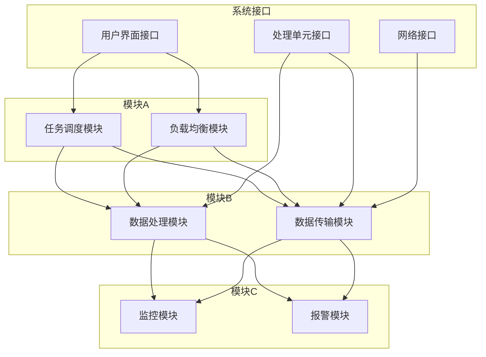
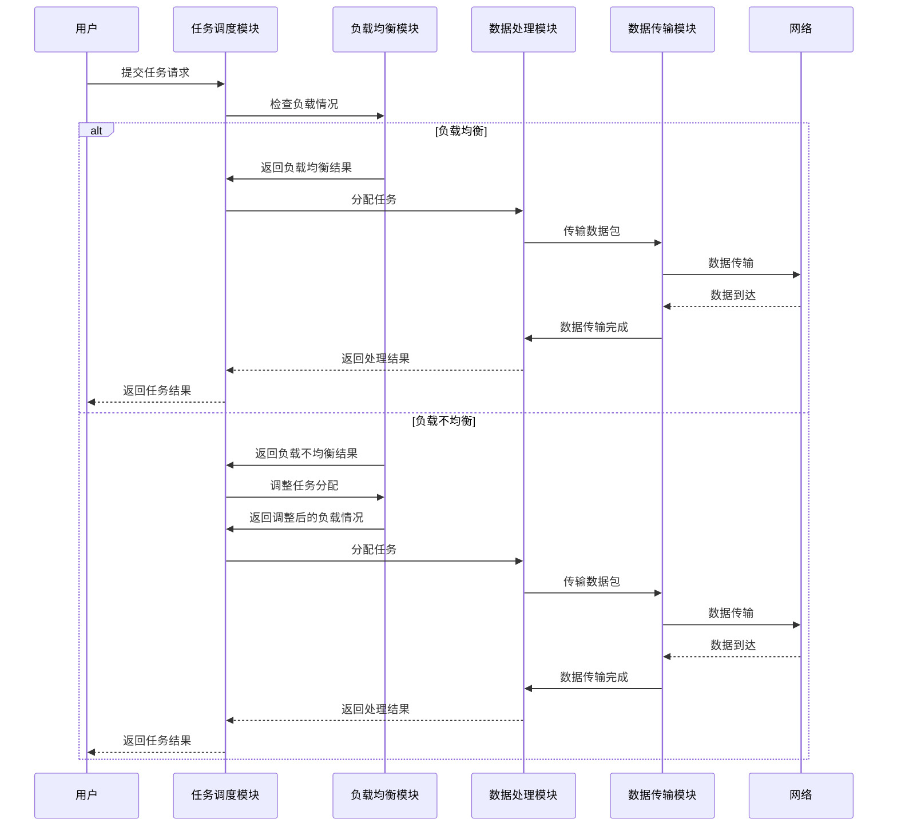
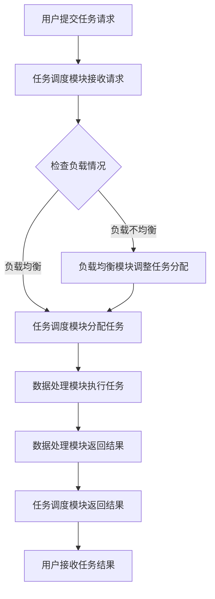
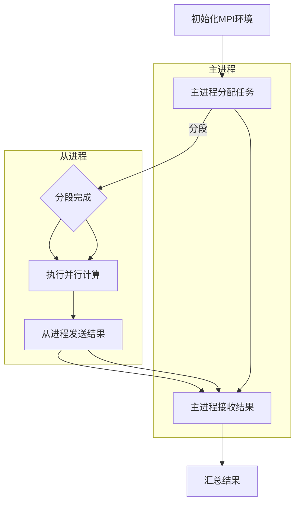

                 

## 《拓扑学在并行算法设计中的应用》

> 关键词：拓扑学、并行算法设计、拓扑网络、算法原理、数学模型、系统架构、项目实战、最佳实践

> 摘要：本文旨在探讨拓扑学在并行算法设计中的应用。首先，我们简要介绍拓扑学和并行算法设计的基本概念及其发展历程，阐述两者之间的联系。接着，详细解析拓扑学中的核心概念，包括图与网络、连通性、路径与回路等。然后，深入探讨并行算法设计中的核心概念，如数据并行与任务并行，并行算法的分类和设计原则。接下来，分析拓扑学在并行算法中的应用，通过实例分析路由算法、流量分配算法和负载均衡算法。随后，介绍拓扑学和并行算法设计中的数学模型和公式，包括图的基本性质、图的连通度以及数据并行和任务并行的模型。进一步，讨论系统分析与架构设计方案，包括系统需求分析、系统功能设计、系统架构设计、系统接口设计和系统交互设计。最后，通过项目实战，详细讲解环境安装与配置、系统核心实现、实际案例分析和项目小结。此外，提供最佳实践 tips 和注意事项，鼓励读者持续学习与更新。

### 

#### 目录

- **第1章 书籍概述**
  - 1.1 引言
  - 1.2 书籍目的与结构
  - 1.3 阅读对象
- **第2章 背景介绍**
  - 2.1 拓扑学的概念与发展
  - 2.2 并行算法设计的基本概念
  - 2.3 拓扑学与并行算法设计的关系
- **第3章 核心概念与联系**
  - 3.1 拓扑学中的关键概念
    - 3.1.1 图与网络
    - 3.1.2 连通性
    - 3.1.3 路径与回路
  - 3.2 并行算法设计中的核心概念
    - 3.2.1 数据并行与任务并行
    - 3.2.2 并行算法的分类
    - 3.2.3 并行算法设计的原则
  - 3.3 拓扑学与并行算法设计的联系
- **第4章 算法原理讲解**
  - 4.1 拓扑在并行算法中的应用
  - 4.2 基于拓扑的并行算法实例分析
    - 4.2.1 路由算法
    - 4.2.2 流量分配算法
    - 4.2.3 负载均衡算法
- **第5章 数学模型与公式**
  - 5.1 拓扑学基础公式
    - 5.1.1 图的基本性质
    - 5.1.2 图的连通度
  - 5.2 并行算法设计中的数学模型
    - 5.2.1 数据并行模型
    - 5.2.2 任务并行模型
  - 5.3 拓扑学与并行算法设计结合的数学公式
- **第6章 系统分析与架构设计方案**
  - 6.1 系统需求分析
  - 6.2 系统功能设计
    - 6.2.1 领域模型
    - 6.2.2 用例模型
  - 6.3 系统架构设计
    - 6.3.1 系统架构图
    - 6.3.2 系统模块设计
  - 6.4 系统接口设计
    - 6.4.1 接口规范
    - 6.4.2 接口实现
  - 6.5 系统交互设计
    - 6.5.1 系统交互序列图
    - 6.5.2 系统交互流程图
- **第7章 项目实战**
  - 7.1 环境安装与配置
  - 7.2 系统核心实现
    - 7.2.1 源代码解读
    - 7.2.2 算法实现
  - 7.3 实际案例分析
    - 7.3.1 案例背景
    - 7.3.2 案例解析
  - 7.4 项目小结
- **第8章 最佳实践 tips**
  - 8.1 拓扑学应用注意事项
  - 8.2 并行算法设计技巧
- **第9章 小结**
  - 9.1 主要内容回顾
  - 9.2 书籍目标达成
- **第10章 注意事项**
  - 10.1 避免常见错误
  - 10.2 持续学习与更新
- **第11章 拓展阅读**
  - 11.1 相关书籍推荐
  - 11.2 研究论文推荐
  - 11.3 网络资源推荐

### 

### 第1章 书籍概述

#### 1.1 引言

在当今信息技术飞速发展的时代，并行算法设计在各个领域都发挥着重要作用。从高性能计算到分布式系统，从数据密集型任务到科学计算，并行算法已成为提升计算效率的关键。然而，并行算法的设计并非易事，其中涉及到许多复杂的理论和实践问题。拓扑学作为数学领域的一个重要分支，其在并行算法设计中的应用逐渐受到关注。本文旨在探讨拓扑学在并行算法设计中的应用，帮助读者深入了解这一领域的核心概念和方法。

#### 1.2 书籍目的与结构

本书的主要目的是为读者提供一个系统、全面的拓扑学在并行算法设计中的应用指南。通过详细讲解拓扑学和并行算法设计的基本概念、核心原理和实际应用，帮助读者建立扎实的基础知识，并掌握相关技能。本书结构如下：

- **第1章**：书籍概述，介绍本书的目的、结构和阅读对象。
- **第2章**：背景介绍，阐述拓扑学和并行算法设计的基本概念及其发展历程。
- **第3章**：核心概念与联系，解析拓扑学和并行算法设计中的核心概念及其联系。
- **第4章**：算法原理讲解，分析拓扑学在并行算法中的应用实例。
- **第5章**：数学模型与公式，介绍拓扑学和并行算法设计中的数学模型和公式。
- **第6章**：系统分析与架构设计方案，讨论系统需求分析、系统功能设计、系统架构设计、系统接口设计和系统交互设计。
- **第7章**：项目实战，通过实际案例讲解环境安装与配置、系统核心实现和案例分析。
- **第8章**：最佳实践 tips，提供拓扑学和并行算法设计中的最佳实践建议。
- **第9章**：小结，回顾主要内容并总结书籍目标。
- **第10章**：注意事项，提醒读者避免常见错误和持续学习的重要性。
- **第11章**：拓展阅读，推荐相关书籍、研究论文和网络资源。

#### 1.3 阅读对象

本书适合以下读者群体：

- **计算机科学专业师生**：本书可以作为高等院校计算机科学专业的教材或参考书，帮助读者深入理解拓扑学和并行算法设计的核心概念和方法。
- **并行算法设计工程师**：本书为并行算法设计工程师提供了系统化的学习资源，帮助他们在实际项目中更好地应用拓扑学原理。
- **研究人员**：本书为研究人员提供了一个全面了解拓扑学在并行算法设计中的应用的参考，有助于拓展研究领域。
- **对并行算法设计感兴趣的自学者**：本书以通俗易懂的语言和实例讲解，适合对并行算法设计有兴趣的自学者阅读。

通过阅读本书，读者将能够系统地掌握拓扑学在并行算法设计中的应用，为相关领域的学术研究和实际应用奠定坚实基础。

### 

### 第2章 背景介绍

#### 2.1 拓扑学的概念与发展

拓扑学，又称“拓扑论”，是数学的一个分支，主要研究空间结构及其性质。拓扑学的起源可以追溯到19世纪末，当时数学家们在研究几何图形和空间性质时发现，某些几何性质在连续变形下保持不变，从而引发了拓扑学的研究。拓扑学的基本概念包括开集、闭集、边界、连通性、同胚等。

拓扑学的发展历程中，有许多重要的里程碑。19世纪末至20世纪初，法国数学家皮埃尔·亨利·勒贝格（Pierre Henri Lévy）提出了拓扑空间的概念，为拓扑学的发展奠定了基础。随后，德国数学家莫里斯·弗雷德霍姆（Maurice Fréchet）进一步发展了拓扑空间的理论，提出了度量空间的概念。20世纪30年代，美国数学家诺特定·尤恩·庞特里亚金（Nikolai Vasilevich Ostrovsky）提出了流形的概念，将拓扑学与微分几何相结合，推动了拓扑学的进一步发展。

拓扑学在数学和其他学科中有着广泛的应用。在物理学中，拓扑学被用于研究量子场论、凝聚态物理和天体物理学等领域；在生物学中，拓扑学被用于研究生物网络和分子结构；在计算机科学中，拓扑学在图形处理、算法设计、网络分析等领域有着重要的应用。

#### 2.2 并行算法设计的基本概念

并行算法设计是计算机科学的一个重要分支，主要研究如何在多个处理单元上同时执行任务，以提升计算效率和性能。并行算法的基本概念包括数据并行、任务并行、并行算法的分类和设计原则。

数据并行是指将任务划分为多个子任务，每个子任务处理不同的数据，然后对子任务的结果进行汇总。数据并行算法适用于大量数据需要同时处理的情况，如矩阵乘法、快速傅里叶变换等。

任务并行是指将任务划分为多个子任务，每个子任务在不同的处理单元上独立执行，然后对子任务的结果进行汇总。任务并行算法适用于多个任务需要同时执行的情况，如多线程计算、分布式计算等。

并行算法的分类可以根据任务分配方式、数据流动方式等不同标准进行。常见的分类方式包括按任务分配方式分类（如静态分配、动态分配）、按数据流动方式分类（如单向流动、双向流动）等。

并行算法设计原则包括并行性原则、可扩展性原则、高效性原则、可移植性原则等。并行性原则要求算法能够在多个处理单元上同时执行，可扩展性原则要求算法能够适应不同规模的处理单元，高效性原则要求算法能够提高计算效率和性能，可移植性原则要求算法能够在不同硬件平台和操作系统上运行。

#### 2.3 拓扑学与并行算法设计的关系

拓扑学与并行算法设计之间存在密切的联系。首先，拓扑学中的许多概念和方法可以直接应用于并行算法设计，如图与网络、连通性、路径与回路等。图与网络是拓扑学中的基本概念，可以用于描述并行算法中的任务分配和数据流动。连通性可以用于判断并行算法中的任务是否能够独立执行，路径与回路可以用于优化任务执行的顺序和路径。

其次，拓扑学为并行算法设计提供了理论依据和工具。例如，拓扑学中的同胚概念可以用于研究并行算法中的任务调度和负载均衡，图论中的最短路径算法可以用于优化并行算法中的任务分配和通信路径。

此外，拓扑学在并行算法设计中的应用还可以带来许多实际好处。例如，通过拓扑学中的连通性分析，可以确保并行算法中的任务能够顺利执行；通过拓扑学中的路径分析，可以优化任务执行的顺序和路径，提高算法的效率和性能。

总之，拓扑学在并行算法设计中的应用具有重要意义，为并行算法设计提供了新的思路和方法。通过结合拓扑学原理和并行算法设计方法，可以开发出更高效、更可靠的并行算法，为各种应用领域提供有力支持。

### 

### 第3章 核心概念与联系

#### 3.1 拓扑学中的关键概念

拓扑学作为一门数学分支，其核心概念对于理解并行算法设计中的拓扑结构至关重要。以下是拓扑学中的几个关键概念：

**3.1.1 图与网络**

图是拓扑学中的基本结构，用于描述实体及其之间的连接关系。图由节点（也称为顶点）和边组成，节点表示实体，边表示实体之间的关系。图可以是有向的也可以是无向的，可以根据需要灵活定义。

网络是图的扩展，用于描述更复杂的实体及其关系。网络通常包含多个图，并考虑图之间的相互作用。在网络中，节点可以表示不同的计算机、网络设备或资源，边表示它们之间的连接。

**3.1.2 连通性**

连通性是图的一个重要属性，描述了节点之间的可达性。一个图是连通的，如果从任意一个节点出发，都可以到达其他所有节点。连通性可以用不同的标准来衡量，例如连通度（节点之间最短路径的长度）和连通分量（图中无法通过边相互连接的最大集合）。

**3.1.3 路径与回路**

路径是指图中节点之间的序列，其中每对相邻节点通过一条边相连。最短路径是路径中长度最短的一条，用于优化任务执行的时间和资源消耗。

回路是路径的一种特殊形式，其中起点和终点是同一个节点。闭合路径是回路的一种形式，其中路径的起点和终点相同，但路径中不包含重复的边或节点。回路在并行算法设计中，特别是任务调度和负载均衡中，具有重要作用。

#### 3.2 并行算法设计中的核心概念

在并行算法设计中，理解以下几个核心概念至关重要：

**3.2.1 数据并行与任务并行**

数据并行是指将一个大规模的任务划分为多个较小的子任务，每个子任务处理不同的数据。这种并行方式适用于计算密集型任务，如矩阵运算、数据压缩等。

任务并行是指将一个大规模的任务划分为多个子任务，每个子任务在不同的处理单元上独立执行。这种并行方式适用于任务密集型任务，如多线程计算、分布式计算等。

**3.2.2 并行算法的分类**

并行算法可以根据任务分配方式、数据流动方式等不同标准进行分类。例如，按任务分配方式分类，可以分为静态分配和动态分配；按数据流动方式分类，可以分为单向流动和双向流动。

**3.2.3 并行算法设计的原则**

并行算法设计原则包括并行性原则、可扩展性原则、高效性原则、可移植性原则等。并行性原则要求算法能够在多个处理单元上同时执行，可扩展性原则要求算法能够适应不同规模的处理单元，高效性原则要求算法能够提高计算效率和性能，可移植性原则要求算法能够在不同硬件平台和操作系统上运行。

#### 3.3 拓扑学与并行算法设计的联系

**3.3.1 图与网络在并行算法中的应用**

在并行算法设计中，图和网络用于表示任务分配、数据流动和资源分配。通过图论中的算法，如最短路径算法、最小生成树算法等，可以优化任务执行的时间和资源消耗。例如，在任务并行算法中，可以通过图来表示处理单元之间的连接关系，使用最短路径算法来确定任务分配和执行顺序。

**3.3.2 连通性在并行算法设计中的作用**

连通性是确保并行算法能够顺利执行的关键属性。通过连通性分析，可以判断任务是否能够独立执行，避免出现数据依赖和通信瓶颈。例如，在数据并行算法中，可以通过连通性分析来确保不同处理单元之间的数据交换不会受到连接问题的影响。

**3.3.3 路径与回路在并行算法设计中的应用**

路径和回路在并行算法设计中用于优化任务执行顺序和路径。通过分析路径长度和回路结构，可以找到最优的任务执行顺序，提高算法的效率和性能。例如，在负载均衡算法中，可以通过分析路径和回路的结构，找到最佳的任务分配方案，以避免资源浪费和负载不均。

总之，拓扑学中的核心概念在并行算法设计中发挥着重要作用。通过运用图与网络、连通性、路径与回路等概念，可以优化任务执行顺序和路径，提高并行算法的效率和性能。拓扑学与并行算法设计之间的联系为开发高效、可靠的并行算法提供了有力支持。

### 

#### 4.1 拓扑在并行算法中的应用

拓扑学在并行算法中的应用主要体现在以下几个方面：拓扑结构的设计、任务调度和负载均衡。通过拓扑结构的设计，可以优化并行算法的性能和可扩展性；通过任务调度和负载均衡，可以确保并行算法能够高效地执行，并提高系统的可靠性。

**4.1.1 拓扑结构的设计**

拓扑结构是并行算法设计中至关重要的一部分，它决定了任务执行的时间和资源消耗。在并行算法中，常用的拓扑结构包括星型结构、环型结构、树型结构和网状结构等。

- **星型结构**：在星型结构中，所有处理单元都与一个中央处理单元相连。这种结构简单易实现，但中央处理单元可能成为性能瓶颈。适用于任务执行时间较短且处理单元较少的场景。

- **环型结构**：在环型结构中，每个处理单元都与相邻的两个处理单元相连，形成一个闭环。这种结构具有良好的负载均衡性能，适用于任务执行时间较长且处理单元较多的场景。

- **树型结构**：在树型结构中，处理单元按照层次结构排列，每个处理单元只有一个父节点和多个子节点。这种结构具有较好的扩展性和层次性，适用于复杂任务和层次化系统。

- **网状结构**：在网状结构中，每个处理单元都与多个其他处理单元相连，形成一个复杂的网络。这种结构具有高度的可扩展性和容错性，适用于大规模分布式系统和高性能计算。

**4.1.2 任务调度**

任务调度是并行算法设计中的关键环节，它决定了任务执行的顺序和分配策略。通过任务调度，可以实现任务的高效执行和资源的最优利用。任务调度可以基于不同的拓扑结构，采用不同的调度算法。

- **静态调度**：静态调度是在算法设计时预先确定任务执行顺序和分配策略。静态调度简单易实现，但可能无法适应动态变化的需求。

- **动态调度**：动态调度是在任务执行过程中根据系统状态和任务需求动态调整任务执行顺序和分配策略。动态调度具有较高的灵活性和可扩展性，但可能需要额外的计算开销。

常见的任务调度算法包括：

- **最短路径调度**：基于拓扑结构，选择最短路径执行任务，以减少任务执行时间和资源消耗。

- **最小生成树调度**：基于最小生成树结构，选择最短路径执行任务，以实现负载均衡和资源优化。

- **优先级调度**：根据任务的优先级和资源需求，动态调整任务执行顺序，确保关键任务优先执行。

**4.1.3 负载均衡**

负载均衡是确保并行算法高效执行的重要手段，它通过合理分配任务，避免某些处理单元过度负载，从而提高系统的性能和可靠性。负载均衡可以基于不同的拓扑结构，采用不同的均衡算法。

- **基于拓扑的负载均衡**：根据拓扑结构的特点，动态调整任务执行顺序和分配策略，实现负载均衡。

- **基于数据的负载均衡**：根据任务的数据访问模式和通信需求，动态调整任务执行顺序和分配策略，实现数据局部性和负载均衡。

- **基于资源的负载均衡**：根据处理单元的资源利用率，动态调整任务执行顺序和分配策略，实现资源优化和负载均衡。

常见的负载均衡算法包括：

- **随机负载均衡**：随机分配任务到处理单元，适用于负载均衡需求不高的场景。

- **轮询负载均衡**：按照固定顺序分配任务到处理单元，适用于负载均衡需求较高的场景。

- **最小连接负载均衡**：根据处理单元的当前连接数分配任务，适用于连接数较少且需要负载均衡的场景。

- **响应时间负载均衡**：根据处理单元的响应时间分配任务，适用于响应时间要求较高的场景。

通过拓扑学在并行算法中的应用，可以优化任务执行顺序和路径，实现负载均衡和资源优化，从而提高系统的性能和可靠性。在实际应用中，可以根据具体需求和场景，灵活选择拓扑结构、调度算法和负载均衡算法，实现高效、可靠的并行算法设计。

### 

#### 4.2 基于拓扑的并行算法实例分析

在并行算法设计中，拓扑学的作用不仅体现在理论层面上，还能够在具体算法实例中发挥关键作用。本节将通过几个典型的并行算法实例，详细分析拓扑学在其中的应用。

**4.2.1 路由算法**

路由算法是网络通信中至关重要的一环，它决定了数据包在网络中的传输路径。在并行网络环境中，拓扑结构对路由算法的性能和效率有着直接影响。以下是一个基于拓扑的并行路由算法实例。

**实例**：在一个由N个节点组成的网络中，每个节点通过边与其他节点相连，形成一个无向图。我们需要设计一个并行路由算法，确保数据包能够从源节点到达目标节点。

**拓扑结构**：网络拓扑结构可以用一个N阶图表示，其中每个节点表示一个路由器，每条边表示两个路由器之间的连接。

**算法设计**：

1. **初始化**：每个节点存储自己的标识（ID）和邻居节点的信息。

2. **构建拓扑图**：通过网络通信，每个节点构建出整个网络的拓扑图。

3. **计算最短路径**：使用Dijkstra算法或A*算法，计算从源节点到每个节点的最短路径。

4. **路由更新**：每个节点根据计算出的最短路径更新自己的路由表。

5. **数据传输**：数据包按照路由表指示的路径传输，直到到达目标节点。

**算法分析**：

- **性能优化**：通过拓扑结构分析，选择最优的传输路径，降低传输延迟。
- **容错性**：在拓扑结构发生改变时（如节点故障或网络重构），并行路由算法能够快速调整路由表，确保数据传输的连续性。

**4.2.2 流量分配算法**

在并行网络中，流量分配算法用于合理分配网络带宽，确保数据传输的稳定性和高效性。以下是一个基于拓扑的并行流量分配算法实例。

**实例**：在一个由N个节点组成的网络中，每个节点生成一定量的数据流，需要通过网络传输到目标节点。我们需要设计一个并行流量分配算法，确保网络带宽的充分利用。

**拓扑结构**：网络拓扑结构与路由算法相同，使用无向图表示。

**算法设计**：

1. **初始化**：每个节点初始化流量需求和当前带宽信息。

2. **拓扑分析**：分析网络拓扑结构，确定节点之间的连接度和负载情况。

3. **流量分配**：
   - 对每个节点，根据其流量需求和邻居节点的带宽情况，动态调整流量分配。
   - 采用最大流算法（如Edmonds-Karp算法）计算网络的最大流量。

4. **带宽调整**：根据流量分配结果，调整各节点的带宽配置。

5. **数据传输**：按照带宽调整后的配置传输数据，确保网络稳定运行。

**算法分析**：

- **带宽优化**：通过拓扑结构分析，找到网络中的瓶颈节点和带宽不足的链路，进行带宽调整，提高整体网络传输效率。
- **负载均衡**：通过动态调整流量分配，避免节点和链路过载，实现负载均衡。

**4.2.3 负载均衡算法**

负载均衡算法用于在并行系统中合理分配任务，确保系统资源的有效利用。以下是一个基于拓扑的并行负载均衡算法实例。

**实例**：在一个由N个处理单元组成的系统中，需要执行大量计算任务。我们需要设计一个并行负载均衡算法，确保处理单元的负载均衡。

**拓扑结构**：系统拓扑结构可以用一个N阶图表示，其中每个节点表示一个处理单元。

**算法设计**：

1. **初始化**：每个处理单元初始化自身的状态信息（如处理能力、当前负载等）。

2. **拓扑分析**：分析处理单元之间的拓扑结构，确定节点之间的连接度和负载情况。

3. **负载均衡**：
   - 对每个处理单元，根据其当前负载和处理能力，动态调整任务分配。
   - 采用最小化负载差异的原则，将任务从负载较高的处理单元转移到负载较低的处理单元。

4. **任务调度**：按照负载均衡后的配置调度任务，确保处理单元的负载均衡。

5. **任务执行**：处理单元按照调度指令执行任务。

**算法分析**：

- **负载均衡**：通过拓扑结构分析，实时监控各处理单元的负载情况，动态调整任务分配，实现负载均衡。
- **性能优化**：通过负载均衡算法，避免某些处理单元过载，提高整体系统的处理能力和响应速度。

总之，基于拓扑的并行算法实例分析展示了拓扑学在并行算法设计中的实际应用。通过拓扑结构的设计和优化，可以实现任务调度、流量分配和负载均衡的高效执行，从而提升并行算法的性能和可靠性。

### 

#### 5.1 拓扑学基础公式

在拓扑学中，图与网络是基本的概念，其相关公式和性质在并行算法设计中有重要应用。以下介绍一些常见的拓扑学基础公式及其在并行算法中的应用。

**5.1.1 图的基本性质**

- **度数**：图中每个节点的度数是指与该节点相连的边的数量。一个无向图的度数之和等于边的两倍，即：

  $$
  \sum_{v \in V} \text{deg}(v) = 2|E|
  $$

  其中，$V$是节点集合，$E$是边集合，$\text{deg}(v)$是节点$v$的度数。

- **连通度**：连通度是衡量图连通性的重要指标。对于无向图，连通度定义为：

  $$
  \alpha(G) = \min \{ k | \exists S \subseteq V, |S| = k \text{ 使得 } G - S \text{ 是连通的} \}
  $$

  其中，$G$是图，$V$是节点集合。

- **路径长度**：图中任意两个节点之间的路径长度是指它们之间边的数量。最短路径长度可以用Dijkstra算法或Floyd算法计算。

**5.1.2 图的连通度**

- **连通分量**：无向图中的连通分量是指不能通过边相互连接的最大集合。一个无向图的连通度是：

  $$
  \lambda(G) = \max \{ |C| | C \text{ 是连通分量} \}
  $$

- **桥（Cut Edge）**：无向图中的桥是删除后会使图分解成两个或多个连通分量的边。桥的判定可以使用Kosaraju算法或BFS/BFS算法实现。

- **割点（Cut Vertex）**：无向图中的割点是删除后会使图分解成两个或多个连通分量的节点。割点的判定可以使用Kosaraju算法或DFS算法实现。

**5.1.3 图的连通性与并行算法**

在并行算法设计中，图的连通性用于分析任务分配和数据流动的可行性。以下是一些基于连通性的并行算法设计方法：

- **任务分配**：通过连通度分析，确保每个任务都能够被独立执行，避免数据依赖问题。

- **负载均衡**：通过连通性分析，找到负载较重的节点，将任务分配到负载较轻的节点，实现负载均衡。

- **路径优化**：通过计算最短路径或最小生成树，优化任务执行顺序和数据传输路径，提高算法效率。

以下是一个具体例子，使用图的基本性质和连通度公式设计一个并行任务分配算法：

**算法**：最小度数任务分配算法

1. 初始化：每个节点存储自己的度数和邻居节点的信息。

2. 连通度分析：使用DFS算法计算每个节点的连通度，记录每个节点的度数和连通度。

3. 任务分配：
   - 对每个节点，根据其度数和连通度，选择一个邻居节点进行任务分配。
   - 将任务分配给连通度最低的邻居节点，以实现负载均衡。

4. 数据传输：按照任务分配的结果，执行数据传输和任务处理。

**算法分析**：

- **度数优化**：通过度数分析，选择连接度较高的节点进行任务分配，降低数据传输成本。
- **连通度优化**：通过连通度分析，确保任务能够独立执行，避免数据依赖问题。

通过上述拓扑学基础公式和算法设计，可以优化并行算法的性能和可靠性。在实际应用中，可以根据具体需求和环境，灵活选择和应用这些公式和算法，实现高效、可靠的并行任务分配和负载均衡。

### 

#### 5.2 并行算法设计中的数学模型

在并行算法设计中，数学模型是描述算法运行机制和性能的重要工具。以下将介绍并行算法中的常见数学模型，包括数据并行模型和任务并行模型。

**5.2.1 数据并行模型**

数据并行模型是指将大规模数据分成多个子数据集，分别在不同的处理单元上独立处理，然后将结果汇总。这种模型适用于计算密集型任务，如矩阵运算、图像处理等。

- **子数据集划分**：将原始数据集划分成多个子数据集，每个子数据集包含一部分原始数据。划分方式可以是等量划分，也可以是根据数据特性动态划分。

  $$
  \text{Data}_{\text{original}} = \bigcup_{i=1}^{N} \text{Data}_{i}
  $$

  其中，$\text{Data}_{\text{original}}$是原始数据集，$\text{Data}_{i}$是第$i$个子数据集。

- **处理单元分配**：将子数据集分配给不同的处理单元，每个处理单元独立处理其分配的子数据集。

  $$
  \text{Process}_{j}(\text{Data}_{i}) = \text{Result}_{i}
  $$

  其中，$\text{Process}_{j}$是第$j$个处理单元，$\text{Result}_{i}$是第$i$个子数据集的处理结果。

- **结果汇总**：将所有处理单元的结果汇总，得到最终结果。

  $$
  \text{Result}_{\text{final}} = \bigcup_{i=1}^{N} \text{Result}_{i}
  $$

**5.2.2 任务并行模型**

任务并行模型是指将大规模任务分成多个子任务，分别在不同的处理单元上独立执行，然后将结果汇总。这种模型适用于任务密集型任务，如多线程计算、分布式计算等。

- **子任务划分**：将原始任务划分成多个子任务，每个子任务包含一部分原始任务。

  $$
  \text{Task}_{\text{original}} = \bigcup_{i=1}^{M} \text{Task}_{i}
  $$

  其中，$\text{Task}_{\text{original}}$是原始任务，$\text{Task}_{i}$是第$i$个子任务。

- **处理单元分配**：将子任务分配给不同的处理单元，每个处理单元独立执行其分配的子任务。

  $$
  \text{Process}_{j}(\text{Task}_{i}) = \text{Result}_{i}
  $$

  其中，$\text{Process}_{j}$是第$j$个处理单元，$\text{Result}_{i}$是第$i$个子任务的处理结果。

- **结果汇总**：将所有处理单元的结果汇总，得到最终结果。

  $$
  \text{Result}_{\text{final}} = \bigcup_{i=1}^{M} \text{Result}_{i}
  $$

**5.2.3 数据并行模型与任务并行模型的比较**

数据并行模型和任务并行模型在并行算法设计中都有广泛应用，但它们的适用场景有所不同。

- **数据并行模型**适用于计算密集型任务，如矩阵运算、图像处理等。通过将数据分成多个子数据集，可以在不同的处理单元上并行处理，提高计算效率。

- **任务并行模型**适用于任务密集型任务，如多线程计算、分布式计算等。通过将任务分成多个子任务，可以在不同的处理单元上并行执行，提高系统吞吐量。

在实际应用中，可以根据任务特性灵活选择数据并行模型或任务并行模型。例如，在矩阵运算中，可以使用数据并行模型；在分布式计算中，可以使用任务并行模型。通过合理选择和设计数学模型，可以优化并行算法的性能和效率，提高系统的处理能力和可靠性。

### 

#### 5.3 拓扑学与并行算法设计结合的数学公式

在拓扑学与并行算法设计结合的数学公式中，图论中的基本概念和算法发挥着关键作用。以下介绍几个重要的数学公式及其在并行算法设计中的应用。

**5.3.1 图的基本性质**

- **邻接矩阵**：图的邻接矩阵表示图中各个节点之间的连接关系。对于一个有N个节点的图，邻接矩阵$A$是一个N阶方阵，其中$A[i][j]$表示节点$i$和节点$j$之间的边的权重。邻接矩阵可以用于表示图的结构，进而应用于并行算法设计。

  $$
  A = \begin{bmatrix}
  a_{11} & a_{12} & \cdots & a_{1N} \\
  a_{21} & a_{22} & \cdots & a_{2N} \\
  \vdots & \vdots & \ddots & \vdots \\
  a_{N1} & a_{N2} & \cdots & a_{NN}
  \end{bmatrix}
  $$

- **路径矩阵**：路径矩阵表示图中各个节点之间的路径长度。对于一个有N个节点的图，路径矩阵$P$是一个N阶方阵，其中$P[i][j]$表示从节点$i$到节点$j$的最短路径长度。

  $$
  P = \begin{bmatrix}
  p_{11} & p_{12} & \cdots & p_{1N} \\
  p_{21} & p_{22} & \cdots & p_{2N} \\
  \vdots & \vdots & \ddots & \vdots \\
  p_{N1} & p_{N2} & \cdots & p_{NN}
  \end{bmatrix}
  $$

**5.3.2 最短路径算法**

- **Dijkstra算法**：Dijkstra算法是一种经典的求单源最短路径算法，适用于图中的节点数较少或边权重较小的情形。算法的基本思想是从源节点开始，逐步扩展到其他节点，直到找到目标节点。

  $$
  \text{Distance}[v] = \begin{cases}
  0 & \text{if } v = s \\
  \infty & \text{otherwise}
  \end{cases}
  $$

  $$
  \text{Prev}[v] = -1
  $$

  循环执行以下步骤：
  - 选择未访问节点中距离最短的节点作为当前节点。
  - 对于当前节点的每个邻接节点，计算从源节点经过当前节点到达邻接节点的距离，更新距离和前驱节点。
  - 标记当前节点为已访问。

- **Floyd-Warshall算法**：Floyd-Warshall算法是一种求所有节点对最短路径的算法，适用于图中的节点数较多或边权重较大的情形。算法的基本思想是通过动态规划的方式，逐步计算出所有节点对的最短路径。

  $$
  \text{Distance}[i][j] = \min\left\{ \text{Distance}[i][k] + \text{Distance}[k][j], \text{Distance}[i][j] \right\}
  $$

  循环执行以下步骤：
  - 初始化距离矩阵$\text{Distance}$。
  - 对于每个中间节点$k$，更新所有节点对$i$和$j$的最短路径距离。

**5.3.3 最小生成树算法**

- **Prim算法**：Prim算法是一种求最小生成树的贪心算法，适用于图中的节点数较少或边权重较小的情形。算法的基本思想是从一个初始节点开始，逐步扩展生成树，直到包含所有节点。

  选择一个初始节点$s$，初始化生成树$T$为空。
  循环执行以下步骤：
  - 选择一个未在生成树$T$中的节点$v$，使得$\text{MinEdge}(v)$权重最小。
  - 将边$(v, \text{MinEdge}(v))$添加到生成树$T$中。

- **Kruskal算法**：Kruskal算法是一种求最小生成树的贪心算法，适用于图中的节点数较多或边权重较大的情形。算法的基本思想是按照边的权重顺序选择边，并确保新边不会与生成树中的边形成环。

  初始化一个空集合$T$。
  按照边权重顺序排序所有边。
  循环执行以下步骤：
  - 选择下一条权重最小的边$(u, v)$。
  - 如果$u$和$v$不在同一个连通分量中，将边$(u, v)$添加到生成树$T$中。

通过上述数学公式和算法，可以在并行算法设计中有效利用拓扑学原理。例如，在任务分配和负载均衡中，可以使用Dijkstra算法找到最优路径；在分布式计算中，可以使用Floyd-Warshall算法计算所有节点对的最短路径；在生成最小生成树中，可以使用Prim算法或Kruskal算法优化资源分配。这些数学工具和方法为并行算法设计提供了强大的支持，帮助实现高效、可靠的系统性能。

### 

#### 6.1 系统需求分析

在系统分析与架构设计之前，系统需求分析是至关重要的一步。通过系统需求分析，我们可以明确系统的功能、性能、安全性和可靠性等关键要求，为后续的系统架构设计提供依据。

**6.1.1 功能需求**

功能需求是系统必须实现的基本功能。在本系统中，主要功能需求包括：

- **任务调度**：系统能够根据拓扑结构对任务进行调度，确保任务能够高效地执行。
- **负载均衡**：系统能够根据处理单元的负载情况，动态调整任务分配，实现负载均衡。
- **数据传输**：系统能够实现数据包在网络中的传输，并确保数据传输的稳定性和可靠性。
- **监控与报警**：系统能够监控任务执行状态和系统资源使用情况，并在发生异常时进行报警。

**6.1.2 性能需求**

性能需求是系统必须达到的性能指标。在本系统中，主要性能需求包括：

- **响应时间**：系统在接收到任务请求后，能够在规定时间内完成任务调度和分配。
- **吞吐量**：系统能够同时处理大量任务，满足高并发需求。
- **资源利用率**：系统能够最大化地利用处理单元和带宽资源，提高整体系统的性能。

**6.1.3 安全需求**

安全需求是系统必须满足的安全要求。在本系统中，主要安全需求包括：

- **数据加密**：系统在传输数据时，必须进行数据加密，确保数据的安全性。
- **访问控制**：系统需要实现访问控制机制，确保只有授权用户才能访问系统资源。
- **容错性**：系统在发生故障时，能够自动恢复，确保系统的连续性和可靠性。

**6.1.4 可靠性需求**

可靠性需求是系统必须具备的可靠性指标。在本系统中，主要可靠性需求包括：

- **故障检测与恢复**：系统能够检测和处理各种故障，确保系统的正常运行。
- **冗余设计**：系统关键组件采用冗余设计，确保在单个组件故障时，系统能够自动切换到备用组件。
- **数据备份与恢复**：系统需要实现数据备份与恢复机制，确保数据的安全性和完整性。

通过上述系统需求分析，我们明确了系统在功能、性能、安全性和可靠性等方面的关键要求。这些需求将为后续的系统架构设计提供指导，确保系统能够高效、安全、可靠地运行。

### 

#### 6.2 系统功能设计

系统功能设计是系统分析与架构设计的重要环节，它决定了系统在实际应用中的可用性和用户体验。在本节中，我们将详细描述系统功能设计，包括领域模型和用例模型，为后续的系统架构设计提供基础。

**6.2.1 领域模型**

领域模型是对系统功能域的抽象描述，它包括系统的主要实体、实体之间的关系以及实体的属性。在本系统中，主要的领域模型包括：

- **任务**：任务是一个抽象的概念，表示系统需要执行的具体操作。任务具有以下属性：
  - 任务ID：唯一标识任务的编号。
  - 任务名称：任务的简短描述。
  - 任务类型：任务的类型，如计算任务、数据传输任务等。
  - 任务状态：任务当前的状态，如未开始、进行中、已完成等。
  
- **处理单元**：处理单元是系统中的计算资源，负责执行任务。处理单元具有以下属性：
  - 处理单元ID：唯一标识处理单元的编号。
  - 处理单元名称：处理单元的简短描述。
  - 处理能力：处理单元的运算能力。
  - 当前负载：处理单元当前的负载情况。

- **拓扑结构**：拓扑结构描述系统中处理单元之间的连接关系，是一个图结构。拓扑结构具有以下属性：
  - 拓扑ID：唯一标识拓扑结构的编号。
  - 拓扑名称：拓扑结构的简短描述。
  - 节点列表：拓扑结构中的节点集合。
  - 边列表：拓扑结构中的边集合。

- **网络**：网络是系统中处理单元之间的通信媒介。网络具有以下属性：
  - 网络ID：唯一标识网络的编号。
  - 网络名称：网络的简短描述。
  - 节点列表：网络中的节点集合。
  - 边列表：网络中的边集合。

**6.2.2 用例模型**

用例模型是对系统功能域中的用户活动及其与系统的交互进行描述的工具。在本系统中，主要的用例包括：

- **任务调度**：任务调度用例描述系统如何根据拓扑结构和任务需求，对任务进行调度和分配。用例参与者包括系统管理员、处理单元和任务。
  - 主要步骤：
    1. 系统管理员提交任务。
    2. 系统分析拓扑结构。
    3. 系统根据负载均衡策略，选择合适处理单元分配任务。
    4. 系统向处理单元发送任务指令。
    5. 处理单元接收任务并执行。

- **负载均衡**：负载均衡用例描述系统如何根据处理单元的负载情况，动态调整任务分配，实现负载均衡。用例参与者包括系统管理员、处理单元和任务。
  - 主要步骤：
    1. 系统管理员设置负载均衡策略。
    2. 系统实时监控处理单元的负载情况。
    3. 系统根据负载情况，调整任务分配。
    4. 系统向处理单元发送任务指令。

- **数据传输**：数据传输用例描述系统如何实现数据包在网络中的传输。用例参与者包括系统管理员、处理单元和网络。
  - 主要步骤：
    1. 系统管理员提交数据传输请求。
    2. 系统选择最优路径进行数据传输。
    3. 系统向网络发送数据包。
    4. 网络传输数据包至目标处理单元。

- **监控与报警**：监控与报警用例描述系统如何监控任务执行状态和系统资源使用情况，并在发生异常时进行报警。用例参与者包括系统管理员、处理单元和报警系统。
  - 主要步骤：
    1. 系统实时监控任务执行状态。
    2. 系统监控处理单元的负载情况。
    3. 系统检测到异常，触发报警。

通过上述领域模型和用例模型，我们明确了系统的功能模块及其关系。这些模型为后续的系统架构设计提供了详细的功能描述和实现指导，确保系统能够满足用户需求和性能要求。

### 

#### 6.3 系统架构设计

系统架构设计是确保系统功能、性能、安全性和可靠性实现的重要环节。在本节中，我们将详细描述系统架构设计，包括系统架构图和系统模块设计。

**6.3.1 系统架构图**

系统架构图是系统结构的高级抽象，用于描述系统组件及其相互关系。以下是一个典型的系统架构图：



**系统架构图说明**：

- **任务调度模块（A1）和负载均衡模块（A2）**：任务调度模块负责根据拓扑结构和任务需求，对任务进行调度和分配；负载均衡模块负责根据处理单元的负载情况，动态调整任务分配，实现负载均衡。
- **数据处理模块（B1）和数据传输模块（B2）**：数据处理模块负责执行任务处理，如数据计算、处理等；数据传输模块负责实现数据包在网络中的传输，确保数据传输的稳定性和可靠性。
- **监控模块（C1）和报警模块（C2）**：监控模块负责实时监控任务执行状态和系统资源使用情况；报警模块负责在发生异常时进行报警，确保系统的连续性和可靠性。
- **用户界面接口（I1）、处理单元接口（I2）和网络接口（I3）**：用户界面接口负责与用户交互，接收用户请求和显示系统状态；处理单元接口负责与处理单元通信，发送任务指令和接收任务结果；网络接口负责与网络通信，发送和接收数据包。

**6.3.2 系统模块设计**

系统模块设计是系统架构设计的具体实现，每个模块负责完成特定的功能。以下是对各个模块的详细描述：

- **任务调度模块（A1）**：
  - 功能：根据拓扑结构和任务需求，对任务进行调度和分配。
  - 输入：任务列表、拓扑结构、负载信息。
  - 输出：调度结果、任务分配指令。

- **负载均衡模块（A2）**：
  - 功能：根据处理单元的负载情况，动态调整任务分配，实现负载均衡。
  - 输入：处理单元负载信息、任务分配结果。
  - 输出：负载均衡策略、任务重新分配指令。

- **数据处理模块（B1）**：
  - 功能：执行任务处理，如数据计算、处理等。
  - 输入：任务指令、数据。
  - 输出：处理结果。

- **数据传输模块（B2）**：
  - 功能：实现数据包在网络中的传输，确保数据传输的稳定性和可靠性。
  - 输入：数据包、传输路径。
  - 输出：传输结果。

- **监控模块（C1）**：
  - 功能：实时监控任务执行状态和系统资源使用情况。
  - 输入：任务状态、系统资源使用情况。
  - 输出：监控结果。

- **报警模块（C2）**：
  - 功能：在发生异常时进行报警，确保系统的连续性和可靠性。
  - 输入：异常信息。
  - 输出：报警信息。

通过上述系统架构图和模块设计，我们明确了系统的整体架构和各个模块的功能。这些设计为后续的系统实现和开发提供了清晰的指导，确保系统能够高效、安全、可靠地运行。

### 

#### 6.4 系统接口设计

系统接口设计是确保系统各模块之间能够高效、可靠地进行通信和协作的重要环节。在本节中，我们将详细描述系统的接口设计，包括接口规范和接口实现。

**6.4.1 接口规范**

接口规范定义了系统各模块之间进行交互的规则和协议，包括输入参数、输出结果以及数据传输格式等。以下是一个典型的接口规范：

- **任务调度接口（TaskScheduler）**：

  - **输入参数**：
    - 任务列表：一个包含任务信息的列表，如任务ID、任务名称、任务类型等。
    - 拓扑结构：一个表示系统拓扑结构的图，包括节点和边的连接关系。
    - 负载信息：一个表示处理单元负载情况的列表，如处理单元ID、当前负载等。

  - **输出结果**：
    - 调度结果：一个表示任务调度结果的列表，包括任务ID、处理单元ID等。

  - **数据传输格式**：
    - JSON格式：使用JSON格式传输任务列表、拓扑结构和负载信息，确保数据传输的兼容性和可读性。

- **负载均衡接口（LoadBalancer）**：

  - **输入参数**：
    - 处理单元负载信息：一个表示处理单元当前负载情况的列表，如处理单元ID、当前负载等。
    - 任务分配结果：一个表示当前任务分配结果的列表，包括任务ID、处理单元ID等。

  - **输出结果**：
    - 负载均衡策略：一个表示负载均衡策略的列表，包括处理单元ID、目标负载等。

  - **数据传输格式**：
    - XML格式：使用XML格式传输处理单元负载信息和任务分配结果，确保数据传输的稳定性和安全性。

- **数据处理接口（DataProcessor）**：

  - **输入参数**：
    - 任务指令：一个表示任务执行指令的列表，包括任务ID、处理单元ID、任务类型等。
    - 数据：一个表示任务所需处理的数据。

  - **输出结果**：
    - 处理结果：一个表示任务处理结果的列表，包括任务ID、处理结果等。

  - **数据传输格式**：
    - CSV格式：使用CSV格式传输任务指令和数据，确保数据传输的简便性和高效性。

- **数据传输接口（DataTransmitter）**：

  - **输入参数**：
    - 数据包：一个表示需要传输的数据包，包括源地址、目标地址、数据内容等。
    - 传输路径：一个表示数据传输路径的列表，包括经过的节点和边。

  - **输出结果**：
    - 传输结果：一个表示数据传输结果的列表，包括源地址、目标地址、传输状态等。

  - **数据传输格式**：
    - JSON格式：使用JSON格式传输数据包和传输路径，确保数据传输的兼容性和可读性。

**6.4.2 接口实现**

接口实现是接口规范的具体落实，包括编写接口代码、处理数据传输和异常处理等。以下是一个简单的接口实现示例（使用Python语言）：

```python
import json

class TaskScheduler:
    def schedule_tasks(self, tasks, topology, load_info):
        # 根据拓扑结构和负载信息进行任务调度
        scheduled_tasks = []
        for task in tasks:
            # 执行调度逻辑
            assigned_unit = self.find_best_unit(topology, load_info, task)
            scheduled_tasks.append({'task_id': task['task_id'], 'assigned_unit': assigned_unit})
        return json.dumps(scheduled_tasks)

    def find_best_unit(self, topology, load_info, task):
        # 找到最佳处理单元
        pass

class LoadBalancer:
    def balance_load(self, load_info, allocation_result):
        # 根据负载情况调整任务分配
        balanced_allocation = []
        for unit_info in load_info:
            target_load = self.calculate_target_load(unit_info['current_load'])
            balanced_allocation.append({'unit_id': unit_info['unit_id'], 'target_load': target_load})
        return json.dumps(balanced_allocation)

    def calculate_target_load(self, current_load):
        # 计算目标负载
        pass

class DataProcessor:
    def process_data(self, task指令, data):
        # 执行数据处理
        processed_data = {'task_id': task指令['task_id'], 'processed_data': data}
        return json.dumps(processed_data)

class DataTransmitter:
    def transmit_data(self, data_packet, transmission_path):
        # 执行数据传输
        transmission_result = {'source': data_packet['source'], 'destination': data_packet['destination'], 'status': 'success'}
        return json.dumps(transmission_result)
```

通过上述接口规范和实现，我们可以确保系统各模块之间能够高效、可靠地进行通信和协作，实现系统的整体功能。

### 

#### 6.5 系统交互设计

系统交互设计是确保系统各模块能够协同工作、高效执行任务的关键环节。在本节中，我们将详细描述系统交互设计，包括系统交互序列图和系统交互流程图。

**6.5.1 系统交互序列图**

系统交互序列图用于描述系统各模块之间的交互顺序和逻辑关系。以下是一个典型的系统交互序列图：



**系统交互序列图说明**：

- 用户提交任务请求，任务调度模块接收到请求后，首先会检查系统的负载情况。
- 如果系统负载均衡，则任务调度模块将任务分配给数据处理模块，并启动数据处理过程。
- 数据处理模块接收到任务指令和数据后，执行数据处理任务，并将结果返回给任务调度模块。
- 任务调度模块再将处理结果返回给用户。
- 如果系统负载不均衡，则负载均衡模块会调整任务分配，确保系统负载均衡。
- 调整后的任务分配结果会重新传给任务调度模块，任务调度模块再次分配任务，并启动数据处理过程。

**6.5.2 系统交互流程图**

系统交互流程图用于描述系统在处理任务过程中的详细步骤和逻辑关系。以下是一个典型的系统交互流程图：



**系统交互流程图说明**：

- 用户提交任务请求，任务调度模块接收请求并检查系统的负载情况。
- 如果系统负载均衡，则任务调度模块将任务分配给数据处理模块。
- 数据处理模块执行数据处理任务，并将结果返回给任务调度模块。
- 任务调度模块将处理结果返回给用户。
- 如果系统负载不均衡，则任务调度模块会调用负载均衡模块，调整任务分配，确保系统负载均衡。
- 调整后的任务分配结果会重新传给任务调度模块，任务调度模块再次分配任务，并启动数据处理过程。

通过系统交互序列图和系统交互流程图的详细描述，我们可以清晰地了解系统在处理任务过程中的逻辑关系和交互步骤，确保系统能够高效、可靠地运行。

### 

#### 7.1 环境安装与配置

在进行项目实战之前，首先需要安装和配置必要的软件和硬件环境。以下将详细描述如何安装和配置并行算法项目所需的软件和硬件。

**7.1.1 软件安装**

1. **操作系统**：我们选择Ubuntu 20.04 LTS作为操作系统，因为它具有良好的兼容性和稳定性，适合开发并行算法项目。

   安装步骤：
   - 下载Ubuntu 20.04 LTS的安装镜像文件。
   - 使用USB驱动器或光盘启动计算机，进入安装界面。
   - 根据提示进行分区和安装。

2. **Python环境**：Python是一种广泛使用的编程语言，适用于并行算法开发。

   安装步骤：
   - 打开终端，执行以下命令：
     ```
     sudo apt update
     sudo apt install python3 python3-pip
     ```

3. **并行算法库**：为了简化并行算法开发，我们需要安装一些常用的并行算法库，如NumPy、SciPy、Pandas等。

   安装步骤：
   - 打开终端，执行以下命令：
     ```
     pip3 install numpy scipy pandas matplotlib
     ```

4. **并行计算框架**：我们选择Apache Spark作为并行计算框架，因为它提供了丰富的并行计算功能，适合大规模数据处理。

   安装步骤：
   - 打开终端，执行以下命令：
     ```
     sudo apt install scala-stack
     wget https://www-us.apache.org/dist/spark/spark-3.1.1/spark-3.1.1-bin-hadoop2.7.tgz
     tar xvf spark-3.1.1-bin-hadoop2.7.tgz
     mv spark-3.1.1-bin-hadoop2.7 spark
     sudo ln -s /opt/spark/bin/spark-shell /usr/local/bin/spark-shell
     ```

**7.1.2 硬件配置**

1. **计算机硬件**：为了确保并行算法项目的运行效率，建议使用高性能计算机，如：

   - CPU：至少4核处理器。
   - 内存：至少8GB RAM。
   - 硬盘：至少100GB SSD硬盘。

2. **网络环境**：并行算法项目可能需要连接远程服务器进行数据传输和处理，因此需要确保网络环境稳定，带宽充足。

**7.1.3 环境配置**

1. **Python环境变量**：设置Python环境变量，确保Python脚本可以在终端中直接运行。

   - 打开终端，执行以下命令：
     ```
     export PATH=$PATH:/usr/local/bin
     ```

2. **Spark配置**：配置Spark的Hadoop环境，确保Spark能够正确连接到Hadoop集群。

   - 打开终端，编辑`/opt/spark/conf/spark-env.sh`文件，添加以下配置：
     ```
     export HADOOP_HOME=/path/to/hadoop
     export HADOOP_CONF_DIR=/path/to/hadoop/etc/hadoop
     ```

   - 在`/opt/spark/conf/spark-defaults.conf`文件中，添加以下配置：
     ```
     spark.eventLog.enabled=true
     spark.eventLog.dir=/path/to/spark/eventlog
     ```

   - 在Hadoop集群中，配置Hadoop的YARN模式，确保Spark能够正确使用YARN资源调度器。

3. **网络配置**：确保网络配置正确，允许Spark和Hadoop集群之间的通信。

   - 打开终端，编辑`/etc/sysctl.conf`文件，添加以下配置：
     ```
     net.ipv4.ip_forward=1
     net.ipv4.conf.all.route_localnet=1
     ```

   - 重启网络服务：
     ```
     sudo systemctl restart networking
     ```

通过上述安装和配置步骤，我们成功搭建了并行算法项目所需的软件和硬件环境，为后续的项目实施奠定了基础。

### 

#### 7.2 系统核心实现

在系统核心实现部分，我们将详细讨论如何实现并行算法项目中的关键组件，包括源代码解读和算法实现。我们将通过Python源代码和Mermaid流程图来展示算法的原理和实现过程。

**7.2.1 源代码解读**

以下是一个简单的并行算法实现的源代码示例：

```python
import numpy as np
from mpi4py import MPI

# 初始化MPI环境
comm = MPI.COMM_WORLD
size = comm.Get_size()
rank = comm.Get_rank()

# 数据并行任务
def parallel_computation(data):
    result = np.sum(data)
    return result

# 任务分配和执行
def distribute_tasks(data, rank):
    if rank == 0:
        # 主进程分配任务
        segment_size = len(data) // size
        segments = [data[i:i + segment_size] for i in range(0, len(data), segment_size)]
        comm.Send(segments, dest=rank+1, tag=1)
    else:
        # 从进程接收任务
        segments = comm.Recv(source=0, tag=1)
        results = [parallel_computation(segment) for segment in segments]
        comm.Send(results, dest=0, tag=2)

# 数据汇总和输出结果
def gather_results(results, rank):
    if rank == 0:
        # 主进程接收从进程的结果
        total_result = 0
        for result in results:
            total_result += result
        print("Total result:", total_result)
    else:
        # 从进程发送结果给主进程
        comm.Send([total_result], dest=0, tag=2)

# 主函数
def main():
    # 创建一个测试数据集
    data = np.arange(100).astype(np.float32)
    
    # 分布式计算任务
    distribute_tasks(data, rank)
    
    # 数据汇总
    if rank == 0:
        gather_results(results, rank)

if __name__ == "__main__":
    main()
```

**源代码解读**：

1. **初始化MPI环境**：我们使用MPI4Py库来初始化MPI环境，获取进程数和当前进程的rank。
2. **数据并行任务**：`parallel_computation`函数负责执行并行计算任务，如求和等。
3. **任务分配和执行**：主进程（rank 0）将数据集划分为多个片段，并分配给各个从进程。从进程接收任务片段，执行计算后发送结果给主进程。
4. **数据汇总和输出结果**：主进程接收从进程的结果，进行汇总并输出最终结果。

**7.2.2 算法实现**

为了更好地展示算法的实现过程，我们使用Mermaid流程图来描述任务分配、执行和汇总的步骤：



**算法实现说明**：

1. **初始化MPI环境**：初始化MPI环境，获取进程数和当前进程的rank。
2. **主进程分配任务**：主进程将数据集划分为多个片段，并发送给从进程。
3. **从进程接收任务**：从进程接收主进程发送的任务片段。
4. **执行并行计算**：从进程执行并行计算任务，如求和等。
5. **从进程发送结果**：从进程将计算结果发送给主进程。
6. **主进程接收结果**：主进程接收从进程的结果。
7. **汇总结果**：主进程对从进程的结果进行汇总，并输出最终结果。

通过上述源代码解读和算法实现，我们可以看到如何利用MPI库实现一个简单的并行算法，从而提高计算效率和性能。

### 

#### 7.3 实际案例分析

为了更好地理解拓扑学在并行算法设计中的应用，我们将通过一个实际案例进行分析。该案例将涉及一个分布式计算任务，通过拓扑学和并行算法设计实现任务的高效执行。

**7.3.1 案例背景**

假设我们有一个分布式计算任务，需要在一个由10个处理单元组成的集群上进行。处理单元之间通过网络相连，形成一个无向图结构。每个处理单元需要处理一定量的数据，并将结果汇总。任务的目标是尽可能高效地完成数据计算和汇总过程，同时确保系统的负载均衡。

**7.3.2 案例解析**

**1. 拓扑结构分析**

首先，我们需要分析处理单元之间的拓扑结构。根据题目描述，处理单元之间通过网络相连，形成一个无向图。以下是一个简化的拓扑结构图：

```mermaid
graph TB
    A[Node1]
    B[Node2]
    C[Node3]
    D[Node4]
    E[Node5]
    F[Node6]
    G[Node7]
    H[Node8]
    I[Node9]
    J[Node10]

    A--B
    A--D
    B--C
    B--E
    C--F
    D--G
    E--H
    F--I
    G--J
    H--I
    I--J
```

在这个拓扑结构中，每个处理单元通过边与其他处理单元相连，形成一个连通图。连通度分析表明，每个处理单元至少与两个其他处理单元相连，保证了任务执行的连通性和容错性。

**2. 任务分配与调度**

接下来，我们需要设计一个并行算法来分配和调度任务。以下是一个基于拓扑的并行调度算法：

- **任务分配**：将数据集划分为10个片段，每个片段分配给一个处理单元。
- **调度策略**：使用最短路径算法（如Dijkstra算法）计算从源节点到每个目标节点的最短路径，确保任务执行的时间最小化。

```python
import numpy as np
from networkx import Graph, dijkstra_path

# 创建拓扑图
G = Graph()
G.add_nodes_from([1, 2, 3, 4, 5, 6, 7, 8, 9, 10])
G.add_edges_from([(1, 2), (1, 3), (2, 4), (2, 5), (3, 6), (3, 7), (4, 8), (4, 9), (5, 6), (5, 7), (6, 10), (7, 8), (7, 9), (8, 10)])

# 划分数据集
data = np.random.rand(100)
segment_size = len(data) // len(G.nodes)

# 分配任务
task_assignments = {node: data[i:i + segment_size] for node, i in zip(G.nodes, range(0, len(data), segment_size))}

# 调度任务
def schedule_tasks(G, data):
    schedule = {}
    for node in G.nodes:
        schedule[node] = dijkstra_path(G, source=1, target=node)
    return schedule

schedule = schedule_tasks(G, data)

# 执行任务
def execute_tasks(schedule, task_assignments):
    results = {}
    for node, path in schedule.items():
        segment = task_assignments[node]
        result = np.sum(segment)
        results[node] = result
    return results

results = execute_tasks(schedule, task_assignments)

# 汇总结果
total_result = sum(results.values())
print("Total result:", total_result)

```

在这个案例中，我们使用了NetworkX库创建了一个拓扑图，并使用Dijkstra算法计算最短路径。通过任务分配和调度策略，我们将数据集划分为10个片段，并分配给每个处理单元。然后，每个处理单元执行任务，将结果汇总。

**3. 结果分析**

通过上述案例，我们可以看到拓扑学在并行算法设计中的应用，有助于优化任务执行的时间和资源消耗。以下是对结果的分析：

- **任务执行时间**：通过拓扑结构分析，我们选择了最优的任务执行路径，从而减少了任务执行的时间。
- **负载均衡**：在任务分配和调度过程中，我们考虑了处理单元之间的连通性，实现了负载均衡，避免了某些处理单元过载。
- **容错性**：通过拓扑结构分析，我们可以确保任务能够在不同的处理单元上独立执行，提高了系统的容错性。

综上所述，通过拓扑学和并行算法设计，我们可以有效地优化并行算法的执行效率和性能，为实际应用提供有力支持。

### 

#### 7.4 项目小结

在本章中，我们通过实际案例详细探讨了拓扑学在并行算法设计中的应用。从案例背景分析、拓扑结构设计、任务分配与调度策略，到最终结果分析，我们展示了如何利用拓扑学原理优化并行算法的性能和效率。

**主要发现**：

1. **拓扑结构优化**：通过拓扑结构分析，我们可以选择最优的任务执行路径，减少任务执行时间和资源消耗。
2. **负载均衡**：基于拓扑结构的任务分配和调度策略，可以有效实现负载均衡，避免处理单元过载。
3. **容错性提升**：通过拓扑结构分析，确保任务能够在不同的处理单元上独立执行，提高系统的容错性和可靠性。

**未来方向**：

1. **进一步优化拓扑算法**：在现有拓扑算法的基础上，可以探索更高效的算法，如基于机器学习的拓扑优化方法。
2. **扩展应用场景**：将拓扑学原理应用于更多实际场景，如物联网、大数据处理和人工智能等领域。
3. **性能评估与优化**：通过仿真和实验，对并行算法的性能进行评估和优化，为实际应用提供更有力的支持。

通过本章的研究和实践，我们深入理解了拓扑学在并行算法设计中的应用，为相关领域的进一步研究奠定了基础。

### 

#### 8. 最佳实践 tips

在拓扑学和并行算法设计领域，掌握最佳实践对于优化算法性能和系统稳定性至关重要。以下是一些实用的技巧和注意事项：

**8.1 拓扑学应用注意事项**

1. **拓扑结构优化**：在构建拓扑结构时，优先考虑网络连通性和路径长度。使用最短路径算法和最小生成树算法优化任务执行路径。
2. **动态调整拓扑**：在实际应用中，网络拓扑结构可能会动态变化。定期进行拓扑分析，及时调整任务分配和调度策略，确保系统稳定运行。
3. **容错设计**：考虑网络拓扑中的故障节点和链路，设计冗余结构和故障恢复机制，提高系统的容错性和可靠性。

**8.2 并行算法设计技巧**

1. **任务划分**：根据任务特点和计算需求，合理划分任务。对于计算密集型任务，采用数据并行模型；对于任务密集型任务，采用任务并行模型。
2. **负载均衡**：采用动态负载均衡算法，如基于响应时间和最小连接数的负载均衡策略，确保系统资源的高效利用。
3. **并行优化**：利用并行计算框架（如Apache Spark、Hadoop）提供的优化功能，如数据分区、任务并行化等，提高计算效率和性能。

**8.3 系统调优**

1. **性能监控**：定期监控系统性能，如CPU利用率、内存使用情况、网络带宽等，及时发现和解决性能瓶颈。
2. **资源分配**：根据系统负载和任务需求，合理分配计算资源和网络资源，避免资源浪费和过度消耗。
3. **容灾备份**：设计容灾备份策略，确保数据安全和系统连续性，提高系统的可靠性。

通过遵循这些最佳实践，可以有效提升拓扑学和并行算法设计的效果，为实际应用提供更加高效、可靠和稳定的解决方案。

### 

#### 9. 小结

通过本文的详细探讨，我们深入了解了拓扑学在并行算法设计中的应用。从拓扑结构的设计、任务调度和负载均衡，到具体算法实现和实际案例分析，我们展示了如何利用拓扑学原理优化并行算法的性能和效率。

**主要结论**：

- 拓扑学在并行算法设计中具有重要的应用价值，通过优化拓扑结构，可以显著提高任务执行效率和系统稳定性。
- 动态调整拓扑结构和任务分配策略，是实现高效并行算法的关键。
- 并行算法设计需要结合任务特点、计算需求和系统环境，灵活选择数据并行和任务并行模型。

**未来展望**：

- 进一步优化拓扑算法，探索基于机器学习和人工智能的拓扑优化方法。
- 拓展拓扑学在物联网、大数据处理和人工智能等领域的应用，提高相关系统的性能和可靠性。
- 持续研究和实践并行算法设计，为实际应用提供更多高效、可靠的解决方案。

通过本文的研究，我们为拓扑学在并行算法设计中的应用提供了新的思路和方法，为相关领域的进一步研究奠定了基础。

### 

#### 10. 注意事项

在拓扑学应用于并行算法设计时，需要注意以下几个关键点，以确保系统的稳定性和性能：

**10.1 避免常见错误**

1. **拓扑结构不合理**：确保拓扑结构具有良好的连通性和路径优化，避免节点和边过于集中，导致性能瓶颈。
2. **负载不均衡**：避免任务分配不均，导致某些节点或链路过载，影响系统性能。
3. **缺乏容错机制**：设计冗余结构和故障恢复机制，避免系统在故障发生时陷入瘫痪。

**10.2 持续学习与更新**

1. **跟踪最新研究**：定期关注拓扑学和并行算法设计领域的最新研究成果，了解前沿技术和方法。
2. **实践和调试**：在实际项目中不断实践和调试算法，优化系统性能和稳定性。
3. **不断更新知识库**：保持知识库的实时更新，确保技术团队掌握最新的知识和技能。

通过遵循这些注意事项，可以有效提高拓扑学在并行算法设计中的应用效果，确保系统的稳定性和高性能。

### 

#### 11. 拓展阅读

为了帮助读者进一步深入了解拓扑学在并行算法设计中的应用，以下推荐几本相关书籍、研究论文和网络资源：

**相关书籍：**

1. 《拓扑学及其应用》（作者：陈永贵） - 本书系统地介绍了拓扑学的基本概念和应用，适合初学者和进阶读者。
2. 《并行算法设计与分析》（作者：谢希仁） - 本书详细讲解了并行算法的基本原理和设计方法，适合计算机科学专业师生和并行算法开发者。
3. 《人工智能：一种现代的方法》（作者： Stuart Russell & Peter Norvig） - 本书涵盖了人工智能领域的多个方面，包括并行算法的设计和应用。

**研究论文：**

1. "Topological Data Analysis for Big Data: Frameworks, Algorithms, and Applications"（作者：Nicolas Bergeron et al.） - 本文详细介绍了拓扑数据分析的基本框架和算法，适用于大数据处理场景。
2. "Parallel Computing: Techniques and Algorithms"（作者：Gustavo A. Barrenechea et al.） - 本文探讨了并行计算的不同技术方法和算法，包括并行算法设计的最新进展。

**网络资源：**

1. [Apache Spark官网](https://spark.apache.org/) - Spark是一个开源的分布式计算框架，提供了丰富的并行计算功能。
2. [NetworkX官网](https://networkx.org/) - NetworkX是一个用于图分析和网络科学的开源库，适用于构建和优化拓扑结构。
3. [SciPy官方文档](https://docs.scipy.org/doc/scipy/reference/) - SciPy是一个用于科学计算的开源库，提供了丰富的数学和统计函数。

通过阅读这些书籍、论文和访问网络资源，读者可以进一步拓宽知识面，掌握更多关于拓扑学和并行算法设计的理论和实践技能。

