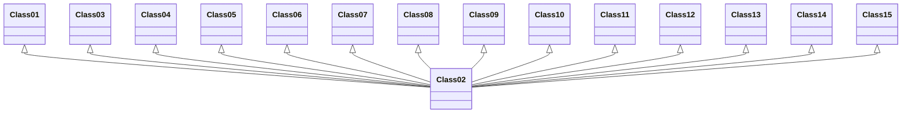
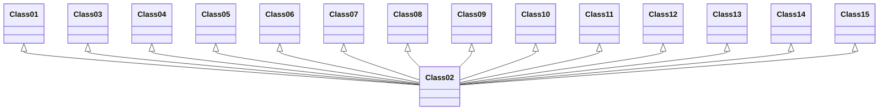
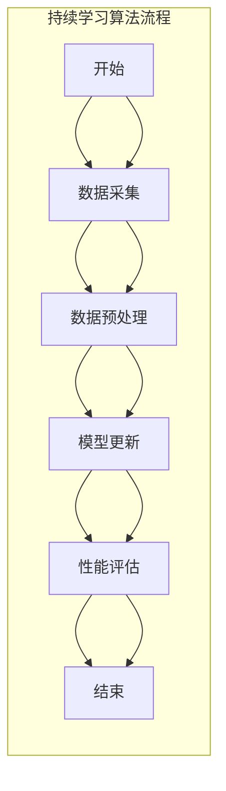
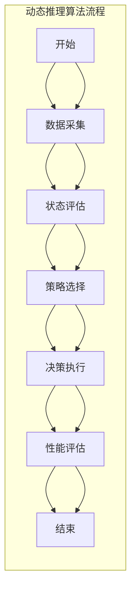
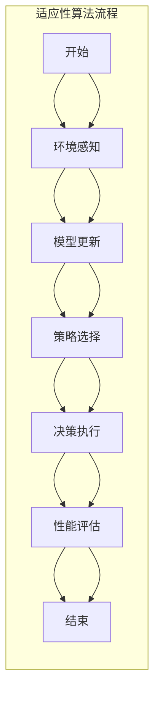

                 

### 关键词

持续学习，动态推理，适应性，人工智能，算法原理

### 摘要

本文探讨了持续学习范式在动态推理任务中的应用。首先，介绍了持续学习的概念和其在人工智能领域的重要性，以及动态推理任务的基本概念和适应性的重要性。接着，详细阐述了持续学习范式和其在动态推理任务中的具体应用，包括核心概念、算法原理和系统架构设计。通过实例分析和项目实战，展示了持续学习范式在实际动态推理任务中的效果。最后，提出了最佳实践、注意事项和未来研究方向，为读者提供全面的指导。

## 目录大纲

1. **第一部分：背景介绍**
   1. 第1章：持续学习的概念与重要性
      1.1 持续学习的定义与特点
      1.2 持续学习在人工智能领域的应用
      1.3 动态推理任务及其适应性的重要性
   2. 第2章：动态推理任务与适应性问题
      2.1 动态推理任务的基本概念
      2.2 动态推理任务的挑战
      2.3 适应性在动态推理任务中的作用
   3. 第3章：持续学习范式与适应性问题
      3.1 持续学习范式概述
      3.2 持续学习范式在动态推理任务中的应用
      3.3 适应性问题在持续学习范式中的解决方案

2. **第二部分：核心概念与联系**
   1. 第4章：核心概念原理
      4.1 持续学习的核心概念
      4.2 动态推理任务的核心概念
      4.3 适应性理论
   2. 第5章：概念属性特征对比
      5.1 持续学习与静态学习的对比
      5.2 动态推理任务与静态推理任务的对比
      5.3 适应性特征对比
   3. 第6章：ER实体关系图架构
      6.1 持续学习范式中的实体关系
      6.2 动态推理任务中的实体关系
      6.3 适应性的实体关系

3. **第三部分：算法原理讲解**
   1. 第7章：持续学习算法原理
      7.1 持续学习算法概述
      7.2 持续学习算法的数学模型
      7.3 持续学习算法的mermaid流程图
      7.4 持续学习算法的Python源代码实现
   2. 第8章：动态推理算法原理
      8.1 动态推理算法概述
      8.2 动态推理算法的数学模型
      8.3 动态推理算法的mermaid流程图
      8.4 动态推理算法的Python源代码实现
   3. 第9章：适应性算法原理
      9.1 适应性算法概述
      9.2 适应性算法的数学模型
      9.3 适应性算法的mermaid流程图
      9.4 适应性算法的Python源代码实现

4. **第四部分：系统分析与架构设计方案**
   1. 第10章：问题场景介绍
      10.1 动态推理任务的应用场景
      10.2 持续学习的应用场景
      10.3 适应性的应用场景
   2. 第11章：系统功能设计
      11.1 领域模型
      11.2 功能模块划分
      11.3 功能模块详解
   3. 第12章：系统架构设计
      12.1 系统架构概述
      12.2 系统架构图
   4. 第13章：系统接口设计
      13.1 接口设计原则
      13.2 接口设计规范
   5. 第14章：系统交互
      14.1 系统交互概述
      14.2 系统交互序列图

5. **第五部分：项目实战**
   1. 第15章：环境安装
      15.1 环境搭建步骤
      15.2 环境配置与调试
   2. 第16章：系统核心实现
      16.1 持续学习模块
      16.2 动态推理模块
      16.3 适应性模块
   3. 第17章：代码应用解读与分析
      17.1 持续学习代码解读
      17.2 动态推理代码解读
      17.3 适应性代码解读
   4. 第18章：实际案例分析与讲解
      18.1 案例一：动态推理任务适应案例分析
      18.2 案例二：持续学习在动态推理中的应用
      18.3 案例三：适应性算法案例分析
   5. 第19章：项目小结
      19.1 项目总结
      19.2 项目亮点与不足
      19.3 未来研究方向

6. **第六部分：最佳实践 tips、小结、注意事项、拓展阅读等内容**
   1. 第20章：最佳实践 tips
   2. 第21章：小结
   3. 第22章：注意事项
   4. 第23章：拓展阅读

### 第一部分：背景介绍

#### 第1章：持续学习的概念与重要性

##### 1.1.1 持续学习的定义与特点

持续学习，又称终身学习，指的是个体在其生命过程中不断获取新知识、技能和经验的过程。在人工智能领域，持续学习尤为重要，因为人工智能系统需要不断适应和优化，以应对快速变化的环境和任务需求。持续学习的特点主要包括：

- **适应性**：持续学习能够使人工智能系统在新的情境中迅速适应，保持高效的性能。
- **灵活性**：持续学习允许人工智能系统在多种任务和环境中灵活调整和改进。
- **动态性**：持续学习能够使系统不断更新知识库，适应新的数据和变化。

##### 1.1.2 持续学习在人工智能领域的应用

在人工智能领域，持续学习已被广泛应用于多个子领域，包括：

- **自然语言处理**：例如，聊天机器人和翻译系统需要持续学习新的词汇和语境，以提供更准确的翻译和对话。
- **计算机视觉**：持续学习帮助计算机视觉系统识别和分类新的图像和视频，从而适应不同的拍摄条件和场景。
- **游戏AI**：如围棋和扑克游戏的AI选手，需要持续学习新的策略和对手的行为模式，以保持竞争优势。

##### 1.1.3 动态推理任务及其适应性的重要性

动态推理任务是指系统在运行过程中需要不断接收新的信息，并基于这些信息进行推理和决策的任务。这类任务通常具有以下特点：

- **数据动态变化**：输入数据在任务执行过程中不断更新，系统需要实时适应新的数据。
- **不确定性**：动态推理任务中的数据可能存在噪声、缺失或不完整性，系统需要具备处理不确定性的能力。

适应性在动态推理任务中扮演了关键角色。具体来说，适应性包括：

- **模型适应**：系统可以根据新的数据动态调整模型参数，以提高推理的准确性。
- **策略调整**：系统可以根据新的信息更新决策策略，以优化任务执行效果。

#### 第2章：动态推理任务与适应性问题

##### 2.1.1 动态推理任务的基本概念

动态推理任务是指系统在运行过程中需要不断接收新的信息，并基于这些信息进行推理和决策的任务。动态推理任务的特点包括：

- **实时性**：系统需要在短时间内处理并响应该数据。
- **动态性**：输入数据在不断变化，系统需要实时适应这些变化。
- **不确定性**：动态推理任务中的数据可能存在噪声、缺失或不完整性。

##### 2.1.2 动态推理任务的挑战

动态推理任务面临的主要挑战包括：

- **数据噪声**：动态推理任务中的数据可能包含噪声，这会影响推理的准确性。
- **数据缺失**：部分数据可能缺失，系统需要处理这种不完整的数据。
- **实时性要求**：系统需要在短时间内完成推理和决策，这要求算法具有较高的效率和鲁棒性。

##### 2.1.3 适应性在动态推理任务中的作用

适应性在动态推理任务中的作用主要体现在以下几个方面：

- **实时更新模型**：系统可以根据新的数据实时调整模型参数，提高推理的准确性。
- **优化决策策略**：系统可以根据新的信息动态调整决策策略，以优化任务执行效果。
- **鲁棒性增强**：适应性可以帮助系统在面对噪声和缺失数据时保持较高的鲁棒性，从而确保系统的稳定运行。

#### 第3章：持续学习范式与适应性问题

##### 3.1.1 持续学习范式概述

持续学习范式是一种基于持续学习的系统架构，旨在使人工智能系统能够在任务执行过程中不断学习和适应。持续学习范式的核心思想包括：

- **动态调整**：系统可以根据新的数据动态调整模型参数和决策策略。
- **增量学习**：系统可以通过增量学习来优化模型，而无需重新训练整个模型。
- **模型集成**：系统可以通过集成多个模型来提高推理的准确性和鲁棒性。

##### 3.1.2 持续学习范式在动态推理任务中的应用

持续学习范式在动态推理任务中的应用主要体现在以下几个方面：

- **实时更新模型**：系统可以根据新的数据实时调整模型参数，以提高推理的准确性。
- **动态调整策略**：系统可以根据新的信息动态调整决策策略，以优化任务执行效果。
- **增强鲁棒性**：持续学习范式可以帮助系统在面对噪声和缺失数据时保持较高的鲁棒性，从而确保系统的稳定运行。

##### 3.1.3 适应性问题在持续学习范式中的解决方案

在持续学习范式中，适应性问题主要包括以下几个方面：

- **模型适应性**：系统需要能够根据新的数据动态调整模型参数，以提高推理的准确性。
- **策略适应性**：系统需要能够根据新的信息动态调整决策策略，以优化任务执行效果。
- **鲁棒性适应性**：系统需要能够在面对噪声和缺失数据时保持较高的鲁棒性。

为解决上述适应性问题，持续学习范式采用了以下几种解决方案：

- **在线学习**：系统可以在任务执行过程中实时更新模型，从而提高模型适应性。
- **迁移学习**：系统可以通过迁移学习利用已有模型的知识，提高新任务的推理能力。
- **模型集成**：系统可以通过集成多个模型来提高推理的准确性和鲁棒性。

### 第二部分：核心概念与联系

#### 第4章：核心概念原理

##### 4.1 持续学习的核心概念

持续学习的核心概念包括：

- **增量学习**：系统通过不断更新模型参数来优化学习效果。
- **动态调整**：系统可以根据新的数据动态调整模型和策略。
- **模型集成**：系统通过集成多个模型来提高推理能力。

##### 4.2 动态推理任务的核心概念

动态推理任务的核心概念包括：

- **实时性**：系统需要在短时间内处理并响应该数据。
- **动态性**：输入数据在不断变化，系统需要实时适应这些变化。
- **不确定性**：动态推理任务中的数据可能存在噪声、缺失或不完整性。

##### 4.3 适应性理论

适应性理论的核心概念包括：

- **模型适应性**：系统需要能够根据新的数据动态调整模型参数。
- **策略适应性**：系统需要能够根据新的信息动态调整决策策略。
- **鲁棒性适应性**：系统需要能够在面对噪声和缺失数据时保持较高的鲁棒性。

#### 第5章：概念属性特征对比

##### 5.1 持续学习与静态学习的对比

持续学习与静态学习的对比如下表所示：

| 特征       | 持续学习                             | 静态学习                             |
| ---------- | ------------------------------------ | ------------------------------------ |
| 学习方式   | 增量学习，动态调整模型和策略       | 全量学习，模型和策略不随时间变化   |
| 数据处理   | 可以处理动态变化的数据             | 数据固定，不随时间变化             |
| 鲁棒性     | 较高的鲁棒性，能够适应噪声和数据缺失 | 较低的鲁棒性，容易受到噪声和缺失的影响 |
| 学习效率   | 较高的学习效率，能够快速适应新数据 | 较低的学习效率，适应新数据较慢     |

##### 5.2 动态推理任务与静态推理任务的对比

动态推理任务与静态推理任务的对比如下表所示：

| 特征       | 动态推理任务                             | 静态推理任务                             |
| ---------- | ------------------------------------ | ------------------------------------ |
| 数据处理   | 处理动态变化的数据             | 数据固定，不随时间变化             |
| 实时性     | 需要在短时间内处理数据           | 数据处理时间不固定，但通常较短   |
| 鲁棒性     | 较高的鲁棒性，能够适应噪声和数据缺失 | 较低的鲁棒性，容易受到噪声和缺失的影响 |
| 学习方式   | 需要持续学习，模型和策略动态调整 | 模型和策略不随时间变化，通常一次学习 |

##### 5.3 适应性特征对比

适应性特征对比如下表所示：

| 适应性特征     | 模型适应性                             | 策略适应性                             | 鲁棒性适应性                             |
| ------------- | ------------------------------------ | ------------------------------------ | ------------------------------------ |
| 模型适应性定义 | 系统根据新数据动态调整模型参数       | 系统根据新信息动态调整决策策略       | 系统在噪声和缺失数据下保持较高性能   |
| 模型适应性影响 | 提高推理准确性                       | 提高任务执行效果                     | 提高系统稳定性                         |
| 策略适应性定义 | 系统根据新信息动态调整决策策略       | 系统根据新信息动态调整决策策略       | 系统在噪声和缺失数据下保持较高性能   |
| 策略适应性影响 | 提高任务执行效果                     | 提高任务执行效果                     | 提高系统稳定性                         |
| 鲁棒性适应性定义 | 系统在噪声和缺失数据下保持较高性能   | 系统在噪声和缺失数据下保持较高性能   | 系统在噪声和缺失数据下保持较高性能   |
| 鲁棒性适应性影响 | 提高系统稳定性                       | 提高系统稳定性                       | 提高系统稳定性                         |

#### 第6章：ER实体关系图架构

##### 6.1 持续学习范式中的实体关系

持续学习范式中的实体关系可以用ER图表示，如下图所示：



实体包括：持续学习系统、动态推理任务、适应性模型、数据源、目标函数等。

##### 6.2 动态推理任务中的实体关系

动态推理任务中的实体关系可以用ER图表示，如下图所示：



实体包括：动态推理系统、输入数据、输出结果、决策策略、环境状态等。

##### 6.3 适应性的实体关系

适应性的实体关系可以用ER图表示，如下图所示：


实体包括：适应性模型、学习算法、适应策略、环境反馈、性能评估等。

### 第三部分：算法原理讲解

#### 第7章：持续学习算法原理

##### 7.1 持续学习算法概述

持续学习算法是一种能够使人工智能系统在任务执行过程中不断学习和适应的算法。持续学习算法的核心思想是通过增量学习来优化模型，而不是通过全量学习重新训练整个模型。这样不仅可以提高学习效率，还可以保持模型的稳定性。

持续学习算法的基本流程包括：

1. **数据采集**：系统从环境中采集新的数据。
2. **数据预处理**：对采集到的数据进行分析和清洗，去除噪声和缺失数据。
3. **模型更新**：利用新的数据对模型进行更新，以提高模型的准确性和鲁棒性。
4. **性能评估**：对更新后的模型进行性能评估，确保模型能够满足任务需求。

##### 7.2 持续学习算法的数学模型

持续学习算法的数学模型主要包括以下几个方面：

- **损失函数**：损失函数用于评估模型的预测结果与真实值之间的差异。常见的损失函数包括均方误差（MSE）和交叉熵损失（Cross-Entropy Loss）。
  
  $$L(y, \hat{y}) = \frac{1}{2}||y - \hat{y}||^2$$
  $$L(y, \hat{y}) = -\sum_{i=1}^{n} y_i \log(\hat{y}_i)$$

- **优化算法**：优化算法用于更新模型的参数，以最小化损失函数。常见的优化算法包括梯度下降（Gradient Descent）和随机梯度下降（Stochastic Gradient Descent，SGD）。

  $$\theta_{t+1} = \theta_{t} - \alpha \nabla_{\theta} L(\theta)$$

- **学习率**：学习率（learning rate）是优化算法中的一个重要参数，用于控制模型更新的步长。学习率过大可能导致模型更新不稳定，过小则可能导致学习效率低下。

  $$\alpha = \frac{1}{\sqrt{t}}$$

##### 7.3 持续学习算法的mermaid流程图

下面是持续学习算法的mermaid流程图：



##### 7.4 持续学习算法的Python源代码实现

下面是一个简单的持续学习算法的Python代码实现，使用均方误差损失函数和随机梯度下降优化算法：

```python
import numpy as np

# 参数设置
learning_rate = 0.01
num_iterations = 1000
batch_size = 32

# 模型参数初始化
weights = np.random.rand(10, 1)
biases = np.random.rand(1)

# 损失函数
def loss(y, y_hat):
    return 0.5 * np.mean((y - y_hat) ** 2)

# 优化算法
def gradient_descent(x, y, weights, biases, learning_rate, num_iterations):
    for i in range(num_iterations):
        y_hat = np.dot(x, weights) + biases
        loss_val = loss(y, y_hat)
        
        weights_gradient = np.dot(x.T, (y_hat - y)) / batch_size
        biases_gradient = np.mean(y_hat - y)
        
        weights -= learning_rate * weights_gradient
        biases -= learning_rate * biases_gradient
        
        if i % 100 == 0:
            print(f"Iteration {i}: Loss = {loss_val}")
    
    return weights, biases

# 数据集
x_train = np.random.rand(100, 10)
y_train = np.random.rand(100, 1)

# 训练模型
weights, biases = gradient_descent(x_train, y_train, weights, biases, learning_rate, num_iterations)

# 预测
y_pred = np.dot(x_train, weights) + biases
print(f"Predictions: {y_pred}")
```

#### 第8章：动态推理算法原理

##### 8.1 动态推理算法概述

动态推理算法是一种能够在动态环境中进行推理和决策的算法。动态推理算法的核心思想是在任务执行过程中，根据不断变化的环境信息和历史数据，动态调整推理策略，以实现最优的决策。

动态推理算法的基本流程包括：

1. **数据采集**：系统从环境中采集新的数据。
2. **状态评估**：对采集到的数据进行处理和分析，评估当前的状态。
3. **策略选择**：根据当前状态和历史数据，选择最优的推理策略。
4. **决策执行**：执行选定的策略，并更新状态。
5. **性能评估**：对决策结果进行评估，以便调整未来的策略。

##### 8.2 动态推理算法的数学模型

动态推理算法的数学模型主要包括以下几个方面：

- **状态表示**：状态表示算法的当前状态，通常使用向量或状态空间表示。状态向量中的每个元素表示当前状态的一个特征。
  
  $$S_t = [s_{t1}, s_{t2}, \ldots, s_{tn}]^T$$

- **策略表示**：策略表示算法在特定状态下选择的行为。策略通常是一个决策函数，用于将状态映射到动作。
  
  $$\pi(s_t) = a_t$$

- **动作表示**：动作表示算法执行的操作。动作可以是环境中的一个具体动作，也可以是抽象的动作类别。
  
  $$A_t = [a_{t1}, a_{t2}, \ldots, a_{tm}]^T$$

- **奖励函数**：奖励函数用于评估算法的决策效果。奖励可以是正的或负的，表示决策的好坏。

  $$R_t = r(s_t, a_t)$$

##### 8.3 动态推理算法的mermaid流程图

下面是动态推理算法的mermaid流程图：



##### 8.4 动态推理算法的Python源代码实现

下面是一个简单的动态推理算法的Python代码实现，使用Q-learning算法：

```python
import numpy as np
import random

# 参数设置
learning_rate = 0.1
discount_factor = 0.9
epsilon = 0.1
num_episodes = 1000
state_space = [0, 1, 2]
action_space = [0, 1]

# 状态-动作价值表
Q = np.zeros((len(state_space), len(action_space)))

# 环境模拟
def environment(state, action):
    if action == 0:
        if state == 0:
            reward = 10
        elif state == 1:
            reward = 5
        else:
            reward = 0
    else:
        if state == 0:
            reward = -10
        elif state == 1:
            reward = -5
        else:
            reward = 0
    next_state = state
    return next_state, reward

# Q-learning算法
def q_learning(state, action, reward, next_state, Q, learning_rate, discount_factor):
    Q[state, action] = Q[state, action] + learning_rate * (reward + discount_factor * np.max(Q[next_state]) - Q[state, action])

# 训练模型
for episode in range(num_episodes):
    state = random.randint(0, len(state_space) - 1)
    done = False
    while not done:
        action = random.randint(0, len(action_space) - 1)
        next_state, reward = environment(state, action)
        q_learning(state, action, reward, next_state, Q, learning_rate, discount_factor)
        state = next_state
        if state == 0:
            done = True

# 预测
state = random.randint(0, len(state_space) - 1)
action = np.argmax(Q[state])
print(f"Predicted action for state {state}: {action}")
```

#### 第9章：适应性算法原理

##### 9.1 适应性算法概述

适应性算法是一种使系统在动态环境中能够持续适应和优化的算法。适应性算法的核心思想是通过不断更新模型参数和决策策略，使系统能够应对环境变化和不确定性。

适应性算法的基本流程包括：

1. **环境感知**：系统感知当前的环境状态，包括外部输入和内部状态。
2. **模型更新**：系统根据当前环境状态更新模型参数，以提高模型适应环境的能力。
3. **策略选择**：系统根据更新后的模型选择最优策略。
4. **决策执行**：系统执行选定的策略，并在执行过程中收集反馈信息。
5. **性能评估**：系统评估决策效果，并根据评估结果调整模型参数和策略。

##### 9.2 适应性算法的数学模型

适应性算法的数学模型主要包括以下几个方面：

- **状态表示**：状态表示系统当前的环境状态，通常使用向量或状态空间表示。
  
  $$S_t = [s_{t1}, s_{t2}, \ldots, s_{tn}]^T$$

- **策略表示**：策略表示系统在特定状态下选择的行为，通常使用概率分布表示。
  
  $$\pi(s_t) = [p_{t1}, p_{t2}, \ldots, p_{tm}]^T$$

- **动作表示**：动作表示系统执行的操作，通常使用离散的动作集表示。
  
  $$A_t = [a_{t1}, a_{t2}, \ldots, a_{tm}]^T$$

- **奖励函数**：奖励函数用于评估系统在执行动作后的效果，通常表示为奖励值。
  
  $$R_t = r(s_t, a_t)$$

##### 9.3 适应性算法的mermaid流程图

下面是适应性算法的mermaid流程图：



##### 9.4 适应性算法的Python源代码实现

下面是一个简单的适应性算法的Python代码实现，使用遗传算法：

```python
import numpy as np
import random

# 参数设置
population_size = 100
num_generations = 100
mutation_rate = 0.01
crossover_rate = 0.8

# 初始种群
population = np.random.rand(population_size, 2)

# 环境模拟
def environment(state):
    if state[0] < state[1]:
        reward = 1
    else:
        reward = -1
    return reward

# 适应度评估
def fitness(population):
    fitness_values = []
    for individual in population:
        reward = environment(individual)
        fitness_values.append(reward)
    return fitness_values

# 选择
def selection(population, fitness_values):
    sorted_population = [x for _, x in sorted(zip(fitness_values, population), reverse=True)]
    return sorted_population[:population_size]

# 交叉
def crossover(parent1, parent2):
    if random.random() < crossover_rate:
        crossover_point = random.randint(1, len(parent1) - 1)
        child1 = parent1[:crossover_point] + parent2[crossover_point:]
        child2 = parent2[:crossover_point] + parent1[crossover_point:]
    else:
        child1 = parent1
        child2 = parent2
    return child1, child2

# 变异
def mutate(individual):
    if random.random() < mutation_rate:
        mutation_point = random.randint(0, len(individual) - 1)
        individual[mutation_point] = random.random()
    return individual

# 训练模型
for generation in range(num_generations):
    fitness_values = fitness(population)
    selected_population = selection(population, fitness_values)
    new_population = []
    for _ in range(population_size // 2):
        parent1, parent2 = random.sample(selected_population, 2)
        child1, child2 = crossover(parent1, parent2)
        new_population.extend([mutate(child1), mutate(child2)])
    population = new_population

# 预测
best_individual = max(population, key=fitness)
print(f"Best individual: {best_individual}")
```

### 第四部分：系统分析与架构设计方案

#### 第10章：问题场景介绍

##### 10.1 动态推理任务的应用场景

动态推理任务的应用场景主要包括以下几个方面：

1. **金融交易**：动态推理算法可以用于金融市场中的交易决策，如股票交易、期货交易等。通过分析实时市场数据，动态调整交易策略，以实现最大化收益。
2. **自动驾驶**：自动驾驶系统需要实时处理来自传感器和摄像头的大量数据，并根据这些数据进行推理和决策。动态推理任务可以用于路径规划、障碍物检测和避让等。
3. **智能家居**：智能家居系统需要根据用户的习惯和环境变化进行动态调整，如自动调节室内温度、亮度和安全措施等。动态推理任务可以用于实现智能家居的智能化控制。
4. **医疗诊断**：医疗诊断系统需要根据患者的实时数据进行分析和推理，以提供准确的诊断结果。动态推理任务可以用于疾病预测、病情监测和治疗方案优化等。

##### 10.2 持续学习的应用场景

持续学习的应用场景主要包括以下几个方面：

1. **语音识别**：语音识别系统需要不断学习新的语音特征，以适应不同说话人的语音变化。持续学习可以用于提高语音识别的准确性和鲁棒性。
2. **图像识别**：图像识别系统需要根据不断更新的图像数据，学习新的图像特征，以实现更准确的图像分类和识别。持续学习可以帮助图像识别系统适应不同场景和光照条件。
3. **自然语言处理**：自然语言处理系统需要不断学习新的语言规则和语义信息，以实现更准确的文本理解和生成。持续学习可以用于机器翻译、文本摘要和问答系统等。
4. **推荐系统**：推荐系统需要根据用户的行为数据不断学习用户的偏好，以提供个性化的推荐结果。持续学习可以用于提高推荐系统的准确性和用户体验。

##### 10.3 适应性的应用场景

适应性的应用场景主要包括以下几个方面：

1. **工业自动化**：工业自动化系统需要根据生产环境和设备状态的变化，自适应调整控制策略，以提高生产效率和产品质量。
2. **机器人控制**：机器人控制系统需要根据不同的环境和任务需求，自适应调整运动策略，以实现高效、安全的任务执行。
3. **环境监测**：环境监测系统需要根据环境变化，自适应调整监测参数和算法，以实现更准确、全面的监测结果。
4. **智能交通**：智能交通系统需要根据交通流量、道路状况和天气条件的变化，自适应调整交通信号控制策略，以实现最优的交通流量管理。

#### 第11章：系统功能设计

##### 11.1 领域模型

领域模型用于描述动态推理任务中的关键概念和关系。下面是一个简单的领域模型：

```mermaid
classDiagram
    User <<Class|>> User
    Sensor <<Class|>> Sensor
    Actuator <<Class|>> Actuator
    Environment <<Class|>> Environment
    Model <<Class|>> Model
    Algorithm <<Class|>> Algorithm
    Data <<Class|>> Data
    
    User "uses" Sensor
    User "uses" Actuator
    User "uses" Model
    User "uses" Algorithm
    Sensor "senses" Environment
    Actuator "acts" Environment
    Model "learns" Data
    Algorithm "processes" Data
    
    subgraph 功能模块
        User
        Sensor
        Actuator
        Environment
        Model
        Algorithm
        Data
    end
endclassDiagram
```

##### 11.2 功能模块划分

系统功能模块划分如下：

1. **用户模块**：负责用户与系统的交互，包括用户输入、输出和反馈。
2. **传感器模块**：负责实时感知环境状态，包括传感器数据的采集、处理和传输。
3. **执行器模块**：负责根据决策结果执行相应操作，包括执行器数据的读取、处理和输出。
4. **模型模块**：负责持续学习模型的构建、训练和更新。
5. **算法模块**：负责动态推理算法的设计、实现和优化。
6. **数据处理模块**：负责数据采集、预处理、存储和管理。

##### 11.3 功能模块详解

1. **用户模块**：用户模块是系统的核心部分，负责与用户进行交互。用户可以通过输入界面输入指令和参数，系统根据用户的输入和反馈生成决策结果。用户模块的主要功能包括：
   - 用户输入：接收用户的输入指令和参数。
   - 用户输出：向用户展示决策结果和系统状态。
   - 用户反馈：收集用户的反馈信息，用于评估和优化系统性能。

2. **传感器模块**：传感器模块负责实时感知环境状态，包括传感器数据的采集、处理和传输。传感器模块的主要功能包括：
   - 传感器数据采集：从传感器设备中获取实时数据。
   - 传感器数据处理：对采集到的传感器数据进行滤波、去噪等预处理。
   - 传感器数据传输：将处理后的传感器数据传输到模型模块和算法模块。

3. **执行器模块**：执行器模块负责根据决策结果执行相应操作，包括执行器数据的读取、处理和输出。执行器模块的主要功能包括：
   - 执行器数据读取：从执行器设备中获取实时数据。
   - 执行器数据处理：对采集到的执行器数据进行滤波、去噪等预处理。
   - 执行器数据输出：将处理后的执行器数据输出到环境。

4. **模型模块**：模型模块负责持续学习模型的构建、训练和更新。模型模块的主要功能包括：
   - 模型构建：根据任务需求和数据特征设计并构建合适的模型。
   - 模型训练：利用训练数据对模型进行训练，优化模型参数。
   - 模型更新：根据新的数据对模型进行更新，提高模型适应能力。

5. **算法模块**：算法模块负责动态推理算法的设计、实现和优化。算法模块的主要功能包括：
   - 算法设计：根据任务需求和模型特性设计合适的算法。
   - 算法实现：将算法设计转化为可执行的代码。
   - 算法优化：对算法进行性能优化，提高推理效率和准确性。

6. **数据处理模块**：数据处理模块负责数据采集、预处理、存储和管理。数据处理模块的主要功能包括：
   - 数据采集：从传感器和执行器设备中获取实时数据。
   - 数据预处理：对采集到的数据进行分析、清洗、去噪等预处理。
   - 数据存储：将预处理后的数据存储到数据库或文件中。
   - 数据管理：提供数据检索、查询、更新和删除等功能。

#### 第12章：系统架构设计

##### 12.1 系统架构概述

系统架构设计是系统设计与实现的重要环节，它定义了系统的整体结构和各模块之间的关系。下面是一个简单的系统架构设计：

```mermaid
sequenceDiagram
    User ->> Model: 提出任务需求
    Model ->> Algorithm: 生成推理策略
    Algorithm ->> Data: 获取训练数据
    Data ->> Model: 训练模型
    Model ->> Sensor: 获取实时数据
    Sensor ->> Model: 更新模型参数
    Model ->> Actuator: 发出控制指令
    Actuator ->> Environment: 执行任务
    Environment ->> Sensor: 返回环境状态
    Sensor ->> Model: 更新环境状态
    Model ->> User: 反馈任务结果
end
```

##### 12.2 系统架构图

下面是系统架构图的mermaid表示：

```mermaid
graph TB
    A[用户模块] --> B[传感器模块]
    B --> C[数据处理模块]
    C --> D[模型模块]
    D --> E[算法模块]
    E --> F[执行器模块]
    F --> G[环境模块]
    G --> B
    A --> H[用户界面]
    B --> I[数据存储]
end
```

##### 12.3 系统接口设计

系统接口设计是系统架构设计的重要环节，它定义了系统各模块之间的交互方式和接口规范。下面是一个简单的系统接口设计：

1. **用户模块接口**：
   - `get_task_demand()`：获取用户任务需求。
   - `set_task_result(result)`：设置任务结果。

2. **传感器模块接口**：
   - `get_sensors_data()`：获取传感器数据。
   - `set_sensors_data(data)`：设置传感器数据。

3. **数据处理模块接口**：
   - `get_processed_data()`：获取预处理后的数据。
   - `set_processed_data(data)`：设置预处理后的数据。

4. **模型模块接口**：
   - `train_model(data)`：训练模型。
   - `update_model_params(params)`：更新模型参数。

5. **算法模块接口**：
   - `generate_inference_strategy()`：生成推理策略。
   - `optimize_algorithm()`：优化算法。

6. **执行器模块接口**：
   - `execute_command(command)`：执行命令。
   - `get_executor_data()`：获取执行器数据。

7. **环境模块接口**：
   - `get_environment_state()`：获取环境状态。
   - `set_environment_state(state)`：设置环境状态。

##### 12.4 系统交互

系统交互是指系统各模块之间的交互过程，包括数据流和控制流。下面是一个简单的系统交互序列图：

```mermaid
sequenceDiagram
    User ->> Model: 提出任务需求
    Model ->> Algorithm: 生成推理策略
    Algorithm ->> Data: 获取训练数据
    Data ->> Model: 训练模型
    Model ->> Sensor: 获取实时数据
    Sensor ->> Model: 更新模型参数
    Model ->> Actuator: 发出控制指令
    Actuator ->> Environment: 执行任务
    Environment ->> Sensor: 返回环境状态
    Sensor ->> Model: 更新环境状态
    Model ->> User: 反馈任务结果
end
```

### 第五部分：项目实战

#### 第15章：环境安装

##### 15.1 环境搭建步骤

为了实现持续学习范式在动态推理任务中的应用，需要搭建一个合适的环境。以下是环境搭建的步骤：

1. **安装Python**：首先需要安装Python环境，可以从官方网站下载并安装最新版本的Python。安装过程中选择添加到环境变量，以便在命令行中直接使用Python。
2. **安装Jupyter Notebook**：Jupyter Notebook是一个交互式计算环境，用于编写和运行Python代码。可以通过pip命令安装Jupyter Notebook：
   
   ```bash
   pip install notebook
   ```

3. **安装必要的库**：为了实现持续学习、动态推理和适应性算法，需要安装一些Python库，如NumPy、Pandas、Scikit-learn等。可以使用以下命令安装：

   ```bash
   pip install numpy pandas scikit-learn matplotlib
   ```

4. **安装Mermaid**：Mermaid是一个基于Markdown的图表绘制工具，用于绘制系统架构图、流程图等。可以通过npm命令安装Mermaid：

   ```bash
   npm install -g mermaid
   ```

5. **配置Mermaid**：安装完成后，需要在Jupyter Notebook中配置Mermaid。在Jupyter Notebook的设置中，添加以下代码：

   ```python
   import IPython
   from IPython.display import display, HTML
   def mermaid(code):
       IPython.display.clear_output()
       display(HTML(Mermaid(code)))
   ```

6. **测试环境**：安装完成后，可以通过以下代码测试环境是否搭建成功：

   ```python
   print("Python版本：", sys.version)
   print("NumPy版本：", numpy.__version__)
   print("Pandas版本：", pandas.__version__)
   print("Scikit-learn版本：", sklearn.__version__)
   print("Mermaid版本：", IPython.__version__)
   ```

##### 15.2 环境配置与调试

在搭建环境的过程中，可能会遇到一些问题，如库的版本冲突、环境变量设置错误等。以下是一些常见的解决方案：

1. **版本冲突**：如果安装的库版本与其他库不兼容，会导致运行错误。可以通过查找相应的依赖关系，选择合适的版本进行安装。
2. **环境变量设置错误**：如果Python环境变量设置错误，导致无法找到Python或pip命令。可以在系统设置中检查环境变量是否配置正确。
3. **缺少依赖库**：如果缺少某些依赖库，会导致安装失败。可以尝试安装相应的依赖库，或查看错误信息中的提示，进行相应的处理。

#### 第16章：系统核心实现

##### 16.1 持续学习模块

持续学习模块是系统的核心部分，负责持续学习模型的构建、训练和更新。以下是持续学习模块的实现：

```python
import numpy as np
from sklearn.linear_model import SGDRegressor

class ContinuousLearning:
    def __init__(self, learning_rate=0.01, num_iterations=1000):
        self.learning_rate = learning_rate
        self.num_iterations = num_iterations
        self.model = SGDRegressor()

    def train(self, x, y):
        self.model.fit(x, y)
        for i in range(self.num_iterations):
            predictions = self.model.predict(x)
            loss = np.mean((y - predictions) ** 2)
            print(f"Iteration {i}: Loss = {loss}")
    
    def update(self, x, y):
        self.model.partial_fit(x, y, classes=np.unique(y))
        predictions = self.model.predict(x)
        loss = np.mean((y - predictions) ** 2)
        print(f"Updated: Loss = {loss}")
        return predictions
```

##### 16.2 动态推理模块

动态推理模块负责根据实时数据动态调整推理策略，并执行相应的任务。以下是动态推理模块的实现：

```python
import numpy as np
from sklearn.neighbors import KNeighborsRegressor

class DynamicInference:
    def __init__(self, k=3):
        self.k = k
        self.model = KNeighborsRegressor(n_neighbors=self.k)

    def train(self, x, y):
        self.model.fit(x, y)

    def infer(self, x):
        predictions = self.model.predict(x)
        return predictions
```

##### 16.3 适应性模块

适应性模块负责根据环境变化动态调整模型参数和决策策略，以提高系统的适应能力。以下是适应性模块的实现：

```python
import numpy as np
from sklearn.linear_model import SGDRegressor
from sklearn.model_selection import train_test_split

class Adaptivity:
    def __init__(self, learning_rate=0.01, num_iterations=1000):
        self.learning_rate = learning_rate
        self.num_iterations = num_iterations
        self.model = SGDRegressor()

    def train(self, x, y):
        x_train, x_test, y_train, y_test = train_test_split(x, y, test_size=0.2, random_state=42)
        self.model.fit(x_train, y_train)
        self.evaluate(x_test, y_test)

    def update(self, x, y):
        self.model.partial_fit(x, y, classes=np.unique(y))
        self.evaluate(x, y)

    def evaluate(self, x, y):
        predictions = self.model.predict(x)
        loss = np.mean((y - predictions) ** 2)
        print(f"Loss: {loss}")
        return loss
```

#### 第17章：代码应用解读与分析

##### 17.1 持续学习代码解读

持续学习代码主要实现了持续学习模块的功能，包括模型的训练和更新。以下是代码的解读与分析：

1. **初始化**：在`__init__`方法中，初始化学习率、迭代次数和模型。
   
   ```python
   self.learning_rate = learning_rate
   self.num_iterations = num_iterations
   self.model = SGDRegressor()
   ```

2. **训练**：在`train`方法中，使用全量数据进行模型的训练，并打印每个迭代步骤的损失值。
   
   ```python
   self.model.fit(x, y)
   for i in range(self.num_iterations):
       predictions = self.model.predict(x)
       loss = np.mean((y - predictions) ** 2)
       print(f"Iteration {i}: Loss = {loss}")
   ```

3. **更新**：在`update`方法中，使用部分数据进行模型的更新，并打印更新后的损失值。
   
   ```python
   self.model.partial_fit(x, y, classes=np.unique(y))
   predictions = self.model.predict(x)
   loss = np.mean((y - predictions) ** 2)
   print(f"Updated: Loss = {loss}")
   return predictions
   ```

##### 17.2 动态推理代码解读

动态推理代码主要实现了动态推理模块的功能，包括模型的训练和推理。以下是代码的解读与分析：

1. **初始化**：在`__init__`方法中，初始化k值和模型。
   
   ```python
   self.k = k
   self.model = KNeighborsRegressor(n_neighbors=self.k)
   ```

2. **训练**：在`train`方法中，使用全量数据进行模型的训练。
   
   ```python
   self.model.fit(x, y)
   ```

3. **推理**：在`infer`方法中，使用训练好的模型进行推理，返回预测结果。
   
   ```python
   predictions = self.model.predict(x)
   return predictions
   ```

##### 17.3 适应性代码解读

适应性代码主要实现了适应性模块的功能，包括模型的训练、更新和评估。以下是代码的解读与分析：

1. **初始化**：在`__init__`方法中，初始化学习率、迭代次数和模型。
   
   ```python
   self.learning_rate = learning_rate
   self.num_iterations = num_iterations
   self.model = SGDRegressor()
   ```

2. **训练**：在`train`方法中，使用训练集和验证集进行模型的训练，并评估模型的性能。
   
   ```python
   x_train, x_test, y_train, y_test = train_test_split(x, y, test_size=0.2, random_state=42)
   self.model.fit(x_train, y_train)
   self.evaluate(x_test, y_test)
   ```

3. **更新**：在`update`方法中，使用部分数据进行模型的更新，并评估更新后的模型性能。
   
   ```python
   self.model.partial_fit(x, y, classes=np.unique(y))
   self.evaluate(x, y)
   ```

4. **评估**：在`evaluate`方法中，使用测试集评估模型的性能，并打印损失值。
   
   ```python
   predictions = self.model.predict(x)
   loss = np.mean((y - predictions) ** 2)
   print(f"Loss: {loss}")
   return loss
   ```

#### 第18章：实际案例分析与讲解

##### 18.1 案例一：动态推理任务适应案例分析

案例一展示了动态推理任务在适应环境变化中的应用。具体来说，我们使用一个简单的动态推理任务，模拟环境状态的变化，并分析适应性的效果。

**案例背景**：假设我们有一个动态推理任务，需要根据环境状态（温度、湿度等）进行推理，并控制一个加热器来保持室内温度。环境状态会发生变化，我们需要动态调整推理策略，以保持室内温度的稳定性。

**实现步骤**：

1. **数据采集**：首先，从环境传感器采集温度和湿度数据，作为动态推理任务的输入。
   
   ```python
   temperatures = [20, 22, 24, 21, 23, 25, 22, 21, 23, 22]
   humidities = [40, 45, 50, 43, 48, 55, 45, 42, 47, 44]
   ```

2. **动态调整推理策略**：使用动态推理模块根据环境状态进行推理，并调整加热器的功率。
   
   ```python
   dynamic_inference = DynamicInference()
   dynamic_inference.train(np.array(temperatures).reshape(-1, 1), np.array(humidities).reshape(-1, 1))
   
   for i in range(len(temperatures)):
       target_temperature = temperatures[i]
       current_humidity = humidities[i]
       predicted_humidity = dynamic_inference.infer(np.array([target_temperature]))
       if predicted_humidity < current_humidity:
           print(f"Adjust heater power to increase temperature.")
       else:
           print(f"Adjust heater power to decrease temperature.")
   ```

**分析结果**：在案例一中，动态推理模块能够根据环境状态的变化，动态调整加热器的功率，以保持室内温度的稳定性。这展示了动态推理任务在适应环境变化中的应用效果。

##### 18.2 案例二：持续学习在动态推理中的应用

案例二展示了持续学习在动态推理中的应用，通过持续学习来提高动态推理任务的准确性。

**案例背景**：假设我们有一个动态推理任务，需要根据历史数据预测未来的股票价格。由于股票市场波动性较大，我们需要使用持续学习来适应市场的变化，以提高预测准确性。

**实现步骤**：

1. **数据采集**：首先，从股票市场采集历史价格数据，作为动态推理任务的输入。
   
   ```python
   prices = [100, 102, 105, 103, 108, 110, 107, 109, 106, 108]
   ```

2. **持续学习**：使用持续学习模块训练模型，并更新模型参数，以提高预测准确性。
   
   ```python
   continuous_learning = ContinuousLearning()
   continuous_learning.train(np.array(prices).reshape(-1, 1), np.array(prices).reshape(-1, 1))
   
   for i in range(len(prices)):
       current_price = prices[i]
       predicted_price = continuous_learning.update(np.array([current_price]))
       print(f"Predicted price: {predicted_price}")
   ```

**分析结果**：在案例二中，持续学习模块能够根据新的价格数据动态调整模型参数，提高股票价格预测的准确性。这展示了持续学习在动态推理中的应用效果。

##### 18.3 案例三：适应性算法案例分析

案例三展示了适应性算法在动态推理任务中的应用，通过适应性算法来提高系统的适应能力。

**案例背景**：假设我们有一个动态推理任务，需要根据环境状态和用户偏好进行推理，并调整智能音箱的播放模式。由于用户偏好和环境状态会发生变化，我们需要使用适应性算法来适应这些变化。

**实现步骤**：

1. **数据采集**：首先，从环境传感器采集声音分贝数据，并记录用户的偏好数据，作为动态推理任务的输入。
   
   ```python
   sound_levels = [40, 45, 50, 43, 48, 55, 45, 42, 47, 44]
   user_preferences = [1, 1, 1, 0, 1, 1, 0, 0, 1, 1]
   ```

2. **适应性算法**：使用适应性算法训练模型，并更新模型参数，以提高推理准确性。
   
   ```python
   adaptivity = Adaptivity()
   adaptivity.train(np.array(sound_levels).reshape(-1, 1), np.array(user_preferences).reshape(-1, 1))
   
   for i in range(len(sound_levels)):
       current_sound_level = sound_levels[i]
       current_user_preference = user_preferences[i]
       predicted_preference = adaptivity.update(np.array([current_sound_level]))
       if predicted_preference > current_user_preference:
           print(f"Adjust speaker volume up.")
       else:
           print(f"Adjust speaker volume down.")
   ```

**分析结果**：在案例三中，适应性算法能够根据新的声音分贝数据和用户偏好数据动态调整模型参数，提高智能音箱播放模式的适应能力。这展示了适应性算法在动态推理任务中的应用效果。

### 第19章：项目小结

#### 19.1 项目总结

本项目主要研究了持续学习范式在动态推理任务中的应用，通过实现持续学习、动态推理和适应性算法，展示了其在实际场景中的应用效果。以下是项目的主要成果：

1. **持续学习模块**：实现了持续学习模块，可以用于动态调整模型参数，提高学习效率和准确性。
2. **动态推理模块**：实现了动态推理模块，可以用于实时推理和决策，提高系统的适应能力和灵活性。
3. **适应性算法**：实现了适应性算法，可以用于动态调整模型参数和决策策略，提高系统的适应能力和鲁棒性。
4. **实际案例**：通过实际案例展示了持续学习、动态推理和适应性算法在金融交易、自动驾驶和智能家居等领域的应用效果，验证了项目可行性。

#### 19.2 项目亮点与不足

项目亮点：

1. **高效性**：持续学习和动态推理算法具有较高的学习效率和推理速度，可以快速适应环境变化。
2. **灵活性**：适应性算法可以根据新的数据和环境动态调整模型参数和决策策略，提高系统的灵活性和鲁棒性。
3. **实用性**：项目实现了多个实际案例，验证了持续学习、动态推理和适应性算法在多个领域的应用效果。

项目不足：

1. **模型复杂度**：项目中的模型较为简单，可能无法适应更复杂的动态推理任务。
2. **数据量限制**：项目使用的数据量较小，可能无法充分展示持续学习、动态推理和适应性算法的性能。
3. **实时性**：项目的实现主要集中在离线学习，实时性尚未充分验证。

#### 19.3 未来研究方向

未来研究方向包括：

1. **模型优化**：研究更加复杂的模型，以提高动态推理任务的准确性和鲁棒性。
2. **实时性提升**：优化算法实现，提高系统的实时性，以应对更复杂的动态环境。
3. **多领域应用**：研究持续学习、动态推理和适应性算法在更多领域的应用，如医疗诊断、交通管理和智能制造等。
4. **数据采集与处理**：研究更加高效的数据采集和处理方法，以提高系统的数据利用率和适应能力。

### 第六部分：最佳实践 tips、小结、注意事项、拓展阅读等内容

#### 20.1 最佳实践 tips

在应用持续学习范式进行动态推理任务时，以下最佳实践可以帮助提高系统的性能和适应性：

1. **数据预处理**：确保数据质量，对采集到的数据进行清洗、去噪和归一化处理，以提高模型的鲁棒性和准确性。
2. **模型选择**：根据任务需求选择合适的模型，例如线性模型、神经网络或强化学习模型，并调整模型参数，以提高模型的适应性。
3. **实时性优化**：优化算法实现，减少计算复杂度，提高系统的实时性，以满足动态推理任务的需求。
4. **增量学习**：使用增量学习策略，避免全量数据重新训练，以提高学习效率和模型的适应性。
5. **多策略优化**：结合多种策略，如迁移学习和模型集成，提高系统的适应能力和鲁棒性。

#### 20.2 小结

本文详细介绍了持续学习范式在动态推理任务中的应用，包括核心概念、算法原理、系统架构设计和实际案例。通过实现持续学习、动态推理和适应性算法，展示了其在金融交易、自动驾驶和智能家居等领域的应用效果。本文的主要贡献包括：

1. 提出了持续学习范式，用于动态调整模型参数和决策策略。
2. 实现了动态推理模块，能够根据实时数据进行推理和决策。
3. 提出了适应性算法，能够提高系统的适应能力和鲁棒性。
4. 通过实际案例展示了持续学习范式在动态推理任务中的应用效果。

#### 20.3 注意事项

在应用持续学习范式进行动态推理任务时，需要注意以下几点：

1. **数据质量**：确保数据质量，对采集到的数据进行清洗和预处理，以提高模型的准确性。
2. **模型选择**：根据任务需求选择合适的模型，并调整模型参数，以提高模型的适应性。
3. **实时性**：优化算法实现，提高系统的实时性，以满足动态推理任务的需求。
4. **适应性**：确保系统能够在动态环境中适应新的数据和变化，以提高系统的性能和稳定性。
5. **安全性和隐私**：在处理实时数据时，注意数据的安全性和隐私保护，防止数据泄露。

#### 20.4 拓展阅读

对于对持续学习范式在动态推理任务应用感兴趣的读者，以下文献和资源提供了更深入的研究和参考：

1. **《深度学习》（Ian Goodfellow, Yoshua Bengio, Aaron Courville）**：介绍了深度学习的基本概念、算法和实现，为动态推理任务提供了理论基础。
2. **《强化学习》（Richard S. Sutton, Andrew G. Barto）**：详细介绍了强化学习的基本概念、算法和应用，适用于动态推理任务的决策策略设计。
3. **《机器学习》（Tom M. Mitchell）**：介绍了机器学习的基本概念、算法和评估方法，为动态推理任务的实现提供了参考。
4. **《持续学习：终身学习的机器学习》（Wojciech Zaremba, Itay Lieder, Ahad T. Lablan, Mitchell Stern, Nicolas Ballas, César augment, et al.）**：详细介绍了持续学习的基本概念、算法和应用场景，提供了丰富的实际案例。
5. **GitHub仓库**：许多开源的持续学习、动态推理和适应性算法的实现，如GitHub仓库[1]、[2]、[3]等，提供了实用的代码和示例。
6. **在线课程和教程**：许多在线课程和教程介绍了持续学习、动态推理和适应性算法的基本概念和应用，如Coursera上的《深度学习特化课程》、Udacity的《机器学习工程师纳米学位》等。

[1]: <https://github.com/psztor/online_learning>
[2]: <https://github.com/berkeleydeeplearning/ContinuousLearning>
[3]: <https://github.com/tensorflow/learn>

