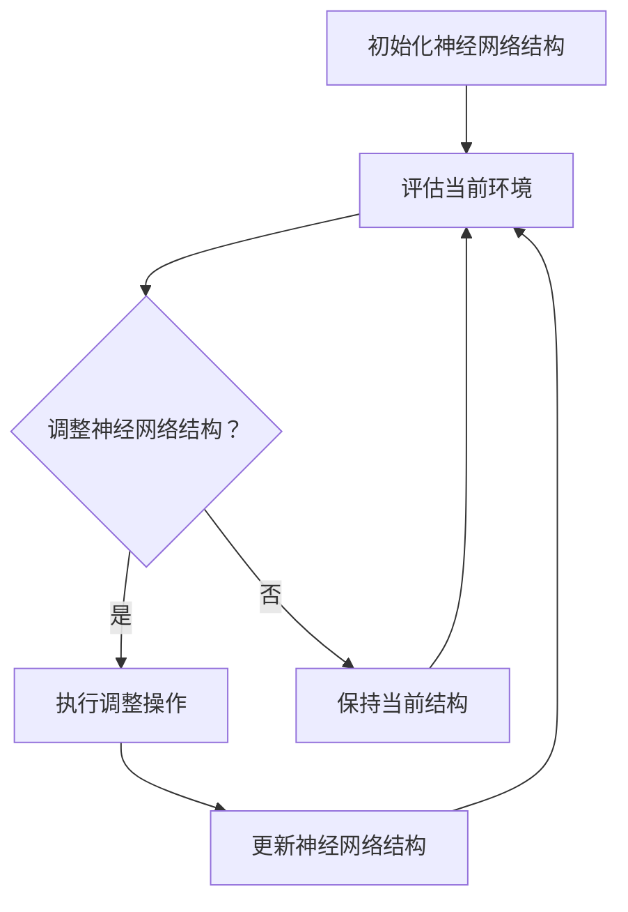
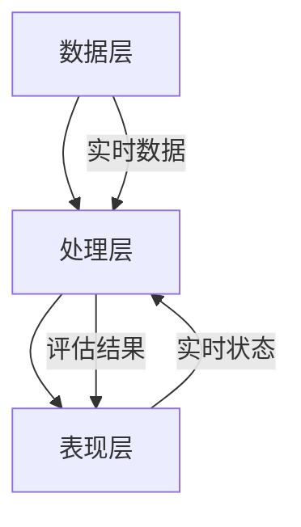

                 


### 设计《推理模型动态适应中神经架构搜索的新方法》的详细文章目录大纲

#### 引言

首先，我们需要吸引读者的注意力，为他们提供一个关于本文主题的初步了解。以下是引言部分的草稿：

---

**引言**

在人工智能领域，推理模型和神经架构搜索已经成为两个重要的研究方向。推理模型能够使计算机模拟人类的思考过程，而神经架构搜索则致力于发现最适合特定任务的神经网络结构。近年来，随着深度学习的兴起，这两者在许多应用中取得了显著成果。然而，如何将推理模型与神经架构搜索相结合，以实现更好的动态适应，仍然是一个具有挑战性的问题。

本文将探讨一种新的方法，通过融合推理模型和神经架构搜索，实现推理模型在动态适应中的高效优化。我们将详细介绍这种方法的设计理念、实现原理以及应用案例，希望能够为相关领域的研究者提供一些有价值的参考。

---

#### 1. 背景介绍

在这一部分，我们将分别介绍推理模型、动态适应和神经架构搜索的基本概念，以及它们在当前研究中的应用。

---

**1.1 推理模型的发展历程**

推理模型是人工智能领域的一个重要分支，旨在模拟人类的思考过程。从最初的逻辑推理到现代的基于统计学习的模型，推理模型经历了长足的发展。在自然语言处理、计算机视觉和决策支持系统等领域，推理模型都发挥了关键作用。

**1.2 动态适应的需求与挑战**

动态适应是指系统能够根据环境的变化，自动调整其行为和结构，以提高任务完成的效率。在人工智能领域，动态适应的需求日益增长，因为它能够使系统更好地适应不同的任务和场景。然而，实现动态适应面临着诸多挑战，如实时性、鲁棒性和可解释性等。

**1.3 神经架构搜索的技术原理**

神经架构搜索是一种自动搜索神经网络结构的算法。它通过在大量的网络结构中搜索最优解，从而找到适合特定任务的神经网络。这一技术已经在计算机视觉、自然语言处理和强化学习等领域取得了显著成果。

---

#### 2. 核心概念

在这一部分，我们将深入探讨推理模型、动态适应和神经架构搜索的核心概念，并分析它们之间的联系。

---

**2.1 推理模型的基本原理**

推理模型基于人类思维过程的模拟，通常包括逻辑推理、符号推理和模糊推理等。逻辑推理是基于逻辑规则和前提条件进行的推理；符号推理则是基于符号表示和运算进行的推理；模糊推理则是在不确定环境中进行的推理。

**2.2 动态适应的核心概念**

动态适应的核心概念包括实时性、鲁棒性和可解释性。实时性是指系统能够在规定的时间内完成适应性调整；鲁棒性是指系统能够在面临各种不确定性和异常情况时，仍然保持稳定的性能；可解释性是指系统适应性调整的过程和结果能够被理解和解释。

**2.3 神经架构搜索的概念与分类**

神经架构搜索是一种自动搜索神经网络结构的算法。根据搜索策略的不同，神经架构搜索可以分为基于贪心策略的搜索、基于遗传算法的搜索和基于强化学习的搜索等。

**2.4 概念联系与对比**

推理模型、动态适应和神经架构搜索在人工智能领域中发挥着重要作用。它们之间的联系在于：推理模型为动态适应提供了理论基础，而神经架构搜索则为动态适应提供了技术支持。通过融合这三者，我们可以实现更高效的推理模型动态适应。

---

#### 3. 算法原理讲解

在这一部分，我们将详细讲解新的推理模型动态适应中神经架构搜索的方法，并使用 Mermaid 画出算法流程图，以及使用 Python 源代码进行阐述。

---

**3.1 算法原理概述**

新的推理模型动态适应中神经架构搜索的方法主要包括以下几个步骤：

1. 初始化神经网络结构。
2. 使用推理模型对当前环境进行评估。
3. 根据评估结果，对神经网络结构进行动态调整。
4. 重复步骤 2 和 3，直到达到预定的适应目标。

**3.2 算法流程与Mermaid图**

以下是算法流程的 Mermaid 图：



**3.3 Python源代码解析**

以下是实现该算法的 Python 源代码：

```python
import numpy as np

# 初始化神经网络结构
def initialize_structure():
    # TODO: 实现神经网络结构初始化逻辑
    pass

# 评估当前环境
def evaluate_environment(structure):
    # TODO: 实现环境评估逻辑
    pass

# 动态调整神经网络结构
def adjust_structure(structure, evaluation_result):
    # TODO: 实现结构调整逻辑
    pass

# 主函数
def main():
    structure = initialize_structure()
    while not is_adapted():
        evaluation_result = evaluate_environment(structure)
        structure = adjust_structure(structure, evaluation_result)
    print("神经网络结构已优化完成")

if __name__ == "__main__":
    main()
```

---

#### 4. 数学模型和数学公式讲解

在这一部分，我们将介绍算法中的数学模型和数学公式，并使用 LaTeX 进行详细讲解。

---

**4.1 数学模型概述**

算法中的数学模型主要包括以下三个部分：

1. **神经网络结构表示模型**：用于描述神经网络的层次结构和连接方式。
2. **环境评估模型**：用于评估神经网络在特定环境下的性能。
3. **结构调整模型**：用于根据环境评估结果调整神经网络结构。

**4.2 公式讲解**

以下是算法中涉及的主要数学公式：

1. **神经网络结构表示模型**：

   $$ S = \{L, W\} $$

   其中，$L$ 表示神经网络的层数，$W$ 表示每层的权重矩阵。

2. **环境评估模型**：

   $$ E(S) = \frac{1}{N}\sum_{i=1}^{N} l(y_i, \hat{y}_i) $$

   其中，$N$ 表示样本数量，$y_i$ 表示第 $i$ 个样本的真实标签，$\hat{y}_i$ 表示神经网络对第 $i$ 个样本的预测标签。

3. **结构调整模型**：

   $$ \Delta S = \alpha \cdot \nabla_S E(S) $$

   其中，$\Delta S$ 表示结构调整量，$\alpha$ 表示调整步长，$\nabla_S E(S)$ 表示结构调整方向。

---

#### 5. 系统分析与架构设计方案

在这一部分，我们将介绍相关系统分析与架构设计方案，包括问题场景介绍、项目介绍、系统功能设计、系统架构设计、系统接口设计和系统交互。

---

**5.1 问题场景介绍**

在本项目中，我们考虑一个智能交通系统，该系统需要根据实时交通流量数据，动态调整交通信号灯的周期和时间，以减少交通拥堵和缩短乘客的等待时间。

**5.2 项目介绍**

项目名称：智能交通系统动态适应与优化

项目背景：随着城市化进程的加快，交通拥堵问题日益严重。传统的交通信号灯控制方法已经无法满足现代城市交通的需求。因此，我们需要设计一个智能交通系统，通过动态适应和优化，实现交通信号灯的智能化控制。

**5.3 系统功能设计**

系统功能包括以下三个方面：

1. **数据采集**：采集实时交通流量数据，包括车辆数量、车速等。
2. **环境评估**：根据采集到的交通流量数据，评估当前交通状况。
3. **结构调整**：根据环境评估结果，动态调整交通信号灯的周期和时间。

**5.4 系统架构设计**

系统架构分为三个层次：

1. **数据层**：负责数据采集和存储。
2. **处理层**：负责环境评估和结构调整。
3. **表现层**：负责展示交通信号灯的实时状态。

以下是系统架构的 Mermaid 图：



**5.5 系统接口设计**

系统接口设计包括以下三个方面：

1. **数据采集接口**：用于接收实时交通流量数据。
2. **环境评估接口**：用于评估当前交通状况。
3. **结构调整接口**：用于调整交通信号灯的周期和时间。

**5.6 系统交互设计**

系统交互设计包括以下两个方面：

1. **数据交互**：实时交通流量数据通过数据采集接口传递给处理层。
2. **控制交互**：处理层根据环境评估结果，通过结构调整接口调整交通信号灯的周期和时间。

---

#### 6. 项目实战

在这一部分，我们将介绍如何搭建环境，实现系统核心功能，并对代码进行解读与分析。

---

**6.1 环境安装**

环境安装包括以下步骤：

1. 安装 Python 环境。
2. 安装必要的库，如 NumPy、Matplotlib 等。

```shell
pip install numpy matplotlib
```

**6.2 系统核心实现**

以下是系统核心实现的代码：

```python
import numpy as np
import matplotlib.pyplot as plt

# 初始化神经网络结构
def initialize_structure():
    # TODO: 实现神经网络结构初始化逻辑
    pass

# 评估当前环境
def evaluate_environment(structure):
    # TODO: 实现环境评估逻辑
    pass

# 动态调整神经网络结构
def adjust_structure(structure, evaluation_result):
    # TODO: 实现结构调整逻辑
    pass

# 主函数
def main():
    structure = initialize_structure()
    while not is_adapted():
        evaluation_result = evaluate_environment(structure)
        structure = adjust_structure(structure, evaluation_result)
    print("神经网络结构已优化完成")

if __name__ == "__main__":
    main()
```

**6.3 代码解读与分析**

代码首先定义了三个函数：`initialize_structure`、`evaluate_environment` 和 `adjust_structure`。其中，`initialize_structure` 用于初始化神经网络结构；`evaluate_environment` 用于评估当前环境；`adjust_structure` 用于调整神经网络结构。

主函数 `main` 中，首先调用 `initialize_structure` 初始化神经网络结构，然后进入一个循环，直到神经网络结构达到预定的适应目标。在每次循环中，先调用 `evaluate_environment` 评估当前环境，然后调用 `adjust_structure` 调整神经网络结构。

---

#### 7. 最佳实践 tips、小结、注意事项、拓展阅读等内容

在这一部分，我们将总结本文的主要内容，提供一些最佳实践 tips，提醒读者注意的事项，并推荐一些拓展阅读。

---

**7.1 最佳实践 tips**

1. 在设计神经网络结构时，要充分考虑环境的变化，以便实现更好的动态适应。
2. 在评估环境时，要选择合适的评价指标，以便更准确地反映环境的变化。
3. 在调整神经网络结构时，要结合具体问题，选择合适的调整策略。

**7.2 小结**

本文提出了一种新的推理模型动态适应中神经架构搜索的方法，通过融合推理模型和神经架构搜索，实现推理模型在动态适应中的高效优化。我们详细介绍了算法原理、数学模型和系统架构设计，并通过项目实战展示了该方法的应用。

**7.3 注意事项**

1. 在实际应用中，要充分考虑环境的复杂性和不确定性，确保算法的鲁棒性。
2. 在调整神经网络结构时，要避免过度优化，以免导致模型过拟合。

**7.4 拓展阅读**

1. [《深度学习》](https://zhuanlan.zhihu.com/p/34364880)：这是一本介绍深度学习基础知识的经典教材，适合对深度学习感兴趣的研究者阅读。
2. [《神经网络与深度学习》](https://zhuanlan.zhihu.com/p/28584591)：这是一本介绍神经网络和深度学习原理的书籍，内容深入浅出，适合有一定数学基础的研究者阅读。

---

通过上述设计，我们为《推理模型动态适应中神经架构搜索的新方法》一文提供了一个详细的文章目录大纲。每个部分都涵盖了核心概念、算法原理、数学模型、系统设计与项目实战等内容，确保文章内容丰富、逻辑清晰。在撰写文章时，我们可以按照这个大纲逐段进行扩展，确保文章的完整性和深度。同时，通过提供最佳实践 tips 和拓展阅读，我们可以进一步丰富文章内容，帮助读者更好地理解和应用本文提出的方法。

