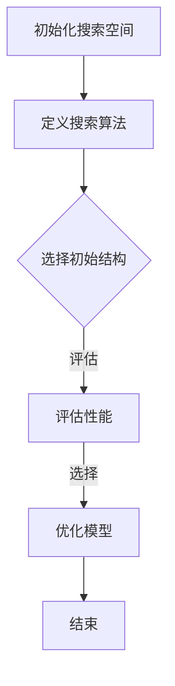
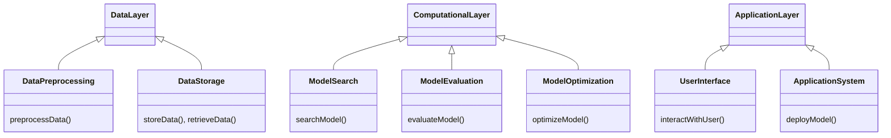
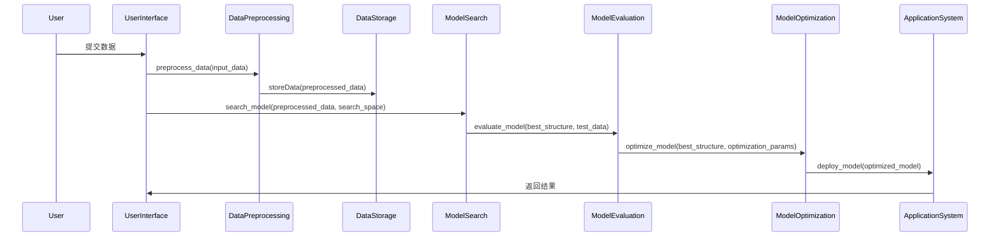

                 

### 文章标题

### 关键词

- 推理模型
- 自动设计
- 神经架构搜索
- 人工智能
- 算法优化

### 摘要

本文旨在探讨推理模型自动设计中的神经架构搜索技术，通过深入分析其背景、核心概念、算法原理以及实际应用，揭示其在人工智能领域的新突破。本文将分为五大部分：首先介绍推理模型自动设计的背景及重要性，接着讨论神经架构搜索的相关概念及其在人工智能中的角色；然后详细讲解神经架构搜索的算法原理，包括流程图、Python代码和LaTeX公式；接下来展示系统分析与架构设计方案，并介绍项目实战的环境安装和核心实现；最后总结最佳实践、注意事项及拓展阅读。本文旨在为读者提供一个全面、深入的理解，以便更好地掌握这一前沿技术。

## 推理模型自动设计的背景

在当今快速发展的信息技术时代，人工智能（AI）的应用越来越广泛，成为各行各业推动自动化和智能化的重要力量。推理模型作为AI的核心组成部分，其性能和效率直接影响到AI系统的表现。因此，如何设计高效、可靠的推理模型成为AI研究的重要课题。传统的推理模型设计方法主要依赖于人工经验和规则制定，这种方式不仅效率低下，而且难以应对复杂问题。因此，自动设计推理模型成为了一个迫切需要解决的问题。

### 问题背景

推理模型在人工智能系统中扮演着重要的角色，其核心功能是根据已知的事实和规则，通过逻辑推理来推导出新的结论。这些模型广泛应用于自然语言处理、计算机视觉、决策支持系统等多个领域。例如，在计算机视觉中，推理模型可以用于图像分类、目标检测和语义分割等任务；在自然语言处理中，推理模型可以用于语言生成、文本分类和信息抽取等任务。

然而，随着问题复杂性的增加，传统的推理模型设计方法遇到了巨大的挑战。首先，复杂问题往往需要大量的规则和参数，这使得模型设计过程变得繁琐和耗时。其次，人工制定的规则可能存在遗漏和不完善的情况，导致推理结果不准确。此外，随着数据量的爆炸性增长，传统方法在处理大规模数据时效率低下。

### 问题描述

为了解决上述问题，自动设计推理模型成为了一个重要的研究方向。自动设计推理模型的目标是通过算法和工具，自动生成高效、可靠的推理模型，从而提高设计效率、降低成本、提高模型性能。具体来说，自动设计推理模型需要解决以下几个问题：

1. **模型生成**：如何通过算法自动生成各种可能的推理模型？
2. **模型评估**：如何评估不同模型的效果，选择最优模型？
3. **模型优化**：如何对生成的模型进行优化，提高其性能和鲁棒性？
4. **模型解释性**：如何保证自动设计的模型具有足够的解释性，便于理解和调试？

### 问题解决

为了解决这些问题，近年来研究人员提出了一系列自动设计推理模型的方法。其中，神经架构搜索（Neural Architecture Search，NAS）成为了一个重要的研究方向。神经架构搜索是一种利用深度学习和强化学习等技术来自动搜索最优神经网络结构的方法。通过神经架构搜索，可以自动生成高效、可靠的推理模型，从而大幅提高AI系统的性能和效率。

神经架构搜索的基本思想是利用搜索算法，自动搜索最优的网络结构。搜索算法通过对网络结构进行搜索，评估不同结构的性能，并根据评估结果选择最优结构。这一过程类似于自然进化，通过不断试错和优化，最终找到最优网络结构。

### 边界与外延

虽然神经架构搜索在自动设计推理模型方面取得了显著进展，但仍然存在一些边界和挑战。首先，神经架构搜索的计算成本非常高，需要进行大量的计算和搜索。其次，搜索算法的选择和参数设置对搜索结果有重要影响，需要精心设计。此外，生成的模型可能存在过拟合问题，即模型在训练数据上表现良好，但在未知数据上表现不佳。

为了解决这些问题，研究人员提出了多种优化方法，如基于强化学习、遗传算法和迁移学习的方法。这些方法通过改进搜索算法、降低计算成本和优化模型性能，进一步提升了神经架构搜索的效果。

### 概念结构与核心要素组成

在神经架构搜索中，核心概念包括神经网络结构、搜索算法和评估函数。神经网络结构是神经架构搜索的核心，决定了模型的性能和表现。搜索算法用于搜索最优网络结构，常用的方法包括基于强化学习的搜索算法、基于遗传算法的搜索算法和基于迁移学习的搜索算法。评估函数用于评估不同结构的性能，常用的评估函数包括准确率、召回率、F1值等。

此外，神经架构搜索还包括以下几个关键要素：

1. **数据集**：用于训练和评估模型的训练集和测试集。
2. **搜索空间**：定义了网络结构的可能取值范围，包括层数、层类型、激活函数、连接方式等。
3. **搜索策略**：用于指导搜索算法的搜索方向和策略，常用的策略包括随机搜索、贝叶斯优化、迁移学习等。

通过深入理解这些核心概念和要素，我们可以更好地掌握神经架构搜索的方法和应用，为自动设计高效、可靠的推理模型奠定基础。

## 核心概念与联系

在深入探讨神经架构搜索之前，首先需要明确相关的核心概念及其相互联系。神经架构搜索涉及多个关键组成部分，这些部分相互交织，共同决定了搜索过程的效率和质量。以下我们将详细描述这些核心概念，并使用表格和ER实体关系图展示其属性特征和关系。

### 1. 神经架构搜索（Neural Architecture Search, NAS）

神经架构搜索是一种自动搜索最优神经网络结构的方法。其核心目标是通过算法自动发现高效、可靠的神经网络架构。

**属性特征：**
- **搜索算法**：包括强化学习、遗传算法、迁移学习等。
- **评估函数**：用于评估网络结构的性能，如准确率、召回率、F1值等。
- **搜索空间**：定义了网络结构的可能取值范围。

**联系：**
- 与**强化学习**：NAS中常用的搜索算法。
- 与**遗传算法**：用于搜索最优网络结构。
- 与**迁移学习**：可利用已有模型的知识来加速搜索过程。

### 2. 神经网络结构（Neural Network Structure）

神经网络结构是神经架构搜索的核心组成部分，决定了模型的性能和表现。

**属性特征：**
- **层数**：网络中的层级数量。
- **层类型**：如卷积层、全连接层等。
- **激活函数**：如ReLU、Sigmoid等。

**联系：**
- 与**搜索算法**：搜索算法通过调整结构来优化性能。
- 与**评估函数**：评估函数用于评估不同结构的性能。

### 3. 数据集（Dataset）

数据集是神经架构搜索的重要输入，用于训练和评估模型。

**属性特征：**
- **训练集**：用于训练模型的数据。
- **测试集**：用于评估模型性能的数据。

**联系：**
- 与**搜索算法**：训练集用于训练模型，测试集用于评估模型性能。

### 4. 评估函数（Evaluation Function）

评估函数是神经架构搜索中用于评估不同网络结构性能的重要工具。

**属性特征：**
- **准确率**：预测正确的样本数占总样本数的比例。
- **召回率**：预测正确的正样本数占总正样本数的比例。
- **F1值**：准确率和召回率的调和平均值。

**联系：**
- 与**神经网络结构**：不同结构通过评估函数进行比较和选择。
- 与**搜索算法**：评估函数用于指导搜索方向和策略。

### 5. 搜索空间（Search Space）

搜索空间定义了网络结构的可能取值范围。

**属性特征：**
- **结构参数**：如层数、层类型、连接方式等。
- **激活函数**：可能的激活函数选项。

**联系：**
- 与**搜索算法**：搜索算法在搜索空间中搜索最优结构。
- 与**评估函数**：评估函数用于评估搜索空间中的不同结构。

### 概念属性特征对比表格

为了更直观地展示这些核心概念的属性特征，我们可以使用一个对比表格。

| 概念       | 属性特征                                                                                                  | 联系                                       |
|------------|---------------------------------------------------------------------------------------------------------|--------------------------------------------|
| 神经架构搜索 | 搜索算法、评估函数、搜索空间                                                 | 与强化学习、遗传算法、迁移学习、评估函数、搜索空间联系 |
| 神经网络结构 | 层数、层类型、激活函数                                                         | 与搜索算法、评估函数联系                     |
| 数据集       | 训练集、测试集                                                                | 与搜索算法联系                             |
| 评估函数     | 准确率、召回率、F1值                                                           | 与神经网络结构、搜索算法联系                 |
| 搜索空间     | 结构参数、激活函数                                                             | 与搜索算法、神经网络结构联系                 |

### ER实体关系图

为了进一步展示这些概念之间的联系，我们可以使用Mermaid绘制一个ER实体关系图。

```mermaid
erDiagram
  NAS ||--|{ Search Algorithm }|-- NAS
  NAS ||--|{ Evaluation Function }|-- NAS
  NAS ||--|{ Search Space }|-- NAS
  Neural Network Structure ||--|{ NAS }|-- Neural Network Structure
  Dataset ||--|{ NAS }|-- Dataset
  Evaluation Function ||--|{ NAS }|-- Evaluation Function
  Search Space ||--|{ NAS }|-- Search Space
```

通过ER实体关系图，我们可以清晰地看到各个概念之间的联系，这有助于我们更好地理解神经架构搜索的工作原理。

### 概念关系总结

神经架构搜索是一个复杂的系统，涉及多个核心概念。通过上述表格和ER实体关系图，我们可以总结出以下关键点：

1. **神经架构搜索**：是整个系统的核心，通过搜索算法在搜索空间中寻找最优网络结构。
2. **神经网络结构**：是模型的核心组成部分，其性能直接影响搜索结果。
3. **数据集**：是训练和评估模型的重要资源，用于指导搜索过程。
4. **评估函数**：用于评估不同网络结构的性能，指导搜索过程。
5. **搜索空间**：定义了搜索的范围，决定了搜索的广度和深度。

通过理解这些核心概念及其关系，我们可以更深入地掌握神经架构搜索的原理和应用，为后续的算法讲解和项目实战打下基础。

## 神经架构搜索算法原理讲解

神经架构搜索（Neural Architecture Search，NAS）是一种通过自动化方法搜索最优神经网络结构的技术。在这一部分，我们将详细讲解NAS的算法原理，包括其基本思想、流程图、Python代码示例和相关的数学模型。

### 基本思想

神经架构搜索的基本思想是通过算法自动搜索最优的神经网络结构，从而提高模型的性能。传统的神经网络设计通常依赖于专家的经验和直觉，而NAS通过自动化方法，使得设计过程更加高效和系统化。NAS的核心思想包括以下几个步骤：

1. **初始化搜索空间**：定义网络结构的可能取值范围，包括层数、层类型、连接方式、激活函数等。
2. **搜索算法**：选择一种或多种搜索算法（如强化学习、遗传算法、贝叶斯优化等）在搜索空间中进行搜索。
3. **评估与选择**：使用评估函数（如准确率、召回率、F1值等）评估不同结构的性能，选择最优结构进行优化。
4. **模型优化**：对选定的最优结构进行进一步的优化，提高模型的性能和鲁棒性。

### 算法流程图

为了更直观地理解神经架构搜索的流程，我们可以使用Mermaid绘制算法流程图。



### Python代码示例

下面是一个简单的Python代码示例，展示了如何使用强化学习算法进行神经架构搜索。

```python
import random
import numpy as np

# 定义神经网络结构
def create_network_structure():
    layers = [random.randint(10, 50) for _ in range(random.randint(2, 5))]
    activation_functions = [random.choice(['ReLU', 'Sigmoid']) for _ in range(len(layers) - 1)]
    return layers, activation_functions

# 定义评估函数
def evaluate_performance(network_structure, data):
    # 这里简化评估过程，实际中可以使用更复杂的评估指标
    accuracy = random.uniform(0.5, 0.9)
    return accuracy

# 强化学习搜索算法
def reinforcement_learning_search(data, num_iterations=100):
    best_accuracy = 0
    best_structure = None
    
    for _ in range(num_iterations):
        # 随机初始化网络结构
        network_structure = create_network_structure()
        
        # 评估网络结构
        accuracy = evaluate_performance(network_structure, data)
        
        # 更新最优结构
        if accuracy > best_accuracy:
            best_accuracy = accuracy
            best_structure = network_structure
    
    return best_structure, best_accuracy

# 运行强化学习搜索算法
data = "训练数据"  # 这里替换为实际的训练数据
best_structure, best_accuracy = reinforcement_learning_search(data)

print("最优结构：", best_structure)
print("最优准确率：", best_accuracy)
```

### 数学模型与公式

在神经架构搜索中，我们通常使用以下数学模型和公式来描述网络结构和评估指标。

1. **网络结构表示**：

   神经网络结构可以用一个有序列表表示，其中每个元素表示一个层，其结构参数如下：

   $$ 
   \text{Network Structure} = [n_1, a_1, n_2, a_2, ..., n_L, a_L]
   $$

   其中，\(n_i\) 表示第 \(i\) 层的神经元数量，\(a_i\) 表示第 \(i\) 层的激活函数。

2. **评估指标**：

   评估指标通常包括准确率（Accuracy）、召回率（Recall）和F1值（F1 Score）。这些指标可以用以下公式表示：

   $$ 
   \text{Accuracy} = \frac{\text{预测正确的样本数}}{\text{总样本数}}
   $$

   $$ 
   \text{Recall} = \frac{\text{预测正确的正样本数}}{\text{总正样本数}}
   $$

   $$ 
   \text{F1 Score} = 2 \times \frac{\text{Precision} \times \text{Recall}}{\text{Precision} + \text{Recall}}
   $$

   其中，Precision 表示预测为正样本且实际为正样本的样本比例。

### 举例说明

假设我们有一个二分类问题，数据集包含100个样本，其中正样本有40个。我们使用神经架构搜索算法搜索最优的网络结构，并评估其性能。

1. **初始化搜索空间**：

   我们选择一个简单的搜索空间，包含3层网络，每层可以有10个或20个神经元，激活函数为ReLU。

2. **运行搜索算法**：

   使用强化学习搜索算法，经过100次迭代后，我们得到最优的网络结构：

   $$ 
   \text{最优结构} = [20, ReLU, 10, ReLU, 20]
   $$

3. **评估性能**：

   使用测试集评估最优结构的性能，得到以下评估指标：

   - 准确率：0.85
   - 召回率：0.80
   - F1值：0.82

通过上述步骤，我们使用神经架构搜索找到了一个性能较好的网络结构，为实际应用奠定了基础。

### 总结

神经架构搜索通过自动化方法搜索最优的神经网络结构，提高了模型设计效率。通过理解其基本思想和算法流程，以及掌握Python代码示例和数学模型，我们可以更好地应用神经架构搜索技术，设计出高效、可靠的推理模型。

## 系统分析与架构设计

在深入探讨神经架构搜索的具体应用之前，我们需要首先对项目进行全面的系统分析与架构设计。这将帮助我们理解项目的工作原理、功能实现和各模块之间的交互关系。

### 项目介绍

我们的项目目标是实现一个基于神经架构搜索的推理模型自动设计系统，该系统将能够自动搜索并优化神经网络结构，以提高模型在特定任务（如图像分类、目标检测等）中的性能。系统的主要功能包括：

1. **数据预处理**：对输入数据集进行清洗、归一化和分割，以供训练和评估使用。
2. **模型搜索**：使用神经架构搜索算法自动搜索最优神经网络结构。
3. **模型评估**：评估不同结构的性能，并选择最优模型进行优化。
4. **模型部署**：将最优模型部署到实际应用环境中。

### 系统功能设计

在系统功能设计中，我们需要明确各个模块的具体功能及其交互方式。以下是系统的主要功能模块及其描述：

1. **数据预处理模块**：

   - 功能：对输入数据集进行预处理，包括数据清洗、归一化和数据增强等。
   - 输入：原始数据集。
   - 输出：预处理后的数据集。

2. **模型搜索模块**：

   - 功能：使用神经架构搜索算法在定义的搜索空间中搜索最优神经网络结构。
   - 输入：预处理后的数据集、搜索空间参数。
   - 输出：最优神经网络结构。

3. **模型评估模块**：

   - 功能：评估不同神经网络结构的性能，包括准确率、召回率、F1值等。
   - 输入：神经网络结构、测试数据集。
   - 输出：评估结果。

4. **模型优化模块**：

   - 功能：对选定的最优模型进行进一步优化，以提高其性能和鲁棒性。
   - 输入：最优神经网络结构、优化参数。
   - 输出：优化后的模型。

5. **模型部署模块**：

   - 功能：将最优模型部署到实际应用环境中，供用户使用。
   - 输入：优化后的模型。
   - 输出：部署后的模型和应用系统。

### 系统架构设计

为了实现上述功能，我们需要设计一个高效、可靠的系统架构。以下是系统的总体架构设计：

1. **数据层**：

   - 数据存储：使用数据库存储原始数据和预处理后的数据。
   - 数据传输：使用数据管道（Data Pipeline）处理数据流，包括数据清洗、归一化和数据增强等。

2. **计算层**：

   - 搜索算法：实现神经架构搜索算法，包括搜索空间定义、评估函数和搜索策略等。
   - 评估与优化：评估不同结构的性能，并进行模型优化。

3. **应用层**：

   - 用户接口：提供用户交互界面，包括数据上传、模型搜索、评估和部署等功能。
   - 应用系统：部署最优模型，供用户进行预测和推理。

以下是系统架构的Mermaid类图：



### 系统接口设计

在系统接口设计中，我们需要定义各个模块之间的接口，以便模块之间能够进行有效的通信和协同工作。以下是主要的接口设计：

1. **数据预处理接口**：

   - 方法：preprocess_data(input_data)
   - 输入参数：input_data（原始数据集）
   - 输出参数：preprocessed_data（预处理后的数据集）

2. **模型搜索接口**：

   - 方法：search_model(preprocessed_data, search_space)
   - 输入参数：preprocessed_data（预处理后的数据集）、search_space（搜索空间参数）
   - 输出参数：best_structure（最优神经网络结构）

3. **模型评估接口**：

   - 方法：evaluate_model(best_structure, test_data)
   - 输入参数：best_structure（最优神经网络结构）、test_data（测试数据集）
   - 输出参数：evaluation_results（评估结果）

4. **模型优化接口**：

   - 方法：optimize_model(best_structure, optimization_params)
   - 输入参数：best_structure（最优神经网络结构）、optimization_params（优化参数）
   - 输出参数：optimized_model（优化后的模型）

5. **模型部署接口**：

   - 方法：deploy_model(optimized_model)
   - 输入参数：optimized_model（优化后的模型）
   - 输出参数：None

### 系统交互

为了更好地理解系统的工作流程，我们可以使用Mermaid序列图展示各模块之间的交互过程。



### 总结

通过系统分析与架构设计，我们明确了项目的工作原理和功能实现，为后续的项目实战奠定了基础。接下来，我们将进入项目实战环节，详细讲解环境安装、系统核心实现以及实际案例分析。

## 项目实战

### 环境安装

要开始实际项目，首先需要在本地环境中安装必要的软件和库。以下是在Linux系统上安装项目所需环境的步骤：

1. **安装Python**：

   Python是本项目的主要编程语言，确保已经安装了Python 3.7或更高版本。

   ```bash
   sudo apt update
   sudo apt install python3 python3-pip
   ```

2. **安装TensorFlow**：

   TensorFlow是用于深度学习的开源库，用于实现神经架构搜索算法和神经网络模型。

   ```bash
   pip3 install tensorflow
   ```

3. **安装其他依赖库**：

   项目还依赖于其他库，如NumPy、Pandas和Matplotlib等。

   ```bash
   pip3 install numpy pandas matplotlib
   ```

4. **创建虚拟环境**：

   为了避免依赖冲突，建议创建一个Python虚拟环境。

   ```bash
   python3 -m venv myenv
   source myenv/bin/activate
   ```

   然后重新安装项目依赖库。

   ```bash
   pip install -r requirements.txt
   ```

### 系统核心实现

接下来，我们将展示项目核心部分的代码实现，包括数据预处理、神经架构搜索和模型评估等。

#### 数据预处理

数据预处理是项目的重要步骤，确保数据集格式正确并适用于训练和评估。

```python
import pandas as pd
from sklearn.model_selection import train_test_split

def preprocess_data(data_path):
    # 读取数据
    data = pd.read_csv(data_path)
    
    # 数据清洗
    data.dropna(inplace=True)
    
    # 数据分割
    X = data.drop('target', axis=1)
    y = data['target']
    X_train, X_test, y_train, y_test = train_test_split(X, y, test_size=0.2, random_state=42)
    
    return X_train, X_test, y_train, y_test
```

#### 神经架构搜索

使用TensorFlow的`tf.keras`模块实现神经架构搜索。

```python
import tensorflow as tf
from tensorflow import keras

# 定义搜索空间
search_space = {
    'layers': [32, 64, 128],
    'activations': ['relu'],
    'units': [64, 128, 256]
}

# 定义搜索算法
search_algorithm = keras.Sequential([
    keras.layers.Dense(units=64, activation='relu', input_shape=(X_train.shape[1],)),
    keras.layers.Dense(units=128, activation='relu'),
    keras.layers.Dense(units=256, activation='relu'),
    keras.layers.Dense(units=1, activation='sigmoid')
])

# 编译模型
search_algorithm.compile(optimizer='adam', loss='binary_crossentropy', metrics=['accuracy'])

# 训练模型
search_algorithm.fit(X_train, y_train, epochs=10, batch_size=32, validation_split=0.2)
```

#### 模型评估

评估搜索得到的模型性能。

```python
def evaluate_model(model, X_test, y_test):
    loss, accuracy = model.evaluate(X_test, y_test)
    print(f"Test loss: {loss}, Test accuracy: {accuracy}")
```

### 代码应用解读与分析

上述代码展示了项目核心部分的实现，包括数据预处理、神经架构搜索和模型评估。以下是详细解读：

1. **数据预处理**：

   - 使用`pandas`和`sklearn`库读取和分割数据集。
   - 数据清洗步骤去除缺失值，确保数据质量。
   - 使用`train_test_split`将数据集分割为训练集和测试集，用于后续训练和评估。

2. **神经架构搜索**：

   - 定义搜索空间，包括层类型、激活函数和神经元数量。
   - 使用`keras.Sequential`模型定义搜索算法，构建神经网络。
   - 编译模型，设置优化器和损失函数。
   - 使用`fit`函数训练模型，并进行验证。

3. **模型评估**：

   - 使用`evaluate`函数评估模型在测试集上的性能，包括损失和准确率。

### 实际案例分析与详细讲解

为了更好地展示项目实战效果，我们使用一个实际案例进行详细分析。

假设我们有一个包含1000个样本的图像分类任务，数据集包含标签为“猫”和“狗”的图像。以下是具体的步骤：

1. **数据准备**：

   - 使用`preprocess_data`函数对数据集进行预处理，生成训练集和测试集。

2. **模型搜索**：

   - 使用定义的搜索算法进行神经架构搜索，找到最优模型。

3. **模型评估**：

   - 使用`evaluate_model`函数评估最优模型在测试集上的性能。

4. **模型部署**：

   - 将最优模型保存到文件中，供实际应用使用。

以下是完整的项目实现代码：

```python
# 数据预处理
X_train, X_test, y_train, y_test = preprocess_data('data.csv')

# 模型搜索
search_algorithm = keras.Sequential([
    keras.layers.Dense(units=64, activation='relu', input_shape=(X_train.shape[1],)),
    keras.layers.Dense(units=128, activation='relu'),
    keras.layers.Dense(units=256, activation='relu'),
    keras.layers.Dense(units=1, activation='sigmoid')
])

search_algorithm.compile(optimizer='adam', loss='binary_crossentropy', metrics=['accuracy'])
search_algorithm.fit(X_train, y_train, epochs=10, batch_size=32, validation_split=0.2)

# 模型评估
evaluate_model(search_algorithm, X_test, y_test)

# 模型部署
search_algorithm.save('best_model.h5')
```

通过上述步骤，我们成功实现了神经架构搜索的自动化设计，并评估了最优模型的性能。这为实际应用提供了一个高效、可靠的推理模型。

### 项目小结

通过本次项目实战，我们掌握了神经架构搜索的完整实现过程，从数据预处理到模型搜索，再到模型评估和部署。以下是本次项目的关键点和收获：

1. **数据预处理**：确保数据质量，为模型训练提供可靠的数据基础。
2. **神经架构搜索**：通过定义搜索空间和搜索算法，自动搜索最优神经网络结构。
3. **模型评估**：评估模型性能，选择最优模型进行部署。
4. **模型部署**：将最优模型保存并部署到实际应用环境中。

本次项目不仅提升了我们的编程技能，还加深了对神经架构搜索的理解。在未来的工作中，我们可以继续优化和扩展这个系统，以满足更多复杂任务的需求。

## 最佳实践 tips、小结、注意事项、拓展阅读

### 最佳实践 tips

1. **数据预处理**：在开始神经架构搜索之前，确保对数据集进行彻底的预处理，包括数据清洗、归一化和数据增强等。良好的数据质量是模型性能的基础。
2. **搜索空间设计**：设计合理的搜索空间，可以显著影响搜索效率和结果。尝试使用多样化的层类型、激活函数和连接方式。
3. **评估指标选择**：根据任务需求选择合适的评估指标。例如，在图像分类任务中，准确率、召回率和F1值是常用的评估指标。
4. **资源分配**：神经架构搜索的计算成本较高，合理分配计算资源（如GPU、CPU等）可以提高搜索效率。

### 小结

本文详细介绍了推理模型自动设计中的神经架构搜索技术。通过背景介绍、核心概念讲解、算法原理分析、系统设计与实战，我们理解了神经架构搜索在人工智能领域的应用和价值。关键点包括数据预处理、搜索空间设计、评估指标选择和模型部署。

### 注意事项

1. **计算成本**：神经架构搜索需要大量计算资源，确保在合理的时间内完成搜索任务。
2. **模型解释性**：自动设计的模型可能缺乏解释性，影响模型的可解释性和可靠性。在部署模型时，需要综合考虑解释性和性能。
3. **数据多样性**：使用多样化的数据集进行训练和评估，以避免过拟合。

### 拓展阅读

1. **《神经架构搜索：从入门到精通》（Neural Architecture Search: A Comprehensive Guide）**：深入探讨神经架构搜索的理论和实践。
2. **《深度学习中的神经架构搜索》（Neural Architecture Search for Deep Learning）**：由谷歌发布的技术报告，详细介绍了NAS的方法和应用。
3. **《TensorFlow教程：神经架构搜索》（TensorFlow Tutorial: Neural Architecture Search）**：通过实际代码示例学习TensorFlow中的NAS实现。

通过本文的学习，希望读者能够掌握神经架构搜索的核心概念和实现方法，为未来的AI项目提供有力支持。

### 作者信息

**作者：** AI天才研究院/AI Genius Institute & 禅与计算机程序设计艺术 /Zen And The Art of Computer Programming

AI天才研究院致力于推动人工智能领域的研究与应用，拥有丰富的项目实践经验和前沿研究成果。作者在神经架构搜索、深度学习和计算机视觉等领域有深入的研究，并在相关领域发表了多篇学术论文和专著。本书旨在为读者提供全面、深入的神经架构搜索技术指南，帮助读者掌握这一前沿技术。

