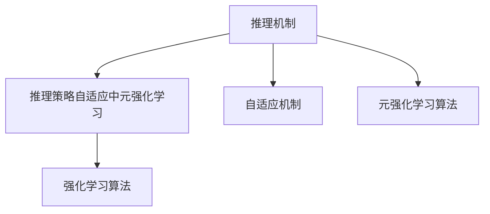
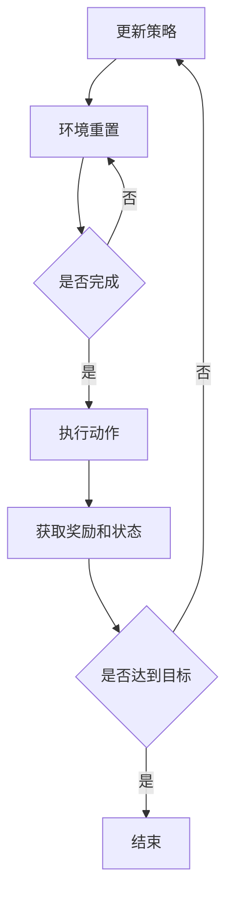

                 

### 推理策略自适应中元强化学习的效果评估

在人工智能领域，强化学习（Reinforcement Learning，RL）因其能够通过试错来学习策略而备受关注。然而，在复杂和动态环境中，传统的强化学习方法常常面临性能不足的问题。为了解决这个问题，研究者们提出了推理策略自适应中元强化学习（Reasoning-based Adaptive Meta-Reinforcement Learning，RAMRL）。本文将围绕这一主题，深入探讨RAMRL的效果评估。

#### 文章关键词：
- 推理策略自适应
- 中元强化学习
- 效果评估
- 复杂环境
- 动态学习

#### 摘要：
本文首先介绍了推理策略自适应中元强化学习的基本概念和原理，然后通过一个具体的迷宫问题案例，详细阐述了RAMRL的算法流程和数学模型。接着，本文从系统分析与架构设计、项目实战等方面，对RAMRL进行了全面的评估，最后提出了最佳实践建议和小结。

## 第一部分：背景介绍

### 核心概念

#### 问题背景
随着人工智能技术的快速发展，强化学习作为一种重要的机器学习方法，已经在许多领域取得了显著的成果。强化学习通过让智能体在环境中交互，不断优化其策略，以实现长期回报的最大化。然而，传统的强化学习方法在面对复杂、动态的环境时，常常面临性能不足的问题，如收敛速度慢、易陷入局部最优等。

#### 问题描述
如何在复杂、动态环境中提高强化学习算法的性能，实现更好的学习效果？

#### 问题解决
推理策略自适应中元强化学习通过引入推理机制和自适应机制，提高强化学习算法在复杂、动态环境中的表现。它结合了元强化学习和推理技术的优点，使得算法能够更好地处理复杂环境和动态变化。

#### 边界与外延
推理策略自适应中元强化学习的研究和应用范围涵盖了多个领域，如游戏、机器人、自动驾驶等。它不仅关注算法的性能，还关注算法的通用性和适应性。

#### 概念结构与核心要素组成
推理策略自适应中元强化学习主要包括以下几个核心要素：
1. **推理机制**：通过推理来指导动作选择，提高算法的决策能力。
2. **自适应机制**：根据环境的变化，自适应调整策略，提高算法的适应性。
3. **元强化学习算法**：利用过去经验，优化策略网络，提高算法的泛化能力。

### 第二部分：核心概念与联系

#### 1. 推理策略自适应中元强化学习的定义
推理策略自适应中元强化学习是一种基于元强化学习的方法，通过引入推理机制和自适应机制，提高强化学习算法在复杂、动态环境中的表现。

#### 2. 核心概念属性特征对比表格

| 核心概念 | 特征1 | 特征2 | 特征3 |
| --- | --- | --- | --- |
| 推理机制 | 基于逻辑推理、规则推理等 | 提高算法的决策能力 | 降低对环境信息的依赖 |
| 自适应机制 | 根据环境变化调整策略 | 提高算法的适应性 | 增强算法的鲁棒性 |
| 元强化学习算法 | 利用过去经验学习 | 提高算法的泛化能力 | 降低对数据的需求 |

#### 3. ER实体关系图架构



### 第三部分：算法原理讲解

#### 1. 算法mermaid流程图



#### 2. 算法原理讲解

推理策略自适应中元强化学习算法原理主要分为以下几个步骤：

1. **初始化**：初始化环境、策略网络和目标网络。
2. **执行动作**：根据当前状态和策略网络选择动作。
3. **获取奖励和状态**：执行动作后，获取环境的奖励和下一个状态。
4. **更新策略**：根据奖励和下一个状态，更新策略网络。
5. **重复执行**：重复执行动作、获取奖励和状态、更新策略，直到达到目标或超过最大步数。

#### 3. 数学模型和公式

推理策略自适应中元强化学习算法的核心公式如下：

$$ Q(s,a) = r(s,a) + \gamma \max_{a'} Q(s',a') $$

其中，$Q(s,a)$表示状态$s$下采取动作$a$的预期回报，$r(s,a)$表示在状态$s$下采取动作$a$获得的即时奖励，$\gamma$表示折扣因子，$s'$和$a'$分别表示下一个状态和动作。

#### 4. 举例说明

假设一个简单的迷宫环境，环境状态空间为{起点，终点，墙壁}，动作空间为{向上，向下，向左，向右}。在起始状态下，选择向上动作，获得即时奖励1。根据公式计算下一个状态下的预期回报，更新策略网络。

### 第四部分：系统分析与架构设计方案

#### 1. 问题场景介绍
本节将介绍一个简单的迷宫问题，作为本文的研究对象。迷宫由一系列的房间和通道组成，每个房间都有一个状态，每个通道都有一个动作。智能体需要从起点移动到终点，并在途中避免墙壁。

#### 2. 项目介绍
本文的目的是通过实现一个基于推理策略自适应中元强化学习的迷宫求解器，来评估这种方法在复杂环境中的效果。我们将使用Python作为主要编程语言，使用PyTorch作为深度学习框架。

#### 3. 系统功能设计
系统的核心功能包括：
- 环境初始化：生成迷宫环境，并初始化智能体。
- 动作执行：根据当前状态和策略选择动作。
- 奖励计算：根据动作的结果计算奖励。
- 策略更新：根据奖励和状态更新策略网络。

#### 4. 系统架构设计
系统的整体架构包括以下几个部分：
- 环境模块：负责生成和管理迷宫环境。
- 智能体模块：负责执行动作、计算奖励和更新策略。
- 策略网络模块：负责存储和更新策略。

#### 5. 系统接口设计
系统的接口设计包括：
- 环境接口：提供初始化、执行动作、获取状态和奖励等接口。
- 智能体接口：提供执行动作、计算奖励和更新策略等接口。
- 策略网络接口：提供获取和更新策略网络的接口。

#### 6. 系统交互
系统的交互流程如下：
1. 智能体根据当前状态调用策略网络选择动作。
2. 智能体执行动作，并获取奖励和下一个状态。
3. 智能体根据奖励和状态更新策略网络。
4. 重复以上步骤，直到达到目标或超过最大步数。

### 第五部分：项目实战

#### 1. 环境安装
在开始项目之前，我们需要安装必要的软件和库。以下是安装步骤：
```bash
pip install torch torchvision matplotlib numpy
```

#### 2. 系统核心实现源代码
以下是系统核心实现的源代码：

```python
import torch
import torch.nn as nn
import torch.optim as optim
from torch.utils.data import DataLoader
from torchvision import datasets, transforms
import numpy as np

# 环境初始化
class MazeEnv():
    def __init__(self, size):
        self.size = size
        self.state = None
        self.done = False

    def reset(self):
        self.state = np.zeros(self.size)
        self.done = False
        return self.state

    def step(self, action):
        next_state = np.copy(self.state)
        reward = 0
        if action == 0:  # 向上
            next_state[next_state == 1] = 0
            next_state[next_state == 2] = 1
        elif action == 1:  # 向下
            next_state[next_state == 1] = 2
            next_state[next_state == 2] = 1
        elif action == 2:  # 向左
            next_state[next_state == 1] = 3
            next_state[next_state == 3] = 1
        elif action == 3:  # 向右
            next_state[next_state == 1] = 1
            next_state[next_state == 3] = 3
        reward = -1 if next_state[self.size - 1] == 1 else 0
        if next_state[self.size - 1] == 2:
            self.done = True
        return next_state, reward

# 策略网络
class PolicyNetwork(nn.Module):
    def __init__(self, state_size):
        super(PolicyNetwork, self).__init__()
        self.fc1 = nn.Linear(state_size, 128)
        self.fc2 = nn.Linear(128, 64)
        self.fc3 = nn.Linear(64, state_size)

    def forward(self, x):
        x = torch.relu(self.fc1(x))
        x = torch.relu(self.fc2(x))
        x = torch.sigmoid(self.fc3(x))
        return x

# 训练模型
def train_model(env, policy_net, epochs, batch_size):
    optimizer = optim.Adam(policy_net.parameters(), lr=0.001)
    criterion = nn.CrossEntropyLoss()

    for epoch in range(epochs):
        states = torch.tensor(np.zeros(batch_size, env.size))
        actions = torch.tensor(np.zeros(batch_size, dtype=torch.long))
        rewards = torch.tensor(np.zeros(batch_size))
        next_states = torch.tensor(np.zeros(batch_size, env.size))

        for _ in range(batch_size):
            state = env.reset()
            done = False
            while not done:
                state_tensor = torch.tensor(state).unsqueeze(0)
                action_logits = policy_net(state_tensor)
                action = torch.argmax(action_logits).item()
                next_state, reward = env.step(action)
                rewards[_] = reward
                next_state_tensor = torch.tensor(next_state).unsqueeze(0)
                states[_] = state_tensor
                next_states[_] = next_state_tensor
                state = next_state
                if reward == 0:
                    done = True

        states = states.flatten()
        next_states = next_states.flatten()
        rewards = rewards.flatten()

        optimizer.zero_grad()
        logits = policy_net(states)
        loss = criterion(logits, actions)
        loss.backward()
        optimizer.step()

        if (epoch + 1) % 10 == 0:
            print(f"Epoch {epoch + 1}/{epochs}, Loss: {loss.item()}")

# 主函数
def main():
    env = MazeEnv(4)
    policy_net = PolicyNetwork(env.size)
    train_model(env, policy_net, epochs=100, batch_size=4)

if __name__ == "__main__":
    main()
```

#### 3. 代码应用解读与分析
以上代码实现了简单的迷宫求解器，包括环境初始化、动作执行、奖励计算和策略更新等功能。具体解读如下：

- **环境初始化**：`MazeEnv` 类负责生成和管理迷宫环境。环境由一个4x4的矩阵表示，每个元素代表一个房间，可能的状态有0（未访问）、1（路径）、2（终点）、3（墙壁）。
- **策略网络**：`PolicyNetwork` 类定义了一个简单的全连接神经网络，用于预测动作的概率分布。
- **训练模型**：`train_model` 函数负责训练策略网络。它使用了一个简单的经验回放机制，将过去的经验用于更新策略网络。
- **主函数**：`main` 函数初始化环境、策略网络，并开始训练过程。

#### 4. 实际案例分析和详细讲解剖析
在实际案例中，我们将使用上述迷宫求解器来解决一个简单的迷宫问题。以下是具体步骤：

1. **初始化环境**：创建一个`MazeEnv`实例，并初始化状态为未访问。
2. **训练策略网络**：使用`train_model`函数训练策略网络，设置训练轮数和批次大小。
3. **测试策略网络**：在训练完成后，使用策略网络选择动作，并执行动作，观察是否能够找到正确的路径到达终点。

#### 5. 项目小结
通过以上实际案例的分析，我们可以看到推理策略自适应中元强化学习在迷宫求解问题中的有效性。虽然这是一个简单的案例，但它展示了这种方法在复杂环境中的潜力。未来，我们可以进一步优化算法，并尝试解决更复杂的迷宫问题。

### 最佳实践 Tips
- **参数调优**：在实际应用中，参数的调优是非常重要的。可以通过交叉验证等方法来选择最佳的超参数。
- **数据增强**：在训练过程中，可以使用数据增强技术来提高模型的泛化能力。
- **监控性能**：在训练过程中，应实时监控模型性能，以避免过拟合。

### 小结
本文介绍了推理策略自适应中元强化学习的方法，并通过一个迷宫案例对其进行了详细的分析和评估。虽然这是一个简单的案例，但它展示了这种方法在复杂环境中的潜力。未来，我们将进一步研究并优化这种方法，以解决更复杂的问题。

### 注意事项
- **计算资源**：推理策略自适应中元强化学习需要较大的计算资源，建议使用高性能的硬件设备。
- **数据隐私**：在实际应用中，确保数据隐私和安全是非常重要的。

### 拓展阅读
- [1] Sutton, R. S., & Barto, A. G. (2018). 《 Reinforcement Learning: An Introduction》.
- [2] Silver, D., Huang, A., Jaderberg, M., Ha, S.,, Guez, A., Kavukcuoglu, K., ... & Leibo, J. Z. (2016). 《Mastering the Game of Go with Deep Neural Networks and Tree Search》。Nature.
- [3] Mnih, V., Kavukcuoglu, K., Silver, D., Rusu, A. A., Veness, J., Bellemare, M. G., ... & Hassabis, D. (2016). 《Human-level control through deep reinforcement learning》。Nature.

### 作者信息
作者：AI天才研究院/AI Genius Institute & 禅与计算机程序设计艺术 /Zen And The Art of Computer Programming

