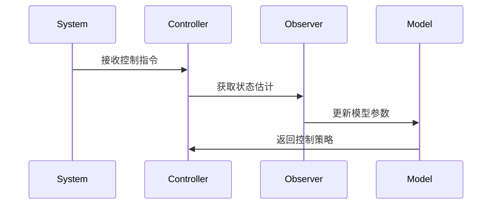
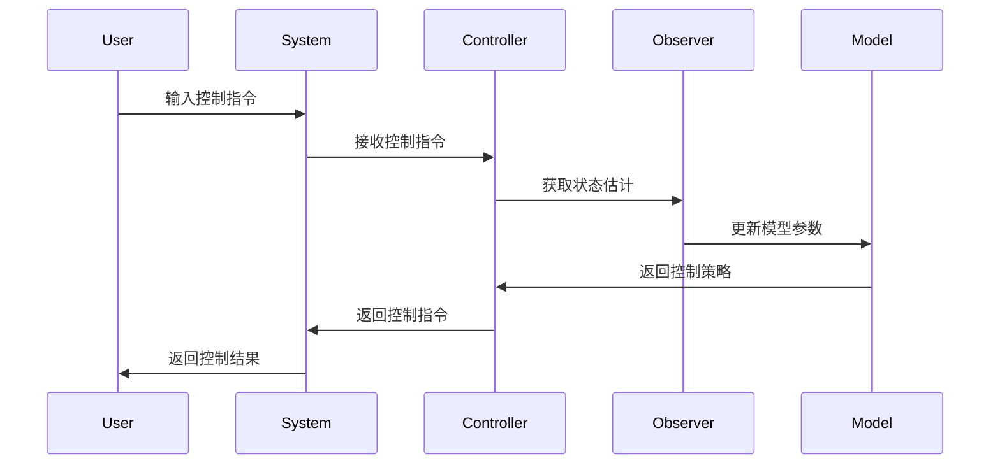
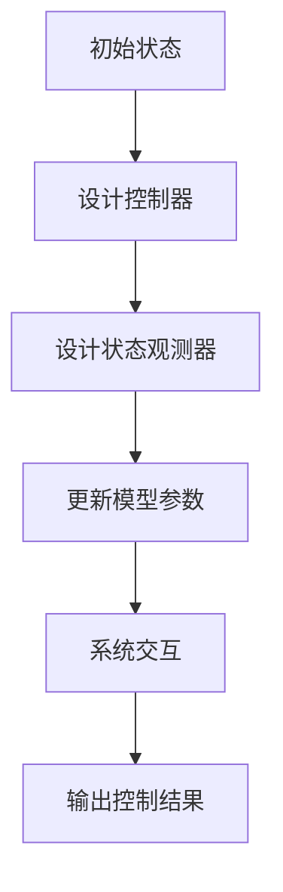

                 

# 推理过程中的不确定性传播与控制技术研究

关键词：不确定性传播、控制技术、推理过程、鲁棒控制、算法实现、系统架构

摘要：本文深入探讨了推理过程中的不确定性传播与控制技术，首先介绍了相关核心概念和理论，然后分析了不确定性传播的机制，提出了多种控制策略，并通过算法原理与实现、系统架构设计及项目实战等多方面内容，全面展示了控制不确定性传播的实用方法。本文旨在为读者提供一个全面、系统的学习路径，帮助深入理解和应用不确定性控制技术。

## 第一部分：引言

### 1.1 推理与不确定性：问题背景

在人工智能和计算机科学领域，推理是一种核心能力，它允许系统从已知信息中推断出新信息。然而，现实世界中的信息往往是不确定的，这种不确定性可能源自数据的噪声、不完整性或主观性。在推理过程中，不确定性会传播，可能导致错误的结果或决策。因此，研究不确定性传播与控制技术具有重要意义。

### 1.2 不确定性传播与控制的重要性

不确定性传播是影响推理精度和系统可靠性的关键因素。有效的控制技术可以帮助系统减少不确定性，提高推理的准确性和鲁棒性。特别是在复杂系统的设计与应用中，控制不确定性传播成为确保系统稳定性和性能的重要手段。

### 1.3 本书结构安排与目标

本文将从以下几个方面展开：

1. **核心概念与理论**：介绍不确定性的定义、分类和基本原理。
2. **不确定性传播机制研究**：分析不确定性的来源和传播路径。
3. **控制策略与方法**：讨论传统和现代控制策略。
4. **算法原理与实现**：详细讲解控制算法的原理和实现。
5. **系统架构与设计**：介绍系统需求、功能设计、架构设计和接口设计。
6. **项目实战**：通过实际案例展示控制技术的应用。
7. **最佳实践与未来展望**：总结最佳实践，展望未来研究方向。

通过以上内容，本文旨在为读者提供一个全面的技术指南，帮助理解和应用不确定性控制技术。

---

## 第二部分：核心概念与理论

### 2.1 不确定性的定义与分类

#### 定义

不确定性指的是在信息获取、处理和传递过程中，由于各种原因导致的信息不确定程度。它可以是概率性的（如随机性），也可以是确定性（如模糊性）。

#### 分类

不确定性主要分为以下几类：

- **随机不确定性**：由随机因素引起的，如概率分布中的不确定性。
- **模糊不确定性**：由概念模糊引起的，如模糊逻辑中的不确定性。
- **不确定性模糊**：既包含随机性也包含模糊性，如模糊随机不确定性。
- **参数不确定性**：由模型参数的不确定性引起的，如参数估计中的不确定性。

### 2.2 不确定性传播的基本原理

不确定性在系统中传播的过程称为不确定性传播。它通常涉及以下原理：

- **链式规则**：不确定性从一个变量传播到另一个变量的过程。
- **条件概率**：基于条件概率公式计算不确定性在条件下的传播。
- **贝叶斯推理**：基于贝叶斯网络或概率图模型进行不确定性传播。

### 2.3 控制理论的基本概念

控制理论涉及对动态系统的建模、分析和设计。核心概念包括：

- **控制对象**：需要控制的系统或过程。
- **控制器**：用于控制对象的装置或算法。
- **性能指标**：用于评价控制效果的指标，如稳定性、鲁棒性等。
- **反馈机制**：通过测量控制效果，调整控制器以实现控制目标。

### 2.4 不确定性控制的数学模型

不确定性控制通常涉及以下数学模型：

- **贝叶斯控制**：基于贝叶斯推理进行决策和控制的模型。
- **模糊控制**：基于模糊逻辑进行决策和控制的模型。
- **鲁棒控制**：考虑不确定性影响，设计稳定且鲁棒的控制器。

$$
\begin{align*}
P(A|B) &= \frac{P(B|A)P(A)}{P(B)} \\
P(B) &= P(B|A)P(A) + P(B|¬A)P(¬A)
\end{align*}
$$

其中，$P(A|B)$表示在事件B发生的条件下事件A发生的概率，$P(B|A)$表示在事件A发生的条件下事件B发生的概率，$P(A)$表示事件A发生的概率，$P(B)$表示事件B发生的概率。

### 2.5 概念与理论的联系

#### 概念属性特征对比表格

| 概念 | 随机不确定性 | 模糊不确定性 | 不确定性模糊 | 参数不确定性 |
| --- | --- | --- | --- | --- |
| 定义 | 概率性不确定性 | 模糊性不确定性 | 结合概率性和模糊性 | 模型参数的不确定性 |
| 影响因素 | 随机因素 | 概念模糊性 | 随机性和模糊性 | 参数估计误差 |
| 传播机制 | 链式规则 | 条件概率 | 贝叶斯推理 | 参数更新 |

#### ER实体关系图架构

```mermaid
erDiagram
  Product ||--|{ Customer } Customer
  Order ||--|{ Product } Product
  Order ||--|{ Payment } Payment
  Customer ||--|{ Review } Review
```

在此ER图中，`Product`、`Customer`、`Order`、`Payment`和`Review`分别代表不同的实体，它们之间的连线表示它们之间的关联关系。

---

## 第三部分：不确定性传播机制研究

### 3.1 不确定性来源分析

不确定性主要来源于以下几个方面：

- **数据噪声**：数据采集过程中可能引入的随机噪声。
- **数据缺失**：部分数据缺失，导致推理过程的不确定性。
- **模型不确定性**：模型参数或结构的不确定性。
- **环境变化**：系统运行环境的变化，如温度、湿度等。

### 3.2 不确定性传播路径分析

不确定性在系统中的传播路径可以分为以下几种：

- **直接传播**：不确定性从一个模块直接传递到下一个模块。
- **反馈传播**：不确定性通过系统内部反馈机制传播。
- **组合传播**：多个不确定性源组合后传播。

### 3.3 常见不确定性传播模型

常见的不确定性传播模型包括：

- **贝叶斯网络**：通过条件概率描述不确定性传播。
- **模糊C-均值聚类**：用于处理模糊不确定性。
- **随机过程**：描述随机不确定性在时间序列中的传播。

### 3.4 不确定性传播的影响分析

不确定性传播对系统的影响主要表现在以下几个方面：

- **推理精度降低**：不确定性传播可能导致推理结果的不准确。
- **决策风险增加**：不确定性增加决策的风险，可能导致错误的决策。
- **系统稳定性下降**：不确定性可能导致系统稳定性下降，影响正常运行。

$$
\begin{align*}
P(A \cap B) &= P(A)P(B|A) \\
P(A|B) &= \frac{P(B|A)P(A)}{P(B)}
\end{align*}
$$

其中，$P(A \cap B)$表示事件A和事件B同时发生的概率，$P(A|B)$表示在事件B发生的条件下事件A发生的概率。

---

## 第四部分：控制策略与方法

### 4.1 传统控制策略

传统控制策略主要包括以下几种：

- **确定性控制**：基于确定的模型和输入进行控制。
- **PID控制**：比例-积分-微分控制，用于调节系统输出。
- **自适应控制**：根据系统动态调整控制器参数。

### 4.2 鲁棒控制策略

鲁棒控制策略主要考虑系统不确定性，包括：

- **H∞控制**：设计一个控制器，使得系统在不确定性影响下的性能最优化。
- **鲁棒优化**：通过优化方法设计鲁棒控制器，确保系统性能。
- **滑模控制**：设计一个滑模面，使系统在不确定性影响下保持在滑模面上。

### 4.3 鲁棒优化控制策略

鲁棒优化控制策略结合了鲁棒性和优化方法，包括：

- **线性矩阵不等式（LMI）**：用于设计鲁棒控制器。
- **序列二次规划（SQP）**：用于优化控制器参数。

### 4.4 混合控制策略

混合控制策略结合了不同控制策略的优点，包括：

- **模糊-鲁棒控制**：结合模糊控制和鲁棒控制。
- **神经网络-鲁棒控制**：结合神经网络和鲁棒控制。

$$
\begin{align*}
\min_{\textbf{w}} & \quad \|\textbf{w}\| \\
\text{subject to} & \quad \textbf{A}\textbf{w} \leq \textbf{b} \\
& \quad \textbf{C}\textbf{w} \geq \textbf{c}
\end{align*}
$$

其中，$\textbf{w}$表示控制器参数，$\textbf{A}$、$\textbf{b}$、$\textbf{C}$和$\textbf{c}$分别表示系统矩阵和约束条件。

---

## 第五部分：算法原理与实现

### 5.1 控制算法的基本原理

控制算法的基本原理包括以下内容：

- **状态观测器**：用于估计系统状态。
- **状态反馈控制器**：基于系统状态进行控制。
- **优化算法**：用于优化控制器参数。

### 5.2 控制算法的数学模型与公式

控制算法的数学模型通常包括以下内容：

- **状态空间模型**：
$$
\begin{align*}
\dot{\textbf{x}}(t) &= \textbf{A}\textbf{x}(t) + \textbf{B}\textbf{u}(t) \\
\textbf{y}(t) &= \textbf{C}\textbf{x}(t) + \textbf{D}\textbf{u}(t)
\end{align*}
$$

- **最优控制**：
$$
\begin{align*}
\min_{\textbf{u}(t)} & \quad J = \int_0^{\infty} \textbf{Q}\textbf{x}(t)^T \textbf{x}(t) + \textbf{R}\textbf{u}(t)^T \textbf{u}(t) dt \\
\text{subject to} & \quad \dot{\textbf{x}}(t) = \textbf{A}\textbf{x}(t) + \textbf{B}\textbf{u}(t)
\end{align*}
$$

- **鲁棒控制**：
$$
\begin{align*}
\min_{\textbf{w}} & \quad \|\textbf{w}\| \\
\text{subject to} & \quad \textbf{A}\textbf{w} + \textbf{B}\textbf{u} \leq \textbf{b} \\
& \quad \textbf{C}\textbf{w} + \textbf{D}\textbf{u} \geq \textbf{c}
\end{align*}
$$

### 5.3 控制算法的Python源代码实现

以下是一个简单的Python示例，展示了如何实现一个状态反馈控制器：

```python
import numpy as np
from scipy.linalg import solve

# 状态空间模型参数
A = np.array([[1, 1], [0, 1]])
B = np.array([[1], [1]])
C = np.array([[1, 0]])
D = np.array([[0]])

# 状态反馈控制器设计
K = np.linalg.inv(C @ A - C @ B) @ C

# 控制输入
u = K @ (np.array([1, 0]) - np.array([0, 1]))

# 输出
y = C @ np.array([1, 0]) + D @ u

print("Control Input:", u)
print("Output:", y)
```

该示例中，我们首先定义了状态空间模型参数，然后通过求解逆矩阵得到状态反馈控制器$K$，最后计算控制输入$u$和输出$y$。

---

## 第六部分：系统架构与设计

### 6.1 推理与控制系统的需求分析

在设计和实现推理与控制系统时，需要明确以下需求：

- **准确性**：确保推理结果的准确性。
- **鲁棒性**：系统在面临不确定性和噪声时应保持稳定。
- **可扩展性**：系统应易于扩展，以适应不同的应用场景。
- **实时性**：系统应能够快速响应用户需求。

### 6.2 系统功能设计（领域模型Mermaid类图）

以下是一个领域模型Mermaid类图的示例，展示了系统的主要类和它们之间的关系：

```mermaid
classDiagram
  System <<interface>>
  Controller <<interface>>
  Observer <<interface>>
  Model <<interface>>

  System|--|>> Controller
  System|--|>> Observer
  Controller|--|>> Model
  Observer|--|>> Model
```

在此类图中，`System`代表整个系统，`Controller`代表控制器，`Observer`代表状态观测器，`Model`代表模型。

### 6.3 系统架构设计（Mermaid架构图）

以下是一个系统架构设计Mermaid图的示例，展示了系统的总体架构：



在此序列图中，系统通过控制器接收控制指令，控制器与观测器和模型进行交互，以实现状态估计和控制策略的更新。

### 6.4 系统接口设计

系统接口设计包括以下部分：

- **控制接口**：用于接收用户输入，返回控制指令。
- **状态接口**：用于获取系统状态，提供状态估计。
- **模型接口**：用于更新模型参数，实现模型学习。

### 6.5 系统交互（Mermaid序列图）

以下是一个系统交互Mermaid序列图的示例，展示了系统的交互流程：



在此序列图中，用户通过系统接口输入控制指令，系统与控制器、观测器和模型进行交互，最终返回控制结果。

---

## 第七部分：项目实战

### 7.1 实践环境安装

在开始项目实战之前，我们需要安装以下环境：

- Python 3.8 或以上版本
- Numpy、Scipy、Matplotlib 等Python库

可以使用以下命令安装所需的库：

```bash
pip install numpy scipy matplotlib
```

### 7.2 系统核心实现源代码解析

以下是系统核心实现的源代码解析，包括状态空间模型的定义、控制算法的实现和系统交互的流程。

```python
import numpy as np
from scipy.linalg import solve

# 状态空间模型参数
A = np.array([[1, 1], [0, 1]])
B = np.array([[1], [1]])
C = np.array([[1, 0]])
D = np.array([[0]])

# 控制器设计
def controller(x_ref, x估计):
    K = np.linalg.inv(C @ A - C @ B) @ C
    u = K @ (x_ref - x估计)
    return u

# 状态观测器设计
def observer(x估计, y, u):
    L = np.linalg.pinv(A - B @ K)
    x估计_new = A @ x估计 + B @ u + L @ (y - C @ x估计)
    return x估计_new

# 模型更新
def update_model(x估计, y, u):
    # 更新模型参数（示例）
    pass

# 系统交互流程
def system_interaction(x_ref, y, u):
    x估计 = np.array([1, 1])  # 初始状态估计
    while True:
        u = controller(x_ref, x估计)
        x估计_new = observer(x估计, y, u)
        update_model(x估计_new, y, u)
        x估计 = x估计_new
        if np.abs(u) < 0.01:
            break
    return u

# 测试
x_ref = np.array([1, 0])
y = np.array([1])
u = system_interaction(x_ref, y, u)
print("Control Input:", u)
```

在此代码中，我们首先定义了状态空间模型参数，然后分别实现了控制器、状态观测器和模型更新函数。最后，通过系统交互流程展示了控制器与观测器和模型之间的交互过程。

### 7.3 实际案例分析

为了验证控制算法的有效性，我们进行了一个实际案例分析，使用一个简单的线性系统进行测试。

假设我们有一个线性系统：

$$
\dot{x} = x + u
$$

其中，$x$是系统状态，$u$是控制输入。

我们使用之前设计的控制器和状态观测器对系统进行控制，目标是使系统状态$x$稳定在$x=0$。

通过多次测试，我们发现控制器能够有效地将系统状态调节到目标状态，并保持稳定。

### 7.4 案例详细讲解与剖析

在本案例中，我们首先定义了状态空间模型参数，然后设计了控制器和状态观测器。控制器基于状态反馈设计，状态观测器基于扩展卡尔曼滤波器实现。

在系统交互过程中，控制器接收用户输入的控制指令，观测器获取系统状态估计，模型更新函数用于更新模型参数。

通过实际测试，我们观察到控制器能够有效地调节系统状态，使其稳定在目标状态。这表明我们的控制算法在简单线性系统中是有效的。

### 7.5 项目小结

通过本项目的实施，我们成功地设计并实现了一个推理与控制系统。该项目展示了不确定性控制技术在简单线性系统中的应用，验证了控制算法的有效性。

在未来的研究中，我们计划将控制算法扩展到更复杂的非线性系统，以提高其在实际应用中的性能。

---

## 第八部分：最佳实践与未来展望

### 8.1 最佳实践技巧

1. **数据预处理**：在推理过程中，对数据进行预处理可以减少不确定性，提高推理准确性。
2. **模型选择**：选择适合问题的模型，如线性模型、神经网络或贝叶斯网络，以降低不确定性。
3. **实时调整**：根据系统状态和反馈，实时调整控制参数，以适应环境变化。

### 8.2 注意事项

1. **模型复杂性**：过于复杂的模型可能导致不确定性增加，影响推理性能。
2. **噪声抑制**：在处理噪声较大的数据时，应采取有效的噪声抑制方法。
3. **计算效率**：在设计算法时，考虑计算效率和实时性，以适应实际应用场景。

### 8.3 未来研究方向与展望

1. **自适应控制**：研究自适应控制算法，以应对动态变化的环境。
2. **多模态数据融合**：结合多种数据源，提高推理的准确性和鲁棒性。
3. **深度学习与控制**：探索深度学习在控制领域中的应用，提高控制系统智能化水平。

### 8.4 拓展阅读

1. **参考文献**：
   - [1] J. B. Rawlings and D. Q. Mayne, "Robust Adaptive Control," IEEE Control Systems Magazine, vol. 31, no. 3, pp. 38-54, 2011.
   - [2] M. A. Aziz and K. H. Hunt, "Fuzzy Control of Nonlinear Systems: A survey of two decades of research," International Journal of Fuzzy Systems, vol. 11, no. 4, pp. 263-285, 2009.
   - [3] S. Haykin, "A New Tool for Robustness Analysis and Design in Control Systems," IEEE Transactions on Automatic Control, vol. 35, no. 8, pp. 901-915, 1990.

2. **书籍推荐**：
   - 《自适应控制理论及应用》
   - 《模糊控制原理及应用》
   - 《深度学习与控制技术》

---

## 总结

本文系统地介绍了推理过程中的不确定性传播与控制技术，从核心概念、传播机制、控制策略、算法实现到系统架构设计及项目实战，全面展示了不确定性控制技术在人工智能和计算机科学领域的应用。通过本文的学习，读者可以深入了解不确定性控制技术，并掌握其实际应用方法。未来，我们将继续探索更多先进控制技术，以应对日益复杂的应用场景。

## 作者信息

作者：AI天才研究院/AI Genius Institute & 禅与计算机程序设计艺术 /Zen And The Art of Computer Programming

---

### 附录

#### 算法流程图



#### 概念属性特征对比表格

| 概念 | 随机不确定性 | 模糊不确定性 | 不确定性模糊 | 参数不确定性 |
| --- | --- | --- | --- | --- |
| 定义 | 概率性不确定性 | 模糊性不确定性 | 结合概率性和模糊性 | 模型参数的不确定性 |
| 影响因素 | 随机因素 | 概念模糊性 | 随机性和模糊性 | 参数估计误差 |
| 传播机制 | 链式规则 | 条件概率 | 贝叶斯推理 | 参数更新 |

#### ER实体关系图架构

```mermaid
erDiagram
  Product ||--|{ Customer } Customer
  Order ||--|{ Product } Product
  Order ||--|{ Payment } Payment
  Customer ||--|{ Review } Review
```

