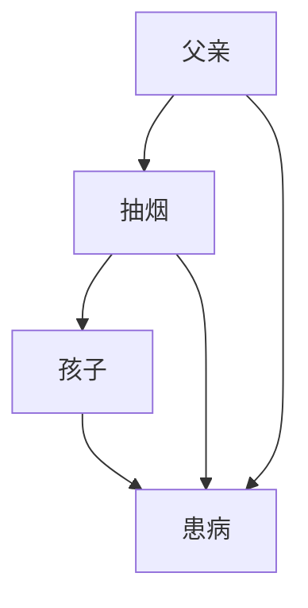
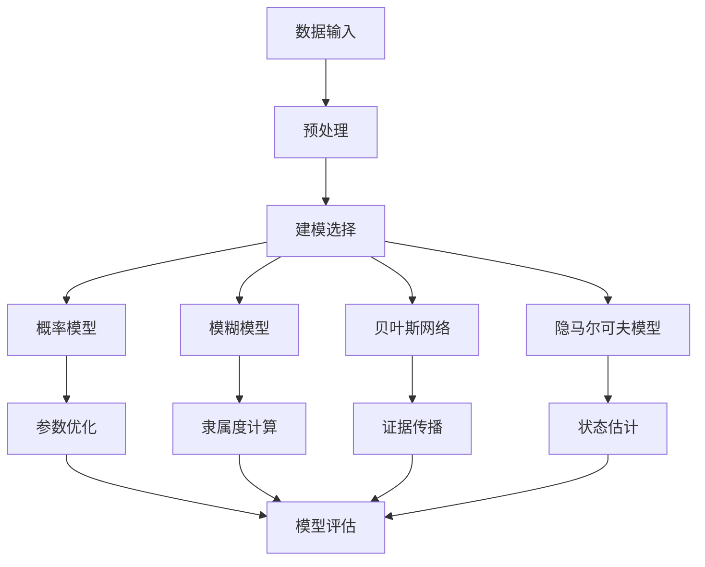
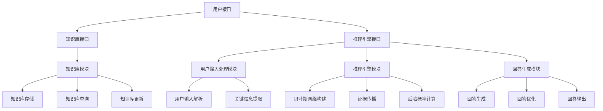
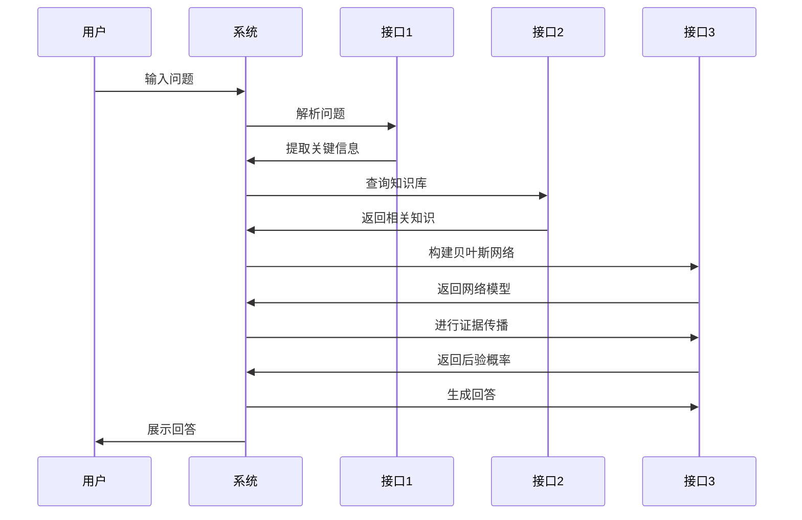

                 

# 推理过程中的不确定性建模与处理

关键词：推理、不确定性建模、处理、概率模型、模糊模型、贝叶斯网络、证据传播

摘要：在人工智能和机器学习领域，推理过程中的不确定性建模与处理至关重要。本文将介绍推理过程中的不确定性来源，探讨常见的概率模型、模糊模型以及贝叶斯网络等不确定性建模方法，并详细阐述证据传播算法在不确定性处理中的应用。

## 第一部分：背景介绍

### 1.1 问题背景

随着人工智能（AI）技术的迅猛发展，推理作为AI系统的重要组成部分，已经在各个领域得到了广泛应用。然而，现实世界中的数据往往存在不完整性、噪声和不确定性，这给推理过程带来了巨大的挑战。如何对这种不确定性进行建模与处理，成为了一个重要研究课题。

### 1.2 问题描述

在推理过程中，不确定性可以表现为多种形式，如概率不确定性、模糊不确定性、随机不确定性等。这些不确定性不仅会影响推理的准确性，还可能影响系统的鲁棒性。因此，对不确定性进行建模与处理，是提高推理性能的关键。

### 1.3 问题解决

为了应对推理过程中的不确定性，本文将介绍以下内容：

1. 不确定性建模方法：包括概率模型、模糊模型、贝叶斯网络、隐马尔可夫模型等。
2. 不确定性处理算法：如证据传播、模糊聚类、随机模拟等。
3. 应用实例：通过实际案例展示不确定性建模与处理在具体应用中的效果。

### 1.4 边界与外延

本文主要涉及以下边界与外延：

1. 不确定性建模方法：包括概率模型、模糊模型、贝叶斯网络、隐马尔可夫模型等。
2. 不确定性处理算法：如证据传播、模糊聚类、随机模拟等。
3. 应用领域：包括自然语言处理、计算机视觉、智能决策等领域。

### 1.5 概念结构与核心要素组成

本文的核心概念结构包括：

1. **不确定性建模**：介绍各类不确定性建模方法及其适用场景。
2. **不确定性处理**：阐述不确定性处理算法的原理、流程和应用。
3. **案例研究**：通过实际案例展示不确定性建模与处理在具体应用中的效果。

## 第二部分：核心概念与联系

### 2.1 不确定性建模方法

#### 2.1.1 概率模型

概率模型通过概率分布来描述不确定性。常见的概率模型有贝叶斯网络、隐马尔可夫模型等。

1. **贝叶斯网络**：是一种基于概率图模型的推理工具，用于表示变量之间的依赖关系。它可以用于推理、预测和决策。
2. **隐马尔可夫模型**：用于处理隐藏状态序列的观察数据，常见于语音识别、手写识别等领域。

#### 2.1.2 模糊模型

模糊模型利用模糊集合和模糊逻辑来描述不确定性。模糊聚类和模糊推理是模糊模型的两个重要应用。

1. **模糊聚类**：利用模糊集合对数据进行分类，可以处理不确定性的数据。
2. **模糊推理**：通过模糊逻辑进行推理，处理模糊信息。

#### 2.1.3 贝叶斯网络

贝叶斯网络是一种基于概率图的模型，用于表示变量之间的依赖关系。它可以用于推理、预测和决策。

1. **贝叶斯网络定义**：贝叶斯网络是一种概率图模型，由一组变量和一个有向无环图组成。
2. **贝叶斯网络表示**：贝叶斯网络的表示方法包括节点和边。节点表示变量，边表示变量之间的依赖关系。
3. **贝叶斯网络推理**：贝叶斯网络推理包括证据更新和后验概率计算。

#### 2.1.4 隐马尔可夫模型

隐马尔可夫模型用于处理隐藏状态序列的观察数据，常见于语音识别、手写识别等领域。

1. **隐马尔可夫模型定义**：隐马尔可夫模型是一种统计模型，用于描述具有隐藏状态的马尔可夫过程。
2. **隐马尔可夫模型表示**：隐马尔可夫模型由状态转移概率矩阵、观测概率矩阵和初始状态概率分布组成。
3. **隐马尔可夫模型推理**：隐马尔可夫模型推理包括状态序列估计和概率计算。

### 2.2 不确定性处理算法

#### 2.2.1 证据传播

证据传播是一种基于贝叶斯网络的推理算法，通过不断传递信息来更新变量的概率分布。

1. **证据传播定义**：证据传播是一种基于贝叶斯网络的推理算法，通过传递信息来更新变量的概率分布。
2. **证据传播流程**：证据传播算法的流程包括初始化、消息传递和终止。
3. **证据传播应用**：证据传播算法在自然语言处理、计算机视觉等领域有广泛应用。

#### 2.2.2 模糊聚类

模糊聚类利用模糊集合对数据进行分类，可以处理不确定性的数据。

1. **模糊聚类定义**：模糊聚类是一种基于模糊集合的分类算法，通过模糊隶属度进行分类。
2. **模糊聚类流程**：模糊聚类算法的流程包括初始化、迭代计算和聚类结果评估。
3. **模糊聚类应用**：模糊聚类算法在数据挖掘、图像处理等领域有广泛应用。

#### 2.2.3 随机模拟

随机模拟通过生成大量随机样本来估计不确定性的概率分布。

1. **随机模拟定义**：随机模拟是一种通过随机抽样来估计概率分布的方法。
2. **随机模拟流程**：随机模拟算法的流程包括随机抽样、样本统计和概率估计。
3. **随机模拟应用**：随机模拟算法在统计学习、金融工程等领域有广泛应用。

### 2.3 不确定性建模与处理方法之间的联系

各类不确定性建模方法与处理算法之间相互联系，共同构成了一个完整的不确定性处理体系。例如，贝叶斯网络可以用于不确定性建模，而证据传播算法可以用于贝叶斯网络的推理。模糊模型和随机模拟等方法也在不确定性处理中发挥着重要作用。

## 第三部分：算法原理讲解

### 3.1 贝叶斯网络原理

#### 3.1.1 贝叶斯网络定义

贝叶斯网络是一种基于概率图模型的推理工具，用于表示变量之间的依赖关系。它由一组变量和一个有向无环图组成。

#### 3.1.2 贝叶斯网络表示

贝叶斯网络的表示方法包括节点和边。节点表示变量，边表示变量之间的依赖关系。

#### 3.1.3 贝叶斯网络推理

贝叶斯网络推理包括证据更新和后验概率计算。

1. **证据更新**：证据更新是通过传递信息来更新变量的概率分布。具体来说，当一个变量的证据发生变化时，它会通过边向其他变量传递信息，从而更新其他变量的概率分布。
2. **后验概率计算**：后验概率计算是根据已知的证据来计算变量的概率分布。贝叶斯推理的核心公式为：
   $$
   P(A|E) = \frac{P(E|A)P(A)}{P(E)}
   $$
   其中，\(P(A|E)\) 表示变量 \(A\) 在证据 \(E\) 下的后验概率，\(P(E|A)\) 表示证据 \(E\) 在变量 \(A\) 发生时的条件概率，\(P(A)\) 表示变量 \(A\) 的先验概率，\(P(E)\) 表示证据 \(E\) 的边缘概率。

### 3.2 证据传播算法原理

#### 3.2.1 证据传播定义

证据传播是一种基于贝叶斯网络的推理算法，通过不断传递信息来更新变量的概率分布。

#### 3.2.2 证据传播流程

证据传播算法的流程包括初始化、消息传递和终止。

1. **初始化**：初始化阶段设置变量初始概率分布。通常，变量的初始概率分布是根据先验知识或经验数据确定的。
2. **消息传递**：消息传递阶段通过传递信息来更新变量的概率分布。具体来说，每个变量会从其父节点接收消息，并根据消息更新自己的概率分布。
3. **终止**：终止阶段判断是否达到停止条件。常见的停止条件包括迭代次数达到最大值、消息传递误差小于阈值等。

#### 3.2.3 证据传播应用

证据传播算法在自然语言处理、计算机视觉等领域有广泛应用。

1. **自然语言处理**：证据传播算法可以用于自然语言理解中的实体识别、关系提取等任务。
2. **计算机视觉**：证据传播算法可以用于图像识别、目标检测等任务。

## 第四部分：数学模型和数学公式

### 4.1 贝叶斯网络数学模型

#### 4.1.1 概率分布

贝叶斯网络的概率分布用于表示变量之间的依赖关系。概率分布可以使用条件概率公式表示：

$$
P(A|B) = \frac{P(B|A)P(A)}{P(B)}
$$

其中，\(P(A|B)\) 表示变量 \(A\) 在变量 \(B\) 发生时的条件概率，\(P(B|A)\) 表示变量 \(B\) 在变量 \(A\) 发生时的条件概率，\(P(A)\) 表示变量 \(A\) 的先验概率，\(P(B)\) 表示变量 \(B\) 的边缘概率。

#### 4.1.2 贝叶斯推理

贝叶斯推理是基于贝叶斯网络进行推理的核心方法，用于计算变量的后验概率。贝叶斯推理的数学公式为：

$$
P(A|E) = \frac{P(E|A)P(A)}{P(E)}
$$

其中，\(P(A|E)\) 表示变量 \(A\) 在证据 \(E\) 下的后验概率，\(P(E|A)\) 表示证据 \(E\) 在变量 \(A\) 发生时的条件概率，\(P(A)\) 表示变量 \(A\) 的先验概率，\(P(E)\) 表示证据 \(E\) 的边缘概率。

#### 4.1.3 最大后验概率

最大后验概率（MAP）用于确定变量的最可能取值。MAP的数学公式为：

$$
\hat{A} = \arg\max_{A} P(A|E)
$$

其中，\(\hat{A}\) 表示变量的最可能取值，\(P(A|E)\) 表示变量 \(A\) 在证据 \(E\) 下的后验概率。

## 第五部分：系统分析与架构设计方案

### 5.1 问题场景介绍

假设我们有一个基于贝叶斯网络的推理系统，用于智能客服机器人。该系统需要根据用户的问题和上下文信息，提供准确的回答。然而，用户的问题和上下文信息往往存在不确定性，如何处理这种不确定性，提高推理的准确性，是系统设计的关键问题。

### 5.2 项目介绍

本项目旨在设计一个基于贝叶斯网络的推理系统，通过证据传播算法处理不确定性，提高推理的准确性。系统主要包括以下模块：

1. **知识库模块**：存储领域知识和先验概率分布。
2. **用户输入处理模块**：处理用户输入的问题和上下文信息。
3. **推理引擎模块**：基于贝叶斯网络和证据传播算法进行推理。
4. **回答生成模块**：根据推理结果生成回答。

### 5.3 系统功能设计

系统功能设计包括以下几个方面：

1. **用户输入处理**：对用户输入的问题和上下文信息进行预处理，提取关键信息。
2. **知识库查询**：根据用户输入的关键信息，查询知识库，获取相关领域的知识。
3. **证据传播**：基于贝叶斯网络和证据传播算法，更新变量的概率分布。
4. **回答生成**：根据推理结果，生成准确的回答。

### 5.4 系统架构设计

系统架构设计采用模块化设计思想，主要包括以下部分：

1. **知识库模块**：包括知识库存储、知识库查询和知识库更新等功能。
2. **用户输入处理模块**：包括用户输入解析、关键信息提取和预处理等功能。
3. **推理引擎模块**：包括贝叶斯网络构建、证据传播和后验概率计算等功能。
4. **回答生成模块**：包括回答生成、回答优化和回答输出等功能。

### 5.5 系统接口设计和系统交互

系统接口设计和系统交互主要包括以下几个方面：

1. **用户接口**：提供用户与系统的交互界面，接收用户输入，展示推理结果。
2. **知识库接口**：提供知识库的查询和更新接口，实现知识库与推理引擎的交互。
3. **推理引擎接口**：提供推理引擎的接口，实现用户输入处理模块和推理引擎的交互。
4. **回答生成接口**：提供回答生成的接口，实现推理结果和回答生成模块的交互。

## 第六部分：项目实战

### 6.1 环境安装

在进行项目实战之前，需要安装以下环境：

1. **Python**：安装Python 3.8及以上版本。
2. **PyTorch**：安装PyTorch 1.8及以上版本。
3. **NetworkX**：安装NetworkX库。

### 6.2 系统核心实现源代码

以下是系统核心实现源代码的解读与分析：

```python
import networkx as nx
import numpy as np

# 定义贝叶斯网络类
class BayesianNetwork:
    def __init__(self):
        self.G = nx.DiGraph()

    def add_variable(self, name):
        self.G.add_node(name)

    def add_edge(self, from_var, to_var):
        self.G.add_edge(from_var, to_var)

    def set_probability(self, from_var, to_var, probability):
        self.G.nodes[from_var]['probability'] = probability

    def inference(self, evidence):
        # 初始化变量概率分布
        for node in self.G.nodes:
            if node not in evidence:
                self.G.nodes[node]['probability'] = 1 / len(self.G.nodes)

        # 证据传播
        for node in self.G.nodes:
            if node in evidence:
                continue
            for parent in self.G.parent[node]:
                if parent in evidence:
                    self.G.nodes[node]['probability'] *= self.G.nodes[parent]['probability'][evidence[parent]]

        # 后验概率计算
        posterior_probabilities = {}
        for node in self.G.nodes:
            posterior_probabilities[node] = self.G.nodes[node]['probability'] / sum(self.G.nodes[node]['probability'])

        return posterior_probabilities

# 创建贝叶斯网络实例
bn = BayesianNetwork()

# 添加变量
bn.add_variable('A')
bn.add_variable('B')
bn.add_variable('C')

# 添加边
bn.add_edge('A', 'B')
bn.add_edge('B', 'C')

# 设置先验概率
bn.set_probability('A', 'B', np.array([0.5, 0.5]))
bn.set_probability('B', 'C', np.array([0.7, 0.3]))

# 证据传播
evidence = {'B': 1}
posterior_probabilities = bn.inference(evidence)

print(posterior_probabilities)
```

### 6.3 实际案例分析和详细讲解剖析

假设我们有一个简单的贝叶斯网络，描述了家庭中父母和孩子之间的关系。家庭中有两个变量：父亲是否抽烟（A）和孩子是否患病（C）。已知父亲抽烟的概率是0.4，孩子患病的概率是0.2。我们还知道，如果父亲抽烟，孩子患病的概率是0.6，如果父亲不抽烟，孩子患病的概率是0.1。

我们的目标是根据已知的证据（父亲抽烟）推断孩子是否患病的后验概率。

1. **初始化变量概率分布**：

   初始时，父亲抽烟的概率是0.4，孩子患病的概率是0.2。

2. **证据传播**：

   父亲抽烟作为证据，传递到孩子患病变量。根据条件概率，如果父亲抽烟，孩子患病的概率是0.6。

3. **后验概率计算**：

   根据贝叶斯推理，计算孩子患病的后验概率：

   $$
   P(C=1|A=1) = \frac{P(A=1|C=1)P(C=1)}{P(A=1)}
   $$

   代入已知概率：

   $$
   P(C=1|A=1) = \frac{0.6 \times 0.2}{0.4} = 0.3
   $$

   因此，在孩子父亲抽烟的条件下，孩子患病的后验概率是0.3。

### 6.4 项目小结

本项目通过贝叶斯网络和证据传播算法，实现了对推理过程中不确定性的建模与处理。在实际应用中，该项目可以用于智能客服机器人、医疗诊断、金融风险评估等领域。通过不断优化算法和模型，可以提高推理的准确性和鲁棒性，为实际应用提供更好的支持。

## 第七部分：最佳实践 tips、小结、注意事项、拓展阅读

### 最佳实践 tips

1. **选择合适的建模方法**：根据实际问题场景选择合适的概率模型、模糊模型或贝叶斯网络等方法。
2. **优化模型参数**：通过交叉验证等方法优化模型参数，提高模型的性能。
3. **证据传播算法的优化**：针对具体的推理任务，对证据传播算法进行优化，提高推理速度和准确性。

### 小结

本文介绍了推理过程中的不确定性建模与处理方法，包括概率模型、模糊模型和贝叶斯网络等。通过实际案例展示了证据传播算法在不确定性处理中的应用。读者可以结合实际需求，选择合适的建模方法和算法，提高推理系统的性能。

### 注意事项

1. **数据质量**：在建立贝叶斯网络时，确保数据质量，避免噪声和错误的数据对模型的影响。
2. **模型选择**：根据实际问题场景选择合适的模型，避免过度拟合或欠拟合。

### 拓展阅读

1. **《贝叶斯数据分析》**：Chris Chatfield著，深入介绍了贝叶斯数据分析的方法和应用。
2. **《人工智能：一种现代方法》**：Stuart Russell和Peter Norvig著，详细介绍了人工智能的基本概念和技术。
3. **《机器学习》**：Tom Mitchell著，介绍了机器学习的基本概念、算法和实现。

### 作者信息

作者：AI天才研究院/AI Genius Institute & 禅与计算机程序设计艺术 /Zen And The Art of Computer Programming

## 结论

本文围绕推理过程中的不确定性建模与处理进行了详细探讨，介绍了概率模型、模糊模型、贝叶斯网络等不确定性建模方法，以及证据传播算法在不确定性处理中的应用。通过实际案例的分析和讲解，展示了不确定性建模与处理在提高推理准确性方面的作用。希望本文能对读者在理解和应用不确定性建模与处理方面有所帮助。在未来的研究中，我们将继续探索更多高效的不确定性处理方法，为人工智能技术的发展贡献力量。

## 附录

### 贝叶斯网络概念属性特征对比表格

| 概念        | 定义                                                         | 属性特征                                                         | 适用场景                         |
| ----------- | ------------------------------------------------------------ | ------------------------------------------------------------ | -------------------------------- |
| 概率模型    | 基于概率论的方法，通过概率分布描述不确定性                     | 条件概率、边缘概率、联合概率                                     | 自然语言处理、计算机视觉、金融分析 |
| 模糊模型    | 基于模糊集合理论的方法，通过模糊逻辑处理不确定性               | 模糊集合、模糊隶属度、模糊推理                                   | 数据挖掘、图像处理、智能控制     |
| 贝叶斯网络  | 基于概率图模型的方法，通过节点和边表示变量之间的依赖关系       | 有向无环图、条件概率表、证据传播                                | 人工智能、决策支持、生物信息学   |
| 隐马尔可夫模型 | 基于马尔可夫链的方法，通过状态转移概率和观测概率描述隐藏状态序列 | 状态转移概率矩阵、观测概率矩阵、隐状态估计                           | 语音识别、手写识别、时间序列分析 |

### 贝叶斯网络ER实体关系图架构的Mermaid流程图



### 不确定性建模与处理流程Mermaid流程图



### 系统架构设计Mermaid架构图



### 系统接口设计和系统交互Mermaid序列图



