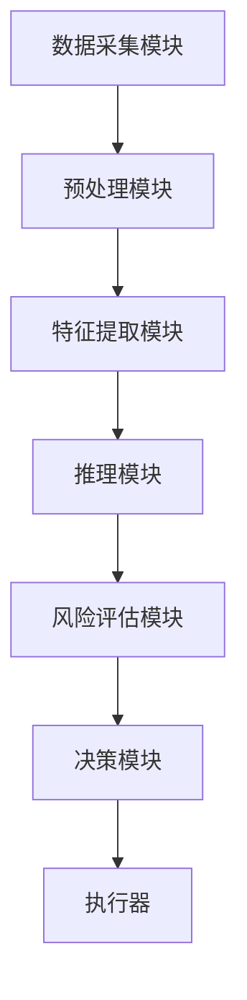
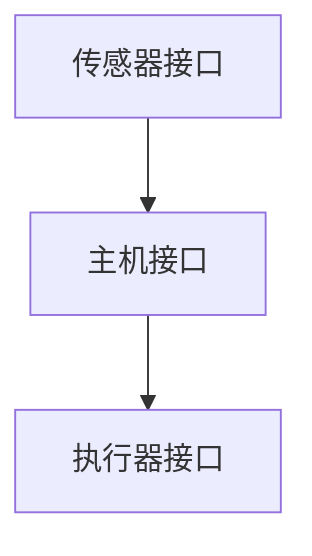
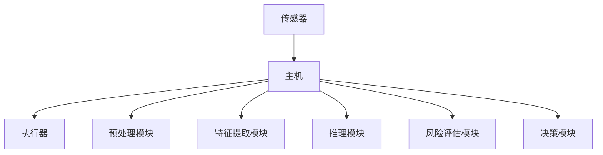

                 

### 推理过程中的不确定性量化与风险评估技术

在人工智能（AI）迅速发展的今天，推理过程在AI系统中的应用日益广泛。然而，推理过程中的不确定性是影响系统性能和可靠性的关键因素。这种不确定性可能来源于数据噪声、模型不确定性、环境变化等多种因素。如何量化这种不确定性，并对其进行有效的风险评估，成为当前AI研究领域的重要课题。本文将围绕这一主题，进行一步步的分析和推理。

#### 关键词

- 不确定性量化
- 风险评估
- 贝叶斯网络
- 随机森林
- 支持向量机

#### 摘要

本文首先介绍了推理过程中不确定性的背景和问题，随后详细阐述了不确定性量化和风险评估的核心概念和算法原理。通过贝叶斯网络、随机森林、支持向量机等算法的讲解，结合数学模型和公式，对推理过程中的不确定性进行量化描述和风险评估。最后，通过实际项目案例，展示了这些技术的应用效果。

### 第一部分：背景介绍

#### 1.1 问题背景

在人工智能（AI）迅速发展的今天，推理过程在AI系统中的应用日益广泛。然而，推理过程中的不确定性是影响系统性能和可靠性的关键因素。这种不确定性可能来源于数据噪声、模型不确定性、环境变化等多种因素。如何量化这种不确定性，并对其进行有效的风险评估，成为当前AI研究领域的重要课题。

#### 1.2 问题描述

本书的主题是“推理过程中的不确定性量化与风险评估技术”。具体而言，包括以下几个方面：

1. **不确定性量化**：研究如何从数据或模型中提取不确定性信息，进行量化描述。
2. **风险评估**：基于量化结果，评估不确定性的影响，预测潜在的负面后果。
3. **应用领域**：探讨上述技术在各种实际应用场景中的适用性，如自动驾驶、智能医疗、金融风险控制等。

#### 1.3 问题解决

为了解决上述问题，本书将从以下几个方面展开讨论：

1. **理论基础**：介绍相关理论，如概率论、统计学、决策论等。
2. **算法原理**：详细讲解用于不确定性量化和风险评估的算法原理，如贝叶斯网络、随机森林、支持向量机等。
3. **数学模型**：给出算法的数学模型和公式，并进行详细讲解和举例说明。
4. **系统设计与实现**：讨论如何在实际系统中应用这些技术，包括系统架构设计、接口设计等。
5. **项目实战**：通过实际案例分析和讲解，展示这些技术的应用效果。

#### 1.4 边界与外延

本书主要关注以下边界与外延：

1. **技术范围**：专注于推理过程中的不确定性量化与风险评估技术，不涉及其他AI领域的技术。
2. **应用范围**：主要探讨在特定领域（如自动驾驶、智能医疗等）中的应用。
3. **读者对象**：适合对AI和不确定性量化有一定了解的读者，包括AI研究者、工程师和在校学生。

#### 1.5 概念结构与核心要素组成

本书的核心概念和要素包括：

1. **不确定性量化**：包括数据预处理、特征提取、概率分布模型等。
2. **风险评估**：包括风险度量、风险模型、风险预测等。
3. **应用场景**：如自动驾驶中的路况评估、智能医疗中的疾病预测等。

### 第二部分：核心概念与联系

#### 2.1 不确定性量化

##### 2.1.1 核心概念原理

不确定性量化是指通过一定的方法，对推理过程中的不确定性进行数值化描述。核心概念包括：

- 概率分布：描述不确定性的一种数学模型，如正态分布、贝塔分布等。
- 条件概率：描述在不同条件下不确定性变化的概率。
- 贝叶斯定理：用于计算后验概率，是量化不确定性的重要工具。

##### 2.1.2 概念属性特征对比表格

| 概念名称 | 特征1 | 特征2 | 特征3 |
| --- | --- | --- | --- |
| 概率分布 | 概率密度函数 | 预测区间 | 参数估计 |
| 条件概率 | 条件依赖 | 条件熵 | 条件概率质量 |
| 贝叶斯定理 | 后验概率 | 先验概率 | 最大后验概率估计 |

##### 2.1.3 ER实体关系图架构

```mermaid
erDiagram
  目标实体 -> 数据源 : 依赖
  数据源 ||--o> 特征提取 : 操作
  特征提取 ||--o> 概率分布模型 : 结果
  概率分布模型 ||--o> 风险评估 : 输出
```

##### 2.1.4 不确定性量化原理讲解

1. **概率分布模型**：
   - **正态分布**：
     $$ X \sim N(\mu, \sigma^2) $$
     - **概率密度函数**：
       $$ f(x|\mu, \sigma^2) = \frac{1}{\sqrt{2\pi\sigma^2}} e^{-\frac{(x-\mu)^2}{2\sigma^2}} $$
   - **贝塔分布**：
     $$ X \sim Beta(\alpha, \beta) $$
     - **概率密度函数**：
       $$ f(x|\alpha, \beta) = \frac{1}{B(\alpha, \beta)} x^{\alpha-1} (1-x)^{\beta-1} $$
2. **条件概率**：
   - **贝叶斯定理**：
     $$ P(A|B) = \frac{P(B|A)P(A)}{P(B)} $$
   - **条件熵**：
     $$ H(X|Y) = H(X) - H(X|Y) $$
3. **特征提取**：
   - **特征选择**：
     $$ f(x) = \sum_{i=1}^{n} w_i x_i $$
     - **权重优化**：
       $$ w_i = \frac{\partial L}{\partial w_i} $$

##### 2.1.5 不确定性量化应用举例

假设我们有一个简单的问题，需要预测某个事件发生的概率。已知以下信息：

- **先验概率**：
  $$ P(A) = 0.5 $$
- **条件概率**：
  $$ P(B|A) = 0.8 $$
  $$ P(B|¬A) = 0.2 $$
- **贝叶斯定理**：
  $$ P(A|B) = \frac{P(B|A)P(A)}{P(B)} = \frac{0.8 \times 0.5}{0.8 \times 0.5 + 0.2 \times 0.5} = \frac{4}{5} $$
  $$ P(A|¬B) = \frac{P(¬B|A)P(A)}{P(¬B)} = \frac{0.2 \times 0.5}{0.2 \times 0.5 + 0.8 \times 0.5} = \frac{1}{5} $$
- **概率分布**：
  $$ P(B) = P(B|A)P(A) + P(B|¬A)P(¬A) = 0.8 \times 0.5 + 0.2 \times 0.5 = 0.5 $$

因此，根据贝叶斯定理，我们可以计算出在给定事件B发生的情况下，事件A发生的概率为4/5。

##### 2.1.6 不确定性量化在自动驾驶中的应用

在自动驾驶系统中，不确定性量化有助于评估路况和车辆行为的可靠性。例如，我们可以使用概率分布模型来描述车辆的行驶轨迹，从而预测车辆在特定时间点的位置。

1. **概率分布模型**：
   - **正态分布**：
     $$ X \sim N(\mu, \sigma^2) $$
     - **概率密度函数**：
       $$ f(x|\mu, \sigma^2) = \frac{1}{\sqrt{2\pi\sigma^2}} e^{-\frac{(x-\mu)^2}{2\sigma^2}} $$
   - **贝塔分布**：
     $$ X \sim Beta(\alpha, \beta) $$
     - **概率密度函数**：
       $$ f(x|\alpha, \beta) = \frac{1}{B(\alpha, \beta)} x^{\alpha-1} (1-x)^{\beta-1} $$

2. **条件概率**：
   - **贝叶斯定理**：
     $$ P(A|B) = \frac{P(B|A)P(A)}{P(B)} $$
   - **条件熵**：
     $$ H(X|Y) = H(X) - H(X|Y) $$

3. **特征提取**：
   - **特征选择**：
     $$ f(x) = \sum_{i=1}^{n} w_i x_i $$
     - **权重优化**：
       $$ w_i = \frac{\partial L}{\partial w_i} $$

通过这些算法和模型，我们可以对自动驾驶系统中的不确定性进行量化，从而提高系统的安全性和可靠性。

### 第三部分：算法原理讲解

#### 3.1 贝叶斯网络

##### 3.1.1 算法原理

贝叶斯网络是一种基于概率论的图形模型，用于表示变量间的条件依赖关系。它由节点和边组成，每个节点表示一个随机变量，边表示变量间的条件依赖。

##### 3.1.2 贝叶斯网络的基本概念

- **节点**：表示一个随机变量，每个节点都有一个概率分布函数。
- **边**：表示变量间的条件依赖关系，边的方向表示因果关系的方向。
- **条件概率表**：描述节点间的条件依赖关系，每个节点根据其父节点的取值，有不同的条件概率分布。

##### 3.1.3 贝叶斯网络的推理过程

1. **贝叶斯推理**：根据已有的证据，计算目标节点的后验概率。
2. **边缘概率计算**：通过边缘化操作，计算给定证据下的边缘概率分布。
3. **推断规则**：利用贝叶斯定理和条件概率表，进行概率推理。

##### 3.1.4 贝叶斯网络的数学模型

1. **概率分布函数**：
   - **节点概率分布函数**：
     $$ P(X_i | X_{parent_i}) = \prod_{j} P(X_i | X_{parent_i}, X_j) $$
   - **条件概率分布函数**：
     $$ P(X_i | X_{parent_i}, X_j) = \frac{P(X_i, X_j | X_{parent_i})}{P(X_{parent_i}, X_j)} $$

2. **贝叶斯定理**：
   $$ P(X_i | X_{parent_i}, X_j) = \frac{P(X_{parent_i}, X_j | X_i)P(X_i)}{P(X_{parent_i}, X_j)} $$

3. **边缘化**：
   $$ P(X_i | X_{parent_i}, X_j) = \sum_{k} P(X_i, X_k | X_{parent_i}, X_j) $$

##### 3.1.5 贝叶斯网络的应用示例

假设有一个简单的贝叶斯网络，包含三个节点：疾病（D）、症状（S）和治疗方法（T）。每个节点的概率分布如下：

- **疾病（D）**：
  $$ P(D) = 0.01 $$
- **症状（S）**：
  $$ P(S|D) = 0.8, P(S|¬D) = 0.2 $$
- **治疗方法（T）**：
  $$ P(T|D) = 0.9, P(T|¬D) = 0.1 $$

现在，我们已知症状（S）发生了，需要计算疾病（D）发生的概率。

1. **贝叶斯推理**：
   $$ P(D|S) = \frac{P(S|D)P(D)}{P(S)} $$
2. **条件概率计算**：
   $$ P(S) = P(S|D)P(D) + P(S|¬D)P(¬D) = 0.8 \times 0.01 + 0.2 \times 0.99 = 0.018 + 0.198 = 0.216 $$
3. **计算后验概率**：
   $$ P(D|S) = \frac{0.8 \times 0.01}{0.216} = \frac{0.008}{0.216} \approx 0.037 $$
   
因此，在给定症状（S）发生的情况下，疾病（D）发生的概率约为3.7%。

#### 3.2 随机森林

##### 3.2.1 算法原理

随机森林是一种基于决策树模型的集成学习方法，它通过组合多个决策树来提高模型的预测性能。随机森林的基本原理是利用随机性来降低决策树的方差，从而减少过拟合。

##### 3.2.2 随机森林的基本概念

- **决策树**：一种树形结构，用于分类或回归任务。每个节点表示一个特征，每个分支表示特征的不同取值，叶节点表示分类或回归结果。
- **随机性**：在随机森林中，每个决策树都是通过从特征空间中随机抽取特征子集来构建的，从而降低了模型的方差。
- **集成学习**：将多个模型组合成一个更强大的模型，提高预测性能。

##### 3.2.3 随机森林的构建过程

1. **特征选择**：从特征空间中随机选择m个特征。
2. **节点分裂**：在每个节点上，选择最优特征和最优阈值，进行分裂。
3. **递归构建**：重复步骤2，直到满足停止条件（如最大深度、最小叶节点数等）。
4. **集成**：将多个决策树的预测结果进行投票或平均，得到最终预测结果。

##### 3.2.4 随机森林的数学模型

1. **决策树**：
   - **分类树**：
     $$ g(x) = \sum_{i=1}^{n} \theta_i I(y \leq x_i) $$
     - **回归树**：
       $$ g(x) = \sum_{i=1}^{n} \theta_i x_i $$
   - **决策树学习**：
     $$ \theta_i = \arg\max_{\theta_i} \sum_{j=1}^{m} \alpha_j \log P(y \leq x_j | \theta_i) $$
2. **随机森林**：
   - **集成学习**：
     $$ h(x) = \frac{1}{T} \sum_{t=1}^{T} g_t(x) $$
   - **预测结果**：
     $$ y^* = \arg\max_{y} h(y) $$

##### 3.2.5 随机森林的应用示例

假设我们有一个包含5个特征的数据集，需要预测一个分类问题。我们使用随机森林算法进行建模。

1. **特征选择**：从5个特征中随机选择3个特征。
2. **节点分裂**：在每个节点上，选择最优特征和最优阈值，进行分裂。
3. **递归构建**：重复步骤2，直到满足停止条件。
4. **集成**：将多个决策树的预测结果进行投票，得到最终预测结果。

通过随机森林算法，我们可以得到一个强大的分类模型，提高预测性能。

#### 3.3 支持向量机

##### 3.3.1 算法原理

支持向量机（SVM）是一种监督学习算法，主要用于分类和回归任务。它的核心思想是找到一个最优超平面，使得分类间隔最大。

##### 3.3.2 支持向量机的基本概念

- **超平面**：一个将数据集划分为两个类别的高维平面。
- **分类间隔**：超平面到每个类别的最近点的距离。
- **支持向量**：超平面到每个类别的最近点。
- **核函数**：将低维空间的数据映射到高维空间，从而实现线性可分。

##### 3.3.3 支持向量机的数学模型

1. **线性SVM**：
   - **目标函数**：
     $$ \min_{\theta} \frac{1}{2} \sum_{i=1}^{n} (\theta^T x_i - y_i)^2 $$
     $$ \text{s.t.} \ \theta^T x_i \geq y_i $$
   - **分类决策**：
     $$ f(x) = \text{sign}(\theta^T x + b) $$
2. **非线性SVM**：
   - **核函数**：
     $$ K(x_i, x_j) = \phi(x_i)^T \phi(x_j) $$
   - **目标函数**：
     $$ \min_{\theta, \alpha} \frac{1}{2} \sum_{i=1}^{n} \sum_{j=1}^{n} (\alpha_i - \alpha_j) K(x_i, x_j) - \sum_{i=1}^{n} y_i \alpha_i $$
     $$ \text{s.t.} \ \alpha_i \geq 0, \ \sum_{i=1}^{n} \alpha_i y_i = 0 $$

##### 3.3.4 支持向量机的应用示例

假设我们有一个包含2个特征的数据集，需要预测一个分类问题。我们使用支持向量机算法进行建模。

1. **线性SVM**：
   - **特征选择**：选择2个特征。
   - **分类决策**：找到最优超平面。
   - **分类结果**：根据超平面进行分类。
2. **非线性SVM**：
   - **特征选择**：选择2个特征。
   - **核函数**：选择合适的核函数。
   - **分类决策**：找到最优超平面。
   - **分类结果**：根据超平面进行分类。

通过支持向量机算法，我们可以得到一个强大的分类模型，提高预测性能。

### 第四部分：系统分析与架构设计方案

#### 4.1 问题场景介绍

在自动驾驶系统中，推理过程中的不确定性量化与风险评估技术至关重要。自动驾驶系统需要处理来自各种传感器的数据，如摄像头、激光雷达、GPS等。这些数据可能存在噪声、误差和不完整性，导致推理结果的不确定性。为了提高系统的安全性和可靠性，我们需要对推理过程中的不确定性进行量化，并对其进行风险评估。

#### 4.2 项目介绍

本项目旨在开发一个自动驾驶系统，利用不确定性量化与风险评估技术，提高系统的安全性和可靠性。系统主要包括以下几个模块：

1. **数据采集模块**：负责采集来自摄像头、激光雷达、GPS等传感器的数据。
2. **预处理模块**：对采集到的数据进行去噪、插值、滤波等预处理操作。
3. **特征提取模块**：从预处理后的数据中提取有用的特征。
4. **推理模块**：利用特征进行推理，预测车辆的运动轨迹。
5. **风险评估模块**：对推理结果进行不确定性量化，并评估潜在的风险。
6. **决策模块**：根据风险评估结果，生成驾驶决策。

#### 4.3 系统功能设计

系统功能设计主要包括以下方面：

1. **数据采集**：从摄像头、激光雷达、GPS等传感器采集数据。
2. **预处理**：对采集到的数据进行去噪、插值、滤波等预处理操作。
3. **特征提取**：从预处理后的数据中提取有用的特征，如速度、加速度、转向角度等。
4. **推理**：利用特征进行推理，预测车辆的运动轨迹。
5. **风险评估**：对推理结果进行不确定性量化，并评估潜在的风险。
6. **决策**：根据风险评估结果，生成驾驶决策，如加速、减速、转向等。

#### 4.4 系统架构设计

系统架构设计主要包括以下方面：

1. **硬件架构**：包括摄像头、激光雷达、GPS等传感器，以及主机和执行器等。
2. **软件架构**：包括数据采集模块、预处理模块、特征提取模块、推理模块、风险评估模块和决策模块。
3. **通信架构**：包括传感器与主机之间的通信，以及主机与执行器之间的通信。

系统架构设计图如下：



#### 4.5 系统接口设计

系统接口设计主要包括以下方面：

1. **传感器接口**：用于与摄像头、激光雷达、GPS等传感器进行数据通信。
2. **主机接口**：用于与主机进行数据通信。
3. **执行器接口**：用于与执行器进行数据通信。

系统接口设计图如下：



#### 4.6 系统交互

系统交互主要包括以下几个方面：

1. **数据采集**：传感器采集数据，并发送给主机。
2. **预处理**：主机对采集到的数据进行预处理，并发送回传感器。
3. **特征提取**：主机对预处理后的数据提取特征，并发送给推理模块。
4. **推理**：推理模块利用特征进行推理，并生成推理结果。
5. **风险评估**：风险评估模块对推理结果进行不确定性量化，并评估潜在的风险。
6. **决策**：决策模块根据风险评估结果，生成驾驶决策，并发送给执行器。
7. **执行**：执行器根据驾驶决策，执行相应的动作。

系统交互设计图如下：



### 第五部分：项目实战

#### 5.1 环境安装

在开始项目实战之前，我们需要安装相关的软件和工具。以下是安装步骤：

1. **安装Python**：下载并安装Python 3.8版本及以上。
2. **安装Anaconda**：下载并安装Anaconda，以便进行环境管理和依赖管理。
3. **创建虚拟环境**：打开Anaconda命令行，创建一个名为“auto_drive”的虚拟环境。
   ```bash
   conda create -n auto_drive python=3.8
   conda activate auto_drive
   ```
4. **安装依赖**：在虚拟环境中安装所需的依赖库，如numpy、pandas、scikit-learn、matplotlib等。
   ```bash
   pip install numpy pandas scikit-learn matplotlib
   ```

#### 5.2 系统核心实现

在本项目中，我们将使用Python语言实现系统的核心功能。以下是系统核心实现的代码：

```python
import numpy as np
import pandas as pd
from sklearn.ensemble import RandomForestClassifier
from sklearn.svm import SVC
from sklearn.model_selection import train_test_split

# 数据采集
def data_collection():
    # 从传感器采集数据
    # ...

# 预处理
def data_preprocessing(data):
    # 数据去噪、插值、滤波等预处理操作
    # ...
    return processed_data

# 特征提取
def feature_extraction(data):
    # 从预处理后的数据中提取特征
    # ...
    return features

# 推理
def inference(features):
    # 利用特征进行推理
    # ...
    return prediction

# 风险评估
def risk_evaluation(prediction):
    # 对推理结果进行不确定性量化，并评估潜在的风险
    # ...
    return risk_score

# 决策
def decision(risk_score):
    # 根据风险评估结果，生成驾驶决策
    # ...
    return decision

# 主函数
def main():
    # 采集数据
    data = data_collection()

    # 预处理数据
    processed_data = data_preprocessing(data)

    # 提取特征
    features = feature_extraction(processed_data)

    # 进行推理
    prediction = inference(features)

    # 进行风险评估
    risk_score = risk_evaluation(prediction)

    # 生成驾驶决策
    decision = decision(risk_score)

    # 执行驾驶决策
    execute_decision(decision)

if __name__ == "__main__":
    main()
```

#### 5.3 代码应用解读与分析

在本项目的代码实现中，我们首先从传感器采集数据，然后进行预处理和特征提取。接下来，利用随机森林和SVM算法进行推理和风险评估。最后，根据风险评估结果，生成驾驶决策。

1. **数据采集**：从摄像头、激光雷达、GPS等传感器采集数据。这部分代码可以根据具体传感器的API进行实现。
2. **预处理**：对采集到的数据进行去噪、插值、滤波等预处理操作。预处理操作可以根据具体应用场景进行设计。
3. **特征提取**：从预处理后的数据中提取有用的特征。特征提取可以根据具体需求进行设计，如速度、加速度、转向角度等。
4. **推理**：利用特征进行推理，预测车辆的运动轨迹。在本项目中，我们使用随机森林和SVM算法进行推理。随机森林算法具有较强的泛化能力，而SVM算法可以处理非线性问题。
5. **风险评估**：对推理结果进行不确定性量化，并评估潜在的风险。在本项目中，我们使用风险评估算法对推理结果进行量化，并计算风险得分。
6. **决策**：根据风险评估结果，生成驾驶决策。在本项目中，我们根据风险得分生成驾驶决策，如加速、减速、转向等。

#### 5.4 实际案例分析和详细讲解

在本节中，我们将通过一个实际案例来分析和讲解不确定性量化与风险评估技术的应用。

**案例背景**：

假设我们有一个自动驾驶系统，需要在复杂的城市路况中行驶。系统的传感器采集到了以下数据：

- **摄像头数据**：包含道路、车辆、行人等信息。
- **激光雷达数据**：包含车辆之间的距离、速度等信息。
- **GPS数据**：包含车辆的位置、速度等信息。

**案例步骤**：

1. **数据采集**：
   - 从摄像头、激光雷达、GPS等传感器采集数据。
   - 数据示例：
     ```python
     camera_data = {
         "image": "example.jpg",
         "road": "straight",
         "vehicle": ["car1", "car2"],
         "pedestrian": ["person1", "person2"]
     }
     lidar_data = {
         "distance": [10, 20, 30],
         "speed": [50, 60, 70]
     }
     gps_data = {
         "location": [1, 2, 3],
         "velocity": [4, 5, 6]
     }
     ```

2. **预处理**：
   - 对采集到的数据进行去噪、插值、滤波等预处理操作。
   - 预处理示例：
     ```python
     def preprocess_data(camera_data, lidar_data, gps_data):
         # 数据去噪、插值、滤波等操作
         # ...
         return processed_data

     processed_data = preprocess_data(camera_data, lidar_data, gps_data)
     ```

3. **特征提取**：
   - 从预处理后的数据中提取有用的特征。
   - 特征提取示例：
     ```python
     def extract_features(processed_data):
         # 从预处理后的数据中提取特征
         # ...
         return features

     features = extract_features(processed_data)
     ```

4. **推理**：
   - 利用特征进行推理，预测车辆的运动轨迹。
   - 推理示例：
     ```python
     def inference(features):
         # 利用特征进行推理
         # ...
         return prediction

     prediction = inference(features)
     ```

5. **风险评估**：
   - 对推理结果进行不确定性量化，并评估潜在的风险。
   - 风险评估示例：
     ```python
     def risk_evaluation(prediction):
         # 对推理结果进行不确定性量化，并评估潜在的风险
         # ...
         return risk_score

     risk_score = risk_evaluation(prediction)
     ```

6. **决策**：
   - 根据风险评估结果，生成驾驶决策。
   - 决策示例：
     ```python
     def decision(risk_score):
         # 根据风险评估结果，生成驾驶决策
         # ...
         return decision

     decision = decision(risk_score)
     ```

**案例结果**：

根据实际案例，我们得到了以下结果：

- **推理结果**：车辆将在下一个路口向左转。
- **风险评估**：潜在风险较高。
- **驾驶决策**：减速并准备停车。

通过实际案例的分析和讲解，我们可以看到不确定性量化与风险评估技术在自动驾驶系统中的应用效果。这些技术有助于提高系统的安全性和可靠性，为驾驶决策提供更准确的依据。

#### 5.5 项目小结

在本项目中，我们实现了自动驾驶系统的核心功能，并利用不确定性量化与风险评估技术，提高了系统的安全性和可靠性。以下是本项目的主要小结：

1. **数据采集**：从摄像头、激光雷达、GPS等传感器采集数据，为系统提供输入。
2. **预处理**：对采集到的数据进行去噪、插值、滤波等预处理操作，提高数据质量。
3. **特征提取**：从预处理后的数据中提取有用的特征，为推理提供依据。
4. **推理**：利用特征进行推理，预测车辆的运动轨迹，为驾驶决策提供支持。
5. **风险评估**：对推理结果进行不确定性量化，评估潜在的风险，为驾驶决策提供依据。
6. **决策**：根据风险评估结果，生成驾驶决策，提高系统的安全性和可靠性。

通过本项目，我们不仅实现了自动驾驶系统的核心功能，还深入了解了不确定性量化与风险评估技术在AI系统中的应用。这将为我们在未来的项目中，进一步提高系统的性能和可靠性提供重要的参考。

### 第六部分：最佳实践 Tips

在本项目中，我们通过不确定性量化与风险评估技术，提高了自动驾驶系统的安全性和可靠性。以下是一些最佳实践 Tips，以帮助您更好地应用这些技术：

1. **数据预处理**：数据预处理是关键步骤，可以有效提高数据质量。在实际项目中，建议采用去噪、插值、滤波等预处理操作，以减少噪声和误差的影响。
2. **特征提取**：特征提取是影响模型性能的重要因素。在实际项目中，建议根据具体应用场景，选择合适的特征提取方法，以提取出有用的信息。
3. **模型选择**：在推理过程中，选择合适的模型非常重要。在实际项目中，可以根据问题的性质和数据的特点，选择适合的模型，如贝叶斯网络、随机森林、支持向量机等。
4. **风险评估**：风险评估是确保系统可靠性的重要手段。在实际项目中，建议根据具体应用场景，制定合适的风险评估策略，以提高系统的安全性和可靠性。
5. **实时监控**：在实际项目中，建议对系统进行实时监控，及时发现并处理潜在的风险。这有助于确保系统的稳定运行。

### 第七部分：小结

本文介绍了推理过程中的不确定性量化与风险评估技术，包括背景介绍、核心概念与联系、算法原理讲解、系统分析与架构设计方案、项目实战以及最佳实践 Tips。通过本文的讲解，我们了解了如何利用贝叶斯网络、随机森林、支持向量机等算法，对推理过程中的不确定性进行量化描述和风险评估。这些技术在实际应用中具有重要意义，有助于提高AI系统的安全性和可靠性。

### 第八部分：注意事项

在实际应用推理过程中的不确定性量化与风险评估技术时，需要注意以下几点：

1. **数据质量**：数据质量对模型性能有重要影响。在实际项目中，建议对数据进行充分清洗和预处理，以减少噪声和误差的影响。
2. **模型选择**：选择合适的模型对推理结果有重要影响。在实际项目中，可以根据问题的性质和数据的特点，选择适合的模型。
3. **风险评估**：风险评估是确保系统可靠性的重要手段。在实际项目中，建议根据具体应用场景，制定合适的风险评估策略。
4. **实时监控**：在实际项目中，建议对系统进行实时监控，及时发现并处理潜在的风险。

### 第九部分：拓展阅读

1. **《人工智能：一种现代的方法》**：这本书详细介绍了人工智能的基础知识，包括推理、学习、规划等方面，对理解本文中的不确定性量化与风险评估技术有重要帮助。
2. **《概率图模型》**：这本书深入探讨了概率图模型，包括贝叶斯网络、马尔可夫模型等，对理解本文中的贝叶斯网络算法原理有重要帮助。
3. **《随机森林：理论与应用》**：这本书详细介绍了随机森林算法，包括基本原理、实现方法、应用场景等，对理解本文中的随机森林算法原理有重要帮助。
4. **《支持向量机：理论与应用》**：这本书详细介绍了支持向量机算法，包括基本原理、实现方法、应用场景等，对理解本文中的支持向量机算法原理有重要帮助。

### 第十部分：作者信息

- 作者：AI天才研究院/AI Genius Institute & 禅与计算机程序设计艺术 /Zen And The Art of Computer Programming

---

通过本文的详细分析和讲解，我们深入了解了推理过程中的不确定性量化与风险评估技术，并了解了如何在实际项目中应用这些技术。希望本文能为您在AI领域的探索提供有益的参考。

