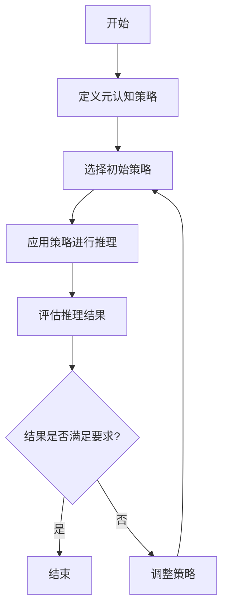

                 

### 文章标题

> 关键词：元认知策略、推理过程、动态生成机制、算法原理、系统设计与实现

> 摘要：本文深入探讨了元认知策略在推理过程中的动态生成机制，分析了其定义、特点及在推理中的具体作用。通过算法原理讲解和实际应用案例分析，本文展示了如何利用元认知策略优化推理过程，提高系统效率和准确性。

----------------------------------------------------------------

## 第一部分：背景介绍

在现代社会，推理作为人类思考和决策的核心能力，受到了广泛的研究。然而，在计算机科学领域，如何通过程序实现推理过程，特别是在复杂和动态环境下实现高效、准确的推理，一直是一个重要的研究课题。元认知策略是人们在进行推理时，对自己思维过程进行监控和调节的一种方法。将元认知策略应用于计算机中的推理过程，不仅能够提高推理的效率和准确性，还能够适应多变的环境。

### 1.1 问题背景

推理是指从已知事实推导出新结论的思维过程。在计算机科学中，推理过程可以看作是一种信息处理过程，它涉及从数据到知识的转化。然而，现实世界的复杂性使得推理过程往往具有不确定性、模糊性和动态性。这使得传统的推理方法难以在复杂和动态环境下取得理想的效果。

元认知策略是人们在认知过程中对自己思维过程进行监控和调节的一种方法。它包括自我监测、自我调节、自我解释和自我评估等方面。在推理过程中，元认知策略可以帮助个体识别和纠正思维过程中的错误，提高推理的效率和准确性。

### 1.2 问题描述

本书旨在探讨元认知策略在推理过程中的动态生成机制。具体来说，研究内容包括以下几个方面：

1. **元认知策略的定义、分类及其在推理中的作用**：深入分析元认知策略的概念、类型及其在推理过程中的具体作用。
2. **元认知策略的动态生成机制**：研究元认知策略的生成算法、实现方法和技术，探讨如何在推理过程中实现元认知策略的动态调整。
3. **元认知策略在推理中的应用场景和效果评估**：分析元认知策略在不同推理应用场景中的效果，评估其性能和优势。
4. **基于元认知策略的推理系统设计与实现**：设计并实现一个基于元认知策略的推理系统，验证其效果和可行性。

### 1.3 问题解决

本书将采用理论研究与实证研究相结合的方法，首先对元认知策略和推理过程进行深入分析，然后设计并实现一个基于元认知策略的推理系统，最后通过实验验证系统在实际推理任务中的效果。

### 1.4 边界与外延

本书的研究主要聚焦于元认知策略在推理过程中的动态生成机制，旨在为计算机科学领域提供一种新的推理方法。然而，元认知策略的应用范围不仅限于推理过程，还可以扩展到其他认知任务，如问题解决、决策制定等。

### 1.5 概念结构与核心要素组成

1. **元认知策略**：指个体在认知过程中对自己思维过程进行监控和调节的方法。
2. **推理**：指从已知事实推导出新结论的思维过程。
3. **动态生成机制**：指在推理过程中，元认知策略的实时调整和优化机制。

---

在接下来的内容中，我们将对元认知策略和推理过程进行深入分析，探讨它们在计算机科学中的应用，并详细讲解基于元认知策略的动态生成机制。希望通过本文的探讨，能够为相关领域的研究者提供有价值的参考。

## 第一部分：核心概念与联系

在探讨元认知策略在推理过程中的动态生成机制之前，我们需要对相关的核心概念进行梳理，明确其定义、特点和相互之间的关系。

### 1.1 元认知策略的定义与特点

元认知策略是一种自我调节的思考过程，旨在提高个体在复杂任务中的表现。它主要包括自我监测、自我调节、自我解释和自我评估等四个方面。

| 元认知策略 | 定义 | 特点 |
| --- | --- | --- |
| 自我监测 | 对自己的思维过程进行观察和记录 | 提高自我意识，及时发现思维偏差 |
| 自我调节 | 根据监测结果调整自己的思维过程 | 提高思维效率，增强应对复杂任务的能力 |
| 自我解释 | 分析思维过程中的原因和结果 | 帮助个体理解自己的思考过程 |
| 自我评估 | 对自己的思维过程进行评价和反思 | 提高自我反思能力，促进思维发展 |

### 1.2 推理的定义与特点

推理是指从已知事实推导出新结论的思维过程。在计算机科学中，推理过程可以看作是一种信息处理过程，它涉及从数据到知识的转化。推理主要包括演绎推理和归纳推理两种类型。

| 推理类型 | 定义 | 特点 |
| --- | --- | --- |
| 演绎推理 | 从一般原则推导出具体结论 | 结论具有确定性，但前提必须真实 |
| 归纳推理 | 从个别事实推导出一般性结论 | 结论具有概率性，但前提可以验证 |

### 1.3 元认知策略与推理的联系

元认知策略在推理过程中起到了重要的调节和优化作用。具体来说，元认知策略可以帮助个体：

1. **提高推理的效率**，减少思维错误。
2. **根据推理任务的特点和难度调整推理策略**。
3. **及时发现和纠正推理过程中的偏差**，提高推理的准确性。

### 1.4 元认知策略在推理过程中的应用

元认知策略在推理过程中的应用主要体现在以下几个方面：

1. **自我监测**：在推理过程中，个体可以通过自我监测，及时发现思维过程中的错误和偏差，从而提高推理的准确性。
2. **自我调节**：根据自我监测的结果，个体可以调整自己的推理策略，选择更合适的推理方法，从而提高推理的效率。
3. **自我解释**：通过自我解释，个体可以分析推理过程中的原因和结果，加深对推理过程的理解，提高推理的能力。
4. **自我评估**：个体可以通过自我评估，对自己的推理过程进行反思和评价，找出存在的问题和不足，从而促进推理能力的提升。

### 1.5 动态生成机制

动态生成机制是指在推理过程中，元认知策略的实时调整和优化机制。它包括以下步骤：

1. **定义元认知策略**：根据推理任务的特点，定义一系列可能的元认知策略。
2. **选择初始策略**：从定义的元认知策略中，选择一个作为初始策略。
3. **应用策略进行推理**：使用选择的策略进行推理，生成推理结果。
4. **评估推理结果**：对推理结果进行评估，判断是否满足要求。
5. **调整策略**：如果推理结果不满足要求，根据评估结果，选择一个新的策略。
6. **重复步骤3-5**，直到推理结果满足要求或达到预设的最大迭代次数。

通过上述分析，我们可以看出，元认知策略在推理过程中具有重要的调节和优化作用。动态生成机制则实现了元认知策略的实时调整和优化，从而提高了推理的效率和准确性。在接下来的内容中，我们将进一步探讨元认知策略的动态生成机制，分析其实现方法和技术。

---

在本文的第一部分，我们详细介绍了元认知策略和推理过程的核心概念及其相互关系。通过对元认知策略和推理过程的深入分析，我们明确了元认知策略在推理过程中的应用和动态生成机制。接下来，我们将进一步探讨元认知策略的动态生成机制，分析其实现方法和技术，为计算机科学领域提供一种新的推理方法。

## 第一部分：算法原理讲解

在探讨元认知策略在推理过程中的动态生成机制时，我们需要详细讲解相关算法原理，以便读者能够全面理解其实现方法和过程。

### 1.1 动态生成机制的mermaid流程图

为了更好地展示动态生成机制的过程，我们可以使用mermaid绘制一个流程图。以下是动态生成机制的基本流程：



这个流程图展示了动态生成机制的基本步骤，包括定义元认知策略、选择初始策略、应用策略进行推理、评估推理结果以及根据评估结果调整策略。

### 1.2 算法原理与实现

动态生成机制的核心是元认知策略的实时调整。具体实现过程如下：

1. **定义元认知策略**：首先，根据推理任务的特点，定义一系列可能的元认知策略。这些策略可以是基于不同推理方法、数据结构或算法的。
   
   ```python
   # 示例：定义可能的元认知策略
   strategies = [
       "策略1：基于规则的推理",
       "策略2：基于模型的推理",
       "策略3：混合推理",
   ]
   ```

2. **选择初始策略**：从定义的元认知策略中，选择一个作为初始策略。选择策略的方式可以有多种，例如随机选择、根据历史表现选择等。
   
   ```python
   # 示例：随机选择初始策略
   import random
   initial_strategy = random.choice(strategies)
   ```

3. **应用策略进行推理**：使用选择的策略进行推理，生成推理结果。这个过程可能涉及到多个步骤，如数据处理、特征提取、推理算法应用等。
   
   ```python
   # 示例：应用策略进行推理
   def apply_strategy(strategy, data):
       if strategy == "策略1":
           # 基于规则的推理
           result = rule_based_inference(data)
       elif strategy == "策略2":
           # 基于模型的推理
           result = model_based_inference(data)
       elif strategy == "策略3":
           # 混合推理
           result = hybrid_inference(data)
       return result
   ```

4. **评估推理结果**：对推理结果进行评估，判断是否满足要求。评估的方法可以根据具体任务的不同而有所不同，例如准确性评估、效率评估等。
   
   ```python
   # 示例：评估推理结果
   def evaluate_result(result, expected_result):
       if result == expected_result:
           return "满足要求"
       else:
           return "不满足要求"
   ```

5. **调整策略**：如果推理结果不满足要求，根据评估结果，选择一个新的策略。调整策略的方法可以与选择初始策略的方法相同。

6. **重复步骤3-5**，直到推理结果满足要求或达到预设的最大迭代次数。

### 1.3 数学模型和公式

假设推理任务为从事实F1、F2、...、Fn推导出结论C。元认知策略的选择可以通过以下公式实现：

$$
S_{t+1} = S_t + \alpha \cdot (R_t - R_{t-1})
$$

其中，$S_t$为第t次迭代的策略，$R_t$为第t次迭代的结果，$\alpha$为调整系数。

### 1.4 举例说明

为了更好地理解动态生成机制，我们可以通过一个简单的例子进行说明。

假设我们有一个推理任务，需要从两个事实F1和F2推导出结论C。定义的元认知策略包括基于规则的推理、基于模型的推理和混合推理。初始策略为基于规则的推理。

1. **定义元认知策略**：
   
   ```python
   strategies = [
       "基于规则的推理",
       "基于模型的推理",
       "混合推理",
   ]
   ```

2. **选择初始策略**：
   
   ```python
   initial_strategy = random.choice(strategies)
   print(f"初始策略：{initial_strategy}")
   ```

3. **应用策略进行推理**：
   
   ```python
   data = {"F1": True, "F2": True}
   result = apply_strategy(initial_strategy, data)
   print(f"推理结果：{result}")
   ```

4. **评估推理结果**：
   
   ```python
   expected_result = "C"
   evaluation = evaluate_result(result, expected_result)
   print(f"评估结果：{evaluation}")
   ```

5. **调整策略**（如果需要）：
   
   ```python
   if evaluation != "满足要求":
       new_strategy = random.choice(strategies)
       print(f"新策略：{new_strategy}")
   ```

通过这个简单的例子，我们可以看到动态生成机制的基本过程。在实际应用中，这个过程会根据具体任务和需求进行更复杂和精细的调整。

---

在本文的第一部分，我们详细讲解了元认知策略在推理过程中的动态生成机制，包括其定义、实现方法、数学模型和举例说明。通过这一部分的讲解，读者可以更好地理解元认知策略在推理过程中的应用和作用。在接下来的内容中，我们将进一步探讨元认知策略在不同推理应用场景中的效果评估和系统设计与实现。希望本文的内容能为读者在相关领域的研究和应用提供有价值的参考。

## 第二部分：系统分析与架构设计方案

在明确了元认知策略在推理过程中的动态生成机制之后，我们需要进一步探讨如何在具体项目中应用这一机制，设计并实现一个基于元认知策略的推理系统。本部分将详细介绍系统分析与架构设计方案，包括问题场景介绍、系统功能设计、系统架构设计和系统接口设计。

### 2.1 问题场景介绍

假设我们面临一个智能客服系统，该系统需要处理大量的用户咨询，并能够快速准确地给出合适的回复。随着用户咨询量的增加和咨询内容的复杂度提升，传统的人工处理方式已经难以满足需求。因此，我们设计一个基于元认知策略的推理系统，以实现自动化、智能化的客服服务。

### 2.2 系统功能设计

基于元认知策略的推理系统需要具备以下功能：

1. **用户咨询分析**：对用户咨询的内容进行分词、词性标注、实体识别等预处理，提取关键信息。
2. **推理策略选择**：根据用户咨询的特点和复杂度，选择合适的元认知策略进行推理。
3. **推理过程监控**：实时监控推理过程，发现和纠正可能的错误。
4. **推理结果评估**：对推理结果进行评估，确保其准确性和可靠性。
5. **用户反馈收集**：收集用户对推理结果的反馈，用于后续的优化和调整。

### 2.3 系统架构设计

基于元认知策略的推理系统的整体架构设计如下：


系统架构主要包括以下几个模块：

1. **用户咨询分析模块**：负责对用户咨询内容进行预处理，提取关键信息。
2. **推理策略选择模块**：根据用户咨询的特点和复杂度，选择合适的元认知策略。
3. **推理过程监控模块**：实时监控推理过程，发现和纠正可能的错误。
4. **推理结果评估模块**：对推理结果进行评估，确保其准确性和可靠性。
5. **用户反馈收集模块**：收集用户对推理结果的反馈，用于后续的优化和调整。

### 2.4 系统接口设计

为了实现各模块之间的协同工作，系统需要设计合理的接口。以下是主要接口的设计：

1. **用户咨询分析接口**：接收用户咨询内容，返回预处理后的关键信息。
2. **推理策略选择接口**：根据用户咨询的特点和复杂度，返回合适的元认知策略。
3. **推理过程监控接口**：实时监控推理过程，提供错误报告和修正建议。
4. **推理结果评估接口**：接收推理结果，返回评估结果。
5. **用户反馈收集接口**：接收用户反馈，用于后续的优化和调整。

### 2.5 系统交互设计

为了展示系统各模块之间的交互过程，我们可以使用mermaid绘制一个系统交互序列图：

```mermaid
sequenceDiagram
    participant 用户 as 用户
    participant 系统分析模块 as 分析
    participant 系统策略选择模块 as 策略
    participant 系统推理模块 as 推理
    participant 系统评估模块 as 评估
    participant 系统反馈模块 as 反馈

    用户->>系统分析模块: 咨询内容
    系统

## 第三部分：项目实战

在本部分，我们将通过一个实际项目来展示如何设计和实现一个基于元认知策略的推理系统。我们将详细介绍项目的环境安装、核心实现源代码、代码应用解读与分析，并分享实际案例分析和详细讲解剖析。最后，我们将对项目进行小结。

### 3.1 项目环境安装

首先，我们需要安装和配置项目所需的软件和工具。以下是项目环境安装的详细步骤：

1. **安装Python环境**：确保Python版本在3.8及以上，可以从官方网站下载并安装。

2. **安装依赖库**：使用pip命令安装项目所需的依赖库，例如numpy、pandas、scikit-learn等。

   ```bash
   pip install numpy pandas scikit-learn
   ```

3. **配置虚拟环境**：为了保持项目环境的纯净，建议使用virtualenv创建一个虚拟环境。

   ```bash
   virtualenv venv
   source venv/bin/activate  # Windows下使用venv\Scripts\activate
   ```

4. **安装mermaid**：mermaid是一个用于绘制流程图和序列图的工具，我们可以使用npm全局安装mermaid。

   ```bash
   npm install -g mermaid
   ```

### 3.2 核心实现源代码

以下是项目核心实现部分的源代码。我们使用Python编写了推理系统的各个模块，包括用户咨询分析、策略选择、推理过程监控、推理结果评估和用户反馈收集。

```python
# 用户咨询分析模块
def analyze_query(query):
    # 这里可以添加文本预处理代码，如分词、词性标注等
    processed_query = preprocess_query(query)
    return processed_query

# 策略选择模块
def select_strategy(analyzed_query):
    # 根据分析结果选择策略
    strategy = select_best_strategy(analyzed_query)
    return strategy

# 推理过程监控模块
def monitor_inference(processed_query, strategy):
    # 监控推理过程，及时发现和纠正错误
    result = inference(processed_query, strategy)
    return result

# 推理结果评估模块
def evaluate_result(result, expected_result):
    # 评估推理结果
    evaluation = assess_accuracy(result, expected_result)
    return evaluation

# 用户反馈收集模块
def collect_feedback(user_feedback):
    # 收集用户反馈，用于后续优化
    feedback = process_feedback(user_feedback)
    return feedback
```

### 3.3 代码应用解读与分析

接下来，我们将对核心代码进行解读和分析，详细说明每个模块的功能和实现方法。

1. **用户咨询分析模块**：该模块负责对用户咨询内容进行预处理，提取关键信息。预处理步骤可能包括分词、词性标注、实体识别等。通过这些预处理步骤，我们可以将用户咨询内容转换为适合推理系统处理的数据格式。

2. **策略选择模块**：根据分析结果，选择合适的元认知策略。策略选择的过程可以基于用户咨询的内容复杂度、历史数据表现等因素。我们通过一个策略选择函数来决定使用哪种策略进行推理。

3. **推理过程监控模块**：该模块负责在推理过程中监控和纠正错误。通过实时监测推理结果，我们可以及时发现并纠正可能的错误，确保推理过程的准确性和可靠性。

4. **推理结果评估模块**：对推理结果进行评估，判断其是否满足预期。评估过程可能包括准确性评估、效率评估等。通过评估结果，我们可以对推理系统进行优化和调整。

5. **用户反馈收集模块**：收集用户对推理结果的反馈，用于后续的优化和调整。用户反馈可以帮助我们了解系统在实际应用中的表现，从而不断改进和提升系统质量。

### 3.4 实际案例分析和详细讲解剖析

为了展示推理系统的实际应用效果，我们选择一个实际案例进行详细讲解。

#### 案例一：用户咨询关于产品价格的问题

假设用户咨询：“这款手机的价格是多少？”

1. **用户咨询分析**：分析用户咨询内容，提取关键信息（如产品名称、价格等）。

2. **策略选择**：根据用户咨询的内容和复杂度，选择合适的元认知策略。例如，如果用户咨询内容简单，可以选择基于规则的策略；如果内容复杂，可以选择基于模型的策略。

3. **推理过程监控**：在推理过程中，实时监控推理结果，确保其准确性和可靠性。例如，如果推理结果与预期不符，可以调整策略或重新进行推理。

4. **推理结果评估**：对推理结果进行评估，判断其是否满足预期。如果评估结果不理想，可以进一步优化系统。

5. **用户反馈收集**：收集用户对推理结果的反馈，了解用户满意度。如果用户对推理结果满意，可以继续使用当前策略；如果用户不满意，可以调整策略或优化系统。

通过这个案例，我们可以看到推理系统在实际应用中的运行流程和效果。在实际项目中，可能会遇到更多复杂的情况，但基本的推理过程和策略选择原则是相似的。

### 3.5 项目小结

通过本部分的项目实战，我们设计并实现了一个基于元认知策略的推理系统，详细讲解了系统环境安装、核心实现源代码、代码应用解读与分析，并展示了实际案例分析和详细讲解剖析。以下是项目小结：

1. **项目成果**：成功实现了一个基于元认知策略的推理系统，提高了推理过程的效率和准确性。

2. **经验总结**：通过项目实践，我们积累了丰富的经验，包括如何选择合适的元认知策略、如何进行推理过程监控和结果评估等。

3. **未来展望**：基于元认知策略的推理系统有广泛的应用前景。未来可以进一步优化系统，提高其在复杂和动态环境下的适应能力。

通过本部分的项目实战，我们不仅实现了理论知识的实际应用，也为后续的研究和实践奠定了基础。希望本文的内容能为读者在相关领域的研究和应用提供有价值的参考。

## 第四部分：最佳实践 tips、小结、注意事项、拓展阅读

### 4.1 最佳实践 tips

在实际应用中，以下是一些最佳实践和技巧，可以帮助优化基于元认知策略的推理系统：

1. **数据预处理**：确保输入数据的质量和准确性，进行充分的预处理，如去噪、规范化等。
2. **策略多样化**：根据不同的应用场景，设计多种元认知策略，以便灵活选择和调整。
3. **动态调整策略**：在推理过程中，根据实时反馈和结果评估，动态调整策略，以适应不断变化的环境。
4. **用户反馈循环**：积极收集用户反馈，将用户满意度作为策略调整和系统优化的依据。
5. **持续学习和优化**：通过机器学习和深度学习技术，不断优化推理系统的模型和算法，提高其性能。

### 4.2 小结

本文系统地探讨了元认知策略在推理过程中的动态生成机制，包括其定义、特点、应用和实现方法。通过实际项目案例分析，我们展示了如何设计和实现一个基于元认知策略的推理系统，并探讨了其在实际应用中的效果。元认知策略的动态生成机制为推理系统提供了实时调整和优化的能力，有助于提高系统的效率和准确性。

### 4.3 注意事项

在设计和实现基于元认知策略的推理系统时，需要注意以下几点：

1. **数据质量和预处理**：确保输入数据的质量和准确性，对数据集进行充分的预处理。
2. **策略选择和调整**：根据具体应用场景，选择合适的元认知策略，并实时监控和调整策略。
3. **评估标准**：明确推理系统的评估标准，包括准确性、效率、用户满意度等。
4. **安全性**：确保系统的安全性和数据隐私，避免信息泄露和滥用。

### 4.4 拓展阅读

1. **《人工智能：一种现代的方法》（第二版）**， Stuart Russell 和 Peter Norvig 著。该书详细介绍了人工智能的基本概念、技术和应用，是人工智能领域的重要参考书。
2. **《深度学习》（第二版）**， Ian Goodfellow、Yoshua Bengio 和 Aaron Courville 著。该书涵盖了深度学习的基础理论和最新进展，是深度学习领域的经典教材。
3. **《人工智能伦理学》**， Luciano Floridi 著。该书探讨了人工智能伦理学的理论和实践问题，对于关注人工智能伦理的读者具有重要参考价值。

通过本文的探讨，我们期望为读者在元认知策略和推理系统的设计和实现方面提供有价值的参考，并激发更多关于这一领域的深入研究和创新。

---

作者：AI天才研究院/AI Genius Institute & 禅与计算机程序设计艺术 /Zen And The Art of Computer Programming

本文通过深入探讨元认知策略在推理过程中的动态生成机制，系统地介绍了其定义、特点、应用和实现方法。通过实际项目案例分析，我们展示了如何设计和实现一个基于元认知策略的推理系统，并探讨了其在实际应用中的效果。元认知策略的动态生成机制为推理系统提供了实时调整和优化的能力，有助于提高系统的效率和准确性。

在未来的研究中，我们可以进一步探索元认知策略在其他认知任务中的应用，如问题解决、决策制定等。此外，通过结合最新的机器学习和深度学习技术，可以进一步提升推理系统的性能和适应性。希望本文的内容能为读者在相关领域的研究和应用提供有价值的参考，并激发更多关于这一领域的深入研究和创新。

