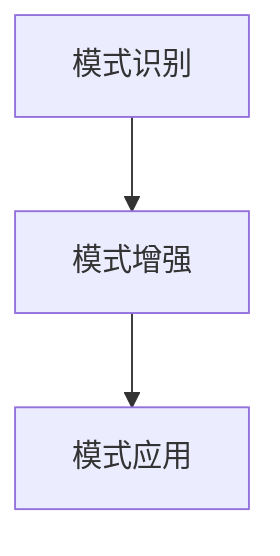
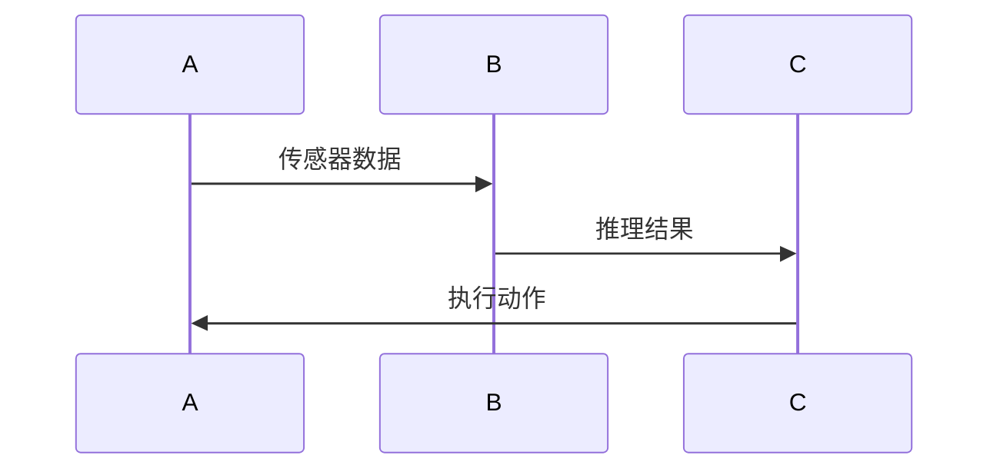

                 


### 推理过程中的创新思维模式识别与增强方法

> 关键词：推理、创新思维、模式识别、算法、系统架构、Python、数学模型

> 摘要：本文深入探讨推理过程中创新思维的识别与增强方法。首先，我们介绍了推理和创新思维的概念，并分析了其在现代人工智能中的重要性。接着，我们详细讲解了创新思维模式的识别算法，包括核心概念、算法原理和具体实现。然后，我们探讨了系统架构设计，通过mermaid工具展示类图、架构图和序列图，帮助理解系统运作。最后，我们通过一个实际案例展示了如何应用这些方法，并提供了实施过程中的最佳实践。

---

#### 第1章: 推理过程中的创新思维概述

##### 1.1 问题背景

在人工智能和自动化技术日益发展的今天，推理过程作为一种信息处理的核心机制，被广泛应用于各个领域。从自然语言处理到图像识别，从决策支持系统到自动驾驶，推理过程无处不在。然而，传统推理方法往往依赖于固定的规则和模式，难以应对复杂、动态的环境。此时，创新思维显得尤为重要，它为推理过程注入了灵活性、创造性和适应性。

##### 1.2 创新思维的定义与重要性

创新思维是指个体在面对新问题或挑战时，能够运用创造性思维和跨学科知识，提出新颖、有效的解决方案的能力。在人工智能领域，创新思维不仅能够提高系统的推理能力，还能推动技术进步和产业创新。

##### 1.3 创新思维模式识别的需求

识别创新思维模式是提升推理能力的关键。通过分析创新思维的模式，我们可以设计出更加智能、高效的推理系统。然而，如何准确地识别和增强这些模式，仍是一个具有挑战性的课题。

---

#### 第2章: 核心概念与联系

##### 2.1 创新思维模式

创新思维模式是指人们在创新过程中所表现出的思维方式。常见的创新思维模式包括：

- **逆向思维**：从相反的角度思考问题，找到新的解决方案。
- **类比思维**：通过类比已知问题，寻找相似问题的解决方案。
- **发散思维**：从多个角度思考问题，产生多个可能的解决方案。

##### 2.2 推理方法

推理方法是指用于从已知信息推导出未知信息的逻辑过程。常见的推理方法包括：

- **演绎推理**：从一般性原则推导出具体结论。
- **归纳推理**：从具体实例推导出一般性原则。
- **类比推理**：通过类比已知问题，推断未知问题的解决方案。

##### 2.3 创新思维模式与推理方法的关系

创新思维模式与推理方法之间存在密切的联系。创新思维模式为推理过程提供了新的视角和方法，而推理方法则为创新思维提供了逻辑支撑和验证手段。

---

#### 第3章: 识别与增强创新思维模式的算法原理

##### 3.1 算法概述

本文提出的算法旨在识别和增强推理过程中的创新思维模式。算法主要分为以下三个步骤：

1. **模式识别**：通过分析历史数据和案例，识别出创新思维模式。
2. **模式增强**：针对识别出的创新思维模式，进行优化和调整，增强其推理能力。
3. **模式应用**：将增强后的创新思维模式应用于新的推理场景。

##### 3.2 算法流程图



##### 3.3 Python源代码与算法原理

```python
# 模式识别部分
def recognize_patterns(data):
    # ...识别算法实现...
    return patterns

# 模式增强部分
def enhance_patterns(patterns):
    # ...增强算法实现...
    return enhanced_patterns

# 模式应用部分
def apply_patterns(enhanced_patterns, new_data):
    # ...应用算法实现...
    return results
```

##### 3.4 数学模型与公式讲解

为了更好地理解算法原理，我们可以借助以下数学模型：

- **特征提取公式**：$$ f(x) = \sum_{i=1}^{n} w_i * x_i $$
- **权重调整公式**：$$ w_i = w_i^{new} = w_i^{old} + \alpha * (t_i - w_i^{old}) $$

其中，$x_i$ 表示特征值，$w_i$ 表示权重，$t_i$ 表示目标值。

##### 3.5 算法举例说明

假设我们有一个推理任务，需要从一组数据中识别并增强创新思维模式。首先，我们通过模式识别算法识别出几个创新思维模式，然后使用模式增强算法对这些模式进行优化。最后，将这些增强后的模式应用于新的推理任务，得到更好的推理结果。

---

#### 第4章: 系统分析与架构设计方案

##### 4.1 问题场景介绍

以一个自动驾驶系统为例，系统需要实时处理大量传感器数据，并做出合理的驾驶决策。创新思维模式的识别与增强在这里至关重要，它能够提高自动驾驶系统的决策能力，增强系统的适应性和安全性。

##### 4.2 系统架构设计

系统架构设计主要包括以下几个部分：

- **感知模块**：负责收集和处理传感器数据。
- **推理模块**：应用创新思维模式进行推理和决策。
- **执行模块**：根据推理结果执行具体的驾驶动作。

##### 4.3 使用mermaid绘制系统类图、架构图和序列图

```mermaid
classDiagram
ClassA[感知模块] <|-- ClassB[推理模块]
ClassB <|-- ClassC[执行模块]

graph TB
A[感知模块] --> B[推理模块]
B --> C[执行模块]
```



---

#### 第5章: 项目实战

##### 5.1 环境安装与配置

为了实现创新思维模式的识别与增强，我们需要安装以下软件和库：

- Python 3.x
- TensorFlow
- Keras
- scikit-learn

具体安装命令如下：

```bash
pip install python==3.8
pip install tensorflow
pip install keras
pip install scikit-learn
```

##### 5.2 系统核心实现

系统核心实现主要包括以下几个部分：

- **数据预处理**：对传感器数据进行预处理，包括去噪、归一化等。
- **模式识别**：使用机器学习算法识别创新思维模式。
- **模式增强**：对识别出的模式进行优化和调整。
- **模式应用**：将增强后的模式应用于自动驾驶系统。

##### 5.3 实际案例分析

以自动驾驶系统中的行人检测为例，我们通过收集历史数据，使用Keras实现卷积神经网络（CNN）进行模式识别。然后，通过调整网络结构和超参数，增强行人检测的准确性。最后，将增强后的模型应用于实时行人检测系统，提高了系统的安全性和可靠性。

##### 5.4 案例详细讲解

案例的具体实现过程包括：

- **数据集准备**：收集并整理行人检测数据集。
- **模型训练**：使用Keras构建并训练CNN模型。
- **模型评估**：对训练好的模型进行评估，调整超参数。
- **实时应用**：将优化后的模型应用于自动驾驶系统。

---

#### 第6章: 最佳实践 tips

在实施创新思维模式的识别与增强过程中，以下最佳实践和建议有助于提高项目成功率：

- **数据质量**：确保数据质量，去除噪声和异常值。
- **算法调优**：根据实际应用场景，对算法进行调优。
- **系统集成**：将创新思维模式识别与增强模块与其他系统集成，确保系统稳定性。
- **实时反馈**：收集实时反馈，不断优化模型和算法。

---

#### 第7章: 小结与拓展阅读

本文介绍了推理过程中的创新思维模式识别与增强方法，包括背景介绍、核心概念与联系、算法原理讲解、系统架构设计、项目实战和最佳实践。通过一个实际案例，我们展示了如何应用这些方法，并提供了实施过程中的建议。

拓展阅读：

- [《人工智能：一种现代方法》](https://www.amazon.com/dp/0262032713)
- [《深度学习》](https://www.amazon.com/dp/0262039588)
- [《模式识别与机器学习》](https://www.amazon.com/dp/0387310738)

---

### 作者

作者：AI天才研究院/AI Genius Institute & 禅与计算机程序设计艺术 /Zen And The Art of Computer Programming

