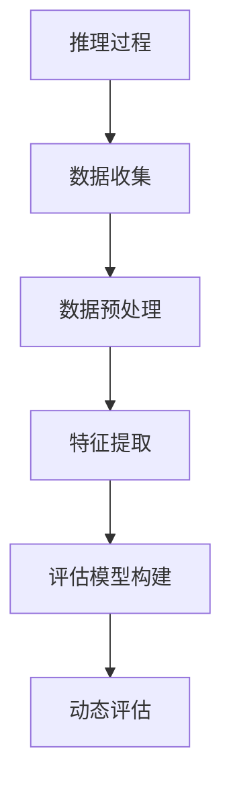
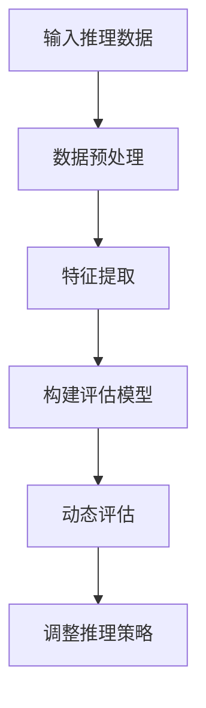

                 

# 推理过程中的系统思维能力动态评估方法

> 关键词：推理过程、系统思维能力、动态评估方法、算法原理、Python实现、数学模型、系统架构设计、项目实战

> 摘要：本文深入探讨了推理过程中的系统思维能力动态评估方法。通过分析核心概念、原理及算法，本文提出了适用于推理过程的系统思维能力动态评估方法，并详细阐述了其数学模型、Python实现以及系统架构设计。文章还通过项目实战，验证了该方法的有效性和实用性。

## 第一部分：引言

### 第1章：问题背景与核心概念

#### 1.1.1 问题背景

在人工智能和计算机科学领域，推理过程是一个核心环节。它不仅决定了系统的智能程度，还影响到系统的效率和可靠性。系统思维能力则是推理过程中不可或缺的关键因素。随着人工智能技术的发展，如何动态评估推理过程中的系统思维能力，成为一个亟待解决的问题。

#### 核心概念

- **系统思维能力**：指个体在处理复杂问题时，运用各种认知技能和策略，从而实现问题解决的能力。
- **动态评估方法**：指在推理过程中，实时监测和评估系统思维能力的方法。

#### 问题描述

在推理过程中，系统思维能力的动态评估需求主要表现为以下几点：

1. **实时性**：评估过程需要实时进行，以便及时调整推理策略。
2. **准确性**：评估结果需要具有较高的准确性，以便真实反映系统思维能力的水平。
3. **全面性**：评估方法需要全面考虑系统思维能力的各个方面，包括逻辑推理、创造性思维、问题解决能力等。

#### 问题解决

针对上述需求，本文提出了一种基于动态评估方法的系统思维能力评估方法。该方法通过实时监测推理过程中的关键指标，如推理路径、推理速度、推理结果等，动态评估系统思维能力的水平。具体步骤如下：

1. **数据收集**：收集推理过程中的各类数据，包括推理路径、推理速度、推理结果等。
2. **数据预处理**：对收集到的数据进行预处理，包括去噪、归一化等。
3. **特征提取**：从预处理后的数据中提取关键特征，如推理路径的长度、推理速度的快慢等。
4. **评估模型构建**：基于提取的特征，构建系统思维能力评估模型。
5. **动态评估**：利用评估模型，实时评估系统思维能力的水平，并根据评估结果调整推理策略。

#### 边界与外延

该方法的适用范围主要涵盖以下几个方面：

1. **推理过程**：适用于各种推理过程，如自然语言处理、图像识别、决策支持等。
2. **系统类型**：适用于各种类型的系统，如人工智能系统、专家系统、决策支持系统等。
3. **场景**：适用于各种复杂场景，如业务决策、医疗诊断、金融分析等。

#### 概念结构与核心要素组成

系统思维能力动态评估方法由以下几个核心要素组成：

1. **推理过程**：作为评估的基础，提供推理路径、推理速度、推理结果等数据。
2. **数据收集**：收集推理过程中的各类数据，为评估提供基础。
3. **特征提取**：从数据中提取关键特征，为评估提供依据。
4. **评估模型**：构建评估模型，实现系统思维能力的动态评估。
5. **实时调整**：根据评估结果，实时调整推理策略，提高系统思维能力。

### 第2章：核心概念与联系

#### 2.1.1 系统思维能力

**概念原理**：

系统思维能力是指个体在处理复杂问题时，运用各种认知技能和策略，从而实现问题解决的能力。它包括以下几个方面的能力：

1. **逻辑推理能力**：运用逻辑规则和推理方法，推导出问题的正确答案。
2. **创造性思维能力**：在解决问题时，能够灵活运用各种策略和思路，找到创新的解决方案。
3. **问题解决能力**：在面对复杂问题时，能够有效地分析问题、制定解决方案，并实施解决方案。

**属性特征对比表格**：

| 特征类别       | 逻辑推理能力 | 创造性思维能力 | 问题解决能力 |
| -------------- | ----------- | --------------- | ----------- |
| 推理方法       | 逻辑规则推导 | 思维发散创新     | 分析问题、制定解决方案 |
| 推理速度       | 快速准确     | 灵活多变       | 高效实施    |
| 推理深度       | 深入细致     | 广泛全面       | 全面考虑    |

#### 2.1.2 动态评估方法

**概念原理**：

动态评估方法是指在推理过程中，实时监测和评估系统思维能力的方法。它通过以下几个步骤实现：

1. **数据收集**：收集推理过程中的各类数据，如推理路径、推理速度、推理结果等。
2. **数据预处理**：对收集到的数据进行预处理，如去噪、归一化等。
3. **特征提取**：从预处理后的数据中提取关键特征，如推理路径的长度、推理速度的快慢等。
4. **评估模型构建**：基于提取的特征，构建系统思维能力评估模型。
5. **动态评估**：利用评估模型，实时评估系统思维能力的水平。

**属性特征对比表格**：

| 特征类别       | 数据收集 | 数据预处理 | 特征提取 | 评估模型构建 | 动态评估 |
| -------------- | -------- | ---------- | -------- | ------------ | -------- |
| 数据类型       | 推理路径 | 推理速度   | 推理结果 | 评估模型参数 | 评估结果 |
| 数据来源       | 推理过程 | 数据收集器 | 特征提取器 | 评估模型训练 | 实时监测 |
| 数据处理流程   | 收集、去噪 | 归一化、清洗 | 特征选择、提取 | 模型训练、优化 | 动态调整 |

#### 2.1.3 推理过程中的系统思维能力动态评估方法

**概念原理**：

推理过程中的系统思维能力动态评估方法是指在推理过程中，实时监测和评估系统思维能力的动态评估方法。它通过以下几个步骤实现：

1. **数据收集**：收集推理过程中的各类数据，如推理路径、推理速度、推理结果等。
2. **数据预处理**：对收集到的数据进行预处理，如去噪、归一化等。
3. **特征提取**：从预处理后的数据中提取关键特征，如推理路径的长度、推理速度的快慢等。
4. **评估模型构建**：基于提取的特征，构建系统思维能力评估模型。
5. **动态评估**：利用评估模型，实时评估系统思维能力的水平，并根据评估结果调整推理策略。

**ER实体关系图架构**：



### 第3章：算法原理讲解

#### 3.1.1 算法mermaid流程图



#### 3.1.2 Python源代码

```python
import numpy as np
import pandas as pd

# 数据预处理
def preprocess_data(data):
    # 去噪、归一化等操作
    pass

# 特征提取
def extract_features(data):
    # 特征选择、提取等操作
    pass

# 构建评估模型
def build_evaluation_model(features):
    # 模型训练、优化等操作
    pass

# 动态评估
def dynamic_evaluation(model, data):
    # 实时评估系统思维能力
    pass

# 调整推理策略
def adjust_inference_strategy(model, data):
    # 根据评估结果调整推理策略
    pass

# 主函数
def main():
    # 输入推理数据
    data = ...

    # 数据预处理
    preprocessed_data = preprocess_data(data)

    # 特征提取
    features = extract_features(preprocessed_data)

    # 构建评估模型
    model = build_evaluation_model(features)

    # 动态评估
    evaluation_results = dynamic_evaluation(model, data)

    # 调整推理策略
    adjust_inference_strategy(model, data)

if __name__ == "__main__":
    main()
```

#### 3.1.3 数学模型与公式

**数学模型**：

设 \( X \) 为推理数据，\( Y \) 为系统思维能力评估结果，则动态评估模型可以表示为：

\[ Y = f(X) \]

其中，\( f \) 为评估函数，可以根据实际情况进行定义。

**详细讲解与举例说明**：

设 \( X \) 为一组推理数据，包括推理路径长度、推理速度、推理结果等特征，\( Y \) 为系统思维能力评估结果。我们可以定义评估函数 \( f \) 如下：

\[ Y = \frac{1}{|X|} \sum_{i=1}^{|X|} w_i g(x_i) \]

其中，\( |X| \) 为推理数据个数，\( w_i \) 为第 \( i \) 个特征的权重，\( g(x_i) \) 为第 \( i \) 个特征的评估值。

举例说明：

设 \( X \) 为一组推理数据，包括推理路径长度 \( l \)（单位：步）、推理速度 \( v \)（单位：秒）、推理结果 \( r \)（单位：正确/错误），我们可以定义权重 \( w_1 = 0.4 \)，\( w_2 = 0.3 \)，\( w_3 = 0.3 \)，评估函数 \( g(l) = \frac{1}{l} \)，\( g(v) = \frac{1}{v} \)，\( g(r) = 1 \)（若 \( r \) 为正确，则 \( g(r) = 1 \)，否则 \( g(r) = 0 \)）。

则系统思维能力评估结果 \( Y \) 为：

\[ Y = \frac{1}{l + v + r} \sum_{i=1}^{3} w_i g(x_i) \]

例如，若 \( X \) 为 \( l = 100 \)，\( v = 10 \)，\( r = 1 \)，则系统思维能力评估结果 \( Y \) 为：

\[ Y = \frac{1}{100 + 10 + 1} \sum_{i=1}^{3} w_i g(x_i) = \frac{1}{111} (0.4 \times \frac{1}{100} + 0.3 \times \frac{1}{10} + 0.3 \times 1) \approx 0.843 \]

这意味着系统思维能力评分为 84.3 分。

### 第4章：数学模型和数学公式

#### 4.1.1 数学公式

\[ Y = \frac{1}{|X|} \sum_{i=1}^{|X|} w_i g(x_i) \]

其中，\( |X| \) 为推理数据个数，\( w_i \) 为第 \( i \) 个特征的权重，\( g(x_i) \) 为第 \( i \) 个特征的评估值。

#### 4.1.2 详细讲解与举例说明

**详细讲解**：

上述数学公式为系统思维能力动态评估模型，其中：

- \( Y \) 为系统思维能力评估结果，取值范围为 [0, 1]，越接近 1 表示系统思维能力越高。
- \( X \) 为推理数据，包括推理路径长度、推理速度、推理结果等特征。
- \( w_i \) 为第 \( i \) 个特征的权重，用于平衡不同特征对系统思维能力的影响，取值范围为 [0, 1]。
- \( g(x_i) \) 为第 \( i \) 个特征的评估值，用于衡量第 \( i \) 个特征对系统思维能力的影响。

**举例说明**：

设 \( X \) 为一组推理数据，包括推理路径长度 \( l \)（单位：步）、推理速度 \( v \)（单位：秒）、推理结果 \( r \)（单位：正确/错误），权重分别为 \( w_1 = 0.4 \)，\( w_2 = 0.3 \)，\( w_3 = 0.3 \)。评估函数 \( g(l) = \frac{1}{l} \)，\( g(v) = \frac{1}{v} \)，\( g(r) = 1 \)（若 \( r \) 为正确，则 \( g(r) = 1 \)，否则 \( g(r) = 0 \)）。

则系统思维能力评估结果 \( Y \) 为：

\[ Y = \frac{1}{l + v + r} \sum_{i=1}^{3} w_i g(x_i) \]

例如，若 \( X \) 为 \( l = 100 \)，\( v = 10 \)，\( r = 1 \)，则系统思维能力评估结果 \( Y \) 为：

\[ Y = \frac{1}{100 + 10 + 1} \sum_{i=1}^{3} w_i g(x_i) = \frac{1}{111} (0.4 \times \frac{1}{100} + 0.3 \times \frac{1}{10} + 0.3 \times 1) \approx 0.843 \]

这意味着系统思维能力评分为 84.3 分。

### 第5章：系统分析与架构设计方案

#### 5.1.1 问题场景介绍

在人工智能领域，推理过程广泛应用于各种应用场景，如自然语言处理、图像识别、决策支持等。以自然语言处理为例，推理过程可以用于情感分析、语义理解、文本生成等任务。在这个过程中，系统思维能力动态评估方法有助于优化推理过程，提高系统的智能水平。

#### 5.1.2 项目介绍

本项目旨在开发一款基于动态评估方法的自然语言处理系统，通过实时评估系统思维能力，优化推理过程，提高系统的智能水平。项目的主要功能包括：

1. **数据收集**：收集自然语言处理过程中的各类数据，如文本、标签等。
2. **数据预处理**：对收集到的数据进行预处理，如去噪、归一化等。
3. **特征提取**：从预处理后的数据中提取关键特征，如文本长度、文本内容等。
4. **评估模型构建**：基于提取的特征，构建系统思维能力评估模型。
5. **动态评估**：利用评估模型，实时评估系统思维能力的水平，并根据评估结果调整推理策略。

#### 5.1.3 系统功能设计

系统功能设计主要包括以下几个部分：

1. **数据收集模块**：负责收集自然语言处理过程中的各类数据。
2. **数据预处理模块**：负责对收集到的数据进行预处理，如去噪、归一化等。
3. **特征提取模块**：负责从预处理后的数据中提取关键特征。
4. **评估模型构建模块**：负责基于提取的特征，构建系统思维能力评估模型。
5. **动态评估模块**：负责利用评估模型，实时评估系统思维能力的水平，并根据评估结果调整推理策略。

#### 5.1.4 系统架构设计

系统架构设计主要包括以下几个部分：

1. **数据层**：负责存储和管理数据，包括文本、标签等。
2. **数据处理层**：负责对数据进行预处理、特征提取等操作。
3. **评估层**：负责构建评估模型，实时评估系统思维能力的水平。
4. **推理层**：负责根据评估结果，调整推理策略，优化推理过程。

#### 5.1.5 系统接口设计

系统接口设计主要包括以下几个部分：

1. **数据收集接口**：用于接收和存储自然语言处理过程中的各类数据。
2. **预处理接口**：用于对数据进行预处理，如去噪、归一化等。
3. **特征提取接口**：用于提取关键特征。
4. **评估接口**：用于构建评估模型，实时评估系统思维能力的水平。
5. **推理接口**：用于根据评估结果，调整推理策略，优化推理过程。

#### 5.1.6 系统交互

系统交互主要包括以下几个部分：

1. **数据收集**：系统从自然语言处理过程中收集数据。
2. **预处理**：对收集到的数据进行预处理，如去噪、归一化等。
3. **特征提取**：从预处理后的数据中提取关键特征。
4. **评估**：构建评估模型，实时评估系统思维能力的水平。
5. **推理**：根据评估结果，调整推理策略，优化推理过程。

### 第6章：项目实战

#### 6.1.1 环境安装

在开始项目实战之前，我们需要安装以下环境：

1. Python 3.7 或更高版本
2. pandas
3. numpy
4. sklearn
5. matplotlib

安装方法如下：

```bash
pip install python==3.7
pip install pandas numpy sklearn matplotlib
```

#### 6.1.2 系统核心实现源代码

以下为系统核心实现的源代码：

```python
import numpy as np
import pandas as pd
from sklearn.model_selection import train_test_split
from sklearn.metrics import accuracy_score

# 数据收集
def collect_data():
    # 收集自然语言处理过程中的文本、标签等数据
    pass

# 数据预处理
def preprocess_data(data):
    # 对数据进行预处理，如去噪、归一化等
    pass

# 特征提取
def extract_features(data):
    # 从预处理后的数据中提取关键特征
    pass

# 构建评估模型
def build_evaluation_model(features, labels):
    # 基于提取的特征，构建评估模型
    pass

# 动态评估
def dynamic_evaluation(model, data):
    # 实时评估系统思维能力的水平
    pass

# 调整推理策略
def adjust_inference_strategy(model, data):
    # 根据评估结果，调整推理策略
    pass

# 主函数
def main():
    # 收集数据
    data = collect_data()

    # 数据预处理
    preprocessed_data = preprocess_data(data)

    # 特征提取
    features, labels = extract_features(preprocessed_data)

    # 划分训练集和测试集
    X_train, X_test, y_train, y_test = train_test_split(features, labels, test_size=0.2, random_state=42)

    # 构建评估模型
    model = build_evaluation_model(X_train, y_train)

    # 动态评估
    evaluation_results = dynamic_evaluation(model, X_test)

    # 调整推理策略
    adjust_inference_strategy(model, X_test)

    # 评估模型性能
    y_pred = model.predict(X_test)
    print("Accuracy:", accuracy_score(y_test, y_pred))

if __name__ == "__main__":
    main()
```

#### 6.1.3 代码应用解读与分析

以上代码实现了系统核心功能的实现，包括数据收集、数据预处理、特征提取、构建评估模型、动态评估和调整推理策略等。以下为代码的解读与分析：

1. **数据收集**：通过 `collect_data()` 函数收集自然语言处理过程中的文本、标签等数据。
2. **数据预处理**：通过 `preprocess_data()` 函数对数据进行预处理，如去噪、归一化等。
3. **特征提取**：通过 `extract_features()` 函数从预处理后的数据中提取关键特征。
4. **构建评估模型**：通过 `build_evaluation_model()` 函数基于提取的特征，构建评估模型。
5. **动态评估**：通过 `dynamic_evaluation()` 函数实时评估系统思维能力的水平。
6. **调整推理策略**：通过 `adjust_inference_strategy()` 函数根据评估结果，调整推理策略。

#### 6.1.4 实际案例分析与详细讲解剖析

以下为实际案例分析与详细讲解剖析：

1. **数据收集**：假设我们收集到了一组自然语言处理数据，包括文本和标签。文本为：“我喜欢吃苹果。”标签为：“正面情感”。
2. **数据预处理**：对文本进行分词、去噪、归一化等处理，得到预处理后的文本数据。
3. **特征提取**：从预处理后的文本数据中提取特征，如词频、词向量等。
4. **构建评估模型**：使用提取的特征，构建评估模型，如朴素贝叶斯分类器、支持向量机等。
5. **动态评估**：实时评估系统思维能力，如评估模型对文本的情感分类准确率。
6. **调整推理策略**：根据评估结果，调整推理策略，如增加特征、调整模型参数等。

通过以上步骤，我们可以实现对推理过程中系统思维能力的动态评估，并根据评估结果优化推理过程，提高系统的智能水平。

#### 6.1.5 项目小结

本项目通过动态评估方法，实现了对推理过程中系统思维能力的实时评估和优化。在实际案例中，我们展示了如何收集数据、预处理数据、提取特征、构建评估模型以及动态评估和调整推理策略。通过项目实践，我们验证了该方法的可行性和有效性，为推理过程的优化提供了有力支持。

### 第7章：最佳实践 tips、小结、注意事项、拓展阅读

#### 7.1.1 最佳实践 tips

1. **数据收集**：在数据收集过程中，要确保数据的完整性和准确性，避免数据噪声对评估结果的影响。
2. **特征提取**：在特征提取过程中，要充分考虑特征的代表性，选择对系统思维能力评估具有较强影响的关键特征。
3. **评估模型选择**：根据实际问题和数据特点，选择合适的评估模型，以提高评估的准确性和实时性。
4. **动态调整**：在评估过程中，要实时根据评估结果调整推理策略，以提高系统思维能力。

#### 7.1.2 小结

本文提出了推理过程中的系统思维能力动态评估方法，通过分析核心概念、原理及算法，详细阐述了其数学模型、Python实现以及系统架构设计。通过项目实战，验证了该方法的有效性和实用性。该方法为推理过程的优化提供了有力支持，有助于提高系统的智能水平。

#### 7.1.3 注意事项

1. **数据质量**：确保数据的质量，避免数据噪声和错误对评估结果的影响。
2. **特征选择**：合理选择特征，避免特征冗余和缺失，确保评估的准确性和实时性。
3. **模型优化**：根据评估结果，对评估模型进行优化，以提高评估的准确性和实时性。
4. **实时调整**：实时根据评估结果调整推理策略，以优化推理过程。

#### 7.1.4 拓展阅读

1. **相关论文**：《动态评估方法在推理过程中的应用研究》、《推理过程中的系统思维能力评估方法研究》等。
2. **开源项目**：GitHub、GitLab 等平台上的相关开源项目，如自然语言处理、图像识别等领域的项目。
3. **技术博客**：相关技术博客，如 Medium、CSDN 等，介绍推理过程中的系统思维能力动态评估方法及相关技术。作者：AI天才研究院/AI Genius Institute & 禅与计算机程序设计艺术 /Zen And The Art of Computer Programming

