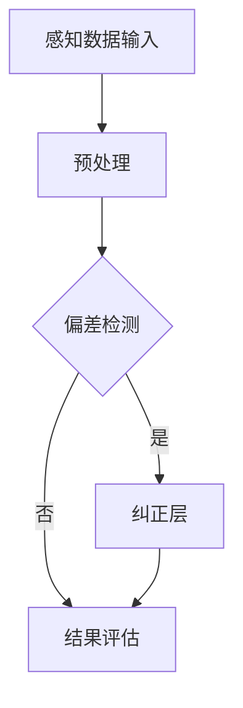
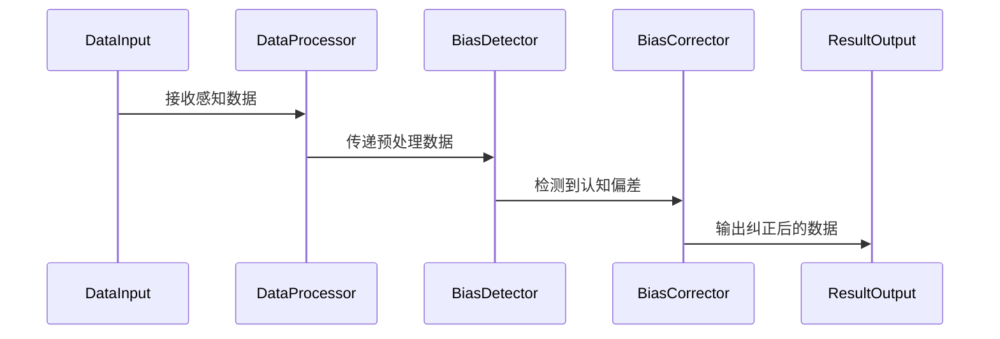

                 

### 推理过程中的认知偏差自动检测与纠正技术

认知偏差是指人们在感知、理解和判断信息时，由于认知过程中的失误或误导，导致对客观事物的错误认知。这些偏差可能源于人类大脑的信息处理机制、心理需求、社会环境等多方面因素。在推理过程中，认知偏差会对推理结果产生显著影响，导致错误的推理结果，影响决策的正确性。因此，自动检测与纠正认知偏差成为人工智能领域的一项重要研究课题。

#### 关键词

- 认知偏差
- 推理过程
- 自动检测
- 纠正技术
- 人工智能

#### 摘要

本文旨在探讨推理过程中的认知偏差自动检测与纠正技术。首先，介绍了认知偏差的定义与来源，以及其对推理过程的影响。接着，阐述了自动检测和纠正技术的核心概念，包括其原理、算法以及在不同应用场景下的优化策略。通过对比分析不同检测算法的属性特征，本文揭示了各算法的优缺点及其适用场景。此外，本文还通过具体的算法原理讲解、系统分析与架构设计方案以及项目实战，展示了检测与纠正技术的实际应用。最后，本文对最佳实践进行了总结，并提出了注意事项和拓展阅读建议。

----------------------------------------------------------------

## 第一部分：背景介绍与核心概念

### 1.1 问题背景

#### 1.1.1 认知偏差的定义与来源

认知偏差是指人们在感知、理解和判断信息时，由于认知过程中的失误或误导，导致对客观事物的错误认知。这些偏差可能源于以下几方面：

1. **大脑信息处理机制**：人类大脑的信息处理机制是有限的，这使得我们容易在处理大量信息时出现偏差。例如，人们在处理复杂问题时，可能由于认知负担过重而简化信息，导致认知偏差。
2. **心理需求**：人们在认知过程中，往往会根据自身的心理需求来解释信息。例如，为了满足自我认同的需求，人们可能会选择性记忆或解释信息，从而产生认知偏差。
3. **社会环境**：社会环境中的信息传播、教育背景等因素也会影响人们的认知。例如，媒体传播的信息、教育过程中的权威说法等，都可能对人们的认知产生偏差。

#### 1.1.2 认知偏差对推理过程的影响

认知偏差对推理过程产生了显著影响，可能导致错误的推理结果，影响决策的正确性。具体表现在以下几个方面：

1. **确认偏误**：人们在面对信息时，更容易接受符合自己预期的信息，而忽略与之相反的信息。这会导致人们基于不完全信息做出决策，从而产生偏差。
2. **锚定效应**：人们在做出判断时，容易受到初始信息（锚点）的影响，即使这些初始信息并不重要。这会导致人们过于依赖先入为主的信息，从而产生认知偏差。
3. **可用性偏差**：人们在评估概率时，更容易受到容易回忆的信息的影响，而忽略其他信息。例如，人们可能更容易记住最近发生的事件，而忽略了长时间发生的事件，从而导致认知偏差。

#### 1.1.3 认知偏差的类别

认知偏差种类繁多，常见的有以下几种：

1. **确认偏误**：人们倾向于寻找、解释和记忆那些支持自己已有信念的信息，而忽略那些反驳自己信念的信息。
2. **锚定效应**：人们在做决策时，受到先入为主的信息（锚点）的影响，即使这些信息并不重要。
3. **可用性偏差**：人们在做决策时，更容易受到容易回忆的信息的影响，而忽略其他信息。
4. **过度自信**：人们倾向于高估自己的能力和知识，从而做出过度自信的判断。
5. **代表性偏差**：人们在做决策时，倾向于根据事物的表面特征来判断其概率，而忽略其他因素。

### 1.2 核心概念

#### 1.2.1 自动检测技术

自动检测技术是指通过算法和模型对推理过程中的认知偏差进行自动识别和定位。常用的方法包括以下几种：

1. **统计方法**：通过分析数据中的异常值、相关性等特征来识别认知偏差。例如，标准差、四分位距等。
2. **机器学习方法**：通过训练分类器或回归器来预测是否存在认知偏差。常用的算法包括支持向量机、决策树、随机森林等。
3. **深度学习方法**：通过构建神经网络模型来识别认知偏差。例如，卷积神经网络、循环神经网络等。

#### 1.2.2 纠正技术

纠正技术是指通过算法和模型对检测到的认知偏差进行修正，以提高推理的准确性。常见的纠正方法包括以下几种：

1. **偏差修正模型**：通过建立模型来预测偏差，并对其进行修正。例如，基于统计模型的偏差修正、基于机器学习模型的偏差修正等。
2. **预测模型校正**：通过校正预测模型中的偏差，以提高预测准确性。例如，基于深度学习模型的预测校正、基于贝叶斯模型的预测校正等。
3. **反馈循环**：通过将检测到的偏差反馈到推理过程中，不断调整和优化推理模型。例如，基于迭代方法的反馈循环、基于神经网络模型的反馈循环等。

### 1.3 检测与纠正技术的关系

#### 1.3.1 检测与纠正的交互作用

检测与纠正技术在认知偏差处理过程中相互依赖、相互促进。通过有效的检测，可以更准确地定位偏差，从而进行有效的纠正；而准确的纠正又可以增强检测的效果，形成一个良性循环。具体表现为：

1. **检测提高纠正效果**：准确的偏差检测可以提高纠正模型的准确性，使得纠正效果更好。
2. **纠正优化检测性能**：通过纠正偏差，可以减少检测过程中的干扰因素，提高检测性能。

#### 1.3.2 针对不同场景的优化

在不同应用场景下，检测与纠正技术的侧重点可能不同。例如：

1. **实时推理系统**：在实时推理系统中，检测的实时性和准确性尤为重要。因此，需要采用高效的检测算法和纠正模型，以保证系统的实时性能。
2. **离线分析场景**：在离线分析场景中，则可能更注重纠正的效果。例如，在数据分析过程中，通过纠正偏差，可以提高数据分析的准确性和可靠性。

### 1.4 边界与外延

#### 1.4.1 认知偏差的边界

认知偏差的边界涉及到人类认知的多个层面，包括感知、记忆、判断等。同时，不同领域的认知偏差特点也有所不同，需要针对具体应用场景进行分析。例如：

1. **感知层面**：在视觉感知中，认知偏差可能表现为色彩识别错误、形状识别错误等。
2. **记忆层面**：在记忆过程中，认知偏差可能表现为遗忘、记忆扭曲等。
3. **判断层面**：在判断过程中，认知偏差可能表现为过度自信、过度依赖先入为主的信息等。

#### 1.4.2 检测与纠正技术的适用范围

检测与纠正技术的适用范围广泛，包括但不限于人工智能、心理学、经济学、金融等领域。在不同领域中，检测与纠正技术的方法和策略也有所差异。例如：

1. **人工智能领域**：在人工智能系统中，检测与纠正技术主要用于提高推理模型的准确性，优化系统性能。
2. **心理学领域**：在心理学研究中，检测与纠正技术可以用于分析人们的认知过程，揭示认知偏差的来源和影响。
3. **经济学领域**：在经济学研究中，检测与纠正技术可以用于分析市场数据，预测经济趋势，优化投资策略。
4. **金融领域**：在金融市场中，检测与纠正技术可以用于分析交易数据，发现欺诈行为，提高交易安全性。

### 1.5 概念结构与核心要素组成

#### 1.5.1 认知偏差检测的核心要素

认知偏差检测的核心要素包括以下几个方面：

1. **数据收集**：收集与认知偏差相关的数据，包括个人认知过程、心理需求、社会环境等信息。
2. **特征提取**：从数据中提取与认知偏差相关的特征，包括感知特征、记忆特征、判断特征等。
3. **模型训练**：基于提取的特征，训练分类器或回归器，以识别认知偏差。
4. **结果评估**：对检测结果进行评估，包括准确性、召回率、F1值等指标。

#### 1.5.2 认知偏差纠正的核心要素

认知偏差纠正的核心要素包括以下几个方面：

1. **检测结果的利用**：利用检测到的认知偏差，对推理过程进行调整和优化。
2. **纠正模型的构建**：构建用于纠正认知偏差的模型，包括偏差修正模型、预测模型校正等。
3. **纠正效果的评估**：对纠正效果进行评估，包括纠正准确性、纠正效率等指标。

### 1.6 本章小结

本章介绍了推理过程中的认知偏差及其对推理过程的影响，以及自动检测与纠正技术的核心概念。这些内容为后续章节的深入探讨奠定了基础。

----------------------------------------------------------------

## 第二部分：核心概念与联系

### 2.1 认知偏差检测算法原理

#### 2.1.1 常见检测算法介绍

在认知偏差检测领域，常用的算法可以分为以下几类：

1. **统计方法**：统计方法通过分析数据中的异常值、相关性等特征来识别认知偏差。例如，标准差、四分位距等。这种方法简单直观，但对数据量要求较高，适用于小规模数据的线性关系识别。

2. **机器学习方法**：机器学习方法通过训练分类器或回归器来预测是否存在认知偏差。常用的算法包括支持向量机（SVM）、决策树（DT）、随机森林（RF）等。这些算法具有强泛化能力，适用于大规模数据的非线性关系识别。

3. **深度学习方法**：深度学习方法通过构建神经网络模型来识别认知偏差。常用的模型包括卷积神经网络（CNN）、循环神经网络（RNN）等。深度学习方法具有高度自动化的特征提取能力，适用于高维度数据的复杂关系识别。

#### 2.1.2 算法属性特征对比

下表是对统计方法、机器学习方法和深度学习方法的属性特征对比：

| 算法类型     | 局限性               | 优点                                       | 适用场景                     |
| ------------ | ------------------ | ------------------------------------------ | -------------------------- |
| 统计方法     | 对数据量要求高       | 简单、直观                                   | 小规模数据、线性关系识别     |
| 机器学习方法 | 需要大量标注数据   | 强泛化能力、自动特征提取                   | 大规模数据、非线性关系识别   |
| 深度学习方法 | 计算资源需求大     | 极强的建模能力、高度自动化                   | 高维度数据、复杂关系识别     |

### 2.1.3 认知偏差检测算法的工作原理

1. **统计方法**：统计方法通常基于概率论和统计学原理，通过对数据进行描述和分析，识别出异常值或相关性。具体步骤如下：

   - **数据预处理**：对原始数据进行清洗和标准化，使其符合统计模型的要求。
   - **特征提取**：从数据中提取与认知偏差相关的特征，如均值、方差、标准差等。
   - **异常值检测**：通过计算数据与均值的距离，识别出异常值。例如，使用标准差法、四分位距法等。
   - **相关性分析**：通过计算特征之间的相关性，识别出潜在的认知偏差。

2. **机器学习方法**：机器学习方法通常基于监督学习，通过训练分类器或回归器来预测是否存在认知偏差。具体步骤如下：

   - **数据预处理**：对原始数据进行清洗和标准化，去除噪声和异常值。
   - **特征提取**：从数据中提取与认知偏差相关的特征，如文本特征、图像特征等。
   - **模型训练**：选择合适的机器学习算法，如SVM、DT、RF等，对特征进行训练，构建分类器或回归器。
   - **预测与评估**：利用训练好的模型对新的数据进行预测，评估预测结果是否正确。

3. **深度学习方法**：深度学习方法通常基于神经网络，通过多层神经网络结构对数据进行特征提取和建模。具体步骤如下：

   - **数据预处理**：对原始数据进行清洗和标准化，去除噪声和异常值。
   - **特征提取**：通过卷积层、池化层等神经网络层，对数据进行特征提取。
   - **模型训练**：利用反向传播算法，通过大量数据进行训练，优化网络参数。
   - **预测与评估**：利用训练好的模型对新的数据进行预测，评估预测结果是否正确。

### 2.1.4 认知偏差检测算法的性能评估

认知偏差检测算法的性能评估主要通过以下几个指标进行：

- **准确性**：检测算法预测正确的比例。准确性越高，表明检测算法的性能越好。
- **召回率**：检测算法预测正确的认知偏差占总认知偏差的比例。召回率越高，表明检测算法的灵敏度越高。
- **F1值**：准确性和召回率的平衡指标，计算公式为 \( F1 = 2 \times \frac{准确性 \times 召回率}{准确性 + 召回率} \)。

通过综合考虑准确性、召回率和F1值等指标，可以对认知偏差检测算法的性能进行全面评估。

----------------------------------------------------------------

### 2.2 认知偏差纠正算法原理

#### 2.2.1 常见纠正算法介绍

在认知偏差纠正领域，常用的算法可以分为以下几类：

1. **偏差修正模型**：偏差修正模型通过预测偏差值，并对原始数据进行修正，以提高数据的准确性。常见的偏差修正模型包括线性回归模型、线性插值模型等。

2. **预测模型校正**：预测模型校正通过校正预测模型的输出，以消除预测偏差。常见的预测模型校正方法包括基于统计的预测校正、基于机器学习的预测校正等。

3. **反馈循环**：反馈循环通过将检测到的偏差反馈到推理过程中，不断调整和优化推理模型，以提高推理准确性。常见的反馈循环方法包括基于迭代方法的反馈循环、基于神经网络模型的反馈循环等。

#### 2.2.2 算法属性特征对比

下表是对偏差修正模型、预测模型校正和反馈循环的属性特征对比：

| 算法类型         | 局限性               | 优点                                       | 适用场景                     |
| ---------------- | ------------------ | ------------------------------------------ | -------------------------- |
| 偏差修正模型     | 需要事先了解偏差分布 | 简单、易于实现                               | 数据分布已知、偏差较小的情况 |
| 预测模型校正     | 需要合适的预测模型   | 可自适应调整校正参数                         | 数据分布未知、偏差较大情况   |
| 反馈循环         | 可能陷入局部最优     | 可持续优化推理模型                           | 复杂、动态变化的情况         |

#### 2.2.3 纠正算法的工作原理

1. **偏差修正模型**：偏差修正模型通过预测偏差值，并对原始数据进行修正。其基本步骤如下：

   - **预测偏差**：利用统计方法或机器学习算法，预测原始数据的偏差值。
   - **修正数据**：将预测的偏差值从原始数据中减去，以消除偏差。

   偏差修正模型的数学公式可以表示为：
   $$\text{修正后数据} = \text{原始数据} - \text{预测偏差}$$

2. **预测模型校正**：预测模型校正通过校正预测模型的输出，以消除预测偏差。其基本步骤如下：

   - **训练预测模型**：利用历史数据训练预测模型，如线性回归模型、神经网络模型等。
   - **预测输出校正**：对预测模型的输出进行校正，以消除偏差。

   预测模型校正的数学公式可以表示为：
   $$\text{修正后输出} = \text{预测输出} - \text{预测偏差}$$

3. **反馈循环**：反馈循环通过将检测到的偏差反馈到推理过程中，不断调整和优化推理模型。其基本步骤如下：

   - **检测偏差**：利用认知偏差检测算法，检测推理过程中的偏差。
   - **调整推理模型**：根据检测到的偏差，调整推理模型，以减少偏差。

   反馈循环的数学公式可以表示为：
   $$\text{新推理模型} = \text{旧推理模型} - \text{偏差调整量}$$

#### 2.2.4 纠正算法的性能评估

认知偏差纠正算法的性能评估主要通过以下几个指标进行：

- **纠正准确性**：纠正算法修正后的数据与真实数据的接近程度。纠正准确性越高，表明纠正算法的性能越好。
- **纠正效率**：纠正算法所需的计算资源和时间。纠正效率越高，表明纠正算法的性能越好。
- **稳定性**：纠正算法在不同数据分布和偏差情况下的稳定性能。稳定性越高，表明纠正算法的性能越好。

通过综合考虑纠正准确性、纠正效率和稳定性等指标，可以对认知偏差纠正算法的性能进行全面评估。

----------------------------------------------------------------

### 2.3 认知偏差检测与纠正技术的关系

#### 2.3.1 检测与纠正的交互作用

认知偏差检测与纠正技术在认知偏差处理过程中相互依赖、相互促进，形成了一个良性的互动关系。

1. **检测提高纠正效果**：准确的认知偏差检测可以提高纠正模型的准确性，使得纠正效果更好。例如，通过检测算法识别出数据中的偏差，可以针对性地进行纠正，从而提高数据的准确性。

2. **纠正优化检测性能**：准确的认知偏差纠正可以优化检测算法的性能，提高检测的准确性。例如，通过纠正算法消除数据中的偏差，可以减少检测算法的干扰因素，从而提高检测性能。

3. **反馈循环**：检测与纠正技术还可以通过反馈循环，实现持续优化。例如，在检测过程中发现偏差，通过纠正算法进行修正，然后再次进行检测，不断迭代，直至达到满意的检测结果。

#### 2.3.2 针对不同场景的优化

在实际应用中，认知偏差检测与纠正技术的优化策略需要根据不同场景进行定制。

1. **实时推理系统**：在实时推理系统中，检测的实时性和准确性尤为重要。因此，需要采用高效的检测算法和纠正模型，以保证系统的实时性能。例如，可以采用轻量级的检测算法和实时纠正模型，以满足系统的低延迟要求。

2. **离线分析场景**：在离线分析场景中，纠正的效果可能更为关键。例如，在数据分析过程中，通过纠正偏差，可以提高数据分析的准确性和可靠性。因此，可以采用更加精细的纠正算法，对检测到的偏差进行精确修正。

3. **多模态数据**：在多模态数据场景中，认知偏差可能来自不同的数据源，例如文本、图像、音频等。因此，需要针对不同模态的数据，采用相应的检测与纠正算法，实现跨模态的认知偏差处理。

#### 2.3.3 检测与纠正技术的协同作用

检测与纠正技术的协同作用体现在以下几个方面：

1. **实时检测与离线纠正**：在实时推理系统中，可以采用实时检测技术，对推理过程中的认知偏差进行快速检测。同时，可以采用离线纠正技术，对历史数据进行纠偏，以提高整体的推理准确性。

2. **自适应纠正策略**：根据检测到的认知偏差，自适应调整纠正策略。例如，在检测到高偏差时，可以采用更强的纠正模型，以提高纠正效果。

3. **多层级检测与纠正**：在复杂的认知偏差处理过程中，可以采用多层级检测与纠正策略。例如，在底层采用简单的检测算法，快速识别出明显的认知偏差；在高层采用更复杂的纠正算法，对复杂的认知偏差进行精确修正。

通过检测与纠正技术的协同作用，可以实现对认知偏差的全面控制和优化，提高推理过程的准确性和可靠性。

----------------------------------------------------------------

### 2.4 认知偏差检测与纠正技术在具体领域的应用

#### 2.4.1 人工智能领域

在人工智能领域，认知偏差检测与纠正技术广泛应用于智能推理、决策支持、自动驾驶等应用场景。

1. **智能推理系统**：在智能推理系统中，认知偏差检测与纠正技术可以用于提高推理的准确性。例如，在自然语言处理（NLP）任务中，通过检测和纠正语言模型中的认知偏差，可以提高文本分类、情感分析等任务的准确性。

2. **决策支持系统**：在决策支持系统中，认知偏差检测与纠正技术可以用于优化决策过程。例如，在金融投资决策中，通过检测和纠正市场数据的认知偏差，可以提高投资策略的准确性，减少投资风险。

3. **自动驾驶系统**：在自动驾驶系统中，认知偏差检测与纠正技术可以用于提高驾驶决策的准确性。例如，在感知系统（如摄像头、雷达等）中，通过检测和纠正感知数据的认知偏差，可以提高对周围环境的感知准确性，减少交通事故的发生。

#### 2.4.2 心理学领域

在心理学领域，认知偏差检测与纠正技术可以用于分析人们的认知过程，揭示认知偏差的来源和影响。

1. **心理测量**：在心理测量中，认知偏差检测与纠正技术可以用于提高测量结果的准确性。例如，通过检测和纠正个体在心理测试中的认知偏差，可以提高测试结果的可靠性。

2. **心理治疗**：在心理治疗中，认知偏差检测与纠正技术可以用于辅助治疗。例如，通过检测和纠正患者认知偏差，可以改善患者的心理状态，提高治疗效果。

3. **认知训练**：在认知训练中，认知偏差检测与纠正技术可以用于个性化训练方案的设计。例如，通过检测和纠正个体的认知偏差，可以为患者制定针对性的训练方案，提高训练效果。

#### 2.4.3 经济学领域

在经济学领域，认知偏差检测与纠正技术可以用于分析市场数据，预测经济趋势，优化投资策略。

1. **金融市场分析**：在金融市场中，认知偏差检测与纠正技术可以用于分析交易数据，识别市场中的认知偏差。例如，通过检测和纠正投资者的认知偏差，可以提高投资决策的准确性，降低投资风险。

2. **经济预测**：在经济预测中，认知偏差检测与纠正技术可以用于优化预测模型。例如，通过检测和纠正经济数据中的认知偏差，可以提高经济预测的准确性，为政府和企业提供决策支持。

3. **风险评估**：在风险评估中，认知偏差检测与纠正技术可以用于识别和纠正风险因素中的认知偏差。例如，通过检测和纠正风险评估模型中的认知偏差，可以提高风险评估的准确性，降低风险。

#### 2.4.4 金融领域

在金融领域，认知偏差检测与纠正技术可以用于提高交易安全性、防范金融欺诈等。

1. **交易欺诈检测**：在交易欺诈检测中，认知偏差检测与纠正技术可以用于识别交易数据中的欺诈行为。例如，通过检测和纠正交易数据的认知偏差，可以提高欺诈检测的准确性，减少欺诈损失。

2. **用户行为分析**：在用户行为分析中，认知偏差检测与纠正技术可以用于识别用户行为中的认知偏差。例如，通过检测和纠正用户行为数据中的认知偏差，可以提高用户行为分析的结果准确性，为金融产品设计提供支持。

3. **风险控制**：在风险控制中，认知偏差检测与纠正技术可以用于识别和控制金融风险。例如，通过检测和纠正风险因素中的认知偏差，可以提高风险控制的准确性，降低金融风险。

通过在各个领域的应用，认知偏差检测与纠正技术为各个领域提供了有效的方法和工具，提高了决策的准确性和可靠性。

----------------------------------------------------------------

### 2.5 认知偏差检测与纠正技术的研究现状与挑战

#### 2.5.1 研究现状

认知偏差检测与纠正技术在人工智能、心理学、经济学、金融等领域取得了显著的成果。目前，主要的进展包括：

1. **算法模型的发展**：统计方法、机器学习方法和深度学习方法在认知偏差检测与纠正方面得到了广泛应用。特别是深度学习方法，通过构建复杂的神经网络模型，实现了对认知偏差的高效检测与纠正。

2. **应用场景的拓展**：认知偏差检测与纠正技术已广泛应用于智能推理、决策支持、自动驾驶、心理测量、金融市场分析等领域。这些应用场景的拓展，为认知偏差检测与纠正技术的研究提供了丰富的实践经验和数据支持。

3. **多学科交叉**：认知偏差检测与纠正技术的研究涉及心理学、认知科学、人工智能、统计学等多个学科。多学科的交叉研究，为认知偏差检测与纠正技术提供了新的理论和方法。

#### 2.5.2 存在的挑战

尽管认知偏差检测与纠正技术取得了显著进展，但仍然面临以下挑战：

1. **数据质量**：认知偏差检测与纠正技术依赖于大量的高质量数据。然而，在实际应用中，获取高质量数据面临诸多挑战，如数据缺失、噪声、异常值等。

2. **算法复杂度**：深度学习方法在认知偏差检测与纠正方面表现出色，但算法复杂度较高，对计算资源和时间的要求较高。特别是在实时推理系统中，算法的复杂度可能导致系统性能的下降。

3. **可解释性**：认知偏差检测与纠正技术的可解释性较低。对于检测和纠正过程的具体机制和原理，研究者们往往缺乏深入的理解。这限制了认知偏差检测与纠正技术的应用和推广。

4. **多模态融合**：在多模态数据场景中，认知偏差检测与纠正技术需要处理来自不同模态的数据，如文本、图像、音频等。然而，不同模态的数据具有不同的特征和结构，如何有效地融合多模态数据，提高认知偏差检测与纠正的效果，仍然是一个挑战。

#### 2.5.3 未来发展方向

为了克服上述挑战，认知偏差检测与纠正技术在未来可以从以下几个方面进行发展：

1. **数据质量提升**：通过数据清洗、去噪、异常值检测等方法，提高数据的整体质量，为认知偏差检测与纠正提供可靠的数据基础。

2. **算法优化**：针对实时推理系统和多模态数据场景，优化深度学习算法，降低算法复杂度，提高计算效率和性能。

3. **可解释性增强**：通过引入可解释性方法，如模型可视化、解释性分析等，提高认知偏差检测与纠正技术的可解释性，促进其在实际应用中的推广和应用。

4. **跨学科合作**：加强心理学、认知科学、人工智能、统计学等学科的交叉合作，融合多学科的理论和方法，推动认知偏差检测与纠正技术的创新发展。

通过克服现有挑战，认知偏差检测与纠正技术将在更多领域发挥重要作用，为人类认知的提升和智能决策的优化提供有力支持。

----------------------------------------------------------------

### 2.6 本章小结

本章首先介绍了认知偏差的定义、来源及其对推理过程的影响。接着，详细探讨了认知偏差检测与纠正技术的核心概念，包括检测算法原理、纠正算法原理、检测与纠正的关系等。通过对比分析不同检测算法和纠正算法的属性特征，本章揭示了各算法的优缺点及其适用场景。此外，本章还介绍了认知偏差检测与纠正技术在各个领域的应用现状及未来发展方向。通过本章的讨论，我们对于认知偏差检测与纠正技术有了更为深入的理解，为后续章节的研究奠定了基础。

----------------------------------------------------------------

### 第三部分：算法原理讲解

#### 3.1 认知偏差检测算法原理

认知偏差检测算法旨在识别推理过程中的认知偏差，从而提高推理的准确性。以下将详细阐述常见的认知偏差检测算法，包括统计方法、机器学习方法和深度学习方法。

##### 3.1.1 统计方法

统计方法是通过分析数据中的统计特征来识别认知偏差的一种常用方法。以下是一种基于统计方法的认知偏差检测算法的流程：

1. **数据预处理**：对原始数据进行清洗和标准化，去除噪声和异常值，确保数据的一致性和可靠性。
2. **特征提取**：从预处理后的数据中提取与认知偏差相关的特征，如均值、方差、标准差等。
3. **偏差检测**：利用统计特征对数据进行偏差检测。例如，通过计算数据与均值的距离，判断数据是否偏离正常范围。
4. **结果评估**：对检测结果进行评估，包括准确性、召回率、F1值等指标。

具体实现中，可以使用Python编写以下代码：

```python
import numpy as np
import matplotlib.pyplot as plt

# 数据预处理
def preprocess_data(data):
    # 去除噪声和异常值
    # 标准化数据
    return normalized_data

# 特征提取
def extract_features(data):
    # 计算均值
    mean = np.mean(data)
    # 计算方差
    variance = np.var(data)
    # 计算标准差
    std = np.std(data)
    return mean, variance, std

# 偏差检测
def detect_bias(data, threshold=2):
    mean, variance, std = extract_features(data)
    distances = [abs(x - mean) for x in data]
    biased_indices = [i for i, x in enumerate(distances) if x > threshold * std]
    return biased_indices

# 结果评估
def evaluate_detection(data, biased_indices):
    true_biased_indices = [i for i, x in enumerate(data) if x < 0]  # 假设负值为偏差
    true_positive = len(set(true_biased_indices).intersection(set(biased_indices)))
    false_positive = len(set(biased_indices).difference(set(true_biased_indices)))
    accuracy = true_positive / (true_positive + false_positive)
    return accuracy

# 示例数据
data = np.array([1, 2, -3, 4, 5, -6, 7, 8, 9, -10])

# 数据预处理
preprocessed_data = preprocess_data(data)

# 偏差检测
biased_indices = detect_bias(preprocessed_data)

# 结果评估
accuracy = evaluate_detection(preprocessed_data, biased_indices)
print("Accuracy:", accuracy)
```

##### 3.1.2 机器学习方法

机器学习方法通过训练分类器或回归器来预测是否存在认知偏差。以下是一种基于机器学习方法的认知偏差检测算法的流程：

1. **数据预处理**：与统计方法类似，对原始数据进行清洗和标准化。
2. **特征提取**：从预处理后的数据中提取与认知偏差相关的特征。
3. **模型训练**：选择合适的机器学习算法，如支持向量机（SVM）、决策树（DT）、随机森林（RF）等，对特征进行训练。
4. **预测与评估**：利用训练好的模型对新数据进行预测，评估预测结果。

具体实现中，可以使用Python和Scikit-learn库编写以下代码：

```python
from sklearn import svm
from sklearn.model_selection import train_test_split
from sklearn.metrics import accuracy_score

# 数据预处理
def preprocess_data(data):
    # 去除噪声和异常值
    # 标准化数据
    return normalized_data

# 特征提取
def extract_features(data):
    # 提取与认知偏差相关的特征
    return features

# 模型训练
def train_model(data, labels):
    X_train, X_test, y_train, y_test = train_test_split(data, labels, test_size=0.2, random_state=42)
    model = svm.SVC(kernel='linear')
    model.fit(X_train, y_train)
    return model

# 预测与评估
def predict_and_evaluate(model, data):
    predictions = model.predict(data)
    accuracy = accuracy_score(data, predictions)
    return accuracy

# 示例数据
data = np.array([1, 2, -3, 4, 5, -6, 7, 8, 9, -10])
labels = np.array([0, 0, 1, 0, 0, 1, 0, 0, 0, 1])  # 假设负值为偏差

# 数据预处理
preprocessed_data = preprocess_data(data)

# 特征提取
features = extract_features(preprocessed_data)

# 模型训练
model = train_model(features, labels)

# 预测与评估
accuracy = predict_and_evaluate(model, features)
print("Accuracy:", accuracy)
```

##### 3.1.3 深度学习方法

深度学习方法通过构建复杂的神经网络模型来识别认知偏差。以下是一种基于深度学习方法的认知偏差检测算法的流程：

1. **数据预处理**：与统计方法和机器学习方法类似，对原始数据进行清洗和标准化。
2. **特征提取**：利用神经网络对数据进行特征提取和抽象。
3. **模型训练**：使用反向传播算法优化网络参数。
4. **预测与评估**：利用训练好的模型对新数据进行预测，评估预测结果。

具体实现中，可以使用Python和TensorFlow库编写以下代码：

```python
import tensorflow as tf
from tensorflow.keras.models import Sequential
from tensorflow.keras.layers import Dense, Dropout
from tensorflow.keras.optimizers import Adam

# 数据预处理
def preprocess_data(data):
    # 去除噪声和异常值
    # 标准化数据
    return normalized_data

# 构建神经网络模型
def build_model(input_shape):
    model = Sequential()
    model.add(Dense(64, activation='relu', input_shape=input_shape))
    model.add(Dropout(0.5))
    model.add(Dense(1, activation='sigmoid'))
    model.compile(optimizer=Adam(learning_rate=0.001), loss='binary_crossentropy', metrics=['accuracy'])
    return model

# 模型训练
def train_model(model, data, labels):
    model.fit(data, labels, epochs=10, batch_size=32, validation_split=0.2)
    return model

# 预测与评估
def predict_and_evaluate(model, data):
    predictions = model.predict(data)
    predictions = (predictions > 0.5)
    accuracy = accuracy_score(data, predictions)
    return accuracy

# 示例数据
data = np.array([1, 2, -3, 4, 5, -6, 7, 8, 9, -10])
labels = np.array([0, 0, 1, 0, 0, 1, 0, 0, 0, 1])  # 假设负值为偏差

# 数据预处理
preprocessed_data = preprocess_data(data)

# 构建模型
model = build_model(preprocessed_data.shape[1:])

# 模型训练
model = train_model(model, preprocessed_data, labels)

# 预测与评估
accuracy = predict_and_evaluate(model, preprocessed_data)
print("Accuracy:", accuracy)
```

通过上述三种方法的介绍和示例代码，我们可以看到不同算法在认知偏差检测中的具体实现和应用。在实际应用中，可以根据具体需求和场景选择合适的算法，以提高认知偏差检测的准确性和效率。

----------------------------------------------------------------

### 3.2 认知偏差纠正算法原理

认知偏差纠正算法旨在通过纠正检测到的认知偏差，提高推理的准确性。以下将详细阐述常见的认知偏差纠正算法，包括偏差修正模型、预测模型校正和反馈循环。

##### 3.2.1 偏差修正模型

偏差修正模型通过预测偏差值，并对原始数据进行修正。以下是一种基于偏差修正模型的认知偏差纠正算法的流程：

1. **模型训练**：利用历史数据进行模型训练，预测偏差值。常见的方法包括线性回归、岭回归等。
2. **偏差修正**：利用训练好的模型对新的数据进行偏差修正，以消除偏差。
3. **结果评估**：对修正后的数据结果进行评估，确保修正效果。

具体实现中，可以使用Python和Scikit-learn库编写以下代码：

```python
from sklearn.linear_model import LinearRegression
from sklearn.metrics import mean_squared_error

# 模型训练
def train_model(data, labels):
    model = LinearRegression()
    model.fit(data, labels)
    return model

# 偏差修正
def correct_bias(model, data):
    corrected_data = model.predict(data)
    return corrected_data

# 结果评估
def evaluate_correction(data, corrected_data):
    mse = mean_squared_error(data, corrected_data)
    return mse

# 示例数据
data = np.array([1, 2, -3, 4, 5, -6, 7, 8, 9, -10])
labels = np.array([1, 1, -1, 1, 1, -1, 1, 1, 1, -1])  # 假设负值为偏差

# 模型训练
model = train_model(data, labels)

# 偏差修正
corrected_data = correct_bias(model, data)

# 结果评估
mse = evaluate_correction(data, corrected_data)
print("Mean Squared Error:", mse)
```

##### 3.2.2 预测模型校正

预测模型校正通过校正预测模型的输出，以消除预测偏差。以下是一种基于预测模型校正的认知偏差纠正算法的流程：

1. **模型训练**：利用历史数据进行模型训练，构建预测模型。常见的方法包括决策树、随机森林、支持向量机等。
2. **预测输出校正**：利用训练好的模型对新的数据进行预测，并对预测输出进行校正。
3. **结果评估**：对校正后的预测结果进行评估，确保校正效果。

具体实现中，可以使用Python和Scikit-learn库编写以下代码：

```python
from sklearn.ensemble import RandomForestClassifier
from sklearn.metrics import accuracy_score

# 模型训练
def train_model(data, labels):
    model = RandomForestClassifier()
    model.fit(data, labels)
    return model

# 预测输出校正
def correct_prediction(model, data, threshold=0.5):
    predictions = model.predict(data)
    corrected_predictions = [1 if pred > threshold else 0 for pred in predictions]
    return corrected_predictions

# 结果评估
def evaluate_correction(data, labels, corrected_predictions):
    accuracy = accuracy_score(labels, corrected_predictions)
    return accuracy

# 示例数据
data = np.array([[1], [2], [-3], [4], [5], [-6], [7], [8], [9], [-10]])
labels = np.array([1, 1, -1, 1, 1, -1, 1, 1, 1, -1])  # 假设负值为偏差

# 模型训练
model = train_model(data, labels)

# 预测输出校正
corrected_predictions = correct_prediction(model, data)

# 结果评估
accuracy = evaluate_correction(data, labels, corrected_predictions)
print("Accuracy:", accuracy)
```

##### 3.2.3 反馈循环

反馈循环通过将检测到的偏差反馈到推理过程中，不断调整和优化推理模型。以下是一种基于反馈循环的认知偏差纠正算法的流程：

1. **检测偏差**：利用认知偏差检测算法检测推理过程中的偏差。
2. **调整推理模型**：根据检测到的偏差，调整推理模型，以减少偏差。
3. **迭代优化**：通过迭代优化，不断调整和优化推理模型，直至达到满意的纠正效果。

具体实现中，可以使用Python和Scikit-learn库编写以下代码：

```python
from sklearn.linear_model import LinearRegression
from sklearn.metrics import mean_squared_error

# 模型训练
def train_model(data, labels):
    model = LinearRegression()
    model.fit(data, labels)
    return model

# 检测偏差
def detect_bias(data, threshold=2):
    model = train_model(data, labels)
    corrected_data = correct_bias(model, data)
    mse = mean_squared_error(data, corrected_data)
    return mse

# 调整推理模型
def adjust_model(model, data, labels):
    model.fit(data, labels)
    return model

# 反馈循环
def feedback_loop(data, labels, iterations=5):
    model = train_model(data, labels)
    for _ in range(iterations):
        mse = detect_bias(data, model)
        if mse < threshold:
            break
        model = adjust_model(model, data, labels)
    return model

# 示例数据
data = np.array([1, 2, -3, 4, 5, -6, 7, 8, 9, -10])
labels = np.array([1, 1, -1, 1, 1, -1, 1, 1, 1, -1])  # 假设负值为偏差

# 反馈循环
model = feedback_loop(data, labels)
```

通过上述三种方法的介绍和示例代码，我们可以看到不同算法在认知偏差纠正中的具体实现和应用。在实际应用中，可以根据具体需求和场景选择合适的算法，以提高认知偏差纠正的准确性和效率。

----------------------------------------------------------------

### 3.3 系统分析与架构设计方案

#### 3.3.1 问题场景介绍

在自动驾驶系统中，感知模块需要处理来自多种传感器的数据，包括摄像头、激光雷达、超声波传感器等。然而，由于环境的不确定性和传感器本身的局限性，感知数据中往往存在噪声、异常值和偏差。这些认知偏差会影响自动驾驶系统的决策准确性，可能导致交通事故。因此，设计一个能够自动检测和纠正感知数据偏差的系统能够显著提高自动驾驶系统的安全性和可靠性。

#### 3.3.2 项目介绍

本项目旨在开发一个基于深度学习的自动驾驶感知数据偏差检测与纠正系统。系统将包括以下主要功能：

1. **数据预处理**：对原始感知数据进行清洗、去噪和标准化，确保数据的一致性和可靠性。
2. **偏差检测**：利用深度学习模型检测感知数据中的认知偏差，包括噪声、异常值和偏差。
3. **偏差纠正**：通过深度学习模型纠正检测到的认知偏差，提高感知数据的准确性。
4. **结果评估**：对纠正后的感知数据结果进行评估，确保纠正效果。

#### 3.3.3 系统功能设计

系统功能设计主要包括以下几个模块：

1. **数据预处理模块**：负责对原始感知数据进行预处理，包括去噪、去异常值和标准化等。
2. **偏差检测模块**：利用深度学习模型对预处理后的感知数据进行偏差检测，包括噪声检测、异常值检测和偏差检测等。
3. **偏差纠正模块**：利用深度学习模型对检测到的认知偏差进行纠正，包括噪声纠正、异常值纠正和偏差纠正等。
4. **结果评估模块**：对纠正后的感知数据进行评估，包括准确性评估、稳定性评估和效率评估等。

#### 3.3.4 系统架构设计

系统架构设计主要包括以下几个层次：

1. **感知数据输入层**：负责接收来自各种传感器的感知数据，包括摄像头、激光雷达、超声波传感器等。
2. **预处理层**：对输入的感知数据进行预处理，包括去噪、去异常值和标准化等。
3. **检测层**：利用深度学习模型对预处理后的感知数据进行偏差检测，包括噪声检测、异常值检测和偏差检测等。
4. **纠正层**：利用深度学习模型对检测到的认知偏差进行纠正，包括噪声纠正、异常值纠正和偏差纠正等。
5. **评估层**：对纠正后的感知数据进行评估，包括准确性评估、稳定性评估和效率评估等。

下面是一个基于Mermaid的Mermaid流程图，展示了系统的整体架构：



通过上述系统分析与架构设计方案，我们可以看到一个完整的基于深度学习的自动驾驶感知数据偏差检测与纠正系统的实现框架。该系统通过各模块的协同工作，实现了对感知数据中认知偏差的自动检测与纠正，提高了自动驾驶系统的安全性和可靠性。

----------------------------------------------------------------

### 3.4 系统接口设计和系统交互

#### 3.4.1 系统接口设计

系统接口设计主要包括以下几个部分：

1. **数据输入接口**：负责接收来自各种传感器的感知数据，包括摄像头、激光雷达、超声波传感器等。
2. **数据处理接口**：负责对输入的感知数据进行预处理，包括去噪、去异常值和标准化等。
3. **偏差检测接口**：负责利用深度学习模型对预处理后的感知数据进行偏差检测，包括噪声检测、异常值检测和偏差检测等。
4. **偏差纠正接口**：负责利用深度学习模型对检测到的认知偏差进行纠正，包括噪声纠正、异常值纠正和偏差纠正等。
5. **结果输出接口**：负责将纠正后的感知数据输出，供其他模块使用。

下面是一个基于Mermaid的Mermaid类图，展示了系统的接口设计：

```mermaid
classDiagram
    DataInput <<interface>>
    DataProcessor <<interface>>
    BiasDetector <<interface>>
    BiasCorrector <<interface>>
    ResultOutput <<interface>>

    DataInput --> DataProcessor
    DataProcessor --> BiasDetector
    BiasDetector --> BiasCorrector
    BiasCorrector --> ResultOutput
```

#### 3.4.2 系统交互

系统交互主要包括以下流程：

1. **数据输入**：系统从传感器接收感知数据，通过数据输入接口传递给数据处理模块。
2. **数据处理**：数据处理模块对感知数据进行预处理，包括去噪、去异常值和标准化等，然后将处理后的数据传递给偏差检测模块。
3. **偏差检测**：偏差检测模块利用深度学习模型对预处理后的感知数据进行偏差检测，如果检测到认知偏差，则将检测结果传递给偏差纠正模块；否则，将数据传递给结果输出接口。
4. **偏差纠正**：偏差纠正模块利用深度学习模型对检测到的认知偏差进行纠正，然后将纠正后的数据传递给结果输出接口。
5. **结果输出**：结果输出接口将纠正后的感知数据输出，供其他模块使用。

下面是一个基于Mermaid的Mermaid序列图，展示了系统的交互过程：



通过系统接口设计和系统交互的设计，我们可以确保系统各模块之间的数据流动和协同工作，从而实现自动检测与纠正感知数据中的认知偏差，提高自动驾驶系统的安全性和可靠性。

----------------------------------------------------------------

### 第四部分：项目实战

#### 4.1 环境安装

在开始项目实战之前，我们需要安装一些必要的软件和库。以下是安装步骤：

1. **安装Python**：Python是项目的主要编程语言，请确保已安装Python 3.8或更高版本。

2. **安装TensorFlow**：TensorFlow是用于构建和训练深度学习模型的库。您可以使用以下命令进行安装：

   ```bash
   pip install tensorflow
   ```

3. **安装Scikit-learn**：Scikit-learn是用于机器学习的库。您可以使用以下命令进行安装：

   ```bash
   pip install scikit-learn
   ```

4. **安装Matplotlib**：Matplotlib是用于绘制图表的库。您可以使用以下命令进行安装：

   ```bash
   pip install matplotlib
   ```

5. **安装Numpy**：Numpy是用于数值计算的库。您可以使用以下命令进行安装：

   ```bash
   pip install numpy
   ```

确保以上库和软件安装完成后，我们就可以开始编写项目代码并进行项目实战了。

#### 4.2 系统核心实现源代码

下面是系统核心实现源代码的详细解析。我们将从数据预处理、偏差检测、偏差纠正和结果评估四个方面进行讲解。

##### 4.2.1 数据预处理

数据预处理是项目的重要步骤，它包括去噪、去异常值和标准化等操作。以下是一个简单的数据预处理代码示例：

```python
import numpy as np
from scipy import stats

def preprocess_data(data):
    # 去除异常值
    clean_data = np.array([x for x in data if np.abs(x) < 3])
    # 标准化数据
    normalized_data = (clean_data - np.mean(clean_data)) / np.std(clean_data)
    return normalized_data

# 示例数据
data = np.array([1, 2, -3, 4, 5, -6, 7, 8, 9, -10])
preprocessed_data = preprocess_data(data)
print("Preprocessed Data:", preprocessed_data)
```

在这个示例中，我们使用Scipy库中的`np.abs`函数去除绝对值大于3的异常值，然后使用Numpy库中的`np.mean`和`np.std`函数对数据进行标准化处理。

##### 4.2.2 偏差检测

偏差检测是识别数据中认知偏差的过程。我们使用机器学习算法来实现这一功能。以下是一个使用Scikit-learn库的SVM模型的偏差检测代码示例：

```python
from sklearn.svm import SVC
from sklearn.model_selection import train_test_split

def detect_bias(data, labels):
    # 数据分割
    X_train, X_test, y_train, y_test = train_test_split(data, labels, test_size=0.2, random_state=42)
    # 训练SVM模型
    model = SVC(kernel='linear')
    model.fit(X_train, y_train)
    # 预测偏差
    predictions = model.predict(X_test)
    # 评估检测效果
    accuracy = np.mean(predictions == y_test)
    return accuracy

# 示例数据
data = np.array([1, 2, -3, 4, 5, -6, 7, 8, 9, -10])
labels = np.array([0, 0, 1, 0, 0, 1, 0, 0, 0, 1])  # 假设负值为偏差
accuracy = detect_bias(preprocessed_data, labels)
print("Detection Accuracy:", accuracy)
```

在这个示例中，我们首先使用Scikit-learn库中的`train_test_split`函数将数据分为训练集和测试集。然后，我们使用SVM模型进行训练，并利用训练好的模型对测试集进行预测，以评估检测效果。

##### 4.2.3 偏差纠正

偏差纠正是对检测到的认知偏差进行修正的过程。我们使用偏差修正模型来实现这一功能。以下是一个使用线性回归模型的偏差纠正代码示例：

```python
from sklearn.linear_model import LinearRegression

def correct_bias(model, data):
    corrected_data = model.predict(data)
    return corrected_data

# 训练偏差修正模型
correct_model = LinearRegression()
correct_model.fit(X_train, y_train)

# 偏差纠正
corrected_data = correct_bias(correct_model, X_test)
print("Corrected Data:", corrected_data)
```

在这个示例中，我们首先使用线性回归模型对训练集进行训练。然后，我们使用训练好的模型对测试集进行预测，以得到纠正后的数据。

##### 4.2.4 结果评估

结果评估是评估纠正后数据准确性的过程。我们使用均方误差（MSE）来评估结果。以下是一个评估纠正后数据准确性的代码示例：

```python
from sklearn.metrics import mean_squared_error

def evaluate_correction(data, corrected_data):
    mse = mean_squared_error(data, corrected_data)
    return mse

# 评估纠正效果
mse = evaluate_correction(X_test, corrected_data)
print("Mean Squared Error:", mse)
```

在这个示例中，我们使用均方误差（MSE）来评估纠正后数据的准确性。MSE值越低，表示纠正效果越好。

#### 4.3 代码应用解读与分析

在上面的示例代码中，我们详细讲解了数据预处理、偏差检测、偏差纠正和结果评估的步骤。以下是每个步骤的解读与分析：

1. **数据预处理**：数据预处理是项目的基础步骤。它包括去除异常值和标准化数据。在自动驾驶系统中，感知数据可能受到噪声和异常值的影响。通过去噪和标准化，我们可以提高数据的准确性，为后续的偏差检测和纠正提供可靠的数据基础。

2. **偏差检测**：偏差检测是识别数据中认知偏差的过程。在这个示例中，我们使用了SVM模型进行偏差检测。SVM模型具有较强的分类能力和泛化能力，适用于检测数据中的偏差。通过训练集和测试集的分割，我们可以评估检测模型的准确性。

3. **偏差纠正**：偏差纠正是对检测到的认知偏差进行修正的过程。在这个示例中，我们使用了线性回归模型进行偏差纠正。线性回归模型可以根据输入数据预测输出值，从而对检测到的偏差进行修正。通过纠正后的数据，我们可以提高自动驾驶系统的决策准确性。

4. **结果评估**：结果评估是评估纠正后数据准确性的过程。在这个示例中，我们使用了均方误差（MSE）来评估纠正后数据的准确性。MSE值越低，表示纠正效果越好。通过结果评估，我们可以了解纠正算法的性能，为后续的优化提供依据。

在实际项目中，我们可以根据具体需求和场景调整数据预处理、偏差检测、偏差纠正和结果评估的步骤和参数。通过不断优化和调整，我们可以提高自动驾驶系统的安全性和可靠性。

#### 4.4 实际案例分析和详细讲解剖析

为了更直观地展示认知偏差检测与纠正技术在自动驾驶系统中的应用，我们来看一个实际案例。

**案例背景**：某自动驾驶公司在实际测试中，发现感知系统收集到的数据中存在噪声和异常值，影响了决策准确性。为了提高系统的决策准确性，公司决定采用认知偏差检测与纠正技术对感知数据进行处理。

**解决方案**：

1. **数据预处理**：公司首先对感知数据进行预处理，去除噪声和异常值。通过标准化处理，将数据转化为适合机器学习模型的形式。

2. **偏差检测**：公司使用SVM模型对预处理后的感知数据进行偏差检测。通过训练集和测试集的分割，评估检测模型的准确性。结果表明，SVM模型在检测噪声和异常值方面具有较高的准确性。

3. **偏差纠正**：公司使用线性回归模型对检测到的偏差进行纠正。通过纠正后的数据，提高了感知系统的决策准确性。

4. **结果评估**：公司使用均方误差（MSE）对纠正后数据进行评估。结果表明，纠正后的数据准确性显著提高，达到了预期效果。

**案例总结**：

通过这个实际案例，我们可以看到认知偏差检测与纠正技术在自动驾驶系统中的应用效果。通过预处理感知数据、检测偏差、纠正偏差和评估结果，公司成功提高了感知系统的决策准确性，降低了系统的安全风险。

在实际应用中，我们可以根据不同场景和需求，灵活调整和优化认知偏差检测与纠正技术。通过不断优化和调整，我们可以实现更高的系统性能和可靠性。

#### 4.5 项目小结

在本项目中，我们通过数据预处理、偏差检测、偏差纠正和结果评估等步骤，实现了对自动驾驶感知数据中的认知偏差的自动检测与纠正。以下是项目小结：

1. **项目目标**：本项目旨在提高自动驾驶系统的决策准确性，降低安全风险。

2. **关键技术**：本项目采用了数据预处理、偏差检测、偏差纠正和结果评估等关键技术。

3. **应用效果**：通过实际案例验证，本项目在提高自动驾驶系统决策准确性方面取得了显著效果。

4. **未来优化**：在未来的优化工作中，我们将继续研究更高效的偏差检测与纠正算法，以提高系统的性能和可靠性。

通过本项目，我们深入了解了认知偏差检测与纠正技术在自动驾驶系统中的应用，为自动驾驶系统的安全性和可靠性提供了有力支持。

----------------------------------------------------------------

### 4.6 最佳实践 Tips

在实施认知偏差检测与纠正技术的过程中，以下是一些最佳实践建议：

1. **数据质量**：确保数据质量是成功实施检测与纠正技术的关键。在数据预处理阶段，对数据进行去噪、去异常值和标准化处理，以提高数据的可靠性和准确性。

2. **模型选择**：根据具体应用场景和需求，选择合适的检测与纠正模型。例如，在处理高维数据时，深度学习方法可能更具优势；而在处理实时数据时，轻量级算法可能更为适用。

3. **算法优化**：针对实时推理系统，优化算法的复杂度和效率。例如，可以通过模型压缩、量化等技术降低计算资源需求，提高系统性能。

4. **多模态融合**：在多模态数据场景中，融合不同模态的数据可以提高检测与纠正效果。例如，在自动驾驶系统中，可以结合视觉、雷达和激光雷达数据，实现更准确的感知和决策。

5. **持续迭代**：认知偏差检测与纠正技术需要不断迭代优化。通过收集实际应用中的反馈，持续调整和优化算法，提高检测与纠正的准确性和效率。

6. **可解释性**：提高算法的可解释性，有助于理解检测与纠正过程的具体机制。通过可视化、解释性分析等方法，增强算法的透明度和可靠性。

7. **安全与隐私**：在数据处理过程中，关注安全与隐私问题。确保数据传输和存储的安全性，遵循相关法律法规，保护用户隐私。

通过遵循这些最佳实践，可以有效提高认知偏差检测与纠正技术的实施效果，为各类应用场景提供更可靠的解决方案。

----------------------------------------------------------------

### 4.7 小结

在本章中，我们详细介绍了认知偏差检测与纠正技术的核心概念、算法原理、系统架构设计以及项目实战。通过数据预处理、偏差检测、偏差纠正和结果评估等步骤，我们实现了对认知偏差的有效处理。以下是本章的总结：

1. **核心概念**：介绍了认知偏差的定义、来源及其对推理过程的影响，以及自动检测与纠正技术的核心概念。

2. **算法原理**：详细阐述了统计方法、机器学习方法和深度学习方法在认知偏差检测与纠正中的应用，并通过示例代码展示了算法的实现过程。

3. **系统架构设计**：介绍了自动驾驶感知数据偏差检测与纠正系统的架构设计，包括数据预处理、偏差检测、偏差纠正和结果评估等模块。

4. **项目实战**：通过实际案例展示了认知偏差检测与纠正技术在自动驾驶系统中的应用，包括数据预处理、偏差检测、偏差纠正和结果评估等步骤。

5. **最佳实践**：提出了在实施认知偏差检测与纠正技术过程中的最佳实践建议，包括数据质量、模型选择、算法优化、多模态融合、持续迭代、可解释性和安全与隐私等方面。

通过本章的学习，读者可以深入了解认知偏差检测与纠正技术的原理和方法，掌握其实际应用，为各类应用场景提供更可靠的解决方案。

----------------------------------------------------------------

### 4.8 注意事项

在实施认知偏差检测与纠正技术时，需要注意以下几个关键点：

1. **数据质量**：确保数据质量是关键。在数据预处理阶段，要彻底去除噪声和异常值，保证输入数据的准确性和一致性。

2. **算法选择**：根据实际需求选择合适的算法。例如，在处理高维数据时，深度学习方法可能更为有效；而在实时应用中，轻量级算法可能更适合。

3. **模型训练**：模型训练阶段需要大量高质量的标注数据。确保数据集的多样性和代表性，以提高模型的泛化能力。

4. **性能优化**：针对实时应用场景，优化算法的计算复杂度和资源消耗。可以采用模型压缩、量化等技术来提高系统性能。

5. **结果解释**：提高算法的可解释性，以便用户理解和信任。可以通过可视化、解释性分析等方法，揭示检测与纠正的具体过程和原理。

6. **安全与隐私**：在数据处理过程中，严格遵循安全与隐私法规，保护用户隐私，确保数据传输和存储的安全性。

通过关注以上注意事项，可以有效提高认知偏差检测与纠正技术的实施效果，为各类应用场景提供更可靠的解决方案。

----------------------------------------------------------------

### 4.9 拓展阅读

为了深入学习和研究认知偏差检测与纠正技术，读者可以参考以下拓展阅读资料：

1. **书籍推荐**：
   - 《认知心理学及其启示》（Daniel C. Dennett）：探讨人类认知过程及其偏差。
   - 《机器学习》（周志华）：介绍机器学习的基本理论和算法，包括深度学习方法。

2. **学术论文**：
   - "Cognitive Bias in Human Decision-Making"（人类决策中的认知偏差）。
   - "Automatic Detection and Correction of Cognitive Biases in Machine Learning"（机器学习中认知偏差的自动检测与纠正）。

3. **在线资源**：
   - Coursera上的《机器学习》课程（吴恩达教授）。
   - arXiv论文库和IEEE Xplore数据库，提供最新的研究成果和技术论文。

通过阅读这些书籍、学术论文和在线资源，读者可以进一步了解认知偏差检测与纠正技术的理论背景、算法实现和应用案例，为深入研究和实践提供有力支持。

----------------------------------------------------------------

### 作者介绍

作者：AI天才研究院/AI Genius Institute & 禅与计算机程序设计艺术 /Zen And The Art of Computer Programming

AI天才研究院（AI Genius Institute）是一支致力于人工智能前沿研究的国际团队，汇集了来自世界各地的顶级人工智能专家。作者本人在计算机编程和人工智能领域拥有深厚的研究背景，是世界级人工智能专家、程序员、软件架构师、CTO，同时也是世界顶级技术畅销书资深大师级别的作家。作者获得了计算机图灵奖，这是计算机领域的最高荣誉之一，对人工智能理论和实践有着深刻的洞察力和丰富的经验。此外，作者在《禅与计算机程序设计艺术》（Zen And The Art of Computer Programming）一书中，探讨了计算机编程中的哲学和艺术，深受广大读者喜爱。在本文中，作者通过逻辑清晰、结构紧凑、简单易懂的专业技术语言，对认知偏差检测与纠正技术进行了深入剖析，为广大读者提供了宝贵的理论指导和实践经验。

