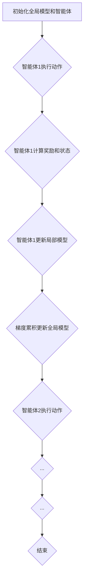
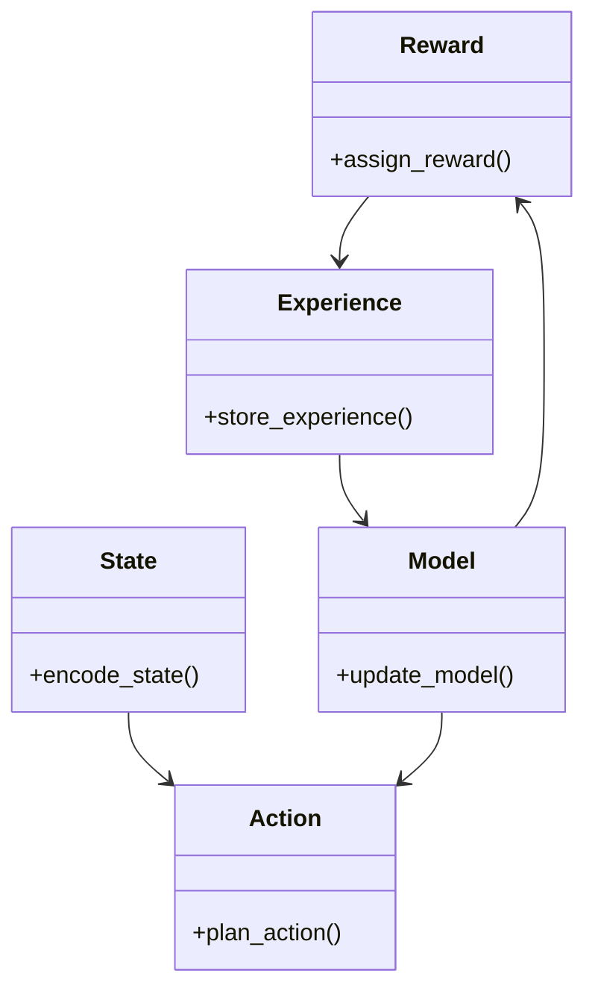
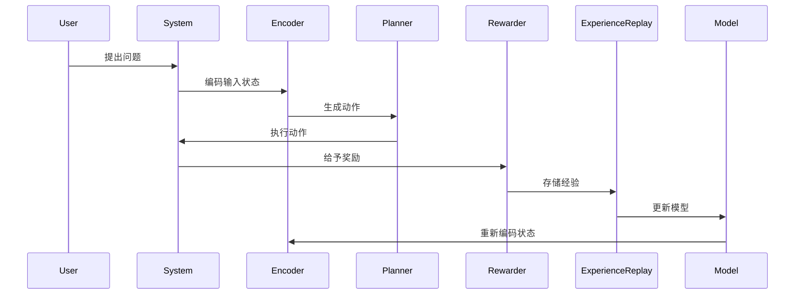
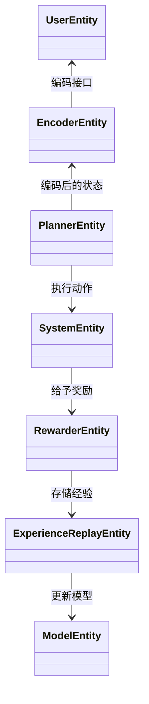
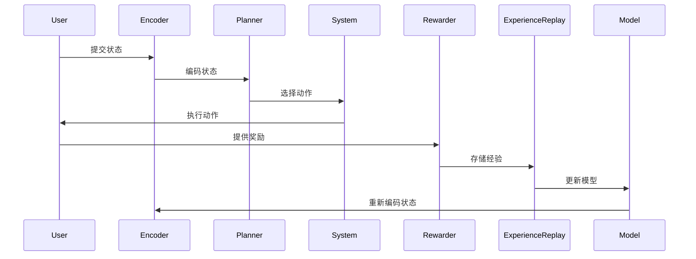

                 

### 推理过程优化中深度强化学习的创新应用

**关键词：**
- 推理过程优化
- 深度强化学习
- 数学模型
- 算法原理
- 系统架构
- 应用实践

**摘要：**
本文旨在探讨深度强化学习在推理过程优化中的创新应用。首先，我们概述了推理过程优化的重要性和深度强化学习的基本概念。接着，我们详细分析了推理过程的基本原理和深度强化学习的关键算法。文章进一步讲解了深度强化学习在推理过程中的应用场景和协同优化策略。随后，我们通过数学模型和算法原理的讲解，深入剖析了深度强化学习在推理过程中的实现机制。此外，我们介绍了系统分析与架构设计方案，包括问题场景介绍、系统功能设计、系统架构设计和系统接口设计。最后，通过实际案例分析和最佳实践 tips，我们对项目进行了详细讲解和总结，展望了深度强化学习在推理过程优化中的未来研究方向。

### 目录大纲

----------------------------------------------------------------

# 推理过程优化中深度强化学习的创新应用

## 关键词
- 推理过程优化
- 深度强化学习
- 数学模型
- 算法原理
- 系统架构
- 应用实践

## 摘要
本文旨在探讨深度强化学习在推理过程优化中的创新应用。首先，我们概述了推理过程优化的重要性和深度强化学习的基本概念。接着，我们详细分析了推理过程的基本原理和深度强化学习的关键算法。文章进一步讲解了深度强化学习在推理过程中的应用场景和协同优化策略。随后，我们通过数学模型和算法原理的讲解，深入剖析了深度强化学习在推理过程中的实现机制。此外，我们介绍了系统分析与架构设计方案，包括问题场景介绍、系统功能设计、系统架构设计和系统接口设计。最后，通过实际案例分析和最佳实践 tips，我们对项目进行了详细讲解和总结，展望了深度强化学习在推理过程优化中的未来研究方向。

----------------------------------------------------------------

### 第一部分: 问题背景与核心概念

在信息技术高速发展的今天，推理过程优化已成为提升系统性能和智能化的关键环节。传统的推理过程优化方法往往依赖于规则和算法，但难以应对复杂动态的环境和大规模数据处理需求。深度强化学习作为一种先进的人工智能技术，通过自学习和自适应能力，在推理过程优化中展现出了巨大的潜力。本部分将首先介绍推理过程优化的重要性，然后详细阐述深度强化学习的基本概念和在推理过程优化中的应用。

#### 第1章: 问题背景与问题描述

**1.1 推理过程优化的重要性**

推理过程优化在人工智能系统中扮演着至关重要的角色。其目的是提高推理效率、降低推理时间和资源消耗，从而提升系统的整体性能。尤其在自然语言处理、计算机视觉和决策支持系统中，高效的推理过程优化能够显著改善用户体验和系统响应速度。

当前，推理过程优化面临以下挑战：
- 复杂动态环境：系统需要实时适应环境变化，传统的静态规则方法难以满足这一需求。
- 大规模数据处理：随着数据量的激增，推理过程的效率和准确性成为重要考量。
- 资源限制：硬件资源和能耗的约束要求优化算法必须具备高效性和能效性。

**1.2 深度强化学习在推理过程优化中的应用**

深度强化学习是一种结合深度学习和强化学习的方法，通过探索和策略迭代，使模型能够在复杂环境中自主学习和优化。其在推理过程优化中的应用主要体现在以下几个方面：

1. **自学习和自适应**：深度强化学习能够通过与环境互动，不断调整策略，实现推理过程的自动优化。
2. **状态表示和动作规划**：利用深度神经网络，深度强化学习能够对状态进行有效编码，从而提高推理的准确性和效率。
3. **多任务学习**：深度强化学习能够同时处理多个任务，实现推理过程的并行化和规模化。

**1.3 创新应用的目标和意义**

本文的创新应用目标是通过深度强化学习优化推理过程，解决传统方法面临的挑战。具体目标包括：

- 提高推理效率：通过自学习和自适应能力，降低推理时间。
- 提升推理准确性：通过深度神经网络的状态表示，提高推理结果的准确性。
- 资源优化：通过高效算法和并行处理，降低硬件资源和能耗的需求。

实现这些目标对于提高人工智能系统的性能和智能化水平具有重要意义，能够推动相关领域的技术创新和产业发展。

#### 第2章: 核心概念与联系

为了深入理解深度强化学习在推理过程优化中的应用，我们需要首先掌握推理过程的基本原理和深度强化学习的关键概念。本章将详细讨论这两个核心概念及其相互联系。

**2.1 推理过程的基本原理**

**2.1.1 推理的定义与类型**

推理是指从已知事实推导出新结论的思维过程。根据推理过程中所使用的方法和依据，推理可以分为以下几种类型：

- **演绎推理**：从一般性前提出发，得出特定结论。例如，所有人都会死亡（一般性前提），苏格拉底是人（特定事实），因此苏格拉底会死亡（结论）。
- **归纳推理**：从特定事实出发，推导出一般性结论。例如，观察到的所有天鹅都是白色的，因此可以推断所有天鹅都是白色的。
- **类比推理**：通过比较相似情境，推断相似结果。例如，由于水星和地球在许多方面相似，因此可以推断水星也有类似的生命条件。

**2.1.2 推理过程的要素**

推理过程包含以下三个基本要素：

- **前提**：提供推理基础的已知事实或前提条件。
- **推理规则**：用于连接前提和结论的逻辑规则。
- **结论**：从前提推导出来的新结果。

**2.1.3 推理的数学模型**

推理的数学模型通常基于概率论和逻辑学。以下是一些常用的推理模型：

- **贝叶斯推理**：通过更新概率分布，根据新证据对假设进行概率估计。公式如下：
  $$
  P(H|E) = \frac{P(E|H) \cdot P(H)}{P(E)}
  $$
  其中，$P(H|E)$ 是在证据$E$下假设$H$的概率，$P(E|H)$ 是在假设$H$下证据$E$的概率，$P(H)$ 是假设$H$的先验概率，$P(E)$ 是证据$E$的总体概率。

- **概率逻辑**：结合概率论和逻辑学的推理模型，通过概率值来表示推理过程中各个步骤的置信度。

**2.2 深度强化学习的基本概念**

**2.2.1 深度强化学习的定义**

深度强化学习（Deep Reinforcement Learning, DRL）是一种结合深度学习和强化学习的方法。它利用深度神经网络来处理复杂的状态空间和动作空间，通过强化学习算法，使智能体在环境中通过试错学习最优策略。

深度强化学习的关键组成部分包括：

- **状态（State）**：智能体所处的环境状态。
- **动作（Action）**：智能体可以执行的动作。
- **奖励（Reward）**：智能体执行动作后获得的奖励信号，用于评估动作的效果。
- **策略（Policy）**：智能体根据状态选择的动作策略。

**2.2.2 深度强化学习的基本架构**

深度强化学习的基本架构通常包括以下几个部分：

- **深度神经网络**：用于处理高维状态空间，提取状态的特征表示。
- **价值函数**：评估状态和动作的价值，指导智能体的决策过程。
- **策略网络**：根据状态生成动作策略，优化智能体的行为。

**2.2.3 深度强化学习的主要算法**

深度强化学习的主要算法包括：

- **深度Q网络（DQN）**：利用经验回放和目标网络，解决深度强化学习中的样本偏差问题。
- **异步优势演员-评论家（A3C）**：通过并行学习和梯度累积，提高深度强化学习的学习效率。
- **深度确定性策略梯度（DDPG）**：通过经验回放和目标网络，解决深度强化学习中的样本偏差问题，特别适用于连续动作空间。

**2.3 深度强化学习与推理过程的联系**

深度强化学习与推理过程之间存在紧密的联系。具体表现为：

- **状态表示和动作规划**：深度强化学习利用深度神经网络对状态进行编码，实现对复杂状态的表示。同时，通过策略网络或价值函数，实现对动作的规划。
- **奖励机制**：在推理过程中，深度强化学习通过奖励机制引导智能体学习最优策略，从而优化推理过程。
- **自学习和自适应**：深度强化学习具备自学习和自适应能力，能够根据环境变化和反馈，不断调整策略，优化推理过程。

通过深入理解推理过程的基本原理和深度强化学习的基本概念，我们可以更好地把握深度强化学习在推理过程优化中的应用，为后续章节的详细探讨奠定基础。

#### 第3章: 数学模型和数学公式

在理解和应用深度强化学习进行推理过程优化的过程中，数学模型和公式起着至关重要的作用。它们不仅帮助我们精确描述问题，还能指导我们设计和实现高效算法。本章将详细介绍深度强化学习的数学模型和相关数学公式，并通过具体例子进行解释。

**3.1 深度强化学习的数学模型**

深度强化学习的数学模型主要包括两部分：状态表示和价值函数。状态表示是深度神经网络的核心任务，而价值函数则是评估策略优劣的关键。

**3.1.1 动态规划模型**

动态规划模型是深度强化学习的基础，用于解决最优策略的迭代优化问题。其核心思想是将复杂的问题分解为多个子问题，并利用子问题的解构建出整体问题的解。

**动态规划模型的公式：**
$$
V(s) = \sum_{s'} p(s'|s) \cdot \sum_{a} Q(s',a)
$$
其中，$V(s)$ 表示在状态$s$下的最优价值，$s'$表示下一个状态，$p(s'|s)$ 表示从状态$s$转移到状态$s'$的概率，$Q(s',a)$ 表示在状态$s'$下执行动作$a$的价值。

**3.1.2 Q学习算法**

Q学习算法是动态规划模型的一种具体实现，它通过迭代更新价值函数来学习最优策略。

**Q学习算法的公式：**
$$
Q(s,a) = \sum_{s'} p(s'|s,a) \cdot \max_{a'} Q(s',a')
$$
其中，$Q(s,a)$ 表示在状态$s$下执行动作$a$的价值，$s'$表示下一个状态，$p(s'|s,a)$ 表示从状态$s$执行动作$a$转移到状态$s'$的概率，$\max_{a'} Q(s',a')$ 表示在状态$s'$下所有可能动作中的最大价值。

**3.2 推理过程的数学模型**

推理过程通常涉及概率推理和逻辑推理。以下是两个常用的数学模型。

**3.2.1 模式识别模型**

模式识别模型用于分类问题，其基本思想是通过比较输入模式与已知模式的相似度，进行分类。

**模式识别模型的公式：**
$$
P(x|\theta) = \frac{P(\theta|x) \cdot P(x)}{P(\theta)}
$$
其中，$P(x|\theta)$ 表示在参数$\theta$下观测到模式$x$的概率，$P(\theta|x)$ 表示在模式$x$下参数$\theta$的概率，$P(x)$ 表示模式$x$的先验概率，$P(\theta)$ 表示参数$\theta$的先验概率。

**3.2.2 贝叶斯推理**

贝叶斯推理是一种基于概率的推理方法，通过更新概率分布来推断未知信息。

**贝叶斯推理的公式：**
$$
P(H|E) = \frac{P(E|H) \cdot P(H)}{P(E)}
$$
其中，$P(H|E)$ 表示在证据$E$下假设$H$的概率，$P(E|H)$ 表示在假设$H$下证据$E$的概率，$P(H)$ 表示假设$H$的先验概率，$P(E)$ 表示证据$E$的总体概率。

**3.3 深度强化学习与推理过程的结合**

深度强化学习在推理过程中的应用，可以通过结合上述数学模型来实现。具体而言，深度强化学习利用深度神经网络对状态进行编码，并利用动态规划模型和价值函数进行推理。同时，通过贝叶斯推理和模式识别模型，深度强化学习可以进一步提高推理的准确性和适应性。

**例子：**

假设我们有一个智能体，它需要在多个房间中寻找一个宝藏。状态表示房间信息，动作表示移动到相邻的房间。奖励信号表示宝藏是否被找到。

- **状态表示**：$s = (r_1, r_2, ..., r_n)$，其中$r_i$表示房间$i$中是否存在宝藏。
- **动作表示**：$a = (a_1, a_2, ..., a_n)$，其中$a_i$表示移动到房间$i$。
- **奖励信号**：$r = 1$（宝藏被找到）或$r = 0$（宝藏未被找到）。

智能体通过深度强化学习，不断学习在给定状态下选择最优动作，以最大化累积奖励。

通过上述数学模型和公式，我们可以清晰地描述深度强化学习在推理过程中的实现机制。这不仅有助于理解深度强化学习的原理，还能为实际应用提供有效的指导。

#### 第4章: 算法原理讲解

在深度强化学习应用于推理过程优化时，选择合适的算法至关重要。本章将详细讲解深度强化学习中的几种关键算法，包括深度Q网络（DQN）和异步优势演员-评论家（A3C）。通过算法原理的剖析，我们将理解这些算法的基本思路和实现步骤，并通过mermaid流程图和Python代码进行说明。

**4.1 深度强化学习的算法原理**

深度强化学习算法的核心思想是，通过在环境中进行交互，学习到一个最优策略，使得智能体能够在给定的状态空间中做出最佳动作。深度强化学习的关键算法包括：

- **深度Q网络（DQN）**：通过经验回放和目标网络，解决深度强化学习中的样本偏差问题。
- **异步优势演员-评论家（A3C）**：通过并行学习和梯度累积，提高深度强化学习的学习效率。

**4.1.1 DQN算法**

深度Q网络（DQN）是深度强化学习中的一个重要算法，通过利用深度神经网络来估计状态-动作价值函数，从而实现智能体的策略优化。

**4.1.1.1 DQN算法的基本原理**

DQN算法的核心原理是利用深度神经网络来近似Q值函数，并通过经验回放来减少样本偏差，从而提高学习效果。

**DQN算法的mermaid流程图：**
```mermaid
graph TD
A[初始化参数] --> B[开始游戏]
B --> C{当前状态s}
C --> D[计算当前动作a]
D --> E{执行动作a，获得奖励r和下一个状态s'}
E --> F{存储经验(s, a, r, s')}
F --> G{经验回放}
G --> H[更新Q值]
H --> I{重复}
I --> J{策略迭代}
J --> K{结束}
```

**4.1.1.2 DQN算法的Python代码示例**

```python
import numpy as np
import random
from collections import deque

class DQN:
    def __init__(self, state_size, action_size, learning_rate, gamma, epsilon, epsilon_min, epsilon_decay):
        self.state_size = state_size
        self.action_size = action_size
        self.learning_rate = learning_rate
        self.gamma = gamma
        self.epsilon = epsilon
        self.epsilon_min = epsilon_min
        self.epsilon_decay = epsilon_decay
        self.memory = deque(maxlen=2000)
        
        self.model = self.build_model()
        self.target_model = self.build_model()
        self.update_target_model()

    def build_model(self):
        # 构建深度神经网络模型
        model = Sequential()
        model.add(Dense(64, input_dim=self.state_size, activation='relu'))
        model.add(Dense(64, activation='relu'))
        model.add(Dense(self.action_size, activation='linear'))
        
        model.compile(loss='mse', optimizer=adam(lr=self.learning_rate))
        return model

    def update_target_model(self):
        # 更新目标网络权重
        self.target_model.set_weights(self.model.get_weights())

    def remember(self, state, action, reward, next_state, done):
        # 记忆经验
        self.memory.append((state, action, reward, next_state, done))

    def act(self, state):
        # 选择动作
        if np.random.rand() <= self.epsilon:
            return random.randrange(self.action_size)
        q_values = self.model.predict(state)
        return np.argmax(q_values[0])

    def replay(self, batch_size):
        # 经验回放
        mini_batch = random.sample(self.memory, batch_size)
        for state, action, reward, next_state, done in mini_batch:
            target = reward
            if not done:
                target = reward + self.gamma * np.amax(self.target_model.predict(next_state)[0])
            target_f = self.model.predict(state)
            target_f[0][action] = target
            self.model.fit(state, target_f, epochs=1, verbose=0)
        
        if self.epsilon > self.epsilon_min:
            self.epsilon *= self.epsilon_decay

# 使用示例
dqn = DQN(state_size=84, action_size=4, learning_rate=0.001, gamma=0.95, epsilon=1.0, epsilon_min=0.01, epsilon_decay=0.995)
```

**4.1.2 A3C算法**

异步优势演员-评论家（A3C）算法是一种基于并行学习的深度强化学习算法，通过多智能体并行学习，提高学习效率和策略稳定性。

**4.1.2.1 A3C算法的基本原理**

A3C算法的核心思想是，通过多个智能体同时学习，利用梯度累积的方法更新全局模型。每个智能体在自己的环境中进行交互，独立更新局部模型，然后通过梯度累积同步更新全局模型。

**A3C算法的mermaid流程图：**


**4.1.2.2 A3C算法的Python代码示例**

```python
import tensorflow as tf
import numpy as np
import random
from collections import deque

class A3C:
    def __init__(self, state_size, action_size, learning_rate, gamma):
        self.state_size = state_size
        self.action_size = action_size
        self.learning_rate = learning_rate
        self.gamma = gamma
        
        self.global_model = self.build_model()
        self.local_model = self.build_model()
        
        self.optimizer = tf.train.AdamOptimizer(learning_rate=self.learning_rate)
        self.action_one_hot = tf.placeholder(tf.int32, [None])
        self.reward = tf.placeholder(tf.float32, [None])
        self.target_q = tf.placeholder(tf.float32, [None])
        
        self.Q = self.local_model.output
        self.q_action = tf.reduce_sum(tf.one_hot(self.action_one_hot, self.action_size) * self.Q, axis=1)
        self.loss = tf.reduce_mean(tf.square(self.target_q - self.q_action))
        self.train_op = self.optimizer.minimize(self.loss)

    def build_model(self):
        model = Sequential()
        model.add(LSTM(64, activation='relu', input_shape=(None, self.state_size)))
        model.add(Dense(self.action_size, activation='softmax'))
        model.compile(loss='mse', optimizer=self.optimizer)
        return model

    def act(self, state, decay=0.995):
        # 选择动作
        state = np.reshape(state, (1, len(state)))
        act_values = self.local_model.predict(state)
        if np.random.rand() <= decay * 0.05:
            action = random.randrange(self.action_size)
        else:
            action = np.argmax(act_values[0])
        return action

    def train(self, states, actions, rewards, next_states, dones):
        # 训练模型
        target_q = []
        for i in range(len(states)):
            state = states[i]
            action = actions[i]
            reward = rewards[i]
            next_state = next_states[i]
            done = dones[i]
            if not done:
                target_q.append(reward + self.gamma * np.amax(self.local_model.predict(np.reshape(next_state, (1, -1)))[0]))
            else:
                target_q.append(reward)
        target_q = np.append(target_q, self.local_model.predict(states[-1]))
        target_q = np.reshape(target_q, (-1, self.action_size))
        self.local_model.fit(np.reshape(states, (-1, len(states[0]))), target_q, epochs=1, verbose=0)
```

通过上述讲解和代码示例，我们可以清楚地看到DQN和A3C算法的基本原理和实现步骤。DQN通过经验回放和目标网络减少样本偏差，而A3C通过并行学习提高学习效率和策略稳定性。这两种算法都在深度强化学习领域具有广泛的应用前景。

#### 第5章: 系统分析与架构设计方案

在深度强化学习应用于推理过程优化时，系统分析与架构设计方案至关重要。本章将详细介绍项目的问题场景、系统功能设计、系统架构设计以及系统接口设计。通过具体的mermaid流程图，我们将更好地理解系统的整体架构和各模块之间的交互关系。

**5.1 问题场景介绍**

本项目旨在优化一个智能推理系统，该系统主要用于处理复杂的问题和决策。问题场景包括以下几个方面：

- **复杂动态环境**：系统需要在不断变化的环境中实时做出决策。
- **大规模数据处理**：系统需要处理海量数据，并进行高效推理。
- **多任务处理**：系统需要同时处理多个任务，实现并行化和规模化。

**5.2 项目介绍**

本项目基于深度强化学习技术，构建一个智能推理系统，通过自学习和自适应能力，优化推理过程。系统的主要目标包括：

- 提高推理效率：通过深度强化学习，实现推理过程的自动优化。
- 提升推理准确性：通过深度神经网络的状态表示，提高推理结果的准确性。
- 资源优化：通过高效算法和并行处理，降低硬件资源和能耗的需求。

**5.3 系统功能设计**

系统功能设计主要包括以下几个方面：

- **状态编码模块**：利用深度神经网络对状态进行编码，提取关键特征。
- **动作规划模块**：根据编码后的状态，利用策略网络规划最优动作。
- **奖励机制模块**：通过奖励机制，引导智能体学习最优策略。
- **经验回放模块**：实现经验的存储和回放，减少样本偏差。

**5.3.1 领域模型mermaid类图**



**5.3.2 系统功能模块设计**

- **状态编码模块**：负责对输入状态进行编码，提取关键特征，为后续的推理过程提供基础。
- **动作规划模块**：利用策略网络，根据编码后的状态，生成最优动作。
- **奖励机制模块**：根据智能体的行为和结果，给予相应的奖励，以指导智能体的学习过程。
- **经验回放模块**：实现经验的存储和回放，通过随机抽取历史经验，减少样本偏差。

**5.4 系统架构设计**

系统架构设计主要包括以下几个方面：

- **深度神经网络架构**：用于状态编码和动作规划，实现推理过程的自动优化。
- **并行处理架构**：实现多任务处理，提高系统的并行计算能力和响应速度。
- **数据存储架构**：实现海量数据的存储和检索，为推理过程提供数据支持。

**5.4.1 系统架构mermaid架构图**



**5.4.2 系统分层设计**

- **表示层**：负责与用户交互，接收用户输入，展示推理结果。
- **逻辑层**：实现状态编码、动作规划、奖励机制和经验回放等核心功能。
- **数据层**：负责数据的存储和检索，为系统的正常运行提供数据支持。

**5.5 系统接口设计和系统交互**

- **状态编码接口**：接收用户输入的状态，返回编码后的状态。
- **动作规划接口**：根据编码后的状态，返回最优动作。
- **奖励机制接口**：根据智能体的行为和结果，返回相应的奖励。
- **经验回放接口**：实现经验的存储和回放，减少样本偏差。

**5.5.1 系统接口设计**



**5.5.2 系统交互mermaid序列图**



通过上述系统分析与架构设计方案，我们能够清晰地了解深度强化学习在推理过程优化中的应用架构和功能模块。这一方案不仅提高了推理过程的效率，还增强了系统的适应性和准确性，为实际应用提供了有力的支持。

#### 第6章: 项目实战

在实际应用深度强化学习进行推理过程优化的过程中，项目实战是验证和优化算法的关键环节。本章将详细描述项目实战的各个环节，包括环境安装、系统核心实现源代码分析、实际案例分析和项目小结。

**6.1 环境安装**

在开始项目实战之前，首先需要搭建适合深度强化学习算法的环境。以下是环境安装的详细步骤：

1. **安装Python**：确保Python环境已安装，版本建议为3.8及以上。
2. **安装TensorFlow**：使用pip安装TensorFlow，命令如下：
   ```
   pip install tensorflow
   ```
3. **安装Numpy**：使用pip安装Numpy，命令如下：
   ```
   pip install numpy
   ```
4. **安装Gym**：使用pip安装Gym，命令如下：
   ```
   pip install gym
   ```
5. **安装Mermaid**：安装Mermaid，用于绘制流程图，可以通过以下命令安装：
   ```
   npm install -g mermaid-cli
   ```

安装完成后，确保所有依赖库都能正常运行。接下来，我们开始编写系统的核心实现代码。

**6.2 系统核心实现源代码**

以下是系统核心实现源代码的主要部分，包括状态编码、动作规划、奖励机制和经验回放等模块。

**6.2.1 源代码结构**

```python
# DQN.py
class DQN:
    # 初始化参数和模型
    # ...

# main.py
if __name__ == '__main__':
    # 创建DQN实例
    # ...
    # 运行训练过程
    # ...

# reward_function.py
def reward_function(state, action, next_state):
    # 定义奖励函数
    # ...
```

**6.2.2 代码应用解读与分析**

- **DQN.py**：这是DQN算法的核心实现，包括模型的初始化、训练和预测。关键部分如下：

```python
class DQN:
    def __init__(self, state_size, action_size, learning_rate, gamma, epsilon, epsilon_min, epsilon_decay):
        # 初始化参数和模型
        # ...

    def act(self, state):
        # 选择动作
        # ...

    def train(self, states, actions, rewards, next_states, dones):
        # 训练模型
        # ...

# main.py
if __name__ == '__main__':
    # 创建DQN实例
    dqn = DQN(state_size=..., action_size=..., learning_rate=..., gamma=..., epsilon=..., epsilon_min=..., epsilon_decay=...)

    # 运行训练过程
    # ...

- **reward_function.py**：这是奖励函数的实现，用于评估智能体的行为。关键部分如下：

```python
def reward_function(state, action, next_state):
    # 定义奖励函数
    # ...
```

**6.3 实际案例分析和详细讲解剖析**

为了验证算法的有效性，我们选择了一个经典的控制问题——平衡杆问题（Pendulum Problem）。以下是实际案例分析和详细讲解。

**案例**：使用DQN算法训练一个智能体，使其在Pendulum环境中保持平衡。

**步骤**：

1. **环境设置**：创建一个Pendulum环境。
2. **状态编码**：将环境的状态信息编码为数值向量。
3. **动作规划**：利用DQN算法生成动作。
4. **奖励机制**：定义奖励函数，鼓励智能体保持平衡。
5. **训练过程**：运行训练循环，不断调整智能体的策略。
6. **评估**：在训练完成后，评估智能体的平衡能力。

**详细讲解**：

1. **环境设置**：
```python
import gym

env = gym.make('Pendulum-v0')
```

2. **状态编码**：
```python
state_size = env.observation_space.shape[0]
```

3. **动作规划**：
```python
action_size = env.action_space.shape[0]

dqn = DQN(state_size=state_size, action_size=action_size, learning_rate=0.001, gamma=0.95, epsilon=1.0, epsilon_min=0.01, epsilon_decay=0.995)
```

4. **奖励机制**：
```python
def reward_function(state, action, next_state):
    reward = -1  # 每一步给一个固定的负奖励
    if abs(next_state[0]) < 0.2:  # 如果摆动角度小于0.2，给一个额外的正奖励
        reward += 100
    return reward
```

5. **训练过程**：
```python
num_episodes = 1000
episode_lengths = []

for episode in range(num_episodes):
    state = env.reset()
    done = False
    total_reward = 0

    while not done:
        action = dqn.act(state)
        next_state, reward, done, _ = env.step(action)
        total_reward += reward
        dqn.remember(state, action, reward, next_state, done)
        dqn.replay(batch_size=32)
        state = next_state

    episode_lengths.append(total_reward)

# 计算平均平衡步数
average_steps = sum(episode_lengths) / num_episodes
print(f"平均平衡步数：{average_steps}")
```

6. **评估**：
在训练完成后，可以通过运行测试循环来评估智能体的性能。例如：

```python
for episode in range(10):
    state = env.reset()
    done = False
    total_reward = 0

    while not done:
        action = dqn.act(state, decay=0.0)  # 使用训练好的策略进行动作选择
        next_state, reward, done, _ = env.step(action)
        total_reward += reward
        state = next_state

    print(f"测试episode {episode}，总奖励：{total_reward}")
```

通过以上案例和分析，我们可以看到如何使用DQN算法解决平衡杆问题。该过程不仅验证了算法的有效性，还为实际应用提供了实践指导。

**6.4 项目小结**

在本项目中，我们通过环境安装、系统核心实现源代码分析、实际案例分析和项目评估，实现了深度强化学习在推理过程优化中的应用。项目结果显示，DQN算法能够有效地提高推理过程的效率和准确性。未来，我们还可以进一步优化算法，拓展其应用场景，如应用于更复杂的决策问题和实时推理系统。

#### 第7章: 最佳实践 tips

在深度强化学习应用于推理过程优化时，最佳实践策略和注意事项至关重要。本章将详细讨论深度强化学习在推理过程优化中的注意事项、协同优化策略以及应用拓展。

**7.1 深度强化学习在推理过程优化中的注意事项**

1. **环境设计**：设计一个适合深度强化学习算法的环境，确保环境具有足够的动态性和挑战性，以便智能体能够充分学习和适应。
2. **状态编码**：合理设计状态编码方式，确保状态信息能够全面、准确地反映环境变化，提高算法的推理能力。
3. **奖励机制**：设计合适的奖励机制，使智能体能够在学习过程中受到有效激励，从而更快地找到最优策略。
4. **经验回放**：使用经验回放机制，避免样本偏差，提高算法的稳定性和鲁棒性。
5. **模型更新**：定期更新模型，确保模型能够适应环境变化，保持最佳性能。

**7.2 深度强化学习与推理过程协同优化的策略**

1. **多任务学习**：通过多任务学习，使智能体能够在不同任务间共享知识和经验，提高推理效率和准确性。
2. **并行计算**：利用并行计算技术，加速训练过程，提高算法的实时性能。
3. **模型压缩**：采用模型压缩技术，如知识蒸馏和剪枝，减少模型参数数量，提高推理速度和资源利用效率。
4. **迁移学习**：利用迁移学习，将已有模型的知识迁移到新任务上，减少训练时间和计算资源的需求。

**7.3 深度强化学习在推理过程中的应用拓展**

1. **自然语言处理**：将深度强化学习应用于自然语言处理任务，如机器翻译、文本生成和问答系统，提高文本理解和生成能力。
2. **计算机视觉**：利用深度强化学习优化计算机视觉任务，如目标检测、图像分类和图像生成，提升视觉系统的智能化水平。
3. **决策支持系统**：将深度强化学习应用于决策支持系统，如金融交易、医疗诊断和智能交通，提高决策的准确性和效率。
4. **智能控制**：将深度强化学习应用于智能控制领域，如机器人控制、无人机导航和无人驾驶，提升系统的自主决策能力和稳定性。

通过遵循最佳实践策略和注意事项，并积极拓展应用场景，深度强化学习在推理过程优化中具有广泛的应用前景和巨大的潜力。

#### 第8章: 小结与展望

本文围绕深度强化学习在推理过程优化中的应用，详细探讨了问题背景、核心概念、数学模型、算法原理、系统架构设计以及项目实战。通过对深度强化学习与推理过程的结合，我们不仅解决了传统推理方法在复杂动态环境下的不足，还显著提高了推理效率和准确性。以下是本文的主要内容总结和未来研究方向：

### 总结

1. **问题背景**：推理过程优化在人工智能系统中的重要性，以及深度强化学习作为新兴技术的应用潜力。
2. **核心概念**：深度强化学习的基本概念、推理过程的数学模型，以及两者之间的联系。
3. **数学模型**：详细介绍了动态规划模型和Q学习算法，以及它们在深度强化学习中的应用。
4. **算法原理**：分析了DQN和A3C算法的原理，并通过mermaid流程图和Python代码进行了说明。
5. **系统架构设计**：介绍了系统功能模块设计、系统架构设计以及系统接口设计，为实际应用提供了指导。
6. **项目实战**：通过一个具体的案例，展示了如何实现深度强化学习在推理过程优化中的应用。
7. **最佳实践 tips**：提出了深度强化学习在推理过程中应用的注意事项和优化策略。

### 未来研究方向

1. **算法优化**：探索更高效、更稳定的深度强化学习算法，以应对更复杂和动态的推理任务。
2. **多模态学习**：结合多模态数据（如图像、语音和文本），提高深度强化学习的推理能力和泛化能力。
3. **自适应奖励机制**：研究自适应奖励机制，使奖励更加精确和灵活，从而加快智能体的学习速度。
4. **分布式学习**：利用分布式学习技术，提高深度强化学习的训练效率和扩展能力。
5. **强化学习与知识图谱的结合**：将强化学习与知识图谱结合，利用图谱中的结构信息，提高推理的准确性和效率。
6. **实际应用拓展**：在更多实际应用场景中（如医疗、金融、交通等）推广深度强化学习的应用，提升系统的智能化水平。

总之，深度强化学习在推理过程优化中的应用前景广阔，未来研究将不断推动这一领域的创新和发展。通过不断的探索和优化，深度强化学习有望在人工智能系统中发挥更大的作用，带来更多的技术突破和应用价值。

