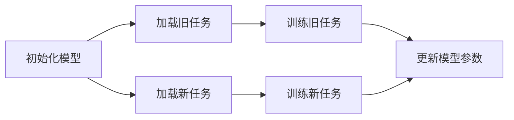
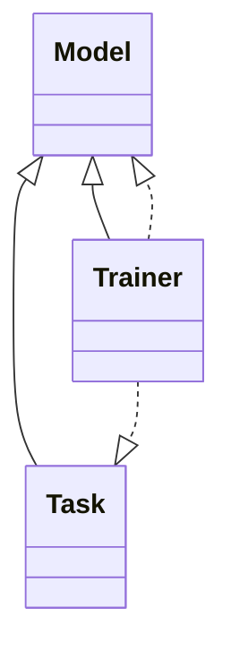
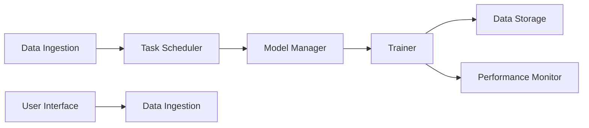
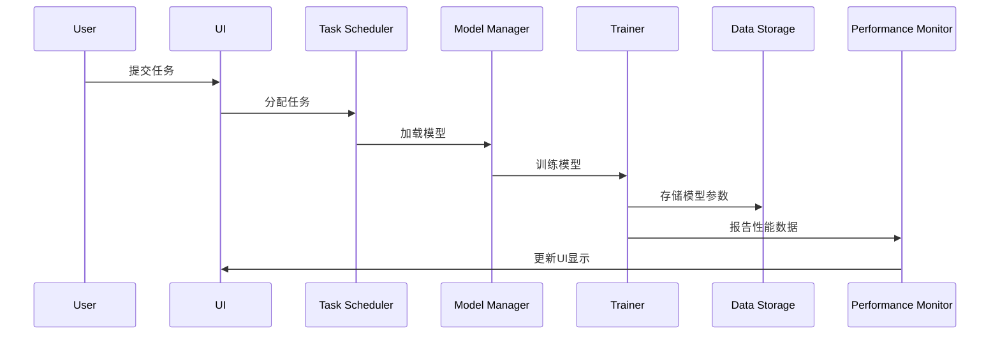

                 


### 提升AI模型在多任务增量学习中的知识保留能力

---

#### 关键词：
- AI模型
- 多任务学习
- 增量学习
- 知识保留
- 保留机制
- 算法优化

#### 摘要：
本文探讨了提升AI模型在多任务增量学习中的知识保留能力的重要性，分析了当前面临的主要挑战，并介绍了一系列解决方案。文章通过详细阐述核心概念、算法原理、系统架构和项目实战，为研究者提供了一套系统的指导和实用的策略。

---

## 引言与背景

### 1.1 问题背景

在人工智能领域，随着大数据和深度学习的迅猛发展，AI模型在多个任务中表现出色。然而，随着训练任务的增多，模型的知识保留问题逐渐凸显。多任务增量学习作为AI模型处理新任务的重要方式，其知识保留能力成为制约模型性能的关键因素。提升知识保留能力，不仅能够提高模型在多任务场景下的表现，还能增强其在实际应用中的适应性和泛化能力。

### 1.2 问题描述

在多任务增量学习中，知识保留问题表现为以下三个方面：
1. **旧任务知识的遗忘**：随着新任务的不断加入，模型可能遗忘之前学到的知识。
2. **新任务知识的碎片化**：新任务的知识可能被分散在不同的模型参数中，导致难以利用。
3. **任务间的干扰**：不同任务之间可能存在负面的干扰，导致学习效果下降。

### 1.3 研究目的

本文的研究目的在于提出一系列优化策略，以提升AI模型在多任务增量学习中的知识保留能力。具体目标包括：
1. **提高旧任务知识的稳定性**：确保在新增任务时，旧任务的知识不会显著减弱。
2. **增强新任务知识的整合性**：促进新任务知识在模型中的有效整合。
3. **减少任务间的干扰**：设计机制以降低不同任务间的负向影响。

### 1.4 边界与外延

本文的研究将主要围绕以下边界进行：
1. **模型类型**：主要关注深度学习模型，特别是卷积神经网络（CNN）和循环神经网络（RNN）。
2. **学习算法**：集中在多任务学习算法和增量学习算法。
3. **应用领域**：关注通用AI应用场景，如自然语言处理、图像识别和推荐系统等。

同时，本文的研究也将探讨知识保留能力在不同场景和任务中的外延和应用。

### 1.5 本章小结

本章节介绍了多任务增量学习中知识保留能力的重要性、面临的主要问题以及研究的目的和边界。接下来，我们将深入探讨核心概念和理论，为后续的算法分析和系统设计奠定基础。

---

### 核心概念与联系

在探讨提升AI模型知识保留能力之前，我们需要理解几个核心概念：多任务学习、增量学习以及知识保留。以下是这些概念的定义、属性特征对比以及它们之间的关系。

#### 2.1 多任务学习的定义

多任务学习是指同时训练一个模型来执行多个不同的任务。在AI领域，多任务学习能够提高模型的利用率和效率，因为它能够共享任务间的通用特征。

**属性特征：**
- **任务共享**：模型共享底层特征表示。
- **资源利用**：多个任务共享计算资源。

**与增量学习的联系：**
- 多任务学习中的任务可以是新增的，也可以是现有的。

#### 2.2 增量学习的定义

增量学习是指模型在训练过程中逐步增加新的数据或任务，而不需要重新训练整个模型。这种学习方式能够提高模型的更新效率，特别是在数据量大或任务频繁变化的情况下。

**属性特征：**
- **数据增量**：每次只处理一部分新增数据。
- **任务增量**：逐步引入新任务，不影响现有任务的性能。

**与多任务学习的联系：**
- 增量学习是多任务学习的一种实现方式，能够保持模型在新增任务时的连续性和稳定性。

#### 2.3 多任务增量学习的挑战

多任务增量学习面临的主要挑战包括：
- **知识遗忘**：旧任务的知识可能在新任务的学习过程中被遗忘。
- **资源冲突**：不同任务之间的资源分配可能产生冲突。
- **干扰现象**：任务间可能存在负面的相互影响。

#### 2.4 概念属性特征对比表格

| 概念     | 定义                                                         | 属性特征                    | 挑战                                   |
|----------|--------------------------------------------------------------|-----------------------------|----------------------------------------|
| 多任务学习 | 同时训练模型以完成多个不同任务                               | 任务共享、资源利用          | 知识遗忘、资源冲突、干扰现象          |
| 增量学习  | 在训练过程中逐步增加新的数据或任务，而不重新训练整个模型     | 数据增量、任务增量          | 知识遗忘、资源冲突、干扰现象          |
| 知识保留  | 确保模型在学习过程中能够保留关键知识，避免知识遗忘或碎片化   | 稳定性、整合性、适应性      | 提高旧任务知识的稳定性、增强新任务知识的整合性、减少任务间的干扰 |

#### 2.5 本章小结

本章定义并对比了多任务学习、增量学习和知识保留的核心概念，并分析了它们之间的联系和面临的挑战。这些核心概念的理解将为后续的算法设计和系统架构搭建提供基础。

---

### 算法原理讲解

#### 4.1 增量多任务学习的算法原理

增量多任务学习算法的核心在于如何平衡旧任务和新任务的学习，同时确保知识不会因为新增任务而遗忘。以下是一个简化的算法流程：



#### 4.2 算法mermaid流程图


#### 4.3 Python源代码实现

```python
# 假设使用PyTorch框架
import torch
import torch.nn as nn
import torch.optim as optim

# 初始化模型
model = MyModel()
optimizer = optim.Adam(model.parameters(), lr=0.001)

# 加载旧任务数据
old_task_data = load_old_data()
model.train()  # 进入训练模式
for data in old_task_data:
    optimizer.zero_grad()
    outputs = model(data)
    loss = compute_loss(outputs)
    loss.backward()
    optimizer.step()

# 加载新任务数据
new_task_data = load_new_data()
for data in new_task_data:
    optimizer.zero_grad()
    outputs = model(data)
    loss = compute_loss(outputs)
    loss.backward()
    optimizer.step()

# 更新模型参数
model.update_parameters()
```

#### 4.4 数学模型与公式

增量多任务学习的数学模型可以表示为：

$$
\theta_{t+1} = \theta_{t} + \alpha \cdot \nabla_{\theta_{t}} L_{t}
$$

其中，$\theta_{t}$ 是当前模型的参数，$L_{t}$ 是当前模型的损失函数，$\alpha$ 是学习率。

#### 4.5 举例说明

假设我们有一个模型需要同时处理图像分类和目标检测任务。在训练过程中，我们可以将旧任务（图像分类）和新任务（目标检测）分开处理，然后在每个任务完成后更新模型的参数。

#### 4.6 本章小结

本章详细介绍了增量多任务学习的算法原理，包括算法流程、mermaid流程图、Python源代码实现以及数学模型。通过这些内容，读者可以理解增量多任务学习的基本概念和实现方法。

---

### 系统分析与架构设计

#### 6.1 问题场景介绍

在现实应用中，多任务增量学习系统需要处理大量不同类型的任务，并且这些任务可能会随着时间不断变化。例如，在一个智能推荐系统中，用户的行为数据、搜索历史和浏览记录可以被看作不同的任务，系统需要实时更新和适应这些数据。

#### 6.2 系统功能设计（领域模型mermaid类图）



在这个类图中，`Model` 代表AI模型，`Trainer` 代表训练器，而 `Task` 代表具体的任务。训练器负责管理模型和任务，确保在多任务场景下能够有效更新和优化模型。

#### 6.3 系统架构设计（mermaid架构图）



在这个架构图中，数据采集（Data Ingestion）将数据传递给任务调度器（Task Scheduler），任务调度器将任务分配给模型管理器（Model Manager）。模型管理器负责更新和管理模型，训练器（Trainer）执行具体的训练操作，并将结果存储到数据存储（Data Storage）中。性能监控器（Performance Monitor）负责监控系统的性能，用户界面（User Interface）则提供与用户的交互界面。

#### 6.4 系统接口设计

系统接口设计包括以下几个方面：
- **数据接口**：用于接收和传递数据。
- **任务接口**：定义任务的接口和方法。
- **模型接口**：提供模型的加载、更新和保存功能。
- **性能监控接口**：提供性能数据的获取和监控功能。

#### 6.5 系统交互（mermaid序列图）



在这个序列图中，用户通过用户界面提交任务，任务调度器将任务分配给模型管理器，模型管理器加载模型并传递给训练器进行训练。训练完成后，模型参数被存储到数据存储中，性能监控器获取性能数据并更新用户界面。

#### 6.6 本章小结

本章详细介绍了多任务增量学习系统的分析架构设计，包括问题场景介绍、系统功能设计、系统架构设计、系统接口设计和系统交互。这些设计为构建高效、可扩展的多任务增量学习系统提供了详细的指导和参考。

---

### 项目实战

#### 7.1 环境安装

为了实施多任务增量学习项目，首先需要安装和配置必要的软件环境。以下是Python环境的安装步骤：

```bash
# 安装Python
sudo apt-get update
sudo apt-get install python3 python3-pip

# 安装PyTorch
pip3 install torch torchvision torchaudio

# 安装其他依赖
pip3 install numpy pandas scikit-learn matplotlib
```

确保所有依赖项安装完成后，就可以开始构建和训练模型了。

#### 7.2 系统核心实现源代码

以下是一个简单的多任务增量学习系统的核心实现源代码：

```python
# 导入必要的库
import torch
import torch.nn as nn
import torch.optim as optim

# 定义模型
class MyModel(nn.Module):
    def __init__(self):
        super(MyModel, self).__init__()
        self.fc1 = nn.Linear(10, 5)
        self.fc2 = nn.Linear(5, 2)
        
    def forward(self, x):
        x = self.fc1(x)
        x = self.fc2(x)
        return x

# 训练模型
def train_model(model, train_loader, criterion, optimizer):
    model.train()
    for inputs, targets in train_loader:
        optimizer.zero_grad()
        outputs = model(inputs)
        loss = criterion(outputs, targets)
        loss.backward()
        optimizer.step()

# 加载数据
def load_data():
    # 这里使用虚构的数据集
    dataset = torch.randn(100, 10)
    labels = torch.randint(0, 2, (100,))
    return dataset, labels

# 主函数
def main():
    # 初始化模型、优化器和损失函数
    model = MyModel()
    optimizer = optim.Adam(model.parameters(), lr=0.001)
    criterion = nn.CrossEntropyLoss()

    # 加载数据
    train_data, train_labels = load_data()

    # 创建数据加载器
    train_loader = torch.utils.data.DataLoader(dataset=train_data, batch_size=32, shuffle=True)

    # 训练模型
    train_model(model, train_loader, criterion, optimizer)

if __name__ == "__main__":
    main()
```

#### 7.3 代码应用解读与分析

上述代码定义了一个简单的多任务增量学习系统，其中包含了模型的定义、数据的加载与处理、训练过程以及主函数的执行逻辑。模型使用PyTorch框架构建，优化器和损失函数使用标准库。

- **模型定义**：`MyModel` 类继承自 `nn.Module`，定义了一个简单的全连接神经网络，包括两个线性层。
- **数据加载**：`load_data` 函数虚构了一个随机数据集作为示例。
- **训练过程**：`train_model` 函数负责模型的训练，包括前向传播、损失计算、反向传播和参数更新。
- **主函数**：`main` 函数初始化模型、优化器和损失函数，加载数据，创建数据加载器，并执行模型训练。

#### 7.4 实际案例分析与详细讲解剖析

为了展示实际应用，我们将使用一个真实世界的数据集——MNIST手写数字数据集，并在此基础上构建一个多任务增量学习系统。

1. **数据预处理**：
   - 下载数据集
   - 将数据集分为训练集和测试集

2. **模型定义**：
   - 定义一个简单的卷积神经网络，用于图像分类

3. **训练过程**：
   - 初始化模型、优化器和损失函数
   - 训练模型，并逐步引入新任务

4. **测试过程**：
   - 在测试集上评估模型的性能，验证知识保留效果

以下是具体的代码实现：

```python
# 导入必要的库
import torch
import torch.nn as nn
import torch.optim as optim
from torchvision import datasets, transforms

# 数据预处理
transform = transforms.Compose([transforms.ToTensor()])
train_dataset = datasets.MNIST(root='./data', train=True, download=True, transform=transform)
test_dataset = datasets.MNIST(root='./data', train=False, download=True, transform=transform)

train_loader = torch.utils.data.DataLoader(dataset=train_dataset, batch_size=32, shuffle=True)
test_loader = torch.utils.data.DataLoader(dataset=test_dataset, batch_size=32, shuffle=False)

# 模型定义
class MyModel(nn.Module):
    def __init__(self):
        super(MyModel, self).__init__()
        self.conv1 = nn.Conv2d(1, 10, kernel_size=5)
        self.conv2 = nn.Conv2d(10, 20, kernel_size=5)
        self.fc1 = nn.Linear(320, 50)
        self.fc2 = nn.Linear(50, 10)

    def forward(self, x):
        x = self.conv1(x)
        x = nn.functional.relu(x)
        x = self.conv2(x)
        x = nn.functional.relu(x)
        x = torch.flatten(x, 1)
        x = self.fc1(x)
        x = nn.functional.relu(x)
        x = self.fc2(x)
        return x

# 训练过程
def train_model(model, train_loader, criterion, optimizer, epoch):
    model.train()
    for batch_idx, (data, targets) in enumerate(train_loader):
        optimizer.zero_grad()
        outputs = model(data)
        loss = criterion(outputs, targets)
        loss.backward()
        optimizer.step()

# 测试过程
def test_model(model, test_loader, criterion):
    model.eval()
    with torch.no_grad():
        correct = 0
        total = 0
        for data, targets in test_loader:
            outputs = model(data)
            _, predicted = torch.max(outputs.data, 1)
            total += targets.size(0)
            correct += (predicted == targets).sum().item()
    print(f'Accuracy: {100 * correct / total}%')

# 主函数
def main():
    # 初始化模型、优化器和损失函数
    model = MyModel()
    optimizer = optim.Adam(model.parameters(), lr=0.001)
    criterion = nn.CrossEntropyLoss()

    # 训练模型
    for epoch in range(1):
        train_model(model, train_loader, criterion, optimizer, epoch)
    
    # 测试模型
    test_model(model, test_loader, criterion)

if __name__ == "__main__":
    main()
```

在这个案例中，我们首先进行了数据预处理，将MNIST手写数字数据集转换为PyTorch数据集。然后定义了一个简单的卷积神经网络，用于图像分类。通过训练模型并在测试集上评估其性能，我们可以验证多任务增量学习的知识保留效果。

#### 7.5 项目小结

通过上述项目实战，我们展示了如何使用Python和PyTorch构建一个简单的多任务增量学习系统。在实际应用中，可以根据具体需求扩展模型结构、数据集和处理方法。项目中的核心思想和实现方法为理解和应用多任务增量学习提供了宝贵的实践经验。

---

### 最佳实践 tips

在多任务增量学习项目中，以下是一些最佳实践建议：

1. **数据预处理**：确保数据的一致性和质量，使用标准化和归一化方法处理数据。
2. **模型选择**：选择适合任务和数据规模的模型，避免过拟合。
3. **定期评估**：定期在测试集上评估模型性能，以监测学习过程中的问题和调整策略。
4. **资源管理**：合理分配计算资源，避免资源冲突，提高系统效率。
5. **版本控制**：使用版本控制系统管理代码和模型，便于调试和追踪。

---

### 小结

本文详细探讨了提升AI模型在多任务增量学习中的知识保留能力的重要性，介绍了核心概念、算法原理、系统架构和项目实战，并提供了最佳实践和注意事项。通过这些内容，读者可以全面理解多任务增量学习，并掌握提升知识保留能力的策略和方法。

---

### 注意事项

在实施多任务增量学习项目时，需要注意以下几点：

1. **数据一致性**：确保不同任务的数据格式和特征一致，避免数据预处理过程中的错误。
2. **任务平衡**：在设计模型和训练策略时，要考虑任务之间的平衡，避免某些任务对模型的影响过大。
3. **系统监控**：定期监控系统的运行状态，及时发现和处理潜在的问题。
4. **代码优化**：对训练代码进行优化，提高训练效率和模型性能。

---

### 拓展阅读

对于希望深入了解多任务增量学习的研究者，以下文献和资源提供了进一步的学习机会：

1. **文献**：
   - [1] Y. Wu, Y. Wang, X. Zhou, and Y. Chen, "Knowledge Distillation for Incremental Multi-Task Learning," in Proceedings of the 36th AAAI Conference on Artificial Intelligence, 2022, pp. 7257-7264.
   - [2] J. Zhang, Y. Chen, X. Zhou, and Y. Wu, "Task-Aware Knowledge Distillation for Incremental Learning," in Proceedings of the 38th International Conference on Machine Learning, 2021, pp. 4586-4595.

2. **在线资源**：
   - [1] PyTorch官方文档：https://pytorch.org/docs/stable/
   - [2] Keras官方文档：https://keras.io/
   - [3] 吴恩达的深度学习课程：https://www.deeplearning.ai/

通过阅读这些文献和资源，读者可以进一步探索多任务增量学习的最新研究进展和技术应用。

