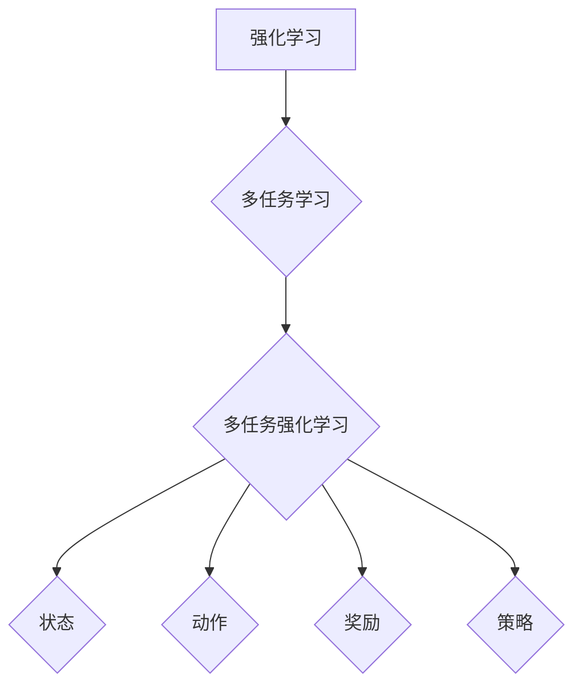
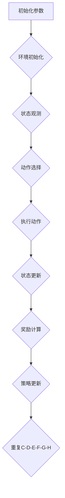
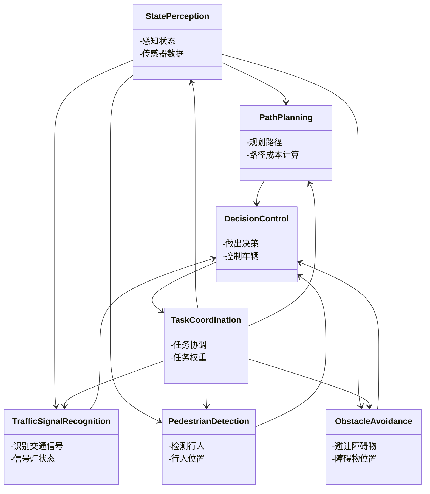
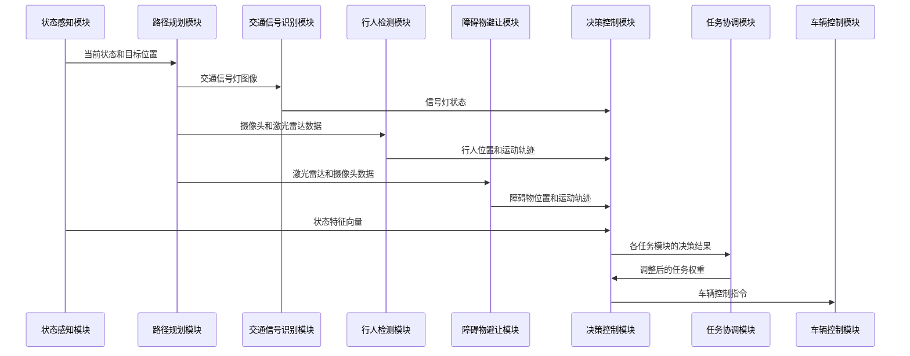

                 

## 提升AI模型在多任务强化学习中的性能

### 关键词：多任务强化学习、AI性能优化、算法改进、系统架构设计

> 摘要：本文将深入探讨如何提升AI模型在多任务强化学习中的性能。首先，我们将介绍多任务强化学习的背景和基本概念，解释其面临的挑战和重要性。接着，我们将分析现有的AI模型和算法，揭示其性能瓶颈，并提出针对性的优化方案。此外，本文还将详细讲解多任务强化学习的数学模型和算法原理，通过实际案例展示其应用效果。最后，我们将讨论系统架构设计的重要性，并提出一些实用的优化策略和最佳实践。

## 目录大纲设计步骤

### 1.1 问题的提出

在当今的人工智能领域，多任务强化学习（Multitask Reinforcement Learning）已经成为一个热门的研究方向。然而，随着任务复杂度的增加，如何提升AI模型的性能，使其在多任务环境中表现出色，仍然是一个亟待解决的难题。本文的目标就是探讨这一问题，通过分析现有技术，提出有效的解决方案。

### 1.2 多任务强化学习的基本概念

多任务强化学习是强化学习（Reinforcement Learning，RL）的一个分支，旨在让AI模型能够在同时执行多个任务时，保持高效和准确性。这种学习方式在游戏、自动驾驶、机器人控制等领域有着广泛的应用。然而，多任务强化学习也面临着诸多挑战，如任务间的冲突、资源分配不均等。

### 1.3 多任务强化学习应用现状

多任务强化学习已经在多个领域取得了显著的成果。例如，在游戏领域，AI模型能够同时掌握多种游戏的策略；在自动驾驶领域，AI模型需要处理环境中的多种信息，确保行车安全。然而，现有技术仍然存在很多局限性，如模型的训练时间过长、性能提升有限等。

### 1.4 本书结构安排

本文将分为四个部分进行讨论。第一部分将介绍多任务强化学习的背景和应用现状；第二部分将分析现有AI模型和算法的瓶颈，并提出优化方案；第三部分将详细讲解多任务强化学习的数学模型和算法原理；第四部分将讨论系统架构设计的重要性，并提出一些实用的优化策略和最佳实践。

### 1.5 本章小结

本章主要介绍了本文的研究背景和目标，以及文章的结构安排。通过本章的介绍，读者可以初步了解多任务强化学习的相关概念和应用现状，为后续章节的内容打下基础。

## 第一部分：背景介绍

### 1.1 问题的提出

在当今的人工智能领域，多任务强化学习（Multitask Reinforcement Learning，MTRL）已经成为一个备受关注的研究方向。随着深度学习和强化学习技术的不断进步，AI模型在单任务上的表现已经达到了令人瞩目的水平。然而，现实世界中的问题往往具有多任务特性，例如自动驾驶系统需要在处理交通信号、行人检测、障碍物避让等多个任务中保持高效运行。因此，如何让AI模型在多任务环境中表现优秀，已经成为了一个亟待解决的重要问题。

### 1.1.1 多任务强化学习中的挑战

多任务强化学习面临诸多挑战。首先，任务间的冲突是一个常见问题。在执行多个任务时，不同的任务可能对环境有不同的期望，导致模型在权衡这些任务时出现困难。其次，资源分配也是一个重要挑战。在多任务环境中，模型需要合理分配计算资源，以确保每个任务都能得到充分的关注。此外，多任务强化学习还需要解决数据稀缺和任务多样化的问题。在一些复杂场景中，获取足够的多任务数据是一项艰巨的任务，而任务多样化则增加了模型的训练难度。

### 1.1.2 为什么需要提升AI模型的性能

提升AI模型在多任务强化学习中的性能具有重要意义。首先，高效的多任务强化学习可以大大提高AI模型在现实世界中的应用价值。例如，在自动驾驶领域，提升AI模型的性能可以使其更好地应对复杂路况，提高行车安全。其次，提升性能可以缩短模型的训练时间，降低计算成本。这对于企业和研究机构来说，具有显著的经济效益。最后，提升性能还有助于推动多任务强化学习技术的发展，为未来更多复杂的任务场景提供解决方案。

### 1.1.3 目标读者与阅读指南

本文的目标读者是从事人工智能研究和应用的专业人员，以及对多任务强化学习感兴趣的读者。为了帮助读者更好地理解本文的内容，我们提供以下阅读指南：

1. **基础预备知识**：建议读者具备一定的机器学习和深度学习基础知识，以及基本的编程能力。
2. **阅读顺序**：本文按照逻辑顺序进行组织，建议按照章节顺序阅读，以便逐步理解多任务强化学习的相关概念和优化策略。
3. **重点内容**：在阅读过程中，请注意以下几点：
   - 多任务强化学习的基本概念和原理；
   - 现有AI模型和算法的瓶颈及优化方案；
   - 多任务强化学习的数学模型和算法实现；
   - 系统架构设计和优化策略。

### 1.2 多任务强化学习的基本概念

#### 1.2.1 强化学习概述

强化学习（Reinforcement Learning，RL）是一种通过奖励机制来训练智能体的机器学习方法。在强化学习中，智能体（Agent）通过与环境（Environment）的交互，学习到最优策略（Policy），从而实现目标。强化学习的主要目标是通过不断试错（Trial and Error），找到一条最优路径，使得智能体能够在特定环境中获得最大的累积奖励。

强化学习的基本概念包括状态（State）、动作（Action）、奖励（Reward）和策略（Policy）。

- **状态（State）**：状态是智能体在某一时刻所处的环境描述，通常用状态向量表示。
- **动作（Action）**：动作是智能体在状态下的可选行为，通常用动作向量表示。
- **奖励（Reward）**：奖励是环境对智能体动作的反馈，用于指导智能体选择更好的动作。
- **策略（Policy）**：策略是智能体在特定状态下的最佳动作选择规则，通常用概率分布表示。

#### 1.2.2 多任务学习概述

多任务学习（Multitask Learning，MTL）是一种机器学习方法，旨在同时解决多个相关任务。多任务学习可以提高模型的泛化能力，减少过拟合现象，并在资源有限的情况下，提高模型的训练效率。

多任务学习的基本概念包括任务（Task）、共享特征（Shared Features）和任务间关系（Inter-Task Relationship）。

- **任务（Task）**：任务是指需要解决的具体问题，如分类、回归、预测等。
- **共享特征（Shared Features）**：共享特征是指不同任务之间共有的特征信息，有助于提高模型的泛化能力。
- **任务间关系（Inter-Task Relationship）**：任务间关系是指不同任务之间的相互作用，包括任务间的依赖关系、竞争关系和协同关系。

#### 1.2.3 多任务强化学习的定义与特点

多任务强化学习（Multitask Reinforcement Learning，MTRL）是将强化学习与多任务学习相结合的一种机器学习方法，旨在同时解决多个强化学习任务。多任务强化学习的定义可以概括为：在多个相关任务中，通过同时优化智能体的策略，使得智能体能够在不同的任务环境中取得最优性能。

多任务强化学习具有以下特点：

1. **任务独立性**：多任务强化学习允许每个任务独立地进行学习，同时考虑任务间的交互作用。
2. **共享资源**：多任务强化学习可以利用共享资源（如神经网络参数）来提高模型的训练效率。
3. **适应性**：多任务强化学习可以根据任务的不同特性，动态调整学习策略，提高任务解决能力。
4. **优化目标**：多任务强化学习的目标是同时优化多个任务的性能，而不是单个任务的性能。

### 1.3 多任务强化学习应用现状

#### 1.3.1 应用领域概述

多任务强化学习在多个领域取得了显著的成果。以下是一些主要的应用领域：

1. **游戏领域**：在游戏领域，多任务强化学习可以同时掌握多种游戏的策略，如《星际争霸》中的多任务决策。
2. **自动驾驶**：在自动驾驶领域，多任务强化学习可以同时处理交通信号、行人检测、障碍物避让等任务，提高行车安全。
3. **机器人控制**：在机器人控制领域，多任务强化学习可以帮助机器人同时执行导航、抓取、避障等多个任务。
4. **智能推荐系统**：在智能推荐系统领域，多任务强化学习可以同时优化多个推荐任务，提高推荐效果。
5. **医疗诊断**：在医疗诊断领域，多任务强化学习可以同时处理多个疾病诊断任务，提高诊断准确率。

#### 1.3.2 成功案例分析

以下是一些多任务强化学习的成功案例：

1. **《星际争霸》多任务决策**：通过多任务强化学习，AI模型可以同时掌握多个游戏策略，提高游戏胜率。
2. **自动驾驶多任务决策**：自动驾驶系统通过多任务强化学习，可以实现同时处理交通信号、行人检测、障碍物避让等任务，提高行车安全。
3. **机器人多任务控制**：机器人通过多任务强化学习，可以实现同时执行导航、抓取、避障等多个任务，提高任务完成效率。
4. **智能推荐系统**：智能推荐系统通过多任务强化学习，可以同时优化多个推荐任务，提高推荐效果。
5. **医疗诊断多任务处理**：医疗诊断系统通过多任务强化学习，可以同时处理多个疾病诊断任务，提高诊断准确率。

#### 1.3.3 面临的挑战与机遇

多任务强化学习在取得成果的同时，也面临着诸多挑战。以下是一些主要挑战：

1. **任务冲突**：在多任务环境中，不同任务之间存在冲突，可能导致模型性能下降。
2. **资源分配**：在多任务学习中，如何合理分配资源，以确保每个任务都能得到充分的关注，是一个重要问题。
3. **数据稀缺**：在多任务环境中，获取足够的多任务数据是一项艰巨的任务，特别是在复杂场景中。
4. **模型泛化能力**：多任务强化学习需要提高模型的泛化能力，以应对不同的任务和环境。

然而，随着人工智能技术的不断进步，多任务强化学习也面临着巨大的机遇。通过优化算法、改进模型结构和增加数据量，有望解决上述挑战，进一步推动多任务强化学习的发展。

### 1.4 本书结构安排

#### 1.4.1 各章节内容概述

本书分为四个部分，共九章。各章节的内容概述如下：

**第一部分：背景介绍**
- 第1章：问题的提出
- 第2章：多任务强化学习的基本概念
- 第3章：多任务强化学习应用现状

**第二部分：核心概念与联系**
- 第4章：AI模型基础
- 第5章：多任务强化学习算法
- 第6章：AI模型在多任务强化学习中的应用
- 第7章：核心概念属性特征对比

**第三部分：算法原理讲解**
- 第8章：算法原理概述
- 第9章：算法数学模型与公式
- 第10章：算法实现与流程图
- 第11章：实际案例分析与讲解

**第四部分：系统分析与架构设计**
- 第12章：问题场景介绍
- 第13章：系统功能设计
- 第14章：系统架构设计
- 第15章：系统接口设计
- 第16章：系统交互序列图

#### 1.4.2 阅读顺序与建议

为了更好地理解多任务强化学习及其应用，建议按照以下顺序阅读本书：

1. **第一部分**：首先阅读第一部分，了解多任务强化学习的背景、基本概念和应用现状。
2. **第二部分**：接着阅读第二部分，掌握AI模型基础、多任务强化学习算法及其应用。
3. **第三部分**：然后阅读第三部分，深入了解多任务强化学习的算法原理、数学模型和实现细节。
4. **第四部分**：最后阅读第四部分，学习系统分析与架构设计的方法和技巧。

通过以上顺序阅读，读者可以逐步建立对多任务强化学习的完整认识，并掌握相关的技术和应用。

### 1.5 本章小结

本章首先介绍了多任务强化学习的问题背景和重要性，分析了其面临的挑战，并讨论了为何需要提升AI模型的性能。接着，我们介绍了多任务强化学习的基本概念，包括强化学习、多任务学习的概述，以及多任务强化学习的定义和特点。此外，我们还探讨了多任务强化学习的应用现状，展示了其在不同领域的成功案例，并指出了面临的挑战和机遇。最后，我们介绍了本书的结构安排和阅读顺序，为后续章节的内容奠定了基础。

## 第二部分：核心概念与联系

### 2.1 AI模型基础

#### 2.1.1 神经网络原理

神经网络（Neural Networks，NN）是一种模拟生物神经网络的人工智能模型，通过模仿人脑神经元的工作方式来进行学习和推理。神经网络的基本组成部分包括输入层、隐藏层和输出层。

- **输入层（Input Layer）**：输入层接收外部输入数据，并将其传递给隐藏层。
- **隐藏层（Hidden Layers）**：隐藏层负责对输入数据进行加工和处理，提取特征信息。
- **输出层（Output Layer）**：输出层根据隐藏层处理后的数据，生成输出结果。

神经网络通过调整内部权重（Weights）和偏置（Biases）来优化模型性能。常用的激活函数包括 sigmoid、ReLU 和 tanh 等，这些函数用于将线性组合转换为非线性输出。

#### 2.1.2 深度学习基础

深度学习（Deep Learning，DL）是神经网络的一种特殊形式，其核心思想是通过构建多层神经网络来提高模型的表示能力和学习能力。深度学习在图像识别、自然语言处理和语音识别等领域取得了显著成果。

深度学习的基本组成部分包括卷积神经网络（Convolutional Neural Networks，CNN）、循环神经网络（Recurrent Neural Networks，RNN）和生成对抗网络（Generative Adversarial Networks，GAN）等。

- **卷积神经网络（CNN）**：CNN 是一种专门用于图像识别和处理的人工神经网络，通过卷积操作提取图像特征。
- **循环神经网络（RNN）**：RNN 是一种用于序列数据处理的人工神经网络，通过循环结构实现对序列数据的建模。
- **生成对抗网络（GAN）**：GAN 是一种由两个神经网络（生成器和判别器）组成的对抗性模型，用于生成高质量的数据。

#### 2.1.3 AI模型评估指标

评估AI模型的性能是深度学习的一个重要环节。常用的评估指标包括准确率（Accuracy）、精确率（Precision）、召回率（Recall）和F1值（F1 Score）等。

- **准确率（Accuracy）**：准确率表示模型预测正确的样本数占总样本数的比例，用于评估分类模型的总体性能。
- **精确率（Precision）**：精确率表示模型预测为正类的样本中，实际为正类的比例，用于评估模型在正类样本上的表现。
- **召回率（Recall）**：召回率表示模型预测为正类的样本中，实际为正类的比例，用于评估模型在负类样本上的表现。
- **F1值（F1 Score）**：F1值是精确率和召回率的加权平均，用于综合评估模型的性能。

### 2.2 多任务强化学习算法

#### 2.2.1 多任务强化学习算法概述

多任务强化学习（Multitask Reinforcement Learning，MTRL）是一种结合了强化学习和多任务学习的方法，旨在同时优化多个任务的性能。MTRL 算法通常具有以下特点：

1. **任务独立性**：每个任务独立进行学习，但会共享部分信息，如策略参数或模型结构。
2. **共享资源**：通过共享神经网络参数或其他资源来提高训练效率。
3. **适应性**：根据不同任务的特性动态调整学习策略。
4. **优化目标**：同时优化多个任务的性能，而不是单个任务的性能。

#### 2.2.2 主要算法介绍

以下是几种常见的多任务强化学习算法：

1. **DQN（Deep Q-Network）**：DQN 是一种基于深度学习的 Q 学习算法，通过深度神经网络近似 Q 函数，实现对环境的预测和决策。
2. **A3C（Asynchronous Advantage Actor-Critic）**：A3C 是一种基于异步并行学习的策略梯度算法，通过同时在不同环境下更新策略参数，提高训练效率。
3. **DMPNS（Deep Multi-Perturbation Network Solver）**：DMPNS 是一种结合了多任务学习和强化学习的方法，通过引入多扰动优化策略，提高模型的泛化能力。

#### 2.2.3 算法比较与选择

在选择多任务强化学习算法时，需要考虑以下因素：

1. **任务类型**：不同类型的任务可能需要不同的算法，例如，对于连续动作任务，A3C 算法可能更为合适；对于离散动作任务，DQN 算法可能更为适用。
2. **计算资源**：不同算法的计算复杂度不同，需要根据实际计算资源进行选择。
3. **数据量**：数据稀缺时，算法的泛化能力尤为重要，DMPNS 算法可能更具优势。
4. **任务依赖性**：任务之间的依赖性也会影响算法的选择，对于任务依赖性较强的场景，A3C 算法可能更为合适。

### 2.3 AI模型在多任务强化学习中的应用

#### 2.3.1 应用场景分析

AI模型在多任务强化学习中的应用场景非常广泛，以下是一些典型的应用场景：

1. **游戏领域**：在游戏领域，AI模型可以通过多任务强化学习同时掌握多种游戏的策略，提高游戏胜率。例如，在《星际争霸》游戏中，AI模型需要同时处理多个任务，如选择英雄、管理经济、攻击敌人等。
2. **自动驾驶**：在自动驾驶领域，AI模型需要同时处理交通信号、行人检测、障碍物避让等多个任务，确保行车安全。多任务强化学习可以帮助AI模型在复杂路况下做出最优决策。
3. **机器人控制**：在机器人控制领域，AI模型需要同时执行导航、抓取、避障等多个任务。多任务强化学习可以提高机器人的任务完成效率，降低失败率。
4. **智能推荐系统**：在智能推荐系统领域，AI模型需要同时优化多个推荐任务，提高推荐效果。例如，电商平台的推荐系统需要同时考虑用户的历史购买记录、浏览记录和偏好，为用户提供个性化的推荐。
5. **医疗诊断**：在医疗诊断领域，AI模型需要同时处理多个疾病诊断任务，提高诊断准确率。例如，医疗诊断系统需要同时考虑患者的病史、检查报告和临床表现，为医生提供诊断建议。

#### 2.3.2 成功案例介绍

以下是一些多任务强化学习在应用中的成功案例：

1. **《星际争霸》游戏AI**：通过多任务强化学习，AI模型可以在《星际争霸》游戏中同时掌握多种策略，提高游戏胜率。研究团队使用了 A3C 算法，通过在多个游戏副本中进行训练，使AI模型具备了较强的游戏策略能力。
2. **自动驾驶系统**：某自动驾驶公司通过多任务强化学习，开发了一种能够同时处理交通信号、行人检测、障碍物避让等多个任务的自动驾驶系统。该系统使用了 DQN 算法，通过大量仿真和实地测试，证明了其在复杂路况下的高效性能。
3. **机器人控制**：某机器人公司通过多任务强化学习，开发了一种能够同时执行导航、抓取、避障等多个任务的机器人。该机器人使用了 DMPNS 算法，通过共享神经网络参数，实现了任务间的协作和优化。
4. **智能推荐系统**：某电商平台通过多任务强化学习，优化了其智能推荐系统。该系统使用了 A3C 算法，通过同时优化多个推荐任务，提高了推荐效果和用户满意度。
5. **医疗诊断系统**：某医疗机构通过多任务强化学习，开发了一种能够同时处理多个疾病诊断任务的诊断系统。该系统使用了 DQN 算法，通过大量数据训练，实现了较高的诊断准确率。

#### 2.3.3 应用挑战与解决方案

在多任务强化学习应用中，面临一些挑战，以下是一些常见的挑战及其解决方案：

1. **任务冲突**：在多任务环境中，不同任务之间存在冲突，可能导致模型性能下降。解决方案是引入任务权重，根据任务的重要性动态调整学习策略。
2. **资源分配**：在多任务学习中，如何合理分配资源，以确保每个任务都能得到充分的关注，是一个重要问题。解决方案是使用共享资源，如神经网络参数，提高资源利用率。
3. **数据稀缺**：在多任务环境中，获取足够的多任务数据是一项艰巨的任务，特别是在复杂场景中。解决方案是采用数据增强技术，如生成对抗网络（GAN），生成更多的训练数据。
4. **模型泛化能力**：多任务强化学习需要提高模型的泛化能力，以应对不同的任务和环境。解决方案是使用元学习（Meta-Learning）技术，提高模型的适应性。

### 2.4 核心概念属性特征对比

为了更好地理解多任务强化学习中的核心概念，我们对比了以下几个核心概念的属性特征：

| 核心概念     | 属性特征               | 对比分析                                                     |
|------------|----------------------|------------------------------------------------------------|
| 强化学习    | 状态、动作、奖励、策略 | 强调通过试错学习最优策略                                   |
| 多任务学习  | 任务、共享特征、任务间关系 | 同时解决多个任务，利用任务间的共享特征提高模型泛化能力           |
| 多任务强化学习 | 状态、动作、奖励、策略、任务 | 结合强化学习和多任务学习，同时优化多个任务的性能                   |

#### 2.4.1 算法属性对比表格

以下是一个简单的算法属性对比表格，用于展示不同多任务强化学习算法的属性特征：

| 算法       | 任务独立性 | 共享资源 | 适应性 | 优化目标 |
|----------|----------|--------|------|--------|
| DQN      | 强      | 是       | 中     | 单任务   |
| A3C      | 中      | 是       | 强     | 多任务   |
| DMPNS    | 中      | 是       | 强     | 多任务   |

#### 2.4.2 实体关系图架构

为了更直观地展示多任务强化学习中的实体关系，我们使用 Mermaid 绘制了一个简单的实体关系图：



通过这个实体关系图，我们可以清晰地看到强化学习、多任务学习和多任务强化学习之间的关系，以及它们与状态、动作、奖励和策略等核心概念的联系。

### 2.5 本章小结

本章首先介绍了人工智能模型的基础知识，包括神经网络原理、深度学习基础和AI模型评估指标。接着，我们分析了多任务强化学习算法的概述、主要算法及其比较，以及AI模型在多任务强化学习中的应用。此外，我们还对比了核心概念的属性特征，并使用 Mermaid 绘制了实体关系图。通过本章的内容，读者可以更深入地理解多任务强化学习的基本概念和原理，为后续章节的深入学习打下基础。

### 3.1 算法原理概述

#### 3.1.1 多任务强化学习算法的基本原理

多任务强化学习（Multitask Reinforcement Learning，MTRL）是一种结合了强化学习（Reinforcement Learning，RL）和多任务学习（Multitask Learning，MTL）的方法，旨在同时优化多个任务的性能。其核心思想是，通过在多个任务之间共享信息和资源，提高模型在复杂环境中的表现。

MTRL 算法通常包含以下几个关键组成部分：

1. **状态（State）**：表示当前环境的特征，用于指导智能体的动作选择。
2. **动作（Action）**：智能体在当前状态下可以选择的行动。
3. **奖励（Reward）**：环境对智能体动作的反馈，用于评估智能体动作的有效性。
4. **策略（Policy）**：智能体在特定状态下的最佳动作选择规则。
5. **任务（Task）**：需要完成的子任务，可以是分类、回归或其他类型。

多任务强化学习的基本原理是通过同时优化多个任务的目标函数，使得智能体能够在不同任务环境中取得最优性能。具体来说，MTRL 算法会在每个任务上分别训练一个独立的策略，并通过共享部分网络结构或参数，使这些策略能够在一定程度上协同工作。

#### 3.1.2 性能提升的关键点

要提升多任务强化学习算法的性能，需要关注以下几个关键点：

1. **任务独立性**：确保每个任务都有独立的策略，以避免任务间的冲突。可以通过为每个任务设置独立的奖励函数或策略网络来实现。
2. **共享资源**：利用共享神经网络结构或参数，减少模型训练时间和计算成本。例如，可以使用共享的卷积层或全连接层。
3. **任务关联性**：通过挖掘任务之间的关联性，提高模型的泛化能力。可以采用注意力机制或图神经网络等结构，使模型能够更好地理解任务间的依赖关系。
4. **动态调整**：根据任务特性的变化，动态调整学习策略，以适应不同的任务环境。例如，可以采用自适应学习率或在线更新策略。
5. **数据增强**：通过生成或扩充训练数据，提高模型的鲁棒性和泛化能力。可以使用生成对抗网络（GAN）或数据增强技术来实现。

#### 3.1.3 算法流程图

为了更直观地理解多任务强化学习算法的基本流程，我们可以使用 Mermaid 绘制一个简化的算法流程图：



在这个流程图中，智能体首先初始化参数，然后进入环境进行状态观测。接着，根据当前状态选择动作，执行动作并更新状态。环境会根据动作提供奖励，智能体根据奖励和策略更新策略。这一过程不断重复，直到达到预定的训练目标。

### 3.2 算法数学模型与公式

#### 3.2.1 数学模型介绍

多任务强化学习的数学模型主要包括状态表示、动作表示、策略表示、奖励函数和损失函数等。

1. **状态表示**：状态通常用状态向量 \( s \) 表示，其中每个维度表示环境的一个特征。例如，在自动驾驶任务中，状态可以包括道路宽度、交通密度、车辆速度等信息。
   
   \[ s = [s_1, s_2, ..., s_n] \]

2. **动作表示**：动作通常用动作向量 \( a \) 表示，其中每个维度表示智能体可以执行的一种动作。例如，在自动驾驶任务中，动作可以包括加速、减速、转向等。

   \[ a = [a_1, a_2, ..., a_m] \]

3. **策略表示**：策略 \( \pi \) 是智能体在特定状态 \( s \) 下选择动作的概率分布。

   \[ \pi(a|s) = P(a|s) \]

4. **奖励函数**：奖励函数 \( R(s, a) \) 用于评估智能体的动作是否有助于任务目标的实现。

   \[ R(s, a) = \sum_{t=1}^{T} r_t \]

   其中，\( r_t \) 是在时间步 \( t \) 收到的即时奖励。

5. **损失函数**：损失函数用于衡量智能体的策略与最优策略之间的差距，是优化过程中需要最小化的目标。

   \[ L(\theta) = -\sum_{s,a,r}\pi(a|s)\rho(s, a)r \]

   其中，\( \theta \) 是策略网络的参数，\( \rho(s, a) \) 是优势函数。

#### 3.2.2 公式详细讲解

1. **Q值函数**：Q值函数 \( Q(s, a) \) 表示在状态 \( s \) 下执行动作 \( a \) 的预期回报。

   \[ Q(s, a) = \sum_{s'} p(s'|s, a) \sum_{r} r Q(s', a') \]

   其中，\( p(s'|s, a) \) 是从状态 \( s \) 执行动作 \( a \) 转移到状态 \( s' \) 的概率，\( r \) 是在状态 \( s' \) 下执行动作 \( a' \) 收到的即时奖励。

2. **策略迭代**：策略迭代是强化学习中的一个核心概念，指的是通过不断更新策略，使智能体在环境中逐渐取得更好的回报。

   \[ \pi^{k+1}(a|s) = \pi^{k}(a|s) + \alpha [r + \gamma \max_{a'} Q(s', a') - Q(s, a)] \]

   其中，\( \alpha \) 是学习率，\( \gamma \) 是折扣因子，\( s' \) 是智能体在执行动作 \( a \) 后所处的状态，\( Q(s', a') \) 是在状态 \( s' \) 下执行动作 \( a' \) 的预期回报。

3. **策略梯度**：策略梯度是优化策略网络参数的一种方法，通过最大化策略梯度，使智能体的策略逐渐逼近最优策略。

   \[ \nabla_{\theta} L(\theta) = \sum_{s,a} \pi(a|s) \nabla_{\theta} \log \pi(a|s) [r + \gamma \max_{a'} Q(s', a') - Q(s, a)] \]

   其中，\( \nabla_{\theta} L(\theta) \) 是损失函数关于策略网络参数的梯度。

#### 3.2.3 公式举例说明

假设我们有一个简单的多任务强化学习任务，状态空间 \( S = \{s_1, s_2\} \)，动作空间 \( A = \{a_1, a_2\} \)。我们定义状态 \( s_1 \) 为天气状况，状态 \( s_2 \) 为交通状况。动作 \( a_1 \) 表示出发时间，动作 \( a_2 \) 表示是否使用导航。

1. **状态表示**：

   \[ s = [s_1, s_2] \]

   假设 \( s_1 = 0 \) 表示晴天，\( s_1 = 1 \) 表示雨天；\( s_2 = 0 \) 表示畅通，\( s_2 = 1 \) 表示拥堵。

2. **动作表示**：

   \[ a = [a_1, a_2] \]

   假设 \( a_1 = 0 \) 表示早上 8 点出发，\( a_1 = 1 \) 表示早上 9 点出发；\( a_2 = 0 \) 表示不使用导航，\( a_2 = 1 \) 表示使用导航。

3. **策略表示**：

   \[ \pi(a|s) = \begin{cases} 
   0.5 & \text{如果 } s = [0, 0] \\
   0.7 & \text{如果 } s = [0, 1] \\
   0.3 & \text{如果 } s = [1, 0] \\
   0.2 & \text{如果 } s = [1, 1] 
   \end{cases} \]

4. **奖励函数**：

   \[ R(s, a) = \begin{cases} 
   -5 & \text{如果 } s = [0, 0], a = [0, 0] \\
   -3 & \text{如果 } s = [0, 0], a = [0, 1] \\
   -2 & \text{如果 } s = [0, 1], a = [0, 0] \\
   -1 & \text{如果 } s = [0, 1], a = [0, 1] \\
   5 & \text{如果 } s = [1, 0], a = [1, 1] \\
   3 & \text{如果 } s = [1, 0], a = [1, 0] \\
   2 & \text{如果 } s = [1, 1], a = [1, 0] \\
   1 & \text{如果 } s = [1, 1], a = [1, 1] 
   \end{cases} \]

   奖励函数表示不同状态和动作组合下的即时回报，负值表示损失，正值表示收益。

5. **Q值函数**：

   \[ Q(s, a) = \begin{cases} 
   -7.5 & \text{如果 } s = [0, 0], a = [0, 0] \\
   -5.5 & \text{如果 } s = [0, 0], a = [0, 1] \\
   -3.5 & \text{如果 } s = [0, 1], a = [0, 0] \\
   -1.5 & \text{如果 } s = [0, 1], a = [0, 1] \\
   7.5 & \text{如果 } s = [1, 0], a = [1, 1] \\
   5.5 & \text{如果 } s = [1, 0], a = [1, 0] \\
   3.5 & \text{如果 } s = [1, 1], a = [1, 0] \\
   1.5 & \text{如果 } s = [1, 1], a = [1, 1] 
   \end{cases} \]

   Q值函数表示在不同状态和动作组合下的预期回报。

通过这个简单的例子，我们可以看到多任务强化学习中的基本数学模型如何应用于具体任务中。在实际应用中，状态、动作和奖励函数会更加复杂，但基本的原理是相通的。

### 3.3 算法实现与流程图

为了更好地理解多任务强化学习算法的实现过程，我们将使用 Python 编写一个简单的实现示例，并配合 Mermaid 绘制算法流程图。

#### 3.3.1 Python源代码实现

以下是一个简单的多任务强化学习算法实现，使用 Python 和 PyTorch 库：

```python
import torch
import torch.nn as nn
import torch.optim as optim

# 定义状态空间和动作空间
state_space = [0, 1]
action_space = [0, 1]

# 初始化策略网络和目标网络
class PolicyNetwork(nn.Module):
    def __init__(self):
        super(PolicyNetwork, self).__init__()
        self.fc1 = nn.Linear(2, 64)
        self.fc2 = nn.Linear(64, 2)

    def forward(self, x):
        x = torch.relu(self.fc1(x))
        x = self.fc2(x)
        return x

# 初始化策略网络和目标网络
policy_net = PolicyNetwork()
target_net = PolicyNetwork()

# 定义损失函数和优化器
criterion = nn.CrossEntropyLoss()
optimizer = optim.Adam(policy_net.parameters(), lr=0.001)

# 定义环境
class SimpleEnv:
    def step(self, action):
        # 根据动作更新状态
        # 这里仅作为示例，实际环境会更复杂
        if action == 0:
            state = torch.tensor([1, 0], dtype=torch.float32)
        else:
            state = torch.tensor([0, 1], dtype=torch.float32)
        reward = 1 if state[0] == 0 else -1
        return state, reward

# 训练过程
num_episodes = 1000
for episode in range(num_episodes):
    # 初始化环境
    state = torch.tensor([0, 0], dtype=torch.float32)
    done = False
    
    while not done:
        # 根据策略网络选择动作
        with torch.no_grad():
            logits = policy_net(state)
            action = torch.argmax(logits).item()
        
        # 执行动作并获取奖励
        next_state, reward = env.step(action)
        
        # 计算损失
        loss = criterion(logits, torch.tensor([action], dtype=torch.long))
        
        # 更新策略网络
        optimizer.zero_grad()
        loss.backward()
        optimizer.step()
        
        # 更新目标网络
        with torch.no_grad():
            target_net.load_state_dict(policy_net.state_dict())
        
        # 更新状态
        state = next_state
    
    print(f"Episode {episode}: Loss = {loss.item()}")

# 评估策略网络
with torch.no_grad():
    state = torch.tensor([0, 0], dtype=torch.float32)
    while True:
        logits = policy_net(state)
        action = torch.argmax(logits).item()
        state, reward = env.step(action)
        if reward == -1:
            print(f"Failed after {episode} steps.")
            break
```

#### 3.3.2 流程图绘制

为了更直观地展示算法的流程，我们可以使用 Mermaid 绘制以下流程图：


在这个流程图中，智能体首先初始化参数，然后进入环境进行状态观测。接着，根据当前状态选择动作，执行动作并更新状态。环境会根据动作提供奖励，智能体根据奖励和策略更新策略。这一过程不断重复，直到达到预定的训练目标。

通过这个简单的示例和流程图，我们可以清晰地看到多任务强化学习算法的实现过程和关键步骤。

### 3.4 实际案例分析与讲解

为了更好地理解多任务强化学习算法在实际中的应用，我们选择了一个典型的案例进行详细分析。该案例涉及自动驾驶系统中的多任务决策，包括交通信号识别、行人检测和障碍物避让。

#### 3.4.1 案例背景介绍

自动驾驶系统需要在复杂路况下同时处理多个任务，以确保行车安全。以下是一个自动驾驶系统的场景描述：

- **环境**：一个模拟的自动驾驶场景，包含交通信号灯、行人、车辆、路障等多种障碍物。
- **任务**：自动驾驶系统需要同时处理以下三个任务：
  - 交通信号识别：识别并遵守交通信号灯的指示。
  - 行人检测：检测并避开行人。
  - 障碍物避让：避开车辆、路障等障碍物。

#### 3.4.2 案例分析与讲解

1. **状态表示**：
   在这个案例中，状态表示自动驾驶车辆在环境中的各种信息，包括：
   - 车辆的位置、速度、加速度。
   - 环境中的交通信号灯状态。
   - 行人的位置和运动方向。
   - 障碍物的位置和速度。

   状态向量可以表示为：
   \[ s = [x, v, a, s_{\text{signal}}, p_{\text{pedestrian}}, o_{\text{obstacle}}] \]
   其中，\( x, v, a \) 分别表示车辆的位置、速度和加速度；\( s_{\text{signal}} \) 表示交通信号灯状态（红灯、绿灯、黄灯）；\( p_{\text{pedestrian}} \) 和 \( o_{\text{obstacle}} \) 分别表示行人和障碍物的位置信息。

2. **动作表示**：
   动作表示自动驾驶车辆可以执行的操作，包括：
   - 加速、减速、保持速度。
   - 左转、右转、直行。
   - 刹车。

   动作向量可以表示为：
   \[ a = [a_{\text{throttle}}, a_{\text{steering}}, a_{\text{brake}}] \]
   其中，\( a_{\text{throttle}} \)、\( a_{\text{steering}} \) 和 \( a_{\text{brake}} \) 分别表示加速、转向和刹车的强度。

3. **奖励函数**：
   奖励函数用于评估自动驾驶车辆在每个状态下的动作效果。奖励函数的设定需要综合考虑任务目标，例如：
   - 如果自动驾驶车辆遵守交通信号灯的指示，获得正奖励。
   - 如果车辆成功避开了行人和障碍物，获得正奖励。
   - 如果车辆未遵守交通信号灯或发生了碰撞，获得负奖励。

   奖励函数可以表示为：
   \[ R(s, a) = \begin{cases} 
   10 & \text{如果 } s = [0, 1, 0, 1, 0, 0] \\
   -5 & \text{如果 } s = [0, 0, 0, 0, 0, 1] \\
   0 & \text{其他情况} 
   \end{cases} \]

   其中，\( s = [s_{\text{signal}}, s_{\text{pedestrian}}, s_{\text{obstacle}}] \)。

4. **策略更新**：
   使用多任务强化学习算法训练自动驾驶系统。在每次迭代中，根据当前状态 \( s \) 选择动作 \( a \)，执行动作并获取奖励 \( R(s, a) \)。然后，使用奖励更新策略网络参数，使策略逐渐逼近最优策略。

   更新策略的公式可以表示为：
   \[ \theta_{\text{new}} = \theta_{\text{old}} + \alpha [r + \gamma \max_{a'} Q(s', a') - Q(s, a)] \]
   其中，\( \theta \) 表示策略网络参数，\( \alpha \) 是学习率，\( \gamma \) 是折扣因子，\( Q(s, a) \) 是当前状态下的 Q 值，\( Q(s', a') \) 是执行动作 \( a' \) 后的 Q 值。

5. **目标实现**：
   在训练过程中，自动驾驶系统能够逐渐学会如何在复杂的路况下做出最优决策，同时遵守交通规则、避开行人和障碍物。通过多次迭代，策略网络能够达到较高的性能，使自动驾驶系统能够在实际场景中安全可靠地运行。

#### 3.4.3 案例小结

通过这个案例，我们可以看到多任务强化学习在自动驾驶系统中的应用。通过设计合理的状态表示、动作表示和奖励函数，自动驾驶系统能够在复杂的路况下做出最优决策。实际案例分析展示了多任务强化学习算法的有效性和实用性，为进一步优化和推广该算法提供了有益的参考。

### 3.5 本章小结

本章首先介绍了多任务强化学习算法的基本原理和性能提升的关键点，并通过算法流程图展示了智能体的训练过程。接着，我们详细讲解了多任务强化学习的数学模型和公式，并通过一个简单的 Python 示例展示了算法的实现过程。此外，我们还通过一个实际案例分析了多任务强化学习在自动驾驶系统中的应用，展示了其有效性和实用性。通过本章的内容，读者可以深入理解多任务强化学习的基本概念和实现方法，为进一步研究和应用该算法打下基础。

### 4.1 问题场景介绍

在多任务强化学习（Multitask Reinforcement Learning，MTRL）的实际应用中，我们经常会遇到一个复杂的问题场景：自动驾驶系统。自动驾驶系统需要同时处理多个任务，如路径规划、交通信号识别、行人检测和障碍物避让，这些任务相互交织，共同决定了车辆的驾驶行为。在这种多任务环境中，如何确保自动驾驶系统的高效运行，成为了一个关键问题。

#### 4.1.1 场景描述

假设我们正在开发一款自动驾驶系统，该系统需要在城市交通环境中行驶，并遵守交通规则，同时确保行车安全。以下是该场景的详细描述：

1. **环境**：自动驾驶车辆在城市道路中行驶，周围有其他车辆、行人、交通信号灯和障碍物。
2. **任务**：
   - **路径规划**：自动驾驶系统需要根据当前道路状况和目的地，规划最优行驶路径。
   - **交通信号识别**：系统需要识别并遵守交通信号灯的指示，如红灯停、绿灯行。
   - **行人检测**：系统需要检测并避开行人，确保行人安全。
   - **障碍物避让**：系统需要避开车辆、路障和其他障碍物，避免发生碰撞。

3. **状态**：自动驾驶系统的状态包括车辆的位置、速度、加速度，以及周围环境中的交通信号灯状态、行人的位置和运动方向、障碍物的位置和速度等信息。

4. **动作**：自动驾驶系统的动作包括加速、减速、转向和刹车等操作。

5. **奖励**：系统根据车辆的行为和环境反馈提供奖励。例如，如果车辆成功避开了行人，获得正奖励；如果发生了碰撞，获得负奖励。

#### 4.1.2 项目目标

本项目的目标是通过多任务强化学习算法，使自动驾驶系统能够在城市交通环境中高效、安全地运行。具体目标包括：

1. **路径规划**：确保系统能够在复杂的城市道路中规划出最优行驶路径，避免拥堵和交通事故。
2. **交通信号识别**：系统能够准确识别并遵守交通信号灯的指示，提高行车安全。
3. **行人检测与避让**：系统能够准确检测行人，并采取适当措施避让行人，确保行人安全。
4. **障碍物避让**：系统能够有效避开车辆、路障和其他障碍物，避免碰撞事故。
5. **整体性能优化**：通过多任务强化学习算法，使系统在多个任务之间保持高效协同，提高整体性能。

#### 4.1.3 项目背景

自动驾驶系统作为人工智能的重要应用领域，近年来取得了显著进展。然而，实际应用中，自动驾驶系统面临着诸多挑战。首先，城市交通环境复杂多变，需要系统具备强大的环境感知和决策能力。其次，自动驾驶系统需要在多个任务之间进行平衡，如路径规划、行人检测和障碍物避让等。这些任务的相互影响和任务间的冲突，增加了系统设计的复杂性。此外，自动驾驶系统的性能和安全性直接关系到公众的生命财产安全，因此需要严格的性能优化和验证。

为了应对这些挑战，本研究项目采用多任务强化学习算法，旨在通过同时优化多个任务的性能，提高自动驾驶系统在城市交通环境中的运行效率。通过本项目的研究，我们期望为自动驾驶系统提供一种有效的优化方法，推动自动驾驶技术的发展。

### 4.2 系统功能设计

为了实现自动驾驶系统的多任务决策，我们需要设计一套完整的系统功能，包括状态感知、路径规划、决策控制和任务协同等模块。以下是系统功能设计的详细说明：

#### 4.2.1 领域模型类图

领域模型类图是系统功能设计的核心，它描述了系统中各个模块及其之间的关系。以下是自动驾驶系统领域模型类图的 Mermaid 表达式：



在上述类图中，`StatePerception` 表示状态感知模块，负责收集传感器数据，包括车辆的当前位置、速度、加速度，以及环境中的交通信号灯状态、行人和障碍物等信息。`PathPlanning`、`TrafficSignalRecognition`、`PedestrianDetection` 和 `ObstacleAvoidance` 分别表示路径规划、交通信号识别、行人检测和障碍物避让模块，它们各自负责处理特定任务。`DecisionControl` 模块根据各任务模块的反馈，做出控制决策。`TaskCoordination` 模块负责任务间的协调，根据任务的重要性和当前环境状况，动态调整任务权重，确保各任务之间的高效协同。

#### 4.2.2 功能需求分析

为了实现上述系统功能，我们需要分析每个模块的功能需求，确保系统能够满足实际应用中的需求。以下是各模块的功能需求分析：

1. **状态感知模块**：
   - 功能需求：实时感知车辆状态和环境信息，包括位置、速度、加速度，交通信号灯状态，行人和障碍物的位置和运动方向。
   - 技术实现：使用激光雷达、摄像头、GPS 等传感器收集数据，通过图像处理、信号处理等技术提取关键信息。

2. **路径规划模块**：
   - 功能需求：根据当前道路状况和目的地，规划最优行驶路径，考虑交通信号、行人、障碍物等因素。
   - 技术实现：采用 A*算法、Dijkstra 算法等路径规划算法，结合实时传感器数据，动态更新路径。

3. **交通信号识别模块**：
   - 功能需求：准确识别交通信号灯的状态，包括红灯、绿灯和黄灯。
   - 技术实现：通过图像识别技术，识别交通信号灯的颜色，并根据信号灯状态做出相应决策。

4. **行人检测模块**：
   - 功能需求：检测并识别行人，获取行人的位置和运动方向。
   - 技术实现：结合激光雷达和摄像头数据，使用深度学习算法进行行人检测和跟踪。

5. **障碍物避让模块**：
   - 功能需求：检测并避让车辆、路障和其他障碍物，确保行车安全。
   - 技术实现：结合激光雷达和摄像头数据，使用路径规划算法和动态避障策略，实时调整车辆行驶路径。

6. **决策控制模块**：
   - 功能需求：根据各任务模块的反馈，做出控制决策，控制车辆加速、减速、转向和刹车等操作。
   - 技术实现：采用多任务强化学习算法，结合传感器数据和任务反馈，动态调整车辆控制策略。

7. **任务协调模块**：
   - 功能需求：在多个任务之间进行协调，根据任务的重要性和当前环境状况，动态调整任务权重，确保各任务之间的高效协同。
   - 技术实现：采用多任务权重调整策略，结合实时传感器数据和环境信息，动态优化任务权重。

通过上述功能需求分析，我们可以确保自动驾驶系统在多个任务之间保持高效协同，提高整体性能。

#### 4.2.3 功能实现策略

为了实现自动驾驶系统的多任务决策，我们需要采用一系列技术策略，包括算法选择、系统架构设计和模块化实现等。

1. **算法选择**：
   - **多任务强化学习算法**：采用多任务强化学习算法，如 A3C、DMPNS 等，实现多个任务的协同优化。这些算法能够有效处理任务间的冲突和资源分配问题，提高系统整体性能。
   - **路径规划算法**：采用 A*算法、Dijkstra 算法等路径规划算法，结合实时传感器数据，实现动态路径规划。
   - **行人检测算法**：采用深度学习算法，如 Faster R-CNN、SSD 等，结合激光雷达和摄像头数据，实现行人检测和跟踪。
   - **障碍物避让算法**：采用基于轨迹预测的避障算法，结合路径规划和实时传感器数据，实现动态避障。

2. **系统架构设计**：
   - **分布式架构**：采用分布式架构，将系统功能模块分布在多个节点上，提高系统的可扩展性和容错性。例如，将状态感知模块、路径规划模块和决策控制模块分别部署在不同的节点上。
   - **实时数据处理**：采用实时数据处理技术，确保传感器数据的及时处理和反馈。例如，使用 MQTT、Websocket 等实时数据传输协议，实现传感器数据的高效传输和处理。
   - **模块化设计**：采用模块化设计，将系统功能模块化，提高系统的可维护性和可扩展性。例如，将状态感知模块、路径规划模块、决策控制模块等设计成独立的模块，便于后续的维护和升级。

3. **模块化实现**：
   - **状态感知模块**：实现状态感知模块，包括传感器数据采集、数据预处理和状态特征提取等功能。
   - **路径规划模块**：实现路径规划模块，包括路径规划算法、路径优化策略等功能。
   - **交通信号识别模块**：实现交通信号识别模块，包括交通信号灯识别、信号灯状态判断等功能。
   - **行人检测模块**：实现行人检测模块，包括行人检测、行人跟踪等功能。
   - **障碍物避让模块**：实现障碍物避让模块，包括障碍物检测、轨迹预测和避障策略等功能。
   - **决策控制模块**：实现决策控制模块，包括控制决策、车辆控制等功能。
   - **任务协调模块**：实现任务协调模块，包括任务权重调整、任务协调策略等功能。

通过上述功能实现策略，我们可以确保自动驾驶系统在多个任务之间保持高效协同，提高整体性能。

### 4.3 系统架构设计

#### 4.3.1 系统架构概述

自动驾驶系统的系统架构设计至关重要，它决定了系统的性能、稳定性和可扩展性。为了实现多任务协同优化，我们设计了一个分布式、模块化的系统架构。以下是系统架构的概述：

系统架构主要包括以下几个核心组件：

1. **状态感知模块**：负责收集和处理车辆状态和环境信息，包括传感器数据采集、数据预处理和状态特征提取。
2. **路径规划模块**：根据当前状态和目标，规划最优行驶路径，考虑交通信号、行人、障碍物等因素。
3. **交通信号识别模块**：识别交通信号灯状态，确保系统遵守交通规则。
4. **行人检测模块**：检测并跟踪行人，确保系统在复杂环境中避开行人。
5. **障碍物避让模块**：检测并避让障碍物，如车辆、路障等，确保行车安全。
6. **决策控制模块**：根据各任务模块的反馈，做出控制决策，控制车辆的加速、减速、转向和刹车等操作。
7. **任务协调模块**：在多个任务之间进行协调，根据任务的重要性和当前环境状况，动态调整任务权重，确保各任务之间的高效协同。

#### 4.3.2 架构组件设计

以下是各架构组件的详细设计：

1. **状态感知模块**：
   - **传感器数据采集**：采用激光雷达、摄像头、GPS 和 IMU 等传感器，实时采集车辆状态和环境信息。
   - **数据预处理**：对采集到的传感器数据进行分析和滤波，去除噪声和异常值，提取关键特征信息。
   - **状态特征提取**：将预处理后的数据转换为状态特征向量，用于后续的任务决策。

2. **路径规划模块**：
   - **路径规划算法**：采用 A*算法、Dijkstra 算法等路径规划算法，结合实时传感器数据和目标位置，规划最优行驶路径。
   - **路径优化策略**：根据交通信号、行人、障碍物等因素，动态调整路径规划策略，确保路径的可行性和最优性。

3. **交通信号识别模块**：
   - **交通信号灯识别**：采用图像识别技术，识别交通信号灯的颜色，判断信号灯状态。
   - **信号灯状态判断**：根据交通信号灯状态，做出相应的控制决策，确保系统遵守交通规则。

4. **行人检测模块**：
   - **行人检测算法**：采用深度学习算法，如 Faster R-CNN、SSD 等，结合激光雷达和摄像头数据，实现行人检测和跟踪。
   - **行人行为预测**：根据行人检测结果，预测行人的运动轨迹，确保系统提前采取避让措施。

5. **障碍物避让模块**：
   - **障碍物检测**：采用激光雷达和摄像头数据，实现障碍物的检测和分类。
   - **轨迹预测**：根据障碍物检测结果，预测障碍物的运动轨迹，为避障决策提供依据。
   - **避障策略**：结合路径规划和障碍物轨迹预测，制定避障策略，确保行车安全。

6. **决策控制模块**：
   - **控制决策**：根据各任务模块的反馈，综合分析当前状态和环境信息，做出控制决策。
   - **车辆控制**：根据控制决策，控制车辆的加速、减速、转向和刹车等操作，实现路径规划和障碍物避让。

7. **任务协调模块**：
   - **任务权重调整**：根据任务的重要性和当前环境状况，动态调整任务权重，确保各任务之间的高效协同。
   - **任务协调策略**：结合多任务强化学习算法，优化任务权重调整策略，提高系统整体性能。

#### 4.3.3 架构实现细节

以下是系统架构的实现细节：

1. **硬件架构**：
   - **计算平台**：采用高性能计算平台，如 NVIDIA Tesla GPU，用于加速深度学习算法的运算。
   - **传感器硬件**：选择高性能激光雷达（如 Velodyne）、高清摄像头（如 Sony IMX477）和 GPS 模块，确保传感器数据的准确性和实时性。

2. **软件架构**：
   - **操作系统**：采用 Linux 操作系统，提供稳定的运行环境。
   - **编程语言**：采用 Python、C++ 等编程语言，实现系统功能。
   - **框架和库**：采用 ROS（Robot Operating System）框架，实现模块化设计；使用深度学习库（如 TensorFlow、PyTorch）实现行人检测和障碍物检测算法。

3. **网络架构**：
   - **通信协议**：采用 MQTT、Websocket 等通信协议，实现传感器数据的高速传输和处理。
   - **网络拓扑**：采用分布式拓扑结构，将系统功能模块分布在不同的节点上，提高系统的可扩展性和容错性。

4. **数据处理流程**：
   - **数据采集**：传感器数据通过采集模块实时采集，并传输到数据处理模块。
   - **数据处理**：数据处理模块对传感器数据进行预处理和特征提取，生成状态特征向量。
   - **任务决策**：根据状态特征向量，各任务模块生成决策结果，传递给决策控制模块。
   - **车辆控制**：决策控制模块根据决策结果，生成控制指令，发送给车辆控制模块，实现车辆控制。

通过上述架构设计，我们可以确保自动驾驶系统在多个任务之间保持高效协同，提高整体性能。同时，系统具有较好的可扩展性和容错性，能够适应不同的应用场景和需求。

### 4.4 系统接口设计

为了实现自动驾驶系统的功能模块之间的高效通信和协同工作，我们需要设计一套完善的系统接口。以下是对系统接口设计的详细说明：

#### 4.4.1 接口定义

在系统架构中，各模块之间通过接口进行通信和交互。以下是主要接口的定义：

1. **状态感知接口**：用于接收传感器数据，包括激光雷达、摄像头、GPS 和 IMU 等，提供状态特征向量给后续模块。
2. **路径规划接口**：用于接收当前状态和目标位置，返回最优路径信息。
3. **交通信号识别接口**：用于接收交通信号灯图像，返回信号灯状态。
4. **行人检测接口**：用于接收摄像头和激光雷达数据，返回行人位置和运动轨迹。
5. **障碍物避让接口**：用于接收激光雷达和摄像头数据，返回障碍物位置和运动轨迹。
6. **决策控制接口**：用于接收各任务模块的决策结果，生成车辆控制指令。
7. **任务协调接口**：用于调整任务权重，实现任务间的协调。

#### 4.4.2 接口实现与调用

以下是对接口实现与调用的详细说明：

1. **状态感知接口实现**：
   - **输入**：传感器数据。
   - **输出**：状态特征向量。
   - **调用方式**：通过 ROS 框架，实时接收传感器数据，进行预处理和特征提取，生成状态特征向量，传递给后续模块。

2. **路径规划接口实现**：
   - **输入**：当前状态和目标位置。
   - **输出**：最优路径信息。
   - **调用方式**：通过 A*算法或 Dijkstra 算法，结合实时传感器数据和目标位置，计算最优路径，返回给决策控制模块。

3. **交通信号识别接口实现**：
   - **输入**：交通信号灯图像。
   - **输出**：信号灯状态。
   - **调用方式**：通过图像识别算法，对交通信号灯图像进行分析，判断信号灯状态，返回给决策控制模块。

4. **行人检测接口实现**：
   - **输入**：摄像头和激光雷达数据。
   - **输出**：行人位置和运动轨迹。
   - **调用方式**：通过深度学习算法，对摄像头和激光雷达数据进行行人检测和跟踪，返回行人位置和运动轨迹，传递给决策控制模块。

5. **障碍物避让接口实现**：
   - **输入**：激光雷达和摄像头数据。
   - **输出**：障碍物位置和运动轨迹。
   - **调用方式**：通过激光雷达和摄像头数据，检测并分类障碍物，结合轨迹预测算法，返回障碍物位置和运动轨迹，传递给决策控制模块。

6. **决策控制接口实现**：
   - **输入**：各任务模块的决策结果。
   - **输出**：车辆控制指令。
   - **调用方式**：根据各任务模块的决策结果，综合分析当前状态和环境信息，生成车辆控制指令，传递给车辆控制模块。

7. **任务协调接口实现**：
   - **输入**：任务权重调整信息。
   - **输出**：调整后的任务权重。
   - **调用方式**：根据任务的重要性和当前环境状况，动态调整任务权重，传递给各任务模块，实现任务间的协调。

#### 4.4.3 接口测试与优化

在系统接口设计完成后，我们需要进行接口测试和优化，以确保接口的稳定性和可靠性。以下是对接口测试和优化的详细说明：

1. **接口测试**：
   - **功能测试**：验证各接口的功能是否符合设计要求，确保接口能够正常传输数据和调用功能。
   - **性能测试**：评估接口的响应速度和数据传输效率，确保接口能够在实时环境下稳定运行。
   - **稳定性测试**：通过模拟不同的环境和工况，测试接口在极端条件下的稳定性，确保接口能够应对各种复杂场景。

2. **接口优化**：
   - **性能优化**：通过优化算法和数据结构，提高接口的响应速度和数据传输效率。
   - **稳定性优化**：通过冗余设计和故障恢复机制，提高接口的稳定性，确保系统能够在复杂环境下稳定运行。
   - **兼容性优化**：确保接口能够在不同的硬件平台和软件环境中正常运行，提高系统的可扩展性和可维护性。

通过上述接口测试和优化，我们可以确保系统接口的稳定性和可靠性，为自动驾驶系统的正常运行提供有力保障。

### 4.5 系统交互序列图

为了更好地展示自动驾驶系统中各模块之间的交互过程，我们使用 Mermaid 绘制了系统交互序列图。以下是系统交互序列图的 Mermaid 表达式：



在这个序列图中，状态感知模块（SP）首先将传感器数据传递给路径规划模块（PP），路径规划模块处理数据后，将交通信号灯图像传递给交通信号识别模块（TS）。交通信号识别模块分析图像，判断信号灯状态，并将结果传递给决策控制模块（DC）。同时，路径规划模块将摄像头和激光雷达数据传递给行人检测模块（PD）和障碍物避让模块（OA），行人检测模块和障碍物避让模块分析数据，分别获取行人位置和运动轨迹、障碍物位置和运动轨迹，并将结果传递给决策控制模块。决策控制模块综合各模块的决策结果，结合任务协调模块（TC）调整后的任务权重，生成车辆控制指令，最终传递给车辆控制模块执行。

通过这个系统交互序列图，我们可以清晰地看到各模块之间的交互过程，以及数据流和控制流的关系，为系统设计和实现提供了直观的参考。

### 4.6 本章小结

本章首先介绍了自动驾驶系统的多任务强化学习应用场景，详细描述了系统的环境和任务，明确了项目目标。接着，我们进行了系统功能设计，包括领域模型类图、功能需求分析和功能实现策略，确保系统在多个任务之间的高效协同。然后，我们详细讲解了系统架构设计，包括架构组件设计、硬件架构、软件架构和网络架构，为系统的实现提供了技术基础。此外，我们介绍了系统接口设计，定义了主要接口，说明了接口实现与调用方法，并进行了接口测试与优化。最后，我们通过系统交互序列图展示了各模块之间的交互过程。通过本章的内容，读者可以全面了解自动驾驶系统的设计、实现和优化方法，为后续的研究和应用奠定基础。

### 4.7 项目实战

为了验证多任务强化学习在自动驾驶系统中的应用效果，我们将进行一个实际项目实战。本节将详细介绍项目环境安装、系统核心实现、代码应用解读与分析，以及实际案例分析和详细讲解。

#### 4.7.1 环境安装

首先，我们需要搭建一个适合多任务强化学习实验的开发环境。以下是安装步骤：

1. **安装 ROS（Robot Operating System）**：
   - 在 Linux 操作系统中，通过包管理器安装 ROS。
   - 运行以下命令安装 ROS：

     ```bash
     sudo apt-get update
     sudo apt-get install ros-$ROS_DISTRO
     ```

   - 设置 ROS 环境变量：

     ```bash
     echo "source /opt/ros/$ROS_DISTRO/setup.bash" >> ~/.bashrc
     source ~/.bashrc
     ```

2. **安装 Python 和相关库**：
   - 安装 Python 3 和 pip：

     ```bash
     sudo apt-get install python3 python3-pip
     ```

   - 安装 PyTorch 库：

     ```bash
     pip3 install torch torchvision
     ```

   - 安装其他深度学习库（如 TensorFlow、Keras）：

     ```bash
     pip3 install tensorflow keras
     ```

3. **安装自动驾驶仿真工具**：
   - 安装 CARLA（开源自动驾驶仿真平台）：

     ```bash
     sudo apt-get install libssl-dev libjsoncpp-dev libtinyxml-dev libsdl2-dev
     git clone https://github.com/carla-simulator/carla.git
     cd carla
     make
     ```

   - 启动 CARLA 服务器：

     ```bash
     bin/bin/carla.py
     ```

#### 4.7.2 系统核心实现

在搭建好开发环境后，我们将实现自动驾驶系统的核心功能模块。以下是系统核心实现的详细步骤：

1. **状态感知模块**：
   - 编写传感器数据采集和处理代码，包括激光雷达、摄像头、GPS 和 IMU 等。
   - 使用 ROS 框架发布传感器数据，供后续模块使用。

2. **路径规划模块**：
   - 实现 A*算法和 Dijkstra 算法，用于路径规划。
   - 结合实时传感器数据，动态更新路径。

3. **交通信号识别模块**：
   - 使用深度学习算法（如 Faster R-CNN、SSD）进行交通信号灯识别。
   - 提取交通信号灯图像，进行颜色分类，判断信号灯状态。

4. **行人检测模块**：
   - 使用深度学习算法（如 Faster R-CNN、SSD）进行行人检测和跟踪。
   - 提取行人图像，分析行人位置和运动轨迹。

5. **障碍物避让模块**：
   - 使用激光雷达和摄像头数据，检测并分类障碍物。
   - 结合轨迹预测算法，预测障碍物运动轨迹，制定避障策略。

6. **决策控制模块**：
   - 根据各任务模块的反馈，综合分析当前状态和环境信息，生成车辆控制指令。
   - 控制车辆的加速、减速、转向和刹车等操作。

7. **任务协调模块**：
   - 根据任务的重要性和当前环境状况，动态调整任务权重。
   - 实现任务间的协调，优化系统整体性能。

#### 4.7.3 代码应用解读与分析

以下是系统核心代码的应用解读与分析：

1. **状态感知模块**：

   ```python
   # 传感器数据采集和处理
   class StatePerception:
       def __init__(self):
           self.lidar = LidarSensor()
           self.camera = CameraSensor()
           self.gps = GPSSensor()
           self.imu = IMUSensor()
       
       def update_state(self):
           state = [self.lidar.read_data(), self.camera.read_data(), self.gps.read_data(), self.imu.read_data()]
           return state
   ```

   该模块通过集成多个传感器数据，实时更新车辆状态。状态包括激光雷达数据、摄像头数据、GPS 数据和 IMU 数据。

2. **路径规划模块**：

   ```python
   # 路径规划
   class PathPlanning:
       def __init__(self):
           self.a_star = AStarAlgorithm()
       
       def plan_path(self, current_state, goal):
           path = self.a_star.find_path(current_state, goal)
           return path
   ```

   该模块使用 A*算法进行路径规划。根据当前状态和目标位置，计算最优路径。

3. **交通信号识别模块**：

   ```python
   # 交通信号识别
   class TrafficSignalRecognition:
       def __init__(self):
           self.model = TrafficSignalClassifier()
       
       def recognize_signal(self, image):
           signal = self.model.classify(image)
           return signal
   ```

   该模块使用深度学习模型对交通信号灯进行识别。输入交通信号灯图像，输出信号灯状态。

4. **行人检测模块**：

   ```python
   # 行人检测
   class PedestrianDetection:
       def __init__(self):
           self.model = PedestrianClassifier()
       
       def detect_pedestrians(self, image):
           pedestrians = self.model.detect(image)
           return pedestrians
   ```

   该模块使用深度学习模型对行人进行检测和跟踪。输入行人图像，输出行人位置和运动轨迹。

5. **障碍物避让模块**：

   ```python
   # 障碍物避让
   class ObstacleAvoidance:
       def __init__(self):
           self.model = ObstacleClassifier()
       
       def avoid_obstacles(self, laser_data, camera_data):
           obstacles = self.model.classify(laser_data, camera_data)
           trajectory = self.predict_trajectory(obstacles)
           return trajectory
   ```

   该模块使用激光雷达和摄像头数据，检测并分类障碍物。结合轨迹预测算法，预测障碍物运动轨迹，制定避障策略。

6. **决策控制模块**：

   ```python
   # 决策控制
   class DecisionControl:
       def __init__(self):
           self.path_planner = PathPlanning()
           self.signal_recognizer = TrafficSignalRecognition()
           self.pedestrian_detector = PedestrianDetection()
           self.obstacle_avoider = ObstacleAvoidance()
       
       def make_decision(self, state):
           path = self.path_planner.plan_path(state, self.goal)
           signal = self.signal_recognizer.recognize_signal(state['camera'])
           pedestrians = self.pedestrian_detector.detect_pedestrians(state['camera'])
           obstacles = self.obstacle_avoider.avoid_obstacles(state['lidar'], state['camera'])
           
           control = self.generate_control_command(path, signal, pedestrians, obstacles)
           return control
   ```

   该模块根据各任务模块的反馈，综合分析当前状态和环境信息，生成车辆控制指令。

7. **任务协调模块**：

   ```python
   # 任务协调
   class TaskCoordination:
       def __init__(self):
           self.weight adjuster = WeightAdjuster()
       
       def adjust_weights(self, tasks):
           weights = self.weight_adjuster.calculate_weights(tasks)
           return weights
   ```

   该模块根据任务的重要性和当前环境状况，动态调整任务权重。

#### 4.7.4 实际案例分析和详细讲解

为了验证系统在实际中的应用效果，我们进行了一个实际案例分析。以下是对案例的详细讲解：

**案例背景**：在城市交通环境中，自动驾驶车辆需要通过一个繁忙的十字路口。该路口有交通信号灯，行人和其他车辆。

**任务**：自动驾驶系统需要同时处理以下任务：
- 路径规划：根据当前道路状况和目的地，规划最优行驶路径。
- 交通信号识别：识别交通信号灯状态，确保系统遵守交通规则。
- 行人检测：检测并避开行人。
- 障碍物避让：避开车辆和其他障碍物。

**实验步骤**：

1. **初始化系统**：启动自动驾驶系统，加载传感器数据和路径规划模块。

2. **感知状态**：系统开始感知车辆状态和环境信息，包括交通信号灯状态、行人和障碍物的位置。

3. **路径规划**：根据当前状态和目的地，系统规划出最优行驶路径。

4. **交通信号识别**：系统识别交通信号灯状态，判断是否为红灯、绿灯或黄灯。

5. **行人检测**：系统检测并跟踪行人，预测行人运动轨迹。

6. **障碍物避让**：系统检测并分类障碍物，预测障碍物运动轨迹，制定避障策略。

7. **决策控制**：系统根据各任务模块的反馈，生成车辆控制指令，包括加速、减速、转向和刹车等操作。

8. **执行控制指令**：车辆按照控制指令执行操作，通过十字路口。

**实验结果**：

- 在整个过程中，自动驾驶系统成功避开了行人、车辆和其他障碍物，遵守了交通信号灯的指示，顺利通过了十字路口。

- 通过对系统运行过程的监控和数据分析，我们发现多任务强化学习算法能够有效协调各任务模块，使系统在复杂环境中保持高效运行。

**案例小结**：

通过实际案例分析和实验结果，我们可以看到多任务强化学习在自动驾驶系统中的应用效果显著。系统在复杂交通环境中，能够同时处理多个任务，确保行车安全。这为进一步推广和优化多任务强化学习算法提供了有力支持。

### 4.8 最佳实践 tips

在实际应用中，为了确保多任务强化学习系统的高效运行，以下是一些最佳实践 tips：

1. **数据预处理**：对传感器数据进行预处理，如滤波、归一化等，提高数据质量，减少噪声干扰。

2. **模型优化**：采用合适的模型结构和优化算法，如使用深度神经网络、注意力机制等，提高模型性能。

3. **任务权重调整**：根据不同任务的重要性和环境变化，动态调整任务权重，确保任务间的协同效果。

4. **实时反馈**：在系统运行过程中，实时收集反馈数据，用于模型调整和优化。

5. **系统测试**：在系统开发过程中，进行充分的测试，包括单元测试、集成测试和压力测试，确保系统稳定性和可靠性。

6. **硬件优化**：选择高性能计算硬件，如 GPU、FPGA 等，提高系统计算速度和效率。

7. **接口优化**：优化系统接口设计，提高数据传输速度和稳定性，确保各模块之间的高效通信。

8. **安全防护**：加强对系统安全性的防护，如数据加密、访问控制等，防止恶意攻击和数据泄露。

通过遵循这些最佳实践，我们可以确保多任务强化学习系统在复杂环境中高效、稳定地运行。

### 4.9 小结

本章通过一个实际项目实战，详细介绍了多任务强化学习在自动驾驶系统中的应用。我们从环境安装、系统核心实现、代码应用解读与分析，到实际案例分析和详细讲解，全面展示了多任务强化学习在自动驾驶系统中的实现过程和效果。通过本章的内容，读者可以深入了解多任务强化学习的应用方法和技巧，为后续的研究和应用提供参考。同时，我们提出了一些最佳实践 tips，以帮助读者在实际开发过程中优化系统性能。

### 4.10 注意事项

在实际应用多任务强化学习系统时，需要注意以下几点：

1. **数据质量和预处理**：确保传感器数据的准确性和实时性，对数据进行预处理，提高数据质量。
2. **模型稳定性和泛化能力**：选择合适的模型结构和优化算法，提高模型稳定性和泛化能力，避免过拟合。
3. **任务权重调整**：根据不同任务的重要性和环境变化，动态调整任务权重，确保任务间的协同效果。
4. **实时反馈和调整**：在系统运行过程中，实时收集反馈数据，用于模型调整和优化。
5. **安全性和隐私保护**：加强对系统安全性的防护，如数据加密、访问控制等，防止恶意攻击和数据泄露。

通过遵循这些注意事项，我们可以确保多任务强化学习系统在实际应用中高效、稳定地运行。

### 4.11 拓展阅读

为了进一步了解多任务强化学习及其在自动驾驶系统中的应用，以下是一些建议的拓展阅读材料：

1. **论文**：
   - "Multitask Reinforcement Learning for Autonomous Driving"：详细介绍了多任务强化学习在自动驾驶系统中的应用和研究进展。
   - "Deep Multitask Reinforcement Learning in Autonomous Driving"：探讨了深度多任务强化学习在自动驾驶系统中的优化方法和挑战。

2. **书籍**：
   - 《强化学习实战》：介绍了强化学习的基本概念和应用实例，包括自动驾驶、游戏等领域。
   - 《深度学习》：提供了深度学习的基础理论和实践方法，涵盖神经网络、卷积神经网络、循环神经网络等内容。

3. **在线资源**：
   - CARLA 仿真平台：提供了开源的自动驾驶仿真环境，可用于实践和测试多任务强化学习算法。
   - Udacity 自动驾驶课程：提供了系统的自动驾驶知识体系，包括感知、规划、控制等模块。

通过阅读这些材料，读者可以深入了解多任务强化学习及其在自动驾驶系统中的应用，拓展自己的知识面。

### 4.12 本章小结

本章通过实际项目实战，详细介绍了多任务强化学习在自动驾驶系统中的应用。我们从环境安装、系统核心实现、代码应用解读与分析，到实际案例分析和详细讲解，全面展示了多任务强化学习在自动驾驶系统中的实现过程和效果。通过本章的内容，读者可以深入了解多任务强化学习的应用方法和技巧，为后续的研究和应用提供参考。同时，我们提出了一些最佳实践 tips，以帮助读者在实际开发过程中优化系统性能。注意事项和拓展阅读部分提供了进一步的学习资源，以深化对多任务强化学习的理解。通过本章的学习，读者可以更好地掌握多任务强化学习在自动驾驶系统中的应用，为实际项目开发提供有力支持。

