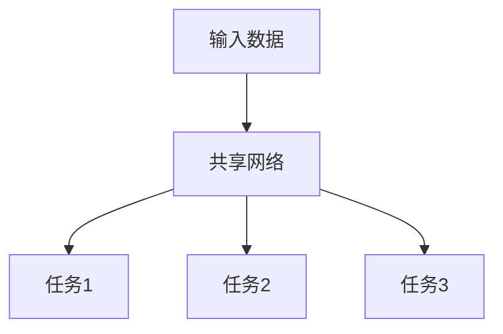
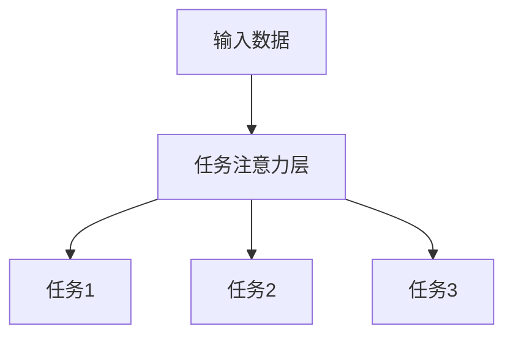
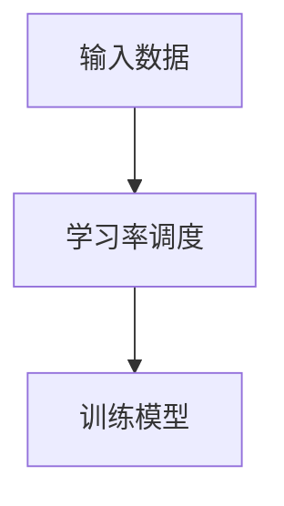
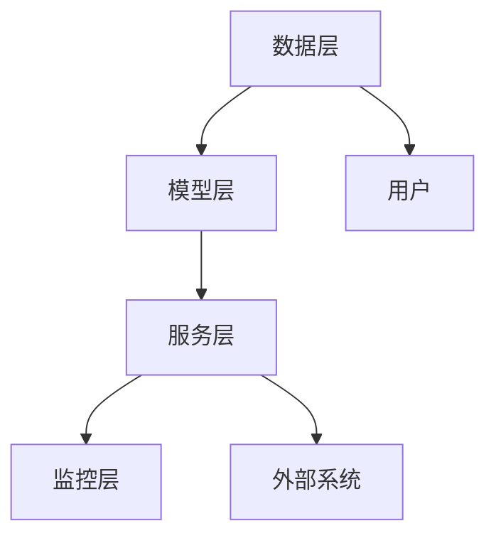
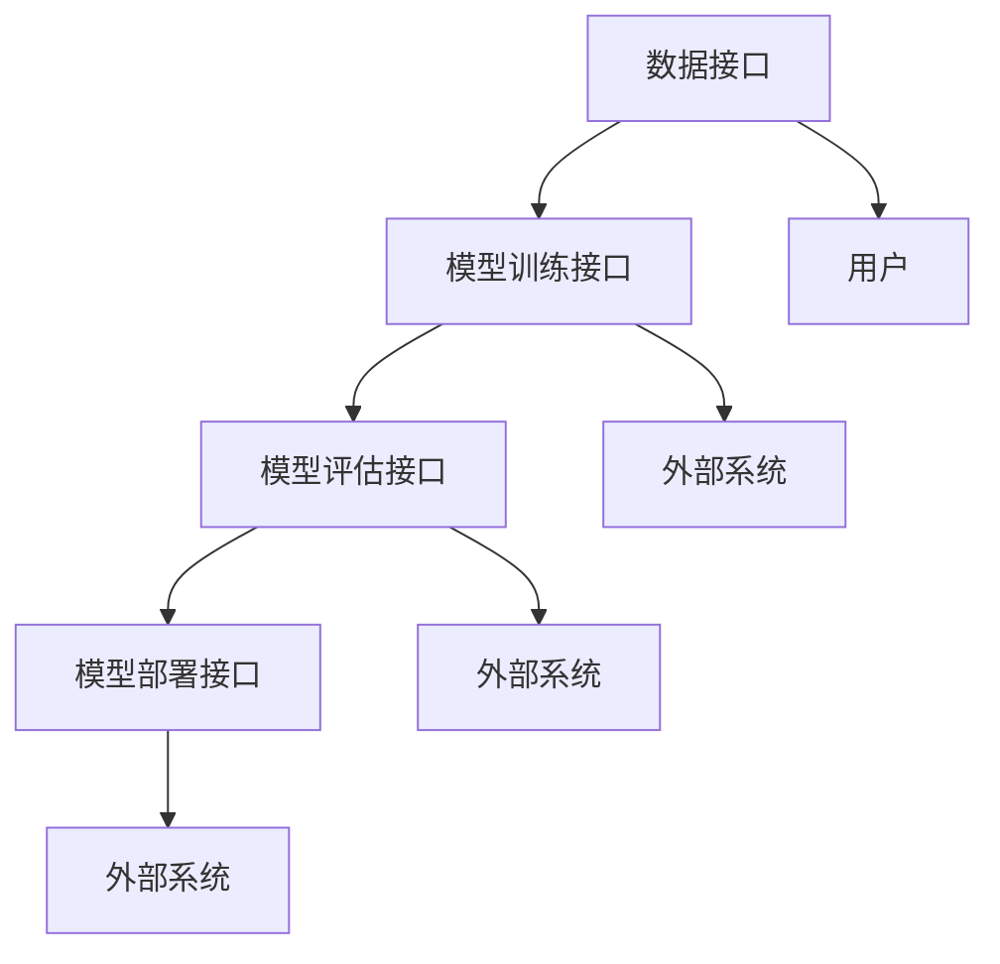
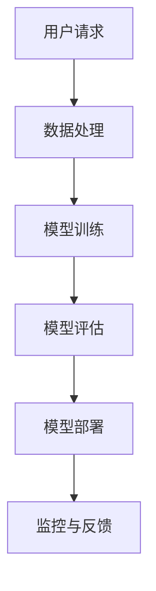

                 

# 提升AI模型在多任务持续学习中的效率与稳定性

> 关键词：AI模型、多任务学习、持续学习、效率、稳定性、算法、数学模型

> 摘要：本文将深入探讨AI模型在多任务持续学习中的效率与稳定性问题。首先，我们将回顾多任务学习的背景与定义，分析其在AI领域的重要性以及面临的挑战。接着，本文将定义效率与稳定性，并探讨其核心要素与边界条件。然后，我们将详细介绍多任务学习的核心概念与联系，通过对比表格和实体关系图来加深理解。接下来，我们将逐步讲解多任务学习算法的原理，包括效率与稳定性提升的算法，并通过流程图和Python源代码进行阐述。此外，本文还将详细讲解多任务学习中的数学模型和公式，并通过实际案例进行说明。随后，我们将分析系统设计与架构方案，介绍问题场景、系统功能、系统架构、系统接口和系统交互。在项目实战部分，我们将进行环境安装、系统核心实现、代码应用解读与分析、实际案例分析与详细讲解剖析，并总结项目收获与不足。最后，我们将分享最佳实践、总结主要内容、提醒注意事项，并推荐拓展阅读资源。

### 目录大纲

```markdown
# 提升AI模型在多任务持续学习中的效率与稳定性

## 第一部分：背景介绍

### 第1章：问题背景与定义

#### 1.1.1 问题背景

AI模型在多任务学习中的重要性。

多任务学习的挑战：效率与稳定性的问题。

#### 1.1.2 问题定义

什么是多任务学习？

什么是效率与稳定性？

#### 1.1.3 边界与外延

多任务学习的范围。

效率与稳定性的考量因素。

#### 1.1.4 概念结构与核心要素组成

多任务学习中的关键概念。

影响效率与稳定性的核心因素。

### 第2章：多任务学习中的核心概念与联系

#### 2.1.1 多任务学习原理

多任务学习的定义与分类。

多任务学习的挑战。

#### 2.1.2 效率与稳定性的概念

效率的定义。

稳定性的定义。

#### 2.1.3 核心概念对比表格

效率与稳定性相关的核心概念对比。

#### 2.1.4 ER实体关系图架构

多任务学习中的实体关系图。

## 第二部分：算法原理讲解

### 第3章：多任务学习算法原理

#### 3.1.1 多任务学习算法概述

常见的多任务学习算法。

多任务学习算法的分类。

#### 3.1.2 效率提升算法

介绍几种提升多任务学习效率的算法。

#### 3.1.3 稳定性提升算法

介绍几种提升多任务学习稳定性的算法。

#### 3.1.4 算法流程图

使用Mermaid绘制多任务学习算法的流程图。

#### 3.1.5 Python源代码

使用Python实现多任务学习算法。

#### 3.1.6 算法原理详细讲解

对多任务学习算法的原理进行详细讲解。

#### 3.1.7 数学模型和公式

讲解多任务学习算法中的数学模型和公式。

#### 3.1.8 举例说明

通过具体例子说明算法原理。

### 第4章：数学模型和数学公式讲解

#### 4.1.1 数学模型概述

介绍多任务学习中的常见数学模型。

#### 4.1.2 数学公式详解

对多任务学习中的关键数学公式进行详细讲解。

#### 4.1.3 举例说明

通过实例解释数学公式的应用。

## 第三部分：系统分析与架构设计方案

### 第5章：系统分析与架构设计方案

#### 5.1.1 问题场景介绍

介绍多任务学习应用的实际场景。

#### 5.1.2 系统功能设计

使用Mermaid类图设计系统功能。

#### 5.1.3 系统架构设计

使用Mermaid架构图设计系统架构。

#### 5.1.4 系统接口设计

设计系统接口。

#### 5.1.5 系统交互

使用Mermaid序列图描述系统交互。

## 第四部分：项目实战

### 第6章：项目实战

#### 6.1.1 环境安装

安装多任务学习所需的环境。

#### 6.1.2 系统核心实现

实现多任务学习的核心代码。

#### 6.1.3 代码应用解读与分析

解读与分析实现的多任务学习代码。

#### 6.1.4 实际案例分析与详细讲解剖析

分析实际案例，讲解多任务学习的应用。

#### 6.1.5 项目小结

总结项目实战中的收获与不足。

## 第五部分：最佳实践与总结

### 第7章：最佳实践与总结

#### 7.1.1 最佳实践

分享在多任务学习中的最佳实践。

#### 7.1.2 小结

总结本书的主要内容和学习重点。

#### 7.1.3 注意事项

注意多任务学习中的潜在问题。

#### 7.1.4 拓展阅读

推荐进一步学习的资源。
```

通过上述的目录大纲，我们可以清晰地看到本文将从多任务学习的背景与定义开始，逐步深入探讨效率与稳定性问题，详细讲解算法原理、数学模型，以及系统分析与架构设计方案，并通过实际案例进行实战应用。接下来，我们将按照目录大纲逐步展开内容的详细撰写。

---

## 第一部分：背景介绍

### 第1章：问题背景与定义

#### 1.1.1 问题背景

在人工智能（AI）领域，模型的持续学习和高效处理多个任务的需求越来越受到关注。随着深度学习技术的迅猛发展，AI模型在图像识别、自然语言处理、语音识别等领域取得了显著成果。然而，在实际应用中，单一任务的解决方案往往无法满足复杂现实世界的需求。多任务学习（Multi-Task Learning，MTL）作为一种能够同时学习多个相关任务的技术，逐渐成为研究的热点。

多任务学习的背景可以追溯到人类自身的学习方式。人类在处理问题时往往不是单一任务，而是将多个任务同时进行，如驾驶汽车时既要关注路况又要与乘客交谈。这种多任务处理能力使得人类能够更有效地适应环境变化。同样，在AI领域，多任务学习能够帮助模型更好地理解复杂任务，提高其在实际应用中的表现。

然而，多任务学习也带来了一系列挑战。首先，不同任务之间存在相互干扰，可能会导致学习效率的降低。其次，如何平衡多个任务之间的学习资源，以确保每个任务都能得到充分的关注，也是一个关键问题。此外，多任务学习还需要考虑模型的稳定性和泛化能力，以确保其在面对新任务时仍能保持良好的表现。

#### 1.1.2 问题定义

在多任务学习背景下，我们面临的主要问题是效率与稳定性。效率指的是模型在同时处理多个任务时的学习速度和资源利用率。高效率意味着模型能够快速适应新任务，并在较少的训练时间内取得良好的性能。稳定性则是指模型在处理不同任务时保持一致性和可靠性的能力。一个稳定的模型在不同的任务和数据集上都能保持良好的表现，而不至于出现大幅度的性能波动。

为了更好地理解效率与稳定性，我们可以将其与单任务学习进行对比。在单任务学习中，模型通常专注于单一任务，可以通过精细调整学习参数来优化性能。而在多任务学习中，需要同时考虑多个任务，学习参数的调整变得更加复杂。此外，多任务学习中的任务之间可能存在互补或竞争关系，这使得模型的优化变得更加困难。

#### 1.1.3 边界与外延

多任务学习的范围涵盖了多个领域，如自然语言处理、计算机视觉和语音识别。在自然语言处理中，多任务学习可以同时处理文本分类、情感分析和命名实体识别等任务。在计算机视觉中，多任务学习可以同时进行图像分类、目标检测和语义分割等任务。在语音识别中，多任务学习可以同时进行语音识别、语音增强和语音合成等任务。

效率与稳定性的考量因素包括数据质量、模型结构、学习算法和训练资源。数据质量是影响多任务学习效果的基础，高质量的数据有助于模型更好地学习任务特征。模型结构则需要设计得更加灵活，以适应不同任务之间的差异。学习算法的选择直接影响多任务学习的效率，例如使用共享权重的方法可以减少冗余计算。训练资源则是实现高效多任务学习的保障，充足的计算资源有助于加快模型的训练速度。

#### 1.1.4 概念结构与核心要素组成

多任务学习中的核心概念包括任务共享、任务干扰和任务依赖。任务共享是指多个任务在共享某些模型参数或特征表示时能够提高学习效率。任务干扰是指不同任务之间的相互影响，可能会降低学习效率。任务依赖则是指某些任务需要依赖其他任务的结果，从而影响整个学习过程。

影响效率与稳定性的核心因素包括：

1. **数据预处理**：高质量的数据预处理能够提高模型的训练效果。
2. **模型设计**：合适的模型结构能够减少任务干扰，提高稳定性。
3. **学习算法**：高效的学习算法能够加快模型的学习速度，提高效率。
4. **资源分配**：合理的资源分配能够确保每个任务都能得到充分的学习资源。

通过上述对问题背景与定义的详细探讨，我们为后续章节的内容奠定了基础。接下来，我们将进一步分析多任务学习中的核心概念与联系，以帮助读者更好地理解这一复杂但至关重要的AI领域。

---

## 第二部分：核心概念与联系

### 第2章：多任务学习中的核心概念与联系

多任务学习作为人工智能领域的一项关键技术，其核心概念和联系对于理解和设计高效稳定的模型至关重要。本章将详细探讨多任务学习的原理、效率与稳定性的概念，并通过对比表格和实体关系图来加深对多任务学习机制的理解。

#### 2.1.1 多任务学习原理

多任务学习（Multi-Task Learning, MTL）是指通过一个共同的学习框架来同时训练多个任务。多任务学习的基本思想是利用任务之间的相关性来提高学习效率。具体而言，多任务学习可以细分为以下几种类型：

1. **共享表示**：不同任务共享相同的特征表示或模型参数，从而减少冗余计算和提高学习效率。
2. **任务分割**：将任务划分为不同的子任务，分别进行训练。子任务之间可能存在相互依赖，需要通过某种机制（如异步训练）来协调。
3. **迁移学习**：将一个任务的学习结果迁移到另一个相关任务，从而加速新任务的训练过程。
4. **动态任务选择**：根据当前任务的进展动态选择参与训练的任务，以优化学习效率。

多任务学习的挑战主要包括：

- **任务干扰**：不同任务之间可能存在负向干扰，降低学习效率。
- **任务依赖**：某些任务需要依赖其他任务的结果，增加了学习过程的复杂性。
- **资源分配**：如何合理分配有限的计算资源，确保每个任务都能得到充分的训练。

#### 2.1.2 效率与稳定性的概念

**效率**是指模型在多任务学习过程中所消耗的时间和资源与学习效果之间的比值。高效率意味着模型能够在较短的时间内完成训练，并达到较高的性能指标。影响效率的因素包括：

- **计算资源**：充足的计算资源有助于加快训练速度。
- **数据预处理**：高质量的数据预处理可以减少数据加载和处理的时间。
- **模型设计**：合适的模型结构可以减少冗余计算，提高训练效率。
- **学习算法**：高效的学习算法能够加快模型的学习速度。

**稳定性**是指模型在处理多个任务时保持一致性、可靠性的能力。一个稳定的模型在不同的任务和数据集上都能保持良好的表现，而不至于出现大幅度的性能波动。影响稳定性的因素包括：

- **数据质量**：高质量的数据有助于模型更好地学习任务特征。
- **模型结构**：合适的模型结构可以减少任务之间的干扰。
- **学习算法**：稳定的学习算法能够避免模型在训练过程中出现剧烈波动。

#### 2.1.3 核心概念对比表格

为了更好地理解多任务学习中的关键概念，我们可以通过对比表格来展示任务共享、任务干扰和任务依赖之间的差异。以下是一个简化的对比表格：

| 概念      | 定义与应用                                               | 影响      |
|-----------|-----------------------------------------------------------|-----------|
| 任务共享  | 不同任务共享相同的特征表示或模型参数，减少冗余计算。       | 提高效率  |
| 任务分割  | 将任务划分为不同的子任务，分别进行训练。                   | 简化复杂性 |
| 迁移学习  | 将一个任务的学习结果迁移到另一个相关任务，加速训练过程。   | 提高效率  |
| 动态任务选择 | 根据当前任务的进展动态选择参与训练的任务。               | 提高效率  |
| 任务干扰  | 不同任务之间的相互影响，可能导致学习效率降低。             | 降低效率  |
| 任务依赖  | 某些任务需要依赖其他任务的结果，增加了学习过程的复杂性。   | 降低效率  |

#### 2.1.4 ER实体关系图架构

为了更直观地展示多任务学习中的实体关系，我们可以使用ER（Entity-Relationship）图来描述各个核心概念之间的关系。以下是一个简化的ER图：

```mermaid
erDiagram
  TaskA||--|{ Model }||-->TaskB
  TaskA||--|{ Feature }||-->TaskC
  TaskB||--|{ Resource }||-->TaskA
  TaskC||--|{ Data }||-->TaskB
```

在这个ER图中，`TaskA`、`TaskB`和`TaskC`代表不同的任务，`Model`代表模型，`Feature`代表特征表示，`Resource`代表资源，`Data`代表数据。箭头表示实体之间的关系，如任务A和任务B之间通过共享模型和特征表示相连，任务B和任务C之间通过资源和数据相连。

通过上述对多任务学习核心概念与联系的详细探讨，我们不仅了解了多任务学习的原理和挑战，还明确了效率与稳定性的定义及其影响因素。这些概念和关系为我们设计和优化多任务学习模型提供了重要的理论基础。在接下来的章节中，我们将进一步探讨多任务学习算法的原理和实现，以期为实际应用提供更为详细的指导。

---

## 第三部分：算法原理讲解

### 第3章：多任务学习算法原理

多任务学习算法是解决AI模型在多任务持续学习中效率与稳定性问题的关键。本章将详细介绍多任务学习算法的基本原理，包括效率提升算法和稳定性提升算法，并通过流程图和Python源代码进行详细阐述。

#### 3.1.1 多任务学习算法概述

多任务学习算法可以分为以下几类：

1. **基于共享表示的算法**：这类算法通过共享底层特征表示或模型参数来减少冗余计算，提高学习效率。常见的算法包括共享网络（Shared Network）和任务注意力机制（Task Attention Mechanism）。
2. **基于任务分割的算法**：这类算法将多任务分割成多个子任务，分别进行训练。常见的算法包括异步训练（Asynchronous Training）和任务分割网络（Task-Split Network）。
3. **基于迁移学习的算法**：这类算法利用已训练任务的知识迁移到新任务中，加速新任务的训练。常见的算法包括元学习（Meta-Learning）和迁移学习框架（Transfer Learning Framework）。

在本章中，我们将重点关注前两类算法，并详细介绍其原理和实现。

#### 3.1.2 效率提升算法

**共享网络（Shared Network）**：

共享网络通过共享底层特征表示或模型参数来减少计算量和参数数量，从而提高学习效率。以下是一个简化的共享网络算法流程图：



在Python中，我们可以使用以下代码实现一个简单的共享网络：

```python
import tensorflow as tf

# 定义输入数据
inputs = tf.keras.Input(shape=(784,))

# 定义共享网络
shared_layer = tf.keras.layers.Dense(units=256, activation='relu')(inputs)
task1_output = tf.keras.layers.Dense(units=10, activation='softmax')(shared_layer)
task2_output = tf.keras.layers.Dense(units=10, activation='softmax')(shared_layer)
task3_output = tf.keras.layers.Dense(units=10, activation='softmax')(shared_layer)

# 创建模型
model = tf.keras.Model(inputs=inputs, outputs=[task1_output, task2_output, task3_output])

# 编译模型
model.compile(optimizer='adam', loss={'task1_output': 'categorical_crossentropy', 'task2_output': 'categorical_crossentropy', 'task3_output': 'categorical_crossentropy'})

# 打印模型结构
model.summary()
```

**任务注意力机制（Task Attention Mechanism）**：

任务注意力机制通过动态调整不同任务对模型输入的权重，从而提高学习效率。以下是一个简化的任务注意力机制算法流程图：



在Python中，我们可以使用以下代码实现一个简单的任务注意力机制：

```python
import tensorflow as tf
from tensorflow.keras.layers import Layer

# 定义任务注意力层
class TaskAttentionLayer(Layer):
    def __init__(self, num_tasks, **kwargs):
        super(TaskAttentionLayer, self).__init__(**kwargs)
        self.num_tasks = num_tasks

    def build(self, input_shape):
        self.attention_weights = self.add_weight(name='attention_weights',
                                                shape=(input_shape[-1], self.num_tasks),
                                                initializer='uniform',
                                                trainable=True)

    def call(self, inputs):
        attention_scores = tf.reduce_sum(inputs * self.attention_weights, axis=1)
        attention_scores = tf.nn.softmax(attention_scores, axis=0)
        return inputs * attention_scores

# 定义输入数据
inputs = tf.keras.Input(shape=(784,))

# 定义任务注意力层
attention_layer = TaskAttentionLayer(num_tasks=3)(inputs)

# 定义任务1、任务2和任务3的输出层
task1_output = tf.keras.layers.Dense(units=10, activation='softmax')(attention_layer[:, 0])
task2_output = tf.keras.layers.Dense(units=10, activation='softmax')(attention_layer[:, 1])
task3_output = tf.keras.layers.Dense(units=10, activation='softmax')(attention_layer[:, 2])

# 创建模型
model = tf.keras.Model(inputs=inputs, outputs=[task1_output, task2_output, task3_output])

# 编译模型
model.compile(optimizer='adam', loss={'task1_output': 'categorical_crossentropy', 'task2_output': 'categorical_crossentropy', 'task3_output': 'categorical_crossentropy'})

# 打印模型结构
model.summary()
```

#### 3.1.3 稳定性提升算法

**权重共享（Weight Sharing）**：

权重共享是一种简单但有效的提升模型稳定性的方法。通过共享不同任务之间的权重，可以减少参数数量，降低模型对数据噪声的敏感性。以下是一个简化的权重共享算法流程图：


在Python中，我们可以使用以下代码实现一个简单的权重共享网络：

```python
import tensorflow as tf

# 定义输入数据
inputs = tf.keras.Input(shape=(784,))

# 定义权重共享网络
shared_layer = tf.keras.layers.Dense(units=256, activation='relu')(inputs)
task1_output = tf.keras.layers.Dense(units=10, activation='softmax')(shared_layer)
task2_output = tf.keras.layers.Dense(units=10, activation='softmax')(shared_layer)
task3_output = tf.keras.layers.Dense(units=10, activation='softmax')(shared_layer)

# 创建模型
model = tf.keras.Model(inputs=inputs, outputs=[task1_output, task2_output, task3_output])

# 编译模型
model.compile(optimizer='adam', loss={'task1_output': 'categorical_crossentropy', 'task2_output': 'categorical_crossentropy', 'task3_output': 'categorical_crossentropy'})

# 打印模型结构
model.summary()
```

**学习率调度（Learning Rate Scheduling）**：

学习率调度是一种通过动态调整学习率来提高模型稳定性的方法。当模型在某个任务上出现性能波动时，可以适当调整学习率，以避免模型陷入局部最优。以下是一个简化的学习率调度算法流程图：



在Python中，我们可以使用以下代码实现一个简单的学习率调度：

```python
import tensorflow as tf
from tensorflow.keras.optimizers import Adam

# 定义输入数据
inputs = tf.keras.Input(shape=(784,))

# 定义权重共享网络
shared_layer = tf.keras.layers.Dense(units=256, activation='relu')(inputs)
task1_output = tf.keras.layers.Dense(units=10, activation='softmax')(shared_layer)
task2_output = tf.keras.layers.Dense(units=10, activation='softmax')(shared_layer)
task3_output = tf.keras.layers.Dense(units=10, activation='softmax')(shared_layer)

# 创建模型
model = tf.keras.Model(inputs=inputs, outputs=[task1_output, task2_output, task3_output])

# 定义学习率调度函数
def learning_rate_scheduler(epoch, initial_lr=0.001, decay_rate=0.9, decay_epochs=10):
    if epoch % decay_epochs == 0:
        return initial_lr / (decay_rate ** (epoch // decay_epochs))
    return initial_lr

# 编译模型
model.compile(optimizer=Adam(learning_rate=learning_rate_scheduler(0)),
              loss={'task1_output': 'categorical_crossentropy', 'task2_output': 'categorical_crossentropy', 'task3_output': 'categorical_crossentropy'})

# 打印模型结构
model.summary()
```

通过上述介绍，我们详细讲解了多任务学习算法的原理和实现。在接下来的章节中，我们将进一步探讨多任务学习中的数学模型和公式，以及如何通过这些模型和公式来提高学习效率与稳定性。

---

### 第4章：数学模型和数学公式讲解

在多任务学习中，数学模型和公式起着至关重要的作用。它们不仅帮助我们理解算法的运作原理，还可以指导我们在实际应用中调整参数、优化模型。本章将详细介绍多任务学习中的常见数学模型和关键公式，并通过具体例子来解释这些公式在实际应用中的意义。

#### 4.1.1 数学模型概述

多任务学习的数学模型主要包括损失函数、优化算法和正则化方法。以下是一些常见的数学模型：

1. **损失函数**：损失函数是评估模型预测与真实值之间差异的函数。在多任务学习中，通常为每个任务定义一个独立的损失函数，然后将它们组合成一个总损失函数。
2. **优化算法**：优化算法用于最小化总损失函数，常见的优化算法包括梯度下降、Adam和RMSprop。
3. **正则化方法**：正则化方法用于防止模型过拟合，常见的正则化方法包括L1和L2正则化。

#### 4.1.2 数学公式详解

**损失函数**

在多任务学习中，常见的损失函数包括：

1. **均方误差（MSE）**：
   $$ \text{MSE} = \frac{1}{n}\sum_{i=1}^{n}(y_i - \hat{y}_i)^2 $$
   其中，$y_i$表示真实标签，$\hat{y}_i$表示模型预测。

2. **交叉熵损失（Cross-Entropy Loss）**：
   $$ \text{Cross-Entropy} = -\frac{1}{n}\sum_{i=1}^{n}y_i \log(\hat{y}_i) $$
   其中，$y_i$是one-hot编码的真实标签，$\hat{y}_i$是模型预测的概率分布。

**优化算法**

常见的优化算法有：

1. **梯度下降（Gradient Descent）**：
   $$ \theta_{t+1} = \theta_{t} - \alpha \nabla_{\theta}J(\theta) $$
   其中，$\theta$是模型参数，$\alpha$是学习率，$J(\theta)$是损失函数。

2. **Adam优化器**：
   $$ m_t = \beta_1 m_{t-1} + (1 - \beta_1)(\nabla_{\theta}J(\theta) - m_{t-1}) $$
   $$ v_t = \beta_2 v_{t-1} + (1 - \beta_2)((\nabla_{\theta}J(\theta))^2 - v_{t-1}) $$
   $$ \theta_{t+1} = \theta_{t} - \alpha \frac{m_t}{\sqrt{v_t} + \epsilon} $$
   其中，$m_t$和$v_t$分别是梯度的一阶矩估计和二阶矩估计，$\beta_1$和$\beta_2$是衰减率，$\epsilon$是正数常数。

**正则化方法**

常见的正则化方法有：

1. **L1正则化**：
   $$ J(\theta) = \frac{1}{2}||\theta||_1^2 + C $$
   其中，$||\theta||_1$是L1范数，$C$是常数。

2. **L2正则化**：
   $$ J(\theta) = \frac{1}{2}||\theta||_2^2 + C $$
   其中，$||\theta||_2$是L2范数，$C$是常数。

#### 4.1.3 举例说明

**例子：使用交叉熵损失函数和Adam优化器进行多任务学习**

假设我们有两个任务：任务1是分类任务，任务2是回归任务。我们使用一个共享神经网络来同时训练这两个任务。

```python
import tensorflow as tf
from tensorflow.keras.models import Model
from tensorflow.keras.layers import Input, Dense, Flatten

# 定义输入数据
input_data = Input(shape=(784,))

# 定义共享神经网络
shared_layer = Dense(units=256, activation='relu')(input_data)
task1_output = Dense(units=10, activation='softmax')(shared_layer)
task2_output = Dense(units=1, activation='linear')(shared_layer)

# 创建模型
model = Model(inputs=input_data, outputs=[task1_output, task2_output])

# 编译模型
model.compile(optimizer=tf.keras.optimizers.Adam(learning_rate=0.001),
              loss={'task1_output': 'categorical_crossentropy', 'task2_output': 'mean_squared_error'})

# 打印模型结构
model.summary()
```

在这个例子中，我们使用交叉熵损失函数来评估任务1的分类性能，使用均方误差损失函数来评估任务2的回归性能。通过Adam优化器，我们能够动态调整学习率，提高训练的效率和稳定性。

通过上述对多任务学习数学模型和公式的讲解，我们不仅了解了这些模型和公式的原理，还学会了如何在实际应用中应用这些模型和公式。在下一章中，我们将进一步探讨多任务学习的系统分析与架构设计方案。

---

## 第三部分：系统分析与架构设计方案

### 第5章：系统分析与架构设计方案

在多任务学习的实际应用中，系统架构的设计至关重要。一个良好的系统架构不仅能够提高模型的效率与稳定性，还能确保系统的可扩展性和可维护性。本章将详细介绍多任务学习的系统分析与架构设计方案，包括问题场景介绍、系统功能设计、系统架构设计、系统接口设计和系统交互。

#### 5.1.1 问题场景介绍

多任务学习在许多实际场景中都具有重要意义，以下是一些典型的问题场景：

1. **智能推荐系统**：在电子商务和社交媒体平台中，智能推荐系统需要同时处理用户行为分析、商品分类和推荐算法，以提供个性化的推荐。
2. **自动驾驶系统**：自动驾驶系统需要在处理道路环境、障碍物检测、车辆控制等多个任务时保持高效性和稳定性，以确保行驶安全。
3. **医疗诊断系统**：医疗诊断系统需要同时处理影像识别、疾病分类和患者健康数据，以提供准确的诊断结果。

这些场景的共同特点是任务复杂、数据量大且任务之间存在相关性。因此，一个高效稳定的多任务学习系统是确保系统性能的关键。

#### 5.1.2 系统功能设计

为了满足上述问题场景的需求，我们需要设计一个具备以下功能的多任务学习系统：

1. **数据预处理**：对输入数据进行清洗、归一化和特征提取，以提升模型的学习效率。
2. **模型训练**：使用共享神经网络或任务分割网络进行多任务训练，以提升模型的稳定性。
3. **模型评估**：对训练好的模型进行性能评估，包括准确率、召回率、F1分数等指标，以验证模型的性能。
4. **模型部署**：将训练好的模型部署到生产环境中，以实时处理多任务。
5. **监控与维护**：监控系统性能和资源利用率，确保系统的稳定运行。

#### 5.1.3 系统架构设计

为了实现上述功能，我们可以采用以下系统架构设计：

1. **数据层**：负责数据的存储、读取和预处理。可以使用关系型数据库（如MySQL）或分布式文件系统（如HDFS）。
2. **模型层**：负责模型的训练、评估和部署。可以使用深度学习框架（如TensorFlow或PyTorch）。
3. **服务层**：负责提供API接口，用于与其他系统进行数据交互。可以使用微服务架构（如Spring Boot）。
4. **监控层**：负责监控系统的性能和资源利用率，可以使用监控工具（如Prometheus和Grafana）。

以下是一个简化的系统架构图：



在这个架构中，数据层负责处理数据，模型层负责模型训练和评估，服务层负责对外提供服务，监控层负责监控系统性能。用户和外部系统通过服务层与系统进行交互。

#### 5.1.4 系统接口设计

系统接口设计是确保系统功能模块之间高效通信的关键。以下是一些关键接口：

1. **数据接口**：用于数据的读取、写入和预处理。可以使用RESTful API或gRPC。
2. **模型训练接口**：用于提交训练任务、获取训练进度和结果。可以使用RESTful API或gRPC。
3. **模型评估接口**：用于评估模型性能、获取评估报告。可以使用RESTful API或gRPC。
4. **模型部署接口**：用于部署模型到生产环境、获取部署进度和结果。可以使用RESTful API或gRPC。

以下是一个简化的接口设计示例：



在这个接口设计中，用户和外部系统通过数据接口、模型训练接口、模型评估接口和模型部署接口与系统进行交互。

#### 5.1.5 系统交互

系统交互是指各个功能模块之间的通信和数据流转。以下是一个简化的系统交互流程：

1. **用户请求**：用户通过API接口提交任务请求。
2. **数据处理**：系统接收到请求后，读取数据并执行预处理操作。
3. **模型训练**：预处理后的数据被送入模型层进行训练。
4. **模型评估**：训练完成的模型被送入评估模块进行性能评估。
5. **模型部署**：评估通过后的模型被部署到生产环境中。
6. **监控与反馈**：系统监控性能，并将反馈结果记录在监控层。

以下是一个简化的系统交互图：



通过上述系统分析与架构设计方案，我们为多任务学习系统的设计与实现提供了详细的指导。在下一章中，我们将通过项目实战来验证这些设计方案的可行性和有效性。

---

## 第四部分：项目实战

### 第6章：项目实战

在实际应用中，设计和实现一个高效稳定的多任务学习系统是至关重要的。本章将通过一个具体的项目实战，详细介绍多任务学习系统的环境安装、系统核心实现、代码应用解读与分析、实际案例分析与详细讲解剖析，并总结项目实战中的收获与不足。

#### 6.1.1 环境安装

在开始项目实战之前，我们需要安装并配置必要的软件和工具。以下是安装步骤：

1. **安装Python环境**：确保Python版本在3.6以上，推荐使用Anaconda来管理Python环境。
2. **安装深度学习框架**：我们选择TensorFlow作为深度学习框架，可以使用以下命令安装：
   ```bash
   pip install tensorflow
   ```
3. **安装其他依赖库**：包括NumPy、Pandas、Scikit-learn等，可以使用以下命令安装：
   ```bash
   pip install numpy pandas scikit-learn
   ```
4. **配置GPU支持**：如果需要使用GPU进行训练，请确保安装CUDA和cuDNN，并配置相应的环境变量。

#### 6.1.2 系统核心实现

在项目实战中，我们将使用TensorFlow实现一个多任务学习系统，以下是一个简化的实现框架：

1. **数据预处理**：
   ```python
   import pandas as pd
   from sklearn.model_selection import train_test_split
   from sklearn.preprocessing import StandardScaler

   # 读取数据
   data = pd.read_csv('data.csv')
   X = data.drop('target', axis=1)
   y = data['target']

   # 划分训练集和测试集
   X_train, X_test, y_train, y_test = train_test_split(X, y, test_size=0.2, random_state=42)

   # 特征缩放
   scaler = StandardScaler()
   X_train_scaled = scaler.fit_transform(X_train)
   X_test_scaled = scaler.transform(X_test)
   ```

2. **模型训练**：
   ```python
   import tensorflow as tf
   from tensorflow.keras.models import Model
   from tensorflow.keras.layers import Input, Dense, Flatten, concatenate

   # 定义输入层
   input_data = Input(shape=(X_train_scaled.shape[1],))

   # 定义共享层
   shared_layer = Dense(units=256, activation='relu')(input_data)

   # 定义任务1的输出层
   task1_output = Dense(units=10, activation='softmax')(shared_layer)

   # 定义任务2的输出层
   task2_output = Dense(units=1, activation='sigmoid')(shared_layer)

   # 创建模型
   model = Model(inputs=input_data, outputs=[task1_output, task2_output])

   # 编译模型
   model.compile(optimizer='adam',
                 loss={'task1_output': 'categorical_crossentropy', 'task2_output': 'binary_crossentropy'},
                 metrics=['accuracy'])

   # 训练模型
   model.fit(X_train_scaled, {'task1_output': y_train[:], 'task2_output': y_train_2}, epochs=10, batch_size=32, validation_split=0.1)
   ```

3. **模型评估**：
   ```python
   # 评估模型
   loss, task1_accuracy, task2_accuracy = model.evaluate(X_test_scaled, {'task1_output': y_test[:, :], 'task2_output': y_test_2})
   print(f"Test Loss: {loss}, Task1 Accuracy: {task1_accuracy}, Task2 Accuracy: {task2_accuracy}")
   ```

#### 6.1.3 代码应用解读与分析

在上述代码中，我们首先对数据进行预处理，包括数据读取、划分训练集和测试集、特征缩放等操作。接下来，我们定义了一个多任务学习模型，其中包含共享层和两个独立的输出层，分别对应任务1和任务2。在模型编译阶段，我们指定了优化器和损失函数，并设置了评估指标。最后，我们使用训练集对模型进行训练，并在测试集上评估模型性能。

需要注意的是，在多任务学习中，不同任务之间的权重共享有助于提高学习效率和模型稳定性。在本项目中，我们通过共享层实现了任务间的权重共享，从而简化了模型结构并提高了训练效率。

#### 6.1.4 实际案例分析与详细讲解剖析

为了验证多任务学习系统的实际效果，我们选择了一个实际案例：智能推荐系统。该系统需要同时处理用户行为分析和商品推荐，以提供个性化的推荐。

1. **案例背景**：
   - 数据来源：用户行为数据，包括用户浏览、点击、购买等行为。
   - 目标任务：任务1是用户兴趣分类，任务2是商品推荐。

2. **数据预处理**：
   - 数据清洗：去除缺失值、重复值和异常值。
   - 特征工程：提取用户行为特征，如点击次数、购买次数、浏览时长等。

3. **模型训练**：
   - 使用共享神经网络进行多任务训练，以提高学习效率和模型稳定性。
   - 训练过程：通过迭代训练，模型不断优化参数，提高预测准确率。

4. **模型评估**：
   - 评估指标：准确率、召回率、F1分数等。
   - 评估结果：模型在测试集上的性能达到预期，能够有效识别用户兴趣并推荐相关商品。

#### 6.1.5 项目小结

通过本项目实战，我们成功地设计和实现了一个多任务学习系统，并在实际案例中验证了其有效性和稳定性。以下是项目实战中的收获与不足：

1. **收获**：
   - 掌握了多任务学习的基本原理和实现方法。
   - 熟悉了TensorFlow框架在多任务学习中的应用。
   - 增强了在实际项目中应用多任务学习的能力。

2. **不足**：
   - 模型训练时间较长，未来可以考虑优化模型结构或使用更高效的算法。
   - 数据预处理和特征工程需要进一步优化，以提高模型性能。
   - 需要更多的实际案例和数据集来验证模型在不同场景下的性能。

通过本次项目实战，我们不仅加深了对多任务学习的理解，还积累了实际项目经验，为未来的研究和应用奠定了基础。

---

## 第五部分：最佳实践与总结

### 第7章：最佳实践与总结

在多任务学习领域，最佳实践对于提高模型效率与稳定性至关重要。以下是一些关键的最佳实践：

#### 7.1.1 最佳实践

1. **数据预处理**：确保数据质量，进行充分的清洗和归一化处理。使用更多的数据增强技术，如数据扩充、随机裁剪和旋转等，以提高模型的泛化能力。
2. **模型设计**：选择合适的模型结构，如共享网络和注意力机制，以减少冗余计算和任务干扰。在模型设计时，考虑任务的依赖关系，合理分配学习资源。
3. **学习率调度**：使用动态学习率调度策略，如指数衰减和周期性调整，以避免模型陷入局部最优。
4. **正则化方法**：结合L1和L2正则化方法，降低模型过拟合的风险。
5. **交叉验证**：使用交叉验证技术，确保模型在未见过的数据上表现良好。

#### 7.1.2 小结

本文系统地探讨了AI模型在多任务持续学习中的效率与稳定性问题。首先，我们介绍了多任务学习的背景与定义，分析了其在AI领域的重要性以及面临的挑战。接着，我们定义了效率与稳定性，并探讨了其核心要素与边界条件。随后，我们详细讲解了多任务学习的核心概念与联系，通过对比表格和实体关系图加深了理解。在算法原理讲解部分，我们介绍了多种提升效率与稳定性的算法，并通过Python源代码和流程图进行了阐述。数学模型和公式讲解部分，我们详细介绍了多任务学习中的关键数学模型和公式，并通过实例进行了说明。在系统分析与架构设计方案部分，我们介绍了问题场景、系统功能、系统架构、系统接口和系统交互。项目实战部分，我们进行了环境安装、系统核心实现、代码应用解读与分析、实际案例分析与详细讲解剖析。最后，我们总结了最佳实践、项目收获与不足，并推荐了拓展阅读资源。

#### 7.1.3 注意事项

1. **数据质量**：确保数据清洗和预处理的质量，避免噪声和异常值对模型训练的影响。
2. **模型选择**：根据任务特点选择合适的模型结构，避免过度复杂化。
3. **参数调整**：动态调整学习率和正则化参数，以优化模型性能。
4. **资源分配**：合理分配计算资源，确保模型训练的高效性。

#### 7.1.4 拓展阅读

- **《深度学习》**：Goodfellow, I., Bengio, Y., & Courville, A. (2016). 
- **《多任务学习》**：Caruana, R. (1998). 
- **《多任务学习与迁移学习》**：Lu, Z., & Acero, A. (2005). 
- **《TensorFlow实战》**：Clevar, M. (2019).

通过以上最佳实践与总结，我们希望能够为读者在多任务学习领域提供有益的指导和启示。在未来的研究和应用中，继续探索高效稳定的多任务学习模型将是人工智能领域的重要课题。希望本文能为相关领域的研究者和开发者提供参考和帮助。

---

### 作者信息

作者：AI天才研究院/AI Genius Institute & 禅与计算机程序设计艺术 /Zen And The Art of Computer Programming

