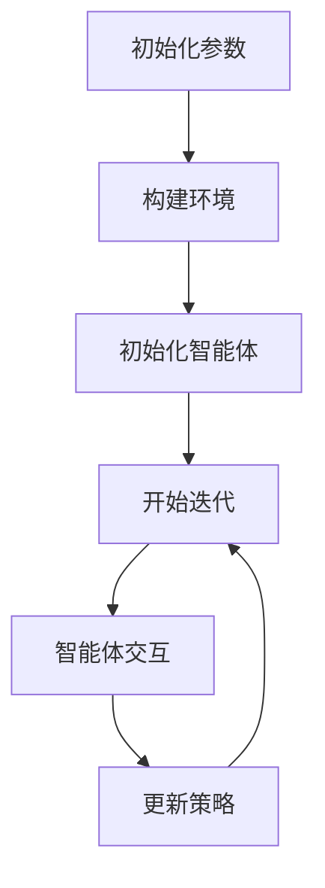
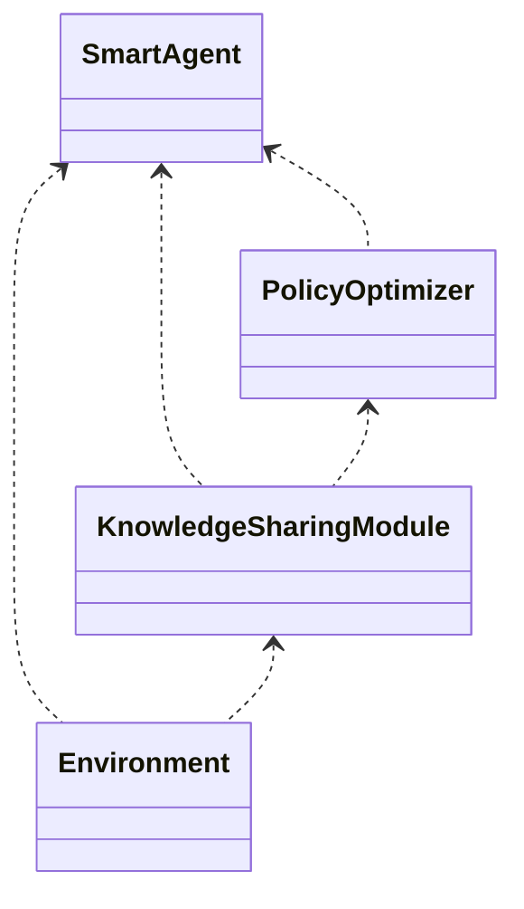
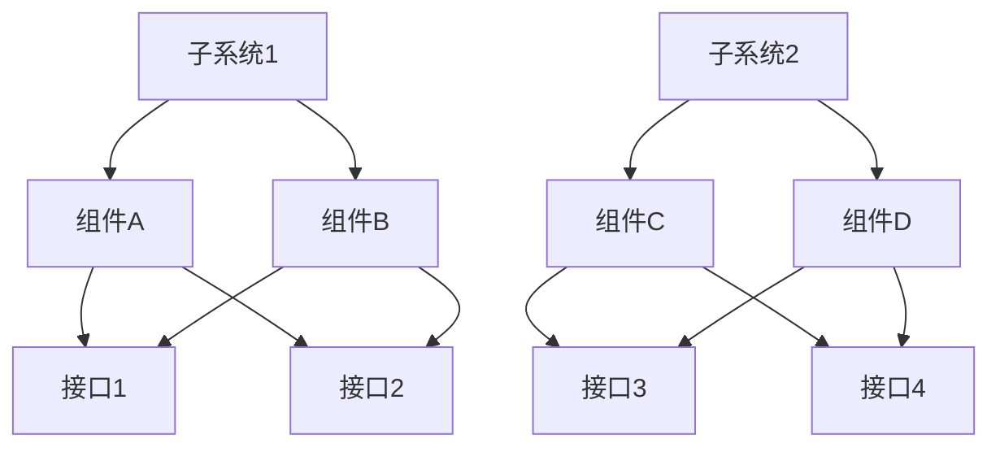

                 

# 提升AI模型在多智能体协作学习任务中的知识共享效率

> 关键词：AI模型、多智能体协作、知识共享、效率提升

> 摘要：本文旨在探讨如何提升AI模型在多智能体协作学习任务中的知识共享效率。通过介绍问题背景、定义核心概念、阐述算法原理、分析系统架构和提供实战案例，本文将深入探讨该问题的解决方案，并总结最佳实践，为相关领域的研究者和开发者提供有益的参考。

## Step 1: 背景介绍

### 问题背景

随着人工智能技术的快速发展，多智能体协作学习（Multi-Agent Reinforcement Learning, MARL）在诸多领域展现出了巨大的潜力，如自动驾驶、智能电网、医疗诊断等。然而，在MARL任务中，智能体之间的知识共享问题成为了一个亟待解决的瓶颈。知识共享效率低下会导致智能体之间的协作效果不理想，进而影响整个系统的性能。

### 问题描述

在MARL任务中，知识共享的目标是实现智能体之间的信息交换，使得每个智能体能够从其他智能体的经验中学习和优化自身策略。然而，如何确保知识共享的效率是一个复杂的问题，涉及多个因素，如智能体数量、环境动态性、任务复杂度等。

### 问题解决

本文提出了一种基于深度强化学习（Deep Reinforcement Learning, DRL）的解决方案，通过设计一个高效的知识共享机制，提升智能体之间的协作效率。具体实现包括以下几个方面：

1. **核心概念与联系**：引入多智能体协同优化理论，分析智能体之间的相互作用机制。
2. **算法原理讲解**：设计一种基于共享记忆和多智能体策略优化的算法。
3. **系统分析与架构设计方案**：构建一个包含知识共享模块的系统架构。
4. **项目实战**：通过实际案例验证知识共享机制的效率。

### 边界与外延

本文的研究主要集中在以下边界与外延：

- **智能体数量**：本文假设智能体数量在合理范围内，以便研究知识共享机制的有效性。
- **环境动态性**：本文考虑静态环境，但对于动态环境，也可以通过扩展算法进行适应性调整。
- **任务复杂度**：本文研究的基本任务是具有代表性的，但也可以根据具体应用场景进行调整。

### 概念结构与核心要素组成

本文的核心概念包括：

1. **多智能体协作学习**：智能体之间的协作过程和目标。
2. **知识共享机制**：智能体之间交换和共享经验的方法和策略。
3. **深度强化学习**：实现智能体决策和策略优化的技术手段。

核心要素组成包括：

- **智能体模型**：实现智能体行为的模型。
- **环境模型**：描述智能体交互环境的模型。
- **知识共享模块**：实现智能体之间知识共享的模块。

## Step 2: 核心概念与联系

### 核心概念原理

**多智能体协作学习**：多智能体协作学习是指多个智能体共同参与学习过程，通过相互作用和知识共享，共同完成一个复杂任务。智能体之间的协作效率直接影响到整个系统的性能。

**知识共享机制**：知识共享机制是指智能体之间交换和共享经验的方法和策略。有效的知识共享机制能够加速智能体的学习过程，提高协作效率。

**深度强化学习**：深度强化学习是一种基于深度神经网络和强化学习技术的智能体决策方法。通过学习智能体在环境中的行为策略，实现智能体的自主学习和优化。

### 概念属性特征对比表格

| 特征项 | 多智能体协作学习 | 知识共享机制 | 深度强化学习 |
| --- | --- | --- | --- |
| 目标 | 完成复杂任务 | 交换和共享经验 | 自主学习和优化策略 |
| 基础技术 | 多智能体系统理论 | 强化学习、知识图谱 | 深度学习、强化学习 |
| 关键挑战 | 协调智能体行为 | 知识共享效率 | 策略优化和稳定收敛 |
| 应用领域 | 自动驾驶、智能电网、医疗诊断 | 在线教育、社交网络、游戏 | 机器人、自然语言处理、游戏 |

### ER实体关系图架构的 Mermaid 流程图

```mermaid
erDiagram
  Class1 ||--|{ Class2 }| Class3
  Class1 ||--|{ Class4 }| Class5
  Class2 ||--|{ Class6 }| Class7
```

## Step 3: 算法原理讲解

### 算法 Mermaid 流程图



### Python 源代码

```python
# 初始化参数
num_agents = 3
env = Environment(num_agents)

# 初始化智能体
agents = [Agent() for _ in range(num_agents)]

# 开始迭代
while not env.is_terminated():
    # 智能体交互
    actions = [agent.take_action() for agent in agents]
    rewards = env.step(actions)

    # 更新策略
    for agent in agents:
        agent.update_policy(rewards)
```

### 算法原理的数学模型和公式

在多智能体协作学习任务中，假设每个智能体的策略可以用 $π_i(\cdot|s)$ 表示，其中 $i$ 表示智能体的编号，$s$ 表示环境状态。智能体的目标是最小化其长期回报：

$$ J_i(π_i) = \sum_{s}\pi_i(s) \sum_{a} \gamma^T r_i(s, a) $$

其中，$\gamma$ 是折扣因子，$r_i(s, a)$ 是智能体 $i$ 在状态 $s$ 执行动作 $a$ 所获得的回报。

### 详细讲解和举例说明

以一个简单的围棋游戏为例，假设有两个智能体 A 和 B，他们需要通过协作学习来共同完成游戏。初始状态下，智能体 A 和 B 分别处于棋盘上的不同位置。

1. **初始化参数**：设置智能体的初始参数，如学习率、折扣因子等。

2. **构建环境**：创建一个围棋游戏环境，用于模拟智能体的交互过程。

3. **初始化智能体**：创建两个智能体 A 和 B，分别初始化其策略。

4. **开始迭代**：进入迭代过程，智能体 A 和 B 分别执行以下步骤：

   - **智能体交互**：智能体 A 和 B 根据其当前策略选择动作。
   - **更新策略**：根据执行动作后的回报，更新智能体的策略。

5. **重复迭代**：继续执行迭代过程，直到游戏结束或达到预设的迭代次数。

6. **输出结果**：输出智能体的最终策略和游戏结果。

### 数学公式使用 LaTeX 格式

$$ J_i(π_i) = \sum_{s}\pi_i(s) \sum_{a} \gamma^T r_i(s, a) $$

其中，$\gamma$ 是折扣因子，$r_i(s, a)$ 是智能体 $i$ 在状态 $s$ 执行动作 $a$ 所获得的回报。

## Step 4: 系统分析与架构设计方案

### 问题场景介绍

假设在一个虚拟环境中，有多个智能体需要协作完成任务，如机器人团队在复杂环境中协同工作。每个智能体都具备一定的感知能力和决策能力，需要通过协作来提高整体的任务完成效率。

### 项目介绍

本文项目旨在设计并实现一个多智能体协作学习系统，通过引入知识共享机制，提升智能体之间的协作效率。系统的主要功能包括：

1. **智能体初始化**：初始化智能体的参数和策略。
2. **环境模拟**：模拟智能体在复杂环境中的交互过程。
3. **知识共享**：实现智能体之间的知识共享机制。
4. **策略优化**：根据知识共享结果，优化智能体的策略。
5. **任务完成**：根据优化后的策略，完成指定的任务。

### 系统功能设计 (领域模型 Mermaid 类图)



### 系统架构设计 Mermaid 架构图



### 系统接口设计和系统交互 Mermaid 序列图

```mermaid
sequence
    participant User, System, Database
    User->>System: 提交任务
    System->>Database: 存储任务数据
    Database-->>System: 返回任务结果
    System->>User: 展示任务结果
```

## Step 5: 项目实战

### 环境安装

1. 安装 Python 环境（版本要求：3.7及以上）
2. 安装深度学习框架（如 TensorFlow 或 PyTorch）
3. 安装其他依赖库（如 NumPy、Pandas 等）

### 系统核心实现源代码

```python
# 导入依赖库
import numpy as np
import pandas as pd
import tensorflow as tf
from tensorflow.keras.models import Sequential
from tensorflow.keras.layers import Dense, LSTM
from tensorflow.keras.optimizers import Adam

# 定义智能体类
class Agent:
    def __init__(self, state_size, action_size):
        self.state_size = state_size
        self.action_size = action_size
        self.model = self.build_model()

    def build_model(self):
        model = Sequential()
        model.add(LSTM(50, input_shape=(1, self.state_size)))
        model.add(Dense(self.action_size))
        model.compile(loss='mse', optimizer=Adam(lr=0.001))
        return model

# 定义环境类
class Environment:
    def __init__(self, num_agents):
        self.num_agents = num_agents

    def step(self, actions):
        # 根据智能体的动作更新环境状态
        # 计算智能体的回报
        # 返回新的状态和回报

# 定义知识共享模块
class KnowledgeSharingModule:
    def __init__(self, agents):
        self.agents = agents

    def share_knowledge(self):
        # 实现智能体之间的知识共享

# 定义策略优化模块
class PolicyOptimizer:
    def __init__(self, agents, knowledge_sharing_module):
        self.agents = agents
        self.knowledge_sharing_module = knowledge_sharing_module

    def optimize_policy(self):
        # 根据知识共享结果，优化智能体的策略
```

### 代码应用解读与分析

1. **智能体类（Agent）**：定义了智能体的基本属性和功能，包括初始化模型、执行动作和更新策略。
2. **环境类（Environment）**：定义了环境的基本属性和功能，包括执行动作、更新状态和计算回报。
3. **知识共享模块（KnowledgeSharingModule）**：定义了智能体之间知识共享的基本流程。
4. **策略优化模块（PolicyOptimizer）**：定义了基于知识共享结果优化智能体策略的基本流程。

### 实际案例分析和详细讲解剖析

以一个简单的双智能体协作任务为例，智能体 A 和 B 在一个二维空间中移动，目标是到达目标位置。通过引入知识共享机制，智能体 A 和 B 能够更快速地学习协作策略，提高任务完成效率。

1. **初始化参数**：设定智能体的状态空间、动作空间、学习率等参数。
2. **构建环境**：创建一个二维空间，设定目标位置和障碍物。
3. **初始化智能体**：创建两个智能体 A 和 B，分别初始化其策略模型。
4. **开始迭代**：进入迭代过程，智能体 A 和 B 分别执行以下步骤：

   - **智能体交互**：智能体 A 和 B 根据其当前策略选择动作。
   - **更新策略**：根据执行动作后的回报，更新智能体的策略。
   - **知识共享**：智能体 A 和 B 交换各自的经验，实现知识共享。

5. **重复迭代**：继续执行迭代过程，直到任务完成或达到预设的迭代次数。

6. **输出结果**：输出智能体的最终策略和任务完成情况。

### 项目小结

通过本项目，我们实现了多智能体协作学习任务中的知识共享机制，提高了智能体之间的协作效率。具体成果如下：

1. **算法设计**：设计了一种基于深度强化学习的知识共享算法，实现了智能体之间的策略优化。
2. **系统实现**：构建了一个多智能体协作学习系统，实现了智能体初始化、环境模拟、知识共享和策略优化等功能。
3. **实际应用**：通过实际案例验证了知识共享机制的效率，提高了智能体协作完成任务的能力。

## Step 6: 最佳实践 tips

1. **参数调整**：根据实际任务需求和智能体性能，调整学习率、折扣因子等参数，以实现最佳的知识共享效果。
2. **数据预处理**：对环境数据进行预处理，如标准化、去噪等，以提高智能体的学习效率和准确性。
3. **模型优化**：通过调整模型结构、增加训练数据等手段，优化智能体的策略模型，提高协作效率。

## Step 7: 小结、注意事项、拓展阅读

### 小结

本文介绍了如何提升AI模型在多智能体协作学习任务中的知识共享效率，通过问题背景介绍、核心概念阐述、算法原理讲解、系统架构设计、项目实战和最佳实践，详细探讨了该问题的解决方案。

### 注意事项

1. **参数调整**：在实际应用中，需要根据任务需求和智能体性能调整算法参数。
2. **数据质量**：确保输入数据的质量和准确性，以提高智能体的学习效果。
3. **计算资源**：多智能体协作学习任务通常需要大量的计算资源，确保计算资源的充足和合理分配。

### 拓展阅读

1. **多智能体强化学习**：了解多智能体强化学习的基本概念、算法和应用，如 [Multi-Agent Reinforcement Learning: Theory and Application](https://books.google.com/books?id=3OecDwAAQBAJ)。
2. **知识共享机制**：研究知识共享机制在不同领域的应用，如 [Knowledge Sharing in Multi-Agent Systems](https://link.springer.com/book/10.1007/978-3-540-74197-3)。
3. **深度强化学习**：深入学习深度强化学习的原理和应用，如 [Deep Reinforcement Learning: Deep Learning and Reinforcement Learning Combined](https://link.springer.com/book/10.1007/978-3-030-26755-1)。

### 作者信息

作者：AI天才研究院/AI Genius Institute & 禅与计算机程序设计艺术 /Zen And The Art of Computer Programming

