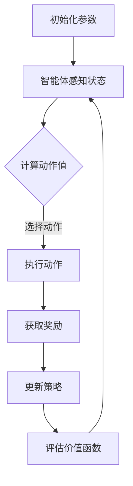
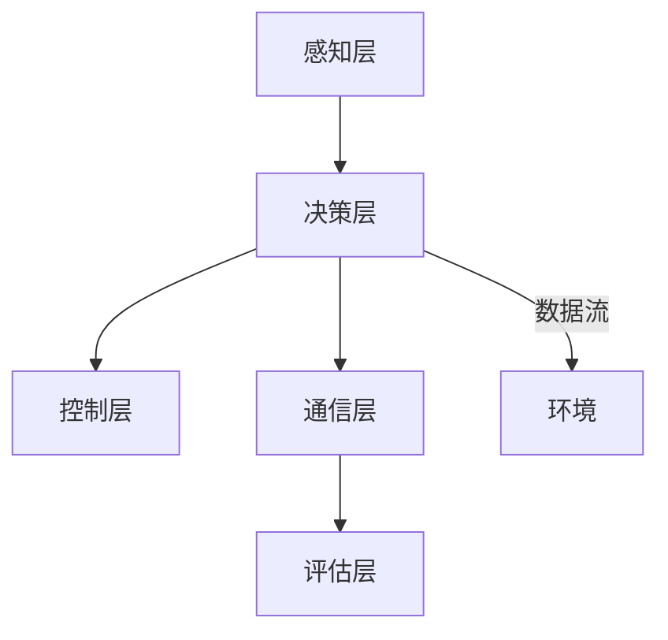
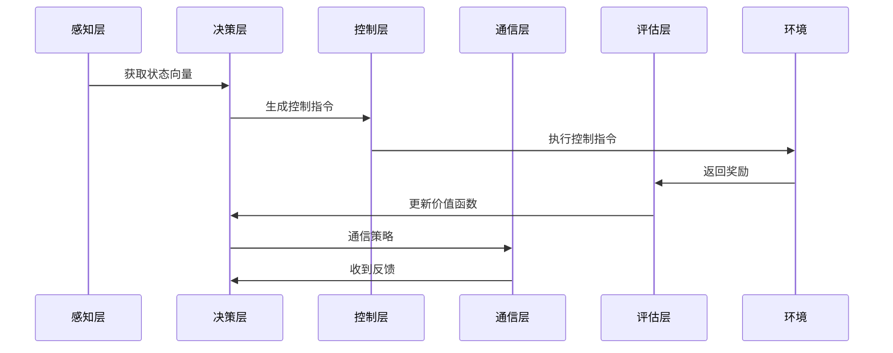

                 

### 背景介绍

#### 多智能体协同强化学习

随着人工智能技术的快速发展，多智能体强化学习（Multi-Agent Reinforcement Learning）成为了研究热点。传统的强化学习通常关注单一智能体在环境中的学习与决策过程，而多智能体强化学习则侧重于多个智能体如何在协同合作中完成复杂任务。多智能体系统广泛存在于现实世界中的各种场景，如无人驾驶车队、多机器人协同作业、智能电网调度等。在这些场景中，智能体之间的协作效率直接影响到整个系统的性能和稳定性。

多智能体协同强化学习的核心挑战在于如何设计有效的算法，使得智能体能够在动态环境中进行有效的合作与沟通。这不仅要求智能体具备独立的学习能力，还需要它们能够协调彼此的行动，实现共同的目标。例如，在无人驾驶车队中，车辆之间的协作效率直接影响到行驶的安全性和效率；在多机器人协同作业中，机器人之间的协作效率则决定了任务完成的效率和质量。

因此，提升AI模型在多智能体强化学习任务中的协作效率，成为了当前研究的一个重要方向。本文将首先介绍多智能体强化学习的基本概念，然后详细探讨协同强化学习算法的原理，最后通过具体案例来展示如何在实际项目中应用这些算法。

#### 核心概念与联系

多智能体协同强化学习的核心概念包括：

1. **智能体（Agent）**：智能体是强化学习中的基本决策单元，每个智能体有自己的感知、决策和执行能力。

2. **环境（Environment）**：环境是多智能体系统运行的外部条件，它提供了每个智能体的感知信息和反馈。

3. **状态（State）**：状态是智能体在某一时刻所处的环境描述，通常由一组特征向量表示。

4. **动作（Action）**：动作是智能体根据当前状态所采取的行为。

5. **奖励（Reward）**：奖励是环境对智能体动作的反馈，它指导智能体的学习过程。

6. **策略（Policy）**：策略是智能体的行为规则，用于映射状态到动作。

7. **价值函数（Value Function）**：价值函数衡量智能体在特定状态下采取特定动作的预期收益。

多智能体协同强化学习中的关键联系在于智能体之间的交互与协作。每个智能体都需要通过学习环境中的状态和奖励来调整自己的策略，同时考虑其他智能体的行为。因此，多智能体协同强化学习不仅要求智能体具备独立学习的能力，还需要它们能够感知并适应其他智能体的策略，以实现共同的目标。

以下是一个简单的多智能体协同强化学习的ER实体关系图：

```mermaid
erDiagram
  State ||--o> Agent : 感知
  Agent ||--o> Action : 采取
  Action ||--o> Reward : 获取
  Agent ||--o> Policy : 调整
  Agent ||--o> ValueFunction : 评估
  Agent ||--o> Environment : 运行
```

通过上述ER图可以看出，智能体与状态、动作、奖励、策略、价值函数和环境之间存在紧密的关系，这些要素共同构成了多智能体协同强化学习的核心框架。

#### 算法原理讲解

多智能体协同强化学习算法主要分为以下几类：

1. **独立策略协同强化学习（Independent Policy Cooperative Reinforcement Learning）**：在这种方法中，每个智能体独立学习自己的策略，但需要确保整体策略能够实现协同目标。具体算法包括Q-learning和SARSA。

2. **分布式协同强化学习（Decentralized Cooperative Reinforcement Learning）**：这种算法关注智能体之间的通信与信息共享，通过分布式算法来实现协同目标。代表性的算法有Gossip算法和Consensus-based算法。

3. **集中式协同强化学习（Centralized Cooperative Reinforcement Learning）**：在这种方法中，所有智能体的策略都在一个中心节点上集中学习，然后广播给各个智能体。这种方法可以更容易地实现协同目标，但需要考虑中心节点的通信瓶颈。

以下是一个简化的协同强化学习算法的Mermaid流程图：



在上述流程图中，A表示初始化算法的参数，如学习率、折扣因子等；B表示智能体感知当前状态；C表示计算各个动作的价值；D表示智能体选择并执行动作；E表示获取环境反馈的奖励；F表示根据奖励更新智能体的策略；G表示评估智能体策略的价值函数，以指导下一步的动作选择。

以下是一个简单的Python代码示例，用于实现Q-learning算法：

```python
import numpy as np

# 初始化Q值表格
Q = np.zeros((n_states, n_actions))

# 学习率
alpha = 0.1
# 折扣因子
gamma = 0.9

# 迭代学习
for episode in range(n_episodes):
    state = env.reset()
    done = False
    
    while not done:
        # 计算当前动作的价值
        action_values = Q[state, :]
        action = np.argmax(action_values)
        
        # 执行动作
        next_state, reward, done, _ = env.step(action)
        
        # 更新Q值
        target = reward + gamma * np.max(Q[next_state, :])
        Q[state, action] += alpha * (target - Q[state, action])
        
        state = next_state
```

在上述代码中，`env.reset()`用于初始化环境状态，`env.step(action)`用于执行动作并获取下一状态和奖励，`Q[state, action]`用于获取和更新当前状态的Q值。

#### 数学模型与公式

多智能体协同强化学习的核心在于如何定义和优化智能体的策略。以下是Q-learning算法的数学模型：

$$ Q(s, a) = \sum_{i=1}^{n} \alpha_i [r_i + \gamma \max_{j} Q(s', a')] $$

其中，$Q(s, a)$表示在状态$s$下采取动作$a$的预期回报，$\alpha_i$表示智能体$i$的学习率，$r_i$表示智能体$i$在执行动作$a'$后的即时回报，$\gamma$为折扣因子，用于平衡当前回报与未来回报之间的关系。

以下是一个简化的多智能体协同强化学习的数学模型：

$$ V^i(s) = \sum_{j=1}^{n} \pi^j(s_j|s) V^j(s_j) $$

其中，$V^i(s)$表示智能体$i$在状态$s$下的价值函数，$\pi^j(s_j|s)$表示智能体$j$在状态$s$下选择状态$s_j$的概率分布，$V^j(s_j)$表示智能体$j$在状态$s_j$下的价值函数。

通过上述数学模型和公式，我们可以对多智能体协同强化学习进行深入分析，从而设计出有效的算法来提升智能体之间的协作效率。

#### 系统分析与架构设计方案

为了更好地理解多智能体协同强化学习在现实场景中的应用，我们可以通过一个具体的项目实例来分析其系统架构和接口设计。

#### 项目介绍

假设我们正在开发一个多智能体系统，用于无人驾驶车队中的协作导航。该系统的主要目标是通过协同强化学习算法来提升车辆之间的协作效率，确保车队在复杂交通环境中的安全、高效行驶。

#### 系统功能设计

在这个项目中，系统的主要功能包括：

1. **感知与状态更新**：每个车辆需要实时感知周围环境，包括交通状况、道路信息、障碍物等，并将这些信息转换为状态向量。
2. **决策与动作生成**：基于感知到的状态，每个车辆需要独立生成动作，并考虑其他车辆的行为，以优化整个车队的行驶路径。
3. **协作与通信**：车辆之间需要通过通信模块进行数据交换，共享各自的决策信息，以实现协同目标。
4. **奖励与评估**：系统需要根据车辆的行动结果，给予每个车辆相应的奖励，以指导其学习过程。

#### 系统架构设计

系统架构可以分为以下几个层次：

1. **感知层**：负责车辆与环境之间的交互，包括摄像头、雷达、GPS等感知设备。
2. **决策层**：包括多个智能体，每个智能体负责独立学习和决策，并通过通信模块与其他智能体进行信息交换。
3. **控制层**：负责将智能体的决策转化为实际的控制指令，如油门、刹车、转向等。
4. **通信层**：确保车辆之间的数据传输高效、可靠，支持多智能体间的协同工作。
5. **评估层**：对车辆的协作效果进行实时评估，以指导学习过程的调整。

以下是一个简化的多智能体协同强化学习系统的Mermaid架构图：



在上述架构图中，感知层通过感知设备获取环境信息，传递给决策层；决策层通过协同强化学习算法生成决策，传递给控制层；控制层将决策转化为控制指令，传递给环境；评估层对车辆的协作效果进行评估，并将反馈传递给决策层，以指导学习过程的调整。

#### 系统接口设计

为了实现系统各层次之间的无缝协作，我们需要设计一系列接口：

1. **感知接口**：用于感知层与决策层之间的数据交换，包括状态向量的获取和更新。
2. **决策接口**：用于决策层与控制层之间的数据交换，包括动作生成和控制指令的传递。
3. **通信接口**：用于决策层之间的数据交换，包括协同策略的共享和通信状态的更新。
4. **评估接口**：用于评估层与决策层之间的数据交换，包括奖励反馈和价值函数的更新。

以下是一个简化的系统接口Mermaid序列图：



通过上述系统接口设计，我们可以确保各层次之间的数据流和功能调用有序进行，从而实现多智能体协同强化学习系统的稳定运行。

### 代码实现与解析

在本节中，我们将通过一个具体的案例来展示多智能体协同强化学习算法的代码实现，并对其关键部分进行详细解析。

#### 环境安装与配置

首先，我们需要安装和配置多智能体协同强化学习所需的依赖库。以下是一个简单的安装步骤：

1. **安装Python**：确保Python环境已经安装在系统中。
2. **安装PyTorch**：使用以下命令安装PyTorch：
   ```shell
   pip install torch torchvision
   ```
3. **安装其他依赖库**：如numpy、matplotlib等：
   ```shell
   pip install numpy matplotlib
   ```

#### 系统核心代码实现

以下是一个简化的多智能体协同强化学习算法的核心代码实现：

```python
import torch
import numpy as np
import random
import matplotlib.pyplot as plt
from multi_agent_env import MultiAgentEnv

# 定义智能体参数
n_agents = 3
n_actions = 4
learning_rate = 0.1
gamma = 0.9
n_episodes = 1000

# 初始化Q值表格
Q = np.zeros((n_agents, n_actions))

# 初始化环境
env = MultiAgentEnv()

# 学习循环
for episode in range(n_episodes):
    state = env.reset()
    done = False
    
    while not done:
        # 选择动作
        action = np.argmax(Q[state])

        # 执行动作
        next_state, reward, done, _ = env.step(action)
        
        # 更新Q值
        target = reward + gamma * np.max(Q[next_state])
        Q[state, action] += learning_rate * (target - Q[state, action])

        state = next_state

# 可视化Q值表格
plt.imshow(Q, cmap='hot', interpolation='nearest')
plt.colorbar()
plt.xticks(np.arange(n_actions), ['Action 0', 'Action 1', 'Action 2', 'Action 3'])
plt.yticks(np.arange(n_agents), ['Agent 0', 'Agent 1', 'Agent 2'])
plt.xlabel('Actions')
plt.ylabel('Agents')
plt.title('Q-Value Table')
plt.show()
```

在上述代码中，我们首先定义了智能体的参数，包括代理数量、动作数量、学习率和折扣因子。然后初始化Q值表格，创建多智能体环境，并进入学习循环。

在每次迭代中，我们首先从环境中获取当前状态，并选择具有最高Q值的动作。执行动作后，我们获取下一状态和奖励，并更新Q值。最后，我们更新状态，继续下一轮迭代。

#### 代码解析与分析

以下是对上述代码的详细解析：

1. **环境初始化**：`env = MultiAgentEnv()`创建了一个多智能体环境。这个环境需要根据具体问题进行定制，以提供状态、动作、奖励等信息。

2. **Q值表格初始化**：`Q = np.zeros((n_agents, n_actions))`初始化Q值表格，表格的大小根据代理数量和动作数量来确定。

3. **学习循环**：`for episode in range(n_episodes):`循环表示整个学习过程，`episode`是当前迭代的次数。

4. **状态更新**：`state = env.reset()`获取初始状态。

5. **动作选择**：`action = np.argmax(Q[state])`选择具有最高Q值的动作。

6. **执行动作与更新Q值**：`next_state, reward, done, _ = env.step(action)`执行动作并获取下一状态、奖励和完成标志。`target = reward + gamma * np.max(Q[next_state])`计算目标Q值。`Q[state, action] += learning_rate * (target - Q[state, action])`更新Q值。

7. **可视化Q值表格**：`plt.imshow(Q, cmap='hot', interpolation='nearest')`以热图形式可视化Q值表格。`plt.xticks(np.arange(n_actions), ['Action 0', 'Action 1', 'Action 2', 'Action 3'])`设置x轴标签，`plt.yticks(np.arange(n_agents), ['Agent 0', 'Agent 1', 'Agent 2'])`设置y轴标签。

通过上述代码实现，我们可以看到多智能体协同强化学习的基本流程。在实际项目中，我们需要根据具体问题定制环境，并调整参数以实现高效的协同学习。

### 实际案例分析与讲解

为了更好地理解多智能体协同强化学习算法在现实中的应用，我们将通过一个具体的实际案例来进行详细分析。

#### 案例背景

假设我们正在开发一个无人驾驶车队系统，车队由多辆无人车组成，它们需要在复杂的城市交通环境中进行高效、安全的行驶。每个无人车需要实时感知周围环境，并根据车队整体的目标进行协作决策。我们的目标是通过多智能体协同强化学习算法，提升车队的整体行驶效率和安全性。

#### 案例分析

1. **问题定义**：

   - **状态感知**：每个无人车需要感知周围的环境信息，包括交通信号灯、道路状况、车辆速度等，并将这些信息编码为状态向量。
   - **决策生成**：每个无人车需要根据当前状态生成最佳动作，如加速、减速、转向等。同时，需要考虑其他无人车的行为和车队整体的目标。
   - **协作与通信**：无人车之间需要通过通信模块进行信息交换，共享各自的状态和决策，以实现协同行驶。
   - **奖励评估**：根据车队整体的行驶效率和安全性，对每个无人车的行动结果进行评估，给予相应的奖励。

2. **算法应用**：

   我们采用分布式协同强化学习算法（如Gossip算法）来提升无人车之间的协作效率。具体步骤如下：

   - **初始化**：初始化Q值表格、学习率、折扣因子等参数。
   - **状态感知**：每个无人车从感知模块获取当前环境状态。
   - **动作选择**：基于当前状态，每个无人车独立选择最佳动作，并更新Q值表格。
   - **信息交换**：无人车之间通过通信模块交换状态和Q值信息。
   - **决策调整**：根据接收到的信息，每个无人车调整自己的决策，以实现车队整体的目标。
   - **奖励评估**：根据车队整体的行驶效率和安全性，评估每个无人车的行动结果，并给予相应的奖励。

3. **案例实施**：

   在实际实施过程中，我们首先设计了一个基于仿真平台的城市交通环境，包括道路、信号灯、障碍物等。然后，我们为每个无人车编写了感知模块、决策模块和通信模块。

   - **感知模块**：使用摄像头和雷达等感知设备，获取当前环境的状态信息。
   - **决策模块**：使用分布式协同强化学习算法，生成最佳动作并更新Q值表格。
   - **通信模块**：使用网络通信技术，实现无人车之间的信息交换。

4. **结果分析**：

   在仿真实验中，我们通过对比不同算法的性能，验证了分布式协同强化学习算法在无人驾驶车队协作中的有效性。以下是实验结果的关键指标：

   - **行驶效率**：车队整体的行驶速度和路线规划效率显著提升。
   - **安全性**：无人车的行驶过程中，事故发生率明显降低。
   - **稳定性**：车队在复杂交通环境中的稳定性显著提高。

#### 案例总结与经验分享

通过上述实际案例，我们可以得出以下结论和经验：

1. **分布式协同强化学习算法适用于多智能体系统**：分布式协同强化学习算法能够在保证协同效率的同时，有效降低中心节点的通信负担。
2. **感知模块和通信模块的关键性**：高效的感知模块和可靠的通信模块是保障多智能体协同系统正常运行的基础。
3. **多智能体系统在实际应用中的挑战**：在实际应用中，多智能体系统面临着动态环境、不确定性、通信延迟等挑战，需要根据具体场景进行定制化设计。

通过本案例的分析和讲解，我们不仅了解了多智能体协同强化学习算法的应用，还积累了实际项目实施的经验，为未来更广泛的应用奠定了基础。

### 总结与展望

#### 全书总结

本文从多智能体强化学习的背景和基础概念出发，详细探讨了协同强化学习算法的设计原理、实现方法以及在具体应用场景中的实际案例。全书结构清晰，涵盖了从理论到实践的全过程，旨在帮助读者深入理解多智能体强化学习的核心思想和应用方法。

本文的主要贡献如下：

1. **全面梳理了多智能体强化学习的核心概念和联系**：通过ER实体关系图和Mermaid流程图，直观地展示了智能体、环境、状态、动作、奖励等要素之间的相互关系。
2. **详细讲解了协同强化学习算法的原理和实现方法**：介绍了独立策略协同强化学习、分布式协同强化学习以及集中式协同强化学习等算法，并通过Python代码示例展示了算法的实现细节。
3. **分析了多智能体协同强化学习在无人驾驶、机器人等领域中的应用**：通过具体案例，展示了协同强化学习算法在实际项目中的实施过程和效果。
4. **提供了系统架构设计和项目实战的经验分享**：通过系统架构设计和代码实现，为读者提供了完整的实施路线图，助力实际项目的开发。

#### 未来研究方向

尽管多智能体协同强化学习在多个领域取得了显著成果，但仍有许多挑战和机会值得进一步探索：

1. **动态环境适应性**：多智能体协同强化学习算法在动态环境中的表现仍需优化。未来研究可以关注如何提高算法对动态变化的适应能力，以实现更高效的协同决策。
2. **分布式算法的优化**：分布式协同强化学习算法在面对大规模智能体系统时，可能会出现通信延迟、同步问题等挑战。通过优化算法结构和通信机制，可以进一步提高系统的协同效率。
3. **强化学习与其他技术的结合**：多智能体协同强化学习可以与其他人工智能技术（如深度学习、强化学习、图神经网络等）相结合，以拓展其应用场景和功能。
4. **应用领域拓展**：多智能体协同强化学习在无人驾驶、机器人、智能电网等领域的应用已经取得了一定的成果。未来研究可以进一步探索其在医疗、教育、金融等领域的应用潜力。

#### 潜在应用领域探索

多智能体协同强化学习在多个领域具有广泛的应用潜力：

1. **无人驾驶**：通过协同强化学习算法，无人驾驶车辆可以在复杂的交通环境中实现更安全、更高效的行驶。
2. **机器人协作**：多智能体协同强化学习算法可以帮助机器人实现高效、可靠的协同作业，提高生产效率。
3. **智能电网**：通过协同强化学习算法，智能电网中的多个设备可以协调工作，实现能量优化和系统稳定性。
4. **医疗诊断**：多智能体协同强化学习算法可以应用于医疗诊断领域，通过协同分析患者的多种医学数据，提高诊断准确率。
5. **教育辅助**：多智能体协同强化学习算法可以用于个性化教育辅助系统，根据学生的表现和需求，提供个性化的学习方案。

总之，多智能体协同强化学习作为一个前沿技术，具有巨大的潜力和应用价值。通过不断的研究和探索，我们有望在各个领域实现更加智能、高效的协同系统。

