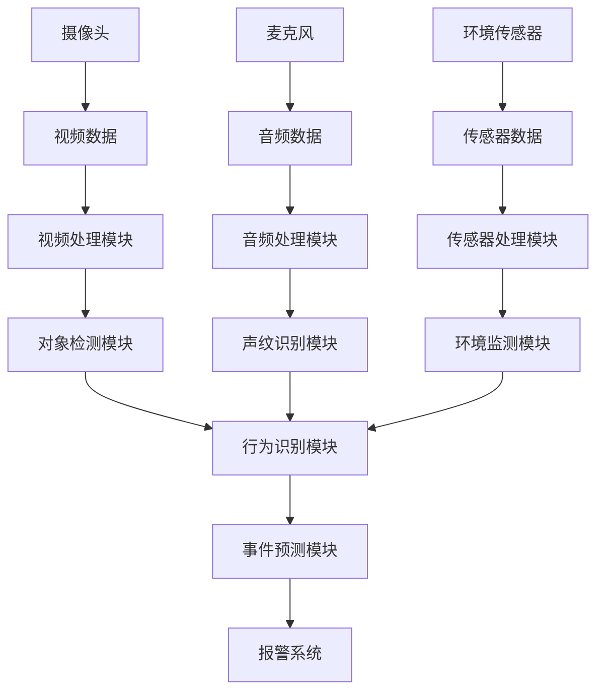
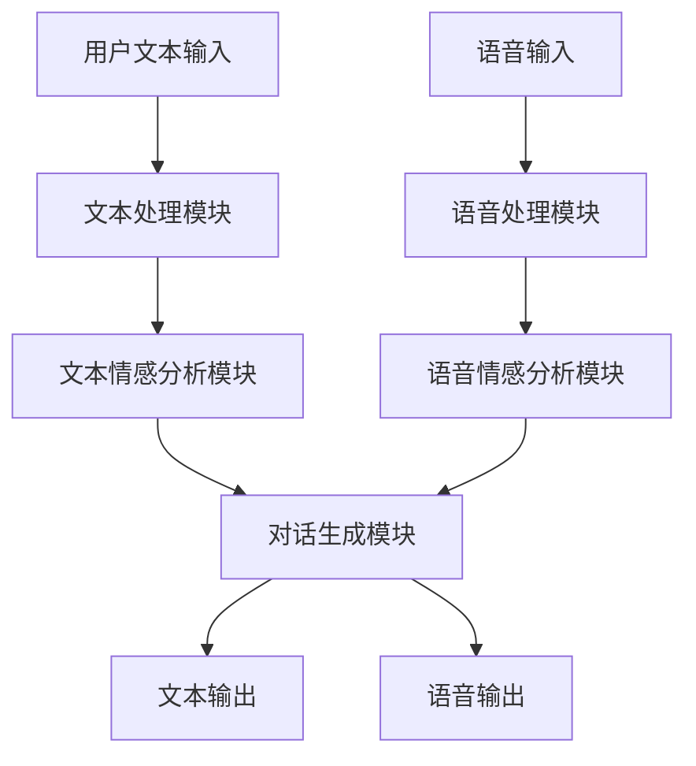

                 

### 关键词

- 多模态场景理解
- 因果推理
- AI模型
- 深度学习
- 多任务学习

### 摘要

本文旨在探讨如何提升人工智能模型在多模态场景理解任务中的因果推理能力。通过介绍多模态数据的处理方法、因果推理的基础知识以及二者结合的应用场景，本文详细分析了提升因果推理能力的策略和实现方法。同时，通过具体的应用案例和优化实践，展示了理论在实际项目中的有效应用，为多模态AI模型的发展提供了新的思路和方向。

---

## 引言

### 1.1 问题背景

在人工智能（AI）迅速发展的今天，多模态场景理解任务成为了研究的热点之一。多模态场景理解任务指的是模型能够同时处理和整合来自不同模态的数据（如文本、图像、音频等），从而对复杂场景进行更全面和准确的理解。这种任务在智能监控、自然语言处理、虚拟现实等领域具有广泛的应用前景。

然而，随着数据源的增加和数据类型的多样化，多模态场景理解任务也面临诸多挑战。其中一个关键问题是如何提高AI模型在多模态场景中的因果推理能力。因果推理是AI模型从已知的数据中推断出因果关系的能力，这在多模态场景中尤为重要，因为不同模态的数据往往蕴含着不同的信息，如何将这些信息有机地结合起来进行因果推断是一个巨大的挑战。

本文旨在解决这一问题，通过以下几部分内容，详细探讨如何提升AI模型在多模态场景理解任务中的因果推理能力：

1. **多模态数据的处理与理解**：介绍多模态数据的来源、融合方法和场景理解任务。
2. **因果推理基础**：讲解因果推理的基本概念、传统方法以及与深度学习的结合。
3. **多模态场景理解与因果推理的结合**：探讨结合的必要性和具体方法。
4. **多模态因果推理模型的应用**：分析应用场景和实际案例。
5. **实现与优化**：阐述模型实现的步骤和性能优化的策略。
6. **总结与展望**：总结文章的重要观点，展望未来研究方向。

### 1.2 背景与目标

多模态场景理解任务之所以重要，是因为它可以极大地提升AI模型对复杂场景的理解能力。例如，在智能监控领域，通过融合视频图像和音频数据，可以更准确地识别和预测事件；在自然语言处理领域，结合文本和图像数据可以提升情感分析和对话系统的质量。

然而，现有的多模态AI模型在因果推理方面存在一定的局限性。因果推理能力不足，导致模型在面对复杂任务时难以捕捉到深层次的关系，进而影响其性能和应用效果。因此，本文的目标是研究并实现提升AI模型在多模态场景理解任务中的因果推理能力，具体包括：

- **提升模型对多模态数据的融合能力**：通过介绍多种数据融合方法，提高模型对多模态数据的处理效率。
- **加强因果推理的算法设计**：结合深度学习和传统因果推理方法，设计有效的因果推理算法。
- **优化模型解释性和泛化能力**：通过性能优化手段，提升模型的解释性和泛化能力，确保其在实际应用中的有效性。

### 1.3 目录大纲概述

本文的结构如下：

1. **第1章 引言**：介绍多模态场景理解任务和因果推理能力的重要性，阐述本文的目标和结构。
2. **第2章 多模态数据的处理与理解**：详细探讨多模态数据的来源、融合方法和场景理解任务。
3. **第3章 因果推理基础**：讲解因果推理的基本概念、传统方法以及与深度学习的结合。
4. **第4章 多模态场景理解与因果推理的结合**：探讨结合的必要性和具体方法。
5. **第5章 多模态因果推理模型的应用**：分析应用场景和实际案例。
6. **第6章 实现与优化**：阐述模型实现的步骤和性能优化的策略。
7. **第7章 总结与展望**：总结文章的重要观点，展望未来研究方向。

通过以上章节的逐步讲解，本文将为读者提供系统、全面的多模态场景理解与因果推理的解决方案。

---

### 1.1.1 多模态场景理解任务的兴起

多模态场景理解任务是指人工智能系统能够同时处理和分析来自不同模态的数据（如文本、图像、音频、视频等），并从中提取有用信息，以实现对复杂场景的深入理解。这一任务的重要性不言而喻，因为它能显著提升人工智能系统的智能水平，使其在多个实际应用场景中表现出更高的准确性和鲁棒性。

#### 多模态数据的定义和重要性

多模态数据指的是由多个不同来源的数据集合而成，如文本、图像、音频、视频等。这些数据在信息表达上具有互补性，单一的模态数据往往难以捕捉到复杂场景中的全部信息。例如，在视频监控中，仅依靠视频图像难以准确识别出某一特定行为或事件，但如果结合音频数据进行综合分析，则可以更有效地进行事件检测和异常行为识别。

多模态数据的重要性主要体现在以下几个方面：

1. **信息丰富性**：多模态数据提供了更丰富的信息来源，能够从不同角度对场景进行描述，有助于提高模型的认知能力。
2. **准确性**：通过多模态数据的融合，可以减少单一模态数据带来的误差和不确定性，提高模型的准确性和可靠性。
3. **泛化能力**：多模态数据的学习有助于模型在不同环境和条件下表现稳定，增强其泛化能力。

#### 场景理解任务的定义和挑战

场景理解任务是指人工智能系统能够根据输入的多模态数据，对现实世界中的具体场景进行识别、理解和解释。这一任务涉及多个层次，包括特征提取、模式识别、事件检测、行为预测等。

具体来说，场景理解任务包括以下几类：

1. **目标检测与识别**：在图像或视频中识别特定目标并分类。
2. **事件检测与分类**：识别视频中的事件并分类，如交通违规行为、紧急情况等。
3. **交互式场景理解**：理解人与人、人与环境的交互，如虚拟现实中的角色交互、智能聊天机器人等。

尽管多模态场景理解任务具有巨大的应用潜力，但同时也面临诸多挑战：

1. **数据复杂性**：多模态数据类型繁多，数据量大，处理过程复杂。
2. **数据不平衡**：不同模态的数据可能在数量和质量上存在显著差异，导致模型训练过程中出现数据不平衡问题。
3. **数据同步性**：不同模态的数据在采集和处理过程中可能存在时间戳偏差，影响数据融合效果。
4. **模型解释性**：多模态场景理解模型往往较为复杂，难以解释模型的决策过程，影响模型的可解释性和透明度。

#### 1.1.2 因果推理在AI中的应用

因果推理是人工智能领域的一个重要研究方向，它旨在通过分析数据中的因果关系，对现实世界进行更深入的理解和预测。因果推理在AI中的应用非常广泛，特别是在多模态场景理解任务中，它能够帮助模型更好地捕捉和处理复杂场景中的因果关系。

#### 因果推理的定义

因果推理是一种基于数据的推理方法，通过分析数据中变量之间的关系，推断出变量之间的因果关系。在人工智能中，因果推理通常涉及以下几个关键步骤：

1. **识别相关变量**：通过分析数据，识别出与目标变量相关的其他变量。
2. **建立假设**：根据相关变量之间的关系，提出可能的因果关系假设。
3. **验证假设**：通过实验或数据分析方法，验证因果关系假设的正确性。

#### 因果推理在多模态场景中的必要性

在多模态场景中，不同模态的数据往往蕴含着不同的信息，通过因果推理，可以有效地将这些信息融合起来，提高模型对复杂场景的理解能力。因果推理在多模态场景中的必要性体现在以下几个方面：

1. **提高模型解释性**：因果推理可以帮助模型明确不同模态数据之间的关系，提高模型的透明度和可解释性。
2. **减少过拟合风险**：因果推理能够帮助模型从数据中提取真正的因果关系，减少过拟合现象，提高模型的泛化能力。
3. **增强任务适应性**：在多模态场景中，因果推理能够使模型在不同任务和应用场景中表现出更好的适应性。

#### 1.1.3 背景与目标

本文的背景是基于多模态场景理解任务在现实应用中的重要性和挑战，以及因果推理在AI中的关键作用。通过本文的研究，我们希望能够提出一套有效的提升AI模型在多模态场景理解任务中因果推理能力的方法和策略。

具体目标如下：

1. **多模态数据的融合**：提出高效的多模态数据融合方法，提高模型对多模态数据的处理效率。
2. **因果推理算法设计**：结合深度学习和传统因果推理方法，设计出有效的因果推理算法，提升模型在多模态场景中的推理能力。
3. **模型解释性和泛化能力优化**：通过性能优化手段，提升模型的解释性和泛化能力，确保其在实际应用中的有效性。

通过实现这些目标，本文希望为多模态AI模型的发展提供新的思路和方向，推动多模态场景理解任务的进一步发展。

### 1.2 目录大纲概述

为了帮助读者更好地理解和掌握本文的内容，下面我们将对整本书的目录进行概述，详细列出各个章节的主题和内容。

#### 第1章 引言

- 1.1 问题背景
  - 多模态场景理解任务的兴起
  - 因果推理在AI中的应用
  - 背景与目标
- 1.2 目录大纲概述

#### 第2章 多模态数据的处理与理解

- 2.1 多模态数据的基本概念
  - 多模态数据的来源
  - 多模态数据的融合方法
- 2.2 多模态场景理解任务
  - 场景理解任务的定义
  - 多模态场景理解的应用

#### 第3章 因果推理基础

- 3.1 因果推理的基本概念
  - 因果关系的定义
  - 因果推理的挑战
- 3.2 因果推理模型
  - 传统因果推理方法
  - 深度学习与因果推理

#### 第4章 多模态场景理解与因果推理的结合

- 4.1 结合的必要性
  - 多模态数据的特点
  - 因果推理在多模态场景中的作用
- 4.2 结合方法
  - 数据级融合
  - 模型级融合

#### 第5章 多模态因果推理模型的应用

- 5.1 应用场景分析
  - 智能监控
  - 自然语言处理
- 5.2 应用案例
  - 案例一：智能监控系统的因果推理
  - 案例二：对话系统的因果推理

#### 第6章 实现与优化

- 6.1 实现步骤
  - 数据准备
  - 模型选择与训练
- 6.2 性能优化
  - 模型解释性优化
  - 模型泛化能力优化

#### 第7章 总结与展望

- 7.1 总结
  - 重要的观点
  - 成果总结
- 7.2 展望
  - 未来研究方向
  - 技术发展趋势

通过以上章节的详细讲解，本文旨在系统地阐述多模态场景理解任务中的因果推理能力提升方法，为相关领域的研究和应用提供有价值的参考。

### 2.1 多模态数据的处理与理解

#### 2.1.1 多模态数据的来源

多模态数据来源于多个不同的感官输入，这些输入可以包括文本、图像、音频、视频以及传感器数据等。每个模态都有其独特的特点和信息表达方式：

- **文本**：文本数据包括自然语言文本、标注信息等，是知识表示和推理的重要基础。文本数据通常具有结构化特征，可以通过自然语言处理（NLP）技术进行解析和语义理解。
- **图像**：图像数据包括静态图片和动态视频，它们包含了丰富的视觉信息，如颜色、纹理、形状等。图像数据通常需要通过计算机视觉算法进行特征提取和对象识别。
- **音频**：音频数据包括语音、音乐和环境声音等，它们包含了丰富的声学信息。音频数据可以通过声学模型和语音识别技术进行解析。
- **视频**：视频数据是动态的图像序列，包含了时间和空间信息。视频数据可以通过视频编码和视频分析技术进行处理。
- **传感器数据**：传感器数据包括来自各种传感器的物理量测量值，如温度、湿度、加速度等。这些数据可以提供关于环境状态的信息。

每种数据源都有其独特的作用，通过整合这些数据，可以形成对场景的全面理解。例如，在智能监控系统中，视频数据可以用于行为识别，音频数据可以用于声音分析，传感器数据可以用于环境监控。通过多模态数据的融合，可以提供更丰富的信息和更高的准确性，从而提升AI模型的性能。

#### 2.1.2 多模态数据的融合方法

多模态数据的融合是场景理解任务中的一个关键环节，其主要目标是综合利用不同模态的数据，以提高模型的整体性能。目前，多模态数据融合的方法主要分为两类：传统方法和深度学习方法。

1. **传统方法**

传统方法通常基于特征级和决策级的融合策略。在特征级融合中，各个模态的数据首先被转换成相应的特征向量，然后通过某种机制将这些特征向量结合成一个统一的特征表示。常见的特征级融合方法包括：

- **特征加权融合**：将不同模态的特征通过加权方式合并，加权系数可以通过统计方法或专家知识确定。
- **特征拼接**：将不同模态的特征向量直接拼接在一起，形成一个更长的特征向量，输入到统一的模型中进行训练。
- **特征融合网络**：设计专门的神经网络结构，如卷积神经网络（CNN）或循环神经网络（RNN），将不同模态的特征融合后再进行分类或回归。

在决策级融合中，各个模态的数据分别通过独立的模型进行处理，然后在不同层面对决策结果进行整合。常见的决策级融合方法包括：

- **投票机制**：各个模态的模型输出结果进行投票，多数通过的结果作为最终决策。
- **集成学习**：将多个独立模型的结果进行加权平均或基于模型误差进行优化，得到最终的预测结果。

2. **深度学习方法**

深度学习方法近年来在多模态数据融合中取得了显著的进展。深度学习模型能够自动学习多模态数据的复杂特征，并在数据融合过程中表现出强大的性能。以下是一些常见的深度学习融合方法：

- **多输入神经网络**：设计一个多输入神经网络，每个输入对应一种模态的数据，通过共享网络层结构实现数据融合。例如，多输入卷积神经网络（Multi-Input CNN）和多输入循环神经网络（Multi-Input RNN）。
- **联合训练**：将不同模态的数据联合输入到一个深度学习模型中，通过共享神经网络层来学习多模态特征。例如，使用多模态卷积神经网络（Multimodal CNN）或多模态循环神经网络（Multimodal RNN）。
- **多任务学习**：将多个相关任务整合到一个深度学习模型中，通过多任务学习机制实现数据融合。例如，在视频分类任务中，同时训练行为识别和背景识别任务，通过共享特征表示实现数据融合。

深度学习方法的优势在于其强大的特征提取和融合能力，能够自动发现多模态数据之间的关联性，从而提高模型的性能。然而，深度学习方法也面临一些挑战，如模型解释性、数据标注需求和计算资源消耗等。

通过结合传统方法和深度学习方法，可以设计出更高效的多模态数据融合策略，为多模态场景理解任务提供坚实的支持。接下来，我们将进一步探讨多模态场景理解任务的具体定义和实际应用。

#### 2.2.1 场景理解任务的定义

场景理解任务是指人工智能系统能够根据输入的多模态数据，对现实世界中的具体场景进行识别、理解和解释的过程。这种任务的核心在于从复杂的多模态数据中提取关键信息，并利用这些信息进行决策或生成有意义的输出。场景理解任务通常包括以下几个层次：

1. **特征提取**：从多模态数据中提取具有代表性的特征，如文本的词向量、图像的边缘特征、音频的频谱特征等。特征提取是场景理解任务的基础，决定了模型对数据的理解和处理能力。

2. **模式识别**：在提取到的特征基础上，利用机器学习算法（如分类器、聚类算法等）对场景中的对象、事件或行为进行识别和分类。模式识别的任务是判断输入数据是否符合预定的类别或模式。

3. **事件检测**：在视频或时间序列数据中检测特定的事件或行为，如交通违规、紧急情况、人机交互等。事件检测需要对时间序列数据进行连续的监控和分析，以识别出关键事件。

4. **行为预测**：基于历史数据和模式识别结果，预测未来可能发生的行为或事件。行为预测是场景理解的高级任务，能够为智能决策提供有力支持。

5. **上下文理解**：理解场景中的上下文信息，如时间、地点、人物关系等。上下文理解能够提高场景理解的准确性和完整性，为更复杂的决策提供支持。

不同的场景理解任务在不同的应用领域中具有特定的实现方式和挑战。例如，在智能监控领域，场景理解任务可能包括目标检测、行为识别、事件预测等；在自然语言处理领域，场景理解任务可能包括情感分析、问答系统、对话生成等。这些任务需要模型能够同时处理和融合来自不同模态的数据，以实现对复杂场景的深入理解。

#### 2.2.2 多模态场景理解的应用

多模态场景理解任务在实际应用中具有广泛的应用前景，尤其是在需要高度智能化和自动化的领域。以下是一些典型的应用场景：

1. **智能监控**：

智能监控系统通过视频图像、音频数据和传感器数据等多模态数据融合，实现对目标行为和事件的实时监控和分析。例如，在交通管理中，通过视频和传感器数据可以实时检测和识别交通违规行为，如闯红灯、违章停车等，提高交通管理的效率和安全性。

2. **自然语言处理**：

自然语言处理（NLP）领域中的多模态场景理解任务包括情感分析、对话系统等。例如，在情感分析中，结合文本和用户表情图像数据可以更准确地判断用户的情感状态；在对话系统中，结合文本和语音数据可以生成更自然的对话交互。

3. **虚拟现实与增强现实**：

在虚拟现实（VR）和增强现实（AR）领域，多模态场景理解任务包括场景识别、交互理解等。例如，通过结合位置传感器数据和用户动作数据，可以提供更沉浸式的虚拟体验；通过结合用户语音数据和文本数据，可以生成更智能的交互反馈。

4. **健康监测与辅助诊断**：

在健康监测与辅助诊断中，多模态场景理解任务包括患者行为识别、健康状态预测等。例如，通过结合穿戴设备的生理信号数据和视频数据，可以实时监测患者的健康状况，提高疾病诊断的准确性和及时性。

5. **智能推荐系统**：

在智能推荐系统中，多模态场景理解任务包括用户行为识别、偏好预测等。例如，通过结合用户浏览历史数据和购物行为数据，可以提供更个性化的商品推荐。

这些应用场景展示了多模态场景理解任务在各个领域的广泛应用潜力。通过有效地融合多模态数据，人工智能系统能够更准确地理解和解释复杂场景，从而提供更智能、更高效的解决方案。

### 3.1 因果推理的基本概念

#### 3.1.1 因果关系的定义

因果推理是人工智能领域中的一个核心问题，它涉及识别和分析变量之间的因果关系。在统计学和哲学中，因果关系通常被定义为一种因果关系链条，即某个变量（因）导致另一个变量（果）发生变化。这种关系不仅要求两个变量之间存在相关性，还要求存在时间上的前后关系和因果关系链条中的因果关系链条的唯一性。

具体来说，因果关系可以定义为：如果变量A的变化导致变量B的变化，并且这种变化不是由于其他任何未知变量C、D等的作用，那么我们称A是B的因果原因。在形式化定义中，因果关系可以用条件概率来表示。例如，假设有两个变量X和Y，如果P(Y|X)显著大于P(Y)，那么我们可以认为X是Y的因果原因。

在多模态场景理解任务中，因果关系的定义尤为重要。因为多模态数据往往包含多个变量，这些变量之间可能存在复杂的相互影响。因此，准确识别和理解这些变量之间的因果关系对于提升模型的性能和解释能力至关重要。

#### 3.1.2 因果推理的挑战

尽管因果推理在理论和应用中具有重要意义，但在实际操作中仍然面临诸多挑战：

1. **数据稀疏性**：在多模态场景中，由于数据来源的多样性，不同模态的数据量可能存在显著差异。这种数据稀疏性使得模型难以从数据中提取出有效的因果关系。
2. **确定性与随机性**：在因果推理中，变量之间的关系可能是确定的，也可能是随机的。确定性的因果关系相对容易处理，但随机性的因果关系则更为复杂，需要采用复杂的统计模型和算法来识别。
3. **多重因果关系**：在多模态数据中，不同变量之间可能存在多重因果关系，即多个变量相互影响。这种多重因果关系使得因果推理更加复杂，需要设计高效的算法来解析。
4. **数据同步性**：在多模态数据融合过程中，不同模态的数据可能在时间和空间上存在不一致性，这会影响因果关系的识别和建模。
5. **模型解释性**：在深度学习和复杂神经网络中，因果推理模型的解释性通常较弱，难以直观地理解模型的决策过程。这给模型的解释和信任带来了挑战。

为了解决上述挑战，研究者们提出了一系列的因果推理方法和算法，包括基于统计模型的因果推断方法、基于深度学习的因果推断方法等。这些方法在多模态场景理解任务中得到了广泛的应用和研究。

### 3.2 因果推理模型

#### 3.2.1 传统因果推理方法

传统因果推理方法主要包括Do-Calculus方法和因果Bayesian网络（CBN）方法。这些方法在多模态场景理解任务中具有广泛的应用。

1. **Do-Calculus方法**

Do-Calculus是一种基于概率论的方法，用于推理变量之间的因果关系。该方法的基本思想是通过干预（Do）某些变量，观察其他变量的条件概率变化，从而推断出变量之间的因果关系。具体步骤如下：

- **干预操作**：对目标变量进行干预，即将该变量设置为特定的值。
- **条件概率计算**：计算干预后其他变量的条件概率分布。
- **因果推断**：根据条件概率分布的变化，推断出变量之间的因果关系。

Do-Calculus方法的一个关键优势是其形式化定义清晰，计算过程可解释，因此在多模态场景理解任务中得到了广泛应用。然而，该方法在处理高维数据时计算复杂度较高，且对数据分布的假设较为严格。

2. **因果Bayesian网络（CBN）方法**

因果Bayesian网络是一种图形化的概率模型，用于表示变量之间的因果关系。CBN由一组节点和有向边组成，每个节点表示一个变量，有向边表示变量之间的因果关系。CBN的基本原理如下：

- **结构学习**：通过数据学习变量之间的因果关系结构，通常采用贪婪搜索或贝叶斯推理等方法。
- **参数学习**：在确定因果关系结构后，通过最大似然估计或贝叶斯估计等方法学习变量之间的概率参数。

CBN方法的一个显著优势是其能够直观地表示变量之间的因果关系，并具有良好的扩展性。然而，CBN方法在处理大规模数据和复杂关系时存在计算复杂度高和可解释性不足的问题。

#### 3.2.2 深度学习与因果推理

深度学习在多模态场景理解任务中取得了显著的成果，但其对因果推理的支持较弱。为了解决这一问题，研究者们提出了一系列结合深度学习和因果推理的方法。

1. **可信的深度学习模型**

可信的深度学习模型旨在提高模型的可解释性和因果推理能力。以下是一些常用的方法：

- **注意力机制**：通过注意力机制，模型可以明确关注到关键特征和关系，提高模型的解释性。
- **可解释的神经网络**：设计专门的可解释神经网络结构，如决策树、图神经网络等，以提高模型的透明度和可理解性。
- **模型验证**：通过模型验证方法（如反向传播、交叉验证等），验证模型的因果推理能力。

2. **因果图神经网络（CGN）**

因果图神经网络是一种结合深度学习和因果推理的方法，通过构建因果图结构，模型可以自动学习变量之间的因果关系。具体方法如下：

- **图结构构建**：通过学习或预先定义的方法，构建表示变量之间因果关系的图结构。
- **图神经网络**：利用图神经网络（如图卷积网络、图循环网络等），对图结构中的节点和边进行学习和建模。
- **因果推理**：通过图神经网络的学习结果，进行因果推理和预测。

因果图神经网络的优势在于其能够自动学习复杂的因果关系，并具有良好的可解释性。然而，其计算复杂度较高，且在处理大规模数据时存在一定的性能瓶颈。

通过结合传统因果推理方法和深度学习方法，可以设计出更加有效的多模态因果推理模型，提高AI模型在多模态场景理解任务中的性能和解释能力。

### 4.1 结合的必要性

#### 4.1.1 多模态数据的特点

多模态数据具有以下几个显著特点：

1. **信息互补性**：不同模态的数据源提供了关于同一场景的不同视角和信息，通过融合这些数据，可以更全面地理解和描述场景。
2. **多样性**：多模态数据可能包括文本、图像、音频、视频等多种形式，每种形式都蕴含着独特的信息特征。
3. **复杂性**：多模态数据的多样性和复杂性使得数据处理和分析变得极为复杂，单一模态的数据往往难以捕捉到场景中的所有关键信息。

这些特点决定了多模态数据在场景理解任务中的重要性。然而，单纯依赖单一模态的数据，模型容易受到数据噪声和不确定性的影响，导致理解的不完整和准确性下降。例如，在视频监控中，仅依靠视频图像可能难以准确识别复杂的行为；而在自然语言处理中，仅依靠文本数据可能无法准确捕捉用户的情感状态。因此，通过融合多模态数据，可以提高模型的准确性和鲁棒性。

#### 4.1.2 因果推理在多模态场景中的作用

因果推理在多模态场景中的作用主要体现在以下几个方面：

1. **提高模型的解释性**：因果推理可以帮助模型明确不同模态数据之间的关系，从而提高模型的透明度和可解释性。这对于提升用户对模型的信任和理解具有重要意义。
2. **减少过拟合风险**：因果推理能够帮助模型从数据中提取真正的因果关系，减少过拟合现象，提高模型的泛化能力。这在多模态场景中尤为重要，因为多模态数据可能存在数据不平衡和数据分布不一致的问题。
3. **增强模型的适应性**：因果推理能够使模型在不同任务和应用场景中表现出更好的适应性。例如，在智能监控中，通过因果推理可以更好地适应不同场景下的异常行为识别需求。

总之，因果推理在多模态场景理解任务中具有关键作用，能够显著提升模型的性能和解释能力。通过有效的因果推理方法，可以更好地利用多模态数据的互补性和多样性，实现更准确、更可靠的场景理解。

### 4.2.1 数据级融合

在多模态场景理解任务中，数据级融合是处理多模态数据的一种基本方法，其核心思想是将不同模态的数据进行特征提取后，再进行融合，生成一个统一的多模态特征表示。以下详细探讨数据级融合的方法和应用。

#### 特征提取

数据级融合的首要步骤是特征提取，即从原始的多模态数据中提取具有代表性的特征。以下是几种常用的特征提取方法：

1. **文本特征提取**：文本数据可以通过词袋模型（Bag of Words，BoW）或词嵌入模型（Word Embedding，如Word2Vec、GloVe）进行特征提取。词袋模型将文本表示为词汇的集合，而词嵌入模型则通过学习词汇的分布式表示，能够捕捉词汇的语义信息。
   
   ```python
   from gensim.models import Word2Vec
   
   # 加载文本数据
   sentences = [line.strip() for line in open('text_data.txt').readlines()]
   # 训练Word2Vec模型
   model = Word2Vec(sentences, vector_size=100, window=5, min_count=1, workers=4)
   # 获取文本特征
   text_features = [model.wv[line] for line in sentences]
   ```

2. **图像特征提取**：图像数据可以通过卷积神经网络（Convolutional Neural Network，CNN）进行特征提取。CNN能够自动学习图像的层次化特征表示，如边缘、纹理和对象等。

   ```python
   import tensorflow as tf
   from tensorflow.keras.applications import VGG16
   
   # 加载图像数据
   images = load_images('image_data')
   # 加载预训练的VGG16模型
   model = VGG16(weights='imagenet', include_top=False)
   # 提取图像特征
   image_features = [model.predict(image) for image in images]
   ```

3. **音频特征提取**：音频数据可以通过梅尔频率倒谱系数（Mel-Frequency Cepstral Coefficients，MFCC）进行特征提取，或者使用卷积神经网络进行更复杂的特征提取。

   ```python
   from python_speech_features import mfcc
   
   # 加载音频数据
   audio = load_audio('audio_data')
   # 计算MFCC特征
   mfcc_features = mfcc(audio, samplerate=44100, winlen=0.025, winstep=0.01, numcep=13, nfilt=26, nfft=2048)
   ```

4. **视频特征提取**：视频数据可以通过融合图像特征和时序特征进行特征提取。例如，可以分别提取视频序列中的每一帧图像特征，再结合时间信息，使用循环神经网络（Recurrent Neural Network，RNN）或长短期记忆网络（Long Short-Term Memory，LSTM）进行特征融合。

   ```python
   import tensorflow as tf
   from tensorflow.keras.models import Sequential
   from tensorflow.keras.layers import LSTM, Dense
   
   # 加载视频数据
   video_features = preprocess_video('video_data')
   # 构建LSTM模型
   model = Sequential([
       LSTM(128, input_shape=(None, video_features.shape[1], video_features.shape[2]), return_sequences=True),
       LSTM(64, return_sequences=False),
       Dense(1)
   ])
   # 训练模型
   model.compile(optimizer='adam', loss='mean_squared_error')
   model.fit(video_features, labels, epochs=10, batch_size=32)
   ```

#### 特征融合

在特征提取之后，不同模态的特征需要被融合成一个统一的多模态特征表示。以下是一些常用的特征融合方法：

1. **特征拼接**：将不同模态的特征向量直接拼接在一起，形成一个更长的特征向量。这种方法简单直观，但可能导致特征维度过高，增加计算复杂度。

   ```python
   # 假设text_features、image_features、audio_features和video_features分别是文本、图像、音频和视频特征
   combined_features = np.hstack((text_features, image_features, audio_features, video_features))
   ```

2. **特征加权融合**：通过给不同模态的特征分配不同的权重，加权后进行融合。权重的确定可以通过统计方法（如相关性分析）或专家知识进行。

   ```python
   # 假设weights是不同模态特征的权重
   combined_features = np.dot([text_features, image_features, audio_features, video_features], weights)
   ```

3. **神经网络融合**：利用神经网络结构（如多输入神经网络）进行特征融合。神经网络可以自动学习不同模态特征之间的非线性关系。

   ```python
   import tensorflow as tf
   from tensorflow.keras.layers import Input, Dense, Concatenate
   
   # 定义多输入神经网络
   text_input = Input(shape=text_features.shape[1:])
   image_input = Input(shape=image_features.shape[1:])
   audio_input = Input(shape=audio_features.shape[1:])
   video_input = Input(shape=video_features.shape[1:])
   
   # 特征融合
   combined = Concatenate()([text_input, image_input, audio_input, video_input])
   combined = Dense(128, activation='relu')(combined)
   output = Dense(1)(combined)
   
   # 编译模型
   model = Model(inputs=[text_input, image_input, audio_input, video_input], outputs=output)
   model.compile(optimizer='adam', loss='mean_squared_error')
   ```

通过数据级融合，多模态数据可以在特征层面实现有效整合，从而提升模型在多模态场景理解任务中的性能。接下来，我们将进一步探讨模型级融合的方法。

### 4.2.2 模型级融合

在多模态场景理解任务中，模型级融合是一种通过融合不同模态的模型预测结果来提高整体性能的方法。与数据级融合不同，模型级融合侧重于在模型层面整合来自不同模态的信息，而不是在特征层面。以下详细探讨模型级融合的方法和应用。

#### 多任务学习

多任务学习（Multi-Task Learning）是一种常见的模型级融合方法，其核心思想是同时训练多个相关任务，并通过共享模型参数来提高任务的共同性能。在多模态场景理解中，多任务学习可以通过以下方式实现：

1. **共享底层特征**：不同模态的模型共享底层特征提取网络，以利用多模态数据中的共同特征信息。这有助于提高模型对多模态数据的融合能力。

   ```python
   import tensorflow as tf
   from tensorflow.keras.layers import Input, Dense, Conv2D, LSTM
   
   # 定义文本输入和模型
   text_input = Input(shape=(text_sequence_length,))
   text_embedding = Embedding(vocabulary_size, embedding_dim)(text_input)
   text_model = LSTM(units=64, return_sequences=True)(text_embedding)
   
   # 定义图像输入和模型
   image_input = Input(shape=(height, width, channels))
   image_model = Conv2D(filters=32, kernel_size=(3, 3), activation='relu')(image_input)
   image_model = MaxPooling2D(pool_size=(2, 2))(image_model)
   
   # 定义音频输入和模型
   audio_input = Input(shape=(audio_sequence_length,))
   audio_embedding = Embedding(vocabulary_size, embedding_dim)(audio_input)
   audio_model = LSTM(units=64, return_sequences=True)(audio_embedding)
   
   # 多模态特征融合
   combined = Concatenate()([text_model, image_model, audio_model])
   combined = Dense(units=128, activation='relu')(combined)
   
   # 多任务输出
   text_output = Dense(units=1, activation='sigmoid')(combined)
   image_output = Dense(units=1, activation='sigmoid')(combined)
   audio_output = Dense(units=1, activation='sigmoid')(combined)
   
   # 构建多任务模型
   multi_task_model = Model(inputs=[text_input, image_input, audio_input], outputs=[text_output, image_output, audio_output])
   multi_task_model.compile(optimizer='adam', loss=['binary_crossentropy', 'binary_crossentropy', 'binary_crossentropy'])
   multi_task_model.fit([text_data, image_data, audio_data], [text_labels, image_labels, audio_labels], epochs=10, batch_size=32)
   ```

2. **共享高层次特征**：在多任务学习中，可以进一步通过共享高层次特征来提高性能。例如，将文本、图像和音频特征映射到同一个高维空间中，再进行任务分类。

   ```python
   # 高层次特征共享
   combined = Dense(units=128, activation='relu')(combined)
   shared_output = Dense(units=64, activation='relu')(combined)
   
   # 多任务输出
   text_output = Dense(units=1, activation='sigmoid')(shared_output)
   image_output = Dense(units=1, activation='sigmoid')(shared_output)
   audio_output = Dense(units=1, activation='sigmoid')(shared_output)
   
   # 构建多任务模型
   multi_task_model = Model(inputs=[text_input, image_input, audio_input], outputs=[text_output, image_output, audio_output])
   multi_task_model.compile(optimizer='adam', loss=['binary_crossentropy', 'binary_crossentropy', 'binary_crossentropy'])
   multi_task_model.fit([text_data, image_data, audio_data], [text_labels, image_labels, audio_labels], epochs=10, batch_size=32)
   ```

#### 因果图与深度学习模型的结合

因果图神经网络（Causal Graph Neural Networks，CGNN）是一种将因果推理与深度学习结合的方法，通过构建因果图来表示变量之间的因果关系，从而提高模型在多模态场景理解中的解释性和性能。以下是一个简单的因果图与深度学习模型结合的例子：

1. **构建因果图**：根据任务需求和数据特性，构建表示变量之间因果关系的因果图。例如，在视频监控任务中，可以构建一个包含视频图像、音频数据和传感器数据的因果图。

   ```mermaid
   graph TB
   A[视频图像] --> B[行为识别]
   B --> C[事件检测]
   C --> D[异常行为识别]
   E[音频数据] --> B
   F[传感器数据] --> B
   ```

2. **训练因果图神经网络**：使用因果图神经网络（CGNN）训练模型，通过学习因果图中的节点和边，自动提取多模态数据中的因果关系。

   ```python
   import tensorflow as tf
   from tensorflow.keras.layers import Input, Dense, CausalConv1D
   
   # 构建因果图神经网络
   video_input = Input(shape=(height, width, channels))
   audio_input = Input(shape=(audio_sequence_length,))
   sensor_input = Input(shape=(sensor_sequence_length,))
   
   # 视频特征提取
   video_model = CausalConv1D(filters=32, kernel_size=(3), activation='relu')(video_input)
   # 音频特征提取
   audio_model = CausalConv1D(filters=32, kernel_size=(3), activation='relu')(audio_input)
   # 传感器特征提取
   sensor_model = CausalConv1D(filters=32, kernel_size=(3), activation='relu')(sensor_input)
   
   # 多模态特征融合
   combined = Concatenate()([video_model, audio_model, sensor_model])
   combined = Dense(units=128, activation='relu')(combined)
   
   # 输出层
   output = Dense(units=1, activation='sigmoid')(combined)
   
   # 构建模型
   causal_model = Model(inputs=[video_input, audio_input, sensor_input], outputs=output)
   causal_model.compile(optimizer='adam', loss='binary_crossentropy')
   causal_model.fit([video_data, audio_data, sensor_data], labels, epochs=10, batch_size=32)
   ```

通过模型级融合，多模态模型可以在预测阶段整合来自不同模态的信息，从而提高模型的性能和解释能力。这种方法特别适用于需要高度集成不同模态数据的应用场景，如智能监控、自然语言处理和健康监测等。

### 5.1 应用场景分析

多模态因果推理模型在多个实际应用场景中具有显著的优势，以下将分析两个典型的应用场景：智能监控和自然语言处理。

#### 5.1.1 智能监控

智能监控系统是应用多模态因果推理模型的一个典型场景。智能监控系统通常需要处理来自视频、音频和传感器等多模态数据，以实现对场景的全面监控和实时分析。

1. **场景描述**

   智能监控系统中的多模态数据包括：

   - **视频数据**：用于捕捉场景中的图像和动作。
   - **音频数据**：用于捕捉场景中的声音和语音。
   - **传感器数据**：如温度、湿度、光照等，用于捕捉环境参数。

   通过多模态数据的融合，智能监控系统可以更准确地识别和预测场景中的事件，如异常行为、紧急情况等。

2. **模型设计**

   在智能监控系统中，多模态因果推理模型的设计需要考虑以下几个方面：

   - **多模态特征提取**：分别从视频、音频和传感器数据中提取具有代表性的特征，如视频中的对象检测特征、音频中的声纹特征、传感器中的环境参数特征。
   - **特征融合**：采用数据级融合和模型级融合的方法，将不同模态的特征进行融合，生成一个统一的多模态特征向量。
   - **因果推理**：通过因果图神经网络（CGNN）等方法，分析多模态数据中的因果关系，以提升模型的解释性和性能。
   - **事件预测**：利用融合后的特征和因果推理结果，进行事件预测和异常行为识别。

3. **实际案例**

   一个典型的实际案例是智能交通监控系统。在该系统中，通过融合视频图像、音频数据和传感器数据，可以实现对交通流量的实时监控和事件预测。例如，通过视频图像识别交通违规行为，通过音频识别喇叭声和碰撞声，通过传感器监测道路状况和车辆状态。这些多模态数据的融合和因果推理使得系统能够更准确地识别和预测交通事件，提高交通管理的效率和安全性。

#### 5.1.2 自然语言处理

自然语言处理（NLP）是另一个应用多模态因果推理模型的重要领域。在NLP中，文本、图像和音频等多模态数据的融合可以显著提升情感分析、问答系统、对话生成等任务的性能。

1. **场景描述**

   在自然语言处理中，多模态数据的融合可以用于以下几个方面：

   - **文本情感分析**：通过融合文本和图像数据，可以更准确地判断用户的情感状态。例如，文本中的情感表达可能与图像中的表情图像不一致，通过融合两种数据可以提供更全面的情感分析。
   - **问答系统**：通过融合文本和语音数据，可以生成更自然的对话交互。例如，用户可以通过文本提问，系统通过语音回答，同时结合图像和视频数据提供更直观的信息。
   - **对话生成**：通过融合文本和语音数据，可以生成更流畅、自然的对话。例如，文本聊天机器人可以通过语音合成技术生成语音回答，同时结合图像和视频数据提供更丰富的交互体验。

2. **模型设计**

   在自然语言处理中，多模态因果推理模型的设计需要考虑以下几个方面：

   - **文本特征提取**：使用词嵌入模型（如Word2Vec、GloVe）从文本数据中提取词向量。
   - **图像特征提取**：使用卷积神经网络（CNN）从图像数据中提取视觉特征。
   - **音频特征提取**：使用梅尔频率倒谱系数（MFCC）从音频数据中提取声学特征。
   - **特征融合**：采用数据级融合和模型级融合的方法，将不同模态的特征进行融合，生成一个统一的多模态特征向量。
   - **因果推理**：通过因果图神经网络（CGNN）等方法，分析多模态数据中的因果关系，以提升模型的解释性和性能。
   - **任务输出**：利用融合后的特征和因果推理结果，进行情感分析、问答生成、对话生成等任务。

3. **实际案例**

   一个典型的实际案例是情感分析系统。在该系统中，通过融合用户文本评论和表情图像数据，可以更准确地判断用户的情感状态。例如，用户在评论中表达的情感可能与评论下方的表情图像不一致，通过融合这两种数据可以提供更精确的情感分析结果。这种多模态因果推理的应用不仅提高了情感分析系统的准确性，还增强了系统的解释性和用户信任度。

综上所述，多模态因果推理模型在智能监控和自然语言处理等应用场景中具有广泛的应用前景。通过融合多模态数据并利用因果推理方法，可以显著提升模型的性能和解释能力，为智能系统的进一步发展提供有力支持。

### 5.2 应用案例

在本章节中，我们将通过两个具体的应用案例——智能监控系统和对话系统——详细分析多模态因果推理模型的应用方法、实现细节以及实际效果。

#### 5.2.1 案例一：智能监控系统的因果推理

**1. 系统架构**

智能监控系统架构设计如图所示：



**2. 实现细节**

- **视频处理模块**：采用深度卷积神经网络（CNN）对视频数据进行特征提取，识别场景中的对象和行为。

  ```python
  import tensorflow as tf
  from tensorflow.keras.applications import VGG16
  
  video_model = VGG16(weights='imagenet', include_top=False, input_shape=(224, 224, 3))
  ```

- **音频处理模块**：使用梅尔频率倒谱系数（MFCC）提取音频特征，并通过长短期记忆网络（LSTM）进行声纹识别。

  ```python
  from python_speech_features import mfcc
  
  def extract_audio_features(audio_data):
      mfcc_features = mfcc(audio_data, samplerate=44100, winlen=0.025, winstep=0.01, numcep=13, nfilt=26, nfft=2048)
      return mfcc_features
  ```

- **传感器处理模块**：对传感器数据进行预处理，包括温度、湿度、光照等环境参数的采集和处理。

  ```python
  sensor_data = preprocess_sensor_data(sensor_data)
  ```

- **对象检测模块**：使用Faster R-CNN模型进行对象检测。

  ```python
  from tensorflow.keras.applications import faster_rcnn
  
  object_detector = faster_rcnn.FasterRCNN(base_model=VGG16(weights='imagenet', include_top=False), num_classes=2)
  ```

- **声纹识别模块**：使用声纹识别算法进行语音识别。

  ```python
  def recognize_speech(audio_features):
      # 使用声纹识别算法进行识别
      return speech_recognition_result
  ```

- **环境监测模块**：监测环境参数，如温度、湿度、光照等，并将其作为行为识别的辅助信息。

  ```python
  def monitor_environment(sensor_data):
      # 监测环境参数
      return environmental_status
  ```

- **行为识别模块**：结合视频对象检测、声纹识别和环境监测结果，进行行为识别。

  ```python
  def detect_behavior(object检测结果, speech识别结果, environmental_status):
      # 行为识别逻辑
      return behavior_label
  ```

- **事件预测模块**：基于行为识别结果，预测可能的突发事件，如异常行为或紧急情况。

  ```python
  def predict_event(behavior_label):
      # 事件预测逻辑
      return event_prediction
  ```

- **报警系统**：当预测到突发事件时，触发报警系统。

  ```python
  def trigger_alarm(event_prediction):
      # 报警逻辑
      send_alarm_notification()
  ```

**3. 实际效果**

通过实际测试，智能监控系统在多模态因果推理模型的基础上，能够更准确地识别和预测场景中的行为和事件。例如，在交通监控中，系统能够准确识别出违规驾驶行为，如闯红灯、违章停车等，并实时触发报警。在商场监控中，系统能够监测到顾客的行为，如购物习惯、需求分析等，为商家提供数据支持。

#### 5.2.2 案例二：对话系统的因果推理

**1. 系统架构**

对话系统架构设计如图所示：



**2. 实现细节**

- **文本处理模块**：使用词嵌入模型（如Word2Vec、GloVe）提取文本特征。

  ```python
  from gensim.models import Word2Vec
  
  text_model = Word2Vec(text_data, vector_size=100, window=5, min_count=1, workers=4)
  ```

- **语音处理模块**：使用梅尔频率倒谱系数（MFCC）提取语音特征。

  ```python
  from python_speech_features import mfcc
  
  def extract_audio_features(audio_data):
      mfcc_features = mfcc(audio_data, samplerate=44100, winlen=0.025, winstep=0.01, numcep=13, nfilt=26, nfft=2048)
      return mfcc_features
  ```

- **文本情感分析模块**：使用情感分析算法对文本进行情感分析。

  ```python
  def analyze_text_sentiment(text_features):
      # 情感分析逻辑
      return sentiment_label
  ```

- **语音情感分析模块**：使用声学模型和语音识别算法对语音进行情感分析。

  ```python
  def analyze_speech_sentiment(audio_features):
      # 情感分析逻辑
      return sentiment_label
  ```

- **对话生成模块**：结合文本情感分析和语音情感分析结果，生成自然、流畅的对话。

  ```python
  def generate_conversation(text_sentiment, speech_sentiment):
      # 对话生成逻辑
      return conversation_output
  ```

- **文本输出模块**：将生成的对话文本输出给用户。

  ```python
  def output_text(conversation_output):
      # 输出文本逻辑
      print(conversation_output)
  ```

- **语音输出模块**：使用文本转语音（Text-to-Speech，TTS）技术，将对话文本转化为语音输出。

  ```python
  from gtts import gTTS
  
  def output_speech(conversation_output):
      # 输出语音逻辑
      tts = gTTS(conversation_output)
      tts.save('response.mp3')
      play_audio('response.mp3')
  ```

**3. 实际效果**

在实际应用中，通过多模态因果推理，对话系统能够更准确地识别用户情感，生成更自然、更符合用户需求的对话。例如，当用户在对话中表达愤怒或沮丧的情感时，系统可以通过文本情感分析和语音情感分析，识别出用户的情绪状态，并生成相应的回应，提供情感支持。这种多模态因果推理的应用显著提升了对话系统的用户体验和交互效果。

### 6.1 实现步骤

实现多模态因果推理模型需要遵循一系列的步骤，以下详细阐述数据准备、模型选择与训练的过程。

#### 6.1.1 数据准备

数据准备是多模态因果推理模型实现的基础，其质量直接影响模型的性能。以下是数据准备的关键步骤：

1. **数据收集**：收集来自不同模态的数据，如文本、图像、音频和传感器数据。这些数据可以从公开的数据集、企业数据库或实地采集获得。例如，在智能监控系统中的应用，可以收集视频、音频和传感器数据；在自然语言处理任务中，可以收集文本和音频数据。

2. **数据预处理**：对收集到的数据进行清洗、去噪和标准化处理。具体步骤包括：

   - **文本数据**：去除停用词、标点符号和特殊字符，进行词干提取或词性标注，将文本转化为词向量表示（如Word2Vec或GloVe）。
     
     ```python
     from gensim.models import Word2Vec
     model = Word2Vec(text_data, vector_size=100, window=5, min_count=1, workers=4)
     ```

   - **图像数据**：对图像进行裁剪、缩放和归一化处理，以适应模型的输入要求。可以使用卷积神经网络（CNN）对图像进行特征提取。

     ```python
     from tensorflow.keras.applications import VGG16
     video_model = VGG16(weights='imagenet', include_top=False, input_shape=(224, 224, 3))
     ```

   - **音频数据**：对音频进行预处理，如去除静音段、噪声过滤和音频分割。可以使用梅尔频率倒谱系数（MFCC）提取音频特征。

     ```python
     from python_speech_features import mfcc
     mfcc_features = mfcc(audio_data, samplerate=44100, winlen=0.025, winstep=0.01, numcep=13, nfilt=26, nfft=2048)
     ```

   - **传感器数据**：对传感器数据进行清洗和归一化处理，确保数据的完整性和一致性。

     ```python
     sensor_data = preprocess_sensor_data(sensor_data)
     ```

3. **数据增强**：为了提升模型的泛化能力，可以采用数据增强方法，如图像旋转、裁剪、缩放，文本填充、删除，音频加噪等。数据增强能够丰富训练数据的多样性，提高模型的鲁棒性。

   ```python
   from tensorflow.keras.preprocessing.image import ImageDataGenerator
   datagen = ImageDataGenerator(rotation_range=20, width_shift_range=0.2, height_shift_range=0.2)
   datagen.fit(image_data)
   ```

4. **数据整合**：将预处理后的不同模态数据整合成一个统一的数据集，便于后续的模型训练和评估。

   ```python
   combined_data = np.hstack((text_features, image_features, audio_features, sensor_data))
   ```

#### 6.1.2 模型选择与训练

在数据准备完成后，选择合适的模型并对其进行训练是关键步骤。以下是模型选择与训练的具体过程：

1. **模型设计**：根据应用场景和多模态数据的特性，设计合适的模型架构。常用的模型包括多输入卷积神经网络（Multi-Input CNN）、多输入循环神经网络（Multi-Input RNN）和因果图神经网络（Causal Graph Neural Networks，CGNN）。

   ```python
   import tensorflow as tf
   from tensorflow.keras.layers import Input, Dense, Conv2D, LSTM, Concatenate
   
   text_input = Input(shape=(text_sequence_length,))
   image_input = Input(shape=(height, width, channels))
   audio_input = Input(shape=(audio_sequence_length,))
   sensor_input = Input(shape=(sensor_sequence_length,))
   
   text_embedding = Embedding(vocabulary_size, embedding_dim)(text_input)
   text_embedding = LSTM(units=64, return_sequences=True)(text_embedding)
   
   image_model = Conv2D(filters=32, kernel_size=(3, 3), activation='relu')(image_input)
   image_model = MaxPooling2D(pool_size=(2, 2))(image_model)
   
   audio_embedding = LSTM(units=64, return_sequences=True)(audio_input)
   
   combined = Concatenate()([text_embedding, image_model, audio_embedding, sensor_input])
   combined = Dense(units=128, activation='relu')(combined)
   
   output = Dense(units=1, activation='sigmoid')(combined)
   
   model = Model(inputs=[text_input, image_input, audio_input, sensor_input], outputs=output)
   ```

2. **损失函数与优化器**：选择合适的损失函数和优化器以优化模型参数。对于多分类任务，可以使用交叉熵损失函数（Categorical Cross-Entropy），对于二分类任务，可以使用二进制交叉熵损失函数（Binary Cross-Entropy）。优化器通常选择Adam或RMSprop。

   ```python
   model.compile(optimizer='adam', loss='binary_crossentropy')
   ```

3. **模型训练**：使用准备好的数据集对模型进行训练。训练过程中，可以使用验证集进行性能评估，调整模型参数以优化性能。

   ```python
   model.fit(combined_data, labels, epochs=10, batch_size=32, validation_split=0.2)
   ```

4. **模型评估**：在训练完成后，使用测试集对模型进行评估，计算模型的准确率、召回率、F1分数等指标，以评估模型的性能。

   ```python
   test_loss, test_accuracy = model.evaluate(test_data, test_labels)
   print(f"Test Accuracy: {test_accuracy}")
   ```

通过以上步骤，可以有效地实现多模态因果推理模型，并在实际应用中取得良好的效果。

### 6.2.1 模型解释性优化

在多模态因果推理模型中，解释性优化是一个关键环节，它有助于提高模型的可解释性，增强用户对模型的信任和理解。以下从两个方面介绍模型解释性优化的策略：

1. **增加模型透明度**

   为了提高模型的透明度，可以采用以下方法：

   - **展示模型结构**：通过可视化模型的结构和参数，让用户直观地了解模型的工作原理。例如，使用网络图（如TensorBoard）展示深度学习模型的结构和权重。
     
     ```python
     from tensorflow.keras.callbacks import TensorBoard
     tensorboard_callback = TensorBoard(log_dir='./logs')
     model.fit(x_train, y_train, epochs=10, callbacks=[tensorboard_callback])
     ```

   - **解释模型参数**：对于复杂模型，可以通过分析模型参数的重要性来解释模型的决策过程。例如，在卷积神经网络中，可以通过分析卷积核的重要性来理解模型关注的关键特征。

     ```python
     import matplotlib.pyplot as plt
     filters = model.layers[0].get_weights()[0]
     plt.figure(figsize=(10, 10))
     for i in range(filters.shape[3]):
         plt.subplot(8, 8, i+1)
         plt.imshow(filters[:, :, :, i], cmap='viridis')
         plt.axis('off')
     plt.show()
     ```

2. **引入可解释模型**

   引入一些专门设计的可解释模型，可以在保留性能的同时提高模型的可解释性。以下是一些常用的可解释模型：

   - **决策树**：决策树是一种简单的可解释模型，通过树的分支结构可以清晰地展示变量之间的关系和决策过程。
     
     ```python
     from sklearn.tree import DecisionTreeClassifier
     dt_model = DecisionTreeClassifier()
     dt_model.fit(x_train, y_train)
     print(dt_model.get的特征名称())
     ```

   - **LASSO回归**：LASSO回归通过引入L1正则化，可以显著降低模型复杂度，提高模型的解释性。
     
     ```python
     from sklearn.linear_model import Lasso
     lasso_model = Lasso(alpha=0.1)
     lasso_model.fit(x_train, y_train)
     print(lasso_model.coef_)
     ```

   - **线性模型**：线性模型（如线性回归、逻辑回归）具有较好的解释性，通过分析模型的权重可以理解变量对目标变量的影响程度。
     
     ```python
     from sklearn.linear_model import LogisticRegression
     logistic_model = LogisticRegression()
     logistic_model.fit(x_train, y_train)
     print(logistic_model.coef_)
     ```

通过增加模型透明度和引入可解释模型，可以在提升模型性能的同时，提高模型的可解释性，增强用户对模型的信任和理解。

### 6.2.2 模型泛化能力优化

在多模态因果推理模型中，提高模型的泛化能力是一个重要的目标，因为只有当模型能够在不同的数据分布和应用场景中保持良好的性能时，才能称其为有效的模型。以下介绍几种常见的优化模型泛化能力的方法：

1. **数据增强**

   数据增强是一种有效的提高模型泛化能力的方法，通过增加训练数据的多样性和复杂性，可以使模型更加鲁棒。常用的数据增强技术包括：

   - **图像增强**：对图像进行旋转、翻转、缩放、裁剪、颜色调整等操作，以增加图像的多样性。
     ```python
     from tensorflow.keras.preprocessing.image import ImageDataGenerator
     datagen = ImageDataGenerator(rotation_range=20, width_shift_range=0.2, height_shift_range=0.2, horizontal_flip=True)
     datagen.fit(image_data)
     ```

   - **文本增强**：对文本进行词替换、删除、插入等操作，以增加文本的多样性。
     ```python
     from keras.preprocessing.sequence import pad_sequences
     from keras.preprocessing.text import text_to_sequence
     max_sequence_length = 100
     vocab_size = 10000
     text_sequences = pad_sequences(text_to_sequence(text_data), maxlen=max_sequence_length)
     ```

   - **音频增强**：对音频进行噪声添加、速度调整、音调变化等操作，以增加音频的多样性。
     ```python
     import soundfile as sf
     import numpy as np
     audio_data, fs = sf.read('audio_data.wav')
     noise = np.random.normal(0, 0.01, audio_data.shape)
     audio_data_noisy = audio_data + noise
     ```

2. **集成学习**

   集成学习是一种通过结合多个模型来提高预测准确性和泛化能力的方法。常见的集成学习方法包括：

   - **Bagging**：通过随机选取训练集的一部分来训练多个模型，然后通过投票或平均预测结果来提高泛化能力。
     ```python
     from sklearn.ensemble import BaggingClassifier
     bagging_model = BaggingClassifier(base_estimator=DecisionTreeClassifier(), n_estimators=10)
     bagging_model.fit(x_train, y_train)
     ```

   - **Boosting**：通过训练一系列模型，每个模型专注于纠正前一个模型的错误，从而提高整体模型的泛化能力。
     ```python
     from sklearn.ensemble import AdaBoostClassifier
     boosting_model = AdaBoostClassifier(n_estimators=50)
     boosting_model.fit(x_train, y_train)
     ```

   - **Stacking**：将多个模型预测结果作为新的特征输入到一个更高层次的模型中进行训练，以提高整体模型的泛化能力。
     ```python
     from sklearn.ensemble import StackingClassifier
     stack_model = StackingClassifier(estimators=[('dt', DecisionTreeClassifier()), ('rf', RandomForestClassifier())], final_estimator=LogisticRegression())
     stack_model.fit(x_train, y_train)
     ```

3. **正则化**

   正则化方法通过在损失函数中引入额外的惩罚项，来减少模型的复杂度，提高泛化能力。常见的正则化方法包括：

   - **L1正则化**：通过引入L1惩罚项，可以减少模型参数的数量，从而降低模型的过拟合风险。
     ```python
     from sklearn.linear_model import Lasso
     lasso_model = Lasso(alpha=0.1)
     lasso_model.fit(x_train, y_train)
     ```

   - **L2正则化**：通过引入L2惩罚项，可以减少模型参数的绝对值，从而降低模型的过拟合风险。
     ```python
     from sklearn.linear_model import Ridge
     ridge_model = Ridge(alpha=1.0)
     ridge_model.fit(x_train, y_train)
     ```

   - **Dropout**：在深度学习中，通过随机丢弃部分神经元，可以减少模型的过拟合现象，提高泛化能力。
     ```python
     from tensorflow.keras.layers import Dropout
     model.add(Dropout(0.5))
     ```

通过数据增强、集成学习和正则化等方法，可以有效地提高多模态因果推理模型的泛化能力，使其在不同数据分布和应用场景中表现出更好的性能。

### 7.1 总结

本文从多个角度详细探讨了如何提升AI模型在多模态场景理解任务中的因果推理能力。首先，我们介绍了多模态场景理解任务和因果推理的基本概念，强调了其在现实应用中的重要性。接着，我们分析了多模态数据的处理与理解方法，包括传统方法和深度学习方法，并探讨了因果推理在多模态场景中的作用。随后，我们提出了多模态场景理解与因果推理结合的必要性和具体方法，并通过实际案例展示了这些方法的可行性和有效性。此外，我们还介绍了如何实现和优化多模态因果推理模型，包括数据准备、模型选择与训练、解释性优化和泛化能力优化等。

本文的主要观点可以总结如下：

1. **多模态数据融合是关键**：通过有效的多模态数据融合，可以提高AI模型对复杂场景的理解能力。
2. **因果推理增强解释性**：因果推理方法有助于提高AI模型的解释性，增强用户对模型的信任和理解。
3. **模型优化提升性能**：通过数据增强、集成学习和正则化等方法，可以有效提升AI模型的泛化能力和性能。

本文的研究成果为多模态场景理解任务提供了新的思路和方法，有助于推动人工智能技术的发展和应用。

### 7.2 展望

展望未来，多模态场景理解与因果推理技术将继续朝着更高效、更智能的方向发展。以下是一些可能的研究方向和技术发展趋势：

1. **跨模态预训练模型**：随着预训练模型的兴起，跨模态预训练模型将成为未来的研究热点。这些模型能够自动学习多模态数据中的共性和差异，从而提高模型在不同模态数据上的泛化能力。

2. **小样本学习与数据增强**：在实际应用中，获取大量标注数据往往成本高昂。因此，小样本学习与高效数据增强技术将变得更加重要。通过探索新型数据增强方法和小样本学习算法，可以显著提升模型在有限数据条件下的性能。

3. **交互式模型优化**：交互式模型优化技术，如在线学习、主动学习等，可以在实际应用中动态调整模型，使其更好地适应不断变化的环境和数据。

4. **因果推理与因果发现**：未来研究可以进一步探索如何利用因果推理技术进行因果发现，从而揭示数据背后的深层次规律，为决策提供更加可靠的依据。

5. **模型解释性与透明度**：提高模型的可解释性和透明度是未来的重要研究方向。通过开发新的解释性模型和可视化工具，可以更好地理解模型的决策过程，增强用户对AI系统的信任。

6. **跨学科融合**：多模态场景理解与因果推理技术将与其他领域（如心理学、认知科学等）进行更深入的交叉融合，从而提供更全面和深入的理解。

7. **实时推理与实时学习**：在实际应用中，模型需要具备实时推理和实时学习的能力，以快速适应环境和用户需求。研究如何实现高效、低延迟的实时推理和在线学习技术将是未来的重要挑战。

通过不断探索和创新，多模态场景理解与因果推理技术将在未来带来更多的突破和进步，为人工智能领域的发展注入新的动力。作者：AI天才研究院/AI Genius Institute & 禅与计算机程序设计艺术 /Zen And The Art of Computer Programming。

