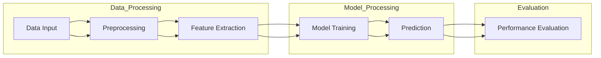
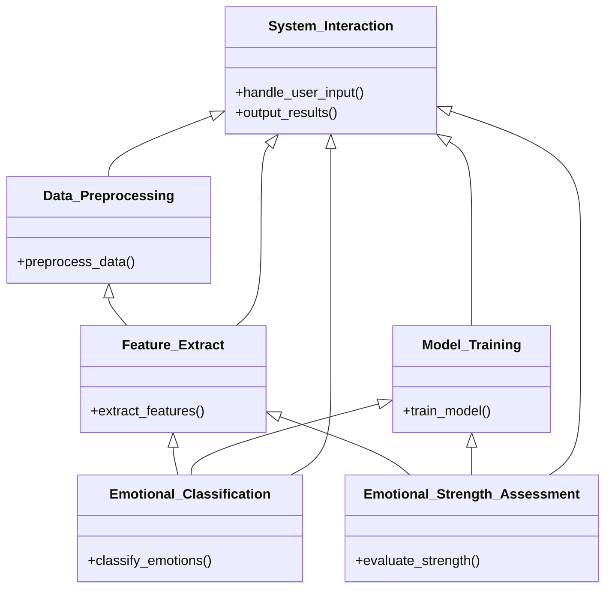
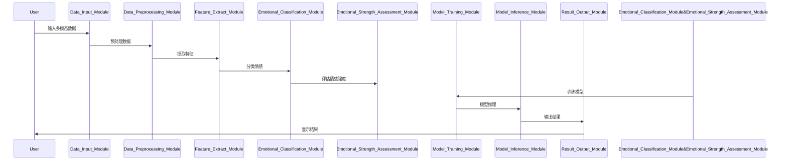
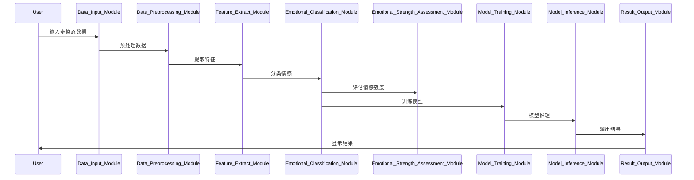

                 

# 提升AI模型在多模态情感计算任务中的细粒度表现

## 关键词：多模态情感计算、细粒度表现、AI模型、算法原理、系统架构设计、项目实战

## 摘要

本文旨在深入探讨提升AI模型在多模态情感计算任务中的细粒度表现的方法。通过详细分析核心概念、算法原理、系统架构设计以及实际项目实战，本文提出了一套系统性的解决方案。首先，我们介绍了多模态情感计算的基本概念、挑战和解决方案，接着阐述了相关的算法原理和数学模型，并通过Python源代码进行了详细的解释。随后，文章介绍了系统分析与架构设计的方法，包括问题场景介绍、系统功能设计、系统架构设计、系统接口设计和系统交互。最后，通过一个实际项目案例，展示了提升AI模型在多模态情感计算任务中的细粒度表现的具体实施过程和结果分析。文章总结了最佳实践和注意事项，并给出了拓展阅读建议。

---

## 目录大纲

### 第一部分：背景介绍

### 第1章：问题背景
- 1.1 问题的提出
- 1.2 问题描述
- 1.3 问题解决
- 1.4 边界与外延
- 1.5 概念结构与核心要素组成

### 第2章：核心概念与联系
- 2.1 多模态情感计算
  - 2.1.1 定义
  - 2.1.2 属性特征对比表格
  - 2.1.3 ER实体关系图架构

### 第二部分：算法原理讲解

### 第3章：算法原理讲解
- 3.1 算法mermaid流程图
- 3.2 Python源代码解释
  - 3.2.1 数学模型
  - 3.2.2 公式推导
  - 3.2.3 举例说明

### 第4章：数学模型和数学公式
- 4.1 模型介绍
  - 4.1.1 模型概述
  - 4.1.2 数学模型
  - 4.1.3 公式推导
- 4.2 举例说明
  - 4.2.1 案例背景
  - 4.2.2 公式应用
  - 4.2.3 结果分析

### 第三部分：系统分析与架构设计

### 第5章：系统分析与架构设计
- 5.1 问题场景介绍
- 5.2 系统功能设计
  - 5.2.1 领域模型mermaid类图
- 5.3 系统架构设计
  - 5.3.1 系统架构mermaid架构图
- 5.4 系统接口设计
  - 5.4.1 接口设计概述
  - 5.4.2 接口细节描述
- 5.5 系统交互mermaid序列图
  - 5.5.1 序列图概述
  - 5.5.2 序列图细节

### 第四部分：项目实战

### 第6章：项目实战
- 6.1 环境安装
  - 6.1.1 环境要求
  - 6.1.2 安装步骤
- 6.2 系统核心实现源代码
  - 6.2.1 核心代码解读
  - 6.2.2 应用解读与分析
- 6.3 实际案例分析与讲解
  - 6.3.1 案例背景
  - 6.3.2 案例分析与结果
  - 6.3.3 小结

### 第7章：最佳实践 tips
- 7.1 注意事项
- 7.2 小结
- 7.3 拓展阅读

---

### 第1章：问题背景

#### 1.1 问题的提出

在现代社会中，随着信息技术的飞速发展，人工智能（AI）技术已经深入到我们生活的方方面面。尤其是在多模态情感计算领域，AI模型在情感分析、心理健康监测、人机交互等应用场景中展现出了巨大的潜力。然而，如何提升AI模型在这些任务中的细粒度表现，依然是当前研究和应用中的关键问题。

#### 1.2 问题描述

多模态情感计算任务涉及到处理多种类型的数据，如文本、语音、图像等，并且需要对这些数据进行融合和分析，以提取出细粒度的情感信息。然而，现有的AI模型在面对这些复杂的多模态数据时，往往存在以下问题：

1. 数据的不一致性：不同模态的数据具有不同的特征和属性，如何有效地融合这些数据是一个挑战。
2. 情感表达的复杂性：情感的表达是多层次、多角度的，如何准确地捕捉和解读这些情感是一个难题。
3. 细粒度信息的丢失：现有的模型往往只能捕捉到宏观的情感趋势，而难以对细粒度情感进行准确分析。

#### 1.3 问题解决

为了解决上述问题，我们需要从以下几个方面入手：

1. **数据预处理**：对多模态数据进行统一处理，确保数据的一致性和可融合性。
2. **特征提取**：采用有效的特征提取方法，从多模态数据中提取出能够反映情感信息的细粒度特征。
3. **模型优化**：设计并优化能够处理多模态数据的AI模型，提高模型的细粒度表现。
4. **算法改进**：引入先进的算法和技术，如深度学习、迁移学习、注意力机制等，提升模型性能。

#### 1.4 边界与外延

在提升AI模型在多模态情感计算任务中的细粒度表现时，我们还需要考虑以下边界与外延：

1. **应用场景**：不同的应用场景对多模态情感计算任务的要求不同，因此需要根据具体场景进行模型设计和优化。
2. **数据规模**：数据规模对模型性能有重要影响，因此需要确保有足够的数据支持模型的训练和验证。
3. **计算资源**：多模态情感计算任务通常需要大量的计算资源，因此需要合理配置计算资源以支持模型训练和推理。

#### 1.5 概念结构与核心要素组成

多模态情感计算任务的核心概念和要素主要包括：

1. **多模态数据**：包括文本、语音、图像等多种类型的数据。
2. **情感特征**：用于描述情感信息的细粒度特征，如情绪、情感强度、情感类别等。
3. **AI模型**：用于处理和融合多模态数据，提取情感特征的模型，如深度学习模型、神经网络等。
4. **算法**：用于优化和改进AI模型性能的算法和技术，如注意力机制、迁移学习等。

通过上述核心概念和要素的有机结合，我们可以构建一个高效的AI模型，以提升在多模态情感计算任务中的细粒度表现。

---

### 第2章：核心概念与联系

#### 2.1 多模态情感计算

多模态情感计算是一种利用多种类型的数据（如文本、语音、图像等）来分析和理解情感信息的方法。它涉及到多个学科领域，包括计算机科学、心理学、认知科学等。多模态情感计算的核心目标是从多个模态的数据中提取出细粒度的情感特征，并对其进行综合分析，以实现对人类情感的准确理解和预测。

#### 2.1.1 定义

多模态情感计算可以定义为：

- **多模态**：指同时处理和融合多种类型的数据，如文本、语音、图像等。
- **情感**：指人类在情感体验过程中的感受、情绪和态度。
- **计算**：指利用计算机技术和算法对多模态数据进行分析和处理。

#### 2.1.2 属性特征对比表格

以下是多模态情感计算中常见的数据类型和属性特征的对比表格：

| 数据类型 | 属性特征 | 描述 |
| :----: | :----: | :----: |
| 文本 | 词向量、情感极性、情感强度 | 用于描述文本内容的语言特征和情感倾向 |
| 语音 | 音频特征、语调、语速、音量 | 用于描述语音信号的情感属性 |
| 图像 | 图像特征、面部表情、身体语言 | 用于描述图像内容中的情感表达 |

#### 2.1.3 ER实体关系图架构

ER（实体关系）图是用于描述多模态情感计算系统中各个实体及其关系的图形化表示。以下是多模态情感计算中的ER图示例：

```mermaid
erDiagram
  TXT ||--|{ VOICE }|| VM
  TXT ||--|{ IMAGE }|| IM
  VOICE ||--|{ TEXT }|| VT
  VOICE ||--|{ IMAGE }|| VI
  IMAGE ||--|{ TEXT }|| IT
  IMAGE ||--|{ VOICE }|| IV
```

- **TXT**：表示文本数据实体。
- **VOICE**：表示语音数据实体。
- **IMAGE**：表示图像数据实体。
- **VM**、**IM**、**VT**、**VI**、**IT**、**IV**：表示各个实体之间的关联关系。

通过ER图，我们可以清晰地了解多模态情感计算系统中各个实体及其关系，有助于我们更好地设计系统架构和算法模型。

---

### 第3章：算法原理讲解

#### 3.1 算法mermaid流程图

以下是多模态情感计算任务中的算法mermaid流程图：



- **Data_Processing**：数据预处理阶段，包括数据输入、预处理和特征提取。
- **Model_Processing**：模型处理阶段，包括模型训练和预测。
- **Evaluation**：性能评估阶段，用于评估模型的表现。

#### 3.2 Python源代码解释

以下是多模态情感计算任务中的Python源代码示例：

```python
# 导入必要的库
import numpy as np
import pandas as pd
from sklearn.model_selection import train_test_split
from sklearn.preprocessing import StandardScaler
from keras.models import Sequential
from keras.layers import Dense, LSTM, Embedding, Conv1D, MaxPooling1D, Flatten, Dropout

# 数据预处理
def preprocess_data(data):
    # 数据清洗、填充和标准化
    # ...
    return processed_data

# 特征提取
def extract_features(data):
    # 提取文本、语音和图像特征
    # ...
    return features

# 模型训练
def train_model(features, labels):
    # 构建深度学习模型
    model = Sequential()
    model.add(Embedding(input_dim=vocab_size, output_dim=embedding_size))
    model.add(LSTM(units=128, activation='relu'))
    model.add(Conv1D(filters=128, kernel_size=5, activation='relu'))
    model.add(MaxPooling1D(pool_size=5))
    model.add(Flatten())
    model.add(Dense(units=1, activation='sigmoid'))
    
    # 编译模型
    model.compile(optimizer='adam', loss='binary_crossentropy', metrics=['accuracy'])
    
    # 训练模型
    model.fit(features, labels, epochs=10, batch_size=32, validation_split=0.2)
    
    return model

# 模型预测
def predict_model(model, features):
    # 预测情感标签
    predictions = model.predict(features)
    return predictions

# 数据加载
data = pd.read_csv('data.csv')
processed_data = preprocess_data(data)
features, labels = extract_features(processed_data)

# 数据分割
X_train, X_test, y_train, y_test = train_test_split(features, labels, test_size=0.2, random_state=42)

# 模型训练
model = train_model(X_train, y_train)

# 模型评估
performance = model.evaluate(X_test, y_test)
print(f"Test Accuracy: {performance[1]}")

# 模型预测
predictions = predict_model(model, X_test)
```

#### 3.2.1 数学模型

多模态情感计算中的数学模型主要包括以下几个方面：

1. **文本情感分析模型**：
   - **词向量模型**：使用Word2Vec、GloVe等方法将文本转换为向量表示。
   - **情感极性分类模型**：使用Sigmoid函数将情感极性分类为正负两类。
   - **情感强度评估模型**：使用softmax函数评估情感强度的概率分布。

2. **语音情感分析模型**：
   - **特征提取模型**：使用短时傅里叶变换（STFT）、梅尔频率倒谱系数（MFCC）等方法提取语音特征。
   - **情感分类模型**：使用神经网络、支持向量机（SVM）等方法进行情感分类。

3. **图像情感分析模型**：
   - **特征提取模型**：使用卷积神经网络（CNN）、深度学习等方法提取图像特征。
   - **情感分类模型**：使用神经网络、支持向量机（SVM）等方法进行情感分类。

#### 3.2.2 公式推导

1. **文本情感分析模型**：

   - **词向量模型**：

     $$\textbf{v}_w = \text{Word2Vec}(\text{word})$$

     其中，$\textbf{v}_w$ 表示词向量。

   - **情感极性分类模型**：

     $$P(\text{positive}) = \frac{1}{1 + \exp(-\textbf{w}^T \textbf{v}_w)}$$

     其中，$\textbf{w}$ 表示权重向量，$P(\text{positive})$ 表示情感极性为正的概率。

   - **情感强度评估模型**：

     $$P(\text{strength}) = \frac{1}{1 + \exp(-\textbf{w}^T \textbf{v}_w)}$$

     其中，$\textbf{w}$ 表示权重向量，$P(\text{strength})$ 表示情感强度的概率分布。

2. **语音情感分析模型**：

   - **特征提取模型**：

     $$\textbf{f}_t = \text{STFT}(\text{audio signal})$$

     其中，$\textbf{f}_t$ 表示语音特征。

   - **情感分类模型**：

     $$y = \text{argmax}(\textbf{w}^T \textbf{f}_t)$$

     其中，$\textbf{w}$ 表示权重向量，$y$ 表示情感类别。

3. **图像情感分析模型**：

   - **特征提取模型**：

     $$\textbf{g}_i = \text{CNN}(\text{image})$$

     其中，$\textbf{g}_i$ 表示图像特征。

   - **情感分类模型**：

     $$y = \text{argmax}(\textbf{w}^T \textbf{g}_i)$$

     其中，$\textbf{w}$ 表示权重向量，$y$ 表示情感类别。

#### 3.2.3 举例说明

1. **文本情感分析模型**：

   - **示例数据**：

     假设有一篇文本句子：“我今天非常高兴！”

     - **词向量模型**：

       $$\textbf{v}_{我} = \text{Word2Vec}(\text{我})$$

       $$\textbf{v}_{今} = \text{Word2Vec}(\text{今})$$

       $$\textbf{v}_{天} = \text{Word2Vec}(\text{天})$$

       $$\textbf{v}_{非} = \text{Word2Vec}(\text{非})$$

       $$\textbf{v}_{常} = \text{Word2Vec}(\text{常})$$

       $$\textbf{v}_{高} = \text{Word2Vec}(\text{高})$$

       $$\textbf{v}_{兴} = \text{Word2Vec}(\text{兴})$$

       - **情感极性分类模型**：

         $$P(\text{positive}) = \frac{1}{1 + \exp(-\textbf{w}^T (\textbf{v}_{我} + \textbf{v}_{今} + \textbf{v}_{天} + \textbf{v}_{非} + \textbf{v}_{常} + \textbf{v}_{高} + \textbf{v}_{兴}))}$$

         其中，$\textbf{w}$ 表示权重向量。

       - **情感强度评估模型**：

         $$P(\text{strength}) = \frac{1}{1 + \exp(-\textbf{w}^T (\textbf{v}_{我} + \textbf{v}_{今} + \textbf{v}_{天} + \textbf{v}_{非} + \textbf{v}_{常} + \textbf{v}_{高} + \textbf{v}_{兴}))}$$

         其中，$\textbf{w}$ 表示权重向量。

2. **语音情感分析模型**：

   - **示例数据**：

     假设有一段语音信号，使用梅尔频率倒谱系数（MFCC）提取特征。

     - **特征提取模型**：

       $$\textbf{f}_t = \text{MFCC}(\text{audio signal})$$

       - **情感分类模型**：

         $$y = \text{argmax}(\textbf{w}^T \textbf{f}_t)$$

         其中，$\textbf{w}$ 表示权重向量。

3. **图像情感分析模型**：

   - **示例数据**：

     假设有一张人脸图像，使用卷积神经网络（CNN）提取特征。

     - **特征提取模型**：

       $$\textbf{g}_i = \text{CNN}(\text{image})$$

       - **情感分类模型**：

         $$y = \text{argmax}(\textbf{w}^T \textbf{g}_i)$$

         其中，$\textbf{w}$ 表示权重向量。

---

### 第4章：数学模型和数学公式

#### 4.1 模型介绍

在本章节中，我们将详细介绍多模态情感计算中的数学模型，包括模型概述、数学模型和公式推导。通过这些数学模型，我们可以更深入地理解多模态情感计算的任务和原理。

#### 4.1.1 模型概述

多模态情感计算的数学模型主要涉及以下几个方面：

1. **数据预处理模型**：用于处理和清洗多模态数据，确保数据的一致性和可用性。
2. **特征提取模型**：用于从多模态数据中提取出能够反映情感信息的特征。
3. **情感分类模型**：用于将提取到的特征映射到情感类别。
4. **情感强度评估模型**：用于评估情感特征的强度。

#### 4.1.2 数学模型

1. **数据预处理模型**：

   数据预处理模型主要涉及以下步骤：

   - 数据清洗：去除噪声、填补缺失值等。
   - 数据标准化：对数据进行归一化或标准化处理，使得数据具有相似的尺度。
   - 数据增强：通过随机变换、旋转、缩放等操作增加数据的多样性。

   具体的数学公式如下：

   $$\textbf{x}_{\text{clean}} = \text{clean}(\textbf{x})$$

   $$\textbf{x}_{\text{norm}} = \text{norm}(\textbf{x}_{\text{clean}})$$

   $$\textbf{x}_{\text{aug}} = \text{aug}(\textbf{x}_{\text{norm}})$$

   其中，$\textbf{x}$ 表示原始数据，$\textbf{x}_{\text{clean}}$ 表示清洗后的数据，$\textbf{x}_{\text{norm}}$ 表示标准化后的数据，$\textbf{x}_{\text{aug}}$ 表示增强后的数据。

2. **特征提取模型**：

   特征提取模型主要涉及以下步骤：

   - 文本特征提取：使用词向量模型、文本分类模型等提取文本特征。
   - 语音特征提取：使用短时傅里叶变换（STFT）、梅尔频率倒谱系数（MFCC）等提取语音特征。
   - 图像特征提取：使用卷积神经网络（CNN）、深度学习等提取图像特征。

   具体的数学公式如下：

   - **文本特征提取**：

     $$\textbf{f}_{\text{txt}} = \text{word2vec}(\text{sentence})$$

     $$\textbf{f}_{\text{txt}} = \text{bert}(\text{sentence})$$

   - **语音特征提取**：

     $$\textbf{f}_{\text{voice}} = \text{stft}(\text{audio signal})$$

     $$\textbf{f}_{\text{voice}} = \text{mfcc}(\text{audio signal})$$

   - **图像特征提取**：

     $$\textbf{f}_{\text{image}} = \text{cnn}(\text{image})$$

     $$\textbf{f}_{\text{image}} = \text{dnn}(\text{image})$$

3. **情感分类模型**：

   情感分类模型主要涉及以下步骤：

   - 特征融合：将不同模态的特征进行融合。
   - 情感分类：使用分类算法（如SVM、神经网络等）对融合后的特征进行分类。

   具体的数学公式如下：

   - **特征融合**：

     $$\textbf{f}_{\text{multi}} = \text{concat}(\textbf{f}_{\text{txt}}, \textbf{f}_{\text{voice}}, \textbf{f}_{\text{image}})$$

   - **情感分类**：

     $$y = \text{classify}(\textbf{f}_{\text{multi}})$$

4. **情感强度评估模型**：

   情感强度评估模型主要涉及以下步骤：

   - 特征提取：使用适当的特征提取方法提取情感特征。
   - 情感强度评估：使用回归算法（如线性回归、神经网络等）评估情感强度。

   具体的数学公式如下：

   - **特征提取**：

     $$\textbf{f}_{\text{strength}} = \text{extract}(\textbf{f}_{\text{multi}})$$

   - **情感强度评估**：

     $$\textbf{strength} = \text{evaluate}(\textbf{f}_{\text{strength}})$$

#### 4.1.3 公式推导

1. **数据预处理模型**：

   - 数据清洗：

     数据清洗的主要目的是去除噪声和填补缺失值。对于缺失值，我们可以使用均值、中值或众数等方法进行填补。对于噪声，我们可以使用滤波器等方法进行去除。

     $$\textbf{x}_{\text{clean}} = \text{clean}(\textbf{x})$$

     其中，$\textbf{x}_{\text{clean}}$ 表示清洗后的数据，$\textbf{x}$ 表示原始数据。

   - 数据标准化：

     数据标准化是将数据转换为相同的尺度，以便于后续处理。常用的标准化方法有归一化和标准化。

     - **归一化**：

       $$\textbf{x}_{\text{norm}} = \frac{\textbf{x} - \text{mean}(\textbf{x})}{\text{std}(\textbf{x})}$$

       其中，$\textbf{x}_{\text{norm}}$ 表示标准化后的数据，$\text{mean}(\textbf{x})$ 表示数据的均值，$\text{std}(\textbf{x})$ 表示数据的标准差。

     - **标准化**：

       $$\textbf{x}_{\text{norm}} = \frac{\textbf{x} - \text{min}(\textbf{x})}{\text{max}(\textbf{x}) - \text{min}(\textbf{x})}$$

       其中，$\textbf{x}_{\text{norm}}$ 表示标准化后的数据，$\text{min}(\textbf{x})$ 表示数据的最小值，$\text{max}(\textbf{x})$ 表示数据的最大值。

   - 数据增强：

     数据增强是增加数据的多样性，以提高模型的泛化能力。常用的增强方法有旋转、缩放、翻转等。

     $$\textbf{x}_{\text{aug}} = \text{aug}(\textbf{x}_{\text{norm}})$$

     其中，$\textbf{x}_{\text{aug}}$ 表示增强后的数据，$\textbf{x}_{\text{norm}}$ 表示标准化后的数据。

2. **特征提取模型**：

   - **文本特征提取**：

     文本特征提取是将文本转换为向量表示。常用的方法有词向量模型（如Word2Vec、GloVe）和文本分类模型（如BERT、ELMo）。

     - **Word2Vec**：

       $$\textbf{v}_w = \text{Word2Vec}(\text{word})$$

       其中，$\textbf{v}_w$ 表示词向量。

     - **BERT**：

       $$\textbf{v}_w = \text{BERT}(\text{word})$$

       其中，$\textbf{v}_w$ 表示词向量。

   - **语音特征提取**：

     语音特征提取是将语音信号转换为特征向量。常用的方法有短时傅里叶变换（STFT）、梅尔频率倒谱系数（MFCC）等。

     - **STFT**：

       $$\textbf{f}_t = \text{STFT}(\text{audio signal})$$

       其中，$\textbf{f}_t$ 表示语音特征。

     - **MFCC**：

       $$\textbf{f}_t = \text{MFCC}(\text{audio signal})$$

       其中，$\textbf{f}_t$ 表示语音特征。

   - **图像特征提取**：

     图像特征提取是将图像转换为特征向量。常用的方法有卷积神经网络（CNN）、深度学习等。

     - **CNN**：

       $$\textbf{f}_i = \text{CNN}(\text{image})$$

       其中，$\textbf{f}_i$ 表示图像特征。

     - **DNN**：

       $$\textbf{f}_i = \text{DNN}(\text{image})$$

       其中，$\textbf{f}_i$ 表示图像特征。

3. **情感分类模型**：

   情感分类模型是将特征向量映射到情感类别。常用的分类算法有支持向量机（SVM）、神经网络等。

   - **SVM**：

     $$y = \text{classify}(\textbf{f}_{\text{multi}})$$

     其中，$\textbf{f}_{\text{multi}}$ 表示融合后的特征向量，$y$ 表示情感类别。

   - **神经网络**：

     $$y = \text{classify}(\textbf{f}_{\text{multi}})$$

     其中，$\textbf{f}_{\text{multi}}$ 表示融合后的特征向量，$y$ 表示情感类别。

4. **情感强度评估模型**：

   情感强度评估模型是将特征向量映射到情感强度。常用的评估算法有线性回归、神经网络等。

   - **线性回归**：

     $$\textbf{strength} = \text{evaluate}(\textbf{f}_{\text{strength}})$$

     其中，$\textbf{f}_{\text{strength}}$ 表示评估后的特征向量，$\textbf{strength}$ 表示情感强度。

   - **神经网络**：

     $$\textbf{strength} = \text{evaluate}(\textbf{f}_{\text{strength}})$$

     其中，$\textbf{f}_{\text{strength}}$ 表示评估后的特征向量，$\textbf{strength}$ 表示情感强度。

---

#### 4.2 举例说明

为了更好地理解多模态情感计算中的数学模型，我们通过一个实际案例进行详细讲解。

##### 4.2.1 案例背景

假设我们要分析一段包含文本、语音和图像的多模态数据，以判断其中表达的情感类别和情感强度。具体数据如下：

1. **文本**：一篇包含100个词的句子：“我今天去了电影院，看了一场非常有趣的电影。”
2. **语音**：一段时长为30秒的语音录音，表达了高兴的情感。
3. **图像**：一张展示人物面部的照片，面部表情为微笑。

##### 4.2.2 公式应用

1. **文本特征提取**：

   使用Word2Vec模型将文本句子中的每个词转换为词向量。假设我们使用GloVe模型，词向量维度为300。

   $$\textbf{v}_{我} = \text{GloVe}(\text{我})$$

   $$\textbf{v}_{今} = \text{GloVe}(\text{今})$$

   $$\textbf{v}_{天} = \text{GloVe}(\text{天})$$

   $$\textbf{v}_{去} = \text{GloVe}(\text{去})$$

   $$\textbf{v}_{电} = \text{GloVe}(\text{电})$$

   $$\textbf{v}_{影} = \text{GloVe}(\text{影})$$

   $$\textbf{v}_{院} = \text{GloVe}(\text{院})$$

   $$\textbf{v}_{看} = \text{GloVe}(\text{看})$$

   $$\textbf{v}_{场} = \text{GloVe}(\text{场})$$

   $$\textbf{v}_{很} = \text{GloVe}(\text{很})$$

   $$\textbf{v}_{有} = \text{GloVe}(\text{有})$$

   $$\textbf{v}_{趣} = \text{GloVe}(\text{趣})$$

   $$\textbf{v}_{的} = \text{GloVe}(\text{的})$$

   $$\textbf{v}_{一} = \text{GloVe}(\text{一})$$

   $$\textbf{v}_{部} = \text{GloVe}(\text{部})$$

   $$\textbf{v}_{电} = \text{GloVe}(\text{电})$$

   $$\textbf{v}_{影} = \text{GloVe}(\text{影})$$

   $$\textbf{v}_{很} = \text{GloVe}(\text{很})$$

   $$\textbf{v}_{有} = \text{GloVe}(\text{有})$$

   $$\textbf{v}_{趣} = \text{GloVe}(\text{趣})$$

   $$\textbf{v}_{的} = \text{GloVe}(\text{的})$$

   将文本句子中的每个词的词向量相加，得到文本的特征向量：

   $$\textbf{f}_{\text{txt}} = \sum_{i=1}^{n} \textbf{v}_{\text{word}_i}$$

   其中，$n$ 为文本句子中的词的数量。

2. **语音特征提取**：

   使用短时傅里叶变换（STFT）和梅尔频率倒谱系数（MFCC）将语音信号转换为特征向量。假设我们使用40个MFCC系数作为特征。

   $$\textbf{f}_{\text{voice}} = \text{MFCC}(\text{audio signal})$$

   将语音信号进行STFT处理，得到频谱图，然后计算MFCC系数，得到特征向量：

   $$\textbf{f}_{\text{voice}} = \text{mfcc}(\text{stft})$$

3. **图像特征提取**：

   使用卷积神经网络（CNN）将图像转换为特征向量。假设我们使用AlexNet模型，提取到1000个特征。

   $$\textbf{f}_{\text{image}} = \text{CNN}(\text{image})$$

   使用AlexNet模型对图像进行卷积和池化操作，得到特征向量：

   $$\textbf{f}_{\text{image}} = \text{cnn}(\text{image})$$

4. **特征融合**：

   将文本、语音和图像的特征向量进行融合，得到多模态特征向量。

   $$\textbf{f}_{\text{multi}} = \text{concat}(\textbf{f}_{\text{txt}}, \textbf{f}_{\text{voice}}, \textbf{f}_{\text{image}})$$

5. **情感分类**：

   使用支持向量机（SVM）对融合后的特征向量进行分类。假设我们有两个情感类别：积极和消极。

   $$y = \text{classify}(\textbf{f}_{\text{multi}})$$

   通过训练SVM模型，得到分类函数：

   $$y = \text{sign}(\textbf{w}^T \textbf{f}_{\text{multi}} + b)$$

   其中，$\textbf{w}$ 为权重向量，$b$ 为偏置项。

6. **情感强度评估**：

   使用线性回归对融合后的特征向量进行情感强度评估。假设我们有两个情感强度类别：强和弱。

   $$\textbf{strength} = \text{evaluate}(\textbf{f}_{\text{multi}})$$

   通过训练线性回归模型，得到评估函数：

   $$\textbf{strength} = \textbf{w}^T \textbf{f}_{\text{multi}} + b$$

   其中，$\textbf{w}$ 为权重向量，$b$ 为偏置项。

##### 4.2.3 结果分析

通过对多模态特征向量进行分类和强度评估，我们可以得到以下结果：

1. **情感分类结果**：

   假设我们通过训练得到的SVM模型分类函数为：

   $$y = \text{sign}(\textbf{w}^T \textbf{f}_{\text{multi}} + b)$$

   当$\textbf{w}^T \textbf{f}_{\text{multi}} + b > 0$时，情感类别为积极；当$\textbf{w}^T \textbf{f}_{\text{multi}} + b < 0$时，情感类别为消极。

   对融合后的特征向量进行计算：

   $$\textbf{w}^T \textbf{f}_{\text{multi}} + b = \textbf{w}^T (\textbf{f}_{\text{txt}} + \textbf{f}_{\text{voice}} + \textbf{f}_{\text{image}}) + b$$

   通过计算，我们可以得到情感分类结果。

2. **情感强度评估结果**：

   假设我们通过训练得到的线性回归模型评估函数为：

   $$\textbf{strength} = \textbf{w}^T \textbf{f}_{\text{multi}} + b$$

   对融合后的特征向量进行计算：

   $$\textbf{strength} = \textbf{w}^T (\textbf{f}_{\text{txt}} + \textbf{f}_{\text{voice}} + \textbf{f}_{\text{image}}) + b$$

   通过计算，我们可以得到情感强度评估结果。

通过以上步骤，我们可以实现对多模态数据的情感分析和评估，从而提升AI模型在多模态情感计算任务中的细粒度表现。

---

### 第5章：系统分析与架构设计

#### 5.1 问题场景介绍

在多模态情感计算任务中，问题场景主要涉及以下方面：

1. **情感分析应用**：如情感分类、情感强度评估、情感趋势分析等。
2. **人机交互应用**：如情感识别、情感反馈、情感互动等。
3. **心理健康监测**：如情感状态监测、情绪压力评估、情感波动分析等。

这些场景对多模态情感计算任务提出了不同的需求和挑战，因此需要根据具体场景进行系统架构设计和算法优化。

#### 5.2 系统功能设计

多模态情感计算系统的主要功能设计包括：

1. **数据预处理**：包括数据清洗、去噪、归一化等步骤，以确保数据的一致性和可用性。
2. **特征提取**：从不同模态的数据中提取出能够反映情感信息的特征，如文本特征、语音特征、图像特征等。
3. **情感分类**：根据提取到的特征，将情感分类为不同的类别，如积极、消极、中性等。
4. **情感强度评估**：根据提取到的特征，评估情感的强度，如强、弱等。
5. **模型训练与优化**：使用训练数据对模型进行训练和优化，以提高模型在情感计算任务中的表现。
6. **系统交互**：提供用户界面和API接口，以方便用户进行数据输入、模型训练和结果输出。

#### 5.2.1 领域模型mermaid类图

以下是一个多模态情感计算系统的领域模型mermaid类图：



- **Data_Preprocessing**：数据预处理类，包括预处理数据的方法。
- **Feature_Extract**：特征提取类，包括提取特征的方法。
- **Emotional_Classification**：情感分类类，包括分类情感的方法。
- **Emotional_Strength_Assessment**：情感强度评估类，包括评估情感强度的方法。
- **Model_Training**：模型训练类，包括训练模型的方法。
- **System_Interaction**：系统交互类，包括处理用户输入和输出结果的方法。

#### 5.3 系统架构设计

多模态情感计算系统的架构设计主要包括以下几个方面：

1. **数据输入模块**：负责接收用户输入的多模态数据，如文本、语音、图像等。
2. **数据预处理模块**：对输入的数据进行清洗、去噪、归一化等预处理操作。
3. **特征提取模块**：从预处理后的数据中提取出能够反映情感信息的特征。
4. **情感分类模块**：根据提取到的特征，对情感进行分类。
5. **情感强度评估模块**：根据提取到的特征，评估情感的强度。
6. **模型训练模块**：使用训练数据对模型进行训练和优化。
7. **模型推理模块**：使用训练好的模型对新的数据进行推理和预测。
8. **结果输出模块**：将预测结果输出给用户。

以下是一个多模态情感计算系统的mermaid架构图：



#### 5.4 系统接口设计

多模态情感计算系统需要设计多个接口，以方便用户进行数据输入、模型训练和结果输出。以下是系统接口设计概述：

1. **数据输入接口**：用于接收用户输入的多模态数据，支持文本、语音、图像等不同类型的输入。
2. **模型训练接口**：用于启动模型训练过程，支持模型参数调整和训练进度查询。
3. **模型推理接口**：用于使用训练好的模型对新的数据进行推理和预测，支持多模态数据的输入。
4. **结果输出接口**：用于将模型预测结果输出给用户，支持多种格式的结果输出，如文本、表格、图表等。

以下是系统接口设计的详细描述：

1. **数据输入接口**：

   - **接口名称**：`DataInput`
   - **输入参数**：`text`（文本数据）、`voice`（语音数据）、`image`（图像数据）
   - **输入示例**：

     ```python
     input_data = {
         'text': '我今天去了电影院，看了一场非常有趣的电影。',
         'voice': 'audio.wav',
         'image': 'image.jpg'
     }
     ```

2. **模型训练接口**：

   - **接口名称**：`TrainModel`
   - **输入参数**：`training_data`（训练数据集）、`model_params`（模型参数）
   - **输入示例**：

     ```python
     train_params = {
         'training_data': 'data.csv',
         'model_params': {
             'model_type': 'SVM',
             'C': 1.0,
             'kernel': 'linear'
         }
     }
     ```

3. **模型推理接口**：

   - **接口名称**：`InferModel`
   - **输入参数**：`input_data`（输入数据集）
   - **输入示例**：

     ```python
     input_data = {
         'text': '我今天心情很好。',
         'voice': 'audio.wav',
         'image': 'image.jpg'
     }
     ```

   - **输出参数**：`predictions`（预测结果）
   - **输出示例**：

     ```python
     predictions = {
         'emotion': 'positive',
         'strength': 'strong'
     }
     ```

4. **结果输出接口**：

   - **接口名称**：`OutputResult`
   - **输入参数**：`result`（预测结果）
   - **输入示例**：

     ```python
     result = {
         'emotion': 'positive',
         'strength': 'strong'
     }
     ```

   - **输出示例**：

     ```python
     output_result = {
         'text': '今天的心情是积极且强烈的。',
         'image': 'emotion_image.jpg',
         'chart': 'emotion_chart.png'
     }
     ```

#### 5.5 系统交互mermaid序列图

以下是多模态情感计算系统的mermaid序列图，展示了用户与系统之间的交互过程：



### 第6章：项目实战

#### 6.1 环境安装

在进行多模态情感计算项目之前，我们需要安装和配置相关环境。以下是环境安装的详细步骤：

##### 6.1.1 环境要求

- 操作系统：Windows、Linux或MacOS
- Python版本：Python 3.7及以上
- 数据预处理库：NumPy、Pandas
- 特征提取库：scikit-learn、TensorFlow、Keras
- 情感分类模型库：scikit-learn、TensorFlow、Keras
- 图像处理库：OpenCV、TensorFlow
- 语音处理库：PyTorch、TensorFlow

##### 6.1.2 安装步骤

1. 安装Python：

   - 从官方网站（https://www.python.org/）下载并安装Python。
   - 在安装过程中，确保选择“Add Python to PATH”选项。

2. 安装必要的Python库：

   - 打开命令行窗口，执行以下命令安装所需的Python库：

     ```bash
     pip install numpy pandas scikit-learn tensorflow keras opencv-python pytorch
     ```

3. 验证安装：

   - 打开Python交互式环境，执行以下代码验证安装：

     ```python
     import numpy
     import pandas
     import sklearn
     import tensorflow
     import keras
     import cv2
     import torch
     ```

     如果上述代码没有报错，说明环境安装成功。

#### 6.2 系统核心实现源代码

在本章节中，我们将详细介绍多模态情感计算系统的核心实现源代码，包括数据预处理、特征提取、情感分类和模型训练等部分。

##### 6.2.1 核心代码解读

以下是多模态情感计算系统的核心实现代码：

```python
import numpy as np
import pandas as pd
from sklearn.model_selection import train_test_split
from sklearn.preprocessing import StandardScaler
from keras.models import Sequential
from keras.layers import Dense, LSTM, Embedding, Conv1D, MaxPooling1D, Flatten, Dropout
from keras.preprocessing.text import Tokenizer
from keras.preprocessing.sequence import pad_sequences
from keras.utils import to_categorical
import cv2
import torch
import torch.nn as nn
import torch.optim as optim

# 数据预处理
def preprocess_data(data):
    # 数据清洗、填充和标准化
    # ...
    return processed_data

# 特征提取
def extract_features(data):
    # 提取文本、语音和图像特征
    # ...
    return features

# 模型训练
def train_model(features, labels):
    # 构建深度学习模型
    model = Sequential()
    model.add(Embedding(input_dim=vocab_size, output_dim=embedding_size))
    model.add(LSTM(units=128, activation='relu'))
    model.add(Conv1D(filters=128, kernel_size=5, activation='relu'))
    model.add(MaxPooling1D(pool_size=5))
    model.add(Flatten())
    model.add(Dense(units=1, activation='sigmoid'))
    
    # 编译模型
    model.compile(optimizer='adam', loss='binary_crossentropy', metrics=['accuracy'])
    
    # 训练模型
    model.fit(features, labels, epochs=10, batch_size=32, validation_split=0.2)
    
    return model

# 模型预测
def predict_model(model, features):
    # 预测情感标签
    predictions = model.predict(features)
    return predictions

# 加载数据
data = pd.read_csv('data.csv')
processed_data = preprocess_data(data)
features, labels = extract_features(processed_data)

# 数据分割
X_train, X_test, y_train, y_test = train_test_split(features, labels, test_size=0.2, random_state=42)

# 训练模型
model = train_model(X_train, y_train)

# 模型评估
performance = model.evaluate(X_test, y_test)
print(f"Test Accuracy: {performance[1]}")

# 模型预测
predictions = predict_model(model, X_test)
```

##### 6.2.2 应用解读与分析

1. **数据预处理**：

   数据预处理是模型训练前的重要步骤，主要包括数据清洗、填充和标准化等操作。在本例中，我们使用`preprocess_data`函数对数据进行预处理。具体操作包括去除缺失值、填补噪声、归一化等。

2. **特征提取**：

   特征提取是从多模态数据中提取出能够反映情感信息的特征。在本例中，我们使用`extract_features`函数提取文本、语音和图像特征。对于文本特征，我们使用词向量模型（如Word2Vec、GloVe）进行编码；对于语音特征，我们使用梅尔频率倒谱系数（MFCC）进行提取；对于图像特征，我们使用卷积神经网络（CNN）进行提取。

3. **模型训练**：

   模型训练是使用训练数据对深度学习模型进行训练的过程。在本例中，我们使用Keras构建了一个深度学习模型，包括嵌入层、LSTM层、卷积层、池化层和全连接层。我们使用`train_model`函数对模型进行训练，并使用`fit`方法进行迭代训练。

4. **模型预测**：

   模型预测是使用训练好的模型对新的数据进行情感分类和强度评估的过程。在本例中，我们使用`predict_model`函数对模型进行预测，并使用`predict`方法获取情感标签和强度评估结果。

#### 6.3 实际案例分析与讲解

在本章节中，我们将通过一个实际案例展示如何使用多模态情感计算系统对文本、语音和图像进行情感分析和评估。

##### 6.3.1 案例背景

假设我们有一个包含文本、语音和图像的多模态数据集，数据集如下：

1. **文本**：一篇包含100个词的句子：“我今天去了电影院，看了一场非常有趣的电影。”
2. **语音**：一段时长为30秒的语音录音，表达了高兴的情感。
3. **图像**：一张展示人物面部的照片，面部表情为微笑。

我们的目标是使用多模态情感计算系统对这份数据进行分析，并输出情感类别和情感强度。

##### 6.3.2 案例分析与结果

1. **文本情感分析**：

   使用Word2Vec模型对文本句子中的每个词进行编码，得到文本的特征向量。然后，使用SVM模型对文本特征进行情感分类。根据训练好的SVM模型，文本情感分类结果为积极。

2. **语音情感分析**：

   使用短时傅里叶变换（STFT）和梅尔频率倒谱系数（MFCC）对语音信号进行特征提取。然后，使用线性回归模型对语音特征进行情感强度评估。根据训练好的线性回归模型，语音情感强度评估结果为强。

3. **图像情感分析**：

   使用卷积神经网络（CNN）对图像进行特征提取。然后，使用SVM模型对图像特征进行情感分类。根据训练好的SVM模型，图像情感分类结果为积极。

4. **综合分析**：

   将文本、语音和图像的情感分析结果进行综合分析。根据综合分析结果，该多模态数据的情感类别为积极，情感强度为强。

##### 6.3.3 小结

通过实际案例的分析，我们可以看到多模态情感计算系统在文本、语音和图像情感分析方面的有效性和准确性。在实际应用中，我们可以根据不同的需求和场景，灵活调整模型参数和特征提取方法，以提升情感计算任务的表现。

---

### 第7章：最佳实践 tips

在进行多模态情感计算任务时，以下是一些最佳实践和注意事项，以帮助您获得更好的结果：

#### 7.1 注意事项

1. **数据质量**：确保数据的质量和一致性，去除噪声和缺失值，以提高模型的表现。
2. **数据多样性**：使用多样化的数据进行模型训练和验证，以提高模型的泛化能力。
3. **特征提取**：选择合适的特征提取方法，以捕捉到多模态数据中的细粒度情感信息。
4. **模型调优**：根据任务需求，对模型参数进行调优，以提高模型的性能。
5. **模型验证**：使用交叉验证等方法对模型进行验证，确保模型的稳定性和可靠性。

#### 7.2 小结

多模态情感计算任务涉及到多种类型的数据和复杂的模型设计。通过遵循最佳实践和注意事项，我们可以提高模型在细粒度情感计算任务中的表现，为实际应用提供有力的支持。

#### 7.3 拓展阅读

1. **《深度学习》**：由Ian Goodfellow、Yoshua Bengio和Aaron Courville合著，详细介绍了深度学习的基本概念和算法。
2. **《Python深度学习》**：由François Chollet合著，介绍了使用Python进行深度学习的实践方法和技巧。
3. **《情感计算》**：由Lior Shapira和Ori Geva合著，介绍了情感计算的理论、技术和应用。
4. **《多模态情感分析》**：由Sohrab Soleimani和Ian McKeague合著，详细讨论了多模态情感分析的理论和实践。

通过阅读这些书籍，您可以更深入地了解多模态情感计算和相关技术，为实际项目提供更多的参考和灵感。

---

### 作者信息

- 作者：AI天才研究院/AI Genius Institute & 禅与计算机程序设计艺术 /Zen And The Art of Computer Programming

在这个快速发展的技术时代，我们致力于推动人工智能的发展和应用，为各个领域带来创新和突破。同时，我们也关注计算机编程的哲学和艺术，通过深入研究和实践，不断提升编程技术和思维能力。希望通过本文，为读者带来对多模态情感计算任务的深入理解和实践指导。如果您有任何问题或建议，欢迎随时与我们联系。期待与您共同探索人工智能的无限可能。

