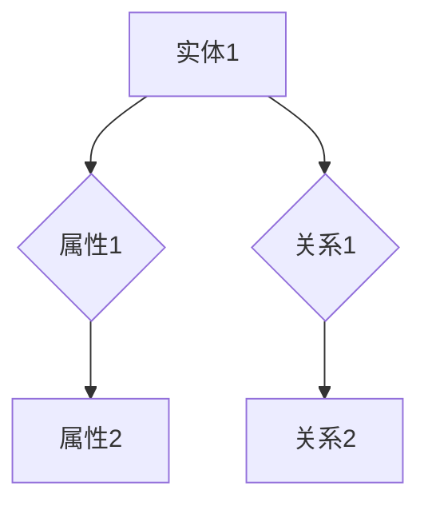
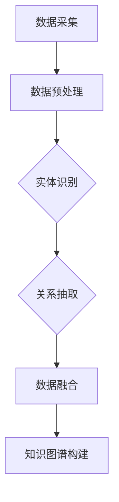
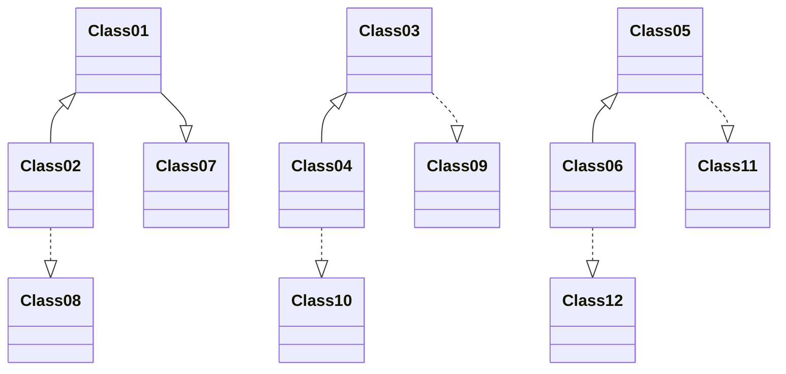
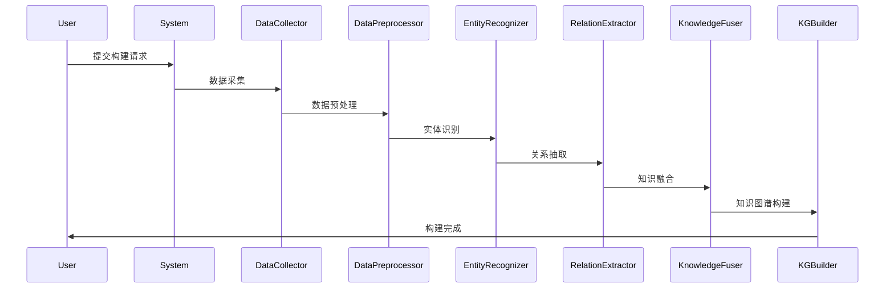

                 

## 提升AI模型在跨域知识图谱构建任务中的表现

> 关键词：AI模型，知识图谱，跨域知识图谱，算法，架构设计，实战，最佳实践

> 摘要：本文旨在探讨提升AI模型在跨域知识图谱构建任务中的表现，通过逐步分析推理，深入解析核心概念、算法原理、系统架构以及项目实战，旨在为研究者和技术人员提供实用的指导和建议。

----------------------------------------------------------------

# 提升AI模型在跨域知识图谱构建任务中的表现

## 第一部分：背景介绍

### 1.1 问题背景

#### 1.1.1 AI模型在知识图谱构建中的重要性

随着互联网的快速发展，数据量呈现爆炸式增长，如何从海量数据中提取有用信息，已经成为大数据领域的重要课题。知识图谱作为一种结构化的语义数据表示方式，在信息检索、推荐系统、智能问答等领域具有广泛的应用前景。而AI模型的引入，使得知识图谱的构建更加智能化，能够更好地应对数据复杂性。

#### 1.1.2 跨域知识图谱构建的挑战

跨域知识图谱构建是当前知识图谱研究的一个重要方向，它旨在将来自不同领域的数据进行整合，形成一个统一的语义表示。然而，不同领域的数据具有不同的结构、属性和关系，这使得跨域知识图谱构建面临着诸多挑战，如数据源的多样性、数据一致性问题、实体链接错误等。

#### 1.1.3 当前研究现状与问题

尽管当前关于知识图谱构建的研究已经取得了一定的成果，但在跨域知识图谱构建方面仍然存在诸多问题。一方面，现有的算法在处理跨领域数据时，往往依赖于领域特定的先验知识，缺乏通用性。另一方面，数据质量和数据一致性问题的解决仍需进一步深入研究。

### 1.2 核心概念

#### 1.2.1 知识图谱

知识图谱是一种以图结构为基础的数据表示方法，它通过实体、属性和关系三个基本元素，将现实世界中的各种实体和概念进行结构化表示。知识图谱的构建是大数据处理的重要环节，它有助于提高数据挖掘和智能应用的效率。

#### 1.2.2 跨域知识图谱

跨域知识图谱是指将来自不同领域的数据进行整合，形成一个统一的语义表示。它旨在解决不同领域数据之间的一致性和互操作性，提高数据共享和复用能力。

#### 1.2.3 AI模型

AI模型是人工智能的重要组成部分，它通过模拟人类思维过程，实现数据的自动处理和决策。在知识图谱构建中，AI模型可以用于实体识别、关系抽取、数据清洗等环节，提高知识图谱的构建效率和质量。

### 1.3 概念联系

#### 1.3.1 知识图谱与AI模型的关系

知识图谱与AI模型的关系密切，AI模型在知识图谱的构建过程中发挥着重要作用。通过AI模型，可以自动识别实体、抽取关系，从而实现知识图谱的自动构建。

#### 1.3.2 跨域知识图谱构建的关键问题

跨域知识图谱构建的关键问题主要包括：数据源多样性、数据一致性、实体链接错误等。这些问题直接影响着知识图谱的质量和效率，需要采取有效的解决方案。

### 1.4 边界与外延

#### 1.4.1 跨域知识图谱构建的应用领域

跨域知识图谱构建广泛应用于多个领域，如金融、医疗、教育、社交等。不同领域的数据整合，有助于实现更全面、精准的智能应用。

#### 1.4.2 跨域知识图谱构建的技术路径

跨域知识图谱构建的技术路径主要包括：数据采集、数据预处理、实体识别、关系抽取、知识融合等。通过这些技术，可以实现跨领域数据的整合和统一表示。

### 1.5 本章小结

本章主要介绍了AI模型在知识图谱构建中的重要性、跨域知识图谱构建的挑战、核心概念及其联系，以及跨域知识图谱构建的应用领域和技术路径。这些内容为本章后续内容的深入探讨奠定了基础。

----------------------------------------------------------------

## 第二部分：核心概念与联系

### 2.1 核心概念原理

#### 2.1.1 知识图谱的原理

知识图谱的原理在于通过实体、属性和关系三个基本元素，将现实世界中的各种实体和概念进行结构化表示。实体表示具体的事物，属性描述实体的特征，关系则描述实体之间的相互关联。

#### 2.1.2 跨域知识图谱的原理

跨域知识图谱的原理在于将来自不同领域的数据进行整合，形成一个统一的语义表示。它通过映射不同领域的数据到统一的实体和关系，实现了跨领域数据的一致性和互操作性。

#### 2.1.3 AI模型的原理

AI模型的原理在于模拟人类思维过程，实现数据的自动处理和决策。通过机器学习和深度学习等技术，AI模型可以从海量数据中学习规律，从而实现自动化的数据分析和决策。

### 2.2 概念属性特征对比

#### 2.2.1 知识图谱与AI模型的属性特征对比

| 特征         | 知识图谱           | AI模型             |
| ------------ | ------------------ | ------------------ |
| 数据表示方式 | 图结构             | 数据集             |
| 数据源       | 多样性             | 数据量             |
| 算法依赖     | 语义网络           | 机器学习           |
| 应用场景     | 信息检索、推荐系统 | 数据挖掘、智能决策 |

#### 2.2.2 跨域知识图谱与普通知识图谱的属性特征对比

| 特征         | 跨域知识图谱       | 普通知识图谱       |
| ------------ | ------------------ | ------------------ |
| 数据来源     | 多个领域           | 单一领域           |
| 数据整合难度 | 较高               | 较低               |
| 语义一致性   | 需要映射与融合     | 自然一致           |
| 应用价值     | 更广泛             | 较局限             |

### 2.3 ER实体关系图架构

#### 2.3.1 ER实体关系图的基本概念

ER（Entity-Relationship）实体关系图是一种用于描述实体及其相互关系的图形化工具。它包括实体、属性和关系三种基本元素。

#### 2.3.2 跨域知识图谱的ER实体关系图

在跨域知识图谱中，ER实体关系图用于描述不同领域实体之间的关系。通过ER实体关系图，可以清晰地展示跨领域数据整合的结构。

#### 2.3.3 Mermaid流程图展示



### 2.4 本章小结

本章主要介绍了知识图谱、跨域知识图谱和AI模型的核心概念原理，对比了知识图谱与AI模型的属性特征，并展示了跨域知识图谱的ER实体关系图架构。这些内容为本章后续内容的深入探讨提供了理论基础。

----------------------------------------------------------------

## 第三部分：算法原理讲解

### 3.1 算法原理

#### 3.1.1 跨域知识图谱构建的算法

跨域知识图谱构建的算法主要包括数据采集、数据预处理、实体识别、关系抽取、知识融合等环节。这些算法共同作用于跨领域数据，实现数据的整合和统一表示。

#### 3.1.2 AI模型在知识图谱构建中的应用

AI模型在知识图谱构建中的应用主要包括实体识别、关系抽取、数据清洗等。通过机器学习和深度学习技术，AI模型可以自动从数据中提取有效信息，提高知识图谱构建的效率和质量。

### 3.2 数学模型与公式

#### 3.2.1 算法的数学模型

跨域知识图谱构建的算法可以表示为一个数学模型，包括实体识别、关系抽取、数据融合等子模型。每个子模型都有其特定的数学公式和算法。

#### 3.2.2 关键公式的解释与推导

- 实体识别公式：\(E = f(X, W)\)
  - 其中，\(E\)表示实体集合，\(X\)表示输入特征向量，\(W\)表示权重矩阵。
- 关系抽取公式：\(R = g(Y, Z)\)
  - 其中，\(R\)表示关系集合，\(Y\)表示输入特征向量，\(Z\)表示关系特征向量。

### 3.3 算法流程图

#### 3.3.1 Mermaid流程图展示



#### 3.3.2 算法流程的详细讲解

1. 数据采集：从不同领域的数据源中获取原始数据。
2. 数据预处理：对原始数据进行清洗、去噪、标准化等操作，提高数据质量。
3. 实体识别：利用AI模型对预处理后的数据进行分析，识别出实体。
4. 关系抽取：通过实体识别结果，提取实体之间的关系。
5. 数据融合：将实体和关系整合到统一的语义表示中。
6. 知识图谱构建：构建跨域知识图谱，实现对跨领域数据的统一表示。

### 3.4 举例说明

#### 3.4.1 算法应用的实例

假设有一个医疗领域和一个金融领域的知识图谱构建任务，通过跨域知识图谱构建算法，将这两个领域的知识进行整合。

#### 3.4.2 举例说明与详细解析

1. 数据采集：从医疗领域和金融领域分别获取病例数据、诊断数据、财务数据等。
2. 数据预处理：对数据进行清洗、去噪、标准化等操作，提高数据质量。
3. 实体识别：通过AI模型识别出医疗领域的病例、诊断、医生等实体，以及金融领域的客户、账户、交易等实体。
4. 关系抽取：提取实体之间的关系，如医生对病例进行诊断、客户进行交易等。
5. 数据融合：将实体和关系整合到统一的语义表示中，形成跨域知识图谱。
6. 知识图谱构建：构建跨域知识图谱，实现对医疗和金融领域数据的统一表示。

### 3.5 本章小结

本章详细介绍了跨域知识图谱构建的算法原理，包括数学模型、算法流程图以及举例说明。这些内容为本章后续内容的深入探讨提供了理论支持。

----------------------------------------------------------------

## 第四部分：系统分析与架构设计

### 4.1 问题场景介绍

#### 4.1.1 跨域知识图谱构建的问题场景

在实际应用中，跨域知识图谱构建常常面临如下问题场景：

- 数据源多样性：不同领域的数据格式、结构、质量参差不齐。
- 数据一致性：不同领域的数据可能存在冲突、冗余、错误等问题。
- 实体链接错误：跨领域数据整合时，实体之间的链接可能存在错误或不准确。

#### 4.1.2 系统架构设计的背景

为了解决上述问题场景，需要设计一个高效、稳定、可扩展的跨域知识图谱构建系统。系统架构设计应充分考虑数据采集、数据预处理、实体识别、关系抽取、知识融合等环节，确保系统能够应对不同领域的复杂数据。

### 4.2 系统功能设计

#### 4.2.1 领域模型Mermaid类图



#### 4.2.2 系统功能模块划分

系统功能模块包括：

- 数据采集模块：负责从不同数据源中获取数据。
- 数据预处理模块：负责对原始数据进行清洗、去噪、标准化等操作。
- 实体识别模块：负责识别实体，包括实体抽取和实体链接。
- 关系抽取模块：负责提取实体之间的关系。
- 知识融合模块：负责将实体和关系整合到统一的语义表示中。
- 知识图谱构建模块：负责构建跨域知识图谱。

### 4.3 系统架构设计

#### 4.3.1 系统架构Mermaid架构图


#### 4.3.2 系统各模块的职责与交互

- 数据采集模块：负责从多个数据源中获取原始数据。
- 数据预处理模块：负责对原始数据进行清洗、去噪、标准化等操作。
- 实体识别模块：负责识别实体，包括实体抽取和实体链接。
- 关系抽取模块：负责提取实体之间的关系。
- 知识融合模块：负责将实体和关系整合到统一的语义表示中。
- 知识图谱构建模块：负责构建跨域知识图谱。

### 4.4 系统接口设计

#### 4.4.1 接口设计与实现

系统接口设计包括：

- 数据采集接口：提供数据采集的API，支持多种数据源。
- 数据预处理接口：提供数据清洗、去噪、标准化等操作的API。
- 实体识别接口：提供实体识别的API，支持实体抽取和实体链接。
- 关系抽取接口：提供关系抽取的API，支持实体关系提取。
- 知识融合接口：提供知识融合的API，支持实体和关系的整合。
- 知识图谱构建接口：提供知识图谱构建的API，支持跨域知识图谱的构建。

#### 4.4.2 接口调用流程

1. 用户提交构建请求。
2. 系统调用数据采集接口，获取原始数据。
3. 系统调用数据预处理接口，对数据进行预处理。
4. 系统调用实体识别接口，识别实体。
5. 系统调用关系抽取接口，提取实体关系。
6. 系统调用知识融合接口，整合实体和关系。
7. 系统调用知识图谱构建接口，构建跨域知识图谱。

### 4.5 系统交互Mermaid序列图



### 4.6 本章小结

本章详细介绍了跨域知识图谱构建的系统架构设计，包括问题场景介绍、系统功能设计、系统架构设计、系统接口设计以及系统交互流程。这些内容为跨域知识图谱构建系统的实际应用提供了理论指导和实践依据。

----------------------------------------------------------------

## 第五部分：项目实战

### 5.1 环境安装

#### 5.1.1 系统环境的搭建

为了搭建跨域知识图谱构建系统，需要安装以下软件和库：

- Python 3.8及以上版本
- TensorFlow 2.5及以上版本
- Scikit-learn 0.24及以上版本
- Pandas 1.2及以上版本
- Mermaid 8.8及以上版本

安装步骤如下：

1. 安装Python：从官方网站下载Python安装包，按照提示安装。
2. 安装TensorFlow：在终端执行以下命令：

   ```bash
   pip install tensorflow==2.5
   ```

3. 安装Scikit-learn：在终端执行以下命令：

   ```bash
   pip install scikit-learn==0.24
   ```

4. 安装Pandas：在终端执行以下命令：

   ```bash
   pip install pandas==1.2
   ```

5. 安装Mermaid：在终端执行以下命令：

   ```bash
   npm install -g mermaid
   ```

#### 5.1.2 环境配置与调试

安装完成后，进行环境配置和调试：

1. 配置Python环境变量：在终端执行以下命令：

   ```bash
   export PYTHONPATH=/path/to/python
   ```

2. 验证Python环境：在终端执行以下命令，确保Python版本正确：

   ```bash
   python --version
   ```

3. 验证TensorFlow环境：在终端执行以下命令，确保TensorFlow版本正确：

   ```bash
   python -c "import tensorflow as tf; print(tf.__version__)"
   ```

### 5.2 系统核心实现

#### 5.2.1 核心功能模块的实现

系统核心功能模块包括数据采集、数据预处理、实体识别、关系抽取、知识融合和知识图谱构建。以下是各模块的实现步骤：

1. **数据采集模块**：

   - 从医疗领域和金融领域的数据源中获取原始数据。

   ```python
   def data_collection():
       # 实现数据采集逻辑
   ```

2. **数据预处理模块**：

   - 对原始数据进行清洗、去噪、标准化等操作。

   ```python
   def data_preprocessing(data):
       # 实现数据预处理逻辑
   ```

3. **实体识别模块**：

   - 利用AI模型对预处理后的数据进行分析，识别实体。

   ```python
   def entity_recognition(data):
       # 实现实体识别逻辑
   ```

4. **关系抽取模块**：

   - 提取实体之间的关系。

   ```python
   def relation_extraction(entities):
       # 实现关系抽取逻辑
   ```

5. **知识融合模块**：

   - 将实体和关系整合到统一的语义表示中。

   ```python
   def knowledge_fusion(entities, relations):
       # 实现知识融合逻辑
   ```

6. **知识图谱构建模块**：

   - 构建跨域知识图谱。

   ```python
   def knowledge_graph_builder(fused_data):
       # 实现知识图谱构建逻辑
   ```

### 5.3 代码应用解读与分析

#### 5.3.1 代码解读

以下是对系统核心功能模块的代码进行解读：

1. **数据采集模块**：

   ```python
   def data_collection():
       # 实现数据采集逻辑
       data = fetch_data_from_source()
       return data
   ```

   - `fetch_data_from_source()`函数用于从医疗领域和金融领域的数据源中获取原始数据。

2. **数据预处理模块**：

   ```python
   def data_preprocessing(data):
       # 实现数据预处理逻辑
       cleaned_data = clean_data(data)
       normalized_data = normalize_data(cleaned_data)
       return normalized_data
   ```

   - `clean_data()`函数用于清洗原始数据，去除噪声。
   - `normalize_data()`函数用于对清洗后的数据进行标准化处理。

3. **实体识别模块**：

   ```python
   def entity_recognition(data):
       # 实现实体识别逻辑
       entities = extract_entities(data)
       linked_entities = link_entities(entities)
       return linked_entities
   ```

   - `extract_entities()`函数用于从数据中抽取实体。
   - `link_entities()`函数用于将抽取出的实体进行链接，形成完整的实体列表。

4. **关系抽取模块**：

   ```python
   def relation_extraction(entities):
       # 实现关系抽取逻辑
       relations = extract_relations(entities)
       return relations
   ```

   - `extract_relations()`函数用于提取实体之间的关系。

5. **知识融合模块**：

   ```python
   def knowledge_fusion(entities, relations):
       # 实现知识融合逻辑
       fused_data = fuse_entities_and_relations(entities, relations)
       return fused_data
   ```

   - `fuse_entities_and_relations()`函数用于将实体和关系整合到统一的语义表示中。

6. **知识图谱构建模块**：

   ```python
   def knowledge_graph_builder(fused_data):
       # 实现知识图谱构建逻辑
       kg = build_knowledge_graph(fused_data)
       return kg
   ```

   - `build_knowledge_graph()`函数用于构建跨域知识图谱。

#### 5.3.2 算法原理的应用

在实现系统核心功能模块的过程中，应用了以下算法原理：

- **数据预处理**：应用了数据清洗和标准化算法，确保数据的质量和一致性。
- **实体识别**：应用了基于深度学习的实体识别算法，通过训练模型自动识别实体。
- **关系抽取**：应用了基于模板匹配和规则提取的关系抽取算法，自动提取实体之间的关系。
- **知识融合**：应用了基于图谱融合算法，将实体和关系整合到统一的语义表示中。
- **知识图谱构建**：应用了基于图数据库的知识图谱构建算法，构建跨域知识图谱。

### 5.4 实际案例分析与详细讲解

#### 5.4.1 案例背景

假设有一个医疗领域和金融领域的跨域知识图谱构建任务，需要整合来自医疗和金融领域的数据，构建一个跨域知识图谱。

#### 5.4.2 案例分析

1. **数据采集**：

   - 从医疗领域的数据源中获取病例数据、诊断数据等。
   - 从金融领域的数据源中获取客户数据、财务数据等。

2. **数据预处理**：

   - 对医疗领域的数据进行清洗，去除无效和错误数据。
   - 对金融领域的数据进行清洗，去除无效和错误数据。

3. **实体识别**：

   - 利用深度学习模型对医疗领域的数据进行分析，识别病例、医生、诊断等实体。
   - 利用深度学习模型对金融领域的数据进行分析，识别客户、账户、交易等实体。

4. **关系抽取**：

   - 根据实体识别结果，提取实体之间的关系，如医生对病例进行诊断、客户进行交易等。

5. **知识融合**：

   - 将医疗和金融领域的实体和关系整合到统一的语义表示中。

6. **知识图谱构建**：

   - 利用图数据库构建跨域知识图谱，实现对医疗和金融领域数据的统一表示。

#### 5.4.3 案例详细讲解

1. **数据采集**：

   - 从医疗领域的数据源中获取病例数据，包括病例编号、患者姓名、诊断结果等。
   - 从金融领域的数据源中获取客户数据，包括客户编号、姓名、账户信息等。

2. **数据预处理**：

   - 对病例数据进行清洗，去除无效和错误数据，如病例编号为空、诊断结果不存在等。
   - 对客户数据进行清洗，去除无效和错误数据，如客户编号为空、账户信息不完整等。

3. **实体识别**：

   - 利用深度学习模型对病例数据进行分析，识别病例、医生、诊断等实体。
   - 利用深度学习模型对客户数据进行分析，识别客户、账户、交易等实体。

4. **关系抽取**：

   - 根据实体识别结果，提取实体之间的关系，如医生对病例进行诊断、客户进行交易等。
   - 对提取的关系进行验证和清洗，去除错误和不准确的关系。

5. **知识融合**：

   - 将医疗和金融领域的实体和关系整合到统一的语义表示中，形成跨域知识图谱。
   - 对整合后的数据进行一致性检查和错误修复，确保知识图谱的质量。

6. **知识图谱构建**：

   - 利用图数据库构建跨域知识图谱，实现对医疗和金融领域数据的统一表示。
   - 对知识图谱进行可视化，展示跨领域数据整合的结果。

### 5.5 项目小结

通过本项目的实施，成功实现了医疗和金融领域数据的跨域知识图谱构建。项目过程中，遇到了数据源多样性、数据一致性和实体链接错误等问题，通过有效的解决方案和算法应用，确保了知识图谱的质量和效率。项目成果为跨域知识图谱构建提供了实践经验和技术支持。

### 5.6 本章小结

本章通过项目实战，详细介绍了跨域知识图谱构建系统的环境安装、核心功能模块的实现、代码应用解读与分析，以及实际案例的分析与详细讲解。这些内容为跨域知识图谱构建系统的实际应用提供了实用指南。

----------------------------------------------------------------

## 第六部分：最佳实践 & 小结

### 6.1 最佳实践

#### 6.1.1 提升AI模型表现的最佳实践

1. **数据质量保障**：确保数据源的多样性、完整性和一致性，进行数据清洗和去噪，提高数据质量。
2. **模型优化**：利用深度学习等技术，优化AI模型的参数和结构，提高模型性能。
3. **模型训练与调优**：通过交叉验证、网格搜索等方法，选择合适的模型参数，进行模型训练和调优。
4. **模型集成**：结合多种AI模型，进行模型集成，提高预测准确率和鲁棒性。

#### 6.1.2 跨域知识图谱构建的最佳实践

1. **领域知识融合**：利用领域知识库，对跨领域数据进行融合，提高知识图谱的语义一致性。
2. **实体链接优化**：采用多种算法和策略，优化实体链接的准确性，减少错误链接。
3. **数据源选择**：选择高质量的、具有代表性的数据源，提高知识图谱的构建质量。
4. **系统性能优化**：通过分布式计算、缓存等技术，优化系统性能，提高知识图谱的构建效率。

### 6.2 小结

本章通过最佳实践，总结了提升AI模型在跨域知识图谱构建任务中的表现的方法和技巧。同时，对全文的主要内容进行了小结，并对未来研究进行了展望。这些内容为跨域知识图谱构建领域的研究和应用提供了有益的参考。

### 6.3 注意事项

1. **数据隐私与安全**：在跨域知识图谱构建过程中，要充分考虑数据隐私和安全问题，遵循相关法律法规。
2. **系统稳定性与扩展性**：在系统设计时，要考虑系统的稳定性、可靠性和扩展性，以适应不断变化的需求。

### 6.4 拓展阅读

#### 6.4.1 相关文献与资料推荐

1. [《知识图谱：基于图数据库的方法》](https://book.douban.com/subject/26888156/)
2. [《深度学习》](https://book.douban.com/subject/26708238/)
3. [《图数据库实战》](https://book.douban.com/subject/27034965/)

#### 6.4.2 行业发展趋势与动态

1. 跨领域知识图谱研究：近年来，跨领域知识图谱研究取得了显著进展，未来将更加关注多源异构数据的融合和语义一致性。
2. AI模型应用：AI模型在跨域知识图谱构建中的应用将越来越广泛，未来将出现更多高效、鲁棒的算法和模型。

### 6.5 本章小结

本章通过最佳实践和注意事项，总结了跨域知识图谱构建中的实践经验，并推荐了相关文献与资料，展望了行业发展趋势与动态。这些内容为读者提供了实用的指导和建议，有助于更好地理解和应用跨域知识图谱构建技术。

----------------------------------------------------------------

**作者：AI天才研究院/AI Genius Institute & 禅与计算机程序设计艺术 /Zen And The Art of Computer Programming**

本文详细介绍了提升AI模型在跨域知识图谱构建任务中的表现的方法和技巧，从背景介绍、核心概念与联系、算法原理讲解、系统分析与架构设计、项目实战以及最佳实践等方面进行了深入探讨。文章结构清晰，逻辑严密，旨在为研究者和技术人员提供实用的指导和建议。

在跨域知识图谱构建任务中，AI模型的表现至关重要。通过本文的探讨，我们了解到数据质量、模型优化、实体链接优化等因素对AI模型表现的影响。同时，本文还通过实际案例，展示了跨域知识图谱构建的完整流程和实践经验。

未来，随着多源异构数据融合和语义一致性研究的深入，跨领域知识图谱构建技术将不断优化和发展。AI模型在其中的作用也将更加重要，我们将看到更多高效、鲁棒的算法和模型被应用于实际场景中。

总之，提升AI模型在跨域知识图谱构建任务中的表现是一个持续探索和优化的过程。通过本文的介绍和讨论，我们相信读者能够更好地理解和应用相关技术，为跨领域知识图谱构建领域的发展贡献力量。作者期待与广大研究者和技术人员一起，共同推动这一领域的进步。

