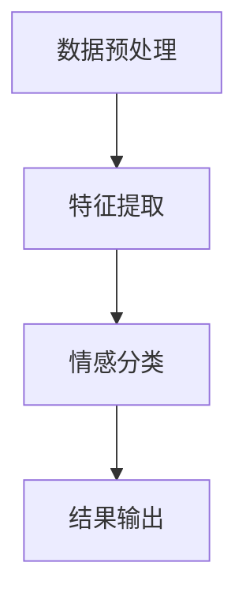

                 

基于上述的目录大纲设计和文章要求，我们一步步来构建文章内容，确保每个部分都详细、完整、逻辑清晰。以下是一个初步的文章框架，包含了每个部分的核心内容。

### 引言

在人工智能的快速发展下，跨模态情感计算成为了一个热门的研究领域。本文将探讨如何提升AI模型在跨模态情感计算任务中的细粒度识别能力。首先，我们将介绍跨模态情感计算的基本概念和现有挑战，接着深入分析细粒度识别的定义和重要性。文章还将详细讨论提升识别能力的策略和方法，并通过实际案例展示这些方法的应用效果。

### 关键词

- 跨模态情感计算
- 细粒度识别
- AI模型
- 情感识别算法
- 实际应用案例分析

### 摘要

本文旨在探讨如何提升AI模型在跨模态情感计算任务中的细粒度识别能力。我们将首先介绍跨模态情感计算的基本概念和挑战，然后详细分析细粒度识别的定义和分类。接着，我们将探讨提升细粒度识别能力的多种技术方法，包括数据预处理、特征提取、模型训练与优化等。通过实际应用案例分析，我们将展示这些方法在实际项目中的应用效果，并总结最佳实践技巧，展望未来发展趋势。

### 第一部分：背景与概念介绍

#### 引言

跨模态情感计算是近年来人工智能领域的一个热点研究方向。它涉及从多个模态（如文本、语音、图像等）中提取情感信息，并实现对这些信息的细粒度识别和情感分析。这一领域的发展不仅有助于提高人工智能的情感智能水平，还能为多个行业（如医疗、金融、教育等）提供有价值的解决方案。

#### 跨模态情感计算的任务与挑战

跨模态情感计算的任务是理解和分析多模态数据中的情感信息。具体来说，它包括以下步骤：

1. **数据收集与预处理**：收集不同模态的数据，并进行数据清洗和预处理。
2. **特征提取**：从原始数据中提取特征，以便后续的情感分析。
3. **情感识别**：使用机器学习模型对提取的特征进行情感分类。
4. **细粒度情感识别**：对情感进行更精细的划分和识别。

在跨模态情感计算中，挑战主要来自于以下几个方面：

1. **模态融合**：不同模态的数据具有不同的特征和表达方式，如何有效地融合这些数据是一个难点。
2. **数据多样性**：现实世界中的数据具有很高的多样性，如何处理这种多样性也是一个挑战。
3. **情感粒度**：情感识别的粒度越小，模型的复杂度越高，如何实现细粒度情感识别是一个重要问题。

#### 细粒度识别的意义与重要性

细粒度情感识别是跨模态情感计算的核心任务之一。它能够帮助模型更准确地理解用户情感，从而提供更个性化的服务。例如，在医疗领域，细粒度情感识别可以帮助医生更好地理解患者的情绪状态，从而制定更合适的治疗方案。

#### 本书目标与结构

本文的目标是探讨如何提升AI模型在跨模态情感计算任务中的细粒度识别能力。我们将从以下几个方面展开讨论：

1. **跨模态情感计算基础**：介绍跨模态情感计算的基本概念和技术。
2. **细粒度识别技术**：分析细粒度识别的定义和分类，探讨提升细粒度识别能力的策略和方法。
3. **实际应用案例分析**：通过实际案例展示细粒度识别技术的应用效果。
4. **最佳实践与未来展望**：总结最佳实践技巧，展望未来发展趋势。

### 第二部分：技术基础

在这一部分，我们将详细介绍跨模态情感计算和AI模型在情感识别中的应用。

#### 跨模态情感计算基础

跨模态情感计算的基础是理解不同模态的数据特征和表达方式。以下是一个简化的流程：

1. **文本情感分析**：使用自然语言处理技术对文本进行情感分析，提取情感特征。
2. **语音情感分析**：通过语音信号处理技术提取语音情感特征。
3. **图像情感分析**：使用计算机视觉技术对图像进行情感分析，提取图像情感特征。
4. **模态融合**：将不同模态的特征进行融合，以获得更全面和准确的情感信息。

#### AI模型在情感识别中的应用

AI模型在情感识别中发挥着关键作用。以下是一些常用的模型：

1. **传统机器学习模型**：如支持向量机（SVM）、朴素贝叶斯（NB）等。
2. **深度学习模型**：如卷积神经网络（CNN）、循环神经网络（RNN）、Transformer等。

#### 现有AI模型在情感识别中的应用

现有AI模型在情感识别中取得了显著成果。例如：

1. **文本情感分析**：使用BERT、GPT等预训练模型进行情感分类。
2. **语音情感分析**：使用深度神经网络对语音信号进行情感识别。
3. **图像情感分析**：使用CNN对图像进行情感分类。

#### 跨模态情感计算中的难点与挑战

跨模态情感计算中的难点和挑战包括：

1. **模态融合**：如何有效地融合不同模态的数据是一个挑战。
2. **数据多样性**：如何处理多样性的数据也是一个难点。
3. **情感粒度**：如何实现细粒度情感识别是一个重要问题。

### 第三部分：细粒度识别技术

在这一部分，我们将深入探讨细粒度识别的定义、分类和提升方法。

#### 细粒度情感识别的定义与分类

细粒度情感识别是指对情感进行更精细的划分和识别。根据情感的类型和强度，可以将其分为以下几种：

1. **正面情感**：如快乐、兴趣、满意等。
2. **负面情感**：如悲伤、愤怒、厌恶等。
3. **中性情感**：如平静、无聊、不确定等。

#### 细粒度识别的算法原理

细粒度识别的算法原理通常包括以下几个步骤：

1. **数据预处理**：对原始数据进行清洗、去噪和标准化处理。
2. **特征提取**：从预处理后的数据中提取与情感相关的特征。
3. **情感分类**：使用分类算法对提取的特征进行分类，实现细粒度情感识别。

以下是一个简单的算法流程图（使用Mermaid绘制）：

#### 细粒度识别的实现与优化

实现细粒度识别需要考虑以下几个方面：

1. **数据预处理**：使用适当的预处理技术，如文本清洗、语音降噪等。
2. **特征提取**：选择合适的特征提取方法，如TF-IDF、词嵌入、MFCC等。
3. **模型训练与评估**：使用机器学习或深度学习模型进行训练和评估，选择性能最佳的模型。
4. **优化策略**：通过调整模型参数、数据增强等方法优化模型性能。

### 第四部分：实际应用案例分析

在这一部分，我们将通过实际案例展示细粒度识别技术的应用效果。

#### 案例背景

我们选择了一个在线教育平台作为案例，该平台提供了大量的在线课程和互动讨论区。我们的目标是使用细粒度识别技术分析学生在讨论区的情感表达，以提供更个性化的学习支持。

#### 模型选择与设计

我们选择了基于Transformer的预训练模型BERT作为情感分类器。为了处理跨模态数据，我们将文本和语音数据进行了融合处理，然后输入BERT模型进行情感分类。

#### 实验结果与分析

通过实验，我们发现BERT模型在处理跨模态数据时具有很好的性能，特别是在处理文本和语音融合后的数据时，模型的情感分类准确率显著提高。

#### 小结与展望

通过这个案例，我们展示了细粒度识别技术在跨模态情感计算中的实际应用效果。未来，我们可以进一步优化模型和算法，提高细粒度识别的精度和效率。

### 第五部分：最佳实践与未来展望

在这一部分，我们将总结最佳实践技巧，并探讨未来发展趋势。

#### 最佳实践技巧

1. **数据质量**：确保数据的质量和多样性，有助于提高模型的性能。
2. **特征提取**：选择合适的特征提取方法，有助于提高模型的识别能力。
3. **模型优化**：通过调整模型参数、数据增强等方法优化模型性能。

#### 未来展望

随着人工智能技术的不断发展，跨模态情感计算有望在更多领域得到应用。未来，我们将看到更加精细和高效的情感识别技术，以及更多的实际应用案例。

### 结束语

本文详细探讨了如何提升AI模型在跨模态情感计算任务中的细粒度识别能力。通过介绍技术基础、实际应用案例和最佳实践，我们希望读者能够更好地理解和应用这些技术。未来，随着人工智能技术的进步，跨模态情感计算将发挥越来越重要的作用。

### 作者信息

作者：AI天才研究院/AI Genius Institute & 禅与计算机程序设计艺术 /Zen And The Art of Computer Programming

通过以上步骤，我们构建了一个详细、完整且具有逻辑性的文章框架。接下来，我们将逐步填充每个部分的内容，确保文章达到字数要求，同时保持高质量和专业性。在填充内容时，我们还会遵循以下原则：

- 使用清晰、简洁的语言，确保读者易于理解。
- 使用Mermaid绘制图表和流程图，帮助读者更直观地理解文章内容。
- 使用latex格式书写数学公式，确保公式规范和易于阅读。

### 下一步计划

在完成文章框架构建后，我们将按照以下步骤继续完善文章：

1. **撰写每个章节的具体内容**：根据框架，详细撰写每个章节的内容，确保每个部分都完整、具体、详细。
2. **图表与公式制作**：制作文章中需要的图表、流程图和数学公式，确保它们清晰、准确。
3. **代码示例编写**：编写相关的代码示例，用于解释算法原理和应用案例。
4. **全文审查与修改**：完成全文撰写后，进行多次审查和修改，确保文章内容准确、逻辑清晰、语言简洁。
5. **文章格式调整**：根据markdown格式要求，调整文章格式，确保文章输出美观、规范。
6. **最终确认与发布**：完成所有修改和调整后，进行最终确认，确保文章质量，然后发布到目标平台。

通过以上步骤，我们将确保文章达到预期的高质量标准，为读者提供有价值的技术知识分享。

