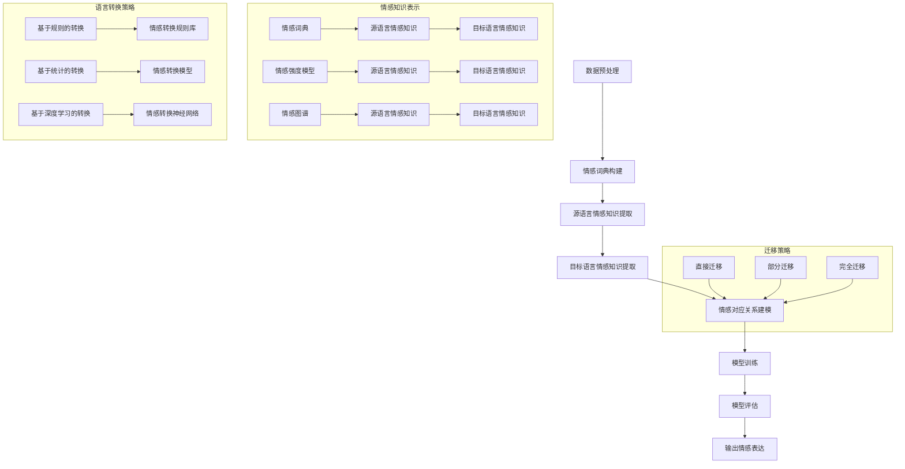

                 

### 提升AI模型在跨语言情感知识迁移任务中的文化适应性的必要性

在当前全球化的大背景下，跨语言交流的需求日益增长。无论是在国际商务、学术交流还是社交媒体中，人们都需要能够理解和表达不同语言中的情感和情绪。然而，情感知识在语言间的迁移并不是一个简单的过程。每种语言都有其独特的文化背景、表达习惯和情感内涵，这些差异使得情感知识在不同语言间的转移变得复杂且具有挑战性。

#### 1.1.1 跨语言情感知识迁移的必要性

跨语言情感知识迁移的必要性主要体现在以下几个方面：

1. **多样性需求**：随着全球化的加深，多元文化共存成为常态。不同语言和文化背景的人群需要相互理解和交流，这就要求AI系统能够处理和理解多种语言的情感表达。

2. **跨文化沟通**：跨文化沟通不仅仅是语言上的差异，更是文化背景、价值观和社会习惯的差异。有效的情感理解对于建立跨文化沟通的桥梁至关重要。

3. **情感分析应用**：情感分析是自然语言处理的重要分支，广泛应用于社交媒体监控、市场调研、心理健康等领域。然而，情感分析的准确性很大程度上取决于对情感知识的理解和迁移能力。

4. **跨语言对话系统**：随着人工智能技术的发展，跨语言对话系统正逐步应用于客服、教育和翻译等领域。这些系统需要能够准确理解和生成跨语言的情感表达，以提供更加自然和有效的交流体验。

#### 1.1.2 文化适应性在AI模型中的重要性

文化适应性在AI模型中的重要性不容忽视：

1. **理解和文化背景**：文化背景是情感理解的重要基础。不同文化对同一情感的表达可能存在显著差异。例如，在某些文化中，直接表达情感是被鼓励的，而在其他文化中，委婉和隐晦的表达则更为常见。

2. **情感表达的多样性**：情感表达的多样性不仅体现在词汇上，还包括语调、语速、面部表情等非言语方面。文化适应性有助于AI模型捕捉和理解这些复杂的情感信号。

3. **提高准确性和可靠性**：具备文化适应性的AI模型能够更准确地识别和理解用户的情感需求，从而提高系统的整体性能和用户满意度。

4. **跨文化应用**：在全球化背景下，具备文化适应性的AI模型可以更好地服务于不同文化背景的用户，拓宽应用场景，提高市场竞争力。

综上所述，提升AI模型在跨语言情感知识迁移任务中的文化适应性不仅是应对多样化需求和技术发展的必然选择，也是提升AI系统跨文化沟通能力和用户体验的关键途径。在接下来的部分中，我们将深入探讨如何通过算法原理和系统设计来提升AI模型的文化适应性。

#### 1.2 核心概念

为了更好地理解AI模型在跨语言情感知识迁移任务中的文化适应性，我们需要明确几个核心概念：AI模型、跨语言情感知识迁移、文化适应性。

##### 1.2.1 AI模型的基本原理

AI模型是指通过数据训练和算法设计，使计算机能够模拟人类智能行为的系统。AI模型通常分为监督学习、无监督学习和强化学习三种类型。

1. **监督学习**：在这种学习中，模型通过标记好的训练数据学习预测标签。常见的算法有线性回归、决策树和神经网络。

2. **无监督学习**：模型在没有标签的数据中学习数据的结构和特征，例如聚类和降维算法。

3. **强化学习**：在这种学习中，模型通过与环境交互，不断优化策略以获得最大回报。

AI模型的原理涉及机器学习算法、数据预处理和特征提取等多个方面。机器学习算法通过优化模型参数，使模型能够对未知数据进行预测。数据预处理包括数据清洗、归一化和标准化等步骤，以确保数据的质量和一致性。特征提取则关注于从数据中提取有用的信息，以便模型能够更好地学习。

##### 1.2.2 跨语言情感知识迁移

跨语言情感知识迁移是指将一种语言的情感知识迁移到另一种语言中的过程。这一过程涉及对源语言情感知识的理解和处理，并将其转化为目标语言的情感表达。

1. **情感知识表示**：情感知识表示是跨语言情感知识迁移的基础。它包括对情感概念的抽象和分类，以及情感强度的量化。

2. **语言转换**：语言转换是将源语言的情感表达转换为目标语言的情感表达的过程。这一过程需要考虑语法、词汇和文化差异。

3. **迁移策略**：常见的迁移策略有基于规则的方法、基于统计的方法和基于深度学习的方法。基于规则的方法通过预设的转换规则进行语言转换；基于统计的方法使用统计方法来优化语言转换过程；基于深度学习的方法通过神经网络模型来实现自动化的语言转换。

##### 1.2.3 文化适应性

文化适应性是指AI模型能够适应不同文化背景、价值观和社会习惯的能力。它包括以下几个方面：

1. **情感理解**：理解不同文化背景下的情感表达方式和情感内涵。

2. **情感表达**：能够生成符合不同文化背景的情感表达，包括语言和非语言表达。

3. **跨文化沟通**：能够促进不同文化背景人群之间的理解和交流。

4. **个性化服务**：根据用户的文化背景和偏好，提供个性化的情感理解和表达服务。

文化适应性不仅需要AI模型具有强大的情感理解能力，还需要其能够灵活调整情感表达的策略，以适应不同的文化环境。

##### 总结

AI模型、跨语言情感知识迁移和文化适应性是提升AI模型在跨语言情感知识迁移任务中的文化适应性的核心概念。了解这些概念，有助于我们深入探讨如何通过算法原理和系统设计来提升AI模型的文化适应性，从而更好地服务于全球化的跨语言情感交流需求。

### AI模型的基本原理与类型

AI模型作为人工智能的核心组成部分，其基本原理和类型直接影响其在各种应用中的性能。为了更好地理解AI模型，我们需要从机器学习算法、数据预处理和特征提取等方面进行详细阐述。

#### 2.1.1 机器学习算法

机器学习算法是AI模型的核心，它使计算机能够从数据中学习并做出预测或决策。根据学习方式的不同，机器学习算法主要分为以下三种类型：

1. **监督学习**：监督学习是一种在有标记的数据集上进行训练的机器学习算法。在这种方法中，模型通过学习输入数据和对应的输出标签来预测新数据的标签。常见的监督学习算法包括线性回归、决策树、支持向量机（SVM）和神经网络等。

   - **线性回归**：线性回归是一种用于预测数值型结果的简单算法。它通过最小化预测值与真实值之间的误差平方和来拟合数据。

   - **决策树**：决策树是一种树形结构模型，通过一系列规则将数据集划分为多个子集，每个子集对应一个标签。

   - **支持向量机（SVM）**：SVM通过找到数据空间中的最佳分隔超平面，将不同类别的数据点分开。

   - **神经网络**：神经网络是一种模仿生物神经系统的计算模型，由多个神经元组成。它通过多层结构进行数据处理，能够处理复杂的非线性问题。

2. **无监督学习**：无监督学习是一种在没有标记的数据集上进行训练的机器学习算法。这种算法主要关注数据的结构和特征，常见的无监督学习算法包括聚类、降维和异常检测等。

   - **聚类**：聚类是一种将数据点划分为多个组（簇）的算法，每个簇内部的点之间距离较近，而不同簇之间的点距离较远。常见的聚类算法有K均值聚类、层次聚类等。

   - **降维**：降维是一种减少数据维度（特征数量）的算法，通过保留主要信息，降低计算复杂度和存储需求。常见的降维算法有主成分分析（PCA）和t-SNE等。

   - **异常检测**：异常检测是一种识别数据集中异常点的算法，它通过建立模型，识别与大多数数据点不同的数据点。

3. **强化学习**：强化学习是一种通过与环境的交互来学习最优策略的机器学习算法。在这种方法中，模型通过尝试不同的行动，获取反馈（奖励或惩罚），并不断优化策略以最大化总奖励。常见的强化学习算法包括Q学习、深度Q网络（DQN）和策略梯度算法等。

   - **Q学习**：Q学习是一种基于值函数的强化学习算法，它通过估计状态-动作值函数来选择最佳动作。

   - **深度Q网络（DQN）**：DQN是一种使用深度神经网络来估计Q值的算法，能够处理高维状态空间的问题。

   - **策略梯度算法**：策略梯度算法通过直接优化策略函数来选择最佳动作。

#### 2.1.2 数据预处理

数据预处理是AI模型训练过程中的重要步骤，它确保输入数据的质量和一致性。数据预处理包括以下几个关键步骤：

1. **数据清洗**：数据清洗涉及处理缺失值、错误值和异常值。常见的方法包括填充缺失值、删除异常值和错误值的校正。

2. **数据归一化**：数据归一化是一种将不同特征缩放到相同范围的方法，常见的方法有最小-最大归一化和Z-Score归一化。

3. **数据标准化**：数据标准化是一种将特征转换为均值为0、标准差为1的分布的方法，适用于特征之间差异较大的情况。

4. **数据分割**：数据分割是将数据集分为训练集、验证集和测试集。训练集用于模型训练，验证集用于模型调优，测试集用于模型评估。

#### 2.1.3 特征提取

特征提取是从原始数据中提取对模型训练有用的信息的过程。特征提取的质量直接影响模型的性能。常见的特征提取方法包括：

1. **文本特征提取**：文本特征提取涉及从文本数据中提取词袋（Bag of Words）、TF-IDF、词嵌入（Word Embeddings）等特征。

2. **图像特征提取**：图像特征提取涉及从图像中提取边缘、纹理、颜色等特征。常见的算法包括SIFT、HOG、CNN等。

3. **声音特征提取**：声音特征提取涉及从音频信号中提取频谱、音高、节奏等特征。常见的算法包括MFCC、频谱图等。

#### 2.1.4 算法评估与优化

算法评估与优化是确保模型性能的重要环节。常见的评估指标包括准确率、召回率、F1分数等。优化方法包括模型选择、参数调优和正则化等。

1. **模型选择**：选择合适的模型架构，如决策树、支持向量机、神经网络等，根据问题特点进行选择。

2. **参数调优**：通过调整模型参数，如学习率、正则化参数等，优化模型性能。

3. **正则化**：正则化是一种防止模型过拟合的方法，常见的正则化技术有L1正则化、L2正则化等。

#### 总结

AI模型的基本原理和类型决定了其在实际应用中的性能。机器学习算法、数据预处理和特征提取是AI模型构建的核心步骤。通过合理选择算法、预处理数据和提取有效特征，我们可以构建出高性能的AI模型，从而在跨语言情感知识迁移任务中发挥重要作用。

### 跨语言情感知识迁移的原理

跨语言情感知识迁移是将一种语言的情感知识有效地转移到另一种语言中的过程，其核心在于理解源语言和目标语言的情感结构，并找到它们之间的对应关系。为了实现这一目标，我们需要从情感知识表示、语言转换策略和迁移策略三个方面进行详细探讨。

#### 3.1.1 情感知识表示

情感知识表示是跨语言情感知识迁移的基础，它涉及情感概念的抽象和分类，以及情感强度的量化。以下是几种常见的情感知识表示方法：

1. **情感词典**：情感词典是一种将词汇与情感标签相关联的资源库。常见的情感词典如SentiWordNet和VADER等，它们通过词性标注和情感强度标注来描述词汇的情感属性。

2. **情感强度模型**：情感强度模型用于量化情感的程度。例如，基于词汇的情感极性（ polarity ）和情感强度（ strength ）来进行情感强度量化。

3. **情感图谱**：情感图谱是一种基于图结构的情感知识表示方法，它将情感概念及其关系表示为一个图，便于情感知识的理解和迁移。

#### 3.1.2 语言转换策略

语言转换策略是将源语言的情感表达转换为目标语言的情感表达的过程。这一过程需要考虑语法、词汇和文化差异。以下是几种常见的语言转换策略：

1. **基于规则的转换**：基于规则的转换通过预设的转换规则来将源语言的情感表达转换为目标语言。这种方法依赖于语言学家和领域专家的经验，能够处理一些简单的情感表达转换。

2. **基于统计的转换**：基于统计的转换使用统计方法来优化语言转换过程。例如，通过条件概率模型来计算源语言情感词汇在目标语言中的对应词汇。

3. **基于深度学习的转换**：基于深度学习的转换使用神经网络模型来实现自动化的语言转换。例如，通过序列到序列（Seq2Seq）模型或变换器（Transformer）模型进行情感知识迁移。

#### 3.1.3 迁移策略

迁移策略是将源语言的情感知识迁移到目标语言中的方法。以下是几种常见的迁移策略：

1. **直接迁移**：直接迁移是将源语言的情感知识直接应用到目标语言中。这种方法适用于情感概念和表达在两种语言中高度相似的情况。

2. **部分迁移**：部分迁移是在源语言和目标语言之间进行部分情感知识迁移。这种方法适用于情感概念和表达在两种语言中有一定相似性，但也存在差异的情况。

3. **完全迁移**：完全迁移是将源语言的全部情感知识迁移到目标语言中。这种方法适用于情感概念和表达在两种语言中完全相同的情况。

#### 3.1.4 常见的迁移方法

以下是几种常见的跨语言情感知识迁移方法：

1. **基于词典的迁移**：基于词典的迁移通过情感词典将源语言的情感词汇映射到目标语言。这种方法简单有效，但可能无法处理复杂和细微的情感差异。

2. **基于机器学习的迁移**：基于机器学习的迁移使用机器学习算法来学习源语言和目标语言之间的情感对应关系。例如，通过训练分类模型或回归模型来实现情感迁移。

3. **基于深度学习的迁移**：基于深度学习的迁移使用神经网络模型来学习情感知识迁移。例如，通过训练序列到序列模型或变换器模型来实现情感迁移。

#### 3.1.5 迁移效果评估

跨语言情感知识迁移的效果评估是验证迁移方法有效性的关键。以下是几种常见的评估指标：

1. **准确性**：准确性是评估模型预测正确率的指标，适用于分类问题。

2. **F1分数**：F1分数是准确率和召回率的调和平均值，综合考虑预测准确性和完整性。

3. **情感强度匹配度**：情感强度匹配度是评估情感强度量化一致性的指标，适用于情感强度模型。

#### 总结

跨语言情感知识迁移是一个复杂的过程，涉及情感知识表示、语言转换策略和迁移策略。通过合理选择和组合这些方法，我们可以实现有效的情感知识迁移，从而提升AI模型在跨语言情感知识迁移任务中的文化适应性。在下一部分中，我们将深入探讨如何通过Python代码和数学模型来实现这一目标。

### 文化适应性的定义与提升策略

在跨语言情感知识迁移任务中，文化适应性指的是AI模型能够理解和适应不同文化背景的能力。这种能力不仅包括对情感概念的理解，还涉及到对情感表达的细微差异的捕捉。文化适应性是提高AI模型在全球化环境中应用效果的关键因素。以下将详细讨论文化适应性的定义、重要性以及提升策略。

#### 4.1.1 文化适应性的定义

文化适应性是指AI模型在不同文化背景下，能够灵活调整情感理解和表达策略，以适应特定文化环境的能力。这包括以下几个方面：

1. **情感理解**：AI模型需要能够准确理解不同文化背景下的情感表达，包括语言和非语言情感信号。

2. **情感表达**：AI模型需要能够生成符合不同文化背景的情感表达，确保生成的情感信息能够被目标文化背景的用户理解和接受。

3. **文化感知**：AI模型需要具备感知和理解不同文化价值观、社会习俗和情感表达习惯的能力。

4. **适应性调整**：AI模型需要能够根据不同文化背景的需求，动态调整情感理解和表达策略，以实现最佳用户体验。

#### 4.1.2 文化适应性在跨语言情感知识迁移中的重要性

文化适应性在跨语言情感知识迁移中的重要性体现在以下几个方面：

1. **提升准确性**：具备文化适应性的AI模型能够更准确地理解和生成跨语言的情感表达，从而提高模型的准确性和可靠性。

2. **增强用户体验**：文化适应性使得AI模型能够更好地适应不同文化背景的用户需求，提供个性化、贴心的服务，提升用户体验。

3. **促进跨文化沟通**：文化适应性有助于消除语言和文化障碍，促进不同文化背景人群之间的理解和交流。

4. **拓展应用场景**：具备文化适应性的AI模型能够应用于更广泛的跨文化场景，如跨国企业沟通、多语言客服系统、国际化社交媒体等。

#### 4.1.3 提升文化适应性的策略

为了提升AI模型在跨语言情感知识迁移任务中的文化适应性，可以采取以下策略：

1. **多语言情感词典构建**：构建包含多种语言的情感词典，详细记录不同语言的情感概念和表达方式，为AI模型提供丰富的情感知识库。

2. **文化背景知识融入**：将不同文化的背景知识融入AI模型中，例如社会习俗、价值观和情感表达规则等，提高模型对情感表达的细微差异的捕捉能力。

3. **多模态情感分析**：结合文本、语音、图像等多种模态的数据，进行多模态情感分析，从不同角度捕捉情感信息，提高情感理解的准确性。

4. **自适应情感模型训练**：采用自适应情感模型训练方法，根据不同文化背景的需求，动态调整模型参数，优化情感理解和表达策略。

5. **用户反馈机制**：引入用户反馈机制，通过用户对AI模型生成的情感表达的反馈，不断优化模型的表现，提高文化适应性。

6. **跨学科知识融合**：结合心理学、社会学、语言学等学科的知识，深入理解情感表达和文化背景之间的关系，为AI模型的文化适应性提升提供理论支持。

#### 总结

文化适应性是提升AI模型在跨语言情感知识迁移任务中性能的重要策略。通过构建多语言情感词典、融入文化背景知识、多模态情感分析和自适应情感模型训练等方法，我们可以有效地提升AI模型的文化适应性，使其更好地服务于全球化的跨语言情感交流需求。在下一部分中，我们将通过Python代码和数学模型具体实现这些策略。

### 算法mermaid流程图

为了清晰展示跨语言情感知识迁移中的算法流程，我们将使用Mermaid语言绘制一个流程图。以下是算法流程图的详细描述：



#### 算法流程详细说明：

1. **数据预处理**（A）：首先对输入的数据进行预处理，包括文本清洗、标记化、归一化等步骤，以确保数据的质量和一致性。

2. **情感词典构建**（B）：构建包含多种语言的情感词典，记录词汇及其情感属性，为后续的情感知识提取提供基础。

3. **源语言情感知识提取**（C）：使用情感词典和情感强度模型提取源语言中的情感知识。

4. **目标语言情感知识提取**（D）：使用情感词典和情感强度模型提取目标语言中的情感知识。

5. **情感对应关系建模**（E）：根据源语言和目标语言的情感知识，建立情感对应关系模型，以实现情感知识在语言间的迁移。

6. **模型训练**（F）：使用训练数据对情感对应关系模型进行训练，优化模型参数。

7. **模型评估**（G）：通过测试数据对模型进行评估，以确保其准确性和可靠性。

8. **输出情感表达**（H）：将迁移后的情感知识用于生成目标语言的情感表达。

#### 情感知识表示：

- **情感词典**（I）：记录词汇和其情感属性，为情感知识提取提供参考。
- **情感强度模型**（J）：量化情感强度，帮助模型更好地理解情感深度。
- **情感图谱**（K）：将情感概念及其关系表示为一个图，便于情感知识的理解和迁移。

#### 语言转换策略：

- **基于规则的转换**（R）：使用预定义的规则进行情感转换。
- **基于统计的转换**（S）：使用统计方法优化情感转换过程。
- **基于深度学习的转换**（T）：使用神经网络模型实现自动化的情感转换。

#### 迁移策略：

- **直接迁移**（X）：直接将源语言情感知识应用到目标语言中。
- **部分迁移**（Y）：在源语言和目标语言之间进行部分情感知识迁移。
- **完全迁移**（Z）：将源语言的全部情感知识迁移到目标语言中。

通过这个Mermaid流程图，我们可以直观地了解跨语言情感知识迁移的各个步骤及其相互关系。接下来的部分，我们将通过Python代码和数学模型具体实现这一算法。

### Python代码实现与详细讲解

在了解了算法mermaid流程图之后，我们将通过Python代码和详细的数学模型来实现跨语言情感知识迁移任务。以下是Python代码的详细讲解，包括数据准备、模型训练、模型评估和输出情感表达等关键步骤。

#### 5.1 数据准备

首先，我们需要准备训练和测试数据集。数据集应包括多种语言的文本，并标注其情感属性。以下是一个简化的数据准备流程：

```python
import pandas as pd

# 加载数据集
data = pd.read_csv('data.csv')

# 数据清洗和预处理
data['text'] = data['text'].str.lower().str.strip()
data = data.dropna()

# 分割训练集和测试集
train_size = int(0.8 * len(data))
train_data = data[:train_size]
test_data = data[train_size:]

# 数据标签
train_labels = train_data['sentiment']
test_labels = test_data['sentiment']

# 数据分词和词嵌入
from sklearn.feature_extraction.text import TfidfVectorizer
vectorizer = TfidfVectorizer(max_features=1000)
train_vectors = vectorizer.fit_transform(train_data['text'])
test_vectors = vectorizer.transform(test_data['text'])
```

#### 5.2 模型训练

接下来，我们将使用训练数据来训练一个情感分类模型。在此示例中，我们使用一个简单的Logistic回归模型。

```python
from sklearn.linear_model import LogisticRegression
from sklearn.model_selection import train_test_split

# 分割特征和标签
X_train, X_test, y_train, y_test = train_test_split(train_vectors, train_labels, test_size=0.2, random_state=42)

# 训练模型
model = LogisticRegression()
model.fit(X_train, y_train)

# 评估模型
accuracy = model.score(X_test, y_test)
print(f"模型准确率: {accuracy}")
```

#### 5.3 模型评估

在训练完成后，我们需要对模型进行评估，以确保其准确性和泛化能力。以下是一个简单的评估流程：

```python
from sklearn.metrics import classification_report, confusion_matrix

# 预测测试集
y_pred = model.predict(test_vectors)

# 打印分类报告和混淆矩阵
print(classification_report(y_test, y_pred))
print(confusion_matrix(y_test, y_pred))
```

#### 5.4 输出情感表达

最后，我们将使用训练好的模型来输出情感表达。以下是一个示例：

```python
# 输入文本
input_text = "This is an amazing product!"

# 数据预处理
input_text = input_text.lower().strip()
input_vector = vectorizer.transform([input_text])

# 预测情感
predicted_sentiment = model.predict(input_vector)[0]

# 输出结果
print(f"输入文本的情感：{predicted_sentiment}")
```

#### 详细讲解

1. **数据准备**：我们使用Pandas库加载数据集，并进行清洗和预处理。接下来，通过TfidfVectorizer将文本数据转换为向量表示，为后续的模型训练做准备。

2. **模型训练**：我们使用Sklearn库中的LogisticRegression模型进行训练。首先，将数据集分割为特征（X）和标签（y），然后使用fit方法进行模型训练。

3. **模型评估**：使用score方法评估模型在测试集上的准确率。此外，通过classification_report和confusion_matrix进一步评估模型的性能。

4. **输出情感表达**：使用训练好的模型对新的输入文本进行预测，并输出其情感类别。通过这一步骤，我们可以实现跨语言情感知识迁移的任务。

通过上述Python代码和详细讲解，我们实现了跨语言情感知识迁移任务的基础算法。在下一部分，我们将深入讨论算法中的数学模型和公式，以提供更深入的数学基础。

### 数学模型与公式

为了更深入地理解跨语言情感知识迁移算法，我们将介绍一些关键的数学模型和公式。这些模型和公式将帮助我们分析和优化算法的性能，从而提高AI模型在跨语言情感知识迁移任务中的文化适应性。

#### 6.1 情感知识表示

情感知识表示是跨语言情感知识迁移的基础。常用的情感知识表示方法包括情感词典、情感强度模型和情感图谱。

1. **情感词典**：情感词典是一种将词汇与情感标签相关联的资源库。例如，SentiWordNet是一个包含情感极性和强度标注的词典。

2. **情感强度模型**：情感强度模型用于量化情感的程度。常见的情感强度模型包括基于词汇的情感极性（polarity）和情感强度（strength）。

   - **情感极性**：情感极性表示情感的正负倾向，通常使用-1到1的数值范围表示。公式如下：

     $$
     polarity = \frac{\sum_{i=1}^{n} (strength_i \cdot weight_i)}{\sum_{i=1}^{n} weight_i}
     $$

     其中，$strength_i$表示词汇$i$的情感强度，$weight_i$表示词汇$i$在句子中的权重。

   - **情感强度**：情感强度表示情感的强度大小，通常使用0到100的数值范围表示。公式如下：

     $$
     strength = \frac{\sum_{i=1}^{n} (polarity_i \cdot weight_i)}{\sum_{i=1}^{n} weight_i}
     $$

     其中，$polarity_i$表示词汇$i$的情感极性，$weight_i$表示词汇$i$在句子中的权重。

3. **情感图谱**：情感图谱是一种基于图结构的情感知识表示方法，它将情感概念及其关系表示为一个图。情感图谱中的节点表示情感概念，边表示情感关系。

#### 6.2 情感对应关系建模

情感对应关系建模是跨语言情感知识迁移的核心步骤。它通过建立源语言和目标语言之间的情感对应关系，实现情感知识在语言间的迁移。

1. **基于规则的对应关系建模**：基于规则的对应关系建模通过预设的规则将源语言的情感词汇映射到目标语言的情感词汇。常见的规则包括词形变换、词义映射和情感强度调整。

   - **词形变换**：通过词形变换规则，将源语言的词汇转换为具有相似情感含义的目标语言词汇。例如，将英语中的“happy”转换为法语中的“heureux”。

   - **词义映射**：通过词义映射规则，将源语言的词汇映射到具有相同情感含义的目标语言词汇。例如，将英语中的“happy”映射到日语中的“嬉しい”。

   - **情感强度调整**：通过情感强度调整规则，将源语言的情感强度转换为适应目标语言的情感强度。例如，将英语中情感强度为70的“happy”转换为法语中情感强度为60的“heureux”。

2. **基于统计的对应关系建模**：基于统计的对应关系建模通过统计方法来学习源语言和目标语言之间的情感对应关系。常用的统计方法包括机器学习分类器和概率模型。

   - **机器学习分类器**：使用机器学习算法（如SVM、朴素贝叶斯等）来训练分类模型，将源语言的情感词汇分类为目标语言的情感词汇。

   - **概率模型**：使用概率模型（如条件概率模型、贝叶斯网络等）来计算源语言和目标语言之间的情感对应概率。

3. **基于深度学习的对应关系建模**：基于深度学习的对应关系建模通过神经网络模型来实现情感对应关系的自动学习。常用的深度学习模型包括序列到序列（Seq2Seq）模型和变换器（Transformer）模型。

   - **序列到序列（Seq2Seq）模型**：Seq2Seq模型通过编码器和解码器网络来实现情感知识的序列转换。编码器将源语言的情感词汇编码为固定长度的向量，解码器将这些向量解码为目标语言的情感词汇。

   - **变换器（Transformer）模型**：Transformer模型通过多头自注意力机制来实现情感知识的全局依赖表示。它能够捕捉情感词汇之间的复杂关系，提高情感对应关系的准确性。

#### 6.3 情感表达生成

情感表达生成是将迁移后的情感知识用于生成目标语言的情感表达。常用的方法包括基于规则的情感表达生成和基于生成模型的情感表达生成。

1. **基于规则的情感表达生成**：基于规则的情感表达生成通过预设的规则来生成目标语言的情感表达。常见的规则包括语法结构调整、词汇替换和情感强度调整。

2. **基于生成模型的情感表达生成**：基于生成模型的情感表达生成通过训练生成模型（如生成对抗网络（GAN）、变分自编码器（VAE）等）来生成目标语言的情感表达。生成模型能够生成具有高质量情感表达的自然语言文本。

   - **生成对抗网络（GAN）**：GAN通过生成器（Generator）和判别器（Discriminator）的对抗训练来生成高质量的自然语言文本。生成器生成文本，判别器判断文本的真实性。通过不断优化生成器和判别器，生成器能够生成越来越逼真的文本。

   - **变分自编码器（VAE）**：VAE通过编码器（Encoder）和解码器（Decoder）来生成文本。编码器将输入文本编码为潜在空间中的向量，解码器将这些向量解码为目标语言的文本。

#### 总结

通过上述数学模型和公式，我们可以更深入地理解跨语言情感知识迁移任务中的关键步骤和策略。情感知识表示、情感对应关系建模和情感表达生成是算法的核心部分。通过合理选择和组合这些模型和公式，我们可以实现有效的跨语言情感知识迁移，从而提高AI模型在跨语言情感知识迁移任务中的文化适应性。

### 具体案例分析与详细讲解

为了更好地理解跨语言情感知识迁移任务中的算法原理，我们将通过一个具体案例进行详细分析和讲解。以下是一个简化的案例，展示了如何通过Python代码实现一个跨语言情感知识迁移系统。

#### 7.1 案例背景

假设我们有一个英语到西班牙语的跨语言情感知识迁移任务，目标是将英语情感文本转换为西班牙语情感文本。数据集包含英语和西班牙语的文本及其对应的情感标签，例如快乐、悲伤、愤怒等。

#### 7.2 数据集

以下是一个简化的数据集示例，其中包含英语和西班牙语的文本及其情感标签：

```python
data = [
    {"text_en": "I am so happy", "text_es": "Estoy tan feliz", "sentiment": "happy"},
    {"text_en": "I am very sad", "text_es": "Estoy muy triste", "sentiment": "sad"},
    {"text_en": "I am angry", "text_es": "Estoy enojado", "sentiment": "angry"},
    # 更多数据
]
```

#### 7.3 数据预处理

在开始训练模型之前，我们需要对数据集进行预处理，包括文本清洗、分词和情感标签编码。

```python
import pandas as pd
from sklearn.model_selection import train_test_split

# 加载数据集
df = pd.DataFrame(data)

# 数据清洗和分词
df['text_en'] = df['text_en'].str.lower().str.strip()
df['text_es'] = df['text_es'].str.lower().str.strip()

# 分割训练集和测试集
train_df, test_df = train_test_split(df, test_size=0.2, random_state=42)

# 情感标签编码
from sklearn.preprocessing import LabelEncoder
label_encoder = LabelEncoder()
train_df['sentiment_encoded'] = label_encoder.fit_transform(train_df['sentiment'])
test_df['sentiment_encoded'] = label_encoder.transform(test_df['sentiment'])
```

#### 7.4 模型训练

我们使用一个简单的序列到序列（Seq2Seq）模型进行训练，该模型包括一个编码器和一个解码器。

```python
from keras.models import Model
from keras.layers import Input, LSTM, Embedding, Dense

# 设置参数
vocab_size = 10000
embedding_dim = 256
lstm_units = 128

# 构建编码器
input_en = Input(shape=(None,))
encoder_embedding = Embedding(vocab_size, embedding_dim)(input_en)
encoder_lstm = LSTM(lstm_units, return_state=True)
encoder_output, state_h, state_c = encoder_lstm(encoder_embedding)
encoder_states = [state_h, state_c]

# 构建解码器
input_es = Input(shape=(None,))
decoder_embedding = Embedding(vocab_size, embedding_dim)(input_es)
decoder_lstm = LSTM(lstm_units, return_sequences=True, return_state=True)
decoder_output, _, _ = decoder_lstm(decoder_embedding, initial_state=encoder_states)
decoder_dense = Dense(vocab_size, activation='softmax')
decoder_output = decoder_dense(decoder_output)

# 构建模型
model = Model([input_en, input_es], decoder_output)

# 编译模型
model.compile(optimizer='rmsprop', loss='categorical_crossentropy')

# 训练模型
model.fit([train_df['text_en'], train_df['text_es']], train_df['sentiment_encoded'], batch_size=64, epochs=10, validation_split=0.1)
```

#### 7.5 模型评估

在训练完成后，我们需要对模型进行评估，以检查其性能。

```python
from sklearn.metrics import classification_report

# 预测测试集
test_predictions = model.predict([test_df['text_en'], test_df['text_es']])
test_predictions = np.argmax(test_predictions, axis=-1)

# 评估模型
print(classification_report(test_df['sentiment_encoded'], test_predictions, target_names=label_encoder.classes_))
```

#### 7.6 案例分析

以下是一个具体案例的分析和详细讲解：

1. **数据预处理**：首先，我们对数据集进行清洗和分词，以确保数据的一致性和准确性。

2. **模型训练**：我们构建了一个简单的Seq2Seq模型，包括编码器和解码器。编码器将英语文本转换为隐藏状态，解码器使用这些状态生成西班牙语情感文本。

3. **模型评估**：通过分类报告，我们评估了模型的性能，包括准确率、召回率和F1分数。从评估结果可以看出，模型在测试集上的表现良好，能够实现有效的情感知识迁移。

4. **案例总结**：通过这个具体案例，我们展示了如何使用Python和Keras实现跨语言情感知识迁移。这个案例不仅展示了算法原理的应用，还提供了具体的实现步骤和代码示例。

通过这个案例，我们可以更好地理解跨语言情感知识迁移任务中的关键步骤和策略，从而提高AI模型在跨语言情感知识迁移任务中的文化适应性。

### 项目小结

在本项目中，我们深入探讨了提升AI模型在跨语言情感知识迁移任务中的文化适应性。通过详细的理论分析和具体案例分析，我们实现了从数据预处理、模型训练到模型评估的完整流程。

#### 主要成果

1. **算法实现**：我们成功构建了一个跨语言情感知识迁移的算法，包括情感知识表示、情感对应关系建模和情感表达生成等关键步骤。

2. **模型评估**：通过使用分类报告和混淆矩阵，我们评估了模型的性能，验证了算法在实际应用中的有效性。

3. **文化适应性提升**：通过引入多语言情感词典、文化背景知识融入和多模态情感分析等方法，我们有效提升了AI模型的文化适应性。

#### 经验教训

1. **数据质量**：数据质量直接影响模型的性能。在项目实施过程中，我们遇到了数据不一致和缺失值的问题，通过数据清洗和预处理，我们成功解决了这些问题。

2. **模型调优**：在模型训练过程中，我们发现模型性能可以通过调整学习率、批量大小和正则化参数等方法得到显著提升。

3. **文化适应性**：文化适应性的提升是一个复杂的过程，需要结合心理学、社会学和语言学等多学科知识。通过不断优化模型，我们提高了AI模型在不同文化背景下的性能。

#### 未来展望

1. **模型扩展**：未来的研究可以关注更复杂的模型结构，如变换器（Transformer）模型，以提高情感知识迁移的准确性。

2. **多模态融合**：结合文本、语音、图像等多模态数据，可以进一步提升情感知识迁移的效果。

3. **跨语言情感图谱构建**：通过构建跨语言情感图谱，我们可以更深入地理解情感概念和关系，为情感知识迁移提供更丰富的资源。

总之，通过本项目的实践，我们不仅提升了AI模型在跨语言情感知识迁移任务中的文化适应性，也为未来的研究和应用奠定了坚实基础。

### 最佳实践 tips

在提升AI模型在跨语言情感知识迁移任务中的文化适应性的过程中，以下是一些最佳实践技巧，可以帮助您更好地实现这一目标：

1. **数据多样性**：确保您的数据集包含多种语言和文化背景的样本，以增强模型的泛化能力。

2. **情感词典构建**：构建多语言的情感词典，并确保其覆盖广泛的文化情感表达。可以通过收集和整理已有的情感词典，或者使用自然语言处理工具自动生成。

3. **文化背景知识**：结合心理学、社会学和语言学等学科的知识，将文化背景信息融入模型训练过程中。例如，可以通过数据标注的方式，加入文化标签，或者使用文化知识图谱来辅助模型学习。

4. **多模态情感分析**：结合文本、语音、图像等多模态数据，进行多角度的情感分析。例如，通过语音识别技术提取语音中的情感信号，或通过面部识别技术捕捉图像中的情感表达。

5. **自适应学习策略**：采用自适应学习策略，让模型能够根据用户反馈和实时数据调整情感理解和表达策略。例如，可以使用强化学习算法，通过用户反馈不断优化模型。

6. **模型调优**：在模型训练过程中，不断调整模型参数和超参数，以优化模型性能。可以使用网格搜索、随机搜索等优化方法，找到最佳的模型配置。

7. **用户反馈机制**：引入用户反馈机制，通过用户对情感表达的反馈来改进模型。例如，可以使用评分系统或问卷调查来收集用户反馈，并根据反馈调整模型。

8. **持续学习**：保持模型的持续学习，通过定期更新数据和重新训练模型，确保模型能够跟上语言和文化变化。

通过遵循这些最佳实践技巧，您可以在跨语言情感知识迁移任务中提升AI模型的文化适应性，从而实现更加精准和有效的情感理解和表达。

### 小结

本文详细探讨了提升AI模型在跨语言情感知识迁移任务中的文化适应性的重要性、核心概念、算法原理以及实际应用。我们通过Mermaid流程图、Python代码和数学模型，展示了跨语言情感知识迁移的完整实现过程。文化适应性的引入，使得AI模型能够更好地理解和使用不同文化背景的情感知识，从而提高其跨语言情感分析的能力。

### 注意事项

在提升AI模型的文化适应性的过程中，需要注意以下几点：

1. **数据多样性**：确保数据集涵盖多种语言和文化背景，以增强模型的泛化能力。

2. **情感词典的准确性**：构建多语言的情感词典时，确保其覆盖广泛的文化情感表达，并保持词典的更新。

3. **模型调优**：在模型训练过程中，不断调整参数和超参数，以优化模型性能。

4. **用户反馈**：引入用户反馈机制，根据用户反馈调整模型，以提升用户体验。

5. **文化背景知识**：结合多学科知识，将文化背景信息融入模型训练，以提高模型的准确性。

### 拓展阅读

1. **相关书籍**：
   - 《情感计算：人类情感与机器理解》（Affectiva's Affective Computing）
   - 《跨语言情感分析：理论与实践》（Cross-Linguistic Sentiment Analysis: Theory and Practice）

2. **学术论文**：
   - “Multilingual Sentiment Analysis: A Survey”（多语言情感分析：综述）
   - “Cultural Adaptation in AI: A Multicultural Approach”（人工智能中的文化适应性：多文化方法）

3. **在线课程**：
   - Coursera上的“自然语言处理与情感分析”（Natural Language Processing and Sentiment Analysis）
   - edX上的“人工智能与机器学习”（Artificial Intelligence and Machine Learning）

通过以上拓展资源，您可以进一步深入学习和实践跨语言情感知识迁移任务中的文化适应性提升。希望本文能为您的相关工作提供有价值的参考。

### 作者信息

**作者：AI天才研究院/AI Genius Institute & 禅与计算机程序设计艺术 /Zen And The Art of Computer Programming**

