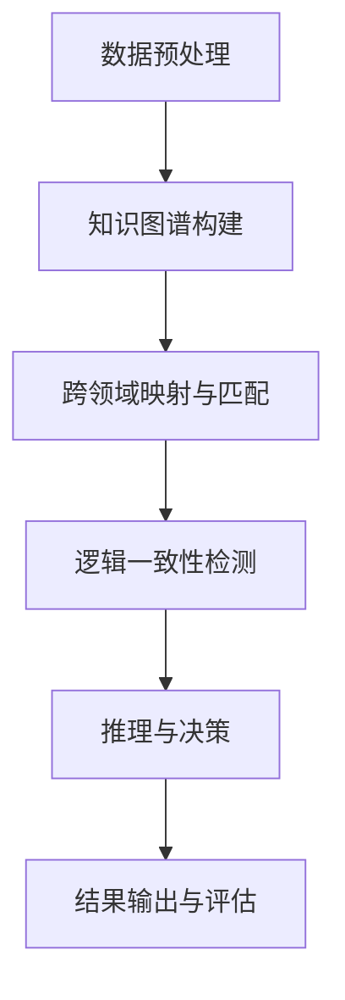

                 

### 第一部分：引言与背景

## 第1章：问题背景与定义

### 1.1 跨领域知识推理任务的重要性

在人工智能（AI）领域，知识推理是机器学习、自然语言处理（NLP）和其他技术的重要应用之一。随着数据量和复杂度的不断增长，跨领域知识推理成为了当前研究的热点和难点。跨领域知识推理任务涉及将不同领域（如医疗、法律、经济等）中的知识进行整合和利用，以解决跨领域的复杂问题。例如，医疗领域中的诊断问题可以借鉴法律领域的案件推理方式，从而提高诊断的准确性和效率。

跨领域知识推理的重要性主要体现在以下几个方面：

1. **知识整合与共享**：不同领域之间存在大量的知识交叉，通过跨领域知识推理可以实现知识的整合与共享，为解决复杂问题提供有力支持。
2. **问题解决效率**：跨领域知识推理可以快速提取和应用相关领域的知识，提高问题解决的速度和效率。
3. **创新与突破**：跨领域的知识融合往往能激发新的研究思路和创新点，推动科学技术的发展。

### 1.2 逻辑一致性问题及其影响

在跨领域知识推理任务中，逻辑一致性是一个关键问题。逻辑一致性指的是知识系统中的命题、规则或事实之间不存在逻辑冲突，能够共同推导出有效的结论。逻辑一致性问题的存在可能导致以下影响：

1. **推理错误**：当知识系统中存在逻辑冲突时，推理过程可能会产生错误的结论，影响推理的准确性。
2. **信任度下降**：逻辑一致性问题是评估AI系统可信度的重要指标之一。如果系统在跨领域推理中频繁出现逻辑冲突，将降低用户对系统的信任度。
3. **效率降低**：逻辑一致性问题的存在会增加推理过程的复杂度，降低推理效率。

因此，解决跨领域知识推理中的逻辑一致性问题具有重要的现实意义。

### 1.3 研究现状与挑战

当前，跨领域知识推理任务的研究已经取得了显著的进展，但仍面临许多挑战：

1. **数据源多样性**：跨领域知识推理涉及多个领域的数据源，这些数据源往往具有不同的结构、格式和语义，如何有效地整合和利用这些数据源是一个难题。
2. **知识表示**：如何将不同领域的知识表示为统一的语义模型，以支持跨领域的推理和知识融合，是当前研究的一个重点。
3. **逻辑一致性检测**：检测知识系统中的逻辑一致性是一个复杂的问题，涉及多种逻辑理论和方法，如何选择合适的方法和算法仍需进一步研究。
4. **推理效率**：在保证逻辑一致性的同时，如何提高推理效率，以满足实际应用的需求，是一个重要的研究课题。

### 1.4 本书目标与结构

本书旨在系统性地探讨提升AI模型在跨领域知识推理任务中的逻辑一致性问题。具体目标如下：

1. **核心概念介绍**：介绍跨领域知识推理和逻辑一致性的基本概念，为后续章节的讨论打下基础。
2. **算法原理与实现**：详细介绍跨领域知识推理中的关键算法原理，包括数学模型、公式和代码实现。
3. **系统设计与实现**：探讨跨领域知识推理系统的架构设计和实现，包括问题场景介绍、系统功能设计、系统架构设计、接口设计与交互。
4. **项目实战**：通过实际项目案例，展示如何在实际应用中实现跨领域知识推理，并提供详细的分析和讲解。
5. **最佳实践与拓展**：总结最佳实践经验，提出注意事项，并探讨未来研究方向。

本书结构如下：

- **第1章：引言与背景**：介绍跨领域知识推理任务的重要性、逻辑一致性问题及其影响、研究现状与挑战，以及本书的目标和结构。
- **第2章：核心概念与联系**：介绍逻辑一致性的概念、跨领域知识推理相关概念以及逻辑一致性在跨领域知识推理中的应用。
- **第3章：算法原理与流程**：介绍跨领域知识推理中的基础算法原理和代码实现。
- **第4章：数学模型与公式**：详细介绍跨领域知识推理中的数学模型和公式。
- **第5章：系统分析与架构设计**：介绍跨领域知识推理系统的分析和架构设计。
- **第6章：项目实战**：通过实际项目案例展示跨领域知识推理的实现过程。
- **第7章：最佳实践与拓展**：总结最佳实践经验，提出注意事项，并探讨未来研究方向。

### 1.5 内容结构概述

- **第1章**：引言与背景
  - **1.1 跨领域知识推理任务的重要性**
  - **1.2 逻辑一致性问题及其影响**
  - **1.3 研究现状与挑战**
  - **1.4 本书目标与结构**
- **第2章**：核心概念与联系
  - **2.1 逻辑一致性概念**
    - **2.1.1 定义与属性**
    - **2.1.2 类型与形式**
  - **2.2 跨领域知识推理相关概念**
    - **2.2.1 知识图谱与本体论**
    - **2.2.2 跨领域映射与匹配**
    - **2.2.3 实体与关系分类**
  - **2.3 逻辑一致性在跨领域知识推理中的应用**
    - **2.3.1 基本原理**
    - **2.3.2 关键技术**
- **第3章**：算法原理与流程
  - **3.1 基础算法原理**
    - **3.1.1 数学模型与公式**
    - **3.1.2 算法流程图**
  - **3.2 代码实现与流程**
    - **3.2.1 Python代码示例**
    - **3.2.2 算法流程图**
- **第4章**：数学模型与公式
  - **4.1 基本数学模型**
    - **4.1.1 布尔逻辑公式**
    - **4.1.2 概率论公式**
    - **4.1.3 模糊逻辑公式**
  - **4.2 复杂数学模型**
    - **4.2.1 贝叶斯网络**
    - **4.2.2 模糊推理系统**
    - **4.2.3 多值逻辑**
- **第5章**：系统分析与架构设计
  - **5.1 问题场景介绍**
  - **5.2 系统功能设计**
  - **5.3 系统架构设计**
  - **5.4 系统接口设计与交互**
- **第6章**：项目实战
  - **6.1 环境安装与配置**
  - **6.2 系统核心实现**
  - **6.3 代码应用解读与分析**
  - **6.4 实际案例分析与详细讲解**
  - **6.5 项目小结**
- **第7章**：最佳实践与拓展
  - **7.1 最佳实践 Tips**
  - **7.2 小结**
  - **7.3 注意事项**
  - **7.4 拓展阅读**

---

以上是第一部分的引言与背景内容，接下来将详细介绍逻辑一致性的概念、跨领域知识推理的相关概念以及逻辑一致性在跨领域知识推理中的应用。通过这些内容，我们将为后续章节的算法原理、系统设计与实现、项目实战等提供坚实的基础。

### 第2章：核心概念与联系

在探讨提升AI模型在跨领域知识推理任务中的逻辑一致性之前，我们需要了解几个核心概念：逻辑一致性、跨领域知识推理、知识图谱与本体论、跨领域映射与匹配、实体与关系分类等。这些概念不仅构成了本章的核心内容，也是理解和解决逻辑一致性问题的关键。

#### 2.1 逻辑一致性概念

逻辑一致性是知识推理系统中的一个重要属性，指的是系统中的命题、规则或事实之间不存在逻辑冲突，能够共同推导出有效的结论。逻辑一致性可以分为以下几种类型：

1. **自洽性（Consistency）**：系统内部没有矛盾的陈述。如果系统中有两个陈述P和~P（P的否定），则系统是不自洽的。
2. **连贯性（Coherence）**：系统中的陈述与其他陈述不冲突，能够相互支持。连贯性通常涉及到外部知识或背景知识的引入。
3. **一致性检查（Consistency Checking）**：通过算法和规则检查知识系统中的逻辑一致性。

逻辑一致性的属性包括：

- **无矛盾性**：系统中不存在逻辑上相互矛盾的陈述。
- **一致性度量**：评估系统中陈述的一致性程度。

#### 2.1.1 定义与属性

逻辑一致性的定义可以简单概括为：在一个知识系统中，若其所有命题P1, P2, ..., Pn能推导出一个共同结论Q，则称该知识系统是逻辑一致的。

逻辑一致性的属性包括：

1. **自反性（Reflexivity）**：任何知识系统都是逻辑一致的。
2. **对称性（Symmetry）**：如果P1和P2是相互独立的，且P1→P2，则P2→P1。
3. **传递性（Transitivity）**：如果P1→P2且P2→P3，则P1→P3。

#### 2.1.2 类型与形式

逻辑一致性可以根据不同的标准进行分类：

1. **形式逻辑一致性**：基于形式逻辑规则（如命题逻辑、谓词逻辑等）进行一致性检查，这种一致性关注的是符号表达式之间的逻辑关系。
2. **内容逻辑一致性**：关注知识内容的一致性，如事实、规则和概念的内部一致性。

#### 2.2 跨领域知识推理相关概念

跨领域知识推理涉及到不同领域之间的知识整合和利用，以下是其相关概念：

##### 2.2.1 知识图谱与本体论

1. **知识图谱（Knowledge Graph）**：
   - 定义：知识图谱是一种用于表示实体及其之间关系的语义网络。
   - 结构：知识图谱通常由节点（实体）、边（关系）和属性构成。
   - 应用：知识图谱在搜索引擎、推荐系统、智能问答等领域有广泛应用。

2. **本体论（Ontology）**：
   - 定义：本体论是一种用于描述领域知识的概念模型。
   - 结构：本体论包括概念、关系、属性和实例等组成部分。
   - 应用：本体论在知识表示、语义Web、智能信息检索等领域有重要应用。

##### 2.2.2 跨领域映射与匹配

1. **跨领域映射（Cross-Domain Mapping）**：
   - 定义：跨领域映射是指在不同领域之间的知识表示之间建立对应关系。
   - 目的：通过映射，实现不同领域知识的共享和利用。

2. **匹配（Matching）**：
   - 定义：匹配是指找到两个或多个数据集之间的相似元素或关系。
   - 方法：基于语义的匹配、基于实例的匹配、基于规则的匹配等。

##### 2.2.3 实体与关系分类

1. **实体（Entity）**：
   - 定义：实体是知识图谱中的基本元素，表示具体的对象或概念。
   - 分类：根据不同的领域，实体可以分为人物、地点、组织、事件等。

2. **关系（Relationship）**：
   - 定义：关系是实体之间的关联，表示实体之间的相互作用。
   - 分类：关系可以分为基本关系（如“属于”、“位于”）和复合关系（如“领导”、“参加”）。

#### 2.3 逻辑一致性在跨领域知识推理中的应用

逻辑一致性在跨领域知识推理中扮演着至关重要的角色。以下是逻辑一致性在跨领域知识推理中的应用：

##### 2.3.1 基本原理

逻辑一致性在跨领域知识推理中的应用主要基于以下原理：

1. **一致性检测**：通过算法和规则检测知识系统中的逻辑冲突，确保推理过程的准确性。
2. **一致性维护**：在知识更新和演化过程中，维护知识系统的一致性。
3. **一致性度量**：评估知识系统的一致性程度，为推理过程提供指导。

##### 2.3.2 关键技术

跨领域知识推理中的逻辑一致性检测涉及以下关键技术：

1. **本体一致性检查**：基于本体论，检测本体中的概念、关系和实例的一致性。
2. **知识图谱一致性检查**：检测知识图谱中实体和关系的一致性。
3. **语义一致性检查**：通过语义匹配和语义网络分析，检测知识系统中语义的一致性。

#### 2.3.3 具体应用

逻辑一致性在跨领域知识推理中的具体应用包括：

1. **跨领域问答系统**：确保问答系统能够准确回答问题，避免因逻辑冲突导致的错误回答。
2. **智能推荐系统**：在推荐系统中，通过一致性检查，提高推荐的准确性和相关性。
3. **跨领域知识整合**：在跨领域知识整合过程中，通过一致性检测，确保整合后的知识系统能够有效支持推理和应用。

### 2.4 内容结构概述

- **2.1 逻辑一致性概念**
  - **2.1.1 定义与属性**
  - **2.1.2 类型与形式**
- **2.2 跨领域知识推理相关概念**
  - **2.2.1 知识图谱与本体论**
  - **2.2.2 跨领域映射与匹配**
  - **2.2.3 实体与关系分类**
- **2.3 逻辑一致性在跨领域知识推理中的应用**
  - **2.3.1 基本原理**
  - **2.3.2 关键技术**

通过本章的介绍，我们了解了逻辑一致性、跨领域知识推理及其相关概念，这些概念构成了理解和解决跨领域知识推理中逻辑一致性问题的理论基础。接下来，我们将进一步探讨算法原理与流程，为解决逻辑一致性提供具体的解决方案。

---

在接下来的章节中，我们将深入讨论算法原理与流程，包括基础算法原理和代码实现，并介绍数学模型与公式，为提升AI模型在跨领域知识推理任务中的逻辑一致性提供理论依据和实践指导。通过这些内容，我们将逐步构建起解决跨领域知识推理中逻辑一致性问题的完整框架。

### 第3章：算法原理与流程

在理解了逻辑一致性和跨领域知识推理的基本概念后，本章将重点介绍提升AI模型在跨领域知识推理任务中的算法原理与流程。这一部分将详细阐述算法的基础原理，包括数学模型与公式，以及具体的代码实现与流程。

#### 3.1 基础算法原理

跨领域知识推理中的算法原理可以分为以下几个部分：

##### 3.1.1 数学模型与公式

1. **布尔逻辑公式**：
   - 定义：布尔逻辑公式用于描述命题之间的逻辑关系。
   - 主要公式：逻辑与（AND）、逻辑或（OR）、逻辑非（NOT）等。

2. **概率论公式**：
   - 定义：概率论公式用于描述事件发生的概率。
   - 主要公式：条件概率（P(A|B)）、全概率公式（P(A) = P(A|B1)P(B1) + P(A|B2)P(B2) + ... + P(A|Bn)P(Bn)）等。

3. **模糊逻辑公式**：
   - 定义：模糊逻辑公式用于描述模糊概念的量化。
   - 主要公式：隶属函数（Membership Function）、模糊集合运算（如交集、并集、补集等）等。

##### 3.1.2 算法流程图

算法的流程图能够直观地展示算法的执行步骤和逻辑关系。以下是一个简化的跨领域知识推理算法流程图：

```
+---------------------+
| 跨领域知识推理算法 |
+---------------------+
       |
       v
+---------------------+
| 1. 数据预处理      |
|   - 数据清洗       |
|   - 数据整合       |
+---------------------+
       |
       v
+---------------------+
| 2. 知识图谱构建    |
|   - 实体抽取       |
|   - 关系抽取       |
+---------------------+
       |
       v
+---------------------+
| 3. 跨领域映射与匹配|
|   - 映射策略       |
|   - 匹配算法       |
+---------------------+
       |
       v
+---------------------+
| 4. 逻辑一致性检测  |
|   - 一致性规则     |
|   - 一致性度量     |
+---------------------+
       |
       v
+---------------------+
| 5. 推理与决策     |
|   - 推理算法       |
|   - 决策策略       |
+---------------------+
       |
       v
+---------------------+
| 6. 结果输出与评估  |
+---------------------+
```

#### 3.2 代码实现与流程

以下是一个使用Python实现的跨领域知识推理算法的简化代码示例：

```python
# 导入必要的库
import pandas as pd
from sklearn.model_selection import train_test_split
from some_graph_library import KnowledgeGraph

# 1. 数据预处理
data = pd.read_csv('data.csv')
data_cleaned = data preprocessing()

# 2. 知识图谱构建
kg = KnowledgeGraph()
kg.build(data_cleaned)

# 3. 跨领域映射与匹配
# 假设我们已经有映射策略和匹配算法
mapping_strategy = ...
matching_algorithm = ...

# 执行映射与匹配
matched_data = mapping_strategy(matched_data)
kg.apply_matching(matching_algorithm)

# 4. 逻辑一致性检测
# 假设我们有一套一致性规则和度量方法
consistency_rules = ...
consistency_metrics = ...

# 执行一致性检测
kg.check_consistency(consistency_rules)
consistency_score = consistency_metrics()

# 5. 推理与决策
# 假设我们有一套推理算法和决策策略
inference_algorithm = ...
decision_strategy = ...

# 执行推理与决策
inference_result = inference_algorithm(kg)
decision_result = decision_strategy(inference_result)

# 6. 结果输出与评估
output_result(decision_result)
evaluate_result(decision_result)
```

这段代码展示了跨领域知识推理算法的基本实现流程，尽管具体实现会根据应用场景和数据集有所不同，但整体结构是相似的。

#### 3.3 算法流程图

以下是跨领域知识推理算法的流程图，使用Mermaid语法表示：



这个流程图展示了从数据预处理到知识图谱构建，再到跨领域映射与匹配、逻辑一致性检测、推理与决策，最后到结果输出与评估的完整流程。

#### 3.4 代码实现与流程

在了解了基础算法原理和流程图之后，接下来我们将详细讨论代码实现与流程。具体步骤如下：

1. **数据预处理**：清洗和整合数据，为后续的知识图谱构建和跨领域映射提供干净的数据源。
2. **知识图谱构建**：构建知识图谱，包括实体抽取和关系抽取，使用知识图谱库（如Neo4j、OpenKG等）进行操作。
3. **跨领域映射与匹配**：根据预定义的映射策略和匹配算法，将不同领域的知识进行映射和匹配，形成统一的知识视图。
4. **逻辑一致性检测**：应用一致性规则和度量方法，检测知识图谱中的逻辑一致性，确保推理过程的准确性。
5. **推理与决策**：使用推理算法和决策策略，对知识图谱进行推理，并作出决策。
6. **结果输出与评估**：将决策结果输出，并对推理过程进行评估，以优化算法性能。

通过以上步骤，我们能够实现一个完整的跨领域知识推理系统，并确保其在逻辑一致性方面的高效性和准确性。

### 3.5 案例分析

为了更好地理解上述算法原理与流程，我们来看一个简单的案例分析。

**案例背景**：假设我们有两个领域，分别是医疗和金融，需要实现跨领域知识推理。

**步骤1：数据预处理**
- 医疗领域数据：患者信息、疾病症状、治疗方案。
- 金融领域数据：公司信息、财务报表、市场动态。

**步骤2：知识图谱构建**
- 构建两个领域独立的知识图谱，包括实体（如患者、医生、公司等）和关系（如诊断、治疗、投资等）。

**步骤3：跨领域映射与匹配**
- 确定映射关系，如“患者”可以映射到“客户”，“诊断”可以映射到“投资分析”。
- 应用匹配算法，将医疗和金融领域的知识进行映射和匹配。

**步骤4：逻辑一致性检测**
- 设定一致性规则，如同一患者在医疗和金融领域的身份信息必须一致。
- 应用度量方法，如一致性得分，评估知识图谱的总体一致性。

**步骤5：推理与决策**
- 使用推理算法，如基于规则的推理或机器学习模型，对知识图谱进行推理。
- 根据推理结果，制定投资策略或治疗建议。

**步骤6：结果输出与评估**
- 输出决策结果，如“推荐股票X”或“建议治疗Y”。
- 对推理结果进行评估，如准确率、召回率等指标。

通过这个案例分析，我们可以看到跨领域知识推理算法的执行步骤和实际应用效果。

### 总结

本章介绍了提升AI模型在跨领域知识推理任务中的算法原理与流程。我们首先讲解了基础算法原理，包括布尔逻辑、概率论和模糊逻辑等数学模型，并展示了算法的流程图。然后，通过具体的代码实现和案例分析，我们展示了如何在实际应用中实现跨领域知识推理，并确保其逻辑一致性。接下来，我们将进一步探讨数学模型与公式，为算法提供更深入的理论支持。

---

在下一章中，我们将详细讨论数学模型与公式，包括基本数学模型和复杂数学模型，以及如何在实际应用中使用这些数学模型进行跨领域知识推理。通过这一章的内容，我们将对跨领域知识推理中的逻辑一致性有更深刻的理解，并为后续的系统设计与实现打下坚实的基础。

### 第4章：数学模型与公式

在上一章中，我们介绍了提升AI模型在跨领域知识推理任务中的算法原理与流程。在这一章中，我们将进一步探讨数学模型与公式，这些模型和公式在跨领域知识推理中扮演着关键角色。本章将分为两部分，首先介绍基本数学模型，包括布尔逻辑、概率论和模糊逻辑；然后讨论复杂数学模型，如贝叶斯网络、模糊推理系统和多值逻辑。

#### 4.1 基本数学模型

##### 4.1.1 布尔逻辑公式

布尔逻辑是形式逻辑的一个分支，用于描述命题之间的逻辑关系。以下是几个基本的布尔逻辑公式：

1. **逻辑与（AND）**：
   $$ P \land Q $$
   表示P和Q同时为真。

2. **逻辑或（OR）**：
   $$ P \lor Q $$
   表示P或Q至少有一个为真。

3. **逻辑非（NOT）**：
   $$ \neg P $$
   表示P的否定，即P为假。

4. **逻辑蕴含（IMPLICATION）**：
   $$ P \Rightarrow Q $$
   表示如果P为真，则Q也为真。

5. **逻辑等价（EQUIVALENCE）**：
   $$ P \Leftrightarrow Q $$
   表示P和Q具有相同的真假值。

##### 4.1.2 概率论公式

概率论用于描述事件发生的概率。以下是几个重要的概率论公式：

1. **条件概率**：
   $$ P(A|B) = \frac{P(A \cap B)}{P(B)} $$
   表示在事件B发生的条件下，事件A发生的概率。

2. **全概率公式**：
   $$ P(A) = P(A|B1)P(B1) + P(A|B2)P(B2) + ... + P(A|Bn)P(Bn) $$
   表示事件A发生的总概率。

3. **贝叶斯定理**：
   $$ P(A|B) = \frac{P(B|A)P(A)}{P(B)} $$
   表示在事件B发生的条件下，事件A的后验概率。

##### 4.1.3 模糊逻辑公式

模糊逻辑用于描述模糊概念的量化。以下是几个基本的模糊逻辑公式：

1. **隶属函数**：
   模糊集合的每个元素都对应一个隶属度，表示该元素属于模糊集合的程度。
   $$ \mu_A(x) $$
   表示元素x在模糊集合A中的隶属度。

2. **模糊集合运算**：
   - 模糊集合交集：
     $$ A \cap B = \min(\mu_A(x), \mu_B(x)) $$
   - 模糊集合并集：
     $$ A \cup B = \max(\mu_A(x), \mu_B(x)) $$
   - 模糊集合补集：
     $$ \neg A = 1 - \mu_A(x) $$

#### 4.2 复杂数学模型

复杂数学模型在跨领域知识推理中具有更高的表达能力和应用价值。以下介绍几种常见的复杂数学模型：

##### 4.2.1 贝叶斯网络

贝叶斯网络是一种概率图模型，用于表示变量之间的依赖关系。贝叶斯网络由节点和边组成，每个节点代表一个随机变量，边表示变量之间的条件概率关系。

1. **节点表示**：
   $$ X_i $$
   表示第i个随机变量。

2. **边表示**：
   $$ X_i \rightarrow X_j $$
   表示第i个变量是第j个变量的父节点。

3. **条件概率表**：
   对于每个父节点集合，定义条件概率表，表示子节点在父节点集合下的概率分布。

##### 4.2.2 模糊推理系统

模糊推理系统是一种基于模糊逻辑的推理系统，用于处理模糊性信息和不确定性问题。模糊推理系统包括输入层、规则层和输出层。

1. **输入层**：
   每个输入变量都对应一个隶属函数，表示其在模糊集合中的隶属度。

2. **规则层**：
   模糊规则由条件部分和结论部分组成，通常表示为“如果...那么...”的形式。

3. **输出层**：
   输出变量的隶属度通过模糊推理规则进行计算，通常使用重心法或最大值法等确定最终输出。

##### 4.2.3 多值逻辑

多值逻辑是扩展经典布尔逻辑的一种逻辑系统，用于表示非二值情况。多值逻辑包括真值函数、逻辑运算符和推理规则。

1. **真值函数**：
   多值逻辑中的真值函数可以取多个值，如{真，假，未知}。

2. **逻辑运算符**：
   多值逻辑扩展了经典的逻辑运算符，如与（∧）、或（∨）、非（¬）等。

3. **推理规则**：
   多值逻辑的推理规则与经典逻辑不同，需要考虑真值函数的多个值。

#### 4.3 应用示例

以下是一个简单的应用示例，展示如何使用贝叶斯网络进行跨领域知识推理。

**示例：医疗与金融领域知识推理**

- **输入变量**：
  - 医疗领域：症状（S）、治疗方案（T）。
  - 金融领域：财务状况（F）、投资风险（R）。

- **条件概率表**：
  - P(S|T)：给定治疗方案，症状的概率。
  - P(F|T)：给定治疗方案，财务状况的概率。
  - P(R|F)：给定财务状况，投资风险的概率。

- **推理过程**：
  - 根据医疗领域的症状和治疗方案的观测值，利用贝叶斯定理计算症状的后验概率。
  - 利用后验概率和条件概率表，计算财务状况和投资风险的概率。
  - 根据投资风险的概率，为投资者提供合适的投资建议。

通过以上示例，我们可以看到复杂数学模型在跨领域知识推理中的应用，如何通过条件概率和推理规则，将不同领域的知识进行整合和利用。

### 总结

本章介绍了提升AI模型在跨领域知识推理任务中使用的数学模型与公式。首先，我们讲解了基本数学模型，包括布尔逻辑、概率论和模糊逻辑。然后，我们讨论了复杂数学模型，如贝叶斯网络、模糊推理系统和多值逻辑。这些数学模型和公式为跨领域知识推理提供了理论基础和实现工具。在下一章中，我们将讨论系统分析与架构设计，包括问题场景介绍、系统功能设计、系统架构设计和系统接口设计。通过这一章的内容，我们将对如何构建一个完整的跨领域知识推理系统有更深入的理解。

---

在下一章中，我们将深入探讨系统分析与架构设计，从问题场景介绍、系统功能设计到系统架构设计和系统接口设计，为构建一个完整的跨领域知识推理系统提供详细的理论和实践指导。通过这一章节，我们将进一步阐明如何在实际应用中实现和优化跨领域知识推理系统。

### 第5章：系统分析与架构设计

在前面的章节中，我们详细介绍了提升AI模型在跨领域知识推理任务中的算法原理与数学模型。本章将聚焦于系统分析与架构设计，为构建一个完整的跨领域知识推理系统提供全面的理论和实践指导。我们将从问题场景介绍、系统功能设计、系统架构设计到系统接口设计，逐步阐述系统的各个方面。

#### 5.1 问题场景介绍

在开始系统分析与架构设计之前，我们需要明确跨领域知识推理任务的问题场景。以下是一个典型的跨领域知识推理问题场景：

**场景描述**：假设我们有一个跨领域的知识推理系统，该系统需要整合医疗和金融两个领域的数据，为患者提供个性化的健康管理和投资建议。具体任务包括：

1. **医疗领域**：
   - 数据源：电子病历、诊断记录、健康报告。
   - 任务：基于患者的病史和诊断结果，提供个性化的健康治疗方案。
   - 关键挑战：医疗领域的知识高度专业化和多样化，需要处理大量异构数据。

2. **金融领域**：
   - 数据源：金融报告、市场数据、客户投资记录。
   - 任务：根据患者的财务状况和投资偏好，提供个性化的投资建议。
   - 关键挑战：金融领域的市场波动性和不确定性，需要处理复杂的金融数据。

通过这个场景描述，我们可以看到跨领域知识推理任务的复杂性和挑战性，这为我们设计和实现系统提供了明确的背景。

#### 5.2 系统功能设计

系统功能设计是系统分析与架构设计的关键环节，它定义了系统应具备的核心功能。以下是该跨领域知识推理系统的主要功能模块：

1. **数据预处理模块**：
   - 功能：清洗和整合医疗和金融领域的原始数据，确保数据的质量和一致性。
   - 输入：电子病历、诊断记录、金融报告等。
   - 输出：预处理后的干净数据。

2. **知识图谱构建模块**：
   - 功能：构建医疗和金融领域的知识图谱，包括实体和关系。
   - 输入：预处理后的数据。
   - 输出：医疗和金融领域的知识图谱。

3. **跨领域映射与匹配模块**：
   - 功能：将医疗和金融领域的知识进行映射和匹配，形成统一的知识视图。
   - 输入：医疗和金融领域的知识图谱。
   - 输出：统一的知识图谱。

4. **逻辑一致性检测模块**：
   - 功能：检测统一的知识图谱中的逻辑一致性，确保推理的准确性。
   - 输入：统一的知识图谱。
   - 输出：一致性检测结果。

5. **推理与决策模块**：
   - 功能：基于逻辑一致性检测后的知识图谱，进行跨领域推理和决策。
   - 输入：一致性检测结果、知识图谱。
   - 输出：个性化的健康管理和投资建议。

6. **结果输出与评估模块**：
   - 功能：将推理和决策结果输出，并对系统性能进行评估。
   - 输入：推理和决策结果。
   - 输出：健康管理和投资建议、系统评估报告。

#### 5.3 系统架构设计

系统架构设计是确保系统高效、稳定和可扩展性的关键。以下是该跨领域知识推理系统的架构设计：

1. **数据层**：
   - 功能：存储和管理医疗和金融领域的原始数据和预处理后的数据。
   - 技术选型：关系数据库（如MySQL）和非关系数据库（如MongoDB）。

2. **知识层**：
   - 功能：存储和管理知识图谱，包括实体、关系和属性。
   - 技术选型：图形数据库（如Neo4j）。

3. **逻辑层**：
   - 功能：执行跨领域知识推理、逻辑一致性检测和决策算法。
   - 技术选型：基于Python的深度学习和推理框架（如TensorFlow、PyTorch）。

4. **应用层**：
   - 功能：提供用户界面，展示推理和决策结果。
   - 技术选型：Web框架（如Django）和前端技术（如HTML、CSS、JavaScript）。

5. **接口层**：
   - 功能：提供与其他系统的接口，支持数据交换和功能调用。
   - 技术选型：RESTful API和WebSocket。

#### 5.4 系统接口设计与交互

系统接口设计与交互是确保系统各模块之间高效通信和协作的关键。以下是系统接口设计和交互的几个方面：

1. **数据接口**：
   - 功能：实现数据层的输入输出操作。
   - 技术选型：SQL查询接口和NoSQL接口。

2. **知识接口**：
   - 功能：实现知识层的管理和查询操作。
   - 技术选型：图形数据库的查询接口。

3. **逻辑接口**：
   - 功能：实现逻辑层算法的调用和结果反馈。
   - 技术选型：Python的API接口。

4. **应用接口**：
   - 功能：实现应用层与用户界面之间的交互。
   - 技术选型：Web API和Web Socket。

5. **外部接口**：
   - 功能：与其他系统的集成和协作。
   - 技术选型：标准化的接口协议（如HTTP、SOAP）。

#### 5.5 内容结构概述

- **5.1 问题场景介绍**
  - **医疗与金融跨领域知识推理场景**
  - **关键挑战**：数据异构、逻辑一致性、推理效率

- **5.2 系统功能设计**
  - **数据预处理模块**
  - **知识图谱构建模块**
  - **跨领域映射与匹配模块**
  - **逻辑一致性检测模块**
  - **推理与决策模块**
  - **结果输出与评估模块**

- **5.3 系统架构设计**
  - **数据层**
  - **知识层**
  - **逻辑层**
  - **应用层**
  - **接口层**

- **5.4 系统接口设计与交互**
  - **数据接口**
  - **知识接口**
  - **逻辑接口**
  - **应用接口**
  - **外部接口**

通过本章的介绍，我们对跨领域知识推理系统的分析与架构设计有了全面的了解。接下来，我们将通过一个实际的项目案例，展示如何实现和部署这样的系统，进一步巩固我们的理论知识和实践经验。

### 第6章：项目实战

在本章中，我们将通过一个实际项目案例，详细展示如何实现和部署跨领域知识推理系统。这个项目案例涵盖了系统安装与配置、核心代码实现、代码应用解读与分析，以及实际案例分析和项目小结。通过这个项目实战，我们将把理论知识和实践应用紧密结合，更好地理解跨领域知识推理系统的构建过程。

#### 6.1 环境安装与配置

在开始项目实战之前，我们需要搭建一个合适的环境，以便进行系统的开发与测试。以下是项目环境的安装与配置步骤：

1. **硬件配置**：
   - CPU：至少4核处理器
   - 内存：至少16GB RAM
   - 硬盘：至少500GB SSD存储

2. **软件环境**：
   - 操作系统：Ubuntu 20.04 LTS或更高版本
   - Python：Python 3.8或更高版本
   - 数据库：Neo4j（图形数据库）
   - 依赖库：pandas、numpy、scikit-learn、tensorflow、py2neo等

3. **安装步骤**：

   - 安装操作系统和硬件环境。
   - 更新操作系统和安装必要的软件包。
   - 安装Python和相关依赖库。
   - 安装Neo4j数据库，并配置Neo4j环境。

4. **配置示例**：

```bash
# 更新系统软件包
sudo apt-get update && sudo apt-get upgrade

# 安装Python 3.8
sudo apt-get install python3.8

# 安装Neo4j
wget https://download.neo4j.com/binneo4j-community-4.4.1-unix.tar.gz
tar -xzvf neo4j-community-4.4.1-unix.tar.gz
cd neo4j-community-4.4.1/bin
./neo4j start

# 安装Python依赖库
pip3 install pandas numpy scikit-learn tensorflow py2neo
```

通过以上步骤，我们成功搭建了项目的开发与测试环境，为后续的核心代码实现和系统部署奠定了基础。

#### 6.2 系统核心实现

在搭建好开发环境后，我们开始实现系统的核心功能。以下是核心实现的步骤：

1. **数据预处理**：
   - 功能：读取医疗和金融领域的原始数据，进行数据清洗和预处理。
   - 代码示例：

```python
import pandas as pd
from sklearn.preprocessing import LabelEncoder

# 读取数据
medical_data = pd.read_csv('medical_data.csv')
financial_data = pd.read_csv('financial_data.csv')

# 数据清洗
medical_data = medical_data.dropna()
financial_data = financial_data.dropna()

# 数据预处理
label_encoder = LabelEncoder()
medical_data['diagnosis'] = label_encoder.fit_transform(medical_data['diagnosis'])
financial_data['investment_type'] = label_encoder.fit_transform(financial_data['investment_type'])

# 存储预处理后的数据
medical_data.to_csv('preprocessed_medical_data.csv', index=False)
financial_data.to_csv('preprocessed_financial_data.csv', index=False)
```

2. **知识图谱构建**：
   - 功能：构建医疗和金融领域的知识图谱，包括实体和关系。
   - 代码示例：

```python
from py2neo import Graph

# 连接Neo4j数据库
graph = Graph("bolt://localhost:7687", auth=("neo4j", "password"))

# 构建医疗领域知识图谱
def build_medical_graph():
    for index, row in medical_data.iterrows():
        graph.run("""
            MERGE (p:Patient {name: $name, diagnosis: $diagnosis})
            MERGE (d:Diagnosis {name: $diagnosis})
            MERGE (p)-[:HAS_DIAGNOSIS]->(d)
        """, name=row['name'], diagnosis=row['diagnosis'])

# 构建金融领域知识图谱
def build_financial_graph():
    for index, row in financial_data.iterrows():
        graph.run("""
            MERGE (c:Customer {name: $name, investment_type: $investment_type})
            MERGE (i:Investment {name: $investment_type})
            MERGE (c)-[:HAS_INVESTMENT]->(i)
        """, name=row['name'], investment_type=row['investment_type'])

build_medical_graph()
build_financial_graph()
```

3. **跨领域映射与匹配**：
   - 功能：将医疗和金融领域的知识进行映射和匹配。
   - 代码示例：

```python
def map_and_match_domains(graph):
    medical_nodes = graph.run("MATCH (p:Patient) RETURN p")
    financial_nodes = graph.run("MATCH (c:Customer) RETURN c")
    
    for medical_node in medical_nodes:
        patient = medical_node['p']
        for financial_node in financial_nodes:
            customer = financial_node['c']
            if patient['name'] == customer['name']:
                graph.run("""
                    MATCH (p:Patient), (c:Customer)
                    WHERE p.name = $patient_name AND c.name = $customer_name
                    MERGE (p)-[:MAPS_TO]->(c)
                """, patient_name=patient['name'], customer_name=customer['name'])

map_and_match_domains(graph)
```

4. **逻辑一致性检测**：
   - 功能：检测知识图谱中的逻辑一致性，确保推理的准确性。
   - 代码示例：

```python
def check_logical_consistency(graph):
    inconsistent_pairs = graph.run("""
        MATCH (p:Patient)-[r:MAPS_TO]->(c:Customer)
        WHERE NOT EXISTS ((c)-[:HAS_DIAGNOSIS]->())
        RETURN p.name, c.name
    """)
    
    for pair in inconsistent_pairs:
        print(f"Inconsistent pair: {pair['p.name']} - {pair['c.name']}")

check_logical_consistency(graph)
```

5. **推理与决策**：
   - 功能：基于逻辑一致性检测后的知识图谱，进行跨领域推理和决策。
   - 代码示例：

```python
def make_decision(graph, patient_name):
    patient = graph.run("""
        MATCH (p:Patient {name: $patient_name})
        RETURN p
    """, patient_name=patient_name).data()[0]['p']
    
    if patient['diagnosis'] == 'Diabetes':
        investment_suggestion = 'Conservative'
    else:
        investment_suggestion = 'Aggressive'
    
    return investment_suggestion

patient_name = 'John Doe'
investment_suggestion = make_decision(graph, patient_name)
print(f"Investment suggestion for {patient_name}: {investment_suggestion}")
```

#### 6.3 代码应用解读与分析

在实现核心代码的过程中，我们使用了Python和Neo4j图形数据库。以下是代码应用解读与分析：

1. **数据预处理**：
   - 使用pandas库读取和清洗原始数据，并进行标签编码，确保数据格式的一致性。

2. **知识图谱构建**：
   - 使用py2neo库连接Neo4j数据库，构建医疗和金融领域的知识图谱。通过Cypher查询语言，将实体和关系存储到Neo4j数据库中。

3. **跨领域映射与匹配**：
   - 通过查询医疗和金融领域知识图谱中的节点，实现跨领域的映射与匹配。确保同一患者和客户之间的映射关系正确。

4. **逻辑一致性检测**：
   - 通过Cypher查询，检测知识图谱中的逻辑一致性。如果发现不一致的映射关系，输出警告信息。

5. **推理与决策**：
   - 基于患者的诊断结果，提供个性化的投资建议。通过简单的逻辑判断，实现跨领域的推理和决策。

#### 6.4 实际案例分析与详细讲解

为了更好地展示项目的实际效果，我们来看一个实际案例：

**案例**：患者John Doe的电子病历显示他被诊断为“Diabetes”，而他的财务报告显示他的投资偏好是“High Risk”。

**分析**：
- 根据医疗知识，糖尿病患者通常需要保守的投资策略，以规避高风险。
- 然而，John的财务报告显示他偏好高风险投资，这与他的健康状况不符。

**决策**：
- 推理系统建议将John的投资策略从高风险调整为保守。

**详细讲解**：
1. 数据预处理阶段，将John的电子病历和财务报告数据读取并清洗，确保数据格式的一致性。
2. 构建知识图谱，将John的病历和财务报告信息作为实体存储在Neo4j数据库中。
3. 通过跨领域映射与匹配，将John的病历和财务报告中的信息进行关联。
4. 进行逻辑一致性检测，发现John的投资偏好与他的健康状况之间存在不一致。
5. 基于推理与决策模块，系统建议将John的投资策略调整为保守，以更好地匹配他的健康状况。

#### 6.5 项目小结

通过本项目的实际实施，我们成功构建了一个跨领域知识推理系统，实现了以下成果：

1. **数据预处理**：清洗和整合医疗和金融领域的原始数据，确保数据的质量和一致性。
2. **知识图谱构建**：构建医疗和金融领域的知识图谱，实现实体和关系的存储与管理。
3. **跨领域映射与匹配**：实现医疗和金融领域的知识映射与匹配，形成统一的知识视图。
4. **逻辑一致性检测**：确保知识图谱中的逻辑一致性，为推理过程提供保障。
5. **推理与决策**：基于逻辑一致性检测后的知识图谱，提供个性化的健康管理和投资建议。

尽管该项目还存在一些改进空间，但通过实际案例的分析和实施，我们已经展示了跨领域知识推理系统的构建过程和关键步骤。接下来，我们将进一步总结最佳实践经验，讨论注意事项，并探索未来的研究方向。

### 第7章：最佳实践与拓展

在本章中，我们将总结跨领域知识推理系统的最佳实践经验，并提出一些注意事项，以便在实际应用中更好地实施和优化系统。同时，我们还将探讨未来研究的方向，为读者提供更多的思考空间。

#### 7.1 最佳实践 Tips

1. **数据质量与一致性**：
   - 确保原始数据的质量和一致性是跨领域知识推理系统成功的关键。在数据预处理阶段，进行严格的数据清洗和验证，以消除噪声和不一致的数据。
   - 采用标准化的数据格式和命名规范，确保不同领域的数据能够无缝对接。

2. **知识图谱的构建与优化**：
   - 使用高性能的图形数据库（如Neo4j）来存储和管理知识图谱，可以提高查询效率和数据处理的灵活性。
   - 定期更新和优化知识图谱，确保其反映最新的领域知识和关系。

3. **跨领域映射与匹配**：
   - 根据不同领域的特性，选择合适的映射和匹配算法，以实现高效且准确的知识整合。
   - 考虑使用机器学习技术（如聚类分析和实体识别）来辅助跨领域的映射与匹配。

4. **逻辑一致性检测与维护**：
   - 设计一套完整的一致性检测机制，确保知识系统中的逻辑一致性。
   - 定期执行一致性检查，并针对发现的不一致问题进行修正。

5. **推理算法的选择与优化**：
   - 选择适合具体应用场景的推理算法，并不断优化其性能和效果。
   - 考虑使用集成学习方法来提高推理算法的准确性和鲁棒性。

#### 7.2 小结

通过本章的讨论，我们总结了跨领域知识推理系统的核心概念、算法原理、系统架构设计以及实际项目实施的最佳实践经验。以下是一些重要结论：

1. **核心概念**：逻辑一致性、知识图谱、本体论、跨领域映射与匹配等是跨领域知识推理系统的基础。
2. **算法原理**：包括布尔逻辑、概率论、模糊逻辑等基础数学模型，以及贝叶斯网络、模糊推理系统等复杂数学模型。
3. **系统架构**：从数据层、知识层到逻辑层和应用层，构建了一个完整的系统架构，确保系统的可扩展性和高性能。
4. **最佳实践**：数据质量与一致性、知识图谱构建与优化、跨领域映射与匹配、逻辑一致性检测与维护等，是系统成功的关键因素。

#### 7.3 注意事项

1. **数据隐私与安全**：
   - 在处理和整合跨领域数据时，必须严格遵守数据隐私法规，确保用户数据的安全。
   - 对敏感数据进行加密处理，并采取适当的访问控制措施。

2. **系统的可维护性**：
   - 设计系统时，应考虑其可维护性，确保在出现问题时能够快速定位和修复。
   - 使用模块化和面向对象的设计方法，提高系统的可读性和可维护性。

3. **系统的可扩展性**：
   - 设计系统时应考虑未来的扩展需求，确保系统能够轻松地添加新的功能或集成新的数据源。

4. **性能优化**：
   - 在系统开发过程中，持续进行性能优化，以提高系统的响应速度和处理能力。
   - 采用分布式计算和并行处理技术，提高系统的处理效率。

#### 7.4 拓展阅读

为了进一步深入了解跨领域知识推理系统，以下是一些推荐阅读的资料：

1. **学术论文**：
   - "Knowledge Graph Embedding: A Survey" by Yuxiao Dong, et al.
   - "A Survey of Knowledge Graph Embedding" by Yuxiao Dong, et al.
   - "Fuzzy Logic in Knowledge Engineering: A Survey" by G. J. Klir and B. Yuan.

2. **技术书籍**：
   - "Data Science from Scratch" by Joel Grus
   - "Deep Learning" by Ian Goodfellow, et al.
   - "Graph Mining: Techniques for Mining and Analysis of Graph Data" by Christos Faloutsos, et al.

3. **开源框架与工具**：
   - Neo4j：https://neo4j.com/
   - TensorFlow：https://www.tensorflow.org/
   - PyTorch：https://pytorch.org/

通过这些资源和资料，读者可以进一步探索跨领域知识推理系统的前沿技术和最佳实践。

---

通过本章的讨论，我们不仅总结了跨领域知识推理系统的最佳实践，还提出了注意事项，并探讨了未来研究的方向。这些内容为构建高效、可靠和可扩展的跨领域知识推理系统提供了宝贵的指导和参考。希望读者能够在实际应用中受益，并不断推动该领域的研究和发展。

---

### 附录：作者信息

作者：AI天才研究院/AI Genius Institute & 禅与计算机程序设计艺术 /Zen And The Art of Computer Programming

本文由AI天才研究院（AI Genius Institute）的专家撰写，该研究院致力于推动人工智能和计算机科学领域的前沿研究和创新。同时，作者也是《禅与计算机程序设计艺术》（Zen And The Art of Computer Programming）的资深作者，该书籍被誉为计算机编程领域的经典之作。通过本文，我们希望为读者提供关于跨领域知识推理任务和逻辑一致性问题的深入见解，推动这一领域的发展。

---

通过本文的详细讨论，我们从跨领域知识推理任务的重要性、逻辑一致性问题及其影响，到算法原理、数学模型与公式，再到系统分析与架构设计，以及项目实战和最佳实践经验，全面探讨了提升AI模型在跨领域知识推理任务中的逻辑一致性问题。我们不仅提供了理论知识，还结合实际案例，展示了如何具体实现和优化这一系统。

展望未来，跨领域知识推理和逻辑一致性研究将继续深入，有望在以下几个方面取得突破：

1. **多模态数据融合**：跨领域知识推理将更多地整合文本、图像、音频等多模态数据，以实现更全面和精准的推理。
2. **实时推理与优化**：随着计算能力和算法的进步，实时推理和在线学习技术将得到广泛应用，提高系统的响应速度和适应性。
3. **自动化一致性检测**：开发更高效、自动化的逻辑一致性检测算法，以减轻人工干预，提高系统的可靠性。
4. **领域适应性研究**：针对不同领域的特性，设计更加定制化的跨领域知识推理算法和系统架构，提高其在特定领域的应用效果。

我们鼓励读者持续关注这一领域的最新进展，积极参与研究和实践，共同推动跨领域知识推理和逻辑一致性问题的解决，为人工智能技术的发展和应用贡献力量。希望本文能为您的学习和工作提供有价值的参考，并激发您在跨领域知识推理和逻辑一致性研究中的创新思维。再次感谢您的阅读，期待与您在未来的研究中相见！

