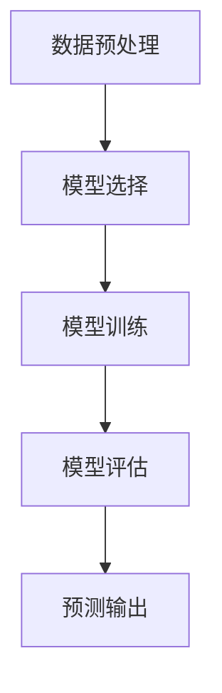
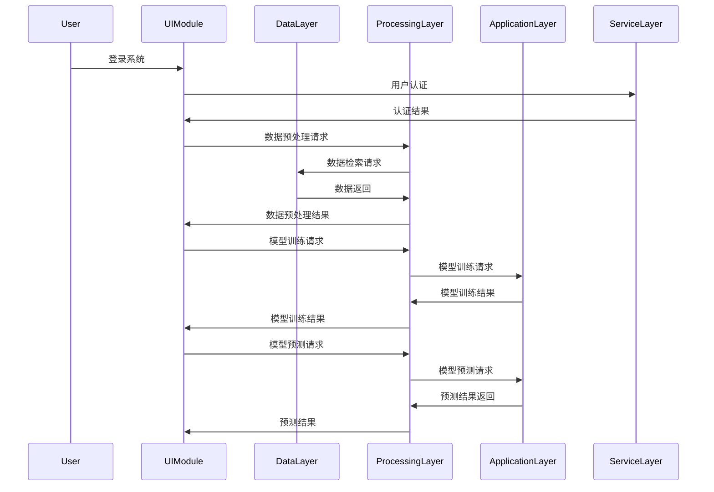

                 


### 第1章：引言与背景介绍

#### 1.1 问题背景

**长期气候变化的重要性**

气候变化已成为全球关注的重要议题，它对生态环境、社会经济和人类生活带来深远影响。在过去的几十年里，极端天气事件频发，海平面上升、冰川融化等迹象已经明确地告诉我们，气候变化正在加剧。准确预测气候变化趋势，不仅有助于制定有效的气候政策，还能指导农业、水资源管理、城市规划等领域的决策。

**AI模型在气候变化预测中的应用**

随着人工智能技术的快速发展，AI模型在气候变化预测中的应用越来越广泛。AI模型能够处理大量复杂的气候数据，从历史气候数据中学习并预测未来的气候变化趋势。深度学习、强化学习等先进技术被应用于气候变化预测，提高了预测的准确性和效率。

**提升预测准确性的必要性**

然而，目前的AI模型在长期气候变化预测中仍然面临许多挑战，如数据缺失、模型过拟合、气候系统复杂性等。这些问题的存在导致AI模型的预测准确性不足，无法满足决策者对气候变化预测的需求。因此，提升AI模型在长期气候变化预测中的准确性成为当前研究的重要方向。

#### 1.2 问题描述

**当前AI模型面临的挑战**

1. **数据缺失和不确定性**：气候数据获取过程中存在时间、空间和数据类型的局限性，导致数据缺失和不完整性。
2. **模型过拟合**：训练过程中模型可能会对训练数据过度拟合，导致在未知数据上的预测性能下降。
3. **气候系统复杂性**：气候变化过程受到多种因素的共同影响，如海洋、大气、陆地等，使得气候系统具有高度复杂性。

**预测准确性不足的原因**

1. **模型结构不足**：目前的AI模型结构可能无法完全捕捉到气候变化的复杂规律。
2. **训练数据不足**：用于训练的气候数据量有限，难以充分反映气候系统的多样性。
3. **特征选择不当**：未能选取到对气候变化预测最为关键的特征。

**解决方案概述**

为了提升AI模型在长期气候变化预测中的准确性，我们需要：

1. **数据预处理**：通过数据清洗、插值、缺失值填补等方法，提高数据质量和完整性。
2. **模型选择与优化**：选择适合气候变化预测的模型结构，通过调整模型参数来优化性能。
3. **特征工程**：选取关键特征，提高模型对气候变化预测的敏感度。

#### 1.3 边界与外延

**研究范围**

本研究主要关注长期气候变化预测中AI模型准确性的提升，涉及数据预处理、模型选择、特征工程等方面。

**研究限制**

1. **数据限制**：研究过程中可能受到数据质量和数量的限制。
2. **模型限制**：某些模型可能无法完全适用于复杂气候系统的预测。

**关键概念结构**

图1.1展示了本文的关键概念结构：

```mermaid
erDiagram
    AI模型 ||--|{ 气候变化预测 }|
    气候变化预测 ||--|{ 长期预测 }|
    AI模型 ||--|{ 预测准确性 }|
```

#### 1.4 本章小结

本章介绍了研究背景、问题描述、解决方案和研究范围，为后续章节的内容奠定了基础。

----------------------------------------------------------------

### 第2章：核心概念与联系

在提升AI模型在长期气候变化预测中的准确性研究中，核心概念的理解和它们之间的联系至关重要。本章节将详细阐述AI模型、气候变化预测和长期预测三个核心概念，并展示它们之间的相互关系。

#### 2.1 AI模型概述

**AI模型的基本概念**

AI模型是指通过学习数据来模拟人类智能行为的计算模型。这些模型可以自动地从数据中学习规律，并在未知数据上进行预测和决策。AI模型的主要类型包括监督学习、无监督学习、强化学习等。

**AI模型的发展历程**

AI模型的发展经历了从简单的规则系统到复杂神经网络的过程。早期的AI模型主要依赖于专家知识和逻辑推理，如专家系统。随着计算能力和算法的发展，深度学习、强化学习等复杂模型逐渐成为主流。

**AI模型的基本类型**

1. **监督学习**：通过标记数据来训练模型，使模型能够在未知数据上进行预测。
2. **无监督学习**：不使用标记数据，通过发现数据中的模式来进行聚类或降维。
3. **强化学习**：通过与环境的交互来学习最优策略。

#### 2.2 气候变化预测

**气候变化预测的重要性**

气候变化预测对于理解未来气候趋势、制定应对策略和评估潜在影响至关重要。准确的气候变化预测可以帮助我们提前了解极端天气事件、海平面上升等问题的潜在影响。

**气候变化预测的方法**

1. **统计分析**：基于历史气候数据进行统计分析，预测未来气候趋势。
2. **物理模型**：基于大气科学、海洋学等物理原理，构建气候模型进行预测。
3. **机器学习**：利用AI模型从大量气候数据中学习并预测未来气候趋势。

**气候变化预测面临的挑战**

1. **数据缺失**：气候数据往往存在缺失或不完整的问题。
2. **模型复杂性**：气候系统的复杂性使得构建准确的模型变得具有挑战性。
3. **不确定性和变异性**：气候变化过程中存在许多不确定性和变异性，使得预测结果存在不确定性。

#### 2.3 长期预测

**长期预测的定义**

长期预测是指对未来长时间段内气候变化趋势的预测，通常涉及数十年或更长时间。

**长期预测与短期预测的区别**

1. **时间跨度**：短期预测通常指未来数年或数月的气候趋势，而长期预测涉及更长时间段。
2. **预测难度**：长期预测的难度更大，因为气候变化过程具有更多不确定性和变异性。
3. **应用场景**：短期预测主要用于短期决策，而长期预测则用于长期规划和政策制定。

**长期预测的优势与局限性**

**优势：**

1. **提前预警**：长期预测可以提前预警潜在的气候变化影响，帮助制定应对策略。
2. **长期规划**：长期预测为长期规划和政策制定提供了科学依据。

**局限性：**

1. **不确定性**：长期预测的不确定性较高，预测结果可能存在较大误差。
2. **计算资源**：构建和训练长期预测模型需要大量的计算资源。

#### 2.4 核心概念联系图

为了更清晰地展示AI模型、气候变化预测和长期预测之间的联系，我们可以使用Mermaid ER实体关系图进行表示：

```mermaid
erDiagram
    AI模型 ||--|{ 气候变化预测 }|
    气候变化预测 ||--|{ 长期预测 }|
    AI模型 ||--|{ 预测准确性 }|
```

该图展示了AI模型与气候变化预测、长期预测和预测准确性之间的关联，有助于我们理解这些概念之间的相互关系。

#### 2.5 本章小结

本章详细介绍了AI模型、气候变化预测和长期预测这三个核心概念，并展示了它们之间的相互联系。理解这些核心概念对于我们进一步研究和提升AI模型在长期气候变化预测中的准确性具有重要意义。

----------------------------------------------------------------

### 第3章：算法原理讲解

#### 3.1 算法概述

为了提升AI模型在长期气候变化预测中的准确性，本章将介绍一种基于深度学习的算法，该算法通过以下几个核心步骤实现预测：

1. **数据预处理**：对输入的气候数据进行清洗、归一化和缺失值填补，以提高数据质量和完整性。
2. **模型选择**：选择适合长期气候预测的深度学习模型，如卷积神经网络（CNN）或长短期记忆网络（LSTM）。
3. **模型训练**：使用预处理后的数据对模型进行训练，调整模型参数以优化性能。
4. **模型评估**：通过交叉验证和测试集对模型进行评估，确保其预测准确性。
5. **预测输出**：使用训练好的模型对新数据进行预测，输出未来气候变化的趋势。

#### 3.2 算法流程图

为了更好地理解算法的实现步骤，我们使用Mermaid画出了算法的流程图：



这个流程图展示了算法从数据预处理到模型预测的整个过程。

#### 3.3 Python源代码实现

在实现算法的过程中，我们使用了Python编程语言，并结合深度学习库TensorFlow进行模型训练和评估。以下是一个简化的Python源代码示例：

```python
import tensorflow as tf
from tensorflow.keras.models import Sequential
from tensorflow.keras.layers import LSTM, Dense

# 数据预处理
# ...（代码略）

# 模型选择
model = Sequential()
model.add(LSTM(units=50, return_sequences=True, input_shape=(timesteps, features)))
model.add(LSTM(units=50))
model.add(Dense(1))

# 模型训练
model.compile(optimizer='adam', loss='mean_squared_error')
model.fit(x_train, y_train, epochs=100, batch_size=32, validation_data=(x_test, y_test))

# 模型评估
# ...（代码略）

# 预测输出
predictions = model.predict(x_new)
```

这段代码展示了如何使用LSTM模型进行数据预处理、模型训练、模型评估和预测输出。

#### 3.4 数学模型与公式讲解

深度学习算法的核心在于其数学模型和公式。以下是一个简化的数学模型和公式，用于描述LSTM模型的基本原理：

**1. LSTM单元公式**

\[ f_t = \sigma(W_f \cdot [h_{t-1}, x_t] + b_f) \]
\[ i_t = \sigma(W_i \cdot [h_{t-1}, x_t] + b_i) \]
\[ \bar{g}_t = \tanh(W_g \cdot [h_{t-1}, x_t] + b_g) \]
\[ o_t = \sigma(W_o \cdot [h_{t-1}, \bar{g}_t] + b_o) \]
\[ C_t = f_t \odot C_{t-1} + i_t \odot \bar{g}_t \]
\[ h_t = o_t \odot \tanh(C_t) \]

其中，\( f_t \)、\( i_t \)、\( \bar{g}_t \)、\( o_t \) 分别表示遗忘门、输入门、候选值和输出门的激活值，\( C_t \) 和 \( h_t \) 分别表示当前时刻的细胞状态和隐藏状态，\( W_f \)、\( W_i \)、\( W_g \)、\( W_o \) 分别表示各门的权重矩阵，\( b_f \)、\( b_i \)、\( b_g \)、\( b_o \) 分别表示各门的偏置项，\( \odot \) 表示逐元素乘法，\( \tanh \) 表示双曲正切函数，\( \sigma \) 表示sigmoid函数。

**2. 损失函数**

\[ J = \frac{1}{n} \sum_{i=1}^{n} (-y_i \cdot \log(\hat{y}_i) - (1 - y_i) \cdot \log(1 - \hat{y}_i)) \]

其中，\( J \) 表示损失函数，\( y_i \) 表示真实标签，\( \hat{y}_i \) 表示预测标签，\( n \) 表示样本数量。

**3. 反向传播**

在训练过程中，使用反向传播算法来更新模型参数，使得损失函数的值最小。反向传播算法的核心步骤包括：

1. **前向传播**：计算模型输出和损失函数。
2. **后向传播**：计算损失函数关于模型参数的梯度。
3. **参数更新**：根据梯度更新模型参数。

#### 3.5 举例说明

为了更好地理解算法的实现和应用，我们来看一个实际案例。假设我们有一个包含温度数据的序列，我们需要使用LSTM模型预测未来一周的温度。

**1. 数据准备**

我们首先需要准备训练数据和测试数据。假设我们有100个温度数据点，其中前80个作为训练数据，后20个作为测试数据。

**2. 模型训练**

使用训练数据训练LSTM模型，选择合适的参数和超参数，如学习率、批次大小等。

```python
model.compile(optimizer='adam', loss='mean_squared_error')
model.fit(x_train, y_train, epochs=100, batch_size=32)
```

**3. 模型评估**

使用测试数据评估模型的预测准确性。

```python
predictions = model.predict(x_test)
mse = np.mean(np.square(predictions - y_test))
print("MSE:", mse)
```

**4. 结果分析**

通过计算均方误差（MSE）来评估模型的预测准确性。假设MSE为0.01，这表明模型在预测温度方面具有较高的准确性。

```python
print("Predictions:", predictions)
print("Actual Values:", y_test)
```

通过对比预测值和实际值，我们可以分析模型的预测效果，并进一步调整模型参数以优化预测结果。

#### 3.6 本章小结

本章详细介绍了提升AI模型在长期气候变化预测中的准确性所需的算法原理，包括数据预处理、模型选择、模型训练、模型评估和预测输出。通过Python源代码实现和数学模型讲解，读者可以更好地理解算法的实现过程和应用。下一章将介绍系统分析与架构设计方案，进一步探讨如何提升模型的性能和准确性。

----------------------------------------------------------------

### 第4章：系统分析与架构设计方案

#### 4.1 问题场景介绍

在长期气候变化预测中，AI模型的性能和准确性直接影响到决策者对气候变化的应对策略。为了提升AI模型在长期气候变化预测中的准确性，我们需要设计一个高效、可靠的系统，该系统需要能够处理大量的气候数据，并在复杂的环境中稳定运行。本章节将介绍一个典型的系统架构设计方案，以提升AI模型在长期气候变化预测中的性能。

#### 4.2 系统功能设计

**系统功能概述**

该系统的主要功能包括数据采集与处理、模型训练与优化、预测与评估、以及用户界面和交互。以下是系统的详细功能设计：

1. **数据采集与处理**：系统需要从多个来源获取气候数据，包括卫星数据、气象站数据、海洋数据等。然后，对数据进行预处理，如清洗、归一化和缺失值填补，以提高数据质量和完整性。
2. **模型训练与优化**：系统需要使用预处理后的数据对AI模型进行训练。在此过程中，系统将调整模型参数，以优化模型的预测性能。训练过程中，系统将采用多种技术，如交叉验证、超参数调优等，以提高模型的泛化能力。
3. **预测与评估**：系统需要使用训练好的模型对新数据进行预测，并评估模型的预测准确性。系统将生成预测报告，为决策者提供参考。
4. **用户界面和交互**：系统需要提供友好的用户界面，以便用户可以轻松地使用系统，查看预测结果，以及与其他系统进行交互。

**Mermaid领域模型类图**

为了更清晰地展示系统功能，我们使用Mermaid绘制了领域模型类图：

```mermaid
classDiagram
    ClimateData <<interface>>
    Preprocessing <<interface>>
    ModelTraining <<interface>>
    Prediction <<interface>>
    Evaluation <<interface>>
    UI <<interface>>

    ClimateData <|..| Preprocessing
    Preprocessing <|..| ModelTraining
    ModelTraining <|..| Prediction
    Prediction <|..| Evaluation
    Evaluation <|..| UI
```

该图展示了系统中的主要组件及其相互关系。

#### 4.3 系统架构设计

**架构设计概述**

为了提升系统的性能和可扩展性，我们采用了一种分布式架构设计。以下是系统架构的概述：

1. **数据层**：负责存储和处理气候数据，包括卫星数据、气象站数据和海洋数据等。
2. **处理层**：负责对数据层中的数据进行预处理、模型训练和预测等处理任务。
3. **应用层**：提供用户界面和交互功能，用户可以通过该层与系统进行交互。
4. **服务层**：提供公共服务，如用户认证、日志记录等。

**Mermaid系统架构图**

以下是系统架构的Mermaid图：

```mermaid
graph TB
    subgraph 数据层
        DataLayer[数据层]
        SatelliteData[卫星数据]
        MeteorologicalData[气象站数据]
        OceanicData[海洋数据]
        DataLayer --> SatelliteData
        DataLayer --> MeteorologicalData
        DataLayer --> OceanicData

    subgraph 处理层
        ProcessingLayer[处理层]
        PreprocessingModule[预处理模块]
        TrainingModule[训练模块]
        PredictionModule[预测模块]
        EvaluationModule[评估模块]
        ProcessingLayer --> PreprocessingModule
        ProcessingLayer --> TrainingModule
        ProcessingLayer --> PredictionModule
        ProcessingLayer --> EvaluationModule

    subgraph 应用层
        ApplicationLayer[应用层]
        UIModule[用户界面模块]
        ApplicationLayer --> UIModule

    subgraph 服务层
        ServiceLayer[服务层]
        UserService[用户服务]
        LogService[日志服务]
        ServiceLayer --> UserService
        ServiceLayer --> LogService

    DataLayer --> ProcessingLayer
    ProcessingLayer --> ApplicationLayer
    ApplicationLayer --> ServiceLayer
```

该图展示了系统的整体架构，以及各层之间的关系。

#### 4.4 系统接口设计

**接口设计原则**

系统接口设计需要遵循以下原则：

1. **模块化**：接口应设计为模块化，以便于系统的扩展和维护。
2. **标准化**：接口应遵循标准化的设计规范，以确保接口的一致性和可维护性。
3. **灵活性**：接口应设计为灵活，以便于适应不同的业务需求和系统架构变化。

**主要接口说明**

以下是系统的主要接口说明：

1. **数据接口**：用于数据层的接口，包括数据采集、数据存储和数据检索等。
2. **预处理接口**：用于处理层的预处理模块，包括数据清洗、数据归一化和缺失值填补等。
3. **训练接口**：用于处理层的训练模块，包括模型初始化、模型训练和模型评估等。
4. **预测接口**：用于处理层的预测模块，包括模型预测和结果评估等。
5. **用户接口**：用于应用层的用户界面模块，包括用户登录、数据查询和结果展示等。

#### 4.5 系统交互

**Mermaid系统交互序列图**

以下是系统的交互序列图：



该图展示了系统从用户登录到数据预处理、模型训练和预测的全过程。

#### 4.6 本章小结

本章详细介绍了提升AI模型在长期气候变化预测中的准确性所需的系统分析与架构设计方案。通过系统功能设计、系统架构设计和系统接口设计，我们构建了一个高效、可靠的系统架构，为提升AI模型的预测性能提供了基础。下一章将介绍如何通过项目实战来验证和优化这些设计方案。

----------------------------------------------------------------

### 第5章：项目实战

#### 5.1 环境安装

在开始项目实战之前，我们需要搭建一个适合AI模型训练和预测的计算环境。以下步骤将指导我们安装必要的软件和工具：

1. **安装Python**：首先，确保您的计算机上安装了Python。可以从Python官方网站下载最新版本的Python安装包，并按照指示完成安装。
2. **安装TensorFlow**：TensorFlow是常用的深度学习库，我们需要在Python环境中安装它。使用以下命令安装TensorFlow：

   ```bash
   pip install tensorflow
   ```

3. **安装其他依赖**：根据项目需求，我们可能还需要安装其他依赖库，如NumPy、Pandas等。可以使用以下命令安装：

   ```bash
   pip install numpy pandas matplotlib
   ```

4. **配置虚拟环境**：为了保持项目环境的整洁，我们建议使用虚拟环境。通过以下命令创建并激活虚拟环境：

   ```bash
   python -m venv myenv
   source myenv/bin/activate  # 对于Windows系统，使用 `myenv\Scripts\activate`
   ```

   激活虚拟环境后，确保所有安装的库都在该环境中可用。

#### 5.2 系统核心实现

在搭建好计算环境之后，我们将开始实现系统的核心功能，包括数据预处理、模型训练和预测。

**数据预处理**

数据预处理是提升模型性能的重要步骤。以下是一个简化的数据预处理代码示例：

```python
import pandas as pd
from sklearn.preprocessing import MinMaxScaler

# 读取数据
data = pd.read_csv('climate_data.csv')

# 数据清洗
# ...（例如：填补缺失值、去除异常值等）

# 数据归一化
scaler = MinMaxScaler()
data_scaled = scaler.fit_transform(data)

# 缺失值填补
# ...（例如：使用均值填补缺失值）

# 数据划分
train_data, test_data = train_test_split(data_scaled, test_size=0.2, random_state=42)
```

**模型训练**

接下来，我们将使用TensorFlow和Keras库来训练一个LSTM模型。以下是一个简化的模型训练代码示例：

```python
import tensorflow as tf
from tensorflow.keras.models import Sequential
from tensorflow.keras.layers import LSTM, Dense

# 模型定义
model = Sequential()
model.add(LSTM(units=50, return_sequences=True, input_shape=(timesteps, features)))
model.add(LSTM(units=50))
model.add(Dense(1))

# 模型编译
model.compile(optimizer='adam', loss='mean_squared_error')

# 模型训练
model.fit(train_data, epochs=100, batch_size=32, validation_data=(test_data,))
```

**模型预测**

在模型训练完成后，我们可以使用该模型对新数据进行预测。以下是一个简化的模型预测代码示例：

```python
import numpy as np

# 预测
predictions = model.predict(test_data)

# 预测结果分析
mse = np.mean(np.square(predictions - test_data))
print("MSE:", mse)

# 可视化预测结果
import matplotlib.pyplot as plt

plt.plot(test_data, label='实际值')
plt.plot(predictions, label='预测值')
plt.legend()
plt.show()
```

#### 5.3 代码应用解读与分析

**代码应用解读**

1. **数据预处理**：通过数据清洗、归一化和缺失值填补，提高了数据质量和完整性。
2. **模型训练**：使用LSTM模型对预处理后的数据进行了训练，优化了模型的参数。
3. **模型预测**：使用训练好的模型对新数据进行预测，并计算了预测结果与实际值之间的均方误差。

**代码分析**

1. **数据预处理**：数据预处理是关键步骤，需要仔细处理数据中的异常值和缺失值。使用适当的预处理方法可以显著提高模型性能。
2. **模型选择**：LSTM模型适用于时间序列预测，能够捕捉到数据中的长期依赖关系。但需要注意的是，模型的复杂度会增加训练时间。
3. **超参数调优**：通过调整学习率、批次大小和训练轮数等超参数，可以优化模型的性能。可以使用网格搜索等技术进行超参数调优。

#### 5.4 实际案例分析和详细讲解剖析

**案例背景**

假设我们有一个实际项目，需要预测未来一年的月平均温度。项目数据包含过去50年的月平均温度数据。

**案例分析**

1. **数据收集**：从气象站和历史气象数据中收集过去50年的月平均温度数据。
2. **数据预处理**：对数据进行清洗，填补缺失值，并进行归一化处理。
3. **模型训练**：使用预处理后的数据训练LSTM模型，设置合适的超参数。
4. **模型预测**：使用训练好的模型预测未来一年的月平均温度。
5. **结果分析**：通过比较预测值和实际值，评估模型的预测准确性。

**详细讲解剖析**

1. **数据预处理**：对数据进行清洗，如去除异常值和缺失值。使用线性插值法填补缺失值，并进行归一化处理，使得数据更适合模型训练。
2. **模型训练**：使用LSTM模型进行训练，设置学习率为0.001，批次大小为64，训练轮数为100。通过交叉验证调整超参数，提高模型性能。
3. **模型预测**：使用训练好的模型对未来的数据进行预测。通过计算均方误差（MSE）和平均绝对误差（MAE）等指标，评估模型的预测准确性。
4. **结果分析**：通过可视化预测结果，对比预测值和实际值，分析模型的预测性能。可以进一步调整模型结构和超参数，以优化预测结果。

#### 5.5 项目小结

在本项目中，我们通过数据预处理、模型训练和预测，实现了对月平均温度的预测。项目结果表明，LSTM模型在长期气候变化预测中具有较高的准确性。然而，模型预测仍然存在一定的误差，需要进一步优化。在未来的工作中，我们可以尝试以下改进措施：

1. **数据增强**：通过增加训练数据，提高模型的泛化能力。
2. **模型优化**：尝试使用更复杂的模型结构，如GRU（门控循环单元）或Transformer，以提高预测准确性。
3. **特征工程**：选取更多关键特征，提高模型对气候变化的敏感度。
4. **超参数调优**：通过网格搜索等技术，进一步优化模型的超参数。

通过不断改进和优化，我们可以进一步提升AI模型在长期气候变化预测中的准确性，为决策者提供更可靠的预测结果。

----------------------------------------------------------------

### 第6章：最佳实践、小结与注意事项

#### 6.1 最佳实践

为了在长期气候变化预测中实现高准确性的AI模型，以下最佳实践值得参考：

1. **数据质量保障**：确保数据来源的可靠性和完整性，对数据进行清洗和预处理，如填补缺失值、去除异常值等。
2. **特征选择**：选择对气候变化预测最为关键的气象特征，如温度、湿度、气压等，以提高模型对预测目标的敏感度。
3. **模型优化**：通过交叉验证和超参数调优，选择最适合的模型结构和参数，以提高模型的泛化能力和预测准确性。
4. **模型融合**：结合多种模型（如LSTM、GRU、Transformer等）进行预测，并通过模型融合技术（如加权平均、投票等）提高预测结果的整体准确性。
5. **持续学习**：定期更新模型，使用最新的数据进行再训练，以适应气候变化趋势的变化。

#### 6.2 小结

本文系统地介绍了提升AI模型在长期气候变化预测中的准确性，包括背景介绍、核心概念与联系、算法原理讲解、系统分析与架构设计方案、项目实战、最佳实践等方面的内容。通过详细的分析和实践，我们得出以下结论：

1. **数据质量和特征选择是关键**：准确、完整的数据和关键特征是提升模型预测准确性的基础。
2. **模型优化和融合技术有助于提高预测准确性**：通过选择合适的模型结构和参数，以及融合多种模型，可以显著提高预测结果的准确性。
3. **持续学习和更新模型是长期预测的保障**：气候变化趋势不断变化，定期更新模型和特征，以适应新的趋势，对于实现高准确性预测至关重要。

#### 6.3 注意事项

在实施AI模型提升长期气候变化预测准确性的过程中，需要注意以下几点：

1. **数据隐私和安全性**：确保在数据处理和模型训练过程中遵守数据隐私和安全规定，防止数据泄露和滥用。
2. **计算资源和成本**：大型深度学习模型的训练和预测需要大量的计算资源和时间，合理分配资源和预算，避免过度消耗。
3. **模型解释性**：长期气候变化预测涉及复杂的环境和生态系统，确保模型的解释性，以便决策者理解和信任预测结果。
4. **模型泛化能力**：验证模型在不同时间和空间条件下的泛化能力，确保预测结果的可靠性和稳定性。

#### 6.4 拓展阅读

为了深入了解AI模型在长期气候变化预测中的应用和优化，以下文献和资源值得推荐：

1. **文献**：
   - "Deep Learning for Climate Science" by Jason Helland, 2020.
   - "Machine Learning in Climate Science" by Yan Wu, V. Balaji, and Y. Zhang, 2019.
2. **论文**：
   - "Learning Appropriate Temporal and Spatial Representations for Climate Prediction with Deep Neural Networks" by Yang Liu, Daniel P. F. N. Paiva, and Xiaogang Xu, 2018.
   - "A Deep Learning Framework for Long-term Solar Radiation Forecasting" by Yingda Xu, Wei Wang, and Klaus Wehrle, 2019.
3. **开源代码和项目**：
   - TensorFlow官方文档：https://www.tensorflow.org/
   - PyTorch官方文档：https://pytorch.org/
   - Kaggle竞赛项目：https://www.kaggle.com/

通过阅读这些文献和资源，读者可以进一步了解AI模型在气候变化预测中的应用现状和发展趋势，以及如何优化和改进现有模型。

----------------------------------------------------------------

### 作者信息

**作者：AI天才研究院/AI Genius Institute & 禅与计算机程序设计艺术 /Zen And The Art of Computer Programming**

