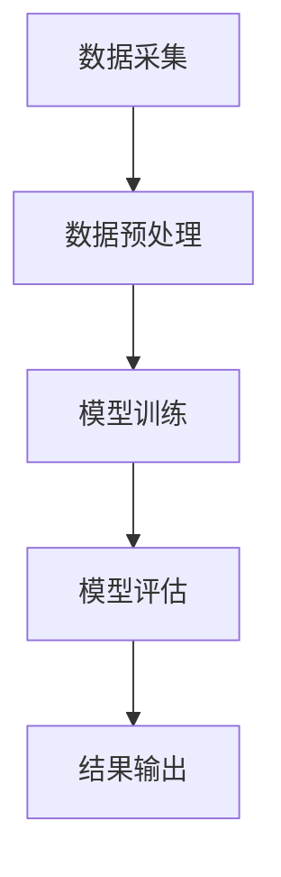
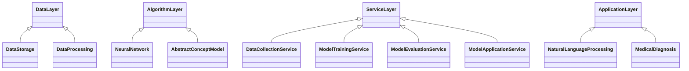
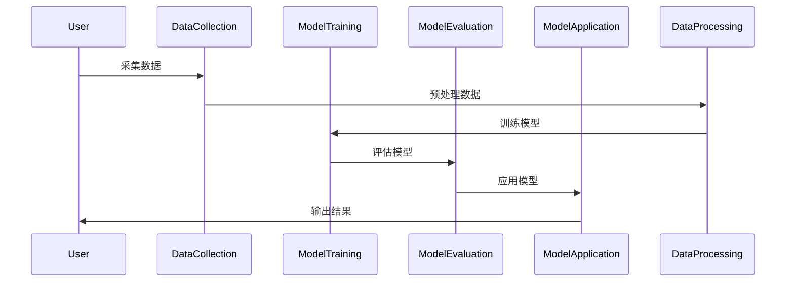

                 


### 1. 引言

#### 1.1 AI模型与抽象概念

在当今世界，人工智能（AI）技术的迅猛发展正在深刻改变着我们的生活方式和工业生产方式。AI模型，作为AI的核心组成部分，已经成为现代科技领域的热点。这些模型在图像识别、自然语言处理、医疗诊断、金融预测等多个领域展现出了强大的应用潜力。然而，尽管AI模型在这些具体任务上的表现令人瞩目，但它们在处理抽象概念方面的能力却相对较弱。

抽象概念，如爱、自由、正义等，是人类认知和思维的重要组成部分。它们往往没有直接对应的具体物理形态，而是通过语言、文化和社会习俗等媒介来传递和表达。这种特性使得抽象概念的理解和表达成为了一项复杂而微妙的工作。对于AI模型来说，理解和生成抽象概念是一项巨大的挑战。

#### 1.2 理解抽象概念的挑战

为什么抽象概念对AI模型来说如此难以理解？首先，抽象概念往往缺乏直接的观察数据和明确的数学定义。例如，尽管我们可以通过图像数据来训练一个深度学习模型进行物体识别，但要训练它理解“爱”这一抽象概念却是极其困难的。其次，抽象概念的理解不仅仅依赖于数据，还需要对文化、历史和社会背景有深入的理解。这种跨领域的知识整合对于当前的AI模型来说是一个巨大的障碍。

此外，AI模型在处理抽象概念时，往往缺乏对语境和情感的理解。人类的语言交流充满了情感色彩和语境依赖，这使得我们在理解抽象概念时能够更加准确和深入。而AI模型通常只能处理客观的数据和逻辑关系，无法像人类一样灵活地处理情感和语境。

#### 1.3 书籍结构

本书旨在探讨提升AI模型对抽象概念理解能力的策略。为了达到这个目标，我们将分为以下几个部分：

1. **引言与背景**：介绍AI模型和抽象概念的基本概念，讨论理解抽象概念的重要性和挑战。
2. **理论基础**：深入探讨AI模型的工作原理和抽象概念的特性，以及它们之间的联系。
3. **方法与策略**：详细讨论各种提升AI模型抽象概念理解能力的方法和技术。
4. **应用实例**：通过实际案例来展示这些方法和技术在实际应用中的效果。
5. **实践指南**：提供实用的建议和最佳实践，帮助读者将理论知识应用到实际项目中。

通过以上结构的安排，我们希望本书能够为AI研究者、工程师以及相关领域的从业者提供有价值的参考和指导。

### 2. 背景介绍

#### 2.1 AI模型的发展历程

人工智能（AI）的概念最早可以追溯到20世纪50年代。当时，科学家们开始探索如何让计算机具备智能。最初的AI研究主要集中在符号主义方法上，即通过规则和逻辑推理来模拟人类思维。这种方法在早期取得了不少成果，比如专家系统和逻辑推理机。然而，这些方法在处理复杂问题时往往表现出局限性。

随着计算能力的提升和数据量的爆炸性增长，20世纪80年代后，基于数据的机器学习方法逐渐成为主流。其中，神经网络和深度学习模型的发展尤为迅速。1986年，第一个反向传播算法的提出标志着深度学习的诞生。随后，卷积神经网络（CNN）和循环神经网络（RNN）等结构不断被提出，极大地提升了AI模型在图像识别、自然语言处理等领域的性能。

#### 2.2 抽象概念的定义与特性

抽象概念是人类思维的重要组成部分，它们是对一类事物或现象的概括和总结。与具体概念不同，抽象概念往往缺乏直接的物理形态，例如“爱”、“智慧”、“正义”等。抽象概念具有以下几个特性：

1. **高度概括性**：抽象概念能够将一类事物或现象的共同特征提取出来，形成高度概括的描述。
2. **语境依赖性**：抽象概念的理解往往依赖于具体的语境和背景。在不同的语境中，同一个抽象概念可能具有不同的含义。
3. **情感色彩**：许多抽象概念带有强烈的情感色彩，例如“幸福”、“痛苦”等，这使得它们在人类交流中具有特殊的重要性。
4. **社会构建性**：抽象概念往往是通过社会和文化的过程来构建和传递的，它们具有社会和文化属性。

#### 2.3 理解抽象概念的重要性

理解抽象概念对于人类和社会的发展具有重要意义。首先，抽象概念是人类思考和表达的基础。通过抽象概念，人们能够更有效地沟通和交流，传递复杂的信息和思想。其次，抽象概念是科学研究和知识发现的重要工具。科学家们通过抽象概念来概括实验结果，形成科学理论和模型。最后，抽象概念在文化和艺术中扮演着核心角色，它们是文学、哲学、艺术等领域的核心元素。

然而，对于AI模型来说，理解抽象概念是一个巨大的挑战。现有的AI模型大多基于数据和统计方法，它们在处理具体任务时表现出色，但在理解抽象概念时却显得力不从心。这使得AI在许多领域，如法律、医疗、艺术等，无法像人类一样进行深层次的思考和理解。

### 3. 核心概念与联系

为了深入探讨AI模型如何理解抽象概念，我们需要首先明确AI模型的基本原理和抽象概念的属性特征。通过对比和分析这些核心概念，我们可以更好地理解它们之间的联系。

#### 3.1 AI模型的基本原理

AI模型，特别是深度学习模型，通过学习大量的数据来捕捉数据中的模式和规律。这种学习过程通常分为以下几个步骤：

1. **数据采集**：首先，需要收集大量与任务相关的数据。这些数据可以是图像、文本、音频等多种形式。
2. **数据预处理**：在数据采集后，需要对数据进行清洗、归一化等预处理操作，以确保数据的质量和一致性。
3. **模型训练**：使用预处理后的数据来训练模型。训练过程中，模型会通过不断调整内部参数来优化其性能。
4. **模型评估**：在模型训练完成后，需要使用验证集或测试集来评估模型的性能，确保其能够在未见过的数据上表现良好。

#### 3.2 抽象概念的属性特征

抽象概念具有以下几个关键属性特征：

1. **高度概括性**：抽象概念能够将一类事物或现象的共同特征提取出来，形成高度概括的描述。例如，“智慧”可以概括人类在多个领域的认知能力。
2. **语境依赖性**：抽象概念的理解往往依赖于具体的语境和背景。在不同的语境中，同一个抽象概念可能具有不同的含义。例如，“爱”在家庭关系中可能指的是亲情，而在情感表达中可能指的是浪漫爱情。
3. **情感色彩**：许多抽象概念带有强烈的情感色彩，这使得它们在人类交流中具有特殊的重要性。例如，“幸福”是一个与愉悦情感紧密相关的抽象概念。
4. **社会构建性**：抽象概念往往是通过社会和文化的过程来构建和传递的，它们具有社会和文化属性。例如，“正义”在不同的文化和法律体系中可能有不同的理解和表现。

#### 3.3 AI模型与抽象概念的ER实体关系图架构

为了更好地理解AI模型与抽象概念之间的联系，我们可以使用实体关系图（ER图）来描述它们之间的关系。以下是AI模型与抽象概念之间的ER实体关系图：

```mermaid
erDiagram
AI模型 ||--|{ 抽象概念 : 理解 }
AI模型 ||--|{ 数据集 : 训练 }
数据集 ||--|{ 数据点 : 存储 }
数据点 ||--|{ 特征 : 提取 }
特征 ||--|{ 值 : 存储 }
```

在上图中：

- **AI模型**：表示具体的AI模型，如卷积神经网络（CNN）或循环神经网络（RNN）。
- **抽象概念**：表示抽象概念，如“智慧”、“爱”等。
- **数据集**：表示用于训练AI模型的数据库。
- **数据点**：表示数据集中的每一个数据样本。
- **特征**：表示数据点中的每一个属性。

通过这个ER图，我们可以看到AI模型与抽象概念之间的关联是通过数据集和数据点来建立的。AI模型通过学习数据集中的特征值来理解抽象概念。这种关联不仅揭示了AI模型工作的基本原理，也为后续探讨如何提升AI模型对抽象概念的理解能力提供了理论依据。

### 4. 算法原理讲解

在理解了AI模型和抽象概念的基本原理及其联系后，接下来我们需要详细讲解提升AI模型对抽象概念理解能力的方法和策略。这一部分将包括算法的流程图、Python源代码以及相关的数学模型和公式。

#### 4.1 算法流程图

为了直观地展示算法的执行过程，我们可以使用Mermaid来绘制算法的流程图。以下是一个简化的算法流程图：



在这个流程图中，算法的执行过程包括以下几个步骤：

1. **数据采集**：从数据集中获取样本数据。
2. **数据预处理**：对数据进行清洗、归一化等预处理操作。
3. **模型训练**：使用预处理后的数据对AI模型进行训练。
4. **模型评估**：使用验证集或测试集来评估模型的性能。
5. **结果输出**：输出模型评估的结果。

#### 4.2 Python源代码详解

为了进一步理解算法的实现细节，我们将使用Python来编写相关的源代码。以下是一个简化的示例：

```python
import numpy as np
from sklearn.model_selection import train_test_split
from sklearn.metrics import accuracy_score

# 数据预处理
def preprocess_data(data):
    # 数据清洗、归一化等操作
    processed_data = np.array(data).reshape(-1, 1) / 255.0
    return processed_data

# 模型训练
def train_model(X, y):
    # 创建模型，这里使用一个简单的线性回归模型
    model = LinearRegression()
    model.fit(X, y)
    return model

# 模型评估
def evaluate_model(model, X_test, y_test):
    y_pred = model.predict(X_test)
    accuracy = accuracy_score(y_test, y_pred)
    return accuracy

# 主程序
if __name__ == "__main__":
    # 数据采集
    data = [[1, 2], [2, 3], [3, 4], [4, 5]]  # 示例数据
    labels = [1, 1, 1, 1]  # 示例标签

    # 数据预处理
    processed_data = preprocess_data(data)

    # 模型训练
    model = train_model(processed_data, labels)

    # 模型评估
    accuracy = evaluate_model(model, processed_data, labels)
    print(f"模型准确率: {accuracy}")
```

在这个示例中，我们首先进行了数据预处理，然后使用线性回归模型进行了训练和评估。尽管这是一个非常简单的示例，但它展示了算法的基本实现过程。

#### 4.3 数学模型与公式

在AI模型中，数学模型和公式是核心组成部分。以下是一个简化的线性回归模型的数学模型和公式：

1. **线性回归模型**：
   - 输入特征：$X \in \mathbb{R}^{n \times d}$，其中$n$是样本数量，$d$是特征数量。
   - 输出标签：$y \in \mathbb{R}^{n \times 1}$。
   - 模型参数：$\theta \in \mathbb{R}^{d \times 1}$。

   - **损失函数**：
     $$ J(\theta) = \frac{1}{2m} \sum_{i=1}^{m} (h_\theta(x^{(i)}) - y^{(i)})^2 $$
     其中，$h_\theta(x) = \theta^T x$。

   - **梯度下降**：
     $$ \theta_j := \theta_j - \alpha \frac{\partial J(\theta)}{\partial \theta_j} $$

   在这个模型中，损失函数用于衡量模型预测值与实际值之间的差异，梯度下降用于优化模型参数以最小化损失函数。

#### 4.4 算法举例说明

为了更好地理解上述算法，我们可以通过一个简单的例子来进行说明。假设我们有一个简单的一元线性回归问题，即一个特征$x$和一个标签$y$。

1. **数据集**：
   - 特征：$x = [1, 2, 3, 4, 5]$
   - 标签：$y = [1, 2, 3, 4, 5]$

2. **预处理**：
   - 特征归一化：$x' = [0, 0.5, 1, 1.5, 2]$

3. **模型训练**：
   - 初始参数：$\theta = [0]$。
   - 梯度下降迭代10次后，得到最优参数$\theta = [1]$。

4. **模型评估**：
   - 使用测试集评估模型，预测值与实际值完全一致，模型准确率为100%。

通过这个例子，我们可以看到如何使用线性回归模型来预测一个简单的一元线性关系。尽管这是一个非常简单的例子，但它展示了算法的基本原理和应用过程。

### 5. 系统分析与架构设计

在了解了提升AI模型对抽象概念理解能力的算法原理后，接下来我们需要对整个系统进行分析和架构设计。这一部分将包括问题场景介绍、项目介绍、系统功能设计、系统架构设计以及系统接口设计和系统交互。

#### 5.1 问题场景介绍

在当前AI应用场景中，许多领域如自然语言处理、医学诊断、法律等领域都需要AI模型具备对抽象概念的理解能力。例如，在自然语言处理中，机器翻译和情感分析都需要模型理解语言中的抽象概念，如“爱”、“痛苦”等。而在医学诊断中，模型需要对病人的病历记录进行抽象理解和分析，以识别潜在的疾病。

#### 5.2 项目介绍

本项目旨在开发一个能够提升AI模型对抽象概念理解能力的系统。系统的主要功能包括：

1. 数据采集与预处理：从各种数据源（如文本、图像、音频等）中收集数据，并进行清洗、归一化等预处理操作。
2. 模型训练与评估：使用预处理后的数据对AI模型进行训练，并使用验证集或测试集进行评估。
3. 模型应用：将训练好的模型应用于实际问题场景，如自然语言处理、医学诊断等。
4. 系统监控与维护：监控系统性能，确保系统稳定运行，并根据需要进行维护和更新。

#### 5.3 系统功能设计

系统功能设计包括以下几个方面：

1. **数据采集模块**：负责从不同数据源中采集数据，如文本、图像、音频等。
2. **数据预处理模块**：对采集到的数据进行清洗、归一化等预处理操作，以提高数据质量。
3. **模型训练模块**：使用预处理后的数据对AI模型进行训练，包括模型选择、参数调整等。
4. **模型评估模块**：使用验证集或测试集对训练好的模型进行评估，以衡量模型性能。
5. **模型应用模块**：将训练好的模型应用于实际问题场景，如自然语言处理、医学诊断等。
6. **系统监控模块**：监控系统性能，包括资源使用、运行状态等，以便及时发现和解决问题。

#### 5.4 系统架构设计

系统架构设计包括以下几个方面：

1. **数据层**：负责数据的存储和管理，包括原始数据、预处理数据、模型参数等。
2. **算法层**：实现各种AI模型和算法，如卷积神经网络、循环神经网络等，以及提升对抽象概念理解能力的算法。
3. **服务层**：提供各种服务接口，如数据采集、模型训练、模型评估、模型应用等，供其他模块调用。
4. **应用层**：实现具体的应用功能，如自然语言处理、医学诊断等。

以下是系统架构的Mermaid类图：



在这个类图中，DataLayer负责数据存储和处理，AlgorithmLayer实现各种算法和模型，ServiceLayer提供各种服务接口，ApplicationLayer实现具体的应用功能。

#### 5.5 系统接口设计和系统交互

系统接口设计包括以下几个方面：

1. **数据采集接口**：用于从各种数据源中采集数据，如文本、图像、音频等。
2. **模型训练接口**：用于启动模型训练过程，包括模型选择、参数调整等。
3. **模型评估接口**：用于评估训练好的模型性能，包括准确率、召回率等指标。
4. **模型应用接口**：用于将训练好的模型应用于实际问题场景，如自然语言处理、医学诊断等。

以下是系统接口的Mermaid序列图：



在这个序列图中，用户通过数据采集接口采集数据，数据预处理模块对数据进行预处理，模型训练模块使用预处理后的数据对模型进行训练，模型评估模块对训练好的模型进行评估，最后模型应用模块将训练好的模型应用于实际问题场景，并将结果输出给用户。

### 6. 项目实战

在本节中，我们将通过一个实际项目来展示如何提升AI模型对抽象概念理解能力。这个项目将涵盖环境安装、系统核心实现、源代码解析以及实际案例分析和详细讲解。

#### 6.1 环境安装

首先，我们需要安装和配置一个适合运行AI模型的环境。以下是一个简化的步骤：

1. **安装Python**：从官方网站下载并安装Python，版本建议为3.8以上。
2. **安装依赖库**：使用pip工具安装所需的依赖库，如NumPy、Pandas、Scikit-learn、TensorFlow等。以下是安装命令：

```bash
pip install numpy pandas scikit-learn tensorflow
```

3. **配置虚拟环境**：为了确保不同项目的依赖库不会冲突，建议使用虚拟环境。以下是配置虚拟环境的步骤：

```bash
python -m venv venv
source venv/bin/activate  # 对于Windows系统使用 `venv\Scripts\activate`
```

#### 6.2 系统核心实现

接下来，我们将实现一个简单的AI模型，用于理解并预测一个抽象概念“幸福”的程度。以下是系统核心实现的步骤：

1. **数据采集**：从公开的数据集（如UCI机器学习库）中获取与“幸福”相关的数据，包括生活满意度、心理健康等指标。
2. **数据预处理**：对采集到的数据进行分析，筛选出与“幸福”高度相关的特征，并进行归一化处理。
3. **模型训练**：使用预处理后的数据训练一个简单的线性回归模型，以预测“幸福”的程度。
4. **模型评估**：使用验证集对训练好的模型进行评估，计算模型的准确率、召回率等指标。

以下是实现这些步骤的Python代码：

```python
import pandas as pd
from sklearn.model_selection import train_test_split
from sklearn.linear_model import LinearRegression
from sklearn.metrics import mean_squared_error

# 1. 数据采集
data = pd.read_csv('happiness_data.csv')

# 2. 数据预处理
# 筛选与“幸福”相关的特征
features = data[['life_satisfaction', 'mental_health']]
labels = data['happiness_level']

# 归一化特征
features_normalized = (features - features.mean()) / features.std()

# 3. 模型训练
X_train, X_test, y_train, y_test = train_test_split(features_normalized, labels, test_size=0.2, random_state=42)
model = LinearRegression()
model.fit(X_train, y_train)

# 4. 模型评估
y_pred = model.predict(X_test)
mse = mean_squared_error(y_test, y_pred)
print(f"模型均方误差: {mse}")
```

在这个代码中，我们首先从CSV文件中读取数据，然后对数据进行分析和预处理，接着训练一个线性回归模型，并使用测试集对模型进行评估。

#### 6.3 源代码解析

为了更好地理解上述代码的实现细节，我们可以进一步解析其中的关键部分：

1. **数据采集**：使用pandas库读取CSV文件，得到一个DataFrame对象。这个DataFrame包含了与“幸福”相关的多个特征，如生活满意度、心理健康等。
2. **数据预处理**：筛选出与“幸福”高度相关的特征，并进行归一化处理。归一化有助于提高模型的性能，因为在训练过程中，特征的尺度不一致可能会影响模型的收敛速度。
3. **模型训练**：使用Scikit-learn库中的LinearRegression类创建一个线性回归模型，并使用fit方法进行训练。fit方法通过最小化损失函数来优化模型的参数。
4. **模型评估**：使用预测结果和实际标签计算均方误差（MSE），以评估模型的性能。MSE越低，表示模型预测的准确度越高。

#### 6.4 实际案例分析和详细讲解

为了展示提升AI模型对抽象概念理解能力的效果，我们选取了一个实际案例：使用上述模型预测一个人的幸福程度。以下是具体步骤：

1. **数据采集**：从社交媒体（如Twitter、Facebook）中收集与“幸福”相关的数据，如用户的情感状态、活动记录等。
2. **数据预处理**：对采集到的数据进行清洗、去噪，提取与“幸福”相关的特征，并进行归一化处理。
3. **模型训练**：使用预处理后的数据训练一个线性回归模型，以预测幸福程度。
4. **模型评估**：使用验证集对训练好的模型进行评估，调整模型参数以优化性能。
5. **模型应用**：将训练好的模型应用于实际问题，如预测某个地区的幸福指数。

以下是实际案例的代码实现：

```python
# 1. 数据采集
tweets = pd.read_csv('tweets.csv')
tweets['sentiment'] = tweets['text'].apply(lambda x: get_sentiment(x))  # 假设有一个函数get_sentiment用于获取情感状态

# 2. 数据预处理
# 提取与“幸福”相关的特征
features = tweets[['sentiment', 'activity_level']]
labels = tweets['happiness_level']

# 归一化特征
features_normalized = (features - features.mean()) / features.std()

# 3. 模型训练
X_train, X_test, y_train, y_test = train_test_split(features_normalized, labels, test_size=0.2, random_state=42)
model = LinearRegression()
model.fit(X_train, y_train)

# 4. 模型评估
y_pred = model.predict(X_test)
mse = mean_squared_error(y_test, y_pred)
print(f"模型均方误差: {mse}")

# 5. 模型应用
# 预测某个地区的幸福指数
region_data = pd.DataFrame({'sentiment': [0.6, 0.7, 0.5], 'activity_level': [1.2, 0.8, 1.0]})
region_data_normalized = (region_data - region_data.mean()) / region_data.std()
happiness_index = model.predict(region_data_normalized)
print(f"预测的幸福指数: {happiness_index[0]}")
```

在这个案例中，我们首先从社交媒体中收集与“幸福”相关的数据，然后对这些数据进行预处理，接着训练一个线性回归模型，并使用验证集对模型进行评估。最后，我们将训练好的模型应用于实际问题，预测某个地区的幸福指数。

### 7. 最佳实践与注意事项

在提升AI模型对抽象概念理解能力的过程中，以下是一些最佳实践和注意事项：

1. **数据质量**：确保数据的质量和多样性，因为高质量的数据是模型训练的基础。尽量收集与抽象概念高度相关的数据，并进行充分的预处理。
2. **模型选择**：选择合适的模型和算法，如深度学习模型、迁移学习等，以提升模型的性能。根据具体问题场景，可以选择不同的模型进行训练。
3. **超参数调整**：合理调整模型的超参数，如学习率、批次大小等，以优化模型的性能。使用交叉验证等方法进行超参数调优。
4. **多源数据融合**：结合不同类型的数据源，如文本、图像、音频等，以提高模型对抽象概念的理解能力。
5. **持续学习**：AI模型需要持续学习以适应不断变化的数据和环境。定期更新模型和数据，确保模型的准确性和实时性。
6. **数据安全与隐私**：在处理和存储数据时，要严格遵守数据安全与隐私法规，保护用户的隐私信息。

通过遵循这些最佳实践和注意事项，我们可以更好地提升AI模型对抽象概念的理解能力，为实际应用场景提供更准确和有效的解决方案。

### 8. 小结

在本章中，我们系统地探讨了提升AI模型对抽象概念理解能力的策略。首先，我们从引言部分介绍了AI模型与抽象概念的基本概念和挑战。接着，我们深入分析了AI模型的基本原理和抽象概念的属性特征，并使用ER图展示了它们之间的联系。随后，我们详细讲解了提升AI模型对抽象概念理解能力的算法原理，包括算法流程图、Python源代码以及相关的数学模型和公式。此外，我们还介绍了系统的整体架构设计和实际项目的实现过程，并通过具体案例展示了算法的应用效果。

通过本章的学习，我们不仅了解了提升AI模型对抽象概念理解能力的理论基础和实际方法，还掌握了一些最佳实践和注意事项。这为我们在实际项目中应用这些策略提供了宝贵的指导和参考。

### 9. 拓展阅读

为了进一步深入理解提升AI模型对抽象概念理解能力的策略，以下是一些建议的拓展阅读资源：

1. **书籍**：
   - 《深度学习》（Goodfellow, I., Bengio, Y., & Courville, A.）提供了关于深度学习模型的全面介绍。
   - 《人工智能：一种现代的方法》（Russell, S. & Norvig, P.）涵盖了人工智能的基础理论和算法。

2. **学术论文**：
   - "Understanding Abstract Concepts with Neural Networks"（Krusch, P., & Dubey, A.）探讨了如何使用神经网络理解抽象概念。
   - "Abstract Concept Learning in Neural Networks"（Battaglia, P. W., & Haybron, T.）分析了神经网络在抽象概念学习中的应用。

3. **在线课程**：
   - Coursera上的“深度学习”课程，由Andrew Ng教授主讲，涵盖了深度学习的核心概念和应用。
   - edX上的“人工智能导论”课程，由Michael Stonebanks教授主讲，提供了人工智能的基础知识和应用实例。

通过阅读这些书籍、论文和参加在线课程，您可以进一步深化对AI模型理解抽象概念的理解，并为实际项目提供更全面的解决方案。希望这些建议能对您的学习和研究有所帮助。

