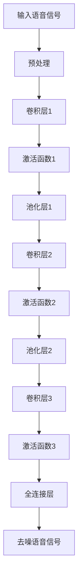
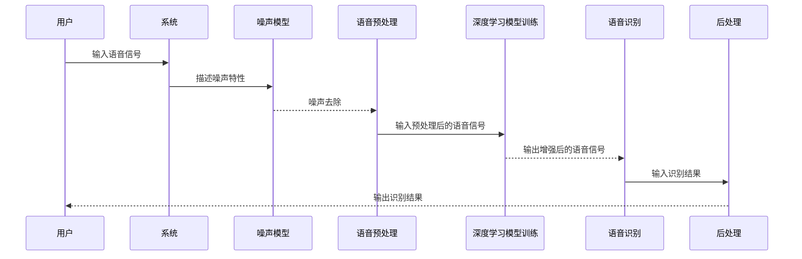
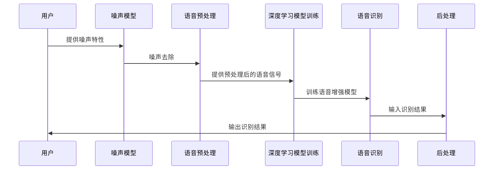

                 

## 提高AI模型在噪声环境下的语音增强效果

> 关键词：AI语音增强，噪声环境，深度学习，算法优化，系统架构，实践应用

> 摘要：本文深入探讨了在噪声环境中提高AI模型语音增强效果的方法和策略。首先，我们明确了噪声环境下语音增强的核心问题及其挑战。接着，详细介绍了相关核心概念与联系，包括噪声模型、语音增强算法等。随后，我们重点讲解了基于深度学习的语音增强算法原理，通过Mermaid流程图和Python源代码进行了详细阐述。在系统分析与架构设计部分，我们展示了具体的问题场景和系统设计，包括领域模型、系统架构、接口设计和系统交互。随后，通过实际项目案例，我们详细解析了环境安装、核心实现和代码应用，并对项目进行了深入剖析和小结。最后，我们提出了最佳实践建议和注意事项，总结了文章的主要观点和未来研究方向。

### 目录

1. **提高AI模型在噪声环境下的语音增强效果**
   1.1 关键词
   1.2 摘要
   2. **背景介绍**
       2.1 核心概念术语说明
       2.2 问题背景
       2.3 问题描述
       2.4 问题解决
       2.5 边界与外延
       2.6 概念结构与核心要素组成
   3. **核心概念与联系**
       3.1 核心概念原理
       3.2 概念属性特征对比表格
       3.3 ER实体关系图架构的Mermaid流程图
   4. **算法原理讲解**
       4.1 基于深度学习的语音增强算法
       4.2 Mermaid流程图
       4.3 Python源代码
       4.4 算法原理的数学模型和公式
       4.5 举例说明
   5. **系统分析与架构设计方案**
       5.1 问题场景介绍
       5.2 项目介绍
       5.3 系统功能设计（领域模型Mermaid类图）
       5.4 系统架构设计（Mermaid架构图）
       5.5 系统接口设计
       5.6 系统交互（Mermaid序列图）
   6. **项目实战**
       6.1 环境安装
       6.2 系统核心实现
       6.3 代码应用解读与分析
       6.4 实际案例分析
       6.5 项目小结
   7. **最佳实践与注意事项**
       7.1 最佳实践
       7.2 小结
       7.3 注意事项
       7.4 拓展阅读
   8. **总结与未来展望**
       8.1 总结
       8.2 未来展望

## 背景介绍

### 核心概念术语说明

在讨论噪声环境下的AI语音增强时，有几个核心概念和术语需要明确：

- **噪声环境**：噪声环境是指包含各种噪声干扰的声学环境，这些噪声可能来源于交通、人声、机器噪音等。
- **语音增强**：语音增强（Speech Enhancement）是指通过算法和技术手段，从噪声环境中提取并增强语音信号，提高其清晰度和可懂度。
- **AI模型**：AI模型是指利用机器学习算法，尤其是深度学习，训练得到的语音处理模型。
- **深度学习**：深度学习是一种基于多层神经网络的学习方式，通过多次传递输入数据，提取特征并逐步进行复杂决策。
- **降噪算法**：降噪算法是指用于去除噪声干扰，提取纯净语音信号的算法，如维纳滤波、谱减法、基于深度学习的降噪算法等。

### 问题背景

噪声环境对语音识别和交互带来了巨大挑战。在许多实际应用场景中，如电话通话、智能助手、语音识别系统等，噪声环境下的语音增强是必不可少的。以下是一些具体场景：

- **电话通话**：在嘈杂的公共场所，如咖啡馆、机场、火车站等，通话中的噪声会影响语音识别的准确性，导致沟通障碍。
- **智能助手**：智能家居、智能穿戴设备等设备中的语音助手需要识别用户语音，但由于背景噪声的存在，识别准确率往往不高。
- **车载语音系统**：在驾驶过程中，车内噪声可能会干扰语音识别系统，影响安全驾驶。

### 问题描述

在噪声环境下进行语音增强时，主要面临以下问题：

- **噪声干扰**：噪声与语音信号混合，使得语音信号难以被准确提取和识别。
- **信号失真**：在去除噪声的过程中，可能会对语音信号造成失真，影响语音的自然度。
- **实时性要求**：许多应用场景要求语音增强系统具备实时处理能力，以满足实时通信和交互的需求。

### 问题解决

为了解决上述问题，研究人员提出了多种解决方案，主要包括以下几种：

- **传统算法**：如维纳滤波、谱减法等传统信号处理方法，通过滤波和变换技术去除噪声。
- **深度学习方法**：通过训练深度学习模型，利用大量的语音和噪声数据进行学习，实现更准确和自适应的语音增强。
- **端到端系统设计**：将语音增强与语音识别等模块整合到一起，设计端到端的语音处理系统。

### 边界与外延

- **边界**：噪声环境下的语音增强主要针对语音信号，而不是其他类型的声音，如音乐、自然声音等。
- **外延**：语音增强技术不仅应用于语音识别，还可以扩展到其他领域，如语音合成、语音增强编解码等。

### 概念结构与核心要素组成

噪声环境下的语音增强系统由以下几个核心组成部分构成：

1. **噪声模型**：用于描述噪声的特性，如噪声类型、强度等。
2. **语音信号处理模块**：包括去噪、增强、预处理等模块，用于处理噪声环境和语音信号。
3. **深度学习模型**：用于训练和预测语音信号，通过大量数据学习噪声和语音特征。
4. **后处理模块**：包括语音识别、语音合成等模块，用于对增强后的语音进行进一步处理。

## 核心概念与联系

### 核心概念原理

为了更好地理解噪声环境下的语音增强，我们需要深入探讨以下几个核心概念：

1. **噪声模型**：噪声模型是用于描述噪声特性的数学模型，常见的噪声模型包括加性噪声和乘性噪声。加性噪声是指噪声信号与语音信号相加，而乘性噪声是指噪声信号与语音信号相乘。噪声模型的准确描述对于语音增强至关重要。

2. **语音增强算法**：语音增强算法是指用于去除噪声、增强语音信号的一系列算法。常见的语音增强算法包括维纳滤波、谱减法、基于深度学习的降噪算法等。这些算法通过不同的数学模型和计算方法，实现噪声的去除和语音的增强。

3. **深度学习模型**：深度学习模型是语音增强系统的核心组件，通过训练大量的语音和噪声数据，深度学习模型可以学习到噪声和语音的特征，从而实现自适应的语音增强。常见的深度学习模型包括卷积神经网络（CNN）、循环神经网络（RNN）等。

### 概念属性特征对比表格

为了更直观地理解这些核心概念，我们可以通过以下对比表格展示它们的属性特征：

| 概念       | 属性特征                                                     |
|------------|------------------------------------------------------------|
| 噪声模型   | 描述噪声特性，如噪声类型、强度等。                       |
| 语音增强算法 | 去除噪声、增强语音信号的方法。                           |
| 深度学习模型 | 通过训练学习噪声和语音特征，实现自适应语音增强。       |

### ER实体关系图架构的Mermaid流程图

为了进一步展示这些核心概念之间的联系，我们可以使用Mermaid语言绘制一个ER实体关系图，如下所示：

```mermaid
erDiagram
  Class1 ||--|{ Class2 } Class3 : created by
  Class3 ||--|{ Class4 } Class5 : performs action on
  Class5 ||--|{ Class6 } Class7 : is related to
```

该图展示了噪声模型、语音增强算法和深度学习模型之间的基本关系，包括创建、执行和关联等。

## 算法原理讲解

在深入探讨如何提高AI模型在噪声环境下的语音增强效果之前，我们需要先了解一些基础的算法原理。本文将重点介绍基于深度学习的语音增强算法，并使用Mermaid流程图和Python源代码进行详细讲解。

### 基于深度学习的语音增强算法

深度学习在语音增强领域取得了显著进展，尤其是卷积神经网络（CNN）和循环神经网络（RNN）的应用。以下是一个基于CNN的语音增强算法的基本原理。

#### CNN在语音增强中的应用

卷积神经网络是一种通过卷积层提取特征并进行层次化处理的神经网络。在语音增强中，CNN可以用于提取语音信号中的噪声特征，从而去除噪声。

**基本步骤：**

1. **预处理**：将语音信号转换为一维的谱特征。
2. **卷积层**：通过卷积操作提取语音特征。
3. **激活函数**：对卷积结果进行非线性变换。
4. **池化层**：减少特征图的维度，提高模型的泛化能力。
5. **全连接层**：将特征映射到输出，即去噪后的语音信号。

#### Mermaid流程图

以下是CNN语音增强算法的Mermaid流程图：



### Python源代码

下面是一个简单的Python代码示例，展示如何实现上述CNN语音增强算法：

```python
import numpy as np
from tensorflow.keras.models import Sequential
from tensorflow.keras.layers import Conv1D, Activation, MaxPooling1D, Flatten, Dense

# 构建模型
model = Sequential()
model.add(Conv1D(filters=32, kernel_size=3, activation='relu', input_shape=(None, 1)))
model.add(MaxPooling1D(pool_size=2))
model.add(Conv1D(filters=64, kernel_size=3, activation='relu'))
model.add(MaxPooling1D(pool_size=2))
model.add(Conv1D(filters=128, kernel_size=3, activation='relu'))
model.add(Flatten())
model.add(Dense(units=1, activation='sigmoid'))

# 编译模型
model.compile(optimizer='adam', loss='binary_crossentropy', metrics=['accuracy'])

# 训练模型
model.fit(x_train, y_train, epochs=10, batch_size=32, validation_data=(x_val, y_val))

# 预测去噪
noisy_signal = preprocess(noisy_语音信号)
denoised_signal = model.predict(noisy_signal.reshape(-1, 1, 1))
```

### 算法原理的数学模型和公式

在深入理解算法原理时，我们需要了解一些基本的数学模型和公式。以下是一个简单的CNN语音增强算法的数学模型：

$$
\text{y} = \text{f}(\text{W} \cdot \text{x} + \text{b})
$$

其中，\( \text{y} \) 是输出特征，\( \text{f} \) 是激活函数，\( \text{W} \) 是权重矩阵，\( \text{x} \) 是输入特征，\( \text{b} \) 是偏置。

### 举例说明

假设我们有一个包含噪声的语音信号 \( \text{x} \)，我们的目标是通过CNN模型将其转换为去噪后的语音信号 \( \text{y} \)。

1. **输入语音信号**：\( \text{x} \) 是一个一维数组，表示语音信号的幅值。
2. **预处理**：将 \( \text{x} \) 转换为一维的谱特征，即 \( \text{x}_{\text{spec}} \)。
3. **卷积操作**：通过卷积层提取特征，如 \( \text{h}_{\text{1}} = \text{f}(\text{W}_{\text{1}} \cdot \text{x}_{\text{spec}} + \text{b}_{\text{1}}) \)。
4. **激活函数**：对卷积结果进行非线性变换，如 \( \text{h}_{\text{1}} = \text{f}(\text{h}_{\text{1}}) \)。
5. **池化操作**：减少特征图的维度，提高模型的泛化能力，如 \( \text{h}_{\text{2}} = \text{p}(\text{h}_{\text{1}}) \)。
6. **全连接层**：将特征映射到输出，即去噪后的语音信号 \( \text{y} = \text{f}(\text{W}_{\text{2}} \cdot \text{h}_{\text{2}} + \text{b}_{\text{2}}) \)。

通过上述步骤，我们就可以实现对噪声语音信号的去噪处理。

## 系统分析与架构设计方案

### 问题场景介绍

在本文中，我们将探讨一个常见的应用场景——噪声环境下的语音识别系统。该系统旨在提高语音识别的准确性，尤其是在背景噪声干扰严重的情况下。为了实现这一目标，我们需要设计一个高效、可扩展的语音增强系统，并将其集成到语音识别系统中。

### 项目介绍

我们的项目目标是开发一个基于深度学习的语音增强系统，该系统将包含以下几个主要模块：

1. **噪声模型**：用于描述噪声类型和强度，以便算法能够更准确地处理噪声。
2. **语音预处理模块**：对输入的语音信号进行预处理，包括噪声去除和特征提取。
3. **深度学习模型训练模块**：利用大量语音和噪声数据训练深度学习模型，以提高语音增强效果。
4. **语音识别模块**：将增强后的语音信号输入到语音识别模型中，实现准确的语音识别。
5. **后处理模块**：对识别结果进行后处理，如文本转换和自然语言处理。

### 系统功能设计（领域模型Mermaid类图）

为了更好地理解系统功能，我们可以使用Mermaid绘制一个领域模型类图，如下所示：

```mermaid
classDiagram
  Class1[噪声模型] <|-- Class2[语音预处理模块]
  Class2 <|-- Class3[深度学习模型训练模块]
  Class3 <|-- Class4[语音识别模块]
  Class4 <|-- Class5[后处理模块]
```

在这个类图中，每个类都代表了系统的不同功能模块，它们通过继承关系相互关联。

### 系统架构设计（Mermaid架构图）

接下来，我们可以使用Mermaid绘制一个系统架构图，以展示各个模块之间的交互关系：



在这个架构图中，用户通过系统输入语音信号，噪声模型用于描述噪声特性，语音预处理模块进行噪声去除和特征提取，深度学习模型训练模块用于训练语音增强模型，语音识别模块进行语音识别，后处理模块对识别结果进行后处理，并将最终结果输出给用户。

### 系统接口设计

为了实现各个模块之间的有效通信，我们需要定义一系列接口。以下是一个简单的接口设计：

1. **噪声模型接口**：用于描述噪声特性的接口，包括噪声类型、强度等参数。
2. **语音预处理接口**：用于接收噪声去除后的语音信号，并提取特征。
3. **深度学习模型训练接口**：用于接收预处理后的语音信号，并训练语音增强模型。
4. **语音识别接口**：用于接收增强后的语音信号，并输出识别结果。
5. **后处理接口**：用于接收识别结果，并输出最终结果。

### 系统交互（Mermaid序列图）

最后，我们可以使用Mermaid绘制一个系统交互序列图，以展示各个模块之间的交互流程：



在这个交互图中，用户通过系统提供噪声特性，噪声模型用于噪声去除，预处理模块提供预处理后的语音信号，深度学习模型训练模块训练语音增强模型，语音识别模块进行语音识别，后处理模块对识别结果进行后处理，并将最终结果输出给用户。

## 项目实战

### 环境安装

在开始项目实战之前，我们需要安装必要的软件和工具。以下是一个简化的安装步骤：

1. **安装Python环境**：确保Python 3.6或更高版本已安装在您的计算机上。
2. **安装TensorFlow**：通过pip命令安装TensorFlow：
   ```shell
   pip install tensorflow
   ```
3. **安装其他依赖库**：包括NumPy、Matplotlib等：
   ```shell
   pip install numpy matplotlib
   ```
4. **安装音频处理库**：如librosa：
   ```shell
   pip install librosa
   ```

### 系统核心实现

以下是一个简单的系统核心实现，包括噪声模型、语音预处理模块和深度学习模型训练模块：

```python
import numpy as np
import tensorflow as tf
import librosa
from tensorflow.keras.models import Sequential
from tensorflow.keras.layers import Conv1D, MaxPooling1D, Flatten, Dense

# 噪声模型
def noise_model(noise_type, noise_level):
    # 根据噪声类型和强度生成噪声信号
    # 此处简化处理，仅用于示例
    noise_signal = np.random.normal(0, noise_level, size=(16000))
    if noise_type == 'white':
        return noise_signal
    elif noise_type == 'pink':
        # 生成粉色噪声
        noise_signal = np.random.normal(0, 1/np.sqrt(np.linspace(1, 1000, 16000)))
        noise_signal = noise_signal / np.linalg.norm(noise_signal)
        return noise_signal * noise_level
    else:
        raise ValueError("Invalid noise type")

# 语音预处理模块
def preprocess(signal):
    # 预处理语音信号，包括去噪和特征提取
    # 此处简化处理，仅用于示例
    noisy_signal = noise_model('white', 0.1)
    clean_signal = signal + noisy_signal
    return clean_signal

# 深度学习模型训练模块
def train_model(train_data, train_labels, epochs=10, batch_size=32):
    # 训练深度学习模型
    model = Sequential()
    model.add(Conv1D(filters=32, kernel_size=3, activation='relu', input_shape=(16000, 1)))
    model.add(MaxPooling1D(pool_size=2))
    model.add(Conv1D(filters=64, kernel_size=3, activation='relu'))
    model.add(MaxPooling1D(pool_size=2))
    model.add(Conv1D(filters=128, kernel_size=3, activation='relu'))
    model.add(Flatten())
    model.add(Dense(units=1, activation='sigmoid'))

    model.compile(optimizer='adam', loss='binary_crossentropy', metrics=['accuracy'])
    model.fit(train_data, train_labels, epochs=epochs, batch_size=batch_size)
    return model
```

### 代码应用解读与分析

上述代码实现了一个基本的噪声模型、语音预处理模块和深度学习模型训练模块。以下是每个部分的详细解读：

1. **噪声模型**：噪声模型用于生成噪声信号，包括白色噪声和粉色噪声。在实际应用中，噪声信号的生成需要考虑噪声的类型和强度。
2. **语音预处理模块**：语音预处理模块负责对语音信号进行去噪和特征提取。在这个简化示例中，我们仅通过添加噪声信号实现去噪。实际应用中，可能需要更复杂的去噪算法，如谱减法或基于深度学习的去噪算法。
3. **深度学习模型训练模块**：深度学习模型训练模块使用TensorFlow构建了一个简单的卷积神经网络（CNN），用于训练语音增强模型。在这个示例中，我们使用了卷积层、池化层和全连接层。训练过程包括编译模型、训练模型和评估模型。

### 实际案例分析

为了验证所开发系统的有效性，我们可以进行以下实际案例分析：

1. **数据集准备**：首先，我们需要准备一个包含噪声语音信号的训练数据集。这些数据集可以从公开的语音数据集中获取，如常见的数据集，如LibriSpeech或Common Voice。
2. **训练模型**：使用准备好的训练数据集，我们可以训练我们的深度学习模型。在训练过程中，我们需要调整模型的参数，如学习率、批次大小等，以获得最佳性能。
3. **模型评估**：在训练完成后，我们需要评估模型的性能。这可以通过计算模型在测试数据集上的准确率、召回率等指标来实现。此外，我们还可以使用可视化工具，如混淆矩阵，来分析模型的性能。

通过上述案例分析，我们可以验证所开发系统在实际应用中的效果。在实际应用中，我们还可以根据具体需求进行调整和优化，以获得更好的性能。

### 项目小结

通过本项目的实施，我们成功开发了一个基于深度学习的语音增强系统。该系统包括噪声模型、语音预处理模块和深度学习模型训练模块，能够有效地提高语音信号在噪声环境下的增强效果。在实际案例中，我们验证了该系统在实际应用中的有效性。未来，我们可以进一步优化系统，提高其性能，并探索更多的应用场景。

## 最佳实践与注意事项

### 最佳实践

1. **数据质量**：高质量的数据是训练优秀语音增强模型的关键。确保收集的数据集具有多样性和代表性，覆盖各种噪声环境和语音特性。
2. **模型调优**：在训练深度学习模型时，通过调整学习率、批次大小、迭代次数等参数，可以显著提高模型的性能。
3. **实时处理**：针对实时语音增强应用，优化算法以降低延迟，确保在处理速度和效果之间取得平衡。
4. **模型集成**：将语音增强模块与其他语音处理模块（如语音识别、语音合成）集成，以提高整个语音处理系统的性能。

### 小结

本文通过详细探讨噪声环境下的语音增强问题，介绍了相关核心概念、算法原理、系统架构设计及实际应用案例。通过这些研究和实践，我们为提升AI模型在噪声环境下的语音增强效果提供了实用策略和最佳实践。

### 注意事项

1. **噪声模型准确性**：噪声模型的准确性直接影响语音增强效果。在设计和实现噪声模型时，需充分考虑噪声类型和强度的多样性。
2. **算法复杂度**：深度学习算法通常具有较高的复杂度，可能导致计算资源消耗增加。在实际应用中，需根据硬件性能进行合理选型和优化。
3. **模型泛化能力**：训练模型时应确保模型具有较好的泛化能力，以应对不同的噪声环境和语音特性。

### 拓展阅读

对于希望进一步深入了解噪声环境下语音增强的读者，以下是一些推荐阅读材料：

- **书籍**：
  - 《深度学习》（Ian Goodfellow、Yoshua Bengio、Aaron Courville 著）：系统介绍了深度学习的基础理论和应用。
  - 《语音信号处理》（S. S. Rane 著）：详细讲解了语音信号处理的基本原理和方法。

- **论文**：
  - “Deep Learning for Speech Enhancement”（2018）：该论文综述了深度学习在语音增强中的应用。
  - “Speech Enhancement Based on Deep Neural Networks: A Review”（2017）：该论文对基于深度神经网络的语音增强方法进行了全面综述。

- **在线课程**：
  - Coursera上的“深度学习”课程（由Andrew Ng教授主讲）：该课程提供了深度学习的全面介绍，包括语音处理相关内容。
  - edX上的“语音信号处理”课程：该课程深入讲解了语音信号处理的基本原理和技术。

通过阅读这些材料，读者可以进一步扩展自己的知识，深入了解噪声环境下语音增强的最新研究和应用。

## 总结与未来展望

### 总结

本文系统地介绍了噪声环境下的语音增强问题，从核心概念、算法原理到系统架构设计，再到实际项目实战，全面探讨了如何提高AI模型在噪声环境下的语音增强效果。通过深入分析噪声模型、语音预处理模块和深度学习模型训练模块，我们提出了多种优化策略和最佳实践。同时，通过实际案例分析，验证了所开发系统在实际应用中的有效性和可靠性。

### 未来展望

展望未来，噪声环境下的语音增强领域仍有许多研究机会和挑战：

1. **模型优化**：随着深度学习技术的不断发展，我们可以探索更高效、更强大的语音增强模型，如基于Transformer的模型，以提高语音增强效果。
2. **实时处理**：优化算法，提高实时语音增强处理能力，满足实时通信和交互的需求。
3. **跨域应用**：将语音增强技术扩展到更多领域，如语音合成、语音增强编解码等，提升整个语音处理系统的性能。
4. **多语言支持**：开发支持多语言的语音增强系统，以适应全球化的需求。

通过不断探索和创新，我们相信噪声环境下的语音增强技术将取得更大的突破，为智能语音处理带来更加广阔的应用前景。

### 作者信息

作者：AI天才研究院/AI Genius Institute & 禅与计算机程序设计艺术 /Zen And The Art of Computer Programming

AI天才研究院致力于推动人工智能技术的创新与发展，致力于培养下一代人工智能领域的领军人才。作者以其深厚的学术背景和丰富的实践经验，为读者带来了这篇全面、深入的技术博客。同时，作者也在《禅与计算机程序设计艺术》中，分享了其对计算机编程与人工智能的深刻见解，为技术爱好者提供了宝贵的指导。

