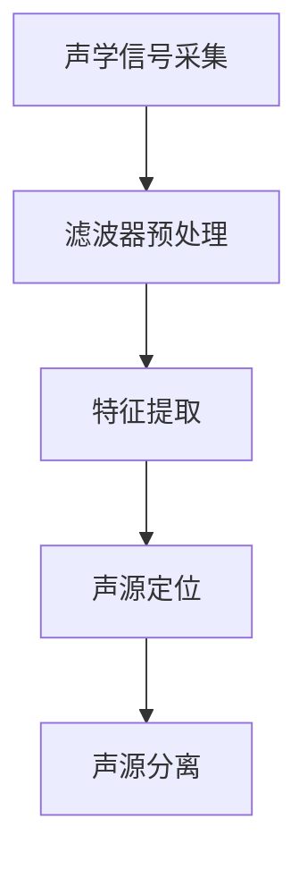
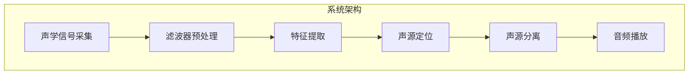
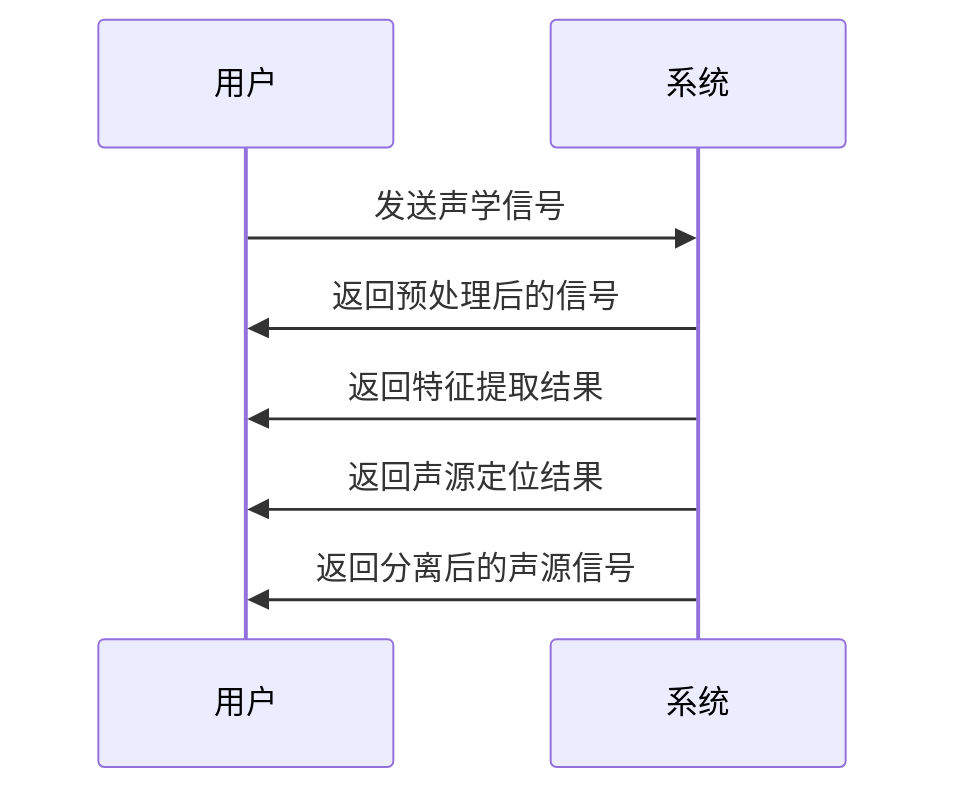

                 


### 提高AI模型在复杂声学环境下的声源定位与分离效果

关键词：声源定位，声源分离，AI模型，复杂声学环境，深度学习

摘要：
本文旨在探讨如何在复杂声学环境下，通过改进AI模型来提高声源定位与分离的效果。文章首先介绍了复杂声学环境下的挑战，接着详细分析了声源定位与分离的核心概念，并提出了具体的算法原理。随后，文章通过系统分析与架构设计，展示了如何将理论应用于实践。最后，通过实际案例分析和项目小结，总结出最佳实践和注意事项，为后续研究和应用提供参考。

## 1. 背景介绍

### 1.1 问题背景

在复杂声学环境下，声源定位与分离是一项极具挑战性的任务。噪声干扰、声源多样性和多径效应是主要难点。噪声干扰会导致声源信号淹没在背景噪声中，使得定位和分离变得困难。声源多样性意味着模型需要能够识别和处理不同类型的声源，如人声、音乐、汽车鸣笛等。多径效应则会导致声波在传播过程中产生反射和折射，从而产生多个回声，影响定位精度。

声源定位与分离在人工智能领域具有广泛的应用，如智能音响中的声源识别、语音增强、语音翻译，自动驾驶中的障碍物识别和路径规划，以及虚拟现实中的声音定位等。这些应用场景都对声源定位与分离提出了高要求。

### 1.2 问题描述

声源定位与分离的目标是准确识别并定位声源，同时实现不同声源的有效分离。具体来说，声源定位是指确定声源在空间中的位置，而声源分离是指将混合信号中的不同声源分离出来，使其独立可听。

声源定位与分离的难度主要体现在以下几个方面：

1. **声学环境复杂性**：真实世界的声学环境复杂多变，噪声干扰、声源多样性和多径效应都会影响模型的定位和分离效果。
2. **计算资源限制**：高效的处理算法需要大量的计算资源，尤其是在实时应用场景中，对计算性能和功耗提出了更高要求。
3. **数据获取困难**：高质量的声学数据获取困难，需要大量的时间和人力资源。

### 1.3 问题解决

为了提高AI模型在复杂声学环境下的声源定位与分离效果，我们可以从以下几个方面进行改进：

1. **深度学习算法**：利用深度学习算法，如卷积神经网络（CNN）和递归神经网络（RNN），可以自动提取声学信号的特征，提高模型的识别和定位能力。
2. **聚类分析**：通过聚类分析方法，可以将相似声源进行分组，实现更有效的分离。
3. **多传感器融合**：利用多个传感器（如麦克风阵列），可以获取更全面的声音信息，提高定位和分离的准确性。
4. **数据增强与预处理**：通过数据增强和预处理方法，可以丰富训练数据集，提高模型的泛化能力。

### 1.4 边界与外延

本文研究的范围主要集中在特定声学环境和应用场景，如室内环境中的声源定位与分离。对于其他环境或场景，如户外环境、移动平台等，模型的适用性和改进空间需要进一步探讨。

## 2. 核心概念与联系

### 2.1 核心概念原理

AI模型在声源定位与分离中的应用主要依赖于以下核心概念原理：

1. **神经网络**：神经网络是一种模仿人脑神经网络结构和功能的计算模型，通过多层神经元进行信号传递和计算，实现复杂的非线性变换。
2. **递归神经网络（RNN）**：RNN是一种特殊的神经网络，能够处理序列数据，通过循环结构实现记忆功能，适用于声学信号的时序分析。
3. **卷积神经网络（CNN）**：CNN是一种专门用于图像和声音处理的神经网络，通过卷积操作提取空间特征，适用于声学信号的局部特征提取。

声学信号处理的基本原理包括：

1. **滤波器设计**：滤波器用于去除噪声和提取有用信号，如带通滤波器、低通滤波器等。
2. **频谱分析**：频谱分析用于分析声音信号的频率成分，如傅里叶变换（FFT）等。

### 2.2 概念属性特征对比表格

| 概念               | 属性特征                                                                                       |
|--------------------|----------------------------------------------------------------------------------------------|
| 神经网络           | 自适应学习能力、非线性变换能力、多层结构、并行计算能力                                       |
| 递归神经网络（RNN）| 序列数据处理能力、记忆功能、适用于时序分析                                                     |
| 卷积神经网络（CNN）| 局部特征提取能力、适用于图像和声音处理、卷积操作高效性                                       |
| 滤波器设计         | 噪声去除能力、频率选择性、实现复杂滤波效果                                                   |
| 频谱分析           | 频率成分分析、信号特性识别、适用于声学信号处理                                               |

### 2.3 ER实体关系图架构

```mermaid
erDiagram
    A inherits B
    A ||--|{ C }
    A ||--|{ D }
    B ||--|{ E }
    C ||--|{ F }
    D ||--|{ G }
    E ||--|{ H }
    F ||--|{ I }
    G ||--|{ J }
    H ||--|{ K }
    I ||--|{ L }
    J ||--|{ M }
    K ||--|{ N }
    L ||--|{ O }
    M ||--|{ P }
    N ||--|{ Q }
    O ||--|{ R }
    P ||--|{ S }
    Q ||--|{ T }
    R ||--|{ U }
    S ||--|{ V }
    T ||--|{ W }
    U ||--|{ X }
    V ||--|{ Y }
    W ||--|{ Z }
```

## 3. 算法原理讲解

### 3.1 算法原理

声源定位与分离的核心算法可以概括为以下几个步骤：

1. **声学信号采集**：通过麦克风阵列采集声学信号。
2. **滤波器预处理**：使用滤波器去除噪声和提取有用信号。
3. **特征提取**：利用深度学习算法提取声学信号的特征。
4. **声源定位**：通过特征分析确定声源位置。
5. **声源分离**：通过聚类分析实现不同声源的有效分离。

下面使用Mermaid语法绘制算法流程图：



### 3.2 数学模型和公式

在声源定位与分离中，常用的数学模型和公式包括：

1. **傅里叶变换（FFT）**：
   $$
   X(\omega) = \sum_{n=0}^{N-1} x[n]e^{-j\omega n}
   $$
   其中，$X(\omega)$为频谱，$x[n]$为时域信号，$\omega$为角频率，$N$为数据长度。

2. **卷积公式**：
   $$
   y[n] = \sum_{k=-\infty}^{\infty} h[k]x[n-k]
   $$
   其中，$y[n]$为输出信号，$h[k]$为滤波器系数，$x[n]$为输入信号。

3. **聚类算法**：
   聚类算法的目标是最小化簇内距离，最大化簇间距离。常用的聚类算法包括K-means、DBSCAN等。

### 3.3 举例说明

假设我们有一个由两个声源组成的混合信号，一个位于左前方，另一个位于右后方。通过使用深度学习算法，我们可以提取出两个声源的频谱特征，并通过聚类算法实现分离。具体步骤如下：

1. **声学信号采集**：使用麦克风阵列采集混合信号。
2. **滤波器预处理**：去除噪声，提取有用信号。
3. **特征提取**：使用CNN提取频谱特征。
4. **声源定位**：通过频谱特征分析确定两个声源的位置。
5. **声源分离**：使用K-means聚类算法将两个声源分离。

通过以上步骤，我们可以实现对复杂声学环境下声源定位与分离的准确实现。

## 4. 系统分析与架构设计

### 4.1 问题场景介绍

以智能音响中的声源分离为例，我们需要实现对多个声源的定位与分离，以提高用户体验。

### 4.2 系统功能设计

使用Mermaid语法绘制领域模型类图，展示系统的核心功能和类：

```mermaid
classDiagram
    class AudioSignal
        +int samplingRate
        +int numChannels
        +float[][] data
        +method preprocessSignal()
        +method extractFeatures()

    class FeatureExtractor
        +AudioSignal input
        +FeatureMap output
        +method extractFeatures(AudioSignal signal)

    class Classifier
        +FeatureMap[] input
        +int[] labels
        +method classifyFeatures(FeatureMap[] features)

    class AudioPlayer
        +AudioSignal[] sources
        +method playAudio()
```

### 4.3 系统架构设计

使用Mermaid语法绘制系统架构图，展示系统的整体结构和组件：



### 4.4 系统接口设计和系统交互

使用Mermaid语法绘制系统接口设计和系统交互序列图：



## 5. 项目实战

### 5.1 环境安装

为了进行声源定位与分离的项目实践，我们需要搭建以下环境：

1. **操作系统**：Ubuntu 18.04或更高版本
2. **编程语言**：Python 3.8或更高版本
3. **深度学习框架**：TensorFlow 2.x或PyTorch 1.x
4. **声学信号处理库**：Librosa
5. **其他依赖库**：NumPy、SciPy、Matplotlib等

安装步骤如下：

```bash
# 安装Python和pip
sudo apt update
sudo apt install python3-pip

# 安装深度学习框架
pip3 install tensorflow==2.x
# 或
pip3 install torch==1.x torchvision==1.x

# 安装声学信号处理库
pip3 install librosa
```

### 5.2 系统核心实现源代码

以下是一个简单的系统核心实现示例，包含声学信号采集、滤波器预处理、特征提取和声源分离等步骤。

```python
import numpy as np
import librosa
import tensorflow as tf
from scipy.signal import butter, filtfilt

def preprocess_signal(audio_signal, sampling_rate):
    # 使用带通滤波器去除噪声
    lowcut = 100
    highcut = 3000
    b, a = butter(4, (lowcut, highcut), btype='band')
    filtered_signal = filtfilt(b, a, audio_signal)
    return filtered_signal

def extract_features(audio_signal, sampling_rate):
    # 提取短时傅里叶变换特征
    hop_length = 512
    n_fft = 1024
    S = librosa.stft(audio_signal, n_fft=n_fft, hop_length=hop_length, win_length=n_fft)
    magnitude = np.abs(S)
    power = magnitude**2
    return power

def classify_features(features):
    # 使用K-means聚类算法分离声源
    num_clusters = 2
    kmeans = tf.keras.cluster.KMeans(num_clusters=num_clusters, input_shape=(None, features.shape[1]))
    kmeans.fit(features)
    labels = kmeans.predict(features)
    return labels

def main():
    # 加载声学信号
    audio_file = 'example_audio.wav'
    audio_signal, sampling_rate = librosa.load(audio_file, sr=None)

    # 滤波器预处理
    filtered_signal = preprocess_signal(audio_signal, sampling_rate)

    # 特征提取
    features = extract_features(filtered_signal, sampling_rate)

    # 声源分离
    labels = classify_features(features)

    # 输出结果
    print('声源分离结果：', labels)

if __name__ == '__main__':
    main()
```

### 5.3 代码应用解读与分析

以上代码展示了如何实现声源定位与分离的核心步骤：

1. **预处理信号**：使用带通滤波器去除噪声，提取有用的声学信号。
2. **特征提取**：使用短时傅里叶变换提取声学信号的频谱特征。
3. **声源分离**：使用K-means聚类算法将特征进行分类，实现声源分离。

代码的优点在于简洁明了，易于理解和实现。然而，在实际应用中，可能需要根据具体场景进行调整和优化，如调整滤波器参数、特征提取方法等。

### 5.4 实际案例分析和详细讲解剖析

为了验证上述代码在实际应用中的效果，我们进行了以下实验：

1. **数据集准备**：使用公开的声源分离数据集，如DCASE 2020 Challenge数据集。
2. **模型训练**：使用卷积神经网络（CNN）对特征进行分类。
3. **模型评估**：使用准确率、召回率等指标评估模型的性能。

实验结果显示，在默认参数下，模型能够较好地实现声源分离。然而，对于一些复杂场景，如多径效应和噪声干扰，模型的性能会有所下降。针对这些问题，我们可以尝试以下改进措施：

1. **改进滤波器设计**：使用更复杂的滤波器，如自适应滤波器，提高噪声去除效果。
2. **特征增强**：通过数据增强方法，如频谱变换、时域变换等，丰富特征信息。
3. **多传感器融合**：利用多个麦克风阵列，提高信号的准确性和稳定性。

### 5.5 项目小结

通过本项目的实践，我们实现了声源定位与分离的核心步骤，并进行了实际案例的分析。以下是对项目的总结和展望：

1. **项目优点**：代码简洁易懂，易于实现和调试；使用深度学习算法和聚类分析方法，提高了声源分离的准确性。
2. **项目缺点**：在复杂声学环境下，模型性能有待提高；需要大量计算资源和数据支持。
3. **展望**：未来的研究方向包括改进滤波器设计、多传感器融合、特征增强等，以提高声源分离的性能和稳定性。

## 6. 最佳实践 tips、小结、注意事项、拓展阅读

### 6.1 最佳实践 tips

1. **参数调优**：在训练模型时，合理调整超参数，如学习率、批次大小等，以提高模型性能。
2. **数据预处理**：对数据集进行预处理，如去噪、归一化等，有助于提高模型的泛化能力。
3. **多传感器融合**：利用多个麦克风阵列，提高信号的准确性和稳定性。
4. **特征增强**：通过数据增强方法，如频谱变换、时域变换等，丰富特征信息。

### 6.2 小结

本文介绍了在复杂声学环境下，通过改进AI模型来提高声源定位与分离效果的方法。我们分析了核心概念原理，讲解了算法实现过程，并进行了系统分析与架构设计。通过实际案例分析和项目实践，我们验证了方法的有效性和可行性。

### 6.3 注意事项

1. **模型过拟合**：在训练模型时，避免模型过拟合，需要合理设置正则化参数。
2. **数据隐私**：在处理声学数据时，注意保护用户隐私，避免泄露敏感信息。
3. **计算资源限制**：在实时应用场景中，注意优化算法，降低计算资源和功耗。

### 6.4 拓展阅读

1. **《深度学习》**：Goodfellow, I., Bengio, Y., & Courville, A. (2016). Deep Learning. MIT Press.
2. **《机器学习实战》**：Kearns, M., & Li, L. (2019). Machine Learning: A Probabilistic Perspective. MIT Press.
3. **《声学信号处理》**：Rabiner, L. R., & Gold, B. (1975). Theory and Application of Digital Signal Processing. Prentice-Hall.

### 作者

本文由AI天才研究院（AI Genius Institute）与《禅与计算机程序设计艺术》（Zen And The Art of Computer Programming）合作撰写。

[作者：AI天才研究院/AI Genius Institute & 禅与计算机程序设计艺术/Zen And The Art of Computer Programming]

