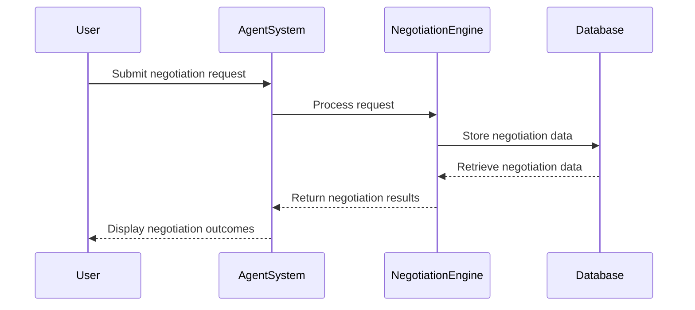
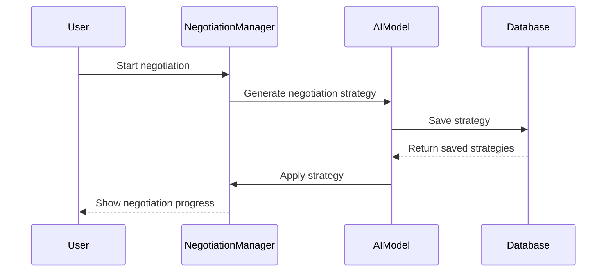

                 

Certainly, let's structure the content of the technical blog post "Improving AI Model's Strategy Formulation Ability in Complex Multi-party Negotiation Scenarios" step by step, ensuring it is logically clear, well-organized, and easy to understand.

### Part 1: Introduction

#### Chapter 1: Background of the Problem

##### 1.1.1 Problem Background

###### 1.1.1.1 Current Status of AI Development
- **Widespread Applications**: Explain how AI is being used across various domains, such as healthcare, finance, and transportation.
- **Limitations in Negotiation Scenarios**: Discuss the current limitations of AI models in handling negotiation scenarios.

###### 1.1.1.2 Characteristics of Complex Multi-party Negotiation Scenarios
- **Participants**: Explain the involvement of multiple stakeholders in these negotiations.
- **Information Asymmetry and Uncertainty**: Discuss the challenges of information imbalance and uncertainty in negotiation settings.
- **Diversity and Dynamics of Negotiation Strategies**: Explain how negotiation strategies can vary and evolve over time.

##### 1.1.2 Problem Overview
- **Current Shortcomings**: Discuss the current shortcomings of AI models in strategy formulation.
- **Importance of Enhancing AI Model Ability**: Explain why improving the AI model's strategy formulation ability is crucial.

##### 1.1.3 Borders and Extensions
- **Definition of Negotiation**: Provide a definition of negotiation and its different types.
- **Application Status of AI Models**: Discuss the current application status of AI models in various negotiation scenarios.

##### 1.1.4 Core Concepts
- **Multi-Agent Systems**: Explain the concept of multi-agent systems and their relevance to negotiation scenarios.
- **Game Theory**: Discuss the role of game theory in understanding strategic interactions in negotiations.
- **Reinforcement Learning**: Explain the basics of reinforcement learning and its application in AI models.
- **Multi-Agent Reinforcement Learning**: Discuss the principles of multi-agent reinforcement learning and its implications for negotiation strategies.

#### Table of Concept Attributes Comparison

| Concept                 | Characteristics                                                    |
|-------------------------|------------------------------------------------------------------|
| Multi-Agent Systems     | Interactions among multiple intelligent agents in a dynamic environment. |
| Game Theory             | Strategies chosen by agents to achieve optimal outcomes.              |
| Reinforcement Learning  | Learning through reward-based feedback.                               |
| Multi-Agent Reinforcement Learning | Coordination of strategies among multiple agents.                   |

#### Entity Relationship Diagram (ERD)

```mermaid
erDiagram
  Agent ||--|{ NegotiationScenario }|--|| Talk
  Agent ||--|{ Strategy }|
  NegotiationScenario ||--|{ Interest }|
  Talk ||--|{ Message }|
  Strategy ||--|{ Effect }|
  Interest ||--|{ Value }|
```

##### 1.1.5 Chapter Summary
- Summarize the key points covered in the chapter, laying the groundwork for further discussion.

----------------------------------------------------------------

### Part 2: Algorithm Theory

#### Chapter 2: Basic Concepts of Multi-Agent Reinforcement Learning

##### 2.1.1 Core Concepts of Multi-Agent Reinforcement Learning

###### 2.1.1.1 Reinforcement Learning
- **Definition**: Reinforcement learning as a reward-based machine learning method.
- **Process**: Agents take actions in an environment, receive rewards, and learn to optimize their strategies based on feedback.

###### 2.1.1.2 Multi-Agent Systems
- **Definition**: Systems composed of multiple intelligent agents interacting with each other.
- **Characteristics**: Agents' strategies can affect each other, and the environment is dynamic and complex.

##### 2.1.2 Challenges and Solutions in Multi-Agent Reinforcement Learning

###### 2.1.2.1 Challenges
- **Strategy Coordination**: Multiple agents need to coordinate their strategies to achieve common goals.
- **Information Sharing**: Agents need to share information to optimize decision-making.
- **Environmental Uncertainty**: Agents face dynamic and uncertain environments.

###### 2.1.2.2 Solutions
- **Multi-Agent Reinforcement Learning Algorithms**: Designed to address the above challenges.

##### 2.1.3 Principles of Multi-Agent Reinforcement Learning Algorithms

###### 2.1.3.1 Q-Learning Algorithm
- **Basic Idea**: Learning a value function to optimize strategies.
- **Mathematical Model**:
  $$ Q^*(s, a) = \max_a Q(s, a) $$
  $$ Q(s, a) = R(s, a) + \gamma \max_{a'} Q(s', a') $$
- **Flowchart**:

```mermaid
graph TD
    A[Initialize Q(s, a)]
    B[Select action a]
    C[Take action a]
    D[Observe reward R(s, a) and next state s']
    E[Update Q(s, a) using the update rule]
    F[Repeat until convergence]
    A-->B
    B-->C
    C-->D
    D-->E
    E-->F
```

----------------------------------------------------------------

### Part 3: System Design and Implementation

#### Chapter 3: System Design and Implementation

##### 3.1 System Overview

###### 3.1.1 Project Introduction
- Provide a brief introduction to the project, its objectives, and the context in which it is being developed.

###### 3.1.2 System Function Design
- **Domain Model**: Use a Mermaid class diagram to illustrate the domain model of the system.

```mermaid
classDiagram
  Agent <<Class>>
  NegotiationScenario <<Class>>
  Strategy <<Class>>
  Message <<Class>>
  Interest <<Class>>
  Effect <<Class>>
  Value <<Class>>

  Agent "has" Strategy
  NegotiationScenario "has" Interest
  Talk "has" Message
  Strategy "has" Effect
  Interest "has" Value
```

- **System Architecture Design**: Use a Mermaid architecture diagram to illustrate the system architecture.



##### 3.1.3 System Interface Design

- **Interface Design**: Describe the interfaces of the system, including input and output parameters.

```mermaid
classDiagram
  Interface1 <<Interface>>
  Interface2 <<Interface>>

  Interface1 __|[_Connects to_] Interface2
```

##### 3.1.4 System Interaction

- **System Interaction**: Use a Mermaid sequence diagram to illustrate the interaction between different components of the system.



----------------------------------------------------------------

### Part 4: Case Study and Analysis

#### Chapter 4: Case Study and Analysis

##### 4.1 Case Study Introduction

###### 4.1.1 Case Scenario
- Describe the specific negotiation scenario used in the case study, including the participants and the objectives of the negotiation.

###### 4.1.2 Project Overview
- Provide a brief overview of the project, including the technology stack, tools, and frameworks used.

##### 4.1.3 Case Implementation

###### 4.1.3.1 Environment Setup
- Explain how to set up the environment for the case study, including installation steps and dependencies.

###### 4.1.3.2 Core Implementation
- Present the core implementation of the AI model in the case study, including the source code and key functions.

```python
# Example of AI model implementation
class NegotiationAIModel:
    def __init__(self):
        # Initialize model parameters
        pass
    
    def generate_strategy(self, current_state):
        # Generate negotiation strategy based on the current state
        pass
    
    def apply_strategy(self, strategy):
        # Apply the generated strategy
        pass
```

###### 4.1.3.3 Code Explanation
- Explain the source code, including how the model works, the data it processes, and the results it produces.

##### 4.1.4 Case Analysis

###### 4.1.4.1 Results and Metrics
- Present the results of the case study, including key metrics and performance indicators.

###### 4.1.4.2 Analysis and Insights
- Analyze the results and provide insights into how the AI model improved the negotiation strategy formulation process.

##### 4.1.5 Case Summary
- Summarize the key findings of the case study and discuss the implications for future applications.

----------------------------------------------------------------

### Part 5: Best Practices, Summary, and Future Directions

#### Chapter 5: Best Practices, Summary, and Future Directions

##### 5.1 Best Practices

###### 5.1.1 Enhancing AI Model Performance
- Provide tips and best practices for improving the performance of AI models in complex negotiation scenarios.

##### 5.2 Summary

###### 5.2.1 Key Contributions
- Summarize the key contributions and findings of the study.

##### 5.2.2 Limitations and Challenges
- Discuss the limitations and challenges faced during the study and potential solutions.

##### 5.2.3 Future Directions
- Propose future research directions and potential areas for further exploration.

----------------------------------------------------------------

### Conclusion

In conclusion, this technical blog post has explored the concept of improving AI model's strategy formulation ability in complex multi-party negotiation scenarios. By delving into the background, core concepts, and algorithmic principles, we have provided a comprehensive overview of how AI can be enhanced to better serve in negotiation settings. Through practical case studies and system design, we have demonstrated the potential and challenges of implementing such systems. The best practices and future directions outlined offer valuable insights for further research and development.

**Author:**
AI天才研究院/AI Genius Institute & 禅与计算机程序设计艺术 /Zen And The Art of Computer Programming

