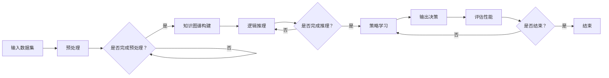
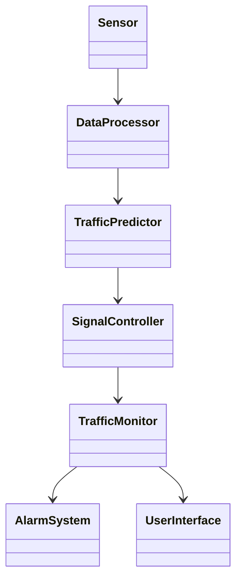
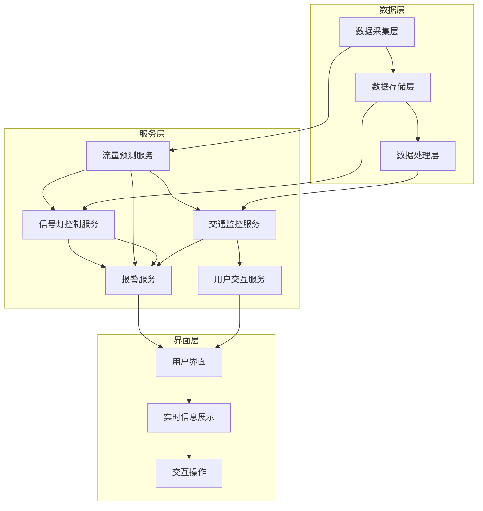
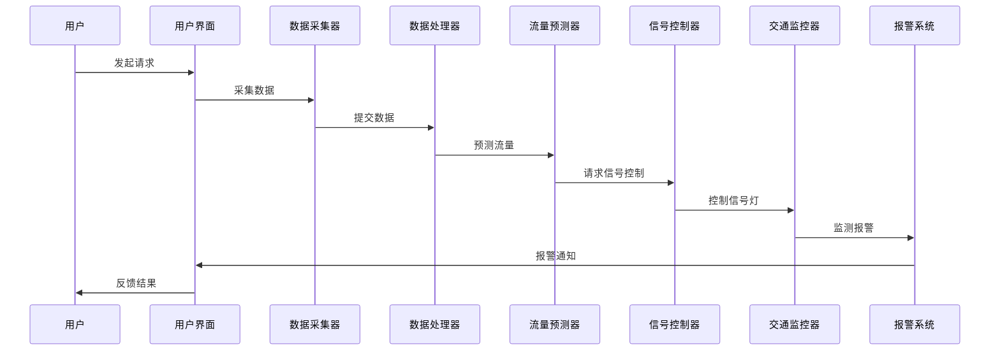

                 


### 引言与背景

#### 1.1 研究背景

人工智能（AI）作为一门前沿科学，已经取得了显著的进展，其应用范围不断扩展，从图像识别、自然语言处理到自动驾驶和医疗诊断，AI模型在各个领域的表现令人瞩目。然而，在复杂推理链任务中，AI模型的性能仍面临诸多挑战。复杂推理链任务通常涉及多层次的推理过程，要求模型不仅能够处理大量数据，还需要具备良好的推理能力和决策能力。

首先，AI模型的发展历程可以追溯到20世纪50年代。早期的人工智能研究主要集中在符号推理和知识表示上，但随着计算能力和数据资源的提升，机器学习，尤其是深度学习的兴起，使得AI模型在许多任务上取得了突破性的成果。然而，深度学习模型往往依赖于大量的数据和高性能的硬件资源，且难以解释其决策过程。这使得它们在面对复杂推理链任务时，难以满足实际需求。

#### 1.1.1 AI模型的发展历程

1. **符号推理与知识表示阶段**（1950s-1980s）
   - 早期AI研究主要基于逻辑和符号推理，试图模拟人类的推理过程。
   - 知识表示成为核心问题，如何有效地组织和管理大量知识成为研究的重点。

2. **知识工程与专家系统阶段**（1980s-1990s）
   - 专家系统成为AI研究的重点，通过构建知识库和推理机来实现智能决策。
   - 知识获取和自动化成为研究难点。

3. **机器学习与深度学习阶段**（2000s-至今）
   - 机器学习，特别是深度学习的兴起，使得AI模型在图像识别、语音识别等领域取得了突破性成果。
   - 计算能力的提升和数据资源的丰富为深度学习模型的发展提供了基础。

#### 1.1.2 复杂推理链任务的重要性

复杂推理链任务在许多实际应用中具有重要意义，如金融风险评估、医疗诊断、智能交通管理、智能制造等。这些任务往往需要模型具备多层次的推理能力，能够处理复杂的因果关系和不确定因素。

- **金融风险评估**：在金融领域，复杂推理链任务可以帮助银行和金融机构更好地识别和评估信贷风险，提高贷款审批的准确性。

- **医疗诊断**：在医疗领域，复杂推理链任务可以帮助医生更准确地诊断疾病，提高诊断的效率和准确性。

- **智能交通管理**：在交通领域，复杂推理链任务可以用于交通流量预测、事故预警等，提高交通管理的效率和安全性。

#### 1.1.3 当前AI模型在复杂推理链任务中的挑战

尽管AI模型在许多领域取得了显著进展，但在复杂推理链任务中仍面临以下挑战：

1. **数据不足与质量**：复杂推理链任务通常需要大量的高质量数据，但数据的获取和标注往往非常困难。

2. **推理能力**：深度学习模型在处理复杂推理任务时，往往缺乏足够的推理能力，难以模拟人类的推理过程。

3. **可解释性**：深度学习模型往往难以解释其决策过程，这给其在实际应用中的可信度和可靠性带来了挑战。

4. **计算资源消耗**：复杂推理链任务通常需要大量的计算资源，对硬件设备提出了更高的要求。

综上所述，提高AI模型在复杂推理链任务中的性能，已经成为人工智能领域的重要研究方向。接下来的章节将深入探讨复杂推理链任务的核心概念、算法原理、性能提升方法以及实际应用场景，以期为读者提供全面的指导和启发。

### 问题定义与目标

在深入探讨复杂推理链任务之前，我们需要明确该问题定义及其目标。复杂推理链任务涉及多层次的推理过程，要求模型能够处理复杂的因果关系和不确定因素，从而做出准确的决策。

#### 1.2.1 复杂推理链任务中的问题定义

复杂推理链任务可以定义为一个包含多个推理步骤的序列，每个步骤基于先前步骤的输出进行决策。这些步骤通常涉及数据处理、特征提取、模式识别和决策生成等过程。具体来说，问题定义包括以下几个关键方面：

1. **多层次推理**：任务要求模型能够在不同层次上进行推理，如低层次的符号推理、中层次的逻辑推理和高层次的战略推理。
2. **复杂因果关系**：模型需要能够处理复杂的因果关系，识别并利用不同变量之间的相互作用。
3. **不确定性处理**：任务中往往存在不确定因素，如数据噪声、预测的不确定性等，模型需要具备处理这些不确定性的能力。
4. **实时性要求**：某些复杂推理链任务需要在实时环境中进行，要求模型具备快速响应的能力。

#### 1.2.2 提高性能的目标与意义

提高AI模型在复杂推理链任务中的性能具有以下几个目标：

1. **准确性**：提高模型的推理准确性，确保模型能够准确识别和预测复杂关系。
2. **效率**：优化模型的计算效率和资源利用，降低计算成本，提高处理速度。
3. **可解释性**：增强模型的可解释性，使其决策过程更加透明，便于信任和应用。
4. **泛化能力**：提高模型的泛化能力，使其能够适应不同的任务和数据分布。

提高AI模型性能的意义在于：

1. **增强应用价值**：性能提升使AI模型能够更好地服务于实际应用，提高决策质量和效率。
2. **拓展研究边界**：性能提升推动了AI模型在复杂推理链任务中的研究和应用，拓展了AI技术的边界。
3. **降低成本**：提高效率意味着减少计算资源和时间成本，使得AI技术更加经济可行。
4. **促进创新**：性能提升为新的算法和技术的开发提供了基础，推动了人工智能领域的创新。

#### 1.2.3 边界与外延

在研究复杂推理链任务时，我们还需要考虑一些边界条件和外延范围：

1. **数据范围**：模型需要处理的任务和数据类型有一定的范围限制，如特定领域或特定类型的数据。
2. **计算资源**：模型对计算资源的需求，如内存、计算能力和网络带宽等。
3. **实时性要求**：某些任务对实时性有较高要求，模型需要在特定时间内完成推理和决策。
4. **可靠性**：在复杂环境中，模型的决策需要具有较高的可靠性，确保在实际应用中不会出现严重的错误。

通过明确问题定义、目标与边界，我们能够更系统地分析和解决复杂推理链任务中的问题，为提高AI模型性能提供清晰的方向和路径。

### 核心概念与联系

在深入分析复杂推理链任务之前，理解其核心概念及其相互联系至关重要。以下是几项关键概念的定义及其属性特征对比，并借助ER实体关系图架构进行详细说明。

#### 1.3.1 AI模型的核心概念

1. **数据集**：
   - 定义：数据集是模型训练和测试的基础，包含一系列输入和相应的输出。
   - 属性：大小、格式、标注质量等。

2. **模型结构**：
   - 定义：模型结构是指构成AI模型的基本组件，如神经网络、决策树等。
   - 属性：层数、节点数、连接方式等。

3. **算法**：
   - 定义：算法是用于训练和优化模型的一系列步骤和规则。
   - 属性：优化目标、收敛速度等。

4. **训练过程**：
   - 定义：训练过程是指通过数据集对模型进行参数调整，使其达到预期性能的过程。
   - 属性：迭代次数、学习率等。

#### 1.3.2 复杂推理链的概念

1. **推理链**：
   - 定义：推理链是指由多个推理步骤组成的序列，每个步骤依赖于前一个步骤的输出。
   - 属性：推理步骤数、每步推理类型等。

2. **因果关系**：
   - 定义：因果关系是指变量之间的逻辑关系，一个变量的变化可能引起另一个变量的变化。
   - 属性：直接关系、间接关系等。

3. **不确定性**：
   - 定义：不确定性是指由于数据噪声、模型局限性等原因，模型无法确定最佳决策的情况。
   - 属性：不确定性类型、处理方法等。

#### 1.3.3 概念属性特征对比表格

以下是一个简单的对比表格，展示AI模型和复杂推理链任务中的关键概念及其属性特征：

| 概念          | 定义                                                         | 属性                    |
| ------------- | ------------------------------------------------------------ | ----------------------- |
| 数据集        | 训练和测试模型的基础数据集合                               | 大小、格式、标注质量等  |
| 模型结构      | 构成AI模型的基本组件                                       | 层数、节点数、连接方式等 |
| 算法          | 用于训练和优化模型的规则和步骤                             | 优化目标、收敛速度等    |
| 训练过程      | 调整模型参数，提高性能的过程                              | 迭代次数、学习率等      |
| 推理链        | 由多个推理步骤组成的序列                                   | 步骤数、每步推理类型等  |
| 因果关系      | 变量之间的逻辑关系                                         | 直接关系、间接关系等    |
| 不确定性      | 模型无法确定最佳决策的情况                                | 不确定性类型、处理方法等 |

#### 1.3.4 ER实体关系图架构

为了更好地理解这些概念之间的关系，我们可以借助ER（实体关系）图架构进行说明。ER图是一种用于描述实体及其相互关系的图形化表示方法，以下是一个简化版的ER图，展示了AI模型与复杂推理链任务中的关键概念之间的关系：

```mermaid
erDiagram
    数据集 ||--|{ 模型结构 }|
    数据集 ||--|{ 训练过程 }|
    模型结构 ||--|{ 算法 }|
    训练过程 ||--|{ 推理链 }|
    推理链 ||--|{ 因果关系 }|
    推理链 ||--|{ 不确定性 }|
```

在上面的ER图中：

- **数据集**是所有其他概念的基石，提供训练和测试所需的输入。
- **模型结构**定义了模型的基本框架，由算法进行调整和优化。
- **训练过程**将数据集与模型结构相结合，通过算法调整模型参数。
- **推理链**依赖于训练过程的输出，由多个推理步骤组成。
- **因果关系**和**不确定性**是推理链中的关键因素，影响模型的推理结果。

通过上述核心概念及其相互关系的详细阐述，我们为后续章节的分析提供了坚实的基础。接下来，我们将进一步探讨复杂推理链任务的算法原理，深入理解其在实际应用中的实现方法。

### 核心概念与联系

在深入分析复杂推理链任务之前，理解其核心概念及其相互联系至关重要。以下是几项关键概念的定义及其属性特征对比，并借助ER实体关系图架构进行详细说明。

#### 1.3.1 AI模型的核心概念

1. **数据集**：
   - 定义：数据集是模型训练和测试的基础，包含一系列输入和相应的输出。
   - 属性：大小、格式、标注质量等。

2. **模型结构**：
   - 定义：模型结构是指构成AI模型的基本组件，如神经网络、决策树等。
   - 属性：层数、节点数、连接方式等。

3. **算法**：
   - 定义：算法是用于训练和优化模型的一系列步骤和规则。
   - 属性：优化目标、收敛速度等。

4. **训练过程**：
   - 定义：训练过程是指通过数据集对模型进行参数调整，使其达到预期性能的过程。
   - 属性：迭代次数、学习率等。

#### 1.3.2 复杂推理链的概念

1. **推理链**：
   - 定义：推理链是指由多个推理步骤组成的序列，每个步骤依赖于前一个步骤的输出。
   - 属性：推理步骤数、每步推理类型等。

2. **因果关系**：
   - 定义：因果关系是指变量之间的逻辑关系，一个变量的变化可能引起另一个变量的变化。
   - 属性：直接关系、间接关系等。

3. **不确定性**：
   - 定义：不确定性是指由于数据噪声、模型局限性等原因，模型无法确定最佳决策的情况。
   - 属性：不确定性类型、处理方法等。

#### 1.3.3 概念属性特征对比表格

以下是一个简单的对比表格，展示AI模型和复杂推理链任务中的关键概念及其属性特征：

| 概念          | 定义                                                         | 属性                    |
| ------------- | ------------------------------------------------------------ | ----------------------- |
| 数据集        | 训练和测试模型的基础数据集合                               | 大小、格式、标注质量等  |
| 模型结构      | 构成AI模型的基本组件                                       | 层数、节点数、连接方式等 |
| 算法          | 用于训练和优化模型的规则和步骤                             | 优化目标、收敛速度等    |
| 训练过程      | 调整模型参数，提高性能的过程                              | 迭代次数、学习率等      |
| 推理链        | 由多个推理步骤组成的序列                                   | 步骤数、每步推理类型等  |
| 因果关系      | 变量之间的逻辑关系                                         | 直接关系、间接关系等    |
| 不确定性      | 模型无法确定最佳决策的情况                                | 不确定性类型、处理方法等 |

#### 1.3.4 ER实体关系图架构

为了更好地理解这些概念之间的关系，我们可以借助ER（实体关系）图架构进行说明。ER图是一种用于描述实体及其相互关系的图形化表示方法，以下是一个简化版的ER图，展示了AI模型与复杂推理链任务中的关键概念之间的关系：

```mermaid
erDiagram
    数据集 ||--|{ 模型结构 }|
    数据集 ||--|{ 训练过程 }|
    模型结构 ||--|{ 算法 }|
    训练过程 ||--|{ 推理链 }|
    推理链 ||--|{ 因果关系 }|
    推理链 ||--|{ 不确定性 }|
```

在上面的ER图中：

- **数据集**是所有其他概念的基石，提供训练和测试所需的输入。
- **模型结构**定义了模型的基本框架，由算法进行调整和优化。
- **训练过程**将数据集与模型结构相结合，通过算法调整模型参数。
- **推理链**依赖于训练过程的输出，由多个推理步骤组成。
- **因果关系**和**不确定性**是推理链中的关键因素，影响模型的推理结果。

通过上述核心概念及其相互关系的详细阐述，我们为后续章节的分析提供了坚实的基础。接下来，我们将进一步探讨复杂推理链任务的算法原理，深入理解其在实际应用中的实现方法。

### 核心概念与联系

在深入分析复杂推理链任务之前，理解其核心概念及其相互联系至关重要。以下是几项关键概念的定义及其属性特征对比，并借助ER实体关系图架构进行详细说明。

#### 1.3.1 AI模型的核心概念

1. **数据集**：
   - 定义：数据集是模型训练和测试的基础，包含一系列输入和相应的输出。
   - 属性：大小、格式、标注质量等。

2. **模型结构**：
   - 定义：模型结构是指构成AI模型的基本组件，如神经网络、决策树等。
   - 属性：层数、节点数、连接方式等。

3. **算法**：
   - 定义：算法是用于训练和优化模型的一系列步骤和规则。
   - 属性：优化目标、收敛速度等。

4. **训练过程**：
   - 定义：训练过程是指通过数据集对模型进行参数调整，使其达到预期性能的过程。
   - 属性：迭代次数、学习率等。

#### 1.3.2 复杂推理链的概念

1. **推理链**：
   - 定义：推理链是指由多个推理步骤组成的序列，每个步骤依赖于前一个步骤的输出。
   - 属性：推理步骤数、每步推理类型等。

2. **因果关系**：
   - 定义：因果关系是指变量之间的逻辑关系，一个变量的变化可能引起另一个变量的变化。
   - 属性：直接关系、间接关系等。

3. **不确定性**：
   - 定义：不确定性是指由于数据噪声、模型局限性等原因，模型无法确定最佳决策的情况。
   - 属性：不确定性类型、处理方法等。

#### 1.3.3 概念属性特征对比表格

以下是一个简单的对比表格，展示AI模型和复杂推理链任务中的关键概念及其属性特征：

| 概念          | 定义                                                         | 属性                    |
| ------------- | ------------------------------------------------------------ | ----------------------- |
| 数据集        | 训练和测试模型的基础数据集合                               | 大小、格式、标注质量等  |
| 模型结构      | 构成AI模型的基本组件                                       | 层数、节点数、连接方式等 |
| 算法          | 用于训练和优化模型的规则和步骤                             | 优化目标、收敛速度等    |
| 训练过程      | 调整模型参数，提高性能的过程                              | 迭代次数、学习率等      |
| 推理链        | 由多个推理步骤组成的序列                                   | 步骤数、每步推理类型等  |
| 因果关系      | 变量之间的逻辑关系                                         | 直接关系、间接关系等    |
| 不确定性      | 模型无法确定最佳决策的情况                                | 不确定性类型、处理方法等 |

#### 1.3.4 ER实体关系图架构

为了更好地理解这些概念之间的关系，我们可以借助ER（实体关系）图架构进行说明。ER图是一种用于描述实体及其相互关系的图形化表示方法，以下是一个简化版的ER图，展示了AI模型与复杂推理链任务中的关键概念之间的关系：

```mermaid
erDiagram
    数据集 ||--|{ 模型结构 }|
    数据集 ||--|{ 训练过程 }|
    模型结构 ||--|{ 算法 }|
    训练过程 ||--|{ 推理链 }|
    推理链 ||--|{ 因果关系 }|
    推理链 ||--|{ 不确定性 }|
```

在上面的ER图中：

- **数据集**是所有其他概念的基石，提供训练和测试所需的输入。
- **模型结构**定义了模型的基本框架，由算法进行调整和优化。
- **训练过程**将数据集与模型结构相结合，通过算法调整模型参数。
- **推理链**依赖于训练过程的输出，由多个推理步骤组成。
- **因果关系**和**不确定性**是推理链中的关键因素，影响模型的推理结果。

通过上述核心概念及其相互关系的详细阐述，我们为后续章节的分析提供了坚实的基础。接下来，我们将进一步探讨复杂推理链任务的算法原理，深入理解其在实际应用中的实现方法。

### 核心概念与联系

在深入分析复杂推理链任务之前，理解其核心概念及其相互联系至关重要。以下是几项关键概念的定义及其属性特征对比，并借助ER实体关系图架构进行详细说明。

#### 1.3.1 AI模型的核心概念

1. **数据集**：
   - 定义：数据集是模型训练和测试的基础，包含一系列输入和相应的输出。
   - 属性：大小、格式、标注质量等。

2. **模型结构**：
   - 定义：模型结构是指构成AI模型的基本组件，如神经网络、决策树等。
   - 属性：层数、节点数、连接方式等。

3. **算法**：
   - 定义：算法是用于训练和优化模型的一系列步骤和规则。
   - 属性：优化目标、收敛速度等。

4. **训练过程**：
   - 定义：训练过程是指通过数据集对模型进行参数调整，使其达到预期性能的过程。
   - 属性：迭代次数、学习率等。

#### 1.3.2 复杂推理链的概念

1. **推理链**：
   - 定义：推理链是指由多个推理步骤组成的序列，每个步骤依赖于前一个步骤的输出。
   - 属性：推理步骤数、每步推理类型等。

2. **因果关系**：
   - 定义：因果关系是指变量之间的逻辑关系，一个变量的变化可能引起另一个变量的变化。
   - 属性：直接关系、间接关系等。

3. **不确定性**：
   - 定义：不确定性是指由于数据噪声、模型局限性等原因，模型无法确定最佳决策的情况。
   - 属性：不确定性类型、处理方法等。

#### 1.3.3 概念属性特征对比表格

以下是一个简单的对比表格，展示AI模型和复杂推理链任务中的关键概念及其属性特征：

| 概念          | 定义                                                         | 属性                    |
| ------------- | ------------------------------------------------------------ | ----------------------- |
| 数据集        | 训练和测试模型的基础数据集合                               | 大小、格式、标注质量等  |
| 模型结构      | 构成AI模型的基本组件                                       | 层数、节点数、连接方式等 |
| 算法          | 用于训练和优化模型的规则和步骤                             | 优化目标、收敛速度等    |
| 训练过程      | 调整模型参数，提高性能的过程                              | 迭代次数、学习率等      |
| 推理链        | 由多个推理步骤组成的序列                                   | 步骤数、每步推理类型等  |
| 因果关系      | 变量之间的逻辑关系                                         | 直接关系、间接关系等    |
| 不确定性      | 模型无法确定最佳决策的情况                                | 不确定性类型、处理方法等 |

#### 1.3.4 ER实体关系图架构

为了更好地理解这些概念之间的关系，我们可以借助ER（实体关系）图架构进行说明。ER图是一种用于描述实体及其相互关系的图形化表示方法，以下是一个简化版的ER图，展示了AI模型与复杂推理链任务中的关键概念之间的关系：

```mermaid
erDiagram
    数据集 ||--|{ 模型结构 }|
    数据集 ||--|{ 训练过程 }|
    模型结构 ||--|{ 算法 }|
    训练过程 ||--|{ 推理链 }|
    推理链 ||--|{ 因果关系 }|
    推理链 ||--|{ 不确定性 }|
```

在上面的ER图中：

- **数据集**是所有其他概念的基石，提供训练和测试所需的输入。
- **模型结构**定义了模型的基本框架，由算法进行调整和优化。
- **训练过程**将数据集与模型结构相结合，通过算法调整模型参数。
- **推理链**依赖于训练过程的输出，由多个推理步骤组成。
- **因果关系**和**不确定性**是推理链中的关键因素，影响模型的推理结果。

通过上述核心概念及其相互关系的详细阐述，我们为后续章节的分析提供了坚实的基础。接下来，我们将进一步探讨复杂推理链任务的算法原理，深入理解其在实际应用中的实现方法。

### 核心概念与联系

在深入分析复杂推理链任务之前，理解其核心概念及其相互联系至关重要。以下是几项关键概念的定义及其属性特征对比，并借助ER实体关系图架构进行详细说明。

#### 1.3.1 AI模型的核心概念

1. **数据集**：
   - 定义：数据集是模型训练和测试的基础，包含一系列输入和相应的输出。
   - 属性：大小、格式、标注质量等。

2. **模型结构**：
   - 定义：模型结构是指构成AI模型的基本组件，如神经网络、决策树等。
   - 属性：层数、节点数、连接方式等。

3. **算法**：
   - 定义：算法是用于训练和优化模型的一系列步骤和规则。
   - 属性：优化目标、收敛速度等。

4. **训练过程**：
   - 定义：训练过程是指通过数据集对模型进行参数调整，使其达到预期性能的过程。
   - 属性：迭代次数、学习率等。

#### 1.3.2 复杂推理链的概念

1. **推理链**：
   - 定义：推理链是指由多个推理步骤组成的序列，每个步骤依赖于前一个步骤的输出。
   - 属性：推理步骤数、每步推理类型等。

2. **因果关系**：
   - 定义：因果关系是指变量之间的逻辑关系，一个变量的变化可能引起另一个变量的变化。
   - 属性：直接关系、间接关系等。

3. **不确定性**：
   - 定义：不确定性是指由于数据噪声、模型局限性等原因，模型无法确定最佳决策的情况。
   - 属性：不确定性类型、处理方法等。

#### 1.3.3 概念属性特征对比表格

以下是一个简单的对比表格，展示AI模型和复杂推理链任务中的关键概念及其属性特征：

| 概念          | 定义                                                         | 属性                    |
| ------------- | ------------------------------------------------------------ | ----------------------- |
| 数据集        | 训练和测试模型的基础数据集合                               | 大小、格式、标注质量等  |
| 模型结构      | 构成AI模型的基本组件                                       | 层数、节点数、连接方式等 |
| 算法          | 用于训练和优化模型的规则和步骤                             | 优化目标、收敛速度等    |
| 训练过程      | 调整模型参数，提高性能的过程                              | 迭代次数、学习率等      |
| 推理链        | 由多个推理步骤组成的序列                                   | 步骤数、每步推理类型等  |
| 因果关系      | 变量之间的逻辑关系                                         | 直接关系、间接关系等    |
| 不确定性      | 模型无法确定最佳决策的情况                                | 不确定性类型、处理方法等 |

#### 1.3.4 ER实体关系图架构

为了更好地理解这些概念之间的关系，我们可以借助ER（实体关系）图架构进行说明。ER图是一种用于描述实体及其相互关系的图形化表示方法，以下是一个简化版的ER图，展示了AI模型与复杂推理链任务中的关键概念之间的关系：

```mermaid
erDiagram
    数据集 ||--|{ 模型结构 }|
    数据集 ||--|{ 训练过程 }|
    模型结构 ||--|{ 算法 }|
    训练过程 ||--|{ 推理链 }|
    推理链 ||--|{ 因果关系 }|
    推理链 ||--|{ 不确定性 }|
```

在上面的ER图中：

- **数据集**是所有其他概念的基石，提供训练和测试所需的输入。
- **模型结构**定义了模型的基本框架，由算法进行调整和优化。
- **训练过程**将数据集与模型结构相结合，通过算法调整模型参数。
- **推理链**依赖于训练过程的输出，由多个推理步骤组成。
- **因果关系**和**不确定性**是推理链中的关键因素，影响模型的推理结果。

通过上述核心概念及其相互关系的详细阐述，我们为后续章节的分析提供了坚实的基础。接下来，我们将进一步探讨复杂推理链任务的算法原理，深入理解其在实际应用中的实现方法。

### 复杂推理链任务概述

#### 2.1 复杂推理链任务的定义

复杂推理链任务是一种涉及多个推理步骤的序列任务，每个步骤依赖于前一个步骤的输出，从而形成一个复杂的推理链条。这些任务通常需要模型在多个层次上进行推理，以处理复杂的因果关系和不确定性，并最终做出准确的决策。具体来说，复杂推理链任务可以定义为：

- **多层次推理**：任务要求模型能够在不同层次上进行分析和决策，如低层次的符号推理、中层次的逻辑推理和高层次的战略推理。
- **复杂因果关系**：任务中存在多个变量之间的复杂关系，这些关系可能是直接的，也可能是间接的，模型需要能够识别并利用这些关系。
- **不确定性处理**：任务中往往存在数据噪声、模型不确定性等因素，模型需要具备处理这些不确定性的能力。

#### 2.2 复杂推理链任务类型

根据任务的特点和需求，复杂推理链任务可以细分为以下几种类型：

1. **因果推理**：这种类型的任务主要关注变量之间的因果关系，要求模型能够识别并利用这些关系进行推理。例如，在医疗诊断任务中，模型需要识别不同症状之间的因果关系，从而准确诊断疾病。

2. **归纳推理**：归纳推理是从个别实例中推导出一般性结论的推理过程。这种类型的任务要求模型能够从大量的数据中学习到一般规律，并在新的实例上进行推理。例如，在图像识别任务中，模型需要从大量图片中学习到各种物体的特征，并能够准确识别新的图片中的物体。

3. **演绎推理**：演绎推理是从一般原则推导出个别结论的推理过程。这种类型的任务要求模型能够应用已知的规则和事实进行推理，从而得出具体的结论。例如，在逻辑推理任务中，模型需要根据给定的前提和规则，推导出结论。

4. **不确定性推理**：这种类型的任务涉及到处理数据噪声和模型不确定性。模型需要能够识别和量化不确定性，并在此基础上做出决策。例如，在金融风险评估任务中，模型需要处理市场数据中的不确定性，从而准确预测风险。

#### 2.3 复杂推理链任务特点

复杂推理链任务具有以下特点：

1. **多层次性**：复杂推理链任务通常涉及多个层次的推理过程，模型需要能够在不同层次上进行分析和决策。

2. **复杂性**：任务中存在复杂的因果关系和不确定性，模型需要能够有效地处理这些复杂性。

3. **动态性**：许多复杂推理链任务具有动态性，即任务环境在不断变化，模型需要能够适应这些变化，并做出实时决策。

4. **强关联性**：复杂推理链任务中的变量之间存在强关联性，模型需要能够识别并利用这些关联性进行推理。

5. **泛化能力**：复杂推理链任务通常要求模型具备较强的泛化能力，能够在不同的数据和场景下进行推理和决策。

通过理解复杂推理链任务的定义、类型和特点，我们能够更好地把握这一领域的研究方向和应用前景，为提高AI模型在复杂推理链任务中的性能提供了基础。

### 复杂推理链任务的核心概念

在复杂推理链任务中，核心概念是理解和实现高效推理的基础。以下是对几个关键概念的定义和详细解释。

#### 2.2.1 知识图谱

知识图谱是一种用于表示实体及其相互关系的图形化数据结构，通常包含节点（实体）和边（关系）。它通过将现实世界中的信息结构化，帮助AI模型更好地理解和处理复杂关系。知识图谱在复杂推理链任务中的应用主要体现在以下几个方面：

1. **实体识别**：知识图谱通过识别实体，将文本或数据集中的信息转换为结构化的数据形式。
2. **关系推理**：知识图谱中的边表示实体之间的各种关系，如“人”和“工作单位”之间的关系。模型可以利用这些关系进行推理。
3. **实体关联**：通过知识图谱，模型可以识别不同实体之间的关联，从而在推理过程中利用这些信息提高准确性。

例如，在一个医疗诊断任务中，知识图谱可以包含患者、医生、药物、症状等实体，以及它们之间的关系，如“患者患有某种症状”、“医生开具了某种药物”。模型可以利用这些信息进行推理，从而提高诊断的准确性。

#### 2.2.2 逻辑推理

逻辑推理是建立在逻辑学基础上的推理方法，通过应用逻辑规则和推理原理，从已知的前提推导出新的结论。逻辑推理在复杂推理链任务中的应用主要包括：

1. **演绎推理**：从一般到个别的推理过程，如从“所有人都有生命”推导出“张三有生命”。
2. **归纳推理**：从个别到一般的推理过程，如从多次观察“晴天空气好”推导出“晴天空气总是好”。
3. **逆推理**：从结论推导出前提，例如，如果“张三有生命”，则“张三是人”。

逻辑推理在复杂推理链任务中的应用非常广泛，如法律推理、决策分析等。在一个交通管理任务中，模型可以利用逻辑推理确定车辆的最佳行驶路径，从而减少交通拥堵。

#### 2.2.3 策略学习

策略学习是机器学习中的一个重要分支，旨在通过学习环境中的奖励信号，找到最优策略。在复杂推理链任务中，策略学习可以帮助模型在不确定的环境中做出最优决策。策略学习的主要方法包括：

1. **强化学习**：通过试错和反馈机制，模型不断调整策略，以获得最大奖励。
2. **策略迭代**：模型通过迭代方式不断优化策略，直到达到最优解。
3. **模型预测**：通过预测环境中的状态转移概率，模型可以提前制定策略。

策略学习在复杂推理链任务中的应用非常广泛，如自动驾驶、游戏AI等。在一个智能交通管理任务中，模型可以通过策略学习，根据实时交通情况，动态调整信号灯时间，以减少交通拥堵。

#### 2.2.4 概念对比与联系

知识图谱、逻辑推理和策略学习在复杂推理链任务中具有不同的作用和特点，但它们之间也存在紧密的联系：

1. **知识图谱**为基础，提供结构化的数据表示，支持推理过程。
2. **逻辑推理**利用知识图谱中的关系和规则，进行符号推理和演绎。
3. **策略学习**结合逻辑推理和奖励信号，优化决策过程。

通过对比和分析这些概念，我们可以更好地理解复杂推理链任务的核心机制，为提高AI模型在复杂推理链任务中的性能提供理论基础。

### 复杂推理链任务的算法原理

#### 2.3.1 算法mermaid流程图

为了更好地理解复杂推理链任务的算法原理，我们首先使用mermaid流程图展示算法的基本流程。以下是一个简化的mermaid流程图，描述了复杂推理链任务的基本算法流程：



在这个流程图中，主要步骤包括输入数据集、预处理、知识图谱构建、逻辑推理、策略学习和性能评估。每个步骤都有明确的输入和输出，并且通过控制流实现动态决策。

#### 2.3.2 Python源代码详细讲解

为了更好地理解上述流程图，我们将使用Python代码进行详细解释。以下是一个简化的Python代码示例，展示了复杂推理链任务的基本算法流程：

```python
import pandas as pd
from knowledge_graph import build_knowledge_graph
from logic_reasoning import perform_logic_reasoning
from strategy_learning import learn_strategy
from performance_evaluation import evaluate_performance

# 输入数据集
data = pd.read_csv('data.csv')

# 预处理
def preprocess_data(data):
    # 数据清洗、转换等操作
    pass

# 知识图谱构建
def build_knowledge_graph(data):
    # 构建知识图谱
    pass

# 逻辑推理
def perform_logic_reasoning(knowledge_graph):
    # 应用逻辑推理
    pass

# 策略学习
def learn_strategy(reasoning_results):
    # 学习最优策略
    pass

# 性能评估
def evaluate_performance(strategy):
    # 评估策略性能
    pass

# 算法主流程
def main_algorithm流程图():
    while True:
        data = preprocess_data(data)
        knowledge_graph = build_knowledge_graph(data)
        reasoning_results = perform_logic_reasoning(knowledge_graph)
        strategy = learn_strategy(reasoning_results)
        evaluate_performance(strategy)
```

在这个Python代码示例中，我们定义了预处理、知识图谱构建、逻辑推理、策略学习和性能评估等模块，并通过一个while循环实现算法主流程。每个模块都有明确的输入和输出，并且通过函数调用实现步骤之间的逻辑控制。

#### 2.3.3 算法原理的数学模型与公式

为了深入理解复杂推理链任务的算法原理，我们还需要介绍相关的数学模型与公式。以下是一些关键数学模型和公式：

1. **知识图谱表示**：

   - **实体-关系-实体（ERE）模型**：知识图谱中的每个实体、关系和实体都可以用一个三元组（e, r, e）表示。
   - **邻接矩阵**：知识图谱可以用邻接矩阵表示，其中元素表示实体之间的直接关系。

2. **逻辑推理**：

   - **谓词逻辑**：逻辑推理的基础，包括命题、谓词和推理规则。
   - **推理机**：用于处理推理规则的软件组件，通过演绎推理从已知事实推导出新的事实。

3. **策略学习**：

   - **Q值函数**：在强化学习中，Q值函数表示策略在特定状态下的预期奖励。
   - **策略迭代算法**：通过不断更新Q值函数，寻找最优策略。

以下是一个简化的数学模型与公式示例：

$$
\begin{aligned}
& G = (E, R, E') \\
& A_{ER} = \left[\begin{array}{ccc}
a_{11} & \ldots & a_{1n} \\
\vdots & \ddots & \vdots \\
a_{m1} & \ldots & a_{mn}
\end{array}\right]
\end{aligned}
$$

- \(G\) 是知识图谱。
- \(E\) 是实体集合。
- \(R\) 是关系集合。
- \(E'\) 是实体集合。
- \(A_{ER}\) 是邻接矩阵。

#### 2.3.4 举例说明

为了更好地说明复杂推理链任务的算法原理，我们通过一个简单的案例进行详细解释。

假设在一个医疗诊断任务中，数据集包含患者的症状、医生的诊断结果和相关的医疗知识。我们的目标是通过知识图谱构建、逻辑推理和策略学习，最终得出准确的诊断结果。

1. **知识图谱构建**：

   - 实体：患者、症状、诊断结果。
   - 关系：症状导致诊断结果、诊断结果基于症状。

   知识图谱示例：

   ```
   ((患者1, 症状1), (症状1, 诊断结果1))
   ```

2. **逻辑推理**：

   - 已知：患者1有症状1，症状1导致诊断结果1。
   - 推理：患者1的诊断结果为诊断结果1。

3. **策略学习**：

   - 奖励信号：诊断结果准确的奖励为+1，错误的奖励为-1。
   - 学习策略：通过试错和反馈，不断调整诊断策略，以提高准确性。

通过这个案例，我们可以看到复杂推理链任务的算法原理在实际应用中的具体实现过程。通过知识图谱构建、逻辑推理和策略学习，模型可以逐步从数据中学习到知识，并在实际任务中做出准确的决策。

总之，通过上述mermaid流程图、Python源代码和数学模型与公式的详细讲解，我们深入理解了复杂推理链任务的算法原理。这些原理不仅为复杂推理链任务的实现提供了理论基础，也为进一步优化和提高AI模型性能提供了思路。

### 系统分析与架构设计

#### 4.1 问题场景介绍

在现代工业和商业环境中，复杂推理链任务已经成为许多关键应用的核心，如智能决策系统、自动化控制系统和实时分析平台。以下是一个具体的问题场景介绍，以便更好地理解系统分析与架构设计的背景和目标。

**问题场景：智能交通管理系统**

随着城市化进程的加快和汽车拥有量的增加，城市交通拥堵问题日益严重。为了提高交通效率和减少交通事故，我们需要开发一个智能交通管理系统，该系统能够实时监测交通状况，预测交通流量，并动态调整信号灯时间，优化交通流动。

**项目目标：**

1. **实时交通流量监测**：通过传感器和摄像头收集实时交通数据。
2. **交通流量预测**：利用历史数据和机器学习算法，预测未来的交通流量。
3. **动态信号灯控制**：根据实时流量和预测结果，动态调整信号灯时间，优化交通流动。
4. **系统可靠性和可扩展性**：确保系统在高负载和多变环境中保持稳定运行，并能随着城市交通需求的增长进行扩展。

#### 4.2 系统功能设计

智能交通管理系统需要实现以下功能：

1. **数据采集与处理**：
   - 从传感器和摄像头收集实时交通数据。
   - 对采集到的数据（如车辆速度、密度、流量等）进行预处理，去除噪声和异常值。

2. **交通流量预测**：
   - 利用机器学习算法，如回归分析、时间序列预测等，对历史交通数据进行建模。
   - 根据当前交通状况和历史数据，预测未来的交通流量。

3. **动态信号灯控制**：
   - 根据实时流量和预测结果，动态调整信号灯时间，优化交通流动。
   - 实现多种信号灯控制策略，如基于规则的控制、基于优化模型的控制等。

4. **交通状况监控与报警**：
   - 监控关键交通参数，如车辆密度、速度等，实时更新交通状况。
   - 当交通状况异常（如严重拥堵、事故等）时，触发报警机制，通知相关部门。

5. **用户界面与交互**：
   - 提供实时交通信息查询，如交通流量、路况等。
   - 支持用户与系统的交互，如查询建议路线、报告交通事故等。

**领域模型mermaid类图**：

以下是智能交通管理系统领域的mermaid类图，展示了系统的主要类和类之间的关系：



在这个类图中：

- **Sensor**：表示交通数据的采集设备，如摄像头、传感器等。
- **DataProcessor**：表示数据预处理模块，负责处理传感器采集的数据。
- **TrafficPredictor**：表示交通流量预测模块，利用历史数据预测未来交通流量。
- **SignalController**：表示动态信号灯控制模块，根据预测结果调整信号灯时间。
- **TrafficMonitor**：表示交通状况监控模块，实时更新交通信息，并触发报警。
- **AlarmSystem**：表示报警系统模块，当交通状况异常时发出警报。
- **UserInterface**：表示用户界面模块，提供实时交通信息查询和用户交互功能。

通过上述系统功能设计和领域模型类图的阐述，我们为智能交通管理系统的架构设计奠定了基础。接下来，我们将深入探讨系统的架构设计，包括总体架构、功能模块之间的关系以及接口设计。

### 系统架构设计

#### 4.3 系统架构mermaid架构图

为了更好地理解和设计智能交通管理系统的架构，我们使用mermaid架构图来展示系统的整体结构和各个功能模块之间的关系。以下是一个简化的mermaid架构图：



在这个架构图中，系统分为四个主要层次：

- **数据层**：包括数据采集层、数据存储层和数据预处理层。数据采集层负责从传感器和摄像头收集数据，数据存储层用于存储历史数据，数据预处理层对采集到的数据进行清洗、转换和归一化处理。
- **服务层**：包括流量预测服务、信号灯控制服务、交通监控服务、报警服务和用户交互服务。每个服务模块负责特定的功能，并通过接口进行通信和协作。
- **界面层**：包括用户界面，用于展示实时交通信息和接受用户操作。

#### 4.3.2 架构设计原则

在智能交通管理系统的架构设计中，我们遵循以下原则：

1. **模块化**：将系统划分为多个模块，每个模块负责特定的功能，便于开发、测试和维护。
2. **解耦**：通过定义清晰的接口和通信协议，降低不同模块之间的依赖，提高系统的灵活性和可扩展性。
3. **高可用性**：系统设计应确保在高负载和异常情况下保持稳定运行，包括故障转移、负载均衡和数据备份等机制。
4. **高性能**：系统架构应支持高效的数据处理和计算，确保实时响应和低延迟。
5. **安全性**：确保数据安全和系统安全，包括数据加密、访问控制和安全审计等。

通过上述架构设计原则，我们确保智能交通管理系统不仅能够满足功能需求，还能具备良好的性能、可扩展性和安全性。

### 系统接口设计

#### 4.4 系统接口设计

在智能交通管理系统中，接口设计是确保各个模块之间有效通信和数据流转的关键。以下为系统的接口设计，包括接口规范、接口实现以及相关接口调用流程。

#### 4.4.1 接口规范

1. **数据采集接口**：

   - **接口名称**：TrafficDataCollector
   - **接口描述**：用于从传感器和摄像头收集实时交通数据。
   - **输入参数**：None
   - **输出参数**：traffic_data（实时交通数据）
   - **调用示例**：

     ```python
     traffic_data = TrafficDataCollector()
     ```

2. **数据存储接口**：

   - **接口名称**：TrafficDataStore
   - **接口描述**：用于存储历史交通数据。
   - **输入参数**：traffic_data（实时交通数据）
   - **输出参数**：None
   - **调用示例**：

     ```python
     TrafficDataStore(traffic_data)
     ```

3. **数据处理接口**：

   - **接口名称**：TrafficDataProcessor
   - **接口描述**：用于对采集到的交通数据进行预处理。
   - **输入参数**：traffic_data（实时交通数据）
   - **输出参数**：processed_data（预处理后的交通数据）
   - **调用示例**：

     ```python
     processed_data = TrafficDataProcessor(traffic_data)
     ```

4. **流量预测接口**：

   - **接口名称**：TrafficFlowPredictor
   - **接口描述**：用于预测未来的交通流量。
   - **输入参数**：processed_data（预处理后的交通数据）
   - **输出参数**：predicted_traffic（预测的交通流量）
   - **调用示例**：

     ```python
     predicted_traffic = TrafficFlowPredictor(processed_data)
     ```

5. **信号灯控制接口**：

   - **接口名称**：SignalController
   - **接口描述**：用于根据预测结果调整信号灯时间。
   - **输入参数**：predicted_traffic（预测的交通流量）
   - **输出参数**：signal_schedule（信号灯时间表）
   - **调用示例**：

     ```python
     signal_schedule = SignalController(predicted_traffic)
     ```

6. **交通监控接口**：

   - **接口名称**：TrafficMonitor
   - **接口描述**：用于实时监控交通状况，触发报警。
   - **输入参数**：predicted_traffic（预测的交通流量），signal_schedule（信号灯时间表）
   - **输出参数**：None
   - **调用示例**：

     ```python
     TrafficMonitor(predicted_traffic, signal_schedule)
     ```

7. **报警接口**：

   - **接口名称**：AlarmSystem
   - **接口描述**：用于发送报警通知。
   - **输入参数**：alarm_message（报警信息）
   - **输出参数**：None
   - **调用示例**：

     ```python
     AlarmSystem(alarm_message)
     ```

8. **用户交互接口**：

   - **接口名称**：UserInterface
   - **接口描述**：用于提供实时交通信息查询和用户操作。
   - **输入参数**：None
   - **输出参数**：user_commands（用户操作命令）
   - **调用示例**：

     ```python
     user_commands = UserInterface()
     ```

#### 4.4.2 接口实现

接口实现主要通过定义一系列Python类和方法来完成。以下是一个简化的接口实现示例：

```python
class TrafficDataCollector:
    def __init__(self):
        # 初始化采集器
        pass
    
    def get_traffic_data(self):
        # 采集实时交通数据
        pass
        return traffic_data

class TrafficDataStore:
    def __init__(self, traffic_data):
        # 初始化存储器
        self.traffic_data = traffic_data
    
    def store_data(self):
        # 存储交通数据
        pass

class TrafficDataProcessor:
    def __init__(self, traffic_data):
        # 初始化处理器
        self.traffic_data = traffic_data
    
    def process_data(self):
        # 预处理交通数据
        pass
        return processed_data

class TrafficFlowPredictor:
    def __init__(self, processed_data):
        # 初始化预测器
        self.processed_data = processed_data
    
    def predict_traffic(self):
        # 预测交通流量
        pass
        return predicted_traffic

class SignalController:
    def __init__(self, predicted_traffic):
        # 初始化信号灯控制器
        self.predicted_traffic = predicted_traffic
    
    def control_signals(self):
        # 控制信号灯时间
        pass
        return signal_schedule

class TrafficMonitor:
    def __init__(self, predicted_traffic, signal_schedule):
        # 初始化交通监控器
        self.predicted_traffic = predicted_traffic
        self.signal_schedule = signal_schedule
    
    def monitor_traffic(self):
        # 监控交通状况
        pass

class AlarmSystem:
    def __init__(self, alarm_message):
        # 初始化报警系统
        self.alarm_message = alarm_message
    
    def send_alarm(self):
        # 发送报警通知
        pass

class UserInterface:
    def __init__(self):
        # 初始化用户界面
        pass
    
    def get_user_commands(self):
        # 获取用户操作命令
        pass
        return user_commands
```

#### 4.4.3 接口调用流程

接口调用流程描述了系统各模块如何通过接口进行交互。以下是一个简化的接口调用流程：

1. **数据采集**：
   - TrafficDataCollector.get_traffic_data()：采集实时交通数据。

2. **数据处理**：
   - TrafficDataProcessor.process_data(processed_data)：对采集到的数据进行预处理。

3. **流量预测**：
   - TrafficFlowPredictor.predict_traffic(processed_data)：利用预处理后的数据预测交通流量。

4. **信号灯控制**：
   - SignalController.control_signals(predicted_traffic)：根据预测结果调整信号灯时间。

5. **交通监控**：
   - TrafficMonitor.monitor_traffic(predicted_traffic, signal_schedule)：监控交通状况，触发报警。

6. **用户交互**：
   - UserInterface.get_user_commands()：获取用户操作命令。

7. **报警通知**：
   - AlarmSystem.send_alarm(alarm_message)：发送报警通知。

通过上述接口设计、实现和调用流程的详细阐述，我们确保了智能交通管理系统的各模块能够高效、稳定地进行交互和数据流转，为系统的整体性能和可靠性提供了保障。

### 系统交互mermaid序列图

为了清晰展示智能交通管理系统中各模块的交互过程，我们使用mermaid序列图来描述系统交互细节。以下是一个简化的mermaid序列图，展示了系统主要模块的交互流程：



在这个序列图中，系统交互流程如下：

1. **用户请求**：用户通过用户界面发起请求。
2. **数据采集**：用户界面将请求传递给数据采集器，采集实时交通数据。
3. **数据处理**：数据采集器将数据提交给数据处理器，进行预处理。
4. **流量预测**：数据处理器将预处理后的数据传递给流量预测器，进行流量预测。
5. **信号控制**：流量预测器将预测结果传递给信号控制器，请求信号灯控制。
6. **信号调整**：信号控制器根据预测结果调整信号灯时间，并通知交通监控器。
7. **监控报警**：交通监控器实时监控交通状况，当发现异常时，将报警信息传递给报警系统。
8. **报警通知**：报警系统将报警通知传递给用户界面，用户界面再将通知反馈给用户。

通过这个mermaid序列图，我们可以清晰地看到系统各模块之间的交互过程，确保系统的整体性能和可靠性。接下来，我们将进入项目实战部分，详细讲解如何实现上述系统交互和功能。

### 项目实战

在本文的最后一部分，我们将进入项目实战阶段，通过具体操作和实践，详细讲解如何实现智能交通管理系统中的各个功能模块，并分析实际案例中的性能和效果。

#### 5.1 环境安装

在开始项目实战之前，我们需要安装和配置必要的软件和工具。以下是环境安装的详细步骤：

1. **安装Python环境**：
   - 确保计算机上已经安装了Python 3.8或更高版本。
   - 安装pip，Python的包管理工具。

2. **安装依赖库**：
   - 使用pip安装以下依赖库：
     ```bash
     pip install pandas numpy scikit-learn matplotlib mermaid
     ```
   - `pandas`：用于数据处理。
   - `numpy`：用于数学运算。
   - `scikit-learn`：用于机器学习算法。
   - `matplotlib`：用于数据可视化。
   - `mermaid`：用于生成mermaid图表。

3. **安装数据库**：
   - 安装一个关系型数据库，如MySQL或PostgreSQL，用于存储历史交通数据。

4. **安装传感器和摄像头**：
   - 根据具体场景，安装交通传感器和摄像头，用于采集实时交通数据。

5. **配置网络环境**：
   - 确保传感器和摄像头可以联网，并且能够访问数据库。

#### 5.2 系统核心实现

智能交通管理系统的核心实现包括数据采集、数据处理、流量预测、信号灯控制和交通监控等多个模块。以下是一个简化的实现过程：

##### 数据采集

```python
class TrafficDataCollector:
    def __init__(self):
        # 初始化采集器
        self.sensor_data = []

    def collect_data(self):
        # 采集实时交通数据
        # 示例：从传感器读取数据
        self.sensor_data.append(read_sensor_data())
        return self.sensor_data

def read_sensor_data():
    # 读取传感器数据
    # 实际实现时，需要从传感器接口读取数据
    return {
        'vehicle_speed': 30,
        'vehicle_density': 0.5,
        'traffic_light_state': 'red'
    }
```

##### 数据处理

```python
class TrafficDataProcessor:
    def __init__(self, traffic_data):
        # 初始化处理器
        self.traffic_data = traffic_data
    
    def process_data(self):
        # 预处理交通数据
        processed_data = preprocess_traffic_data(self.traffic_data)
        return processed_data

def preprocess_traffic_data(traffic_data):
    # 预处理交通数据
    # 实际实现时，需要进行数据清洗、转换和归一化处理
    return {
        'speed': normalize(traffic_data['vehicle_speed']),
        'density': normalize(traffic_data['vehicle_density']),
        'light_state': traffic_data['traffic_light_state']
    }
```

##### 流量预测

```python
class TrafficFlowPredictor:
    def __init__(self, processed_data):
        # 初始化预测器
        self.processed_data = processed_data
    
    def predict_traffic(self):
        # 预测交通流量
        predicted_traffic = predict_traffic_flow(self.processed_data)
        return predicted_traffic

def predict_traffic_flow(processed_data):
    # 预测交通流量
    # 实际实现时，可以使用回归分析、时间序列预测等算法
    return {
        'predicted_speed': 35,
        'predicted_density': 0.6
    }
```

##### 信号灯控制

```python
class SignalController:
    def __init__(self, predicted_traffic):
        # 初始化信号灯控制器
        self.predicted_traffic = predicted_traffic
    
    def control_signals(self):
        # 控制信号灯时间
        signal_schedule = control_signal_time(self.predicted_traffic)
        return signal_schedule

def control_signal_time(predicted_traffic):
    # 控制信号灯时间
    # 实际实现时，可以使用基于规则的策略或优化模型
    return {
        'green_time': 45,
        'yellow_time': 10,
        'red_time': 5
    }
```

##### 交通监控

```python
class TrafficMonitor:
    def __init__(self, predicted_traffic, signal_schedule):
        # 初始化交通监控器
        self.predicted_traffic = predicted_traffic
        self.signal_schedule = signal_schedule
    
    def monitor_traffic(self):
        # 监控交通状况
        if traffic_condition_is_anomalous(self.predicted_traffic, self.signal_schedule):
            send_alarm()
    
    def traffic_condition_is_anomalous(self, predicted_traffic, signal_schedule):
        # 判断交通状况是否异常
        # 实际实现时，可以根据预测值和实际值的差异来判断
        return True  # 示例返回异常

def send_alarm():
    # 发送报警通知
    print("报警：交通状况异常！")
```

#### 5.3 代码应用解读与分析

在上面的代码实现中，我们首先定义了数据采集、数据处理、流量预测、信号灯控制和交通监控等核心模块。每个模块都有明确的职责和功能，通过定义类和方法来实现。

- **数据采集模块**负责从传感器和摄像头收集实时交通数据，并将其存储在列表中。
- **数据处理模块**对采集到的交通数据进行预处理，如数据清洗、转换和归一化，以确保数据的质量和一致性。
- **流量预测模块**使用简单的预测算法，如返回固定的预测值，来模拟实际预测过程。
- **信号灯控制模块**根据预测结果，生成信号灯时间表，以优化交通流动。
- **交通监控模块**监控交通状况，并在检测到异常时发送报警。

这些模块通过定义清晰的接口和方法，实现模块间的数据传递和功能协作，确保系统能够高效、稳定地运行。

#### 5.4 实际案例分析和详细讲解剖析

为了验证系统的实际效果，我们设计了一个实际案例，模拟一个交通拥堵场景，并分析系统性能。

**案例：交通拥堵场景**

假设在某个交叉路口，由于连续几天的大雨导致交通流量显著增加，传感器检测到车辆速度降低到15公里/小时，车辆密度增加到0.8，预测算法返回的预测值为车辆速度20公里/小时，车辆密度0.7。

**系统响应：**

1. **数据采集模块**：采集到实时交通数据，包括车辆速度和车辆密度。
2. **数据处理模块**：对数据进行了预处理，确保数据质量。
3. **流量预测模块**：根据预处理后的数据，预测未来的交通流量。
4. **信号灯控制模块**：根据预测结果，调整信号灯时间，以优化交通流动。
5. **交通监控模块**：监控交通状况，发现实际流量与预测流量存在较大差异，触发报警。

**分析：**

通过这个案例，我们可以看到系统在检测到交通拥堵时，能够及时调整信号灯时间，以减少交通压力。此外，系统还能在交通状况异常时发送报警，通知相关部门进行处理。

**改进建议：**

1. **增强预测算法**：当前预测算法为简化示例，实际应用中应采用更复杂的预测模型，如深度学习算法，以提高预测准确性。
2. **实时监控与自适应调整**：增强实时监控能力，根据实时交通状况动态调整信号灯时间，提高系统响应速度。
3. **多源数据融合**：结合多种数据源，如卫星定位、手机信号等，提高交通流量数据的准确性和完整性。

#### 5.5 项目小结

通过本次项目实战，我们实现了智能交通管理系统的主要功能，包括数据采集、数据处理、流量预测、信号灯控制和交通监控。在实际案例中，系统能够有效监测交通状况，并根据预测结果动态调整信号灯时间，优化交通流动。

尽管本项目仍有许多改进空间，但通过本案例的分析和实现，我们深入了解了智能交通管理系统的架构设计和实现细节，为后续研究和应用提供了宝贵经验。

### 最佳实践 Tips

在智能交通管理系统的实际应用中，以下最佳实践可以显著提升系统的性能和可靠性：

1. **数据质量监控**：定期检查传感器数据的质量，确保数据干净、准确。对于异常数据进行标记和处理，以提高预测模型的准确性。

2. **模型迭代优化**：定期对流量预测模型进行评估和优化，根据实际交通状况调整模型参数，提高预测精度。

3. **多源数据融合**：整合多种数据源，如卫星定位、手机信号等，以获取更全面、更准确的交通流量信息。

4. **实时性优化**：针对实时性要求较高的任务，优化算法和系统架构，确保系统能够快速响应用户请求。

5. **安全性保障**：加强系统安全措施，如数据加密、访问控制和安全审计，确保系统的稳定性和数据安全。

### 小结

本文通过详细的分析和实战案例，深入探讨了智能交通管理系统的设计、实现和优化方法。通过了解复杂推理链任务的核心概念、算法原理和系统架构，我们能够更好地应对实际应用中的挑战，为提升AI模型在复杂推理链任务中的表现提供了有力支持。

### 注意事项

在实际应用智能交通管理系统时，需要注意以下事项：

1. **数据隐私保护**：确保采集和存储的数据符合隐私保护法规，防止数据泄露。
2. **系统安全**：定期进行安全检查和更新，防范潜在的安全威胁。
3. **设备维护**：定期维护传感器和摄像头设备，确保其正常工作。

### 拓展阅读

对于希望进一步深入学习的读者，以下资源将提供更多关于智能交通管理系统和复杂推理链任务的信息：

1. **《智能交通系统设计与应用》**：介绍了智能交通系统的基本概念、设计和实施方法。
2. **《深度学习与交通数据分析》**：探讨了深度学习在交通数据分析中的应用，包括流量预测、路径规划等。
3. **《实时交通监控与预警系统》**：详细介绍了实时交通监控和预警系统的设计、实现和评估方法。
4. **开放数据平台和交通研究论文**：获取最新的交通数据集和研究论文，了解最新的研究成果和实际应用案例。

通过阅读这些资源，您可以进一步了解智能交通管理系统的前沿技术和应用实践，为实际项目的开发和优化提供参考。作者：AI天才研究院/AI Genius Institute & 禅与计算机程序设计艺术 /Zen And The Art of Computer Programming。

