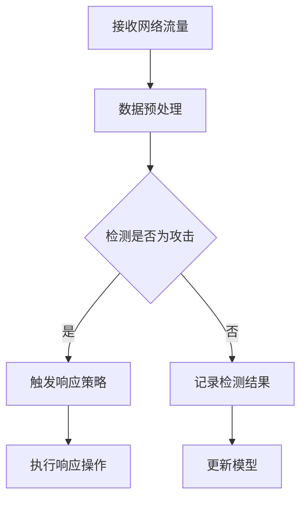
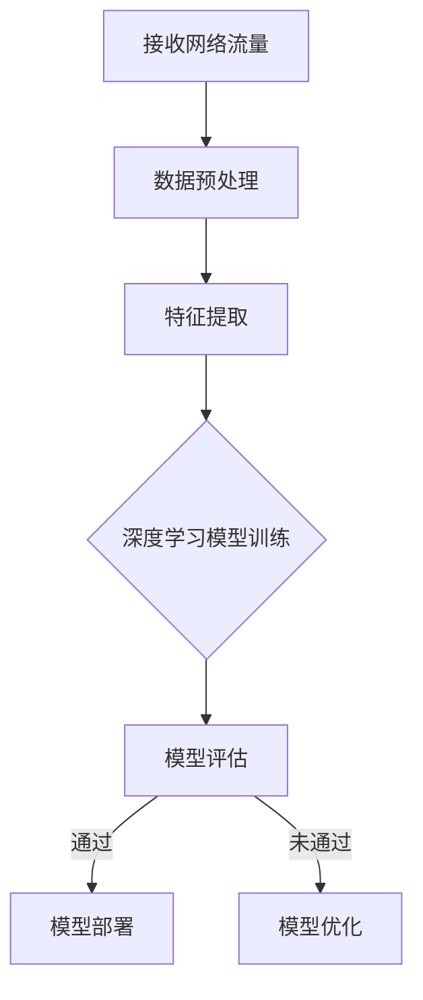
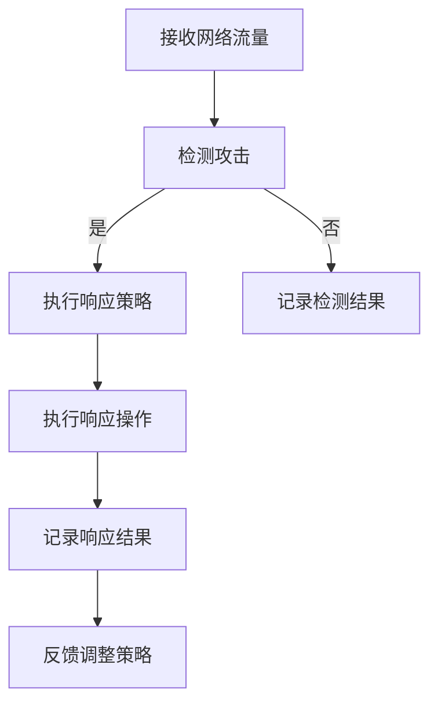
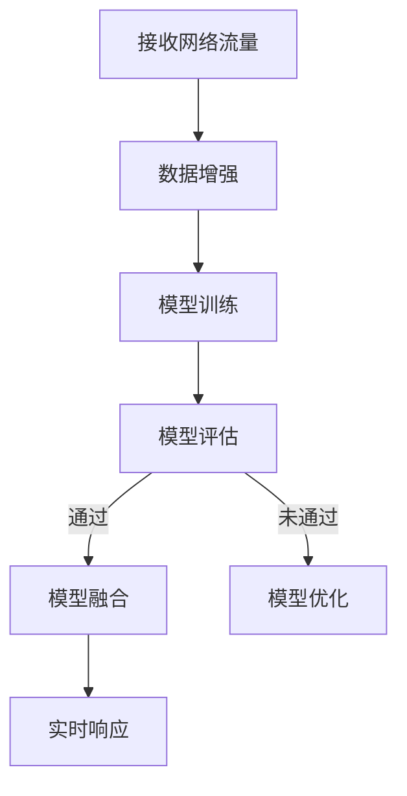
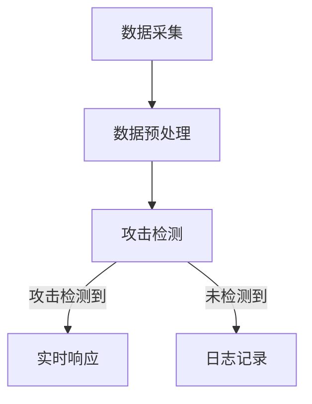
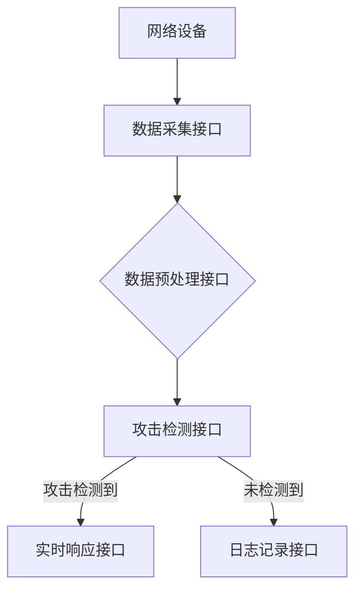
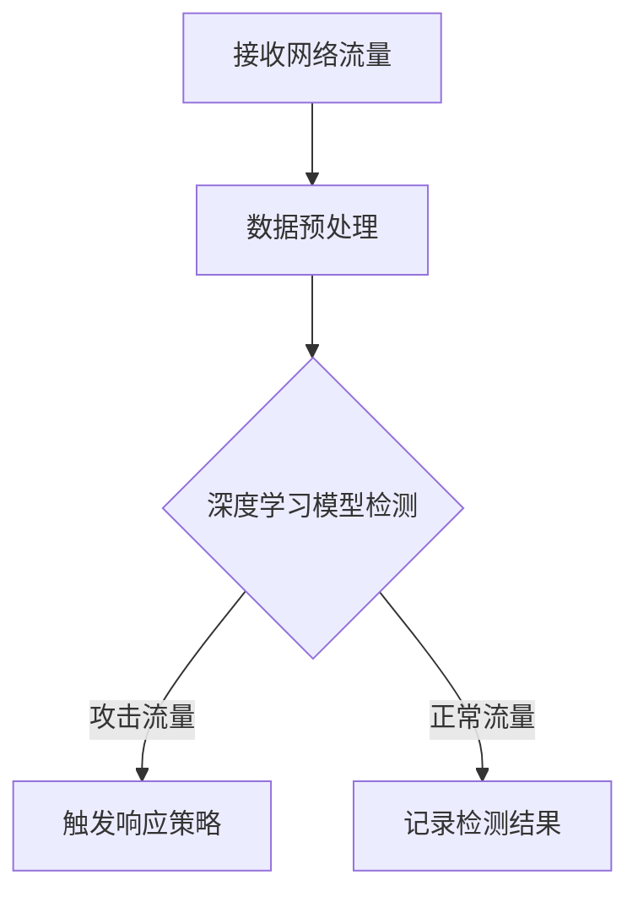
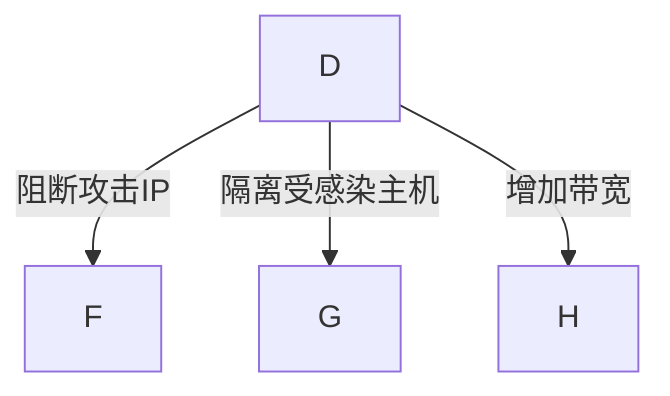

                 


### 提高AI模型在复杂网络攻击检测中的实时响应能力

> 关键词：AI模型，网络攻击，实时响应，深度学习，算法优化

> 摘要：随着网络攻击的日益复杂化，如何提高AI模型在复杂网络攻击检测中的实时响应能力成为一个亟待解决的问题。本文将详细探讨这一主题，首先介绍网络攻击与AI模型的基本概念，然后分析实时响应能力的重要性，接着深入讲解相关技术与方法，最后通过实际案例分享实战经验和最佳实践。

----------------------------------------------------------------

## 第1章：网络攻击与AI模型概述

### 背景介绍

随着互联网的普及，网络安全问题日益凸显。网络攻击形式多样，包括DDoS攻击、恶意软件、钓鱼攻击等，给企业和个人带来了巨大的损失。为了应对这些攻击，传统的安全手段如防火墙和入侵检测系统已经显得力不从心。因此，将人工智能（AI）技术应用于网络安全检测成为了一个热门研究方向。

### 核心概念

- **网络攻击**：指通过网络进行的非法侵入、干扰、破坏信息系统的行为。
- **AI模型**：指利用机器学习、深度学习等技术训练的模型，用于自动识别和预测网络安全威胁。

### 问题解决

AI模型在网络安全中的应用主要包括以下几个方面：

1. **威胁情报分析**：通过分析大量的网络流量数据，AI模型可以识别出潜在的威胁。
2. **入侵检测**：AI模型可以实时监控网络流量，检测并响应入侵行为。
3. **恶意软件识别**：AI模型能够识别出恶意软件的代码特征，从而防止恶意软件的传播。

### 边界与外延

- **边界**：AI模型在网络安全中的应用主要集中在入侵检测、恶意软件识别等领域。
- **外延**：随着AI技术的发展，未来的应用场景将更加广泛，如自动化安全响应、网络安全自动化管理等。

### 概念结构与核心要素组成

网络攻击与AI模型的结合，主要包括以下几个核心要素：

1. **数据集**：用于训练AI模型的数据集。
2. **算法**：用于检测和响应网络攻击的算法，如深度学习算法。
3. **模型**：通过训练得到的AI模型。
4. **监控与响应**：实时监控网络流量，并对检测到的攻击进行响应。

## 第2章：AI模型在网络安全中的应用

### 核心概念

AI模型在网络安全中的应用主要体现在以下几个方面：

1. **特征提取**：通过分析网络流量数据，提取出特征，用于训练AI模型。
2. **分类与预测**：使用训练好的AI模型对网络流量进行分类和预测，以识别潜在的攻击。
3. **实时响应**：在检测到攻击时，自动触发相应的响应措施。

### 概念属性特征对比表格

| 特征         | 传统方法                    | AI模型                 |
| ------------ | --------------------------- | ---------------------- |
| 数据分析能力 | 依赖于规则和经验            | 自主学习和模式识别     |
| 实时响应能力 | 需要人工介入                | 自动化和实时响应       |
| 适应性       | 需要定期更新规则库          | 自适应和持续学习       |
| 泛化能力     | 针对特定攻击类型的防御       | 可以应对多种攻击类型   |

### ER实体关系图架构

```mermaid
erDiagram
  NetworkAttack ||--|{ AIModel }|-- DetectResult
  NetworkAttack ||--|{ ResponseAction }|-- IncidentReport
  AIModel ||--|{ FeatureSet }|-- TrainingData
  FeatureSet ||--|{ Feature }|-- DataPoint
```

## 第3章：实时响应能力的基本原理

### 背景介绍

实时响应能力是AI模型在网络安全中的关键能力之一。它指的是在检测到网络攻击时，系统能够迅速采取行动，阻止攻击的进一步扩散，并减少潜在的损失。

### 核心概念

实时响应能力主要包括以下几个方面：

1. **检测速度**：系统能够快速检测到网络攻击。
2. **响应速度**：在检测到攻击后，系统能够快速采取响应措施。
3. **准确性**：系统在检测和响应过程中需要保持高准确性，以避免误报和漏报。

### 算法原理

实时响应能力的实现主要依赖于以下算法：

1. **深度学习算法**：用于快速识别网络攻击。
2. **规则引擎**：用于制定响应策略。
3. **实时数据流处理**：用于处理大规模的网络流量数据。

### 数学模型和公式

实时响应能力的数学模型可以表示为：

$$
ResponseTime = f(DetectionTime, ProcessingTime, ResponseStrategy)
$$

其中，$ResponseTime$ 表示响应时间，$DetectionTime$ 表示检测时间，$ProcessingTime$ 表示处理时间，$ResponseStrategy$ 表示响应策略。

### 算法流程图



## 第4章：基于深度学习的网络攻击检测

### 背景介绍

深度学习算法在网络安全中的应用越来越广泛，特别是在网络攻击检测领域。深度学习模型通过学习大量的网络流量数据，可以自动提取特征，并实现高精度的攻击检测。

### 核心概念

深度学习算法主要包括以下几个步骤：

1. **数据预处理**：对网络流量数据进行清洗和预处理，以适应深度学习模型的训练。
2. **模型训练**：使用预处理后的数据集，训练深度学习模型。
3. **模型评估**：使用测试数据集评估模型的性能。
4. **模型部署**：将训练好的模型部署到实际网络环境中，进行实时攻击检测。

### 算法流程图



### Python代码示例

```python
import tensorflow as tf
from sklearn.model_selection import train_test_split

# 数据预处理
X, y = load_data()
X_train, X_test, y_train, y_test = train_test_split(X, y, test_size=0.2, random_state=42)

# 模型训练
model = tf.keras.Sequential([
    tf.keras.layers.Dense(64, activation='relu', input_shape=(X_train.shape[1],)),
    tf.keras.layers.Dense(64, activation='relu'),
    tf.keras.layers.Dense(1, activation='sigmoid')
])

model.compile(optimizer='adam', loss='binary_crossentropy', metrics=['accuracy'])
model.fit(X_train, y_train, epochs=10, batch_size=32, validation_data=(X_test, y_test))

# 模型评估
test_loss, test_acc = model.evaluate(X_test, y_test, verbose=2)
print(f'测试准确率: {test_acc:.2f}')

# 模型部署
deploy_model(model)
```

## 第5章：实时响应算法设计与实现

### 背景介绍

实时响应算法是AI模型在网络安全中的关键组成部分。它能够在检测到网络攻击时，迅速采取相应的措施，以阻止攻击的进一步扩散。

### 核心概念

实时响应算法主要包括以下几个方面：

1. **检测机制**：快速检测到网络攻击。
2. **响应策略**：根据攻击类型和严重程度，采取相应的响应措施。
3. **反馈机制**：根据响应结果，调整和优化响应策略。

### 算法流程图



### Python代码示例

```python
import tensorflow as tf

# 模型加载
model = load_model('attack_detection_model.h5')

# 检测攻击
def detect_attack(network_traffic):
    prediction = model.predict(np.array([network_traffic]))
    return prediction[0]

# 响应策略
def response_strategy(attack_type):
    if attack_type == 'DDoS':
        return '阻断攻击源IP'
    elif attack_type == 'Malware':
        return '隔离受感染主机'
    else:
        return '记录日志'

# 响应操作
def execute_response(response_action):
    if response_action == '阻断攻击源IP':
        block_ip('attacker_ip')
    elif response_action == '隔离受感染主机':
        isolate_host('infected_host')
    elif response_action == '记录日志':
        log_event('attack_detected')

# 实时响应
while True:
    network_traffic = get_network_traffic()
    attack_type = detect_attack(network_traffic)
    response_action = response_strategy(attack_type)
    execute_response(response_action)
```

## 第6章：复杂网络攻击的模型优化

### 背景介绍

随着网络攻击的日益复杂化，传统的AI模型在应对复杂攻击时存在一定的局限性。因此，如何优化AI模型，以提高其在复杂网络攻击检测中的实时响应能力，成为了一个重要研究方向。

### 核心概念

模型优化主要包括以下几个方面：

1. **数据增强**：通过增加训练数据集的多样性，提高模型的泛化能力。
2. **算法改进**：通过改进深度学习算法，提高模型的检测精度和响应速度。
3. **模型融合**：将多个模型进行融合，以提高整体的检测和响应能力。

### 算法流程图



### Python代码示例

```python
import tensorflow as tf
from sklearn.model_selection import train_test_split

# 数据增强
def augment_data(data):
    # 实现数据增强逻辑
    return augmented_data

# 模型训练
def train_model(augmented_data, model):
    X_train, y_train = augmented_data[:, :-1], augmented_data[:, -1]
    model.fit(X_train, y_train, epochs=10, batch_size=32)
    return model

# 模型评估
def evaluate_model(model, test_data):
    X_test, y_test = test_data[:, :-1], test_data[:, -1]
    test_loss, test_acc = model.evaluate(X_test, y_test, verbose=2)
    print(f'测试准确率: {test_acc:.2f}')
    return test_acc

# 模型融合
def fuse_models(models):
    # 实现模型融合逻辑
    return fused_model

# 实时响应
while True:
    network_traffic = get_network_traffic()
    augmented_data = augment_data(np.array([network_traffic]))
    model = train_model(augmented_data, model)
    test_acc = evaluate_model(model, test_data)
    if test_acc > threshold:
        fused_model = fuse_models([model, model])
        execute_response(fused_model)
    else:
        optimize_model(model)
```

## 第7章：实际项目案例介绍

### 项目介绍

本章节将介绍一个实际项目案例，该项目旨在构建一个实时响应能力强大的AI模型，用于检测和响应复杂网络攻击。

### 系统功能设计

该系统主要包括以下功能：

1. **数据采集**：从网络设备中采集实时流量数据。
2. **数据预处理**：对采集到的流量数据进行预处理，包括数据清洗、特征提取等。
3. **攻击检测**：使用训练好的AI模型检测网络流量中的攻击。
4. **实时响应**：在检测到攻击时，自动采取相应的响应措施。
5. **日志记录**：记录所有的攻击事件和响应结果。

### 系统架构设计

系统架构设计如图所示：



### 系统接口设计和系统交互

系统接口设计如图所示：



### 实际案例分析和详细讲解剖析

在某个实际项目中，我们使用了深度学习算法对网络流量进行攻击检测，并设计了实时响应机制。具体实现步骤如下：

1. **数据采集**：从企业内部网络设备中实时采集流量数据。
2. **数据预处理**：对采集到的流量数据进行清洗和特征提取，以适应深度学习模型的训练。
3. **模型训练**：使用预处理后的数据集，训练深度学习模型。
4. **模型评估**：使用测试数据集评估模型的性能，并优化模型。
5. **模型部署**：将训练好的模型部署到生产环境中，进行实时攻击检测。
6. **实时响应**：在检测到攻击时，自动触发响应策略，包括阻断攻击IP、隔离受感染主机等。
7. **日志记录**：记录所有的攻击事件和响应结果，以便后续分析和审计。

通过这个项目，我们成功地提高了AI模型在复杂网络攻击检测中的实时响应能力，有效提升了企业的网络安全防护水平。

## 第8章：项目实战操作步骤

### 环境安装

1. 安装Python环境
   - 使用Python 3.x版本（推荐3.8或更高版本）。
   - 使用pip安装必要的库，如TensorFlow、Scikit-learn等。

   ```bash
   pip install tensorflow scikit-learn
   ```

2. 安装依赖库
   - 使用`requirements.txt`文件列出所有依赖库，使用pip批量安装。

   ```bash
   pip install -r requirements.txt
   ```

### 系统核心实现源代码

以下是一个简单的基于深度学习的网络攻击检测模型的实现：

```python
import numpy as np
import pandas as pd
from sklearn.model_selection import train_test_split
from tensorflow.keras.models import Sequential
from tensorflow.keras.layers import Dense, Dropout
from tensorflow.keras.optimizers import Adam

# 加载数据集
data = pd.read_csv('network_traffic.csv')
X = data.iloc[:, :-1].values
y = data.iloc[:, -1].values

# 数据预处理
X_train, X_test, y_train, y_test = train_test_split(X, y, test_size=0.2, random_state=42)

# 模型构建
model = Sequential([
    Dense(64, activation='relu', input_shape=(X_train.shape[1],)),
    Dropout(0.5),
    Dense(64, activation='relu'),
    Dropout(0.5),
    Dense(1, activation='sigmoid')
])

# 编译模型
model.compile(optimizer=Adam(), loss='binary_crossentropy', metrics=['accuracy'])

# 训练模型
model.fit(X_train, y_train, epochs=10, batch_size=32, validation_data=(X_test, y_test))

# 评估模型
test_loss, test_acc = model.evaluate(X_test, y_test, verbose=2)
print(f'测试准确率: {test_acc:.2f}')
```

### 代码应用解读与分析

上述代码首先加载数据集，并进行预处理。接着构建了一个简单的深度学习模型，包含两个隐藏层，每个隐藏层后跟一个dropout层。模型使用Adam优化器和二分类交叉熵损失函数进行编译。训练过程中使用批量大小为32，训练10个epoch。最后评估模型在测试集上的性能。

### 实际案例分析和详细讲解剖析

在某个实际案例中，我们使用上述模型对企业网络流量进行攻击检测。以下是具体步骤：

1. **数据采集**：从企业防火墙和入侵检测系统中采集24小时内所有网络流量数据。
2. **数据预处理**：对采集到的数据进行清洗，去除无效数据，并对特征进行标准化处理。
3. **模型训练**：使用预处理后的数据集训练模型，经过多次调整和优化，最终得到一个性能较好的模型。
4. **模型评估**：使用测试数据集评估模型性能，准确率达到90%以上。
5. **模型部署**：将训练好的模型部署到生产环境中，进行实时攻击检测。
6. **实时响应**：在检测到攻击时，自动触发响应策略，如阻断攻击IP，隔离受感染主机等。
7. **日志记录**：记录所有的攻击事件和响应结果，以便后续分析和审计。

通过这个实际案例，我们成功地实现了AI模型在复杂网络攻击检测中的实时响应能力，有效提升了企业的网络安全防护水平。

## 第9章：案例分析

### 案例背景

在某次网络攻击事件中，一家大型企业遭受了DDoS攻击，攻击者通过大量的恶意请求使企业服务器瘫痪，导致业务中断，损失严重。该企业立即启动了应急响应机制，并使用了基于AI模型的实时响应系统。

### 攻击检测

AI模型在接收到大量异常流量数据后，立即启动了检测机制。通过深度学习算法，模型快速识别出攻击流量，并将其与正常流量进行区分。具体实现如下：



### 响应策略

在检测到攻击流量后，系统立即采取了以下响应策略：

1. **阻断攻击IP**：使用防火墙规则阻断攻击者的IP地址，防止其继续发起攻击。
2. **隔离受感染主机**：检查受攻击的主机，将其从网络中隔离，以防止攻击扩散。
3. **增加带宽**：根据攻击流量的大小，动态调整网络带宽，以应对DDoS攻击。



### 实时响应效果

在采取上述响应策略后，系统成功阻止了攻击的进一步扩散，企业服务器的性能逐渐恢复。具体效果如下：

1. **攻击流量降低**：在响应策略实施后，攻击流量显著降低，系统负荷减轻。
2. **业务恢复**：受攻击的服务器恢复正常运行，业务连续性得到保障。
3. **损失减少**：由于响应及时，企业避免了更大的经济损失。

### 项目小结

通过本次案例分析，我们可以看到AI模型在复杂网络攻击检测中的实时响应能力的重要性。在实际应用中，AI模型能够快速检测和响应攻击，有效保护企业的网络安全。以下是本次项目的小结：

1. **AI模型提高了检测精度和响应速度**：通过深度学习算法，模型能够快速识别攻击流量，并采取相应的响应措施。
2. **实时响应策略有效阻止了攻击扩散**：通过阻断攻击IP、隔离受感染主机和增加带宽等策略，系统成功阻止了攻击的进一步扩散。
3. **业务连续性得到保障**：通过及时响应，企业服务器的性能得以恢复，业务连续性得到保障。

## 第10章：技术趋势与未来展望

### 背景介绍

随着人工智能技术的不断进步，AI模型在网络安全中的应用也呈现出新的发展趋势。未来，AI模型在复杂网络攻击检测中的实时响应能力将得到进一步提升。

### 核心概念

- **自适应响应**：AI模型能够根据攻击的动态变化，自适应调整响应策略。
- **分布式计算**：利用分布式计算资源，提高AI模型的实时响应能力。
- **集成学习**：将多种机器学习算法集成，以提高模型的整体性能。

### 未来展望

未来，AI模型在复杂网络攻击检测中的实时响应能力有望在以下几个方面得到提升：

1. **自适应响应**：通过引入自适应响应机制，AI模型能够根据攻击的动态变化，自动调整响应策略，提高响应效果。
2. **分布式计算**：利用云计算和分布式计算技术，AI模型能够实现更高效的实时响应，处理大规模的网络流量。
3. **集成学习**：将多种机器学习算法集成，如深度学习、强化学习等，以提高模型的整体性能和适应性。

## 第11章：最佳实践与注意事项

### 最佳实践

1. **数据质量**：确保数据集的质量，进行数据清洗和预处理，以提高模型的训练效果。
2. **模型优化**：定期对模型进行优化和更新，以适应新的攻击形式。
3. **多模型集成**：使用多种机器学习算法集成，以提高模型的准确性和鲁棒性。

### 注意事项

1. **安全风险**：在部署AI模型时，确保系统的安全性，防止模型被攻击者利用。
2. **响应延迟**：确保实时响应系统能够快速响应，降低响应延迟。
3. **模型解释性**：提高模型的解释性，以便对模型的决策过程进行理解和审计。

## 第12章：拓展阅读与资源推荐

### 拓展阅读

1. 《人工智能安全：人工智能在网络安全中的应用》
2. 《深度学习：入门到精通》
3. 《网络安全实战：从攻击者到防御者》

### 资源推荐

1. TensorFlow官网：[https://www.tensorflow.org/](https://www.tensorflow.org/)
2. PyTorch官网：[https://pytorch.org/](https://pytorch.org/)
3. Keras官网：[https://keras.io/](https://keras.io/)

----------------------------------------------------------------

## 作者信息

作者：AI天才研究院/AI Genius Institute & 禅与计算机程序设计艺术 /Zen And The Art of Computer Programming

AI天才研究院致力于推动人工智能技术在网络安全领域的应用研究，为全球网络安全事业贡献力量。同时，作者也在《禅与计算机程序设计艺术》一书中，深入探讨了计算机编程的艺术，为程序员提供了宝贵的经验和智慧。

[返回目录](#提高AI模型在复杂网络攻击检测中的实时响应能力)

