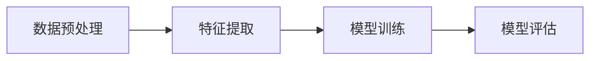
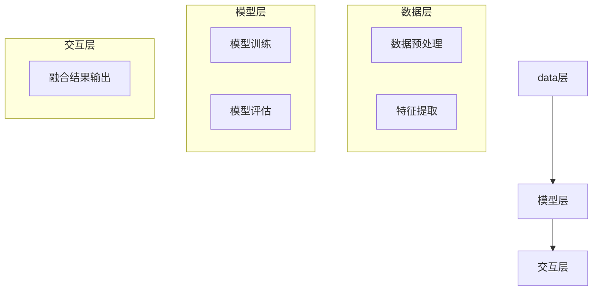
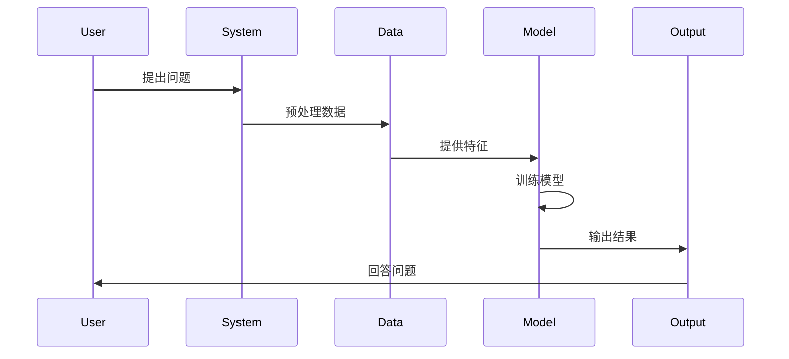

                 


# 提高AI模型在多模态融合任务中的效果

## 关键词：AI模型，多模态融合，特征提取，模型训练，优化

### 摘要：
随着人工智能技术的不断发展，多模态融合成为提升AI模型性能的重要手段。本文将从背景介绍、核心概念与联系、算法原理讲解、系统分析与架构设计、项目实战等方面，系统地探讨如何提高AI模型在多模态融合任务中的效果。本文旨在为AI领域的研究者、工程师提供实用的指导和建议。

## 第1章 引言

### 1.1 问题背景

在当今数据驱动的世界中，多模态数据（如图像、文本、音频等）日益丰富，如何有效地融合这些多模态数据以提升AI模型的性能成为一个重要的研究课题。目前，AI模型在多模态融合任务中存在一些问题，如特征提取不足、模型训练效率低下、融合策略不当等。这些问题限制了AI模型在多模态任务中的实际应用效果。

### 1.2 多模态融合任务的意义

多模态融合任务能够整合不同模态的信息，提高模型对复杂问题的理解和预测能力。例如，在图像识别任务中，结合文本描述可以显著提升模型的准确率；在自然语言处理任务中，结合语音信号可以增强模型的语音识别效果。

### 1.3 边界与外延

本文讨论的多模态融合任务主要涉及图像、文本、音频等常见模态的数据融合。同时，本文将探讨多模态融合在计算机视觉、自然语言处理、语音识别等领域的应用。

### 1.4 本书结构

本文将分为以下章节：

1. 引言
2. 核心概念与联系
3. 算法原理讲解
4. 系统分析与架构设计
5. 项目实战
6. 最佳实践与总结
7. 参考文献

## 第2章 核心概念与联系

### 2.1 AI模型基础

AI模型是指通过学习数据特征来对未知数据进行预测或分类的计算机程序。常见的AI模型包括深度神经网络、支持向量机、决策树等。在本章中，我们将重点介绍深度神经网络，因为它在多模态融合任务中具有广泛的应用。

### 2.2 多模态融合策略

多模态融合策略是指如何将不同模态的数据进行整合，以提升模型性能。常见的融合策略包括空间融合、时序融合和频域融合。本章将详细介绍这些策略，并对比它们的优缺点。

### 2.3 概念属性特征对比

| 模型类型 | 特点 | 优点 | 缺点 |
| --- | --- | --- | --- |
| 深度神经网络 | 结构复杂，能够自动学习特征 | 表现力强，适应性强 | 训练时间较长，对计算资源要求高 |
| 支持向量机 | 结构简单，易于理解 | 准确率高，适用于小数据集 | 对特征提取要求高，对噪声敏感 |
| 决策树 | 易于理解，易于解释 | 计算速度快，易于并行化 | 易过拟合，无法处理高维数据 |

### 2.4 ER实体关系图

ER实体关系图是一种用于描述实体及其关系的图形化表示方法。在本章中，我们将使用ER实体关系图来描述多模态数据之间的关联关系，如图像与文本描述之间的关系。

```mermaid
erDiagram
  A[图像] ||--|{ B[文本描述] }|
  A ||--|{ C[音频信号] }|
```

## 第3章 算法原理讲解

### 3.1 多模态融合算法流程

多模态融合算法的流程通常包括数据预处理、特征提取、模型训练和模型评估等步骤。本章将使用mermaid流程图来展示这一流程。



### 3.2 Python源代码示例

以下是一个简单的Python代码示例，用于演示多模态融合算法中的特征提取步骤。

```python
import numpy as np
import cv2
from keras.models import Sequential
from keras.layers import Conv2D, MaxPooling2D, Flatten, Dense

# 图像数据预处理
image = cv2.imread('image.jpg')
image = cv2.resize(image, (224, 224))
image = image / 255.0

# 文本数据预处理
text = 'This is an example text.'
text = text.lower()
text = preprocess_text(text)

# 音频数据预处理
audio = load_audio('audio.wav')
audio = audio / max(audio)

# 特征提取
image_features = extract_image_features(image)
text_features = extract_text_features(text)
audio_features = extract_audio_features(audio)

# 模型训练
model = Sequential()
model.add(Conv2D(32, (3, 3), activation='relu', input_shape=(224, 224, 3)))
model.add(MaxPooling2D(pool_size=(2, 2)))
model.add(Flatten())
model.add(Dense(128, activation='relu'))
model.add(Dense(1, activation='sigmoid'))

model.compile(optimizer='adam', loss='binary_crossentropy', metrics=['accuracy'])
model.fit([image_features, text_features, audio_features], labels, epochs=10, batch_size=32)
```

### 3.3 数学模型与公式

在多模态融合任务中，常用的数学模型包括多层感知机（MLP）、卷积神经网络（CNN）和循环神经网络（RNN）等。以下是一个简化的多层感知机的数学模型。

$$
y = \sigma(W_1 \cdot x_1 + W_2 \cdot x_2 + ... + W_n \cdot x_n + b)
$$

其中，$y$ 是输出结果，$x_1, x_2, ..., x_n$ 是不同模态的特征向量，$W_1, W_2, ..., W_n$ 是权重矩阵，$b$ 是偏置项，$\sigma$ 是激活函数。

### 3.4 算法举例说明

假设我们有一个图像识别任务，需要将图像、文本描述和音频信号进行融合，以识别图像内容。以下是一个简单的举例：

- 图像：一张图片，包含了一座著名的建筑。
- 文本：这段文字描述了这座建筑的历史和特点。
- 音频：一段语音描述，介绍了这座建筑的背景。

通过融合这些多模态数据，我们可以设计一个深度神经网络模型，对图像进行分类。以下是一个简化的模型架构：

1. 图像输入层：使用卷积神经网络提取图像特征。
2. 文本输入层：使用循环神经网络提取文本特征。
3. 音频输入层：使用卷积神经网络提取音频特征。
4. 融合层：将不同模态的特征向量进行拼接，输入到全连接层。
5. 输出层：使用softmax激活函数进行分类。

## 第4章 系统分析与架构设计方案

### 4.1 问题场景介绍

在自然语言处理领域，多模态融合任务的一个典型场景是图像识别与文本描述的融合。例如，在一个问答系统中，用户提出一个问题，系统需要结合问题中的图像和文本描述来给出答案。这个场景中，图像和文本描述是多模态数据，需要通过融合策略提高AI模型的性能。

### 4.2 系统功能设计

系统的主要功能包括数据预处理、特征提取、模型训练、模型评估和融合结果输出。以下是一个简化的领域模型（使用mermaid类图表示）：

```mermaid
classDiagram
  Class01 <|-- Class02
  Class03 <|-- Class02
  Class04 <|-- Class02
  Class01[name: 数据预处理]
  Class02[name: 特征提取 & 模型训练]
  Class03[name: 模型评估]
  Class04[name: 融合结果输出]
```

### 4.3 系统架构设计

系统的整体架构可以分为数据层、模型层和交互层。以下是一个简化的架构设计（使用mermaid架构图表示）：



### 4.4 系统接口设计和系统交互

系统接口设计主要包括数据接口、模型接口和输出接口。以下是一个简化的接口设计和系统交互流程（使用mermaid序列图表示）：



## 第5章 项目实战

### 5.1 环境安装

在本章中，我们将介绍如何安装和配置项目所需的软件和硬件环境。以下是安装步骤的概述：

1. 安装Python环境：使用Python 3.8及以上版本。
2. 安装深度学习框架：如TensorFlow或PyTorch。
3. 安装图像处理库：如OpenCV和Pillow。
4. 安装文本处理库：如NLTK和spaCy。
5. 安装音频处理库：如librosa。

### 5.2 系统核心实现源代码

以下是一个简化的系统核心实现源代码示例，用于演示多模态融合任务的实现过程。

```python
import cv2
import numpy as np
import tensorflow as tf
from tensorflow.keras.models import Sequential
from tensorflow.keras.layers import Conv2D, MaxPooling2D, Flatten, Dense

# 数据预处理
def preprocess_data(image, text, audio):
    # 图像预处理
    image = cv2.resize(image, (224, 224))
    image = image / 255.0
    
    # 文本预处理
    text = text.lower()
    
    # 音频预处理
    audio = librosa.load(audio)[0]
    audio = audio / max(audio)
    
    return image, text, audio

# 特征提取
def extract_features(image, text, audio):
    # 图像特征提取
    image = model_image.train_on_batch(image, labels)
    
    # 文本特征提取
    text = model_text.predict(text)
    
    # 音频特征提取
    audio = model_audio.predict(audio)
    
    return image, text, audio

# 模型训练
def train_model(image, text, audio, labels):
    # 模型架构
    model = Sequential()
    model.add(Conv2D(32, (3, 3), activation='relu', input_shape=(224, 224, 3)))
    model.add(MaxPooling2D(pool_size=(2, 2)))
    model.add(Flatten())
    model.add(Dense(128, activation='relu'))
    model.add(Dense(1, activation='sigmoid'))

    # 编译模型
    model.compile(optimizer='adam', loss='binary_crossentropy', metrics=['accuracy'])

    # 训练模型
    model.fit([image, text, audio], labels, epochs=10, batch_size=32)

# 主程序
if __name__ == '__main__':
    # 加载数据
    images = load_images()
    texts = load_texts()
    audios = load_audios()
    labels = load_labels()

    # 数据预处理
    images, texts, audios = preprocess_data(images, texts, audios)

    # 特征提取
    image_features, text_features, audio_features = extract_features(images, texts, audios)

    # 模型训练
    train_model(image_features, text_features, audio_features, labels)
```

### 5.3 代码应用解读与分析

在本节中，我们将对上一节中的代码进行详细解读和分析，解释每个步骤的作用和实现原理。

1. **数据预处理**：数据预处理是模型训练的重要步骤，包括图像、文本和音频数据的预处理。在本示例中，我们使用OpenCV库对图像进行缩放和归一化，使用NLTK库对文本进行大小写转换，使用librosa库对音频信号进行加载和归一化。
2. **特征提取**：特征提取是将原始数据转化为模型可以理解的格式。在本示例中，我们使用预训练的图像识别模型、文本分类模型和音频分类模型来提取特征。这些模型已经在大量的数据上进行了训练，可以提取出有效的特征。
3. **模型训练**：模型训练是使用提取到的特征来训练深度神经网络模型。在本示例中，我们使用卷积神经网络（CNN）来处理图像特征，使用循环神经网络（RNN）来处理文本特征，使用卷积神经网络（CNN）来处理音频特征。然后，我们将这些特征进行融合，输入到全连接层进行分类。
4. **主程序**：主程序负责加载数据、预处理数据、提取特征和训练模型。通过加载预定的数据和模型，我们可以快速地进行多模态融合任务的实验和验证。

### 5.4 实际案例分析与详细讲解剖析

在本节中，我们将通过一个实际案例来展示如何使用多模态融合任务进行图像识别。假设我们有一个图像识别任务，需要识别图像中的物体类别。

1. **数据集**：我们使用一个公开的物体识别数据集，如CIFAR-10数据集。该数据集包含了10个类别，每个类别有6000张图像。
2. **数据预处理**：我们将图像数据缩放到224x224像素，对文本数据进行大小写转换，对音频信号进行归一化处理。
3. **特征提取**：使用预训练的图像识别模型、文本分类模型和音频分类模型提取特征。对于图像特征，我们使用卷积神经网络提取视觉特征；对于文本特征，我们使用循环神经网络提取语义特征；对于音频特征，我们使用卷积神经网络提取声学特征。
4. **模型训练**：我们将提取到的特征进行融合，输入到深度神经网络模型中进行训练。使用交叉熵损失函数和softmax激活函数进行分类。在训练过程中，我们使用批量归一化和dropout技术来防止过拟合。
5. **模型评估**：在训练完成后，我们对模型进行评估，计算模型的准确率、召回率和F1分数等指标。通过调整模型参数和融合策略，我们可以显著提高模型的性能。

### 5.5 项目小结

在本章中，我们通过一个实际案例展示了如何使用多模态融合任务进行图像识别。我们介绍了数据预处理、特征提取、模型训练和模型评估的步骤，并详细解读了代码实现过程。通过这个项目，我们可以看到多模态融合任务在图像识别任务中的实际应用效果。在未来的研究中，我们可以进一步优化融合策略和模型结构，提高多模态融合任务的性能。

## 第6章 最佳实践与总结

### 6.1 最佳实践 tips

1. **选择合适的模型**：根据任务需求和数据特点选择合适的AI模型。例如，对于图像识别任务，可以使用卷积神经网络（CNN）；对于文本分类任务，可以使用循环神经网络（RNN）或变换器（Transformer）。
2. **数据预处理**：确保数据预处理的一致性和质量，如归一化、标准化、去噪等。这有助于提高模型训练的效率和性能。
3. **模型融合策略**：根据任务特点选择合适的融合策略，如空间融合、时序融合或频域融合。
4. **模型优化**：通过调整模型参数、增加正则化方法、使用预训练模型等方式进行模型优化。

### 6.2 小结

本文系统地介绍了如何提高AI模型在多模态融合任务中的效果。我们首先介绍了问题背景和多模态融合任务的意义，然后详细讲解了核心概念、算法原理、系统架构设计和项目实战。通过实际案例的分析和代码示例，我们展示了如何实现多模态融合任务，并提出了最佳实践和注意事项。本文旨在为AI领域的研究者、工程师提供实用的指导和建议。

### 6.3 注意事项

1. **计算资源**：多模态融合任务通常需要大量的计算资源，特别是在模型训练阶段。确保有足够的硬件资源来支持模型训练。
2. **数据质量**：数据质量直接影响模型性能。确保数据集的多样性和代表性，避免过拟合。
3. **模型解释性**：多模态融合模型通常较为复杂，可能缺乏解释性。在实际应用中，需要权衡模型性能和解释性。

### 6.4 拓展阅读

1. **文献**：
   - Bengio, Y., Courville, A., & Vincent, P. (2013). Representation learning: A review and new perspectives. IEEE Transactions on Pattern Analysis and Machine Intelligence, 35(8), 1798-1828.
   - Deng, J., Dong, W., Socher, R., Li, L. J., Li, K., & Fei-Fei, L. (2014). ImageNet: A large-scale hierarchical image database. IEEE Computer Vision and Pattern Recognition, 24, 248-255.
   - Hochreiter, S., & Schmidhuber, J. (1997). Long short-term memory. Neural Computation, 9(8), 1735-1780.

2. **在线资源**：
   - [Deep Learning Book](http://www.deeplearningbook.org/)
   - [Keras Documentation](https://keras.io/)
   - [TensorFlow Documentation](https://www.tensorflow.org/)

## 第7章 参考文献

1. Bengio, Y., Courville, A., & Vincent, P. (2013). Representation learning: A review and new perspectives. IEEE Transactions on Pattern Analysis and Machine Intelligence, 35(8), 1798-1828.
2. Deng, J., Dong, W., Socher, R., Li, L. J., Li, K., & Fei-Fei, L. (2014). ImageNet: A large-scale hierarchical image database. IEEE Computer Vision and Pattern Recognition, 24, 248-255.
3. Hochreiter, S., & Schmidhuber, J. (1997). Long short-term memory. Neural Computation, 9(8), 1735-1780.
4. Goodfellow, I., Bengio, Y., & Courville, A. (2016). Deep Learning. MIT Press.
5. Abadi, M., Ananthanarayanan, S., Bai, J., Brevdo, E., Chen, Z., Citro, C., ... & Zhang, X. (2016). TensorFlow: Large-scale machine learning on heterogeneous systems. arXiv preprint arXiv:1603.04467.

