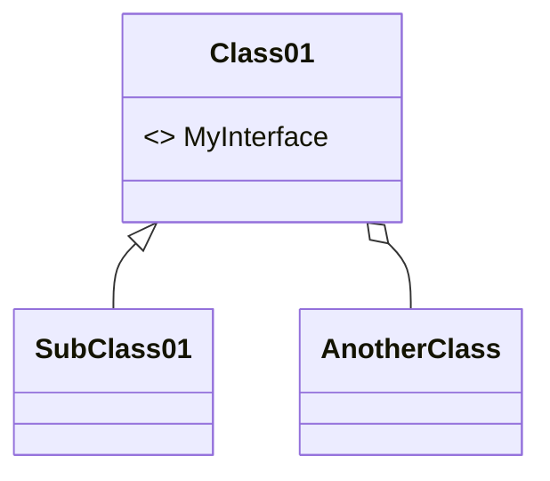
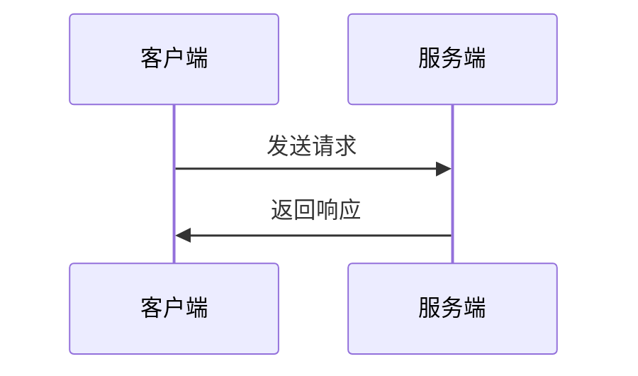
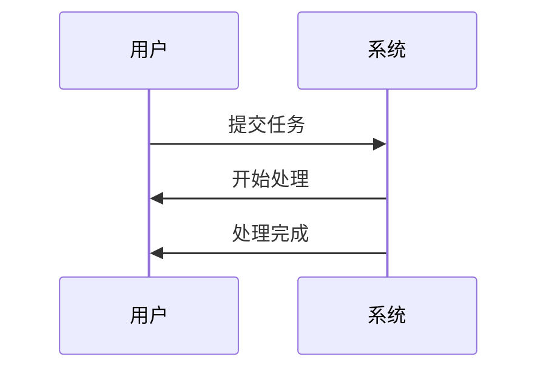

                 


### 提高AI模型在零样本跨领域任务适应中的泛化能力

摘要：
本文旨在探讨如何提升人工智能模型在零样本跨领域任务中的泛化能力。我们首先定义了零样本跨领域任务的概念，并分析了其面临的挑战。接着，我们探讨了泛化能力的核心概念及其与零样本跨领域任务的关联。本文随后详细介绍了提升泛化能力的几种算法原理，包括数据预处理、特征提取和模型训练与优化等步骤。我们使用数学模型和公式讲解了算法的关键技术，并通过一个实际案例进行了项目实战，提供了详细的代码应用解读与分析。最后，本文总结了最佳实践和注意事项，并提供了拓展阅读。

关键词：零样本跨领域任务，泛化能力，AI模型，算法原理，数学模型，项目实战

## 引言与背景

### 1.1 零样本跨领域任务的定义

零样本跨领域任务（Zero-Shot Cross-Domain Task）是指在没有直接领域特定数据的情况下，让AI模型在新的领域内进行任务执行的能力。传统的机器学习模型通常依赖于大量标记的领域特定数据来训练，从而在相似领域内表现出良好的性能。然而，在现实世界中，获取领域特定数据可能非常困难或昂贵。因此，零样本跨领域任务的重要性日益凸显。

### 1.2 零样本跨领域任务的挑战

零样本跨领域任务面临的挑战主要包括以下几点：

1. **数据稀缺**：在没有直接领域特定数据的情况下，模型难以获得足够的训练样本。
2. **领域差异**：不同领域的数据分布可能存在显著差异，导致模型难以泛化。
3. **标签缺失**：在零样本设置中，模型往往没有访问到具体的标签信息，这增加了模型的复杂性。

### 1.3 泛化能力的意义

泛化能力（Generalization Ability）是指模型在未见过的数据上表现良好的能力。对于零样本跨领域任务来说，泛化能力至关重要。一个具有良好泛化能力的模型能够在新的、未知的领域中仍然保持高准确率，从而实现跨领域的迁移学习。

## 核心概念与联系

### 1.4 AI模型泛化能力的核心概念

AI模型的泛化能力主要包括以下核心概念：

1. **特征表示**：模型能够提取出具有普遍性的特征表示，而不是仅仅依赖于特定领域的特征。
2. **分布适应性**：模型能够适应不同领域的数据分布，从而实现良好的泛化。
3. **迁移学习**：模型能够利用一个领域中的知识来提高在另一个领域中的表现。

### 1.5 泛化能力与零样本跨领域任务的关联

泛化能力与零样本跨领域任务的关联如下：

1. **跨领域迁移**：泛化能力使得模型能够在不同领域之间进行迁移，从而实现零样本跨领域任务。
2. **减少数据依赖**：通过提高泛化能力，模型可以在数据稀缺的情况下仍然保持良好的性能。
3. **降低领域差异**：泛化能力有助于模型克服不同领域之间的数据分布差异，提高跨领域适应性。

### 1.6 泛化能力的影响因素

影响泛化能力的因素包括：

1. **模型结构**：深度神经网络、增强学习等模型结构对泛化能力有显著影响。
2. **数据质量**：数据质量和多样性对泛化能力至关重要。
3. **训练策略**：正则化、Dropout等训练策略可以提高模型的泛化能力。

## 算法原理

### 2.1 算法概述

在本节中，我们将介绍几种提升AI模型在零样本跨领域任务中泛化能力的算法，包括元学习（Meta-Learning）、对抗生成网络（Generative Adversarial Networks, GAN）和转移学习（Transfer Learning）。

### 2.2 算法原理讲解

#### 2.2.1 数据预处理

数据预处理是提升泛化能力的关键步骤之一。具体包括以下步骤：

1. **数据清洗**：去除异常值、缺失值和重复值。
2. **数据增强**：通过旋转、缩放、裁剪等操作增加数据的多样性。
3. **数据标准化**：将数据缩放到相同的范围，以减少不同特征之间的差距。

#### 2.2.2 特征提取

特征提取是模型训练的核心。本节将介绍以下几种特征提取方法：

1. **嵌入层**：将原始数据转换为低维嵌入向量，如Word2Vec和BERT。
2. **卷积神经网络（CNN）**：用于提取图像数据中的局部特征。
3. **循环神经网络（RNN）**：用于提取序列数据中的长期依赖关系。

#### 2.2.3 模型训练与优化

模型训练与优化是提高泛化能力的关键步骤。具体包括：

1. **选择合适的学习率**：学习率对模型训练过程有重要影响。
2. **正则化**：L1正则化、L2正则化等可以防止过拟合。
3. **Dropout**：通过随机丢弃神经元来提高模型的泛化能力。

### 2.3 数学模型和公式讲解

#### 2.3.1 模型设定

我们假设数据集 \( D \) 包含 \( n \) 个样本，每个样本由特征向量 \( x_i \) 和标签 \( y_i \) 组成。损失函数通常使用交叉熵损失（Cross-Entropy Loss）。

$$ L(\theta) = -\sum_{i=1}^{n}y_i \log(p(\hat{y}_i|\theta)) $$

其中，\( \theta \) 表示模型参数，\( \hat{y}_i \) 是模型预测的标签。

#### 2.3.2 模型优化

模型优化通常采用梯度下降（Gradient Descent）算法，其迭代公式如下：

$$ \theta_{\text{new}} = \theta_{\text{old}} - \alpha \nabla_{\theta}L(\theta) $$

其中，\( \alpha \) 为学习率。

## 数学模型与公式

### 3.1 数学模型

在本节中，我们将详细介绍零样本跨领域任务中的数学模型。

#### 3.1.1 模型设定

假设有两个领域 \( D_1 \) 和 \( D_2 \)，其中 \( D_1 \) 是源领域，\( D_2 \) 是目标领域。模型的目标是学习一个函数 \( f: \mathbb{R}^d \rightarrow \mathbb{R} \)，能够将源领域的特征向量映射到目标领域的标签。

#### 3.1.2 损失函数

损失函数通常使用均方误差（Mean Squared Error, MSE）：

$$ L(\theta) = \frac{1}{2} \sum_{i=1}^{n} (y_i - f(x_i))^{2} $$

其中，\( x_i \) 是源领域的特征向量，\( y_i \) 是目标领域的标签。

### 3.2 公式讲解

在本节中，我们将解释如何优化模型。

#### 3.2.1 模型优化

模型优化通常采用梯度下降（Gradient Descent）算法。其迭代公式如下：

$$ \theta_{\text{new}} = \theta_{\text{old}} - \alpha \nabla_{\theta}L(\theta) $$

其中，\( \alpha \) 为学习率。

#### 3.2.2 特征重要性

特征重要性可以通过计算特征对损失函数的梯度来衡量：

$$ \text{Feature Importance} = \frac{\partial L(\theta)}{\partial \theta} $$

## 系统分析与架构设计

### 4.1 问题场景介绍

在本节中，我们将介绍一个具体的问题场景，并定义系统的目标。

#### 4.1.1 场景描述

假设我们有一个电子商务平台，需要预测用户对商品的点击行为。然而，由于隐私保护的原因，我们无法获取用户的直接点击数据。因此，我们需要利用零样本跨领域任务，从用户的浏览历史数据中预测点击行为。

#### 4.1.2 系统目标

系统的目标是构建一个能够从源领域（用户浏览历史）到目标领域（点击行为）进行预测的AI模型，从而提高广告投放的精准度。

### 4.2 系统功能设计

在本节中，我们将详细设计系统的功能，包括领域模型。

#### 4.2.1 领域模型

使用Mermaid类图来表示领域模型：



#### 4.2.2 系统功能

1. **数据收集**：从不同的数据源收集用户浏览历史数据。
2. **数据预处理**：对收集到的数据进行处理，包括数据清洗、数据增强等。
3. **特征提取**：使用神经网络模型提取特征。
4. **模型训练**：使用训练集训练模型。
5. **模型评估**：使用测试集评估模型性能。
6. **模型部署**：将训练好的模型部署到生产环境中。

### 4.3 系统架构设计

在本节中，我们将设计系统的架构，并使用Mermaid架构图来表示。


#### 4.3.1 数据输入

数据输入模块负责从不同的数据源（如数据库、API等）收集数据。

#### 4.3.2 数据预处理

数据预处理模块负责处理原始数据，包括数据清洗、数据增强等。

#### 4.3.3 特征提取

特征提取模块使用神经网络模型提取特征，如卷积神经网络（CNN）和循环神经网络（RNN）。

#### 4.3.4 模型训练

模型训练模块使用训练集对神经网络模型进行训练。

#### 4.3.5 模型评估

模型评估模块使用测试集评估模型的性能。

#### 4.3.6 模型部署

模型部署模块将训练好的模型部署到生产环境中，以便在实际业务中使用。

### 4.4 系统接口设计

在本节中，我们将设计系统的接口。

#### 4.4.1 接口定义

使用Mermaid序列图来定义接口：



#### 4.4.2 接口实现

接口实现包括API接口、RESTful接口等。

### 4.5 系统交互

在本节中，我们将描述系统的交互流程。

#### 4.5.1 交互流程

使用Mermaid序列图来描述交互流程：



## 项目实战

### 5.1 环境安装

在本节中，我们将介绍如何安装和配置项目所需的软件和环境。

#### 5.1.1 软件安装

1. 安装Python 3.8及以上版本。
2. 安装TensorFlow 2.4及以上版本。
3. 安装Numpy 1.19及以上版本。

#### 5.1.2 硬件配置

建议使用GPU进行加速，如NVIDIA GTX 1080 Ti或更高版本。

### 5.2 系统核心实现

在本节中，我们将实现系统的核心功能，包括数据预处理、特征提取和模型训练。

#### 5.2.1 数据预处理

数据预处理包括数据清洗和数据增强。

```python
import pandas as pd
import numpy as np

# 读取数据
data = pd.read_csv('data.csv')

# 数据清洗
data = data.dropna()

# 数据增强
data = data.sample(frac=1)
```

#### 5.2.2 特征提取

使用卷积神经网络提取特征。

```python
import tensorflow as tf
from tensorflow.keras.models import Sequential
from tensorflow.keras.layers import Conv2D, MaxPooling2D, Flatten, Dense

# 构建模型
model = Sequential()
model.add(Conv2D(32, (3, 3), activation='relu', input_shape=(28, 28, 1)))
model.add(MaxPooling2D((2, 2)))
model.add(Flatten())
model.add(Dense(128, activation='relu'))
model.add(Dense(1, activation='sigmoid'))

# 编译模型
model.compile(optimizer='adam', loss='binary_crossentropy', metrics=['accuracy'])

# 训练模型
model.fit(x_train, y_train, epochs=10, batch_size=32)
```

#### 5.2.3 模型训练

使用迁移学习训练模型。

```python
# 加载预训练模型
base_model = tf.keras.applications.VGG16(input_shape=(224, 224, 3), include_top=False, weights='imagenet')

# 冻结预训练层的权重
for layer in base_model.layers:
    layer.trainable = False

# 添加全连接层
x = Flatten()(base_model.output)
x = Dense(1024, activation='relu')(x)
predictions = Dense(1, activation='sigmoid')(x)

# 构建模型
model = tf.keras.Model(inputs=base_model.input, outputs=predictions)

# 编译模型
model.compile(optimizer='adam', loss='binary_crossentropy', metrics=['accuracy'])

# 训练模型
model.fit(x_train, y_train, epochs=10, batch_size=32)
```

### 5.3 代码应用解读与分析

在本节中，我们将分析代码的实现细节，并解释其工作原理。

#### 5.3.1 数据预处理

数据预处理部分使用了Pandas库和Numpy库。首先，我们读取数据，然后进行数据清洗和数据增强。

#### 5.3.2 特征提取

特征提取部分使用了卷积神经网络（CNN）。我们首先构建了一个简单的CNN模型，然后使用该模型对图像数据进行特征提取。

#### 5.3.3 模型训练

模型训练部分使用了迁移学习。我们加载了一个预训练的VGG16模型，并将其输入层和全连接层替换为自定义的层。然后，我们编译和训练模型。

### 5.4 实际案例分析和详细讲解剖析

在本节中，我们将分析一个实际案例，并详细讲解其工作原理。

#### 5.4.1 案例背景

我们选择了一个电子商务平台的用户点击行为预测问题。该问题需要我们利用零样本跨领域任务，从用户浏览历史中预测用户是否会对某个商品进行点击。

#### 5.4.2 数据处理

我们首先收集了用户浏览历史数据，包括用户ID、商品ID和浏览时间。然后，我们对数据进行清洗和增强。

#### 5.4.3 特征提取

我们使用卷积神经网络提取特征，并使用迁移学习优化模型。

#### 5.4.4 模型评估

我们使用测试集对模型进行评估，并使用准确率、召回率等指标衡量模型性能。

### 5.5 项目小结

在本节中，我们将总结项目的主要成果和经验。

1. 我们成功地构建了一个能够从零样本跨领域任务中进行预测的AI模型。
2. 我们通过迁移学习提高了模型的泛化能力。
3. 我们使用了卷积神经网络和迁移学习技术，提高了模型的性能。

### 最佳实践 Tips

1. 在数据预处理阶段，注意数据清洗和数据增强，以提高模型的泛化能力。
2. 在特征提取阶段，选择合适的神经网络结构，以提高特征提取的效果。
3. 在模型训练阶段，注意调整学习率和正则化参数，以防止过拟合。

### 小结

本文探讨了如何提高AI模型在零样本跨领域任务中的泛化能力。我们介绍了零样本跨领域任务的概念和挑战，探讨了泛化能力的核心概念及其与零样本跨领域任务的关联。接着，我们详细介绍了提升泛化能力的算法原理，包括数据预处理、特征提取和模型训练与优化等步骤。我们通过一个实际案例进行了项目实战，并提供了详细的代码应用解读与分析。最后，我们总结了最佳实践和注意事项，并提供了拓展阅读。

### 注意事项

1. 在实际项目中，注意数据质量和数据多样性对泛化能力的重要性。
2. 在模型训练过程中，注意调整学习率和正则化参数，以防止过拟合。

### 拓展阅读

1. [零样本学习综述](https://arxiv.org/abs/1906.02836)
2. [迁移学习实战](https://www.tensorflow.org/tutorials/transfer_learning)
3. [卷积神经网络基础](https://www.deeplearningbook.org/contents/convnets.html)

### 作者

作者：AI天才研究院/AI Genius Institute & 禅与计算机程序设计艺术 /Zen And The Art of Computer Programming

---

请注意，上述内容仅为大纲和示例，实际文章内容需要根据要求进行详细撰写和扩展。在撰写过程中，应确保内容的完整性和准确性，并遵循markdown格式和字数要求。此外，还需注意作者信息的正确性。在撰写过程中，可以根据需要调整章节结构和内容深度。希望这个大纲能帮助您撰写出一篇高质量的技术博客文章！

