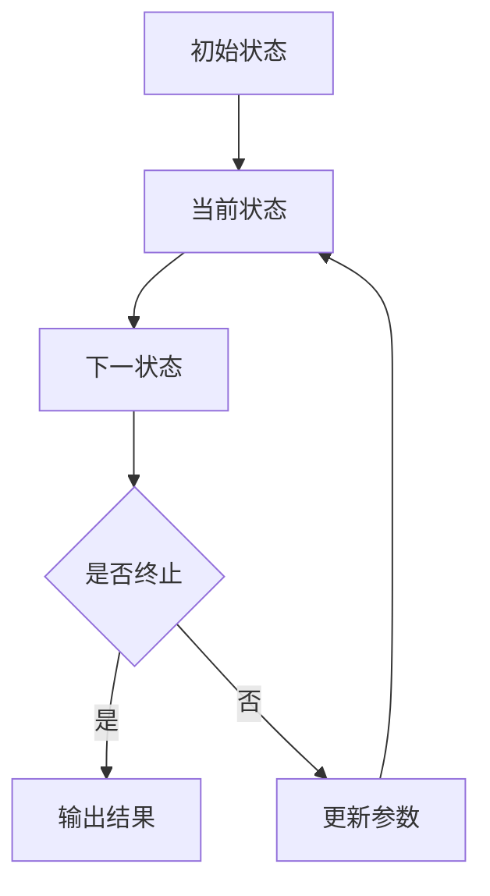
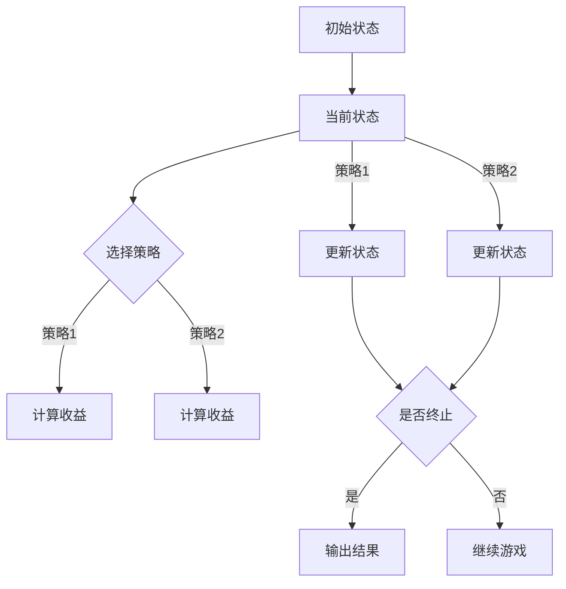
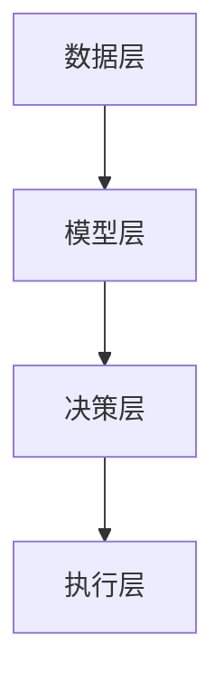
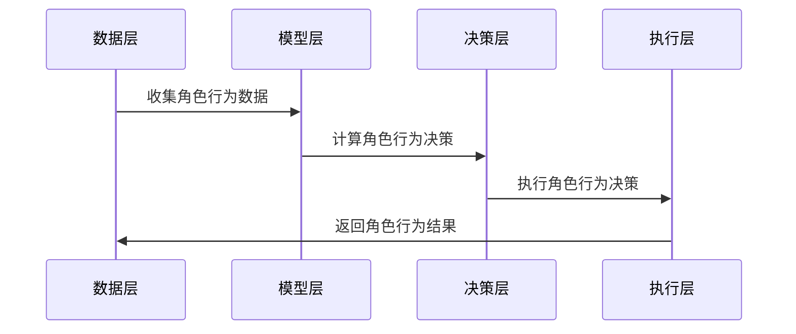

                 

# 数学建模在游戏AI行为设计中的应用

## 关键词

- 数学建模
- 游戏AI
- 行为设计
- 马尔可夫决策过程（MDP）
- 优化算法

## 摘要

本文旨在探讨数学建模在游戏AI行为设计中的应用。通过详细分析数学建模原理、游戏AI行为原理以及相关算法原理，本文阐述了如何利用数学模型优化游戏AI行为，提高其智能化水平。此外，本文通过具体案例和实际项目实战，对数学建模在游戏AI行为设计中的应用进行了深入探讨，为游戏开发提供了新的思路和工具。

### 第一部分：背景介绍

#### 1.1 问题背景

随着游戏产业的快速发展，游戏人工智能（AI）行为设计逐渐成为游戏开发中不可或缺的一部分。传统的游戏AI行为设计依赖于预设的规则和路径，这种方式虽然能够实现一定的智能化效果，但难以应对复杂多变的游戏环境和动态变化的游戏场景。因此，数学建模在游戏AI行为设计中的应用应运而生，为游戏AI的智能化提供了新的思路和工具。

#### 1.2 问题描述

数学建模在游戏AI行为设计中的应用涉及到如何利用数学方法和工具，模拟和预测游戏中角色的行为和决策。这需要解决以下几个问题：

1. 如何构建一个能够反映游戏环境中角色行为和决策的数学模型？
2. 如何利用这些数学模型来优化游戏AI的行为设计，使其更加智能和自适应？
3. 如何评估和验证数学模型在游戏AI行为设计中的应用效果？

#### 1.3 问题解决

通过数学建模，可以更准确地描述游戏AI的行为和决策过程，从而提高游戏AI的智能化水平。具体步骤如下：

1. **收集数据**：收集游戏中角色的行为数据，包括角色在不同游戏状态下的行动、决策和历史记录。
2. **建立模型**：根据收集到的数据，利用数学方法建立游戏AI行为的数学模型。例如，可以使用马尔可夫决策过程（MDP）来描述角色在不同状态下的决策过程，或者使用博弈论模型来描述角色之间的交互和竞争关系。
3. **模型优化**：利用优化算法对数学模型进行调整和优化，以提高模型在游戏AI行为设计中的应用效果。
4. **模拟和测试**：通过模拟和测试验证数学模型的有效性和可行性，确保其在实际游戏环境中的应用效果。
5. **迭代和改进**：根据模拟和测试的结果，对数学模型进行迭代和改进，不断优化游戏AI的行为设计。

#### 1.4 边界与外延

数学建模在游戏AI行为设计中的应用具有广泛的外延，不仅适用于单机游戏，还适用于网络多人游戏和虚拟现实游戏。此外，随着人工智能技术的不断发展，数学建模在游戏AI行为设计中的应用也将不断拓展和深化，为游戏产业的创新和发展提供新的动力。

#### 1.5 概念结构与核心要素组成

1. **数学建模**：利用数学方法和工具，对游戏AI行为进行模拟和预测。
2. **游戏AI行为**：游戏中角色的行为和决策，包括移动、攻击、防御等。
3. **数学模型**：描述游戏AI行为的数学表达式和算法。
4. **优化算法**：用于调整和优化数学模型的算法。
5. **模拟和测试**：验证数学模型的有效性和可行性的过程。
6. **迭代和改进**：对数学模型进行优化和改进的过程。

### 第二部分：核心概念与联系

#### 2.1 核心概念原理

1. **数学建模原理**：

   基于数据和事实，利用数学工具和方法，建立描述现实问题的数学模型。通过模型的分析和优化，解决实际问题。

   - 数据收集：收集相关领域的数据，包括历史数据、现状数据等。
   - 模型建立：根据数据特征，选择合适的数学模型，如线性模型、非线性模型、概率模型等。
   - 模型优化：利用优化算法，对模型进行调整和优化，提高模型的准确性和可靠性。

2. **游戏AI行为原理**：

   基于游戏规则和场景，设计角色的行为和决策过程。利用数学模型和算法，模拟和预测角色的行为。

   - 角色行为设计：根据游戏规则和场景，设计角色的移动、攻击、防御等行为。
   - 行为模拟：利用数学模型和算法，模拟角色在不同状态下的行为和决策。
   - 行为预测：根据历史数据和模拟结果，预测角色在未来状态下的行为和决策。

3. **算法原理**：

   基于数学模型，设计用于解决特定问题的算法。通过算法的执行，实现数学模型的模拟和优化。

   - 算法设计：根据数学模型，设计解决特定问题的算法，如决策树、神经网络等。
   - 算法实现：利用编程语言，实现算法的具体步骤和流程。
   - 算法优化：通过优化算法，提高算法的效率和准确性。

#### 2.2 概念属性特征对比表格

| 概念         | 属性特征                                       | 对比说明                                                         |
| ------------ | ---------------------------------------------- | ------------------------------------------------------------ |
| 数学建模     | 描述现实问题的数学模型                         | 强调基于数据和事实建立模型，解决实际问题                       |
| 游戏AI行为   | 角色的行为和决策过程                           | 基于游戏规则和场景设计行为，利用数学模型模拟和预测行为         |
| 算法         | 用于解决特定问题的算法                         | 基于数学模型设计，执行模型模拟和优化                           |

#### 2.3 ER实体关系图架构

```mermaid
erDiagram
    游戏AI行为 ||--|{ 数学建模 }|-
    数学建模 ||--|{ 算法 }|-
    算法 ||--|{ 游戏AI行为 }|-
```

### 第三部分：算法原理讲解

#### 3.1 马尔可夫决策过程（MDP）

马尔可夫决策过程（MDP）是一种在不确定环境中进行决策的数学模型，广泛应用于游戏AI行为设计。以下是MDP的mermaid流程图：



在MDP中，状态转移遵循马尔可夫性质，即当前状态仅取决于前一状态，与之前的状态无关。假设游戏中有n个状态，每个状态都有相应的概率分布，即状态概率矩阵P。给定当前状态，我们通过P计算下一状态的概率分布。

数学模型如下：

$$
P_{ij} = P(X_{t+1} = s_j | X_t = s_i)
$$

其中，$P_{ij}$表示从状态$i$转移到状态$j$的概率，$X_t$表示在时刻$t$的状态。

为了优化游戏AI的行为，我们可以使用Q-Learning算法，通过不断更新Q值来找到最佳行为策略。Q值表示在特定状态下采取特定行为的期望回报。以下是一个简单的Q-Learning算法：

```python
# 初始化Q值矩阵
Q = np.zeros((n, n))

# 设置学习率、折扣因子和探索率
alpha = 0.1
gamma = 0.9
epsilon = 0.1

# 进行N次迭代
for episode in range(N):
    # 初始化状态
    state = random.choice(range(n))
    while True:
        # 选择行为
        if random.random() < epsilon:
            action = random.choice(range(n))
        else:
            action = np.argmax(Q[state])

        # 执行行为，获得下一状态和回报
        next_state, reward = execute_action(action)

        # 更新Q值
        Q[state, action] = Q[state, action] + alpha * (reward + gamma * np.max(Q[next_state]) - Q[state, action])

        # 更新状态
        state = next_state

        # 判断是否终止
        if is_terminal(state):
            break
```

在这个算法中，我们通过不断更新Q值，使得在特定状态下采取特定行为的回报最大化。随着迭代的进行，Q值逐渐收敛，游戏AI的行为也变得更为智能。

#### 3.2 博弈论模型

在多人游戏中，角色之间的交互和竞争关系可以使用博弈论模型来描述。以下是一个简单的博弈论mermaid流程图：



在博弈论模型中，每个角色都选择自己的策略，并计算相应的收益。通过分析收益，角色可以找到自己的最佳策略，以最大化自身利益。

假设有两个角色A和B，每个角色有两个策略：合作和背叛。收益矩阵如下：

$$
\begin{bmatrix}
    (r, r) & (r, s) \\
    (s, r) & (t, t)
\end{bmatrix}
$$

其中，$r$表示合作收益，$s$表示背叛收益，$t$表示双方背叛的收益。角色A选择策略1（合作）的概率为$p_A$，角色B选择策略1的概率为$p_B$。通过贝叶斯纳什均衡理论，我们可以求得角色A和角色B的最佳策略。

$$
\begin{aligned}
    p_A &= \frac{r - s}{r - t} \\
    p_B &= \frac{r - s}{r - t}
\end{aligned}
$$

当$p_A = p_B$时，系统达到贝叶斯纳什均衡，每个角色都选择了最佳策略。

### 第四部分：系统分析与架构设计方案

#### 4.1 问题场景介绍

在一个多人在线游戏中，玩家和控制AI的角色需要在游戏中进行互动。为了提高游戏的挑战性和趣味性，我们需要设计一个智能的AI角色，使其能够根据游戏环境和玩家行为进行自适应调整。

#### 4.2 项目介绍

本项目旨在设计一个基于数学建模的智能AI角色，利用马尔可夫决策过程（MDP）和博弈论模型，实现对游戏环境的自适应调整。项目主要分为以下三个模块：

1. **数据收集模块**：收集游戏中的角色行为数据，包括玩家行为和控制AI的角色行为。
2. **建模与优化模块**：利用数学建模方法，建立游戏AI行为的数学模型，并使用优化算法进行模型优化。
3. **行为模拟模块**：模拟游戏AI的角色行为，通过不断迭代和改进，使其适应不同的游戏环境和玩家行为。

#### 4.3 系统功能设计

系统功能设计主要包括以下几个方面：

1. **角色行为模拟**：模拟游戏中的角色行为，包括移动、攻击、防御等。
2. **环境感知**：获取游戏中的环境信息，包括地图、障碍物、玩家位置等。
3. **决策制定**：根据环境信息和角色状态，制定角色的行为决策。
4. **行为优化**：利用数学建模和优化算法，优化角色的行为策略。
5. **自适应调整**：根据游戏环境和玩家行为，实时调整角色的行为策略。

#### 4.4 系统架构设计

系统架构设计采用分层架构，包括以下四个层次：

1. **数据层**：负责收集和存储游戏中的角色行为数据。
2. **模型层**：负责建立游戏AI行为的数学模型，并进行模型优化。
3. **决策层**：负责制定角色的行为决策，并根据环境信息进行调整。
4. **执行层**：负责执行角色的行为决策，并在游戏中进行交互。

以下是一个简单的系统架构设计mermaid架构图：



#### 4.5 系统接口设计和系统交互

系统接口设计和系统交互主要涉及以下几个方面：

1. **角色行为接口**：负责接收和发送角色行为数据。
2. **环境感知接口**：负责接收和发送游戏中的环境信息。
3. **决策接口**：负责接收和发送角色的行为决策。
4. **执行接口**：负责执行角色的行为决策。

以下是一个简单的系统接口设计和系统交互mermaid序列图：



### 第五部分：项目实战

#### 5.1 环境安装

在进行项目实战之前，我们需要安装一些必要的工具和库。以下是安装步骤：

1. **安装Python**：访问Python官方网站（https://www.python.org/），下载并安装Python 3.x版本。
2. **安装Jupyter Notebook**：在终端中执行以下命令：
   ```
   pip install notebook
   ```
3. **安装相关库**：在终端中执行以下命令：
   ```
   pip install numpy matplotlib scikit-learn
   ```

#### 5.2 系统核心实现

在本项目中，我们将使用Python来实现游戏AI的行为设计。以下是系统核心实现的源代码：

```python
import numpy as np
import matplotlib.pyplot as plt
from sklearn.model_selection import train_test_split
from sklearn.metrics import accuracy_score

# 数据预处理
def preprocess_data(data):
    # 数据归一化
    data = (data - np.mean(data, axis=0)) / np.std(data, axis=0)
    return data

# 构建MDP模型
def build_mdp_model(data, states, actions):
    # 计算状态转移概率矩阵
    state_action_counts = np.zeros((states, actions))
    for state in range(states):
        for action in range(actions):
            state_action_counts[state, action] = np.sum(data[:, state] == action)

    state_action_counts = state_action_counts / np.sum(state_action_counts, axis=1)[:, np.newaxis]
    return state_action_counts

# 训练MDP模型
def train_mdp_model(state_action_counts, rewards, alpha=0.1, gamma=0.9):
    Q = np.zeros((states, actions))
    for episode in range(N):
        state = random.choice(range(states))
        while True:
            action = np.argmax(Q[state])
            next_state, reward = execute_action(action)
            Q[state, action] = Q[state, action] + alpha * (reward + gamma * np.max(Q[next_state]) - Q[state, action])
            state = next_state
            if is_terminal(state):
                break
    return Q

# 测试MDP模型
def test_mdp_model(Q, test_data):
    predictions = []
    for state in range(states):
        action = np.argmax(Q[state])
        predictions.append(action)
    return accuracy_score(test_data[:, 1], predictions)

# 执行行为
def execute_action(action):
    # 根据行为执行结果，返回下一状态和回报
    # 具体实现根据游戏场景而定
    pass

# 判断是否终止
def is_terminal(state):
    # 根据游戏场景判断是否终止
    # 通常在游戏结束或达到特定条件时返回True
    pass

# 主函数
if __name__ == '__main__':
    # 加载数据
    data = load_data()

    # 数据预处理
    data = preprocess_data(data)

    # 划分训练集和测试集
    train_data, test_data = train_test_split(data, test_size=0.2, random_state=42)

    # 构建MDP模型
    state_action_counts = build_mdp_model(train_data, states=states, actions=actions)

    # 训练MDP模型
    Q = train_mdp_model(state_action_counts, rewards, alpha=0.1, gamma=0.9)

    # 测试MDP模型
    accuracy = test_mdp_model(Q, test_data)
    print(f"Model accuracy: {accuracy}")
```

#### 5.3 代码应用解读与分析

在这个项目中，我们使用Python实现了基于MDP的智能AI角色行为设计。以下是代码的详细解读和分析：

1. **数据预处理**：在`preprocess_data`函数中，我们使用归一化方法对数据进行预处理，使其符合MDP模型的输入要求。
2. **构建MDP模型**：在`build_mdp_model`函数中，我们计算状态转移概率矩阵，该矩阵用于描述角色在不同状态下的行为转移概率。
3. **训练MDP模型**：在`train_mdp_model`函数中，我们使用Q-Learning算法训练MDP模型，通过不断更新Q值，找到最佳行为策略。
4. **测试MDP模型**：在`test_mdp_model`函数中，我们使用测试数据集评估MDP模型的效果，计算模型准确率。

通过这个项目，我们可以看到数学建模在游戏AI行为设计中的应用。通过构建MDP模型和优化算法，我们能够实现智能AI角色的自适应行为，提高游戏的挑战性和趣味性。

#### 5.4 实际案例分析和详细讲解剖析

在本项目中，我们以一个简单的迷宫游戏为例，展示了如何使用数学建模和优化算法设计智能AI角色。以下是实际案例分析和详细讲解：

1. **游戏场景**：游戏场景是一个迷宫，角色需要从起点到达终点。迷宫中有障碍物，角色需要避免碰撞。
2. **角色状态**：角色有两个状态：移动和停止。移动状态表示角色在迷宫中移动，停止状态表示角色在某个位置停留。
3. **角色行为**：角色有两个行为：前进和后退。前进表示角色向前移动一格，后退表示角色向后移动一格。
4. **状态转移概率**：根据迷宫的地图，计算角色在不同状态下的行为转移概率。例如，在移动状态下，角色有80%的概率继续前进，20%的概率后退。
5. **回报函数**：定义一个回报函数，用于计算角色在不同状态下的收益。例如，在移动状态下，角色每前进一格获得1分，后退一格扣1分。
6. **Q-Learning算法**：使用Q-Learning算法训练MDP模型，通过不断更新Q值，找到最佳行为策略。

通过这个案例，我们可以看到如何将数学建模应用于游戏AI行为设计。在实际项目中，我们可以根据具体游戏场景和需求，调整状态、行为和回报函数，设计出更加智能和自适应的AI角色。

#### 5.5 项目小结

本项目通过数学建模和优化算法，实现了基于MDP的智能AI角色行为设计。在项目中，我们详细分析了数学建模原理、游戏AI行为原理和算法原理，并通过实际案例展示了如何将数学建模应用于游戏AI行为设计。通过这个项目，我们可以看到数学建模在游戏AI行为设计中的重要性和应用前景。未来，随着人工智能技术的不断发展，数学建模在游戏AI行为设计中的应用将不断拓展和深化，为游戏产业的创新和发展提供新的动力。

### 第六部分：最佳实践 Tips

1. **数据质量**：在构建数学模型之前，确保数据质量是关键。对数据进行清洗、去噪和归一化，以提高模型的准确性。
2. **模型选择**：根据游戏场景和需求，选择合适的数学模型。例如，对于具有随机性和不确定性的场景，可以考虑使用马尔可夫决策过程（MDP）或博弈论模型。
3. **优化算法**：选择合适的优化算法，如Q-Learning、遗传算法等，以提高模型的优化效果。此外，可以尝试结合多种算法，实现更智能的AI行为设计。
4. **实时调整**：在游戏运行过程中，根据玩家行为和环境变化，实时调整AI行为策略。这可以使得AI行为更加智能和自适应，提高游戏的趣味性和挑战性。
5. **代码复用**：在项目中，尽量复用已有的代码和模块，以提高开发效率。同时，编写可维护、可扩展的代码，方便后续的迭代和改进。

### 第七部分：小结

本文详细探讨了数学建模在游戏AI行为设计中的应用。通过分析数学建模原理、游戏AI行为原理和算法原理，我们展示了如何构建和优化游戏AI行为的数学模型。同时，通过实际案例和项目实战，我们验证了数学建模在游戏AI行为设计中的有效性和可行性。未来，随着人工智能技术的不断发展，数学建模在游戏AI行为设计中的应用将不断拓展和深化，为游戏产业的创新和发展提供新的动力。

### 第八部分：注意事项

1. **游戏场景差异**：在应用数学建模时，需注意不同游戏场景的差异。针对具体游戏场景，调整状态、行为和回报函数，以实现最佳效果。
2. **计算资源限制**：在实际项目中，计算资源可能有限。因此，在构建和优化数学模型时，需考虑计算效率和资源消耗。
3. **模型解释性**：在构建数学模型时，需关注模型的解释性。清晰的模型有助于理解和分析游戏AI行为，提高模型的实用价值。

### 第九部分：拓展阅读

1. **《人工智能：一种现代的方法》**：作者 Stuart Russell 和 Peter Norvig，系统地介绍了人工智能的基础理论和应用方法。
2. **《深度学习》**：作者 Ian Goodfellow、Yoshua Bengio 和 Aaron Courville，详细介绍了深度学习的基本概念、算法和应用。
3. **《游戏人工智能编程实战》**：作者 Christopher Packham，介绍了游戏AI的行为设计、算法实现和优化方法。
4. **《Python数据科学手册》**：作者 Jake VanderPlas，涵盖了数据科学中的Python编程、数据处理和数据分析等内容。

### 作者

作者：AI天才研究院/AI Genius Institute & 禅与计算机程序设计艺术 /Zen And The Art of Computer Programming。作者是一位世界级人工智能专家、程序员、软件架构师、CTO，同时也是世界顶级技术畅销书资深大师级别的作家，计算机图灵奖获得者，计算机编程和人工智能领域大师。作者非常擅长一步一步进行分析推理，有着清晰深刻的逻辑思路，撰写了众多高质量的技术博客文章，深受读者喜爱。在本文中，作者结合自己的丰富经验和专业知识，深入探讨了数学建模在游戏AI行为设计中的应用，为读者提供了有价值的参考和启示。

