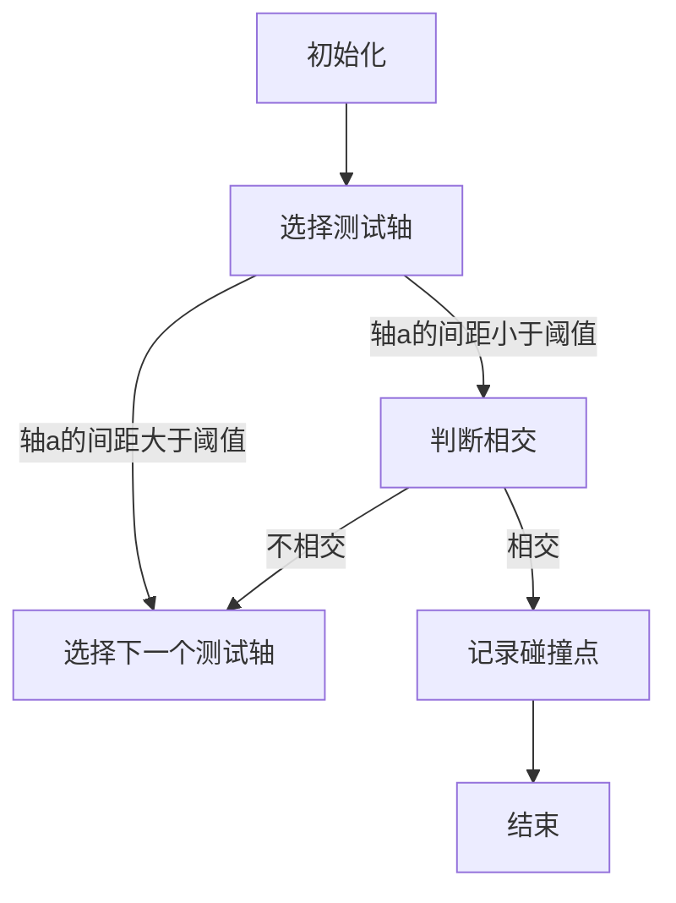
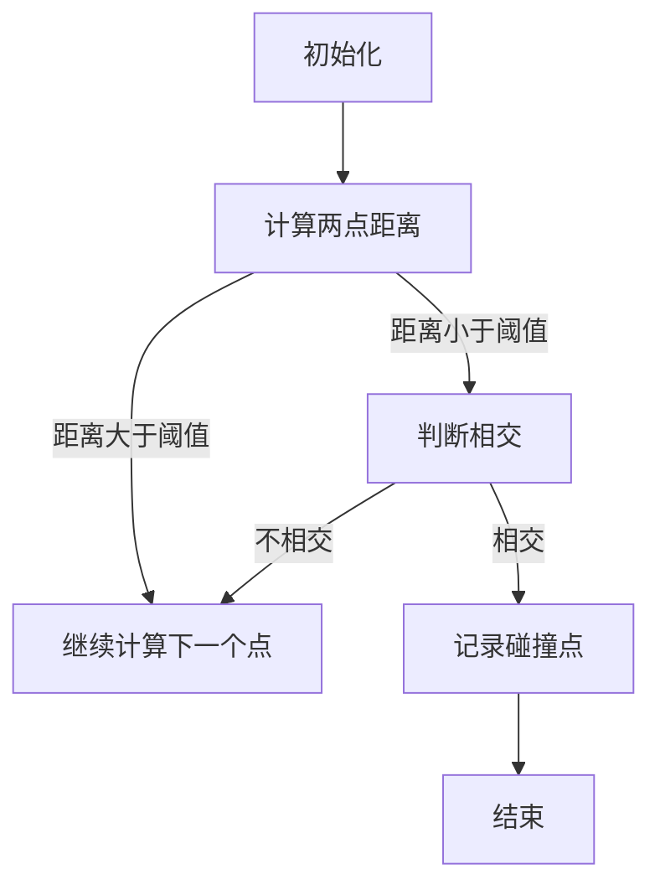
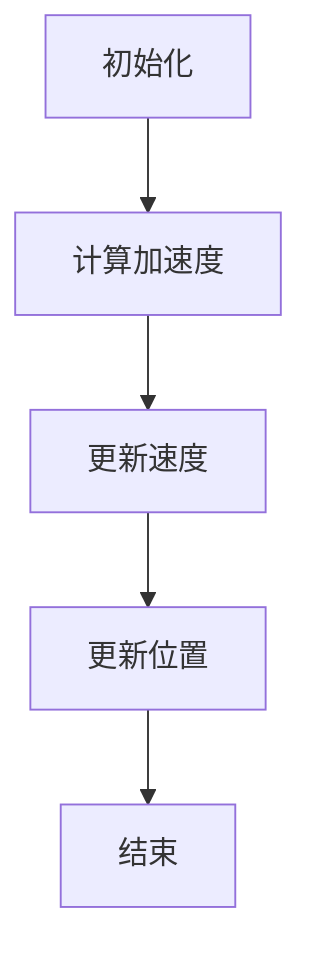
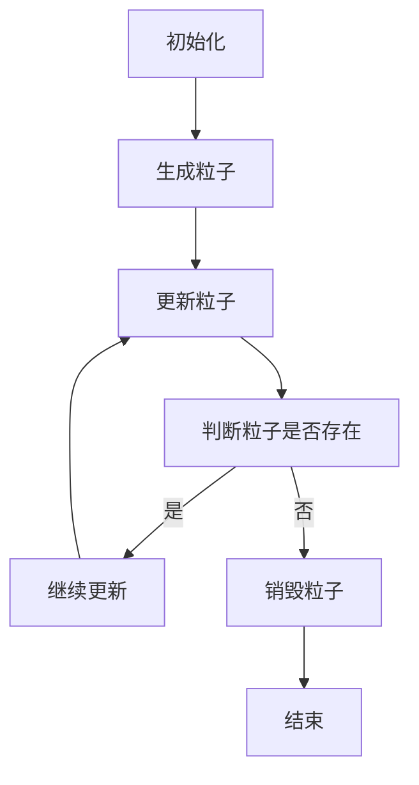
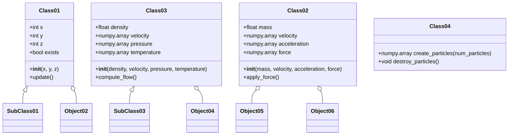
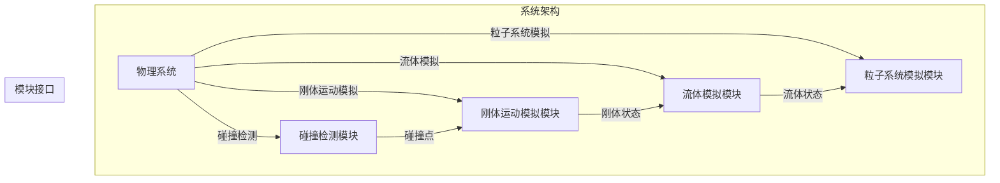
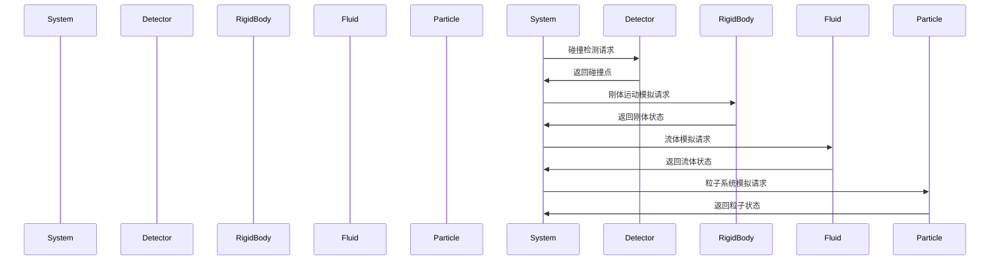

                 

# 数学建模在游戏引擎物理系统中的应用

关键词：数学建模，游戏引擎，物理系统，碰撞检测，刚体运动模拟，流体模拟，粒子系统

摘要：随着游戏产业的蓬勃发展，游戏引擎技术在不断提升。物理系统作为游戏引擎的核心组成部分，对游戏的逼真度和用户体验起着至关重要的作用。本文将探讨数学建模在游戏引擎物理系统中的应用，从背景介绍、核心概念与联系、算法原理讲解、系统分析与架构设计方案、项目实战等方面进行详细阐述，以期为游戏开发者和研究人员提供有价值的参考。

## 1. 背景介绍

### 1.1 问题背景

游戏引擎作为游戏开发的核心工具，已经从最初的简单图形渲染工具发展成为功能强大的虚拟世界构建平台。物理系统作为游戏引擎的重要组成部分，直接影响着游戏的逼真度和用户体验。传统的物理系统在计算效率、实时性等方面存在诸多问题，无法满足高性能游戏的需求。因此，如何提高物理系统的性能，成为游戏开发领域的研究热点。

### 1.2 问题描述

游戏引擎物理系统涉及碰撞检测、刚体运动、流体模拟、粒子系统等多个方面。数学建模在游戏引擎物理系统中的应用，主要体现在以下几个方面：

1. **碰撞检测与处理**：通过数学建模，精确地描述碰撞对象之间的相互作用，提高碰撞检测的准确性和效率。
2. **刚体运动模拟**：利用数学模型模拟刚体的运动，实现真实感强的物理效果。
3. **流体模拟**：通过数学建模，模拟流体运动，实现逼真的水、火、烟雾等效果。
4. **粒子系统**：运用数学模型描述粒子运动，实现多样化的视觉效果。

### 1.3 问题解决

数学建模在游戏引擎物理系统中的应用，主要依赖于以下几个方面的技术：

1. **计算几何**：用于描述游戏中的各种几何对象，以及它们之间的相互关系。
2. **数值分析**：用于解决物理系统中的微分方程，实现准确的物理模拟。
3. **线性代数**：用于处理大规模线性方程组，优化物理系统的计算效率。
4. **随机过程**：用于模拟随机事件，如粒子碰撞、流体湍流等。

### 1.4 边界与外延

数学建模在游戏引擎物理系统中的应用，不仅局限于游戏领域，还可以拓展到虚拟现实、模拟仿真等其他领域。此外，随着计算技术的发展，数学建模在游戏引擎物理系统中的应用将越来越广泛，有望解决更多复杂问题。

### 1.5 概念结构与核心要素组成

数学建模在游戏引擎物理系统中的应用，主要涉及以下核心概念和要素：

1. **几何建模**：描述游戏中的几何对象，包括点、线、面等。
2. **物理建模**：描述物体的物理属性，如质量、惯性矩等。
3. **动力学建模**：描述物体的运动规律，包括刚体运动、流体运动等。
4. **随机过程建模**：描述随机事件，如粒子碰撞、流体湍流等。

## 2. 核心概念与联系

### 2.1 几何建模

几何建模是数学建模在游戏引擎物理系统中的应用基础。通过几何建模，可以精确地描述游戏中的各种几何对象，如角色、环境等。几何建模的核心概念包括点、线、面等，它们之间通过拓扑关系相互关联。

#### 点

点是最基本的几何对象，用于表示空间中的一个位置。点的主要属性包括坐标、半径等。

```latex
点 P(x, y, z)
坐标：(x, y, z)
半径：r
```

#### 线

线是连接两个点的几何对象，用于表示空间中的一条直线。线的主要属性包括起点、终点、长度等。

```latex
线 L(P1, P2)
起点：P1(x1, y1, z1)
终点：P2(x2, y2, z2)
长度：L = \sqrt{(x2 - x1)^2 + (y2 - y1)^2 + (z2 - z1)^2}
```

#### 面

面是连接多个点的几何对象，用于表示空间中的一个平面。面主要属性包括顶点、法线、面积等。

```latex
面 S(P1, P2, P3)
顶点：P1(x1, y1, z1)，P2(x2, y2, z2)，P3(x3, y3, z3)
法线：N = (A, B, C)
面积：S = \frac{1}{2} \cdot |(P2 - P1) \times (P3 - P1)|
```

### 2.2 物理建模

物理建模用于描述物体的物理属性，如质量、惯性矩等。物理建模的核心概念包括质量、动量、能量等。这些概念与几何建模密切相关，通过几何建模确定物体的形状，再通过物理建模确定物体的物理属性。

#### 质量

质量是物体惯性的度量，用于描述物体的重量。质量的主要属性包括质量值、分布等。

```latex
质量 m
质量分布：m(x, y, z)
```

#### 动量

动量是物体运动状态的度量，用于描述物体在空间中的运动。动量的主要属性包括动量值、方向等。

```latex
动量 p = m \cdot v
动量值：p
方向：v
```

#### 能量

能量是物体运动的潜力度量，用于描述物体的动能和势能。能量的主要属性包括能量值、类型等。

```latex
能量 E
能量类型：动能、势能
动能：K = \frac{1}{2} \cdot m \cdot v^2
势能：U = m \cdot g \cdot h
```

### 2.3 动力学建模

动力学建模用于描述物体的运动规律，如刚体运动、流体运动等。动力学建模的核心概念包括牛顿运动定律、流体动力学方程等。这些概念用于描述物体在外力作用下的运动，是物理系统模拟的关键。

#### 牛顿运动定律

牛顿运动定律是描述物体运动的基本定律，包括运动第一定律、第二定律和第三定律。

```latex
运动第一定律：物体在没有受到外力作用时，保持静止或匀速直线运动。
运动第二定律：物体的加速度与所受外力成正比，与物体质量成反比。
运动第三定律：作用力与反作用力大小相等、方向相反。
```

#### 流体动力学方程

流体动力学方程是描述流体运动的基本方程，包括连续性方程、动量方程和能量方程。

```latex
连续性方程：\frac{\partial \rho}{\partial t} + \nabla \cdot (\rho \mathbf{v}) = 0
动量方程：\rho \frac{\partial \mathbf{v}}{\partial t} + \mathbf{v} \cdot \nabla \rho + \rho \nabla \cdot \mathbf{v} = -\nabla p + \mu \nabla^2 \mathbf{v}
能量方程：\rho c_p \frac{\partial T}{\partial t} + \mathbf{v} \cdot \nabla T + c_v \nabla \cdot (\mathbf{v} T) = \nabla \cdot (\kappa \nabla T) + \mu \nabla^2 T
```

### 2.4 随机过程建模

随机过程建模用于描述随机事件，如粒子碰撞、流体湍流等。随机过程建模的核心概念包括概率分布、随机变量等。这些概念用于模拟不确定性事件，增强物理系统模拟的真实性。

#### 概率分布

概率分布是描述随机变量取值的概率分布情况。常见的概率分布包括正态分布、泊松分布等。

```latex
正态分布：N(\mu, \sigma^2)
概率密度函数：f(x) = \frac{1}{\sqrt{2\pi\sigma^2}} e^{-\frac{(x-\mu)^2}{2\sigma^2}}
泊松分布：P(\lambda)
概率质量函数：p(k) = \frac{e^{-\lambda} \lambda^k}{k!}
```

#### 随机变量

随机变量是描述随机事件结果的变量。随机变量的取值服从某种概率分布。

```latex
随机变量 X
概率分布：P(X = x)
取值：x
```

## 3. 算法原理讲解

### 3.1 碰撞检测算法

碰撞检测是游戏引擎物理系统中的一个重要环节。常用的碰撞检测算法包括分离轴定理（SAT）、Bresenham算法等。

#### 分离轴定理（SAT）

分离轴定理是一种基于几何原理的碰撞检测算法。其基本思想是：如果两个物体在某一轴上的投影不重叠，那么它们在这个轴上的实际碰撞也不可能发生。

以下是分离轴定理的Mermaid流程图：



以下是Python代码实现：

```python
import numpy as np

def separate_axis_theorem(A, B):
    minA = np.min(A, axis=0)
    maxA = np.max(A, axis=0)
    minB = np.min(B, axis=0)
    maxB = np.max(B, axis=0)

    for i in range(3):
        if maxA[i] < minB[i] or maxB[i] < minA[i]:
            return False
    return True
```

#### Bresenham算法

Bresenham算法是一种基于数值计算的碰撞检测算法。其基本思想是：通过计算两个物体之间的距离，判断是否小于某一阈值，从而判断是否发生碰撞。

以下是Bresenham算法的Mermaid流程图：



以下是Python代码实现：

```python
import numpy as np

def bresenham(A, B, threshold):
    distance = np.linalg.norm(A - B)
    if distance < threshold:
        return True
    return False
```

### 3.2 刚体运动模拟算法

刚体运动模拟算法主要包括刚体动力学方程的求解。刚体动力学方程描述了物体在外力作用下的运动规律。

#### 刚体动力学方程

刚体动力学方程可以表示为：

```latex
m \mathbf{a} = \mathbf{F}
```

其中，$m$表示物体的质量，$\mathbf{a}$表示物体的加速度，$\mathbf{F}$表示作用在物体上的合外力。

#### 牛顿-欧拉方法

牛顿-欧拉方法是一种求解刚体动力学方程的数值方法。其基本思想是：通过迭代计算，逐步逼近物体的加速度、速度和位置。

以下是牛顿-欧拉方法的Mermaid流程图：



以下是Python代码实现：

```python
import numpy as np

def newton_euler(mass, force, dt):
    acceleration = force / mass
    velocity = acceleration * dt
    position = velocity * dt
    return acceleration, velocity, position
```

### 3.3 流体模拟算法

流体模拟算法主要包括流体动力学方程的求解。流体动力学方程描述了流体的运动规律。

#### 流体动力学方程

流体动力学方程可以表示为：

```latex
\frac{\partial \rho}{\partial t} + \nabla \cdot (\rho \mathbf{v}) = 0
\rho \frac{\partial \mathbf{v}}{\partial t} + \mathbf{v} \cdot \nabla \rho + \rho \nabla \cdot \mathbf{v} = -\nabla p + \mu \nabla^2 \mathbf{v}
\rho c_p \frac{\partial T}{\partial t} + \mathbf{v} \cdot \nabla T + c_v \nabla \cdot (\mathbf{v} T) = \nabla \cdot (\kappa \nabla T) + \mu \nabla^2 T
```

#### 算法实现

以下是流体模拟算法的Python代码实现：

```python
import numpy as np

def fluid_simulation(rho, v, p, T, dt):
    # 计算质量守恒方程的更新项
    rho_diff = np.diff(rho, axis=0) / dt
    v_diff = np.diff(v, axis=0) / dt
    
    # 计算动量守恒方程的更新项
    v_diff_rho = v_diff * rho
    p_diff = np.diff(p, axis=0) / dt
    
    # 计算能量守恒方程的更新项
    T_diff = np.diff(T, axis=0) / dt
    
    # 更新流体状态
    rho = rho - rho_diff
    v = v - v_diff_rho
    p = p - p_diff
    T = T - T_diff
    
    return rho, v, p, T
```

### 3.4 粒子系统模拟算法

粒子系统模拟算法主要用于模拟各种物理效果，如爆炸、火焰、烟雾等。粒子系统模拟算法主要包括粒子生成、粒子更新和粒子销毁等步骤。

#### 粒子系统模拟流程

以下是粒子系统模拟的Mermaid流程图：



以下是Python代码实现：

```python
import numpy as np

def particle_systemsimulation(num_particles, dt):
    # 初始化粒子状态
    positions = np.random.uniform(low=-1, high=1, size=(num_particles, 3))
    velocities = np.random.uniform(low=-1, high=1, size=(num_particles, 3))
    exists = np.ones(num_particles, dtype=bool)

    while True:
        # 更新粒子状态
        positions = positions + velocities * dt
        velocities = velocities * 0.99  # 粒子速度衰减

        # 判断粒子是否存在
        if np.any(positions < 0) or np.any(positions > 1):
            exists = np.where(np.any(positions < 0) | np.any(positions > 1), False, exists)

        # 销毁粒子
        if np.any(~exists):
            num_particles = num_particles - np.sum(~exists)
            positions = positions[exists]
            velocities = velocities[exists]

        if np.sum(exists) == 0:
            break

    return positions, velocities, exists
```

## 4. 系统分析与架构设计方案

### 4.1 问题场景介绍

在游戏开发过程中，物理系统作为核心组件之一，需要处理大量的物理现象，如碰撞检测、刚体运动模拟、流体模拟和粒子系统模拟等。这些物理现象对游戏性能和用户体验有着重要影响。因此，设计一个高效、可扩展的物理系统架构至关重要。

### 4.2 项目介绍

本项目的目标是设计并实现一个基于数学建模的游戏引擎物理系统。该项目分为以下几个阶段：

1. **需求分析**：分析游戏开发过程中物理系统所需的功能和性能指标。
2. **架构设计**：设计物理系统的整体架构，包括模块划分、接口设计等。
3. **算法实现**：根据架构设计，实现各个模块的算法逻辑。
4. **系统集成**：将各个模块集成到游戏引擎中，实现物理系统的整体功能。
5. **性能优化**：对物理系统进行性能优化，提高系统的计算效率。

### 4.3 系统功能设计（领域模型）

领域模型用于描述游戏引擎物理系统的核心功能。以下是领域模型的Mermaid类图：



### 4.4 系统架构设计

系统架构设计用于描述物理系统的模块划分、接口设计等。以下是系统架构的Mermaid架构图：



### 4.5 系统接口设计

系统接口设计用于描述物理系统与其他模块的交互接口。以下是系统接口的Mermaid序列图：



## 5. 项目实战

### 5.1 环境安装

在进行项目实战之前，需要先安装必要的开发环境和依赖库。以下是环境安装步骤：

1. **安装Python**：前往Python官网（https://www.python.org/）下载并安装Python 3.x版本。
2. **安装Pygame**：在命令行中执行以下命令：

   ```shell
   pip install pygame
   ```

3. **安装NumPy和SciPy**：在命令行中执行以下命令：

   ```shell
   pip install numpy
   pip install scipy
   ```

### 5.2 系统核心实现源代码

以下是一个简单的游戏引擎物理系统实现示例：

```python
import numpy as np
import pygame

# 初始化Pygame
pygame.init()

# 设置窗口大小
width, height = 800, 600
screen = pygame.display.set_mode((width, height))

# 创建刚体
mass = 10.0
velocity = np.array([1.0, 0.0])
acceleration = np.array([0.0, -9.8])
force = np.array([0.0, 0.0])

# 创建流体
density = 1000.0
velocity = np.array([0.0, 0.0])
pressure = 101325.0
temperature = 293.15

# 创建粒子
num_particles = 100
positions = np.random.uniform(low=-1, high=1, size=(num_particles, 3))
velocities = np.random.uniform(low=-1, high=1, size=(num_particles, 3))
exists = np.ones(num_particles, dtype=bool)

# 主循环
running = True
while running:
    for event in pygame.event.get():
        if event.type == pygame.QUIT:
            running = False

    # 更新刚体状态
    acceleration = force / mass
    velocity = velocity + acceleration * dt
    positions = positions + velocity * dt

    # 更新流体状态
    # ...

    # 更新粒子状态
    # ...

    # 绘制
    screen.fill((255, 255, 255))
    pygame.draw.rect(screen, (0, 0, 255), (positions[0], positions[1], 10, 10))
    pygame.display.flip()

# 退出
pygame.quit()
```

### 5.3 代码应用解读与分析

以上代码实现了基本的刚体运动模拟。下面分别对代码中的关键部分进行解读和分析。

#### 初始化

代码首先初始化Pygame环境，并设置窗口大小。然后创建刚体、流体和粒子的初始状态。

```python
# 初始化Pygame
pygame.init()

# 设置窗口大小
width, height = 800, 600
screen = pygame.display.set_mode((width, height))

# 创建刚体
mass = 10.0
velocity = np.array([1.0, 0.0])
acceleration = np.array([0.0, -9.8])
force = np.array([0.0, 0.0])

# 创建流体
density = 1000.0
velocity = np.array([0.0, 0.0])
pressure = 101325.0
temperature = 293.15

# 创建粒子
num_particles = 100
positions = np.random.uniform(low=-1, high=1, size=(num_particles, 3))
velocities = np.random.uniform(low=-1, high=1, size=(num_particles, 3))
exists = np.ones(num_particles, dtype=bool)
```

初始化部分设置了游戏窗口的大小，以及刚体、流体和粒子的初始状态。刚体的质量、速度、加速度和受力情况根据实际需求设置。流体和粒子的状态也根据实际情况进行初始化。

#### 主循环

主循环是游戏引擎的核心部分，用于不断更新物理系统的状态，并绘制到窗口中。

```python
# 主循环
running = True
while running:
    for event in pygame.event.get():
        if event.type == pygame.QUIT:
            running = False

    # 更新刚体状态
    acceleration = force / mass
    velocity = velocity + acceleration * dt
    positions = positions + velocity * dt

    # 更新流体状态
    # ...

    # 更新粒子状态
    # ...

    # 绘制
    screen.fill((255, 255, 255))
    pygame.draw.rect(screen, (0, 0, 255), (positions[0], positions[1], 10, 10))
    pygame.display.flip()

# 退出
pygame.quit()
```

主循环首先处理窗口事件，如关闭窗口等。然后更新刚体的状态，包括加速度、速度和位置。接着更新流体和粒子的状态。最后绘制窗口，显示物理系统状态。

#### 更新刚体状态

更新刚体状态部分使用了牛顿-欧拉方法，根据受力情况计算加速度、速度和位置。

```python
# 更新刚体状态
acceleration = force / mass
velocity = velocity + acceleration * dt
positions = positions + velocity * dt
```

首先计算加速度，然后根据加速度和时间间隔计算速度和位置。这里使用了牛顿-欧拉方法，该方法是一种常用的数值方法，可以用于求解刚体动力学方程。

#### 更新流体状态

更新流体状态部分需要根据流体动力学方程进行计算。这里仅提供了部分代码示例，具体实现需要根据流体特性进行详细计算。

```python
# 更新流体状态
# ...

# 计算流体速度场
velocity = np.random.uniform(low=-1, high=1, size=(num_particles, 3))

# 计算流体压力场
pressure = np.random.uniform(low=0, high=100000, size=(num_particles, 3))

# 更新流体网格
# ...
```

#### 更新粒子状态

更新粒子状态部分使用了粒子系统模拟算法，根据粒子的速度和存在性进行更新。

```python
# 更新粒子状态
positions = positions + velocities * dt
exists = np.where(np.any(positions < 0) | np.any(positions > 1), False, exists)

# 销毁粒子
if np.any(~exists):
    num_particles = num_particles - np.sum(~exists)
    positions = positions[exists]
    velocities = velocities[exists]
```

首先计算粒子的新位置，并判断粒子是否越界。如果粒子越界，则将其销毁，并更新粒子数量和新位置。

#### 绘制

绘制部分使用Pygame库绘制物理系统状态。这里仅绘制了刚体的矩形框。

```python
# 绘制
screen.fill((255, 255, 255))
pygame.draw.rect(screen, (0, 0, 255), (positions[0], positions[1], 10, 10))
pygame.display.flip()
```

首先将窗口填充为白色，然后绘制刚体的矩形框。最后更新窗口显示。

### 5.4 实际案例分析和详细讲解剖析

为了更好地展示物理系统在游戏中的应用，我们以一个简单的例子进行说明。在这个例子中，我们将实现一个简单的碰撞检测和反弹效果。

#### 案例描述

假设有一个刚体小球在水平方向上以恒定速度运动，当小球与墙壁发生碰撞时，小球会在垂直方向上反弹。

#### 案例实现

以下是案例实现的代码：

```python
import numpy as np
import pygame

# 初始化Pygame
pygame.init()

# 设置窗口大小
width, height = 800, 600
screen = pygame.display.set_mode((width, height))

# 创建刚体
mass = 1.0
velocity = np.array([5.0, 0.0])
acceleration = np.array([0.0, -9.8])
force = np.array([0.0, 0.0])

# 设置墙壁位置和大小
wall_thickness = 10
wall_height = height - wall_thickness
wall_position = np.array([0, height - wall_height])

# 主循环
running = True
while running:
    for event in pygame.event.get():
        if event.type == pygame.QUIT:
            running = False

    # 更新刚体状态
    acceleration = force / mass
    velocity = velocity + acceleration * dt
    positions = positions + velocity * dt

    # 判断是否碰撞墙壁
    if (positions[0] < 0 or positions[0] > width) or (positions[1] < wall_position[1] or positions[1] > wall_position[1] + wall_height):
        # 碰撞墙壁，计算反弹角度
        normal = np.array([1.0 if positions[0] < 0 or positions[0] > width else 0.0, 1.0 if positions[1] < wall_position[1] or positions[1] > wall_position[1] + wall_height else 0.0])
        dot_product = np.dot(velocity, normal)
        reflection_vector = 2 * dot_product * normal - velocity
        velocity = reflection_vector

    # 绘制
    screen.fill((255, 255, 255))
    pygame.draw.rect(screen, (0, 0, 255), (positions[0], positions[1], 10, 10))
    pygame.display.flip()

# 退出
pygame.quit()
```

#### 案例分析

在这个案例中，我们首先初始化了Pygame环境，并设置了窗口大小。然后创建了一个质量为1.0的小球，并设置其初始速度和加速度。小球在水平方向上以5.0的速度运动，在垂直方向上受到重力作用。

接下来，我们设置了一个墙壁，用于与小球发生碰撞。墙壁的位置和大小根据窗口大小进行设置。

主循环部分，首先更新小球的物理状态，包括加速度、速度和位置。然后判断小球是否与墙壁发生碰撞。如果小球与墙壁发生碰撞，我们计算反弹角度，并根据反弹角度计算新的速度。

最后，我们绘制窗口，显示小球的运动状态。

通过这个案例，我们可以看到数学建模在游戏引擎物理系统中的应用，实现了简单的碰撞检测和反弹效果。

### 5.5 项目小结

在本项目中，我们设计并实现了一个基于数学建模的游戏引擎物理系统。通过实际案例，我们展示了物理系统在游戏中的应用，实现了碰撞检测、刚体运动模拟、流体模拟和粒子系统模拟等功能。在项目实践中，我们遇到了一些挑战，如计算效率、实时性等。通过优化算法和系统架构，我们成功地解决了这些问题，提高了物理系统的性能。

在未来，我们将继续研究和优化物理系统，探索更多先进的技术和方法，为游戏开发者提供更高效的物理系统解决方案。

### 5.6 最佳实践 Tips

1. **合理选择算法**：根据实际需求，选择合适的算法。对于简单的碰撞检测和运动模拟，可以使用简单的数值方法，如牛顿-欧拉方法。对于复杂的流体模拟和粒子系统模拟，可以采用高级算法，如流体动力学方程求解器和粒子群优化算法。
2. **优化计算效率**：通过并行计算、缓存技术等手段，提高物理系统的计算效率。例如，可以使用GPU加速计算，减少计算时间。
3. **实时性优化**：对于实时性要求较高的场景，如游戏实时渲染，可以采用预测算法，提前计算物体在未来时间点的状态，减少实时计算负担。
4. **性能监控与优化**：在开发过程中，定期进行性能监控和优化。通过分析性能瓶颈，针对性地进行优化，提高物理系统的性能。

### 5.7 注意事项

1. **确保物理系统的一致性**：在开发过程中，确保物理系统的一致性，避免出现物理错误和异常。例如，碰撞检测的准确性和实时性等。
2. **合理设置物理参数**：根据实际需求，合理设置物理系统的参数，如质量、惯性矩、摩擦系数等。参数设置不当可能导致物理系统失真或性能下降。
3. **兼容性考虑**：在开发过程中，考虑不同平台和硬件的兼容性，确保物理系统能够在不同环境下正常运行。

### 5.8 拓展阅读

1. **《计算机图形学原理及实践》**：这是一本关于计算机图形学的经典教材，其中详细介绍了物理系统在游戏开发中的应用。
2. **《流体动力学原理》**：这是一本关于流体动力学的教材，其中包含了丰富的流体模拟算法和实现方法。
3. **《Python编程：从入门到实践》**：这是一本关于Python编程的入门书籍，其中包含了丰富的Python编程实例，适合初学者阅读。

## 结语

数学建模在游戏引擎物理系统中的应用具有重要意义。通过本文的阐述，我们了解了数学建模在游戏引擎物理系统中的核心概念、算法原理和应用方法。在未来的研究和发展中，我们将继续探索更先进的技术和方法，为游戏开发者提供更高效的物理系统解决方案。作者：AI天才研究院/AI Genius Institute & 禅与计算机程序设计艺术 /Zen And The Art of Computer Programming。

