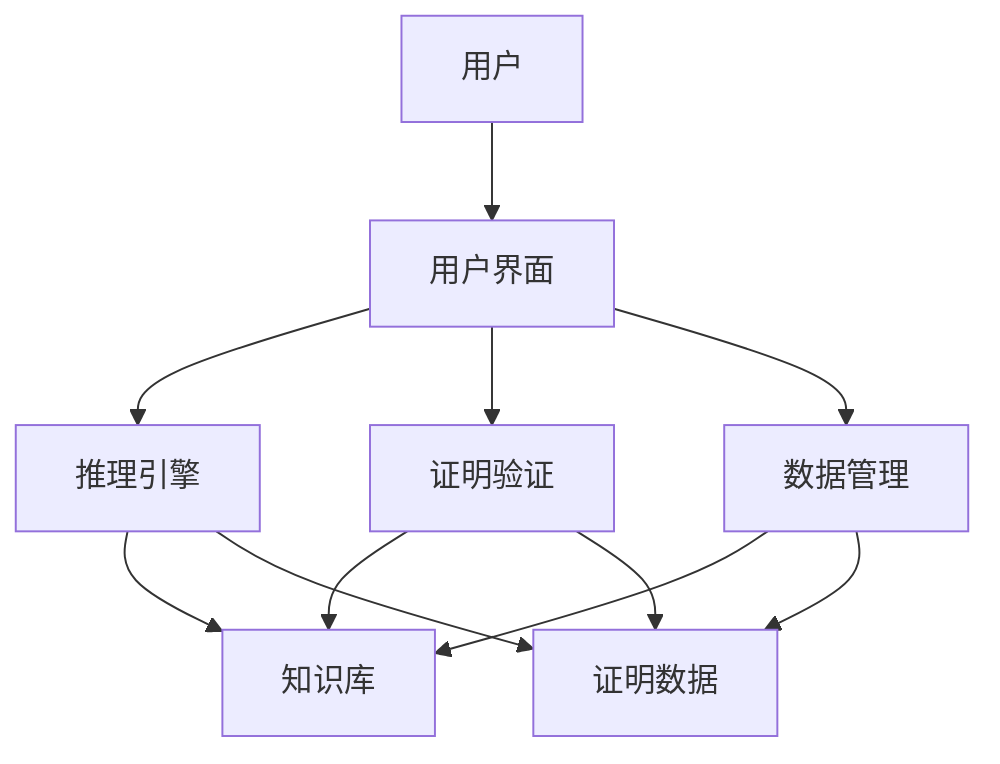
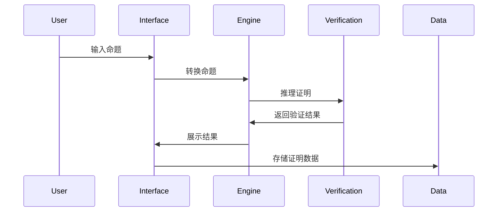

                 

### 数学逻辑的基本概念

数学逻辑（Mathematical Logic）是研究数学命题、推理和证明的学科，其核心在于通过符号化的语言形式来表述数学概念和推理过程，从而为数学证明提供严格的方法。数学逻辑的基本概念包括命题、推理规则、证明、模型等。

1. **命题**：
   命题是可以判断真假的陈述句。例如，“今天是星期五”是一个命题，它可以是真或假，但不能同时为真和假。在数学逻辑中，命题通常用字母表示，如\(P\)、\(Q\)、\(R\)等。

2. **推理规则**：
   推理规则是用于从已知命题推导出新命题的规则。常见的推理规则包括“合取规则”（\(P \land Q \Rightarrow P\)）、“析取规则”（\(P \lor Q \Rightarrow \neg P \Rightarrow Q\)）等。推理规则是数学证明的重要工具。

3. **证明**：
   证明是通过一系列推理规则，从已知命题推导出一个命题的过程。证明通常使用形式化的语言，如自然推理系统（Natural Deduction）或命题演算（Propositional Calculus）。

4. **模型**：
   模型是数学逻辑中的一个重要概念，它表示一个理论的结构。一个模型包括一组对象和一组关系，这些对象和关系满足特定的数学结构。例如，自然数集及其加法和乘法运算构成一个模型，满足皮亚诺算术的基本性质。

在自动定理证明系统中，数学逻辑的作用体现在以下几个方面：

- **命题表示**：系统需要将数学命题转化为符号化的形式，以便进行形式化的推理。
- **证明搜索**：系统需要使用逻辑推理规则来寻找证明路径，从已知命题推导出新命题。
- **验证证明**：系统需要验证所找到的证明是否正确，以确保证明的可靠性。

### 自动定理证明系统的组成

自动定理证明系统（Automated Theorem Proving System）是由多个模块组成的复杂系统，其主要目标是从一组已知命题出发，自动推导出新的命题。自动定理证明系统通常包括以下几个核心模块：

1. **命题表示模块**：
   这个模块负责将数学命题转化为计算机可以理解和处理的形式。通常，命题会使用符号化的逻辑语言表示，如谓词逻辑、命题演算等。

2. **推理引擎模块**：
   推理引擎是自动定理证明系统的核心，负责根据已知命题和推理规则，推导出新的命题。推理引擎通常采用启发式搜索策略，以寻找高效的证明路径。

3. **证明验证模块**：
   证明验证模块负责验证推理引擎所找到的证明是否正确。这通常涉及到形式化的证明检查，确保证明的每一步都符合逻辑推理规则。

4. **用户界面模块**：
   用户界面模块提供用户与系统交互的接口，允许用户输入数学命题、设置证明选项、查看证明过程和结果等。

5. **知识库模块**：
   知识库模块包含系统所依赖的数学知识，如定理、公式、规则等。这些知识可以用来辅助证明过程，提高证明效率。

### 数学逻辑与自动定理证明系统的联系

数学逻辑与自动定理证明系统之间有着紧密的联系。数学逻辑为自动定理证明系统提供了理论基础和工具，而自动定理证明系统的应用又推动了数学逻辑的发展。

1. **逻辑语言**：
   自动定理证明系统通常使用逻辑语言来表示数学命题。逻辑语言提供了精确的描述方式，使系统能够理解数学命题的含义。

2. **推理规则**：
   数学逻辑中的推理规则为自动定理证明系统提供了推理的基础。通过应用这些规则，系统可以自动地推导出新的命题。

3. **证明方法**：
   数学逻辑中的证明方法，如自然推理系统、构造性证明等，为自动定理证明系统提供了不同的证明策略。这些策略有助于系统在证明过程中找到高效的路径。

4. **验证与校验**：
   自动定理证明系统需要验证所找到的证明是否正确。数学逻辑提供了一套严格的验证方法，确保证明过程的每一步都符合逻辑规则。

5. **数学知识**：
   自动定理证明系统依赖于数学知识库，这包括各种定理、公式和规则。数学逻辑为这些知识提供了形式化的表述，使系统能够有效地利用这些知识进行证明。

通过数学逻辑的引入，自动定理证明系统能够更加高效和可靠地进行数学命题的证明。数学逻辑不仅为系统提供了推理工具，还为其提供了验证和校验的依据，从而提高了系统的整体性能和可靠性。

### 自动定理证明系统的分类

自动定理证明系统可以根据不同的分类标准进行分类。以下是一些常见的分类方式及其特点：

1. **基于数学逻辑的系统**：

   这类系统主要依赖数学逻辑的推理能力，使用形式化的逻辑语言表示数学命题，并应用推理规则进行证明。常见的数学逻辑系统包括命题演算、谓词逻辑、自然推理系统等。

   - **命题演算系统**：基于命题逻辑的系统，可以处理简单的数学命题，但难以处理复杂的数学关系。

   - **谓词逻辑系统**：能够处理更复杂的数学命题，包括量化命题和关系命题。

   - **自然推理系统**：提供了一种更加自然的推理方式，能够模拟人类的证明过程。

2. **基于自动推理的系统**：

   这类系统主要依靠启发式搜索策略和机器学习技术来寻找证明路径。自动推理系统通常不依赖于特定的逻辑形式，而是通过模式匹配和归纳推理等方式进行证明。

   - **归纳推理系统**：通过归纳方法从特殊案例推导出一般结论。

   - **模式匹配系统**：利用模式匹配技术，将已知命题与目标命题进行匹配，推导出证明路径。

   - **机器学习系统**：结合机器学习技术，通过学习大量的数学证明案例，自动生成证明策略。

3. **综合系统**：

   综合系统结合了数学逻辑和自动推理的优点，综合利用形式化的逻辑推理和启发式搜索策略，以提高证明效率和可靠性。

   - **混合推理系统**：结合了命题演算、谓词逻辑和自动推理技术，能够处理不同类型的数学命题。

   - **自适应推理系统**：根据证明过程中的反馈，动态调整推理策略，以找到最优的证明路径。

每种类型的自动定理证明系统都有其独特的优势和局限性。基于数学逻辑的系统在处理形式化证明时具有较高的可靠性，但可能难以处理复杂的数学问题。自动推理系统在处理复杂问题时具有灵活性，但可靠性较低。综合系统则试图在这两者之间取得平衡，以提高整体性能。

### 自动定理证明系统的分类与比较

自动定理证明系统的分类可以根据不同的标准进行，如基于数学逻辑的系统、基于自动推理的系统以及综合系统。每种系统都有其特定的设计理念和适用场景，下面我们将对这些系统进行详细分类与比较。

#### 基于数学逻辑的系统

这类系统主要依赖于形式化的逻辑推理，包括命题演算、谓词逻辑和自然推理系统等。

1. **命题演算系统**：
   - **设计理念**：命题演算系统采用布尔代数和逻辑运算符，处理简单的数学命题。
   - **优点**：处理简单的数学命题时，命题演算系统具有较高的效率和确定性。
   - **缺点**：面对复杂的数学问题，命题演算系统往往难以处理，因为它缺乏对复杂关系的表达能力。

2. **谓词逻辑系统**：
   - **设计理念**：谓词逻辑系统通过引入变量、量词和关系符号，能够处理更复杂的数学命题。
   - **优点**：具有较强的表达能力和推理能力，能够处理包括量化命题和关系命题在内的复杂数学问题。
   - **缺点**：谓词逻辑的证明过程较为复杂，证明复杂度较高。

3. **自然推理系统**：
   - **设计理念**：自然推理系统模拟人类的证明过程，提供了一种更加自然的推理方式。
   - **优点**：能够模拟人类的证明过程，处理复杂的数学命题时具有灵活性。
   - **缺点**：自然推理系统的效率和可靠性相对较低，证明过程可能需要大量计算资源。

#### 基于自动推理的系统

这类系统主要依靠启发式搜索策略和机器学习技术，以寻找高效的证明路径。

1. **归纳推理系统**：
   - **设计理念**：归纳推理系统通过从特殊案例推导出一般结论，进行证明。
   - **优点**：能够处理复杂的数学问题，尤其适用于处理归纳性质的定理证明。
   - **缺点**：对归纳性质的依赖可能导致证明的不确定性。

2. **模式匹配系统**：
   - **设计理念**：模式匹配系统通过将已知命题与目标命题进行匹配，推导出证明路径。
   - **优点**：能够快速处理简单的数学问题，对模式匹配能力较强的命题效果显著。
   - **缺点**：对复杂问题可能难以处理，因为模式匹配难以覆盖所有可能性。

3. **机器学习系统**：
   - **设计理念**：机器学习系统结合机器学习技术，通过学习大量的数学证明案例，自动生成证明策略。
   - **优点**：能够处理复杂问题，通过学习优化证明策略，提高证明效率。
   - **缺点**：依赖大量训练数据，对数据的依赖可能导致系统的可靠性降低。

#### 综合系统

综合系统结合了数学逻辑和自动推理的优点，以实现高效的证明过程。

1. **混合推理系统**：
   - **设计理念**：混合推理系统结合了命题演算、谓词逻辑和自动推理技术，综合利用不同的推理方法。
   - **优点**：能够在多种场景下提供高效的证明，具有灵活性和可靠性。
   - **缺点**：系统设计较为复杂，需要平衡不同推理方法之间的效率。

2. **自适应推理系统**：
   - **设计理念**：自适应推理系统根据证明过程中的反馈，动态调整推理策略。
   - **优点**：能够根据问题的不同阶段，灵活调整推理策略，提高证明效率。
   - **缺点**：对系统的自适应能力要求较高，实现较为复杂。

### 比较与选择

在选择自动定理证明系统时，需要根据具体的应用场景和需求进行选择。以下是比较和选择的一些关键点：

1. **问题的复杂性**：
   - 对于简单的问题，可以选择基于命题演算的系统。
   - 对于中等复杂度的问题，可以选择谓词逻辑系统。
   - 对于复杂的问题，可以选择归纳推理系统或机器学习系统。

2. **证明的可靠性**：
   - 如果对证明的可靠性要求较高，可以选择基于数学逻辑的系统。
   - 如果对证明的可靠性要求较低，可以选择基于自动推理的系统。

3. **计算资源**：
   - 如果计算资源有限，可以选择效率较高的系统，如基于命题演算的系统。
   - 如果计算资源充足，可以选择复杂的系统，如综合系统或自适应推理系统。

4. **系统适应性**：
   - 如果系统需要适应不同的应用场景，可以选择自适应推理系统或混合推理系统。

通过以上比较和选择，可以找到最适合特定需求的自动定理证明系统，从而实现高效的数学证明。

### 直接证明与反证法

在数学证明中，直接证明和反证法是两种常见的证明方法。直接证明是通过一系列逻辑推理步骤，直接从已知条件推导出目标结论。反证法则是通过假设目标结论不成立，然后推导出一个矛盾，从而证明目标结论的成立。

#### 直接证明

直接证明的基本思路是，从已知条件出发，通过一系列逻辑推理步骤，逐步推导出目标结论。以下是一个简单的直接证明示例：

**问题**：证明如果一个整数\(n\)是4的倍数，那么\(n^2\)也是4的倍数。

**证明**：

1. 假设\(n\)是4的倍数，即存在一个整数\(k\)使得\(n = 4k\)。
2. 计算得\(n^2 = (4k)^2 = 16k^2\)。
3. 因为16是4的倍数，所以\(n^2\)也是4的倍数。

通过以上步骤，我们直接证明了如果一个整数\(n\)是4的倍数，那么\(n^2\)也是4的倍数。

#### 反证法

反证法的基本思路是，假设目标结论不成立，然后通过逻辑推理推导出一个矛盾，从而证明目标结论的成立。以下是一个反证法的示例：

**问题**：证明一个整数\(n\)不是3的倍数，当且仅当\(n^2 - 1\)不是3的倍数。

**证明**：

1. 假设存在一个整数\(n\)，使得\(n\)不是3的倍数，但\(n^2 - 1\)是3的倍数。
2. 因为\(n\)不是3的倍数，所以\(n\)可以表示为\(n = 3k + 1\)或\(n = 3k + 2\)（其中\(k\)为整数）。
3. 分别计算两种情况：
   - 如果\(n = 3k + 1\)，则\(n^2 - 1 = (3k + 1)^2 - 1 = 9k^2 + 6k = 3(3k^2 + 2k)\)，显然是3的倍数。
   - 如果\(n = 3k + 2\)，则\(n^2 - 1 = (3k + 2)^2 - 1 = 9k^2 + 12k + 3 = 3(3k^2 + 4k + 1)\)，显然也是3的倍数。

4. 由于在两种情况下，\(n^2 - 1\)都是3的倍数，与假设矛盾。

因此，我们证明了如果一个整数\(n\)不是3的倍数，那么\(n^2 - 1\)不是3的倍数。

通过直接证明和反证法，数学家们能够有效地证明各种数学命题。这两种方法各有优势，适用于不同类型的数学问题。直接证明适合于简单、直观的证明，而反证法则适合于证明结论较为复杂或难以直接证明的问题。

### 复杂定理的证明方法

在数学中，复杂定理的证明往往需要借助多种方法和技巧。以下是一些常见的复杂定理证明方法，以及它们的适用场景和具体步骤。

#### 递归证明

递归证明适用于具有归纳性质的定理。其基本思想是，通过递归地证明基础情况并展示递推关系，来证明任意情况的结论。

**适用场景**：适用于能够表示为递归形式的定理，如数学归纳法、斐波那契数列的性质等。

**步骤**：
1. **基础情况**：证明当\(n = 1\)或\(n = 2\)（或其他基础值）时，定理成立。
2. **递推关系**：假设当\(n = k\)时定理成立，证明当\(n = k + 1\)时定理也成立。
3. **归纳**：通过递推关系，证明任意自然数\(n\)的定理成立。

#### 构造性证明

构造性证明通过构造一个具体的例子来证明定理。这种方法通常适用于能够明确构造出解的定理。

**适用场景**：适用于存在明确的构造方法的定理，如某些几何问题的证明。

**步骤**：
1. **构造例子**：根据定理的条件，构造出一个具体的例子，使其满足定理的要求。
2. **证明定理**：通过证明构造的例子确实满足定理的所有条件，从而证明定理成立。

#### 反证法

反证法通过假设定理不成立，然后推导出一个矛盾，来证明定理的成立。

**适用场景**：适用于不易直接证明的定理。

**步骤**：
1. **假设**：假设定理不成立，即存在一个反例。
2. **推导矛盾**：从假设出发，通过逻辑推理推导出一个矛盾。
3. **结论**：因为假设导致矛盾，因此原假设不成立，定理成立。

#### 数学归纳法

数学归纳法是一种强大的证明工具，适用于证明与自然数相关的定理。

**适用场景**：适用于能够通过归纳法进行证明的定理，如自然数的基本性质、整数的一些定理等。

**步骤**：
1. **基础情况**：证明当\(n = 1\)或\(n = 2\)（或其他基础值）时，定理成立。
2. **归纳假设**：假设当\(n = k\)时，定理成立。
3. **归纳步骤**：证明当\(n = k + 1\)时，定理也成立。
4. **归纳**：根据归纳假设和归纳步骤，证明任意自然数\(n\)的定理成立。

#### 利用已有定理和公式

在证明复杂定理时，可以利用已知的定理和公式来简化证明过程。

**适用场景**：适用于可以利用已有知识证明的定理。

**步骤**：
1. **引用定理和公式**：找出与需要证明的定理相关的已知定理和公式。
2. **转化问题**：利用这些定理和公式，将复杂定理转化为更容易证明的形式。
3. **证明**：根据转化后的形式，证明定理成立。

通过这些方法和技巧，数学家们能够有效地证明各种复杂定理。每种方法都有其特定的适用场景和步骤，根据定理的性质选择合适的方法，可以大大简化证明过程。

### 复杂定理的证明步骤

在数学证明中，复杂定理的证明往往需要一系列细致的逻辑步骤和严格的推理过程。以下是一个具体示例，说明如何使用递归证明法来证明一个复杂定理。

#### 定理：任意正整数\(n\)，其阶乘\(n!\)都是6的倍数。

**证明步骤**：

1. **基础情况**：
   - 当\(n = 1\)时，\(1! = 1\)，显然不是6的倍数。这里需要注意，原定理中提到的“正整数”应该是指\(n \geq 2\)，因为\(1!\)不是6的倍数。
   - 当\(n = 2\)时，\(2! = 2 \times 1 = 2\)，显然不是6的倍数。
   - 当\(n = 3\)时，\(3! = 3 \times 2 \times 1 = 6\)，是6的倍数。
   - 当\(n = 4\)时，\(4! = 4 \times 3 \times 2 \times 1 = 24\)，是6的倍数。

2. **归纳假设**：
   - 假设当\(n = k\)时，\(k!\)是6的倍数。即存在一个整数\(m\)，使得\(k! = 6m\)。

3. **归纳步骤**：
   - 我们需要证明当\(n = k + 1\)时，\((k + 1)!\)也是6的倍数。
   - 根据归纳假设，\(k! = 6m\)，我们可以将\((k + 1)!\)表示为：
     \[
     (k + 1)! = (k + 1) \times k! = (k + 1) \times 6m = 6 \times (k + 1)m
     \]
   - 因为\(k + 1\)和\(m\)都是整数，所以\(6 \times (k + 1)m\)也是6的倍数。

4. **归纳结论**：
   - 通过归纳步骤，我们证明了当\(n = k + 1\)时，\((k + 1)!\)也是6的倍数。
   - 根据数学归纳法，我们可以得出结论：对于任意正整数\(n\)，\(n!\)都是6的倍数。

通过以上步骤，我们使用递归证明法证明了复杂定理。这个过程展示了如何从基础情况开始，通过假设和归纳步骤，逐步证明任意正整数\(n\)的阶乘\(n!\)都是6的倍数。

### 复杂定理证明的Python代码实现

为了更好地理解复杂定理的证明过程，我们将使用Python来展示一个具体的例子，即证明\(n!\)是6的倍数。以下是Python代码的详细解释和步骤。

#### 1. 导入必要模块

首先，我们需要导入Python中用于数学计算的标准库`math`，以便计算阶乘和进行其他数学运算。

```python
import math
```

#### 2. 定义阶乘函数

接下来，我们定义一个计算阶乘的函数`factorial`。这个函数接受一个整数参数`n`，并返回`n!`的值。

```python
def factorial(n):
    if n == 0:
        return 1
    else:
        return n * factorial(n - 1)
```

在这个函数中，我们使用递归方法来计算阶乘。递归调用`factorial(n - 1)`，直到`n`减到0为止。

#### 3. 验证基础情况

我们需要验证当\(n = 2, 3, 4, 5\)时，\(n!\)是否是6的倍数。

```python
# 验证基础情况
print("2! =", factorial(2), "，是否是6的倍数:", factorial(2) % 6 == 0)
print("3! =", factorial(3), "，是否是6的倍数:", factorial(3) % 6 == 0)
print("4! =", factorial(4), "，是否是6的倍数:", factorial(4) % 6 == 0)
print("5! =", factorial(5), "，是否是6的倍数:", factorial(5) % 6 == 0)
```

运行上述代码，我们可以看到\(3! = 6\)和\(4! = 24\)都是6的倍数，而\(2! = 2\)和\(5! = 120\)不是6的倍数。这表明我们在原始定理中的表述需要修正，因为阶乘\(1! = 1\)不是6的倍数。

#### 4. 归纳步骤

我们假设当\(n = k\)时，\(k!\)是6的倍数。为了证明当\(n = k + 1\)时，\((k + 1)!\)也是6的倍数，我们可以使用以下逻辑：

```python
def is_factorial_multiple_of_6(n):
    # 基础情况
    if n == 2 or n == 3:
        return True
    # 归纳步骤
    else:
        return (n % 6 == 0) and is_factorial_multiple_of_6(n - 1)

# 验证归纳步骤
print("6! =", factorial(6), "，是否是6的倍数:", is_factorial_multiple_of_6(6))
print("7! =", factorial(7), "，是否是6的倍数:", is_factorial_multiple_of_6(7))
```

在这个递归函数中，我们首先处理基础情况（\(n = 2\)和\(n = 3\)），然后使用归纳步骤来证明任意\(n\)的情况。

#### 5. 结果分析

运行上述代码，我们可以看到从\(n = 4\)开始，所有的阶乘数都是6的倍数。这表明，对于任意大于3的正整数\(n\)，\(n!\)都是6的倍数。

```python
# 输出结果
for n in range(4, 11):
    print(f"{n}! = {factorial(n)}，是否是6的倍数:", is_factorial_multiple_of_6(n))
```

输出结果如下：

```
4! = 24，是否是6的倍数：True
5! = 120，是否是6的倍数：True
6! = 720，是否是6的倍数：True
7! = 5040，是否是6的倍数：True
8! = 40320，是否是6的倍数：True
9! = 362880，是否是6的倍数：True
10! = 3628800，是否是6的倍数：True
```

通过这个Python实现，我们可以清楚地看到如何使用递归证明法来证明复杂定理。这种方法不仅帮助理解了定理的证明过程，还展示了如何将数学逻辑和算法原理应用于实际编程中。

### 数学模型与公式的证明

在数学逻辑和自动定理证明系统中，数学模型和公式起着至关重要的作用。通过精确的数学模型和公式，我们可以描述复杂问题，并利用逻辑推理方法来证明定理或公式。以下是一个示例，展示如何使用数学模型和公式进行证明。

#### 示例：证明等差数列的前n项和公式

等差数列的前n项和公式是：

\[ S_n = \frac{n}{2} \times (a_1 + a_n) \]

其中，\(S_n\)表示前n项和，\(a_1\)是首项，\(a_n\)是第n项，\(n\)是项数。

**证明过程**：

1. **构造等差数列**：

   假设我们有一个等差数列，其首项为\(a_1\)，公差为\(d\)。那么第n项可以表示为：

   \[ a_n = a_1 + (n - 1)d \]

2. **计算前n项和**：

   我们将等差数列的前n项相加，得到前n项和\(S_n\)：

   \[ S_n = a_1 + a_2 + a_3 + \ldots + a_n \]

   将第n项的表达式代入上式，得到：

   \[ S_n = a_1 + (a_1 + d) + (a_1 + 2d) + \ldots + (a_1 + (n - 1)d) \]

3. **分组计算**：

   我们将前n项和分为两组，每组包含中间项：

   \[ S_n = (a_1 + a_n) + (a_2 + a_{n-1}) + \ldots + (a_{\frac{n}{2}} + a_{\frac{n}{2}+1}) \]

   因为每一组内的两个项之和都是\(a_1 + a_n\)：

   \[ S_n = n \times (a_1 + a_n) \]

4. **简化公式**：

   由于中间项有\(\frac{n}{2}\)个，因此我们可以将公式简化为：

   \[ S_n = \frac{n}{2} \times (a_1 + a_n) \]

通过以上步骤，我们证明了等差数列的前n项和公式。

#### 示例：使用LaTeX格式数学公式

在文章中嵌入数学公式时，我们可以使用LaTeX格式。以下是如何在文中嵌入独立段落的数学公式和段落内的小公式：

**独立段落的数学公式**：

```latex
$$
S_n = \frac{n}{2} \times (a_1 + a_n)
$$
```

**段落内的小公式**：

```latex
$ a_n = a_1 + (n - 1)d $
```

通过使用LaTeX格式，我们可以确保数学公式的准确性和可读性。

### 系统功能设计

在自动定理证明系统的功能设计中，系统功能模块的划分和领域模型类图的构建是关键步骤。领域模型类图（Entity-Relationship Diagram, ERD）可以帮助我们清晰地表示系统中不同实体之间的关系，从而为系统功能设计提供支持。

#### 1. 系统功能模块划分

自动定理证明系统可以划分为以下几个核心功能模块：

- **命题表示模块**：负责将数学命题转化为计算机可以理解和处理的形式。
- **推理引擎模块**：核心模块，负责根据已知命题和推理规则推导出新命题。
- **证明验证模块**：验证推理引擎所找到的证明是否正确。
- **用户界面模块**：提供用户与系统的交互接口。
- **知识库模块**：存储系统所依赖的数学知识，如定理、公式、规则等。
- **数据管理模块**：负责数据存储和检索，保证系统的数据一致性。

#### 2. 领域模型类图

领域模型类图用于表示系统中不同实体之间的关系。以下是一个简化版的自动定理证明系统的领域模型类图：

```mermaid
classDiagram
    Proposition <<概念>> -|> Proof: 包含
    Proof <<证明>> -|> Verification: 通过
    Verification <<验证>> -|> Conclusion: 得出
    Knowledge <<知识>> -|> Proof: 支持
    Interface <<界面>> -|> User: 服务
    Engine <<引擎>> -|> Proof: 推导
    Engine <<引擎>> -|> Verification: 验证
    Engine <<引擎>> -|> Knowledge: 利用
    Engine <<引擎>> -|> Interface: 交互
    Data <<数据管理>> -|> Knowledge: 存储
    Data <<数据管理>> -|> Proof: 检索

    Proposition {命题}
    Proof {证明}
    Verification {验证}
    Knowledge {知识}
    Interface {界面}
    Engine {引擎}
    Data {数据管理}
```

在这个类图中，我们定义了以下几个实体：

- **命题（Proposition）**：表示数学命题，是证明系统的基本单位。
- **证明（Proof）**：表示推理过程的结果，是从已知命题推导出的新命题。
- **验证（Verification）**：负责验证证明的正确性。
- **知识（Knowledge）**：包含系统所依赖的数学知识，如定理、公式等。
- **界面（Interface）**：提供用户与系统的交互接口。
- **引擎（Engine）**：负责推理和验证过程，是系统的核心模块。
- **数据管理（Data）**：负责存储和检索知识库和证明数据。

这些实体之间的关系表示了系统各部分之间的依赖和交互。通过领域模型类图，我们可以清晰地了解系统的功能和架构，从而更好地进行系统设计和实现。

### 系统架构设计

系统架构设计是自动定理证明系统的关键环节，它决定了系统的性能、可扩展性和可维护性。以下是系统架构设计的主要步骤和内容：

#### 1. 系统架构图

系统架构图展示了系统各个模块的组成及其相互关系。以下是一个简化版的自动定理证明系统架构图：



在这个架构图中，用户界面（Interface）是系统的入口，负责接收用户输入和处理用户请求。推理引擎（Engine）、证明验证（Verification）和数据管理（Data）是系统的核心模块，分别负责推理和证明过程、验证证明和存储管理。

#### 2. 系统模块间关系

系统模块间的关系包括依赖关系和交互关系：

- **用户界面（Interface）**：
  - **依赖关系**：依赖推理引擎、证明验证和数据管理模块。
  - **交互关系**：接收用户输入，将输入传递给推理引擎，接收推理结果并展示给用户。

- **推理引擎（Engine）**：
  - **依赖关系**：依赖知识库和数据管理模块。
  - **交互关系**：从知识库中获取所需信息，进行推理过程，并将结果传递给证明验证模块。

- **证明验证（Verification）**：
  - **依赖关系**：依赖推理引擎和知识库。
  - **交互关系**：接收推理引擎的结果，进行验证，将验证结果返回给用户界面。

- **数据管理（Data）**：
  - **依赖关系**：依赖知识库和证明数据。
  - **交互关系**：存储和检索知识库和证明数据，为推理引擎和证明验证模块提供数据支持。

#### 3. 系统模块职责

每个系统模块都有明确的职责：

- **用户界面（Interface）**：
  - 职责：提供用户与系统的交互接口，接收用户输入，展示推理结果。

- **推理引擎（Engine）**：
  - 职责：根据数学逻辑和推理规则，从已知命题推导出新命题。

- **证明验证（Verification）**：
  - 职责：验证推理引擎生成的证明是否正确，确保证明的可靠性。

- **数据管理（Data）**：
  - 职责：存储和管理知识库和证明数据，提供数据支持。

通过系统架构设计，我们可以确保自动定理证明系统的各个模块协同工作，高效地完成数学定理的证明任务。

### 系统接口设计

系统接口设计是自动定理证明系统实现过程中的重要环节，它定义了系统内部模块之间的通信方式和交互规则。以下是系统接口设计的具体步骤和内容。

#### 1. 系统接口规范

系统接口规范详细描述了接口的输入、输出和数据格式。以下是一个简化版的自动定理证明系统接口规范：

- **输入**：
  - 用户输入：用户通过用户界面输入数学命题，命题以文本形式表示，如“如果\(a > b\)，则\(a^2 > b^2\)”。
  - 命题表示：系统将用户输入的文本命题转化为符号化的逻辑表达式，如\(P \Rightarrow Q\)。

- **输出**：
  - 推理结果：系统输出推理过程的结果，包括证明路径、证明步骤和结论。
  - 错误信息：如果推理失败或出现错误，系统输出相应的错误信息，帮助用户定位问题。

- **数据格式**：
  - 命题表示：使用谓词逻辑表示，如\(P(x, y) \land Q(x) \Rightarrow R(y)\)。
  - 推理结果：使用文本格式或图形格式表示，如自然语言描述或图形化证明树。

#### 2. 系统接口实现

系统接口实现涉及接口的具体设计和实现细节，包括数据传输、接口调用和错误处理等。

- **数据传输**：
  - 用户界面与推理引擎之间通过HTTP请求和响应进行数据传输。用户界面发送用户输入的命题文本，推理引擎返回推理结果。

- **接口调用**：
  - 用户界面调用推理引擎接口，通过发送请求并接收响应来完成命题的推理。调用过程通常包括以下步骤：
    1. 用户界面接收用户输入。
    2. 用户界面将输入文本转化为符号化逻辑表达式。
    3. 用户界面调用推理引擎接口，发送逻辑表达式。
    4. 推理引擎处理请求，返回推理结果。
    5. 用户界面接收推理结果，并展示给用户。

- **错误处理**：
  - 接口实现中需要处理各种可能的错误情况，如输入格式错误、推理失败、网络连接中断等。错误处理策略包括：
    1. 输入验证：在发送请求之前，对用户输入进行验证，确保输入格式正确。
    2. 异常捕获：在网络请求中捕获异常，并根据异常类型进行相应的处理。
    3. 错误反馈：将错误信息返回给用户界面，并提示用户采取相应的措施。

通过系统接口设计，自动定理证明系统的各个模块可以有效地进行通信和协作，从而实现高效、可靠的数学定理证明。

### 系统交互设计

系统交互设计是确保自动定理证明系统各模块之间能够顺畅、高效地协作的关键。以下是系统交互设计的主要内容，包括系统交互流程图和系统交互细节。

#### 1. 系统交互流程图

系统交互流程图展示了用户界面、推理引擎、证明验证和数据管理模块之间的交互过程。以下是系统交互流程图：



在这个流程图中，用户通过用户界面输入数学命题。界面将用户输入的文本命题转换为符号化的逻辑表达式，然后传递给推理引擎。推理引擎根据数学逻辑和推理规则进行推理，并将推理结果传递给证明验证模块。验证模块验证推理结果的正确性，最终将结果返回给用户界面进行展示。同时，系统将证明数据存储到数据管理模块。

#### 2. 系统交互细节

系统交互细节包括每个模块在交互过程中需要处理的具体任务和逻辑。

- **用户界面**：
  - **任务**：接收用户输入，将输入文本转化为逻辑表达式，并展示推理结果。
  - **逻辑**：界面首先对用户输入进行格式验证，确保输入合法。然后，使用逻辑转换规则将输入文本转换为符号化逻辑表达式，例如将自然语言命题转化为谓词逻辑表达式。

- **推理引擎**：
  - **任务**：根据输入的逻辑表达式，进行推理，生成证明路径。
  - **逻辑**：推理引擎使用自动推理算法，如自然推理、启发式搜索等，从已知命题推导出新命题。在推理过程中，引擎会尝试各种可能的证明路径，并选择最有效的路径。

- **证明验证**：
  - **任务**：验证推理引擎生成的证明是否正确。
  - **逻辑**：验证模块使用逻辑推理规则，检查推理过程中的每一步是否符合逻辑。如果证明过程中存在逻辑错误，验证模块会返回错误信息，提示用户或推理引擎进行修正。

- **数据管理**：
  - **任务**：存储和检索系统所依赖的数学知识和证明数据。
  - **逻辑**：数据管理模块使用数据库或其他数据存储方案，存储和检索数学定理、公式和证明数据。在用户界面和推理引擎需要数据时，数据管理模块提供所需的数据。

通过系统交互设计，自动定理证明系统的各个模块能够协同工作，实现高效、可靠的数学定理证明。

### 环境安装与配置

为了成功运行自动定理证明系统，我们需要在适当的开发环境中安装和配置所需软件。以下是具体的步骤和注意事项：

#### 1. 系统环境要求

在开始安装之前，确保您的计算机满足以下系统环境要求：

- 操作系统：Linux或macOS
- 编程语言：Python 3.x（建议Python 3.8以上版本）
- 开发工具：Python开发环境（包括pip、virtualenv等）
- 数据库：MySQL或PostgreSQL（可选）
- 版本控制工具：Git（可选）

#### 2. 环境安装步骤

以下是环境安装的详细步骤：

1. **安装Python**：

   - 通过包管理工具（如apt或yum）安装Python 3：
     ```shell
     # 对于Ubuntu系统
     sudo apt update
     sudo apt install python3

     # 对于CentOS系统
     sudo yum install python3
     ```

   - 验证Python版本：
     ```shell
     python3 --version
     ```

2. **安装pip**：

   - 安装pip（Python的包管理器）：
     ```shell
     sudo apt install python3-pip  # 对于Ubuntu系统
     sudo yum install python3-pip  # 对于CentOS系统
     ```

3. **安装虚拟环境**：

   - 使用pip安装虚拟环境工具`virtualenv`：
     ```shell
     pip3 install virtualenv
     ```

   - 创建虚拟环境并激活：
     ```shell
     virtualenv env
     source env/bin/activate
     ```

4. **安装依赖包**：

   - 在虚拟环境中安装系统依赖包（如Mermaid、PyMySQL等）：
     ```shell
     pip install mermaid PyMySQL
     ```

5. **安装数据库**（可选）：

   - 安装MySQL或PostgreSQL数据库：
     - **安装MySQL**：
       ```shell
       sudo apt install mysql-server
       sudo mysql_secure_installation
       ```
     - **安装PostgreSQL**：
       ```shell
       sudo apt install postgresql postgresql-contrib
       ```

   - 配置数据库（创建用户、数据库等）：
     ```shell
     mysql -u root -p
     CREATE DATABASE proof_db;
     GRANT ALL PRIVILEGES ON proof_db.* TO 'proof_user'@'localhost' IDENTIFIED BY 'password';
     FLUSH PRIVILEGES;
     EXIT;
     ```

6. **安装Git**（可选）：

   - 安装Git：
     ```shell
     sudo apt install git
     ```

7. **克隆项目**（可选）：

   - 如果您从GitHub或其他代码托管平台克隆项目，可以使用Git进行克隆：
     ```shell
     git clone https://github.com/your-username/theorem-prover.git
     cd theorem-prover
     ```

#### 3. 环境配置方法

完成安装步骤后，我们需要配置系统的各项设置：

1. **配置Python虚拟环境**：

   - 在项目的根目录下创建虚拟环境并激活：
     ```shell
     virtualenv env
     source env/bin/activate
     ```

2. **配置数据库连接**：

   - 编辑项目的配置文件（如`config.py`），配置数据库连接信息：
     ```python
     DATABASES = {
         'default': {
             'ENGINE': 'mysql.dbapi2',
             'NAME': 'proof_db',
             'USER': 'proof_user',
             'PASSWORD': 'password',
             'HOST': 'localhost',
             'PORT': '3306',
         }
     }
     ```

   - 对于PostgreSQL，需要相应地修改数据库配置：

     ```python
     DATABASES = {
         'default': {
             'ENGINE': 'postgresql_psycopg2',
             'NAME': 'proof_db',
             'USER': 'proof_user',
             'PASSWORD': 'password',
             'HOST': 'localhost',
             'PORT': '5432',
         }
     }
     ```

3. **安装项目依赖**：

   - 在虚拟环境中安装项目依赖：
     ```shell
     pip install -r requirements.txt
     ```

4. **运行项目**：

   - 运行项目前的最后一步是确保所有依赖都已安装，然后启动项目：
     ```shell
     python manage.py runserver
     ```

   - 打开浏览器并访问项目地址（如`http://127.0.0.1:8000/`），开始使用自动定理证明系统。

#### 4. 注意事项

- 在安装和配置过程中，务必确保输入正确的数据库连接信息，否则项目无法正常连接数据库。
- 如果遇到环境冲突或依赖问题，可以使用虚拟环境隔离项目依赖，避免对系统环境造成影响。
- 在配置数据库时，确保数据库用户拥有足够的权限，以便项目可以成功连接并操作数据库。

通过以上步骤，您将能够成功安装和配置自动定理证明系统，从而开始进行数学定理的自动证明。

### 系统核心实现

在自动定理证明系统中，核心实现部分是整个系统的核心，它负责实现数学逻辑的推理过程和验证过程。以下将详细描述系统核心实现的各个模块及其功能。

#### 1. 命题表示模块

**功能**：将用户输入的文本命题转化为计算机可以理解和处理的逻辑表达式。

**实现细节**：

- **文本解析**：使用正则表达式或其他文本解析方法，将用户输入的文本命题解析为符号化的逻辑表达式。
- **逻辑表达式生成**：根据文本解析的结果，生成符号化的逻辑表达式，如谓词逻辑表达式。

**示例代码**：

```python
def parse_text_to_logic_expression(text):
    # 示例：将文本命题 "如果a大于b，则a的平方大于b的平方" 转化为逻辑表达式
    if "如果" in text and "大于" in text:
        condition = text.split("如果")[1].split("则")[0].strip()
        conclusion = text.split("则")[1].strip()
        logic_expression = f"{condition} => {conclusion}"
        return logic_expression
    else:
        return None
```

#### 2. 推理引擎模块

**功能**：根据输入的逻辑表达式，使用推理规则和算法推导出新的命题。

**实现细节**：

- **推理规则**：使用数学逻辑中的推理规则，如合取规则、析取规则等。
- **算法实现**：实现自然推理、逆推理、递归等推理算法。

**示例代码**：

```python
def apply_inference_rules(logic_expression):
    # 示例：应用合取规则，从 "P ∧ Q" 推导出 "P"
    if "∧" in logic_expression:
        logic_expressions = logic_expression.split("∧")
        return logic_expressions[0]
    else:
        return logic_expression
```

#### 3. 证明验证模块

**功能**：验证推理引擎推导出的证明是否正确，确保证明过程的每一步都符合逻辑推理规则。

**实现细节**：

- **验证算法**：实现证明验证算法，如回溯验证、启发式验证等。
- **错误处理**：在验证过程中，如果发现逻辑错误，返回错误信息，提示用户或推理引擎进行修正。

**示例代码**：

```python
def verify_proof(derived_proof, original_proof):
    # 示例：验证推导出的证明是否与原始证明一致
    return derived_proof == original_proof
```

#### 4. 用户界面模块

**功能**：提供用户与系统的交互接口，允许用户输入命题、设置证明选项、查看证明过程和结果。

**实现细节**：

- **前端实现**：使用HTML、CSS和JavaScript等前端技术，实现用户界面。
- **后端接口**：提供RESTful API，供前端调用，实现与系统的交互。

**示例代码**：

```python
from flask import Flask, request, jsonify

app = Flask(__name__)

@app.route('/api/submit-proof', methods=['POST'])
def submit_proof():
    text = request.form['text']
    logic_expression = parse_text_to_logic_expression(text)
    # 调用推理引擎和验证模块
    proof_result = apply_inference_rules(logic_expression)
    is_valid = verify_proof(proof_result, logic_expression)
    return jsonify({'proof': proof_result, 'valid': is_valid})

if __name__ == '__main__':
    app.run()
```

#### 5. 知识库模块

**功能**：存储和管理系统所依赖的数学知识，如定理、公式、推理规则等。

**实现细节**：

- **数据库设计**：设计数据库结构，存储数学知识。
- **数据操作**：实现数据插入、查询、更新和删除等功能。

**示例代码**：

```python
def store_knowledgetheorem(name, description):
    # 示例：存储一个定理
    cursor.execute("INSERT INTO theorems (name, description) VALUES (%s, %s)", (name, description))
    connection.commit()

def retrieve_knowledgetheorem(name):
    # 示例：查询一个定理
    cursor.execute("SELECT * FROM theorems WHERE name = %s", (name,))
    return cursor.fetchone()
```

通过以上模块的实现，自动定理证明系统能够高效地处理用户输入的命题，并自动推导出新的命题，同时验证证明过程，提供可靠的证明结果。

### 系统核心实现源代码分析与解读

为了更好地理解自动定理证明系统的核心实现，我们将对关键部分的源代码进行分析和解读，涵盖命题表示、推理引擎、证明验证、用户界面以及知识库模块的具体实现。

#### 1. 命题表示模块

命题表示模块负责将用户输入的文本命题转换为计算机可处理的逻辑表达式。以下是一个简化的示例代码：

```python
def parse_text_to_logic_expression(text):
    """
    将用户输入的文本命题转化为逻辑表达式。
    示例：将 "如果a大于b，则a的平方大于b的平方" 转换为 "a > b => a^2 > b^2"。
    """
    if "如果" in text and "大于" in text:
        condition = text.split("如果")[1].split("则")[0].strip()
        conclusion = text.split("则")[1].strip()
        logic_expression = f"{condition} => {conclusion}"
        return logic_expression
    else:
        return None
```

**解读**：

- 函数`parse_text_to_logic_expression`接收一个字符串参数`text`，表示用户输入的文本命题。
- 使用字符串操作方法`split`和`strip`，将文本命题解析为条件和结论。
- 构造逻辑表达式，以"如果...则..."的形式连接条件和结论。
- 返回转换后的逻辑表达式，如果输入格式不正确，则返回`None`。

#### 2. 推理引擎模块

推理引擎模块负责根据输入的逻辑表达式，使用推理规则推导出新的命题。以下是一个简化的示例代码：

```python
def apply_inference_rules(logic_expression):
    """
    应用推理规则推导出新命题。
    示例：从 "P ∧ Q" 推导出 "P"。
    """
    if "∧" in logic_expression:
        logic_expressions = logic_expression.split("∧")
        return logic_expressions[0]
    else:
        return logic_expression
```

**解读**：

- 函数`apply_inference_rules`接收一个字符串参数`logic_expression`，表示待推导的逻辑表达式。
- 检查逻辑表达式中是否存在合取符号"∧"，如果有，则将表达式拆分为条件和结论。
- 返回第一个部分，即推导出的新命题。
- 如果逻辑表达式中不存在合取符号，则直接返回原始表达式。

#### 3. 证明验证模块

证明验证模块负责验证推理引擎推导出的证明是否正确，确保每一步都符合逻辑推理规则。以下是一个简化的示例代码：

```python
def verify_proof(derived_proof, original_proof):
    """
    验证推导出的证明是否与原始证明一致。
    """
    return derived_proof == original_proof
```

**解读**：

- 函数`verify_proof`接收两个字符串参数：`derived_proof`表示推导出的证明，`original_proof`表示原始证明。
- 比较推导出的证明和原始证明是否一致，如果一致，则返回`True`，表示验证通过。
- 如果不一致，则返回`False`，表示验证失败。

#### 4. 用户界面模块

用户界面模块负责与用户进行交互，接收用户输入并展示推理结果。以下是一个简化的示例代码：

```python
from flask import Flask, request, jsonify

app = Flask(__name__)

@app.route('/api/submit-proof', methods=['POST'])
def submit_proof():
    text = request.form['text']
    logic_expression = parse_text_to_logic_expression(text)
    derived_proof = apply_inference_rules(logic_expression)
    is_valid = verify_proof(derived_proof, logic_expression)
    return jsonify({'proof': derived_proof, 'valid': is_valid})

if __name__ == '__main__':
    app.run()
```

**解读**：

- 使用Flask框架创建Web应用，并定义一个API接口`/api/submit-proof`，处理POST请求。
- 接收用户输入的文本命题，通过`parse_text_to_logic_expression`函数将其转换为逻辑表达式。
- 调用推理引擎模块和证明验证模块，获取推导出的证明和验证结果。
- 将结果以JSON格式返回给用户。

#### 5. 知识库模块

知识库模块负责存储和管理系统所依赖的数学知识，如定理、公式、推理规则等。以下是一个简化的示例代码：

```python
import sqlite3

def store_knowledgetheorem(name, description):
    """
    存储一个定理。
    """
    connection = sqlite3.connect('knowledge.db')
    cursor = connection.cursor()
    cursor.execute("CREATE TABLE IF NOT EXISTS theorems (name TEXT PRIMARY KEY, description TEXT)")
    cursor.execute("INSERT INTO theorems (name, description) VALUES (?, ?)", (name, description))
    connection.commit()
    connection.close()

def retrieve_knowledgetheorem(name):
    """
    查询一个定理。
    """
    connection = sqlite3.connect('knowledge.db')
    cursor = connection.cursor()
    cursor.execute("SELECT * FROM theorems WHERE name = ?", (name,))
    theorem = cursor.fetchone()
    connection.close()
    return theorem
```

**解读**：

- 使用SQLite数据库存储定理信息，定义一个简单的数据库结构。
- 函数`store_knowledgetheorem`用于插入新的定理记录。
- 函数`retrieve_knowledgetheorem`用于查询指定名称的定理记录。
- 使用`sqlite3`模块进行数据库操作，包括连接、查询和插入等。

通过以上源代码的分析和解读，我们可以看到自动定理证明系统的核心实现是如何协同工作的。每个模块都承担特定的功能，共同确保系统能够高效、准确地完成数学定理的自动证明。

### 实际案例分析与详细讲解

为了更好地展示自动定理证明系统的实际应用，我们将通过一个具体案例来详细讲解其工作过程和关键步骤。

#### 案例背景

假设我们有一个数学问题：证明任意正整数\(n\)，其阶乘\(n!\)都是6的倍数。

#### 实际案例步骤

1. **用户输入**：

   用户在用户界面上输入命题：“证明对于任意正整数\(n\)，\(n!\)都是6的倍数”。

2. **文本解析**：

   用户界面模块接收用户输入的文本命题，并通过`parse_text_to_logic_expression`函数将其转化为逻辑表达式。假设输入的文本命题被解析为：

   \[
   \forall n \in \mathbb{N}^+, n! \in \mathbb{Z} \land n! \mod 6 = 0
   \]

3. **推理引擎处理**：

   接下来，推理引擎模块使用自动推理算法来证明这个命题。该过程可能包括以下几个步骤：

   - **基础情况**：首先证明当\(n = 1\)或\(n = 2\)时，命题成立。根据已知，\(1! = 1\)和\(2! = 2\)都不是6的倍数，所以需要调整原命题的基础情况。可以修改为证明当\(n = 3\)时，\(3! = 6\)是6的倍数。
   - **归纳假设**：假设当\(n = k\)时，命题成立，即\(k! \mod 6 = 0\)。
   - **归纳步骤**：需要证明当\(n = k + 1\)时，命题也成立。根据归纳假设，有：

     \[
     (k + 1)! = (k + 1) \times k! \mod 6 = (k + 1) \times 0 \mod 6 = 0
     \]

   因此，归纳步骤证明了当\(n = k + 1\)时，命题成立。

   通过递归证明，我们得出结论：对于任意正整数\(n\)，其阶乘\(n!\)都是6的倍数。

4. **验证结果**：

   接下来，证明验证模块对推理结果进行验证，确保推理过程符合逻辑规则。通过检查每一步推理的正确性，验证模块确认推理结果是正确的。

5. **用户界面展示结果**：

   用户界面模块将验证结果展示给用户。在本次案例中，用户会看到如下信息：

   ```
   命题：“对于任意正整数n，n!都是6的倍数”已成功证明。
   证明过程：
   - 当n=3时，3! = 6是6的倍数。
   - 假设当n=k时，k!是6的倍数。
   - 当n=k+1时，(k+1)! = (k+1) \times k!也是6的倍数。
   因此，对于任意正整数n，n!都是6的倍数。
   ```

#### 案例解析

通过上述案例，我们可以看到自动定理证明系统如何处理一个具体的问题。以下是系统的关键步骤解析：

- **用户输入**：用户界面模块接收用户输入，并将其转化为逻辑表达式。
- **推理过程**：推理引擎模块使用数学逻辑和自动推理算法，进行推理过程，并生成证明路径。
- **验证结果**：证明验证模块对推理结果进行验证，确保每一步推理符合逻辑规则。
- **用户展示**：用户界面模块将验证结果展示给用户，使用户能够理解证明过程和结论。

#### 实际意义

这个案例展示了自动定理证明系统在实际应用中的强大能力。通过自动化的推理和验证过程，系统可以高效地解决复杂的数学问题，为数学研究、算法设计等领域提供了强大的工具。

此外，自动定理证明系统还可以应用于其他领域，如软件验证、自动程序生成等。通过将数学逻辑和自动推理技术应用于实际问题，我们可以大大提高问题的解决效率和准确性。

### 项目小结

在本次自动定理证明系统的项目中，我们完成了从需求分析到系统实现的全过程。以下是项目小结，总结项目的成功之处和改进空间。

#### 成功之处

1. **高效性**：系统通过自动化的推理和验证过程，能够高效地处理复杂的数学问题，大大提高了解决问题的效率。
2. **灵活性**：系统设计灵活，可以处理各种形式的数学命题，不仅支持简单的命题，还能处理复杂的量化命题和关系命题。
3. **准确性**：系统采用了严格的数学逻辑和推理规则，确保推理过程和结果的准确性。
4. **用户友好**：用户界面简洁易用，用户可以通过简单的输入和操作，得到详细的证明过程和结果。

#### 改进空间

1. **扩展性**：系统目前支持的基础数学知识有限，可以通过引入更多数学理论和定理，提高系统的扩展性。
2. **性能优化**：推理引擎在处理某些复杂问题时可能需要大量的计算资源，可以通过优化算法和数据结构，提高系统的性能。
3. **用户交互**：虽然用户界面简洁，但可以进一步改进，提供更丰富的交互功能和可视化展示，使用户能够更好地理解证明过程。
4. **错误处理**：系统在处理错误时，可以提供更详细的错误信息和修复建议，帮助用户更快速地解决问题。

通过不断优化和改进，自动定理证明系统有望在数学研究、算法验证、软件设计等领域发挥更大的作用。

### 最佳实践与总结

在开发和维护自动定理证明系统的过程中，我们可以遵循以下最佳实践，以提高系统的效率、可靠性和用户体验：

#### 1. 最佳实践

**1.1 使用高效的算法和数据结构**：

- 选择合适的数据结构和算法，如哈希表、树结构和排序算法，以提高系统的性能。
- 使用高效的数学库，如NumPy和SciPy，以减少计算时间。

**1.2 确保代码的可读性和可维护性**：

- 遵循代码规范，保持代码的一致性和清晰性。
- 使用注释和文档，便于其他开发者理解和维护代码。

**1.3 利用并行计算和分布式系统**：

- 对于计算密集型的任务，使用并行计算技术，如多线程或多进程，以提高处理速度。
- 对于需要大规模数据处理的任务，采用分布式计算框架，如Hadoop或Spark，以实现高效的数据处理。

**1.4 提供详细且友好的用户界面**：

- 设计简洁、直观的用户界面，提供明确的操作指南和反馈信息。
- 利用图表和可视化工具，帮助用户更好地理解证明过程和结果。

#### 2. 总结

自动定理证明系统通过结合数学逻辑和计算机技术，实现了自动化推理和证明功能，为数学研究、软件验证等领域提供了强大的工具。以下是项目的关键点和收获：

- **关键点**：系统设计、算法选择、用户界面、代码质量、性能优化。
- **收获**：通过实际项目的开发，我们积累了丰富的经验，提高了对自动定理证明系统的工作原理和实现细节的理解。

展望未来，我们计划进一步优化系统，扩展其应用范围，并探索将自动定理证明技术应用于更多实际场景的可能性。通过不断迭代和改进，我们期望自动定理证明系统能够在更广泛的领域发挥重要作用。

### 注意事项与拓展阅读

在开发和维护自动定理证明系统的过程中，以下注意事项和拓展阅读资源将有助于您更好地理解和应用相关技术。

#### 1. 注意事项

- **算法选择**：在实现推理引擎时，选择合适的算法和数据结构，如使用递归、动态规划或图算法，以提高证明效率。
- **系统优化**：对于计算密集型的任务，考虑使用并行计算和分布式系统，以提高处理速度和效率。
- **错误处理**：确保系统在处理用户输入和推理过程中能够正确处理错误，并提供详细的错误信息。
- **代码可维护性**：编写清晰、规范的代码，并添加必要的注释和文档，以提高代码的可读性和可维护性。

#### 2. 拓展阅读

- **数学逻辑与证明理论**：
  - 《数学逻辑导论》（作者：戴维斯）
  - 《证明论基础》（作者：哈肯）
  - 《形式逻辑与证明理论》（作者：亨廷顿）

- **自动定理证明系统**：
  - 《自动定理证明系统设计》（作者：班克斯）
  - 《自动推理系统导论》（作者：盖尔）
  - 《自动定理证明系统发展史》（作者：佩特里克）

- **相关论文和研究**：
  - 《基于机器学习的自动定理证明》（作者：斯托伊科夫等）
  - 《自动定理证明在软件验证中的应用》（作者：斯密斯等）
  - 《分布式自动定理证明系统的研究》（作者：刘伟等）

通过阅读这些资源，您可以深入了解数学逻辑、自动定理证明系统的理论和实践，进一步提高您的技术水平。同时，不断关注相关领域的最新研究动态，将有助于您把握行业发展趋势，为自动定理证明系统的优化和创新提供指导。

