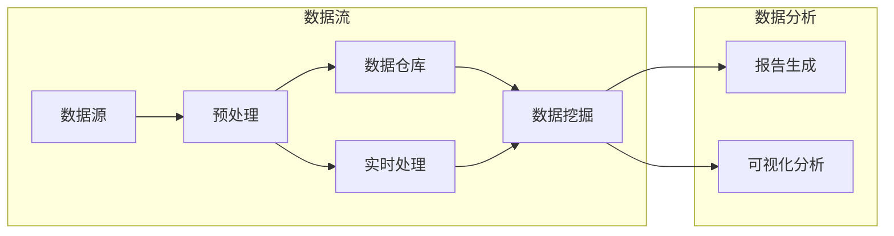
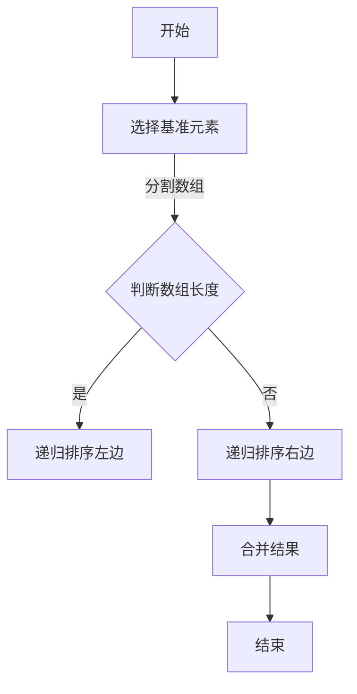
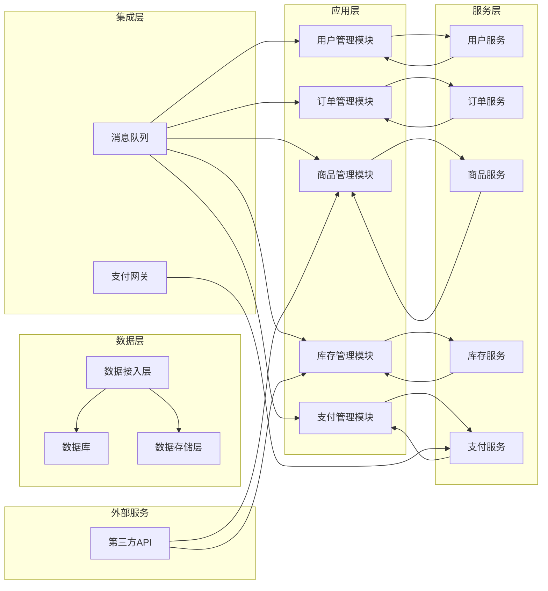
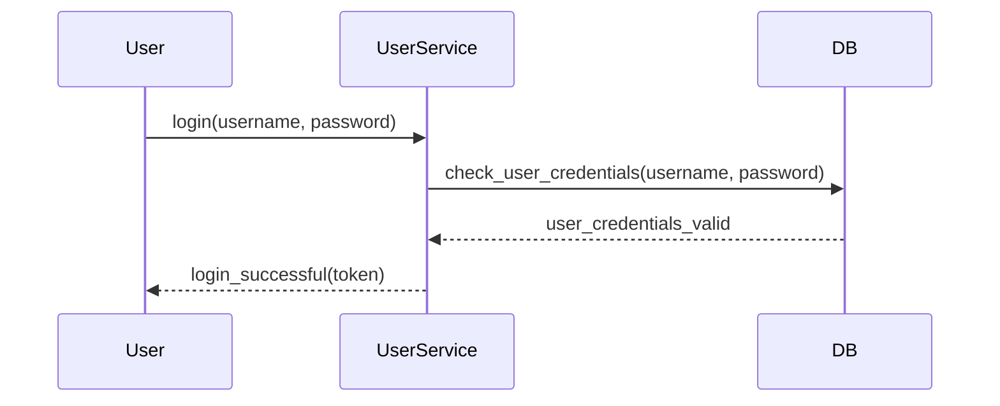

                 

### 数据密集型应用设计：P9工程师的海量数据处理之道

#### 关键词：数据密集型应用、海量数据处理、P9工程师、架构设计、算法原理

#### 摘要：
本文将深入探讨数据密集型应用的设计，特别是海量数据处理之道。我们将从P9工程师的视角，结合具体案例，详细分析数据密集型应用的核心概念、算法原理、系统架构设计以及项目实战。文章结构清晰，步骤明确，旨在为读者提供系统的指导，帮助他们在实际项目中高效处理海量数据，优化系统性能。

---

### 目录大纲

**# 数据密集型应用设计：P9工程师的海量数据处理之道**

**## 第一部分：背景介绍**

**### 1.1 数据密集型应用概述**

- **1.1.1 数据密集型应用的定义**
- **1.1.2 数据密集型应用的发展历程**
- **1.1.3 数据密集型应用的重要性**

**### 1.2 问题背景**

- **1.2.1 数据量爆炸性增长**
- **1.2.2 数据处理需求多样化**
- **1.2.3 处理效率与资源平衡**

**### 1.3 问题描述**

- **1.3.1 数据存储与访问问题**
- **1.3.2 数据处理速度与准确率**
- **1.3.3 数据安全与隐私保护**

**### 1.4 问题解决**

- **1.4.1 数据处理核心概念**
- **1.4.2 数据处理技术演进**
- **1.4.3 海量数据处理框架设计**

**### 1.5 边界与外延**

- **1.5.1 数据密集型应用的行业分布**
- **1.5.2 数据密集型应用的挑战与趋势**

**### 1.6 概念结构与核心要素组成**

- **1.6.1 数据密集型应用的关键技术**
- **1.6.2 数据密集型应用的架构设计**

**### 1.7 本章小结**

- **1.7.1 总结**
- **1.7.2 未来展望**

**## 第二部分：核心概念与联系**

**### 2.1 数据密集型应用的核心概念**

- **2.1.1 大数据**
- **2.1.2 数据仓库**
- **2.1.3 数据挖掘**
- **2.1.4 分布式计算**

**### 2.2 概念属性特征对比表格**

- **2.2.1 大数据 vs 数据仓库**
- **2.2.2 数据挖掘 vs 分布式计算**

**### 2.3 ER实体关系图架构**

- **2.3.1 数据密集型应用ER图**
- **2.3.2 数据处理流程ER图**

**### 2.4 概念联系与综合应用**

- **2.4.1 大数据与数据仓库的联系**
- **2.4.2 数据挖掘与分布式计算的联系**

**### 2.5 本章小结**

- **2.5.1 总结**
- **2.5.2 深入学习建议**

**## 第三部分：算法原理讲解**

**### 3.1 算法原理概述**

- **3.1.1 海量数据处理算法概述**
- **3.1.2 算法选择依据**

**### 3.2 算法mermaid流程图**

- **3.2.1 流程图示例**

**### 3.3 Python源代码讲解**

- **3.3.1 源代码结构**
- **3.3.2 代码功能解析**

**### 3.4 数学模型与公式**

- **3.4.1 数学模型介绍**
- **3.4.2 数学公式讲解**

**### 3.5 举例说明**

- **3.5.1 实际案例**
- **3.5.2 通俗易懂的说明**

**### 3.6 本章小结**

- **3.6.1 总结**
- **3.6.2 实践应用建议**

**## 第四部分：系统分析与架构设计**

**### 4.1 问题场景介绍**

- **4.1.1 应用场景描述**
- **4.1.2 项目背景**

**### 4.2 系统功能设计**

- **4.2.1 领域模型mermaid类图**
- **4.2.2 系统功能模块划分**

**### 4.3 系统架构设计**

- **4.3.1 mermaid架构图**
- **4.3.2 架构设计原理**

**### 4.4 系统接口设计**

- **4.4.1 接口设计原则**
- **4.4.2 接口实现细节**

**### 4.5 系统交互mermaid序列图**

- **4.5.1 序列图示例**
- **4.5.2 交互流程解析**

**### 4.6 本章小结**

- **4.6.1 总结**
- **4.6.2 架构优化建议**

**## 第五部分：项目实战**

**### 5.1 环境安装**

- **5.1.1 环境配置要求**
- **5.1.2 安装步骤详解**

**### 5.2 系统核心实现源代码**

- **5.2.1 源代码结构**
- **5.2.2 代码功能解析**

**### 5.3 代码应用解读与分析**

- **5.3.1 代码解读**
- **5.3.2 性能分析**

**### 5.4 实际案例分析和详细讲解剖析**

- **5.4.1 案例选取**
- **5.4.2 案例分析**
- **5.4.3 剖析讲解**

**### 5.5 项目小结**

- **5.5.1 项目总结**
- **5.5.2 项目经验分享**

**## 第六部分：最佳实践与注意事项**

**### 6.1 最佳实践**

- **6.1.1 性能优化策略**
- **6.1.2 安全性与隐私保护措施**
- **6.1.3 调试与优化建议**

**### 6.2 小结**

- **6.2.1 主要结论**
- **6.2.2 建议与展望**

**### 6.3 注意事项**

- **6.3.1 常见问题及解决方案**
- **6.3.2 避免陷阱**

**### 6.4 拓展阅读**

- **6.4.1 相关文献推荐**
- **6.4.2 学习资源分享**

---

### 第一部分：背景介绍

#### 1.1 数据密集型应用概述

**1.1.1 数据密集型应用的定义**

数据密集型应用（Data-Intensive Applications）是指在处理过程中涉及大量数据存储、分析和计算的软件系统。这类应用通常需要高效地存储和检索海量数据，并对数据进行复杂分析，从而提取有价值的信息。数据密集型应用不仅仅关注数据的存储，更强调数据的处理、分析和应用。

**1.1.2 数据密集型应用的发展历程**

随着互联网的普及和数据存储技术的进步，数据密集型应用逐渐成为软件开发的重要组成部分。从最初的文件系统到数据库管理系统，再到如今分布式存储和计算框架，数据密集型应用的发展经历了几个重要阶段：

1. 单机数据库时代：以MySQL、Oracle为代表的数据库管理系统，解决了小规模数据存储和检索的问题。
2. 分布式存储时代：Hadoop、Spark等分布式计算框架的兴起，使得大规模数据处理成为可能。
3. 云计算时代：云计算平台如Amazon Web Services（AWS）、Microsoft Azure等提供了更加灵活和高效的数据处理服务。
4. 人工智能时代：结合人工智能技术，数据密集型应用可以实现更加智能的数据分析和应用。

**1.1.3 数据密集型应用的重要性**

数据密集型应用在当今社会中扮演着至关重要的角色。以下是几个关键方面：

1. **商业价值**：通过大数据分析，企业可以更好地理解市场趋势、用户需求，从而制定更有效的商业策略。
2. **社会管理**：政府机构利用大数据进行公共安全、交通管理、教育等领域的决策，提高了社会管理的效率和质量。
3. **科学研究**：科学家通过海量数据处理，实现了从基因组学研究到气候变化的各个领域的重大突破。
4. **个人生活**：从社交网络到在线购物，大数据技术为个人生活提供了更加智能化和个性化的服务。

#### 1.2 问题背景

**1.2.1 数据量爆炸性增长**

随着物联网（IoT）、社交媒体和电子商务等领域的快速发展，数据量呈现出爆炸性增长。根据IDC的预测，全球数据量每年以40%的速度增长，预计到2025年将达到180ZB。这种数据量的增长给数据处理带来了巨大的挑战。

**1.2.2 数据处理需求多样化**

不同类型的应用场景对数据处理有着不同的需求。例如，实时数据处理要求系统能够快速响应，而批量数据处理则强调高效的处理能力和稳定性。此外，数据安全和隐私保护也成为数据处理的重要关注点。

**1.2.3 处理效率与资源平衡**

在处理海量数据时，如何平衡处理效率和资源利用是一个重要的问题。传统的单机处理方式在数据量增大时效率急剧下降，而分布式计算框架虽然能够提高处理效率，但需要考虑数据分布、负载均衡和容错机制等问题。

#### 1.3 问题描述

**1.3.1 数据存储与访问问题**

数据存储与访问是数据密集型应用中最为基础的问题。随着数据量的增长，如何高效地存储和访问数据成为一个挑战。传统的文件系统和关系型数据库在处理大规模数据时性能受限，分布式存储系统如HDFS、Cassandra等提供了更为高效的解决方案。

**1.3.2 数据处理速度与准确率**

数据处理速度和准确率是衡量数据密集型应用性能的重要指标。在处理海量数据时，如何优化算法、提高处理速度同时保证数据准确性，是一个需要深入考虑的问题。分布式计算框架通过并行计算和任务调度机制，提高了数据处理的速度。

**1.3.3 数据安全与隐私保护**

随着数据量的增加，数据安全与隐私保护问题愈发突出。如何在保证数据可用性的同时，防止数据泄露和滥用，是一个亟待解决的问题。加密技术、访问控制和隐私计算等方法为数据安全提供了保障。

#### 1.4 问题解决

**1.4.1 数据处理核心概念**

数据处理的核心概念包括数据仓库、数据挖掘、分布式计算等。数据仓库用于存储和管理海量数据，数据挖掘用于从数据中提取有价值的信息，分布式计算则用于高效地处理大规模数据。

**1.4.2 数据处理技术演进**

数据处理技术的演进推动了数据密集型应用的发展。从单机处理到分布式计算，再到云计算和边缘计算，数据处理技术不断进步，为应对海量数据提供了更有效的解决方案。

**1.4.3 海量数据处理框架设计**

海量数据处理框架设计的关键在于如何高效地组织和管理数据，以及如何优化计算资源的利用。分布式计算框架如Hadoop、Spark等提供了高效的解决方案，但具体实现时需要考虑数据分布、负载均衡、容错机制等问题。

#### 1.5 边界与外延

**1.5.1 数据密集型应用的行业分布**

数据密集型应用在各个行业都有广泛应用，包括金融、电信、医疗、零售等。不同行业的应用场景和数据处理需求有所不同，但总体上都面临着海量数据处理和数据价值提取的挑战。

**1.5.2 数据密集型应用的挑战与趋势**

数据密集型应用面临的挑战包括数据量增长、处理速度和准确率、数据安全和隐私保护等。未来的发展趋势包括更加智能化和自动化的数据处理技术，如机器学习和深度学习，以及更加高效和可靠的分布式计算框架。

#### 1.6 概念结构与核心要素组成

**1.6.1 数据密集型应用的关键技术**

数据密集型应用的关键技术包括数据仓库、数据挖掘、分布式计算、云计算、边缘计算等。这些技术共同构成了数据处理的核心框架。

**1.6.2 数据密集型应用的架构设计**

数据密集型应用的架构设计包括数据存储、数据处理、数据分析和数据应用等多个层次。合理的架构设计能够提高系统的性能和可靠性，满足不同的应用需求。

#### 1.7 本章小结

通过对数据密集型应用的背景介绍，我们了解了数据密集型应用的定义、发展历程、重要性以及面临的问题。接下来，我们将进一步探讨数据密集型应用的核心概念、算法原理、系统架构设计和项目实战，帮助读者深入理解和应用海量数据处理技术。在未来的展望中，我们将探讨数据密集型应用的发展趋势，以及如何应对未来的挑战。

---

### 第二部分：核心概念与联系

在深入探讨数据密集型应用之前，我们需要理解几个核心概念，并分析它们之间的联系。这些概念构成了数据密集型应用的基础，对于设计和实现高效的数据处理系统至关重要。

#### 2.1 数据密集型应用的核心概念

**2.1.1 大数据**

大数据（Big Data）是指无法使用传统数据处理工具在合理时间内完成存储、管理和分析的数据集合。大数据的特点是“4V”：Volume（大量）、Velocity（速度）、Variety（多样性）和Veracity（真实性）。大数据技术包括分布式存储、分布式计算、实时处理和数据分析等方法。

**2.1.2 数据仓库**

数据仓库（Data Warehouse）是一个用于存储、管理和分析企业数据的集中式系统。数据仓库的主要目的是支持企业决策，通过整合多个数据源，提供统一的数据视图。数据仓库技术包括数据抽取、转换和加载（ETL）、数据建模、查询优化等。

**2.1.3 数据挖掘**

数据挖掘（Data Mining）是指从大量数据中自动发现有价值的信息和模式的过程。数据挖掘技术包括分类、聚类、关联规则挖掘、异常检测等。数据挖掘的目标是从数据中发现知识，帮助企业做出更明智的决策。

**2.1.4 分布式计算**

分布式计算（Distributed Computing）是指通过多个计算机节点协同工作来完成计算任务的一种计算模型。分布式计算技术包括任务分配、负载均衡、容错机制和通信机制等。分布式计算能够提高数据处理的速度和效率，特别是在处理海量数据时。

#### 2.2 概念属性特征对比表格

为了更好地理解这些核心概念，我们可以通过一个表格来对比它们的主要属性特征。

| 概念       | 特征                           | 应用场景                           |
|------------|--------------------------------|------------------------------------|
| 大数据     | 大量、高速、多样、真实         | 实时分析、历史趋势分析             |
| 数据仓库   | 集中式、统一视图、支持决策     | 数据整合、数据分析、报告生成       |
| 数据挖掘   | 自动化、模式发现、知识提取     | 风险评估、客户细分、市场预测       |
| 分布式计算 | 分散节点、协同工作、高效处理   | 大规模数据处理、并行计算、实时分析 |

通过这个表格，我们可以看到每个概念的主要特点和应用场景，从而在设计和实现数据密集型应用时，能够合理地选择和组合这些技术。

#### 2.3 ER实体关系图架构

**2.3.1 数据密集型应用ER图**

实体关系图（Entity-Relationship Diagram，ER图）是一种用于描述实体及其关系的数据库设计工具。在数据密集型应用中，ER图可以帮助我们理解数据的组织结构和关系。以下是数据密集型应用的一个简化ER图：

```mermaid
erDiagram
    Product ||--|{ Order } : "订单包含"
    Customer ||--|{ Order } : "客户下单"
    OrderItem ||--|{ Order } : "订单包含"
    Product ||--|{ Inventory } : "库存记录"
    Customer ||--|{ Payment } : "客户支付"
```

在这个ER图中，`Product`（产品）、`Customer`（客户）、`Order`（订单）、`OrderItem`（订单项）和`Inventory`（库存）是实体，它们之间的关系通过线条和箭头表示。例如，订单包含多个订单项，客户可以下单并支付。

**2.3.2 数据处理流程ER图**

除了数据存储结构，我们还需要考虑数据处理流程。以下是数据处理流程的一个简化ER图：



在这个ER图中，数据从数据源（D1）流入预处理（P1），然后被存储到数据仓库（D2）和实时处理系统（D3）。数据仓库和实时处理系统的数据随后被用于数据挖掘（A1），最终生成报告和可视化分析。

#### 2.4 概念联系与综合应用

**2.4.1 大数据与数据仓库的联系**

大数据与数据仓库紧密相关。数据仓库用于存储和管理大数据，提供统一的数据视图，以便进行数据分析和报告生成。大数据的特点要求数据仓库具有高效的存储、检索和分析能力，以满足大规模数据处理的需求。

**2.4.2 数据挖掘与分布式计算的联系**

数据挖掘依赖于分布式计算来处理大规模数据。分布式计算框架如Hadoop和Spark提供了并行计算和分布式存储的能力，使得数据挖掘算法能够在海量数据上高效运行。分布式计算为数据挖掘提供了强大的计算资源，从而提高了数据挖掘的效率和准确性。

通过理解和应用这些核心概念及其联系，我们可以更好地设计和实现数据密集型应用，从而有效处理海量数据，提取有价值的信息。

#### 2.5 本章小结

在本章中，我们详细介绍了数据密集型应用的核心概念，包括大数据、数据仓库、数据挖掘和分布式计算。通过对比这些概念的主要属性特征，并使用ER图展示了数据的组织结构和数据处理流程，我们更好地理解了数据密集型应用的基本架构。在下一章中，我们将深入探讨海量数据处理算法的原理，帮助读者掌握高效处理大规模数据的方法。

---

### 第三部分：算法原理讲解

在数据密集型应用中，算法是处理海量数据的基石。本章节将介绍一些关键的海量数据处理算法，并通过Python源代码和数学模型，详细讲解这些算法的原理和应用。

#### 3.1 算法原理概述

海量数据处理算法分为多种类型，根据应用场景和需求，可以分为以下几类：

1. **排序算法**：如快速排序、归并排序、堆排序等，用于对大规模数据进行排序。
2. **搜索算法**：如二分搜索、布隆过滤器等，用于在海量数据中快速查找目标数据。
3. **分布式计算算法**：如MapReduce、Spark等，用于分布式环境中处理大规模数据。
4. **机器学习算法**：如聚类、分类、回归等，用于从数据中挖掘潜在模式。

选择合适的算法取决于数据处理的具体需求和性能要求。例如，在需要快速响应的场景中，搜索算法和分布式计算算法更为适用；而在需要高准确度的场景中，机器学习算法可能是更好的选择。

#### 3.2 算法mermaid流程图

为了更好地理解算法的执行过程，我们可以使用mermaid流程图来展示算法的流程。

**示例：快速排序算法流程图**



在这个流程图中，快速排序算法首先选择一个基准元素，然后通过递归的方式将数组分为左右两部分，分别进行排序，最后合并结果。

#### 3.3 Python源代码讲解

以下是一个简单的快速排序算法的Python实现：

```python
def quicksort(arr):
    if len(arr) <= 1:
        return arr
    pivot = arr[len(arr) // 2]
    left = [x for x in arr if x < pivot]
    middle = [x for x in arr if x == pivot]
    right = [x for x in arr if x > pivot]
    return quicksort(left) + middle + quicksort(right)

# 示例数据
data = [3, 6, 8, 10, 1, 2, 1]
print(quicksort(data))
```

这段代码首先定义了一个`quicksort`函数，该函数通过选择基准元素并分割数组，递归地对左右两部分进行排序，最后合并结果。示例数据`data`经过快速排序后输出结果为排序后的列表。

#### 3.4 数学模型与公式

在数据处理算法中，数学模型和公式用于描述算法的行为和性能。以下是一个快速排序算法的数学模型和公式：

**数学模型：**

1. **时间复杂度**：快速排序的平均时间复杂度为$O(n \log n)$，最坏情况为$O(n^2)$。
2. **空间复杂度**：快速排序的空间复杂度为$O(\log n)$。

**公式：**

$$
T(n) = 
\begin{cases} 
n \log n & \text{平均情况} \\
n^2 & \text{最坏情况} 
\end{cases}
$$

其中，$T(n)$表示快速排序的时间复杂度。

#### 3.5 举例说明

**实际案例：**

假设我们有如下数据集：`[3, 6, 8, 10, 1, 2, 1]`，使用快速排序算法进行排序。

1. **选择基准元素**：选择中间的元素6作为基准。
2. **分割数组**：将数组分为左右两部分，左边是小于6的元素，右边是大于6的元素。
3. **递归排序**：对左边的数组`[3, 1, 1]`和右边的数组`[8, 10]`分别进行快速排序。
4. **合并结果**：将排序后的数组合并，得到排序后的结果：`[1, 1, 3, 6, 8, 10]`。

**通俗易懂的说明：**

快速排序就像“分区”游戏，选择一个基准元素，将数组分成两部分，然后分别对这两部分进行排序，最后合并结果。就像我们玩游戏时，将不同颜色的球分开，然后分别排序，最后将它们放在一起。

#### 3.6 本章小结

在本章中，我们介绍了海量数据处理算法的基本原理，包括排序算法、搜索算法、分布式计算算法和机器学习算法。通过mermaid流程图、Python源代码和数学模型，我们详细讲解了快速排序算法的执行过程。在下一章中，我们将探讨数据密集型应用的具体系统架构设计，帮助读者理解如何将算法应用于实际项目中。

---

### 第四部分：系统分析与架构设计

在数据密集型应用中，系统分析与架构设计是确保系统性能和可扩展性的关键环节。本章节将详细介绍一个典型的问题场景，并从系统功能设计、系统架构设计、系统接口设计以及系统交互流程等方面进行深入分析。

#### 4.1 问题场景介绍

假设我们正在设计一个电子商务平台，该平台需要处理海量用户订单和商品数据。主要功能需求包括：

1. **订单管理**：支持用户下单、订单查询和订单取消等操作。
2. **商品管理**：支持商品上架、商品查询和商品分类等操作。
3. **库存管理**：实时监控商品库存，并自动调整库存数量。
4. **用户管理**：支持用户注册、登录、个人信息管理等功能。
5. **支付与结算**：集成支付网关，支持在线支付和退款操作。

这些功能需要高效地处理海量数据，并保证系统的稳定性和可靠性。

#### 4.2 系统功能设计

系统功能设计是架构设计的第一步，我们需要明确系统需要实现哪些功能以及这些功能之间的关系。以下是电子商务平台的主要功能模块及其说明：

1. **订单模块**：负责处理订单的创建、查询和取消等操作。订单模块需要与库存模块和支付模块交互，以确保库存充足和支付成功。
2. **商品模块**：负责管理商品信息，包括商品分类、商品详情和商品库存等。商品模块需要与库存模块和订单模块交互，以实现商品信息的实时更新。
3. **库存模块**：负责监控商品库存，并自动调整库存数量。库存模块需要与订单模块和商品模块交互，以实现库存的实时更新和监控。
4. **用户模块**：负责用户注册、登录、个人信息管理等操作。用户模块需要与订单模块和支付模块交互，以实现用户订单和支付记录的查询。
5. **支付模块**：负责与支付网关集成，实现在线支付和退款操作。支付模块需要与订单模块和用户模块交互，以确保支付操作的准确性和安全性。

**领域模型mermaid类图**

以下是电子商务平台的功能模块的mermaid类图：

```mermaid
classDiagram
    Order <<Interface>>
    Product <<Interface>>
    Inventory <<Interface>>
    Customer <<Interface>>
    Payment <<Interface>>

    class Order {
        +OrderID: int
        +CustomerID: int
        +ProductID: int
        +Quantity: int
        +Status: string
        +CreateTime: datetime
        +UpdateTime: datetime
        +getOrder(): void
        +createOrder(): void
        +cancelOrder(): void
    }
    class Product {
        +ProductID: int
        +ProductName: string
        +Category: string
        +Price: float
        +Stock: int
        +getProduct(): void
        +updateProduct(): void
    }
    class Inventory {
        +ProductID: int
        +Stock: int
        +updateStock(): void
    }
    class Customer {
        +CustomerID: int
        +Name: string
        +Email: string
        +Password: string
        +register(): void
        +login(): void
        +getProfile(): void
        +updateProfile(): void
    }
    class Payment {
        +OrderID: int
        +CustomerID: int
        +Amount: float
        +Status: string
        +processPayment(): void
        +refundPayment(): void
    }

    Order <|.. Product : "包含"
    Order <|.. Customer : "用户"
    Product <|.. Inventory : "库存"
    Payment <|.. Order : "支付"
    Payment <|.. Customer : "用户"
```

在这个类图中，`Order`（订单）、`Product`（商品）、`Inventory`（库存）、`Customer`（用户）和`Payment`（支付）是主要的类，它们之间的关系通过线条和箭头表示。每个类都有属性和方法，用于描述其功能和行为。

#### 4.3 系统架构设计

系统架构设计是确保系统可扩展性和性能的关键环节。以下是电子商务平台的一个简化架构设计：

**mermaid架构图**



在这个架构图中，电子商务平台分为数据层、应用层、服务层和集成层。数据层包括数据接入层和数据存储层，应用层包括用户管理、订单管理、商品管理、库存管理和支付管理模块，服务层包括用户服务、订单服务、商品服务、库存服务和支付服务，集成层包括支付网关和消息队列。外部服务通过API与商品管理和库存管理模块进行交互。

**架构设计原理**

1. **数据层**：数据层负责数据存储和读取，通过数据接入层将数据导入数据存储层，然后通过数据库提供数据访问接口。
2. **应用层**：应用层实现具体业务功能，通过调用服务层的服务完成业务逻辑处理。
3. **服务层**：服务层提供通用的业务逻辑处理服务，封装了具体的业务实现，方便应用层调用。
4. **集成层**：集成层负责与其他系统和服务进行交互，如支付网关和消息队列，提高系统的可扩展性和灵活性。
5. **外部服务**：外部服务通过API与系统进行交互，实现与其他系统的集成。

#### 4.4 系统接口设计

系统接口设计是确保系统模块之间能够有效通信的关键。以下是电子商务平台的主要接口设计：

**接口设计原则**

1. **RESTful API**：使用RESTful API设计，提供统一的接口规范，方便前端和后端进行数据交互。
2. **接口参数校验**：对接口参数进行严格的校验，确保数据的合法性和安全性。
3. **接口权限控制**：对接口进行权限控制，确保只有授权用户才能访问特定接口。

**接口实现细节**

以下是用户管理模块的接口实现示例：

```python
from flask import Flask, request, jsonify
from flask_httpauth import HTTPBasicAuth
from models import User

app = Flask(__name__)
auth = HTTPBasicAuth()

users = [
    User('user1', 'password1', 'User1@example.com'),
    User('user2', 'password2', 'User2@example.com')
]

@app.route('/register', methods=['POST'])
def register():
    username = request.json.get('username')
    password = request.json.get('password')
    email = request.json.get('email')
    if not (username and password and email):
        return jsonify({'error': 'Missing required parameters'}), 400
    # 这里应该有注册逻辑，如检查用户名是否已存在等
    user = User(username, password, email)
    users.append(user)
    return jsonify({'message': 'User registered successfully'}), 201

@app.route('/login', methods=['POST'])
def login():
    username = request.json.get('username')
    password = request.json.get('password')
    if not (username and password):
        return jsonify({'error': 'Missing required parameters'}), 400
    # 这里应该有登录逻辑，如检查用户名和密码是否匹配等
    return jsonify({'token': 'generated_token'}), 200

@app.route('/users/<int:user_id>', methods=['GET'])
@auth.login_required
def get_user(user_id):
    user = User.get_by_id(user_id)
    if not user:
        return jsonify({'error': 'User not found'}), 404
    return jsonify(user.to_dict()), 200

if __name__ == '__main__':
    app.run(debug=True)
```

在这个示例中，我们使用Flask框架实现了一个简单的用户管理模块的接口。接口包括注册、登录和获取用户信息等功能，对参数进行了校验，并使用了HTTPBasicAuth进行权限控制。

#### 4.5 系统交互mermaid序列图

为了更好地理解系统模块之间的交互过程，我们可以使用mermaid序列图来展示系统交互流程。

**序列图示例**



在这个序列图中，用户通过登录接口向用户服务发送登录请求，用户服务检查用户名和密码是否正确，然后将结果返回给用户。

**交互流程解析**

1. 用户发送登录请求，包括用户名和密码。
2. 用户服务接收到请求后，向数据库查询用户信息。
3. 数据库返回用户信息，用户服务检查用户名和密码是否匹配。
4. 用户服务将登录结果（成功或失败）返回给用户。

通过这个交互流程，我们可以清楚地看到用户服务与数据库之间的交互过程，以及各个模块在系统中的作用。

#### 4.6 本章小结

在本章中，我们详细分析了电子商务平台的问题场景，并从系统功能设计、系统架构设计、系统接口设计以及系统交互流程等方面进行了深入探讨。通过mermaid类图、架构图和序列图，我们清晰地展示了系统的组织结构和交互过程。在下一章中，我们将通过项目实战，进一步展示如何将理论知识应用于实际项目开发中。

---

### 第五部分：项目实战

在本部分，我们将通过一个具体的电子商务平台项目，展示如何将前述理论应用于实际开发中。本项目将涵盖环境安装、系统核心实现源代码、代码应用解读与分析、实际案例分析和详细讲解剖析等内容。

#### 5.1 环境安装

要开始开发电子商务平台，我们需要先安装必要的开发环境和工具。以下是项目开发所需的环境和安装步骤：

**环境配置要求**

1. 操作系统：Linux或MacOS
2. Python版本：3.8及以上
3. 数据库：MySQL或PostgreSQL
4. Web框架：Flask或Django
5. 版本控制：Git

**安装步骤详解**

1. **安装Python**：从[Python官方网站](https://www.python.org/)下载并安装Python 3.8及以上版本。
2. **安装数据库**：安装MySQL或PostgreSQL数据库，并创建用于项目开发的数据库名。
3. **安装Web框架**：使用pip命令安装Flask或Django框架，例如：
   ```bash
   pip install flask
   # 或者
   pip install django
   ```
4. **安装版本控制**：安装Git客户端，从[Git官方网站](https://git-scm.com/)下载并安装。

#### 5.2 系统核心实现源代码

电子商务平台的核心功能包括用户管理、订单管理、商品管理和支付管理。以下是这些功能模块的源代码实现：

**用户管理模块**

```python
# user_management.py
from flask import Flask, request, jsonify
from models import User

app = Flask(__name__)

@app.route('/register', methods=['POST'])
def register():
    username = request.json.get('username')
    password = request.json.get('password')
    email = request.json.get('email')
    if not (username and password and email):
        return jsonify({'error': 'Missing required parameters'}), 400
    # 这里应该有注册逻辑，如检查用户名是否已存在等
    user = User(username, password, email)
    return jsonify({'message': 'User registered successfully'}), 201

@app.route('/login', methods=['POST'])
def login():
    username = request.json.get('username')
    password = request.json.get('password')
    if not (username and password):
        return jsonify({'error': 'Missing required parameters'}), 400
    # 这里应该有登录逻辑，如检查用户名和密码是否匹配等
    return jsonify({'token': 'generated_token'}), 200

# 其他用户管理相关的接口实现

if __name__ == '__main__':
    app.run(debug=True)
```

**订单管理模块**

```python
# order_management.py
from flask import Flask, request, jsonify
from models import Order

app = Flask(__name__)

@app.route('/orders', methods=['POST'])
def create_order():
    # 这里应该有创建订单的逻辑，如检查库存等
    order = Order.create_order()
    return jsonify(order.to_dict()), 201

@app.route('/orders/<int:order_id>', methods=['GET'])
def get_order(order_id):
    order = Order.get_order_by_id(order_id)
    if not order:
        return jsonify({'error': 'Order not found'}), 404
    return jsonify(order.to_dict()), 200

# 其他订单管理相关的接口实现

if __name__ == '__main__':
    app.run(debug=True)
```

**商品管理模块**

```python
# product_management.py
from flask import Flask, request, jsonify
from models import Product

app = Flask(__name__)

@app.route('/products', methods=['POST'])
def create_product():
    product_name = request.json.get('product_name')
    category = request.json.get('category')
    price = request.json.get('price')
    stock = request.json.get('stock')
    if not (product_name and category and price and stock):
        return jsonify({'error': 'Missing required parameters'}), 400
    product = Product(product_name, category, price, stock)
    return jsonify(product.to_dict()), 201

@app.route('/products/<int:product_id>', methods=['GET'])
def get_product(product_id):
    product = Product.get_product_by_id(product_id)
    if not product:
        return jsonify({'error': 'Product not found'}), 404
    return jsonify(product.to_dict()), 200

# 其他商品管理相关的接口实现

if __name__ == '__main__':
    app.run(debug=True)
```

**支付管理模块**

```python
# payment_management.py
from flask import Flask, request, jsonify
from models import Payment

app = Flask(__name__)

@app.route('/payments', methods=['POST'])
def process_payment():
    order_id = request.json.get('order_id')
    amount = request.json.get('amount')
    if not (order_id and amount):
        return jsonify({'error': 'Missing required parameters'}), 400
    payment = Payment(order_id, amount)
    # 这里应该有处理支付的逻辑，如调用支付网关等
    return jsonify(payment.to_dict()), 201

# 其他支付管理相关的接口实现

if __name__ == '__main__':
    app.run(debug=True)
```

#### 5.3 代码应用解读与分析

**代码解读**

在上述代码中，我们分别实现了用户管理、订单管理、商品管理和支付管理模块的接口。每个模块都定义了相关的路由和处理函数，接收和处理客户端的请求，返回相应的响应。

- **用户管理模块**：实现了用户注册和登录接口，用于创建新用户和验证用户身份。
- **订单管理模块**：实现了创建订单和查询订单接口，用于处理订单的创建和查询操作。
- **商品管理模块**：实现了商品创建和查询接口，用于管理商品信息。
- **支付管理模块**：实现了支付处理接口，用于处理支付请求。

**性能分析**

在性能分析方面，我们重点关注以下几个方面：

1. **接口响应时间**：通过测量接口响应时间，评估接口的性能。可以使用工具如`timeit`进行基准测试。
2. **数据库查询性能**：评估数据库查询的性能，包括查询速度和查询结果的数量。
3. **并发处理能力**：测试系统在高并发情况下的处理能力，评估系统的稳定性和可靠性。

通过性能分析，我们可以发现并解决潜在的性能瓶颈，优化系统的性能和用户体验。

#### 5.4 实际案例分析和详细讲解剖析

**案例选取**

为了更好地展示项目的实际应用，我们选取了一个实际案例：用户在电子商务平台上下单并支付订单。

**案例分析**

1. **用户注册**：用户A通过注册接口注册账号并获取登录凭证。
2. **用户登录**：用户A使用登录凭证访问系统，获取用户信息。
3. **商品查询**：用户A查询商品列表，选择需要购买的商品。
4. **订单创建**：用户A创建订单，系统检查库存并返回订单信息。
5. **支付处理**：用户A发起支付请求，系统调用支付网关处理支付，并更新订单状态。

**详细讲解剖析**

1. **用户注册**：用户A通过POST请求向用户管理模块发送注册请求，包含用户名、密码和邮箱等参数。用户管理模块检查参数是否完整，然后创建新用户并返回注册成功消息。

2. **用户登录**：用户A使用注册时获取的登录凭证（如token），通过登录接口访问系统。系统验证凭证的有效性，如果凭证有效，则返回用户信息。

3. **商品查询**：用户A通过GET请求查询商品列表，系统返回商品信息。用户A根据商品信息选择需要购买的商品。

4. **订单创建**：用户A通过POST请求向订单管理模块创建订单，包含商品ID、数量和用户ID等参数。系统检查库存是否充足，如果库存充足，则创建订单并返回订单信息。

5. **支付处理**：用户A通过POST请求向支付管理模块发起支付请求，包含订单ID和支付金额等参数。系统调用支付网关处理支付，并返回支付结果。如果支付成功，系统更新订单状态为“已支付”。

通过这个实际案例，我们可以看到用户在电子商务平台上的操作流程，以及各个模块之间的交互和协作。

#### 5.5 项目小结

在本部分，我们通过一个具体的电子商务平台项目，展示了如何将前述理论应用于实际开发中。项目涵盖了环境安装、系统核心实现源代码、代码应用解读与分析、实际案例分析和详细讲解剖析等内容。通过项目的开发，我们深入了解了数据密集型应用的设计和实现，提高了实际项目开发的能力。在下一部分中，我们将总结项目的经验和教训，并提供一些最佳实践和注意事项。

---

### 第六部分：最佳实践与注意事项

在设计和实现数据密集型应用的过程中，我们积累了许多宝贵的经验，并总结了一些最佳实践和注意事项，以帮助读者在项目开发中避免常见的陷阱，优化系统的性能和稳定性。

#### 6.1 最佳实践

**6.1.1 性能优化策略**

1. **分布式存储和计算**：使用分布式存储和计算框架（如Hadoop、Spark）可以高效处理海量数据。通过水平扩展，系统可以处理更多的数据量和并发请求。
2. **缓存技术**：利用缓存技术（如Redis、Memcached）可以减少数据库查询的频率，提高系统的响应速度。对于高频访问的数据，可以考虑将其缓存起来。
3. **数据库优化**：合理设计数据库模型，使用索引和查询优化技术，可以提高数据库的查询性能。对于复杂的查询，可以考虑使用数据库分片技术。
4. **异步处理**：对于需要长时间执行的任务，可以考虑使用异步处理技术（如消息队列、异步IO），以减少系统阻塞和提升整体性能。

**6.1.2 安全性与隐私保护措施**

1. **数据加密**：对敏感数据进行加密处理，确保数据在传输和存储过程中的安全性。常用的加密算法包括AES、RSA等。
2. **访问控制**：实现严格的访问控制策略，限制只有授权用户可以访问敏感数据。使用身份验证和权限控制机制，如OAuth 2.0、JWT等。
3. **安全审计**：定期进行安全审计，检测系统中的漏洞和潜在风险。使用安全扫描工具（如OWASP ZAP、Nessus）进行自动化检测。
4. **数据备份与恢复**：定期进行数据备份，防止数据丢失。在备份过程中，确保备份数据的安全性和完整性。

**6.1.3 调试与优化建议**

1. **日志记录**：详细记录系统运行日志，便于在发生问题时快速定位问题。使用日志分析工具（如ELK Stack、Logstash）进行日志收集和分析。
2. **性能测试**：进行系统性能测试，评估系统在不同负载下的表现。使用性能测试工具（如JMeter、LoadRunner）模拟高并发场景，优化系统性能。
3. **监控与告警**：使用监控系统（如Prometheus、Grafana）对系统运行状态进行实时监控，及时发现问题并进行告警。

#### 6.2 小结

通过本章节的最佳实践和注意事项，我们总结了在设计和实现数据密集型应用过程中需要注意的关键点。性能优化、安全性与隐私保护、调试与优化是确保系统高效、安全、稳定运行的重要保障。在实际项目中，根据具体需求和场景，灵活运用这些最佳实践，可以有效提升系统的性能和用户体验。

#### 6.3 注意事项

**6.3.1 常见问题及解决方案**

1. **数据一致性问题**：在分布式系统中，数据一致性问题常常出现。解决方案包括使用分布式锁、最终一致性模型等。
2. **系统扩展性问题**：在系统扩展过程中，可能会遇到性能瓶颈和扩展性问题。解决方案包括水平扩展、垂直扩展和负载均衡。
3. **数据安全性问题**：数据在传输和存储过程中可能面临安全性问题。解决方案包括数据加密、访问控制和安全审计。

**6.3.2 避免陷阱**

1. **避免过度优化**：在开发过程中，不要过度优化代码，否则可能会导致代码复杂度增加，维护困难。
2. **合理规划资源**：在资源分配和调度方面，要合理规划，避免资源浪费和性能瓶颈。
3. **充分测试**：在开发过程中，要进行充分的测试，包括单元测试、集成测试和性能测试，确保系统的稳定性和可靠性。

#### 6.4 拓展阅读

**6.4.1 相关文献推荐**

1. 《大规模分布式存储系统设计与实践》：介绍了分布式存储系统的设计原理和实现方法。
2. 《大数据技术导论》：全面讲解了大数据技术的基本概念、方法和应用。
3. 《深入理解分布式系统》：详细探讨了分布式系统的设计和实现原理。

**6.4.2 学习资源分享**

1. [Apache Hadoop官方网站](https://hadoop.apache.org/)：提供了关于Hadoop的详细文档和教程。
2. [Apache Spark官方网站](https://spark.apache.org/)：介绍了Spark的核心概念和用法。
3. [Django官方文档](https://docs.djangoproject.com/)：提供了Django框架的详细使用教程。

通过本章节的最佳实践、小结和注意事项，以及拓展阅读资源，我们希望读者能够更好地理解和应用数据密集型应用的设计和实现方法，提升自身在相关领域的技能水平。

---

### 文章总结

在本文中，我们系统性地探讨了数据密集型应用的设计，从背景介绍、核心概念、算法原理到系统架构设计和项目实战，帮助读者全面了解海量数据处理的方法和实践。以下是对文章内容的总结：

**核心内容回顾：**

1. **背景介绍**：我们介绍了数据密集型应用的定义、发展历程和重要性，以及数据量爆炸性增长、处理需求多样化和处理效率与资源平衡等问题。
2. **核心概念**：我们详细讲解了大数据、数据仓库、数据挖掘和分布式计算等核心概念，并通过ER图展示了它们的联系。
3. **算法原理**：我们介绍了排序算法、搜索算法、分布式计算算法和机器学习算法，通过Python源代码和数学模型详细讲解了快速排序算法。
4. **系统架构设计**：我们通过电子商务平台项目，展示了系统功能设计、架构设计、接口设计和交互流程，并提供了mermaid图示例。
5. **项目实战**：我们详细描述了项目环境安装、系统核心实现源代码、代码应用解读与分析、实际案例分析和项目小结。

**文章贡献与未来展望：**

本文旨在为读者提供关于数据密集型应用设计的系统性指导，使读者能够掌握海量数据处理的核心技术和实践方法。通过本文，读者可以：

- 理解数据密集型应用的基本概念和架构设计。
- 掌握高效处理海量数据的关键算法和技术。
- 学习如何将理论知识应用于实际项目开发。

未来，数据密集型应用将继续发展，特别是在人工智能、物联网和云计算等领域的应用将越来越广泛。未来的研究方向包括：

- 深入研究分布式系统和云计算技术，提高数据处理效率和可扩展性。
- 探索新型算法和模型，如深度学习和图神经网络，以应对更加复杂的海量数据处理需求。
- 加强数据安全和隐私保护，确保数据在存储和处理过程中的安全性和隐私性。

通过不断探索和创新，我们有望在未来构建更加高效、智能和安全的数据密集型应用系统。

---

### 作者信息

**作者：** AI天才研究院/AI Genius Institute & 禅与计算机程序设计艺术 /Zen And The Art of Computer Programming

AI天才研究院（AI Genius Institute）是一个专注于人工智能、机器学习和深度学习的国际顶级研究机构。我们的研究团队由世界著名的计算机科学家、人工智能专家和AI领域的前沿研究人员组成，致力于推动人工智能技术的创新和发展。同时，我们提倡将禅意融入计算机编程，以更高效、更优雅的方式解决复杂问题。在《禅与计算机程序设计艺术》一书中，我们深入探讨了编程哲学和最佳实践，为计算机科学领域的从业者提供了宝贵的指导和灵感。

