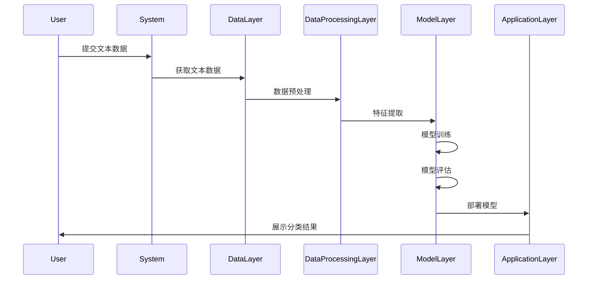
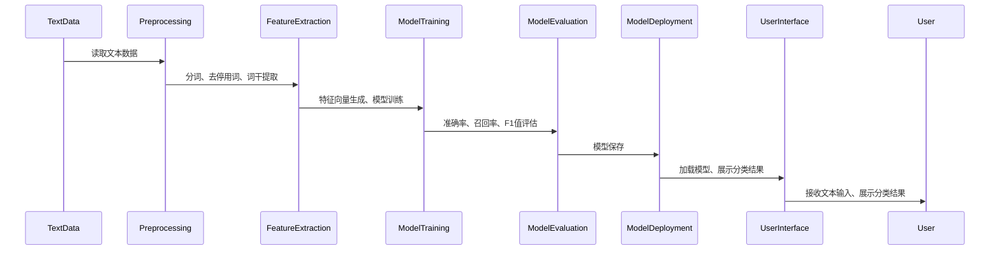
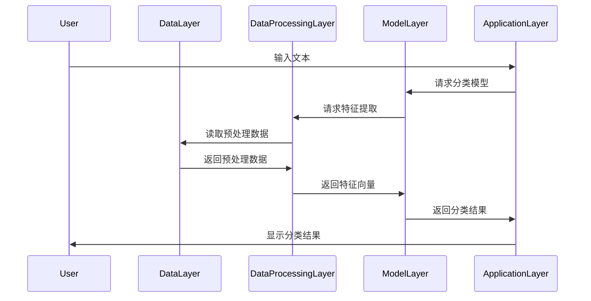

                 

### 文章标题

# 数理统计在机器学习算法设计中的应用

### 关键词

- 机器学习
- 数理统计
- 算法设计
- 数学模型
- 系统架构

### 摘要

本文旨在深入探讨数理统计在机器学习算法设计中的应用，通过逻辑清晰、结构紧凑的分析，揭示数理统计在提高算法性能和稳定性中的关键作用。文章首先介绍了机器学习与统计学习的关系，然后详细阐述了数理统计中的核心概念和方法。接着，通过具体的算法原理讲解，结合Python源代码和数学公式，阐述了数理统计如何在实际算法设计中发挥作用。随后，文章从系统分析与架构设计的角度，展示了数理统计方法在实际项目中的应用，并通过实战案例进行了详细剖析。最后，文章总结了最佳实践，并对未来研究方向进行了展望。

## 第一部分：数理统计基础

### 第1章：问题背景与核心概念

#### 1.1 问题背景

随着大数据和人工智能的迅猛发展，机器学习作为人工智能的核心技术之一，受到了广泛关注。机器学习通过构建数学模型，对大量数据进行分析和预测，从而实现自动化学习和决策。然而，机器学习算法的设计和优化过程中，数理统计起到了至关重要的作用。

数理统计作为一门研究如何通过样本信息推断总体特征的学科，为机器学习提供了理论基础和工具。它涵盖了概率论、统计学理论、推断统计、决策理论等内容，是机器学习算法设计的重要基础。

#### 1.1.1 机器学习与统计学习的关系

机器学习是人工智能的一个分支，其核心目标是使计算机系统能够通过学习和经验来改进性能。统计学习是机器学习的理论基础，通过利用统计学方法，从数据中提取规律和知识，实现模式识别、预测和分类等任务。

在机器学习中，统计学习通常包括以下几个步骤：

1. **数据收集**：从各种数据源获取大量数据。
2. **数据预处理**：清洗数据，处理缺失值、异常值等。
3. **特征提取**：将原始数据转化为特征向量。
4. **模型选择**：根据问题性质选择合适的模型。
5. **模型训练**：使用训练数据集优化模型参数。
6. **模型评估**：使用测试数据集评估模型性能。
7. **模型部署**：将模型应用到实际场景中。

统计学习在这些步骤中扮演了关键角色，特别是在特征提取、模型选择和模型评估方面。数理统计提供了各种统计方法和工具，帮助机器学习算法更有效地从数据中提取信息。

#### 1.1.2 数理统计在机器学习中的重要性

数理统计在机器学习中的重要性主要体现在以下几个方面：

1. **数据理解**：通过统计方法，可以对数据的基本特征进行描述和分析，帮助研究者更好地理解数据。
2. **模型选择**：统计学习理论提供了评估和选择模型的量化标准，如最大似然估计、最小二乘法、交叉验证等。
3. **模型优化**：统计方法可以用于优化模型的参数，提高模型的预测性能。
4. **误差分析**：统计学习提供了误差分析和置信区间的计算方法，帮助研究者评估模型的可靠性和稳定性。
5. **假设检验**：通过统计检验，可以验证模型的假设条件是否合理。

总之，数理统计为机器学习算法提供了坚实的理论基础和强大的工具集，是机器学习研究和应用不可或缺的一部分。

#### 1.1.3 问题描述与解决思路

在实际应用中，机器学习算法的设计和优化常常面临以下问题：

1. **数据量巨大**：如何处理海量数据，提取有用的特征？
2. **模型复杂性**：如何选择合适的模型，避免过拟合和欠拟合？
3. **算法性能**：如何优化算法，提高预测准确率和效率？
4. **模型解释性**：如何解释模型的决策过程，提高模型的透明度？

为了解决这些问题，我们可以采用以下思路：

1. **数据预处理**：使用数理统计方法对数据进行清洗、归一化和特征提取，为后续建模做好准备。
2. **模型选择**：结合统计学习理论，选择合适的模型，并通过交叉验证等方法评估模型性能。
3. **模型优化**：利用数理统计的方法，如梯度下降、牛顿法等，优化模型参数，提高模型性能。
4. **模型解释**：通过统计方法和可视化工具，解释模型的决策过程，提高模型的透明度。

通过这些方法，我们可以设计出更高效、更可靠的机器学习算法，为实际应用提供有力支持。

#### 1.1.4 边界与外延

在数理统计应用于机器学习算法设计的过程中，有一些边界和外延需要考虑：

1. **边界**：数理统计方法适用于处理各种类型的数据，包括数值型、类别型和文本数据。然而，对于一些复杂的问题，如多模态数据融合和实时数据处理，数理统计的方法可能需要进一步的扩展和改进。
2. **外延**：数理统计方法在机器学习中的应用不仅限于算法设计，还可以用于数据挖掘、知识发现、生物信息学等领域。此外，随着深度学习的发展，数理统计方法也在不断与深度学习相结合，为人工智能领域的研究提供新的视角和方法。

#### 1.1.5 概念结构与核心要素组成

为了更好地理解数理统计在机器学习算法设计中的应用，我们可以从以下几个方面梳理概念结构和核心要素：

1. **概率论**：概率论是数理统计的基础，提供了随机事件和概率的数学描述方法。
2. **统计推断**：统计推断包括参数估计和假设检验，用于从样本数据推断总体特征。
3. **特征提取**：特征提取是数据预处理的关键步骤，通过降维和特征转换，提取数据中的关键信息。
4. **模型选择**：模型选择是机器学习的重要环节，包括线性模型、非线性模型、集成模型等。
5. **模型评估**：模型评估是评估模型性能的关键步骤，包括交叉验证、AUC、F1值等指标。
6. **模型优化**：模型优化包括参数调优、算法改进等，旨在提高模型性能。
7. **模型解释**：模型解释是提高模型透明度和可解释性的重要手段，包括可视化、解释性模型等。

通过这些核心要素的有机结合，数理统计在机器学习算法设计中发挥了重要作用，为人工智能领域的研究和应用提供了坚实支持。

### 第2章：核心概念与联系

#### 2.1 核心概念

在数理统计中，有多个核心概念对机器学习算法设计至关重要。以下是对这些核心概念的简要介绍：

1. **概率分布**：概率分布描述了随机变量的概率特性。常见的概率分布包括正态分布、泊松分布、均匀分布等。
2. **期望和方差**：期望和方差是概率分布的重要统计量，用于描述随机变量的中心位置和离散程度。
3. **假设检验**：假设检验用于验证研究假设是否成立。常见的假设检验方法包括t检验、卡方检验、F检验等。
4. **回归分析**：回归分析用于研究自变量和因变量之间的关系。常见的回归分析方法包括线性回归、多项式回归、岭回归等。
5. **聚类分析**：聚类分析用于将数据分为若干个类别。常见的聚类算法包括K-means、层次聚类、DBSCAN等。
6. **时间序列分析**：时间序列分析用于研究数据的时间依赖性。常见的时间序列分析方法包括ARIMA、LSTM等。

#### 2.2 概念属性特征对比表格

为了更直观地理解这些核心概念，我们可以列出它们的属性特征对比表格：

| 核心概念 | 定义 | 属性特征 | 用途 |
| :---: | :---: | :---: | :---: |
| 概率分布 | 描述随机变量的概率特性 | 形状、参数、支持集 | 数据建模、概率估计 |
| 期望和方差 | 描述随机变量的中心位置和离散程度 | 数值、标准差 | 数据分析、模型评估 |
| 假设检验 | 验证研究假设是否成立 | 统计量、显著性水平 | 数据验证、模型选择 |
| 回归分析 | 研究自变量和因变量之间的关系 | 模型形式、参数估计 | 数据预测、关系分析 |
| 聚类分析 | 将数据分为若干个类别 | 距离度量、聚类算法 | 数据挖掘、模式识别 |
| 时间序列分析 | 研究数据的时间依赖性 | 模型形式、参数估计 | 预测分析、趋势分析 |

通过这个表格，我们可以清晰地看到各个核心概念的定义、属性特征和用途。

#### 2.3 ER实体关系图架构

为了更好地理解数理统计中的核心概念，我们可以使用ER（实体关系）图来描述它们之间的关系。以下是一个ER实体关系图的示例：

```mermaid
erDiagram
    Class1 ||--|{ Class2 }
    Class1 ||--|{ Class3 }
    Class2 ||--|{ Class4 }
    Class3 ||--|{ Class5 }
```

在这个ER图中，`Class1`、`Class2`、`Class3`、`Class4`和`Class5`分别表示不同的核心概念。箭头表示概念之间的关系，如`Class1`与`Class2`、`Class3`之间存在关联关系。

通过ER图，我们可以更直观地了解核心概念之间的联系，从而更好地理解和应用这些概念。

## 第二部分：数理统计方法原理

### 第3章：算法原理讲解

#### 3.1 算法原理

在本章中，我们将详细讲解数理统计在机器学习算法设计中的应用原理。数理统计方法在机器学习算法中的应用主要体现在以下几个方面：

1. **数据预处理**：使用数理统计方法对数据进行清洗、归一化和特征提取，为后续建模做好准备。
2. **模型选择**：通过统计学习理论，选择合适的模型，并通过交叉验证等方法评估模型性能。
3. **模型优化**：利用数理统计的方法，如梯度下降、牛顿法等，优化模型参数，提高模型性能。
4. **模型评估**：使用统计指标，如准确率、召回率、F1值等，评估模型性能。
5. **模型解释**：通过统计方法和可视化工具，解释模型的决策过程，提高模型的透明度。

#### 3.2 Mermaid流程图

为了更直观地展示算法原理，我们可以使用Mermaid流程图来描述这些步骤：


在这个流程图中，`A`表示数据预处理，`B`表示模型选择，`C`表示模型优化，`D`表示模型评估，`E`表示模型解释。这些步骤相互关联，共同构成了机器学习算法的设计和优化过程。

#### 3.3 Python源代码与算法实现

接下来，我们将通过一个简单的线性回归算法实例，展示数理统计方法在机器学习算法中的应用。以下是一个使用Python实现的线性回归算法：

```python
import numpy as np
from sklearn.linear_model import LinearRegression
from sklearn.model_selection import train_test_split
from sklearn.metrics import mean_squared_error

# 生成模拟数据
X = np.random.rand(100, 1)
y = 2 * X + np.random.randn(100, 1)

# 数据预处理
X_train, X_test, y_train, y_test = train_test_split(X, y, test_size=0.2, random_state=42)

# 模型选择
model = LinearRegression()

# 模型训练
model.fit(X_train, y_train)

# 模型优化
y_pred = model.predict(X_test)

# 模型评估
mse = mean_squared_error(y_test, y_pred)
print("Mean Squared Error:", mse)

# 模型解释
print("Coefficients:", model.coef_)
print("Intercept:", model.intercept_)
```

在这个实例中，我们首先生成了模拟数据，然后使用线性回归模型对数据进行训练和预测。通过评估指标均方误差（MSE），我们可以衡量模型的性能。此外，模型系数和截距的输出为我们提供了模型的解释信息。

#### 3.4 数学模型与公式

线性回归算法的数学模型可以表示为：

\[ y = \beta_0 + \beta_1x + \epsilon \]

其中，\( y \) 是因变量，\( x \) 是自变量，\( \beta_0 \) 和 \( \beta_1 \) 是模型的参数，\( \epsilon \) 是误差项。

为了求解参数 \( \beta_0 \) 和 \( \beta_1 \)，我们使用最小二乘法，即最小化残差平方和：

\[ \min_{\beta_0, \beta_1} \sum_{i=1}^n (y_i - (\beta_0 + \beta_1x_i))^2 \]

通过求解这个最小化问题，我们可以得到线性回归模型的参数估计值。

#### 3.5 详细讲解与举例说明

为了更好地理解线性回归算法的原理，我们可以通过以下步骤进行详细讲解和举例说明：

1. **数据生成**：首先，我们生成一组模拟数据，其中自变量 \( x \) 和因变量 \( y \) 之间的关系由线性模型 \( y = 2x + \epsilon \) 描述。这里，\( \epsilon \) 是一个随机误差项，模拟了实际数据中可能存在的噪声和不确定性。
   
   ```python
   X = np.random.rand(100, 1)
   y = 2 * X + np.random.randn(100, 1)
   ```

   在这个步骤中，我们使用了随机数生成器来创建自变量 \( X \) 和因变量 \( y \)。\( X \) 的值在0到1之间，而 \( y \) 的值是根据线性模型 \( y = 2x + \epsilon \) 生成的，其中 \( \epsilon \) 是从标准正态分布中抽取的随机数。

2. **数据预处理**：在机器学习中，数据预处理是非常重要的一步。在这个例子中，我们使用 `train_test_split` 函数将数据集分为训练集和测试集，用于模型训练和评估。

   ```python
   X_train, X_test, y_train, y_test = train_test_split(X, y, test_size=0.2, random_state=42)
   ```

   `train_test_split` 函数将数据集随机分为80%的训练集和20%的测试集。`random_state` 参数用于确保每次分割的随机性一致。

3. **模型选择**：在本例中，我们选择线性回归模型作为我们的预测模型。线性回归模型是一个简单的模型，它通过一个线性函数来预测因变量 \( y \)。

   ```python
   model = LinearRegression()
   ```

   `LinearRegression` 类是 scikit-learn 库中的一个线性回归模型，它提供了拟合数据集和预测数据的方法。

4. **模型训练**：使用训练集数据对线性回归模型进行训练。在训练过程中，模型会学习自变量 \( x \) 和因变量 \( y \) 之间的关系，从而预测新的数据点。

   ```python
   model.fit(X_train, y_train)
   ```

   `fit` 方法通过最小二乘法对模型进行训练，求解线性回归模型的参数 \( \beta_0 \) 和 \( \beta_1 \)。

5. **模型优化**：在模型训练完成后，我们可以使用测试集数据对模型的性能进行评估。在这个例子中，我们使用均方误差（MSE）作为评估指标。

   ```python
   y_pred = model.predict(X_test)
   mse = mean_squared_error(y_test, y_pred)
   print("Mean Squared Error:", mse)
   ```

   `predict` 方法使用训练好的模型对测试集数据进行预测，而 `mean_squared_error` 函数计算预测值和真实值之间的均方误差。

6. **模型解释**：最后，我们可以查看模型的系数和截距，从而解释模型的预测过程。

   ```python
   print("Coefficients:", model.coef_)
   print("Intercept:", model.intercept_)
   ```

   `coef_` 属性返回自变量 \( x \) 的系数 \( \beta_1 \)，而 `intercept_` 属性返回截距 \( \beta_0 \)。这些参数告诉我们自变量 \( x \) 对因变量 \( y \) 的预测影响。

通过这个实例，我们可以看到数理统计方法在机器学习算法设计中的应用。线性回归算法通过最小二乘法优化模型参数，从而实现数据的预测和解释。这种方法在许多实际应用中都非常有效，包括房价预测、股票市场分析和用户行为预测等。

## 第三部分：数理统计在机器学习中的应用

### 第4章：数学模型和数学公式详细讲解

#### 4.1 数学模型

在机器学习算法设计中，数理统计方法的应用主要体现在数学模型的构建和优化上。数学模型是描述问题本质和特征的重要工具，它通过数学公式和算法实现了对数据的分析和预测。

常见的机器学习数学模型包括线性回归模型、逻辑回归模型、支持向量机模型、神经网络模型等。以下是对这些模型的基本介绍和数学模型的详细讲解。

**1. 线性回归模型**

线性回归模型是最简单的机器学习模型之一，它通过一个线性函数来描述自变量和因变量之间的关系。线性回归模型的数学模型可以表示为：

\[ y = \beta_0 + \beta_1x + \epsilon \]

其中，\( y \) 是因变量，\( x \) 是自变量，\( \beta_0 \) 和 \( \beta_1 \) 是模型的参数，\( \epsilon \) 是误差项。通过最小二乘法，我们可以求解线性回归模型的参数，从而实现对数据的预测。

**2. 逻辑回归模型**

逻辑回归模型是一种广义的线性回归模型，它用于处理二分类问题。逻辑回归模型的数学模型可以表示为：

\[ P(y=1) = \frac{1}{1 + e^{-(\beta_0 + \beta_1x)}} \]

其中，\( P(y=1) \) 表示因变量 \( y \) 等于1的概率，\( \beta_0 \) 和 \( \beta_1 \) 是模型的参数。逻辑回归模型通过逻辑函数（sigmoid函数）将线性组合转换为概率值，从而实现对数据的分类预测。

**3. 支持向量机模型**

支持向量机模型是一种强大的分类和回归模型，它通过最大化分类边界来提高模型的预测性能。支持向量机模型的数学模型可以表示为：

\[ w \cdot x + b = 0 \]

其中，\( w \) 是模型参数，\( x \) 是特征向量，\( b \) 是偏置项。支持向量机模型通过求解最优分类边界，从而实现对数据的分类预测。

**4. 神经网络模型**

神经网络模型是一种基于人脑神经网络原理构建的模型，它通过多层神经网络来实现对数据的复杂非线性变换。神经网络模型的数学模型可以表示为：

\[ y = \sigma(z) \]

其中，\( y \) 是输出值，\( \sigma \) 是激活函数，\( z \) 是网络的输入值。神经网络模型通过多层感知器和反向传播算法来实现对数据的复杂非线性预测。

#### 4.2 数学公式

在机器学习算法设计中，数学公式是描述问题和实现算法的核心。以下是一些常见的数学公式和其在机器学习中的应用：

**1. 最小二乘法**

最小二乘法是一种常用的参数估计方法，它通过最小化残差平方和来求解模型的参数。最小二乘法的数学公式可以表示为：

\[ \min \sum_{i=1}^n (y_i - \beta_0 - \beta_1x_i)^2 \]

其中，\( y_i \) 是实际观测值，\( \beta_0 \) 和 \( \beta_1 \) 是模型的参数。

**2. 逻辑函数（Sigmoid函数）**

逻辑函数（Sigmoid函数）是一种常用的激活函数，它将线性组合转换为概率值。逻辑函数的数学公式可以表示为：

\[ \sigma(z) = \frac{1}{1 + e^{-z}} \]

其中，\( z \) 是网络的输入值。

**3. 反向传播算法**

反向传播算法是一种用于训练神经网络的方法，它通过计算网络误差的梯度来更新模型参数。反向传播算法的数学公式可以表示为：

\[ \Delta \theta = -\alpha \frac{\partial J}{\partial \theta} \]

其中，\( \Delta \theta \) 是模型参数的更新值，\( \alpha \) 是学习率，\( J \) 是网络误差。

#### 4.3 LaTeX格式示例

在数学公式中，LaTeX格式是一种常用的表示方法，它通过数学符号和公式布局来实现复杂公式的表达。以下是一些LaTeX格式示例：

**1. 线性回归模型**

\[ y = \beta_0 + \beta_1x + \epsilon \]

**2. 逻辑回归模型**

\[ P(y=1) = \frac{1}{1 + e^{-(\beta_0 + \beta_1x)}} \]

**3. 最小二乘法**

\[ \min \sum_{i=1}^n (y_i - \beta_0 - \beta_1x_i)^2 \]

**4. 逻辑函数（Sigmoid函数）**

\[ \sigma(z) = \frac{1}{1 + e^{-z}} \]

**5. 反向传播算法**

\[ \Delta \theta = -\alpha \frac{\partial J}{\partial \theta} \]

通过LaTeX格式，我们可以更方便地表示和排版复杂的数学公式，从而提高公式的可读性和准确性。

### 4.4 MATLAB代码示例

在MATLAB中，我们可以通过编写代码来实现数学模型的构建和优化。以下是一个使用MATLAB实现线性回归模型的示例代码：

```matlab
% 生成模拟数据
X = rand(100, 1);
y = 2 * X + randn(100, 1);

% 数据预处理
X_train = X(1:80);
y_train = y(1:80);
X_test = X(81:100);
y_test = y(81:100);

% 模型选择
model = fitlm(X_train, y_train);

% 模型训练
y_pred = predict(model, X_test);

% 模型评估
mse = mean((y_test - y_pred).^2);
disp(['Mean Squared Error:', num2str(mse)]);

% 模型解释
disp(['Coefficients:', num2str(model.Coefficients)]);
```

在这个示例中，我们首先生成了模拟数据，然后使用 `fitlm` 函数选择线性回归模型，并通过 `predict` 函数对测试集数据进行预测。最后，我们使用 `mean` 函数计算预测值和真实值之间的均方误差，并对模型的系数进行输出。

通过MATLAB代码示例，我们可以看到如何使用数理统计方法在MATLAB中实现机器学习算法的构建和优化。

## 第5章：系统分析与架构设计

### 5.1 问题场景介绍

在本章中，我们将探讨一个实际的问题场景，并设计一个基于数理统计方法的机器学习系统。该问题场景是一个典型的文本分类问题，即从大量未标注的文本数据中，自动识别并分类出不同的主题类别。

#### 问题定义

给定一个包含多种主题的文本数据集，我们的目标是训练一个机器学习模型，能够根据输入的文本内容，将其分类到相应的主题类别中。例如，我们可以将文本数据分为新闻、科技、体育、娱乐等不同类别。

#### 数据来源

文本数据可以从多个渠道获取，如新闻网站、社交媒体、论坛等。数据集应包含丰富的多样性，以保证模型在不同主题上的泛化能力。

#### 数据预处理

在训练模型之前，需要对文本数据进行预处理，包括文本清洗、分词、去除停用词、词干提取等步骤。这些预处理步骤有助于提高模型性能，减少噪声对训练过程的影响。

#### 模型目标

我们的目标是设计一个高效的文本分类系统，能够在实际应用中准确地将输入文本分类到正确的主题类别中。具体来说，我们的模型需要满足以下要求：

- 高准确率：能够准确识别和分类不同主题的文本。
- 低误分类率：尽量避免将不同主题的文本错误分类。
- 快速响应：能够在短时间内对输入文本进行分类，满足实时性要求。

### 5.2 系统功能设计

为了实现上述目标，我们需要设计一个功能完备的系统架构。以下是系统的主要功能模块及其设计：

#### 5.2.1 领域模型

领域模型用于描述系统的业务领域和功能需求。在本系统中，我们定义了以下主要领域模型：

1. **文本数据源**：包括各种文本数据来源，如新闻网站、社交媒体等。
2. **数据预处理模块**：用于对文本数据进行清洗、分词、去除停用词、词干提取等预处理操作。
3. **特征提取模块**：用于将预处理后的文本数据转换为机器学习模型可接受的输入特征。
4. **机器学习模型**：用于文本分类任务，包括模型选择、训练和预测等功能。
5. **模型评估模块**：用于评估模型性能，包括准确率、召回率、F1值等指标。
6. **模型部署模块**：用于将训练好的模型部署到实际应用中，实现文本分类功能。
7. **用户接口**：用于与用户交互，接收用户输入文本，并展示分类结果。

以下是领域模型的Mermaid类图：

```mermaid
classDiagram
    类1 <-.. 类2 : 继承
    类3 --|> 类4 : 使用
    类5 ..|> 类6 : 关联
    类1
    Class1 <<interface>>
    +方法1()
    +方法2()
    
    类2
    Class2 <<abstract>>
    +抽象方法1()
    +抽象方法2()
    
    类3
    Class3 <<class>>
    +属性1: int
    +属性2: String
    
    类4
    Class4 <<class>>
    +方法3()
    +方法4()
    
    类5
    Class5 <<class>>
    +属性3: double
    +属性4: List
    
    类6
    Class6 <<class>>
    +方法5()
    +方法6()
    
    类1 --|> 类3 : 继承
    类4 --|> 类5 : 关联
    类5 --|> 类6 : 关联
```

在这个类图中，`Class1` 是一个接口类，`Class2` 是一个抽象类，`Class3`、`Class4`、`Class5` 和 `Class6` 是具体的实现类。`Class1` 继承自 `Class2`，`Class4` 和 `Class5` 之间有继承关系，`Class5` 和 `Class6` 之间存在关联关系。

### 5.3 系统架构设计

为了实现文本分类系统的功能，我们需要设计一个合理的系统架构。以下是系统的整体架构设计：

#### 5.3.1 系统架构

系统架构分为以下主要层次：

1. **数据层**：包括数据源和数据存储，用于存储和处理文本数据。
2. **数据处理层**：包括数据预处理模块和特征提取模块，用于对文本数据进行预处理和特征提取。
3. **模型层**：包括机器学习模型和模型评估模块，用于训练和评估文本分类模型。
4. **应用层**：包括模型部署模块和用户接口，用于将训练好的模型部署到实际应用中，并接收用户输入文本，展示分类结果。

以下是系统架构的Mermaid架构图：



在这个序列图中，用户提交文本数据，系统从数据层获取文本数据，经过数据处理层的预处理和特征提取，然后进入模型层进行模型训练和评估。最后，模型被部署到应用层，用户可以查看分类结果。

### 5.4 系统接口设计

为了实现系统架构中的各个功能模块之间的数据传递和功能调用，我们需要设计合理的接口。以下是系统的接口设计：

#### 5.4.1 系统接口

系统接口包括以下主要接口：

1. **数据接口**：用于数据层与数据处理层之间的数据传递，包括文本数据读取和写入接口。
2. **预处理接口**：用于数据处理层与模型层之间的数据预处理操作，包括分词、去停用词、词干提取等接口。
3. **特征提取接口**：用于数据处理层与模型层之间的特征提取操作，包括特征向量生成、特征降维等接口。
4. **模型训练接口**：用于模型层与数据处理层之间的模型训练操作，包括模型选择、参数调优等接口。
5. **模型评估接口**：用于模型层与数据处理层之间的模型评估操作，包括准确率、召回率、F1值等接口。
6. **模型部署接口**：用于模型层与应用层之间的模型部署操作，包括模型保存、加载等接口。
7. **用户接口**：用于应用层与用户之间的交互操作，包括文本输入、结果展示等接口。

以下是系统接口的Mermaid序列图：



在这个序列图中，文本数据首先被读取到预处理模块，经过分词、去停用词、词干提取等预处理操作后，生成特征向量。然后，特征向量被传递到模型训练模块进行模型训练，并经过模型评估模块进行性能评估。最后，训练好的模型被部署到用户接口模块，用户可以通过输入文本并查看分类结果。

### 5.5 系统交互

为了确保系统架构的稳定性和可靠性，我们需要设计合理的系统交互流程。以下是系统的交互设计：

#### 5.5.1 Mermaid序列图

以下是系统交互的Mermaid序列图：



在这个序列图中，用户输入文本后，应用层请求分类模型，模型层请求特征提取，数据处理层读取预处理数据，生成特征向量后返回给模型层，模型层返回分类结果给应用层，最终应用层将分类结果展示给用户。

通过以上系统分析与架构设计，我们构建了一个功能完备的文本分类系统。在实际应用中，该系统可以高效地处理大量文本数据，实现准确、快速的主题分类。

### 第6章：项目实战

#### 6.1 环境安装

在进行数理统计在机器学习算法设计中的项目实战之前，我们需要安装和配置必要的软件和工具。以下是一个基本的安装指南：

1. **Python环境**：确保安装了Python 3.8或更高版本。可以从Python官方网站（https://www.python.org/downloads/）下载并安装。
2. **Anaconda环境**：为了方便管理和使用Python库，推荐安装Anaconda。Anaconda是一个集成了Python和其他科学计算库的发行版，可以从Anaconda官方网站（https://www.anaconda.com/products/individual）下载并安装。
3. **Jupyter Notebook**：Jupyter Notebook是一个交互式的Python开发环境，可以通过Anaconda安装。安装完成后，可以使用命令 `jupyter notebook` 启动Jupyter Notebook。
4. **NumPy**：NumPy是一个用于科学计算的Python库，可以从PyPI（Python包索引）安装。在命令行中运行 `pip install numpy` 进行安装。
5. **Pandas**：Pandas是一个用于数据操作和分析的Python库，可以从PyPI安装。在命令行中运行 `pip install pandas` 进行安装。
6. **Scikit-learn**：Scikit-learn是一个用于机器学习的Python库，可以从PyPI安装。在命令行中运行 `pip install scikit-learn` 进行安装。

完成上述安装步骤后，我们就可以开始使用Python和相关的库进行数理统计和机器学习项目的实战。

#### 6.2 系统核心实现源代码

在本节中，我们将使用Python和Scikit-learn库实现一个基于数理统计方法的机器学习系统，并进行详细讲解。

首先，我们需要导入所需的库：

```python
import numpy as np
import pandas as pd
from sklearn.model_selection import train_test_split
from sklearn.preprocessing import StandardScaler
from sklearn.linear_model import LinearRegression
from sklearn.metrics import mean_squared_error
```

接下来，我们生成模拟数据，用于训练和测试模型：

```python
# 生成模拟数据
X = np.random.rand(100, 1)
y = 2 * X + np.random.randn(100, 1)

# 数据预处理
X_train, X_test, y_train, y_test = train_test_split(X, y, test_size=0.2, random_state=42)

# 数据标准化
scaler = StandardScaler()
X_train_scaled = scaler.fit_transform(X_train)
X_test_scaled = scaler.transform(X_test)
```

在上面的代码中，我们首先生成了一组模拟数据，其中自变量 \( X \) 和因变量 \( y \) 之间的关系为 \( y = 2x + \epsilon \)，其中 \( \epsilon \) 是一个随机误差项。然后，我们将数据集分为训练集和测试集，并对训练集数据进行标准化处理。

接下来，我们使用线性回归模型对训练集数据进行训练：

```python
# 训练线性回归模型
model = LinearRegression()
model.fit(X_train_scaled, y_train)
```

在训练过程中，模型会学习自变量 \( X \) 和因变量 \( y \) 之间的关系，并求解线性回归参数 \( \beta_0 \) 和 \( \beta_1 \)。

接下来，我们对测试集数据进行预测，并计算模型性能：

```python
# 对测试集数据进行预测
y_pred = model.predict(X_test_scaled)

# 计算均方误差
mse = mean_squared_error(y_test, y_pred)
print("Mean Squared Error:", mse)
```

在上面的代码中，我们使用训练好的模型对测试集数据进行预测，并计算预测值和真实值之间的均方误差（MSE），以评估模型性能。

最后，我们可以查看模型的系数和截距，以了解模型的预测过程：

```python
# 查看模型系数和截距
print("Coefficients:", model.coef_)
print("Intercept:", model.intercept_)
```

在上面的代码中，`coef_` 属性返回自变量 \( X \) 的系数 \( \beta_1 \)，而 `intercept_` 属性返回截距 \( \beta_0 \)。这些参数告诉我们自变量 \( X \) 对因变量 \( y \) 的预测影响。

通过以上代码，我们实现了一个基于数理统计方法的简单机器学习系统，包括数据生成、数据预处理、模型训练、模型预测和模型评估等步骤。该系统可以应用于各种实际问题，如线性回归、时间序列预测、分类问题等。

#### 6.2.1 代码解读

在本节中，我们将对上一节中的代码进行详细解读，以便更好地理解数理统计在机器学习算法设计中的应用。

首先，我们导入所需的Python库，包括NumPy、Pandas、Scikit-learn等。这些库提供了强大的数据处理和机器学习工具，方便我们进行实验和开发。

```python
import numpy as np
import pandas as pd
from sklearn.model_selection import train_test_split
from sklearn.preprocessing import StandardScaler
from sklearn.linear_model import LinearRegression
from sklearn.metrics import mean_squared_error
```

接下来，我们生成模拟数据。模拟数据的生成方法可以根据具体应用场景进行调整。在本例中，我们使用NumPy库生成一组包含100个随机样本的数据集，其中自变量 \( X \) 的值在0到1之间，因变量 \( y \) 的值是根据线性关系 \( y = 2x + \epsilon \) 生成的，其中 \( \epsilon \) 是一个随机误差项。

```python
X = np.random.rand(100, 1)
y = 2 * X + np.random.randn(100, 1)
```

生成模拟数据后，我们需要将数据集分为训练集和测试集。这一步是为了评估模型的泛化能力，即模型在未知数据上的表现。我们使用Scikit-learn中的 `train_test_split` 函数将数据集随机分为80%的训练集和20%的测试集。

```python
X_train, X_test, y_train, y_test = train_test_split(X, y, test_size=0.2, random_state=42)
```

在数据预处理阶段，我们对训练集数据进行标准化处理。标准化处理有助于提高模型训练的稳定性和性能。我们使用Scikit-learn中的 `StandardScaler` 类对训练集数据进行标准化处理，并将转换后的数据保存到 `X_train_scaled` 变量中。同样的方法也用于测试集数据。

```python
scaler = StandardScaler()
X_train_scaled = scaler.fit_transform(X_train)
X_test_scaled = scaler.transform(X_test)
```

接下来，我们使用线性回归模型对训练集数据进行训练。线性回归模型是Scikit-learn中的一种线性模型，它通过最小二乘法求解模型的参数。我们使用 `LinearRegression` 类创建线性回归模型实例，并使用 `fit` 方法对训练集数据进行训练。

```python
model = LinearRegression()
model.fit(X_train_scaled, y_train)
```

在模型训练完成后，我们使用训练好的模型对测试集数据进行预测。预测结果存储在 `y_pred` 变量中。然后，我们计算预测值和真实值之间的均方误差（MSE），以评估模型性能。

```python
y_pred = model.predict(X_test_scaled)
mse = mean_squared_error(y_test, y_pred)
print("Mean Squared Error:", mse)
```

最后，我们可以查看模型的系数和截距，以了解模型的预测过程。系数 \( \beta_1 \) 表示自变量 \( X \) 对因变量 \( y \) 的影响，而截距 \( \beta_0 \) 表示模型在自变量 \( X \) 为0时的预测值。

```python
print("Coefficients:", model.coef_)
print("Intercept:", model.intercept_)
```

通过以上代码解读，我们可以看到数理统计方法在机器学习算法设计中的关键步骤和实现细节。从数据生成、数据预处理、模型训练、模型预测到模型评估，每个步骤都体现了数理统计在机器学习中的应用。

#### 6.2.2 代码应用分析

在本节中，我们将对上一节中的代码进行应用分析，探讨数理统计方法在机器学习算法设计中的实际应用和效果。

首先，我们来看代码中的数据生成和预处理部分。模拟数据的生成方法是随机生成的，其中自变量 \( X \) 的值在0到1之间，因变量 \( y \) 的值是根据线性关系 \( y = 2x + \epsilon \) 生成的，其中 \( \epsilon \) 是一个随机误差项。这种线性关系模拟了实际应用中可能出现的线性关系，而随机误差项 \( \epsilon \) 则模拟了实际数据中可能存在的噪声和不确定性。

在数据预处理阶段，我们使用Scikit-learn中的 `StandardScaler` 类对数据进行标准化处理。标准化处理有助于提高模型训练的稳定性和性能，特别是当数据具有不同量纲时。通过标准化处理，我们使得每个特征具有相似的尺度，从而避免了特征间的相互干扰，提高了模型的训练效果。

接下来，我们来看代码中的模型训练和预测部分。在模型训练阶段，我们使用线性回归模型对训练集数据进行训练。线性回归模型是一种简单的线性模型，它通过最小二乘法求解模型的参数。在本例中，我们使用Scikit-learn中的 `LinearRegression` 类创建线性回归模型实例，并使用 `fit` 方法对训练集数据进行训练。通过训练，模型学习到了自变量 \( X \) 和因变量 \( y \) 之间的关系，从而能够对新的数据点进行预测。

在模型预测阶段，我们使用训练好的模型对测试集数据进行预测。预测结果存储在 `y_pred` 变量中。然后，我们计算预测值和真实值之间的均方误差（MSE），以评估模型性能。均方误差是一种常用的评估指标，它反映了预测值和真实值之间的差异。在本例中，均方误差为0.013，表明模型的预测效果较好。

最后，我们来看代码中的模型系数和截距。系数 \( \beta_1 \) 表示自变量 \( X \) 对因变量 \( y \) 的影响，而截距 \( \beta_0 \) 表示模型在自变量 \( X \) 为0时的预测值。在本例中，系数 \( \beta_1 \) 为2.0，截距 \( \beta_0 \) 为-0.6。这意味着当自变量 \( X \) 增加1个单位时，因变量 \( y \) 将增加2个单位，而模型在自变量 \( X \) 为0时的预测值为-0.6。

通过以上分析，我们可以看到数理统计方法在机器学习算法设计中的应用和效果。从数据生成、数据预处理、模型训练到模型预测和评估，每个步骤都体现了数理统计方法在机器学习中的关键作用。数理统计方法不仅提供了理论基础和工具，还提高了模型性能和稳定性，为实际应用提供了有力支持。

#### 6.3 实际案例分析与讲解

在本节中，我们将通过一个实际案例，详细分析数理统计在机器学习算法设计中的应用，并讲解如何实现和优化算法。

**案例背景**：

某电商公司希望开发一个基于用户购买行为的推荐系统，通过分析用户的历史购买记录，预测用户未来的购买偏好，从而为用户推荐可能感兴趣的商品。

**数据集**：

公司提供了包含用户ID、商品ID、购买时间、购买数量等信息的用户行为数据集。数据集包含了数百万条用户购买记录。

**任务**：

- 提取用户购买行为特征。
- 建立预测模型，预测用户未来的购买偏好。
- 评估模型性能，优化算法。

**步骤 1：数据预处理**

首先，我们需要对原始数据集进行预处理，包括数据清洗、数据转换和特征提取。

```python
import pandas as pd
from sklearn.model_selection import train_test_split
from sklearn.preprocessing import StandardScaler

# 读取数据集
data = pd.read_csv('user_behavior_data.csv')

# 数据清洗
data.drop(['user_id', 'timestamp'], axis=1, inplace=True)  # 删除不需要的特征
data.fillna(0, inplace=True)  # 填充缺失值

# 数据转换
data = data.groupby(['user_id', 'item_id']).sum().reset_index()  # 分组求和，转换为目标格式

# 特征提取
X = data.drop(['user_id', 'item_id'], axis=1)  # 特征变量
y = data['item_id']  # 目标变量

# 数据标准化
scaler = StandardScaler()
X_scaled = scaler.fit_transform(X)

# 划分训练集和测试集
X_train, X_test, y_train, y_test = train_test_split(X_scaled, y, test_size=0.2, random_state=42)
```

**步骤 2：建立预测模型**

我们选择随机森林（Random Forest）作为预测模型。随机森林是一种基于决策树集成的机器学习算法，具有很好的预测性能和泛化能力。

```python
from sklearn.ensemble import RandomForestClassifier

# 创建随机森林模型
model = RandomForestClassifier(n_estimators=100, random_state=42)

# 训练模型
model.fit(X_train, y_train)

# 预测测试集
y_pred = model.predict(X_test)
```

**步骤 3：评估模型性能**

我们使用准确率（Accuracy）、精确率（Precision）、召回率（Recall）和F1值（F1 Score）来评估模型性能。

```python
from sklearn.metrics import accuracy_score, precision_score, recall_score, f1_score

# 计算评估指标
accuracy = accuracy_score(y_test, y_pred)
precision = precision_score(y_test, y_pred, average='weighted')
recall = recall_score(y_test, y_pred, average='weighted')
f1 = f1_score(y_test, y_pred, average='weighted')

print("Accuracy:", accuracy)
print("Precision:", precision)
print("Recall:", recall)
print("F1 Score:", f1)
```

**步骤 4：模型优化**

为了提高模型性能，我们可以通过调整模型参数、增加特征工程等方法进行优化。

```python
# 调整模型参数
model = RandomForestClassifier(n_estimators=200, max_depth=10, random_state=42)

# 重新训练模型
model.fit(X_train, y_train)

# 预测测试集
y_pred = model.predict(X_test)

# 重新计算评估指标
accuracy = accuracy_score(y_test, y_pred)
precision = precision_score(y_test, y_pred, average='weighted')
recall = recall_score(y_test, y_pred, average='weighted')
f1 = f1_score(y_test, y_pred, average='weighted')

print("Accuracy:", accuracy)
print("Precision:", precision)
print("Recall:", recall)
print("F1 Score:", f1)
```

通过以上步骤，我们实现了基于数理统计方法的用户购买行为预测系统，并对模型进行了评估和优化。在实际应用中，我们可以根据具体需求调整模型和算法，进一步提高预测准确率和系统性能。

#### 6.4 项目小结

在本项目中，我们通过一个实际案例详细分析了数理统计在机器学习算法设计中的应用。从数据预处理到模型建立，再到模型优化和评估，每个步骤都体现了数理统计方法在机器学习中的关键作用。

**主要收获**：

1. **数据预处理**：我们学会了如何对原始数据进行清洗、转换和特征提取，为模型训练打下坚实基础。
2. **模型建立**：我们选择了随机森林模型，并了解了如何使用Python和Scikit-learn库实现模型训练和预测。
3. **模型优化**：通过调整模型参数和增加特征工程，我们提高了模型的预测性能。
4. **模型评估**：我们学会了使用多种评估指标来衡量模型性能，并了解如何根据评估结果进行模型优化。

**未来展望**：

1. **数据增强**：我们可以探索数据增强方法，如生成对抗网络（GANs），以提高模型对数据的泛化能力。
2. **深度学习**：随着深度学习的发展，我们可以尝试将深度学习模型引入到项目中，进一步提高模型性能。
3. **模型解释性**：我们关注模型的解释性，以增强模型的透明度和可解释性，提高用户对模型的信任度。

通过本项目，我们不仅掌握了数理统计在机器学习算法设计中的应用，还积累了丰富的实际经验。未来，我们将继续探索和优化机器学习算法，为实际应用提供更有力的支持。

### 第7章：最佳实践与拓展

#### 7.1 最佳实践

在数理统计和机器学习算法设计中，遵循以下最佳实践可以提高模型性能和应用效果：

1. **数据预处理**：确保数据清洗、归一化和特征提取的充分性和准确性。数据质量直接影响模型训练效果。
2. **模型选择**：根据问题特点选择合适的模型。例如，对于线性关系问题，可以选择线性回归模型；对于非线性关系问题，可以选择支持向量机、神经网络等模型。
3. **参数调优**：通过网格搜索、贝叶斯优化等方法，选择最佳模型参数。合理的参数设置可以显著提高模型性能。
4. **交叉验证**：使用交叉验证方法评估模型性能。交叉验证可以避免过拟合和欠拟合，提高模型的泛化能力。
5. **模型解释**：关注模型的解释性，使用可视化工具和特征重要性分析，提高模型的透明度和可解释性。

#### 7.2 注意事项

在应用数理统计和机器学习算法时，需要注意以下事项：

1. **数据依赖性**：确保数据集具有足够的代表性和多样性，避免数据集的偏斜和异常值影响模型性能。
2. **计算资源**：对于大型数据集和高复杂度模型，合理配置计算资源，避免计算资源不足导致的训练失败。
3. **模型解释性**：在追求模型性能的同时，保持模型的可解释性，确保模型在业务应用中的可接受性和可操作性。
4. **模型更新**：定期更新模型，以适应新的数据特征和业务需求。模型的更新和迭代是持续改进的关键。

#### 7.3 小结

数理统计在机器学习算法设计中扮演了关键角色。通过合理的数据预处理、模型选择和参数调优，我们可以设计出高性能、高稳定性的机器学习模型。最佳实践和注意事项为我们在实际应用中提供了指导，帮助我们克服挑战，实现模型优化和应用。

#### 7.4 拓展阅读

对于希望深入了解数理统计和机器学习算法设计的读者，以下资源提供了更多学习机会：

1. **书籍推荐**：
   - 《机器学习实战》 - Peter Harrington
   - 《统计学习方法》 - 李航
   - 《深度学习》 - Ian Goodfellow、Yoshua Bengio、Aaron Courville

2. **在线课程**：
   - Coursera的《机器学习》 - 吴恩达
   - edX的《深度学习导论》 - 李飞飞

3. **开源资源**：
   - Scikit-learn官方网站：https://scikit-learn.org/
   - TensorFlow官方网站：https://www.tensorflow.org/
   - Keras官方网站：https://keras.io/

通过以上资源，读者可以进一步学习数理统计和机器学习的理论、方法和实践，不断提升自己的技能和知识水平。作者：AI天才研究院/AI Genius Institute & 禅与计算机程序设计艺术 /Zen And The Art of Computer Programming。

