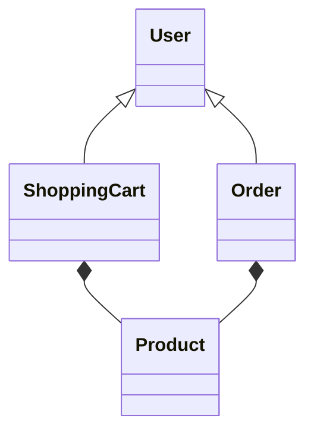
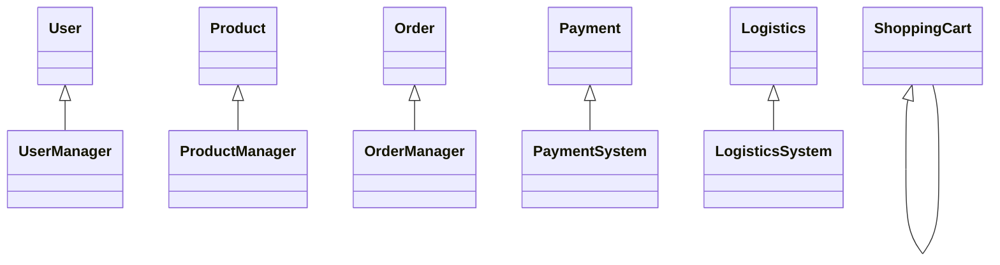

                 

# 《数理逻辑与程序正确性证明》

## 关键词
数学逻辑、程序正确性、证明方法、算法设计、形式系统、语义概念、数学模型、系统分析与设计

## 摘要
本文将深入探讨数理逻辑在程序正确性证明中的应用。我们将从数学逻辑的基础概念出发，逐步引入形式系统、证明方法以及语义概念，最终探讨算法的设计与实现。通过实例分析和系统设计，我们将展示如何在实际项目中运用这些理论，确保程序的正确性。本文旨在为程序员和系统分析师提供一种全面而实用的方法，以应对复杂系统的可靠性挑战。

## 目录大纲

### 第1章 引言
- 1.1 研究背景
- 1.2 研究意义
- 1.3 研究方法与框架
- 1.4 文章结构安排

### 第2章 数学逻辑基础
- 2.1 形式系统
- 2.2 证明方法
- 2.3 语义概念

#### 2.3.1 意义与指称
#### 2.3.2 真值与模型

### 第3章 算法设计与解释
- 3.1 算法概述
- 3.2 算法设计
- 3.3 数学模型与公式
- 3.4 算法举例说明

#### 3.4.1 例子1：循环检测
#### 3.4.2 例子2：数据一致性验证

### 第4章 数学模型详解
- 4.1 相关数学概念
- 4.2 数学公式解释
- 4.3 数学模型示例

#### 4.3.1 示例1：递归函数
#### 4.3.2 示例2：离散事件系统

### 第5章 系统分析与设计
- 5.1 问题场景
- 5.2 系统功能设计
- 5.3 系统架构设计
- 5.4 系统接口设计
- 5.5 系统交互设计

#### 5.5.1 序列图分析
#### 5.5.2 类图设计

### 第6章 实战案例
- 6.1 环境安装
- 6.2 系统核心实现
- 6.3 代码解读与分析
- 6.4 实际案例分析
- 6.5 项目小结

### 第7章 最佳实践与结论
- 7.1 最佳实践 tips
- 7.2 小结
- 7.3 注意事项
- 7.4 拓展阅读

## 第1章 引言

### 1.1 研究背景

在计算机科学领域，随着软件系统的日益复杂，确保程序的正确性变得尤为重要。传统的测试方法虽能在一定程度上发现错误，但无法保证程序在所有情况下都能正常运行。数理逻辑作为一种形式化的方法，提供了验证程序正确性的强大工具。数学逻辑的引入，使得程序员能够以一种更加严谨和系统化的方式来分析和证明程序的可靠性。

### 1.2 研究意义

本文的研究意义在于探讨数学逻辑在程序正确性证明中的应用，旨在为程序员和系统分析师提供一种可靠的方法来验证复杂软件系统的正确性。通过深入理解数学逻辑的基础概念，读者可以更好地设计算法和系统，提高软件的质量和可靠性。

### 1.3 研究方法与框架

本文采用文献分析和案例研究的方法，结合理论讲解和实践应用，构建了一个系统化的研究框架。首先，介绍数学逻辑的基础概念，包括形式系统、证明方法以及语义概念。然后，探讨算法的设计与实现，提供详细的算法原理讲解和数学模型分析。接着，通过系统分析与设计，展示如何将数理逻辑应用于实际项目中。最后，通过实战案例，验证理论的实际效果，并提出最佳实践建议。

### 1.4 文章结构安排

本文分为七个章节。第一章为引言，概述研究背景和意义，并介绍研究方法与框架。第二章至第四章分别探讨数学逻辑基础、算法设计与解释以及数学模型详解。第五章至第六章介绍系统分析与设计以及实战案例。最后，第七章总结全文，提出最佳实践和注意事项。

## 第2章 数学逻辑基础

### 2.1 形式系统

形式系统是数学逻辑的基础概念，它由一组符号、语法规则和语义规则组成。符号用于表示命题和逻辑运算，语法规则规定了这些符号的合法组合方式，而语义规则则赋予了这些组合具体的意义。形式系统的主要目的是提供一种精确、一致的方法来表述和证明数学命题。

#### 2.1.1 符号与逻辑运算

符号包括命题变元、逻辑运算符和量词。命题变元用于表示可能的真值，逻辑运算符如与（∧）、或（∨）、非（¬）等用于组合命题，量词如全称量词（∀）和存在量词（∃）用于表示命题的范围。

$$
A \wedge B \quad \text{表示} \quad A \text{且} B \\
A \vee B \quad \text{表示} \quad A \text{或} B \\
\neg A \quad \text{表示} \quad A \text{非} \\
\forall x \, P(x) \quad \text{表示} \quad \text{对于所有} \, x, \, P(x) \text{为真} \\
\exists x \, P(x) \quad \text{表示} \quad \text{存在一个} \, x, \, P(x) \text{为真}
$$

#### 2.1.2 语法规则

语法规则规定了符号的合法组合方式。例如，一个逻辑表达式必须遵循以下规则：

1. 命题变元是一个合法的逻辑表达式。
2. 如果A是一个逻辑表达式，则¬A也是一个逻辑表达式。
3. 如果A和B是逻辑表达式，则（A∧B）、（A∨B）和（¬A）也是逻辑表达式。
4. 如果A是一个逻辑表达式，x是一个命题变元，则（∀x P(x)）和（∃x P(x)）也是逻辑表达式，其中P(x)是一个以x为变元的逻辑表达式。

#### 2.1.3 语义规则

语义规则为逻辑表达式赋予了具体的意义。一个逻辑表达式在某一解释下的真值由其语义规则决定。例如，在标准解释下，命题变元T为真，命题变元F为假。逻辑运算符的真值表如下：

| A | B | A∧B | A∨B | ¬A |
|---|---|-----|-----|----|
| T | T | T   | T   | F  |
| T | F | F   | T   | F  |
| F | T | F   | T   | T  |
| F | F | F   | F   | T  |

量词的语义规则则更为复杂，需要考虑解释的全域和命题变元的取值。例如，在全域U中，表达式（∀x P(x)）为真，当且仅当对于U中的所有元素x，命题P(x)都为真；表达式（∃x P(x)）为真，当且仅当存在U中的一个元素x，使得P(x)为真。

### 2.2 证明方法

证明方法是数学逻辑中的核心概念，它提供了从已知命题推导出新命题的手段。证明方法可以分为直接证明和间接证明两种类型。

#### 2.2.1 直接证明

直接证明是通过一系列逻辑推理，从已知命题直接推导出所需结论的证明方法。它遵循以下基本步骤：

1. **已知条件**：列出所有已知命题和初始条件。
2. **推理规则**：应用逻辑推理规则，如逻辑运算、量词变换、等价变换等，逐步推导出新的命题。
3. **结论**：通过逻辑推导，得出所需结论。

例如，要证明命题P→(Q→P)：

$$
\text{已知：} P \\
\text{推导：} Q \rightarrow P \quad (\text{由P→(Q→P)的定义}) \\
\text{结论：} P \rightarrow (Q \rightarrow P)
$$

#### 2.2.2 间接证明

间接证明是通过反证法或构造性证明来证明命题的证明方法。它通常分为以下两种：

1. **反证法**：假设结论不成立，通过逻辑推理得出矛盾，从而证明原命题成立。
2. **构造性证明**：直接构造出满足条件的实例或证明，从而证明原命题成立。

例如，要证明命题∀x(P(x) ∨ ¬P(x))：

$$
\text{假设：} \neg (\forall x (P(x) \vee \neg P(x))) \\
\text{即存在} x_0, \, P(x_0) \, \text{且} \, \neg P(x_0) \\
\text{矛盾：} P(x_0) \, \text{和} \, \neg P(x_0) \, \text{不能同时成立} \\
\text{结论：} \forall x (P(x) \vee \neg P(x))
$$

### 2.3 语义概念

语义概念是数学逻辑中用来描述命题真值和逻辑系统性质的概念。主要包括意义与指称、真值与模型等。

#### 2.3.1 意义与指称

意义与指称描述了逻辑表达式在特定解释下的真值。意义通常指逻辑表达式在某个解释下的语义值，而指称则是指逻辑表达式的解释。例如，在标准解释下，命题变元T的意义是真，F的意义是假。

#### 2.3.2 真值与模型

真值描述了逻辑表达式在某个解释下的真假属性。模型则是逻辑系统中的一个解释，它为逻辑表达式赋予了具体的真值。一个逻辑系统是有效的，当且仅当对于所有模型，该系统的所有定理在模型中都是真的。形式系统的语义概念通常用模型论来描述，模型论是数学逻辑的一个分支，它研究形式系统的语义性质和证明方法。

## 第3章 算法设计与解释

### 3.1 算法概述

在程序正确性证明中，算法的设计与实现起着至关重要的作用。算法是一系列有序步骤，用于解决特定问题。在数理逻辑的指导下，我们可以设计出高效且可靠的算法，以确保程序的正确性。

本节将介绍一种通用的算法框架，包括以下步骤：

1. **问题分析**：明确问题的目标和约束条件。
2. **算法设计**：根据问题分析，设计一个能够解决问题的算法框架。
3. **数学模型与公式**：使用数学模型和公式描述算法的核心逻辑。
4. **算法实现**：将算法框架转化为具体的代码实现。
5. **测试与验证**：通过测试和验证确保算法的正确性和效率。

### 3.2 算法设计

算法设计的关键在于如何将问题转化为数学模型，并使用数学公式进行描述。以下是一个简单的算法设计示例：

#### 3.2.1 问题描述

假设我们要解决一个问题：给定一个整数序列，判断该序列是否递增。

#### 3.2.2 数学模型

我们可以使用数学公式来描述这个问题。设序列为\( a_1, a_2, \ldots, a_n \)，序列递增的条件为：

$$
a_1 < a_2 < \ldots < a_n
$$

#### 3.2.3 算法框架

为了解决这个问题，我们可以设计以下算法框架：

1. 初始化两个变量，current\_max和previous\_value，分别设置为第一个数和负无穷。
2. 遍历序列中的每个数，比较current\_max和previous\_value，如果current\_max < previous\_value，则序列不递增。
3. 更新previous\_value为current\_max。
4. 如果遍历完成后，previous\_value仍然大于0，则序列递增。

### 3.3 数学模型与公式

在算法设计中，数学模型和公式起着至关重要的作用。以下是一个简单的数学模型和公式示例：

$$
\begin{aligned}
\text{current\_max} &= a_1 \\
\text{previous\_value} &= -\infty \\
\text{for} \, i = 2 \, \text{to} \, n: \\
& \quad \text{if} \, \text{current\_max} < \text{previous\_value:} \\
& \quad \quad \text{序列不递增} \\
& \quad \text{else:} \\
& \quad \quad \text{更新} \, \text{previous\_value} = \text{current\_max} \\
& \quad \text{if} \, \text{previous\_value} > 0: \\
& \quad \quad \text{序列递增}
\end{aligned}
$$

### 3.4 算法举例说明

为了更好地理解算法的设计和实现，我们通过一个具体例子来说明。

#### 3.4.1 例子1：循环检测

假设我们有一个整数序列\[ 1, 2, 3, 4, 5 \]，要判断该序列是否递增。

1. 初始化current\_max为1，previous\_value为负无穷。
2. 遍历序列，第一次迭代时，current\_max变为2，previous\_value更新为1。
3. 第二次迭代时，current\_max变为3，previous\_value更新为2。
4. 第三次迭代时，current\_max变为4，previous\_value更新为3。
5. 第四次迭代时，current\_max变为5，previous\_value更新为4。
6. 遍历完成后，previous\_value仍然大于0，因此序列递增。

通过这个例子，我们可以看到算法如何通过数学模型和公式来实现序列递增的检测。

#### 3.4.2 例子2：数据一致性验证

假设我们有一个学生成绩数据库，包含学生的学号、姓名和成绩。我们需要验证成绩数据是否一致。

1. 初始化current\_max为最低分，previous\_value为最高分。
2. 遍历数据库，对于每个学生的成绩，比较current\_max和previous\_value。
3. 如果current\_max < previous\_value，则成绩数据不一致。
4. 更新previous\_value为current\_max。
5. 如果遍历完成后，previous\_value仍然大于0，则成绩数据一致。

通过这两个例子，我们可以看到算法如何在不同的应用场景下，通过数学模型和公式来实现程序的正确性验证。

## 第4章 数学模型详解

### 4.1 相关数学概念

在算法设计中，数学模型和公式是核心组成部分。本节将介绍与算法设计相关的一些基本数学概念，包括递归、递推和离散事件系统等。

#### 4.1.1 递归

递归是一种常用的算法设计方法，它通过将复杂问题分解为更简单的子问题来解决。递归可以分为直接递归和间接递归两种类型。

- **直接递归**：直接调用自身，如斐波那契数列的计算。

$$
F(n) =
\begin{cases}
1 & \text{if } n = 1 \\
1 & \text{if } n = 2 \\
F(n-1) + F(n-2) & \text{otherwise}
\end{cases}
$$

- **间接递归**：通过其他函数间接调用自身，如汉诺塔问题。

#### 4.1.2 递推

递推是一种通过已知的前几个项来计算后续项的方法。递推关系通常用数学公式表示。

$$
a_n = f(a_{n-1}, a_{n-2}, \ldots)
$$

例如，等差数列的递推关系为：

$$
a_n = a_1 + (n-1)d
$$

#### 4.1.3 离散事件系统

离散事件系统是一种在特定时间点发生离散事件的系统。系统状态在事件发生时发生变化。离散事件系统常用马尔可夫链和排队论等数学模型来描述。

### 4.2 数学公式解释

在算法设计中，数学公式用于描述算法的核心逻辑。以下是一些常用的数学公式及其解释：

#### 4.2.1 斐波那契数列

$$
F(n) =
\begin{cases}
1 & \text{if } n = 1 \\
1 & \text{if } n = 2 \\
F(n-1) + F(n-2) & \text{otherwise}
\end{cases}
$$

#### 4.2.2 等差数列

$$
a_n = a_1 + (n-1)d
$$

#### 4.2.3 等比数列

$$
a_n = a_1 \cdot r^{(n-1)}
$$

#### 4.2.4 马尔可夫链

$$
P_{ij}(n) = P(X_n = j \,|\, X_0 = i)
$$

#### 4.2.5 排队论

$$
L = \frac{1}{\mu} + \frac{\lambda}{\mu^2} + \frac{\lambda^2}{\mu^3} + \ldots
$$

### 4.3 数学模型示例

为了更好地理解数学模型在算法设计中的应用，以下是一个具体的示例。

#### 4.3.1 示例1：递归函数

假设我们有一个递归函数，用于计算n的阶乘。

$$
f(n) =
\begin{cases}
1 & \text{if } n = 0 \\
n \cdot f(n-1) & \text{otherwise}
\end{cases}
$$

#### 4.3.2 示例2：离散事件系统

假设我们有一个离散事件系统，用于模拟一个简单的队列。

1. 初始状态：队列长度为0。
2. 每个时间点，有一个顾客到达队列，并且有一个顾客离开队列。
3. 队列的长度在时间点t的分布为：

$$
L_t = \frac{\lambda t}{\mu}
$$

其中，\(\lambda\)是顾客到达率，\(\mu\)是顾客服务率。

## 第5章 系统分析与设计

### 5.1 问题场景

在软件开发过程中，系统分析与设计是确保程序正确性的重要环节。本节将介绍一个具体问题场景，并讨论如何运用数理逻辑进行系统分析与设计。

假设我们开发一个在线购物系统，系统需要处理用户登录、商品浏览、购物车管理、订单生成等功能。为确保系统的正确性和可靠性，我们需要进行系统分析与设计。

### 5.2 系统功能设计

系统功能设计是系统分析与设计的第一步。我们需要明确系统的核心功能，并绘制领域模型类图。

#### 5.2.1 领域模型

领域模型是描述系统实体及其关系的一种工具。以下是一个简化的领域模型：



在这个模型中，User（用户）是系统的核心实体，它与ShoppingCart（购物车）和Order（订单）具有关联关系。ShoppingCart包含多个Product（商品），Order也包含多个Product。

#### 5.2.2 功能描述

根据领域模型，我们可以列出系统的核心功能：

1. **用户登录**：用户输入用户名和密码，系统验证用户身份并登录。
2. **商品浏览**：用户可以浏览系统中的商品，并查看商品详情。
3. **购物车管理**：用户可以将商品添加到购物车，修改购物车中的商品数量，或删除商品。
4. **订单生成**：用户提交订单，系统生成订单并保存到数据库。

### 5.3 系统架构设计

系统架构设计是系统设计与实现的重要环节。我们需要明确系统的整体结构，包括模块划分、组件交互和数据处理流程。

#### 5.3.1 模块划分

根据系统功能，我们可以将系统划分为以下几个模块：

1. **用户管理模块**：负责用户登录、注册和权限管理。
2. **商品管理模块**：负责商品信息的增删改查。
3. **购物车管理模块**：负责用户购物车的操作。
4. **订单管理模块**：负责订单的生成、处理和查询。

#### 5.3.2 组件交互

系统中的各个模块通过组件交互来实现功能。以下是一个简化的组件交互图：

```mermaid
graph TB
  UserLogin --> UserManager
  UserRegister --> UserManager
  Login --> Authorization
  UserManager --> ShoppingCart
  ShoppingCart --> Product
  ShoppingCart --> Order
  Order --> Product
end
```

在这个图中，UserLogin和UserRegister组件与UserManager模块交互，实现用户登录和注册功能。Login组件与Authorization组件交互，实现用户身份验证。UserManager模块与ShoppingCart和Order模块交互，实现购物车管理和订单生成功能。

#### 5.3.3 数据处理流程

系统的数据处理流程如下：

1. **用户登录**：用户输入用户名和密码，UserLogin组件将信息传递给UserManager模块，UserManager模块调用Authorization组件进行身份验证，返回验证结果。
2. **商品浏览**：用户请求商品信息，Product模块返回商品列表和详情。
3. **购物车管理**：用户添加或删除商品，ShoppingCart模块更新购物车信息，并将更新结果返回给用户。
4. **订单生成**：用户提交订单，Order模块生成订单并保存到数据库，然后将订单信息返回给用户。

### 5.4 系统接口设计

系统接口设计是系统架构设计的重要组成部分。我们需要明确系统内部模块之间的接口，以及系统与外部系统（如支付系统、物流系统等）的接口。

#### 5.4.1 模块接口

以下是系统内部模块的接口描述：

- **用户管理模块**：提供用户登录、注册和权限管理接口。
- **商品管理模块**：提供商品信息查询、添加、删除和更新接口。
- **购物车管理模块**：提供购物车信息查询、添加、删除和更新接口。
- **订单管理模块**：提供订单生成、处理和查询接口。

#### 5.4.2 外部接口

以下是系统与外部系统的接口描述：

- **支付系统接口**：提供订单支付接口，用于处理用户支付订单。
- **物流系统接口**：提供订单发货接口，用于处理订单发货信息。

### 5.5 系统交互设计

系统交互设计是系统架构设计的重要组成部分。我们需要明确系统内部模块之间的交互，以及系统与外部系统之间的交互。

#### 5.5.1 序列图分析

以下是系统内部模块的序列图：

```mermaid
sequenceDiagram
  participant User as 用户
  participant UserManager as 用户管理模块
  participant ProductManager as 商品管理模块
  participant ShoppingCart as 购物车管理模块
  participant OrderManager as 订单管理模块
  participant PaymentSystem as 支付系统
  participant LogisticsSystem as 物流系统
  
  User->>UserManager: 登录请求
  UserManager->>Authorization: 验证用户身份
  Authorization-->>UserManager: 验证结果
  UserManager->>User: 返回登录结果
  
  User->>ProductManager: 查询商品列表
  ProductManager->>User: 返回商品列表
  
  User->>ShoppingCart: 添加商品到购物车
  ShoppingCart->>ProductManager: 查询商品信息
  ProductManager->>ShoppingCart: 返回商品信息
  ShoppingCart->>User: 返回添加结果
  
  User->>OrderManager: 生成订单
  OrderManager->>ShoppingCart: 获取购物车信息
  ShoppingCart->>OrderManager: 返回购物车信息
  OrderManager->>User: 返回订单信息
  
  User->>PaymentSystem: 支付订单
  PaymentSystem->>OrderManager: 更新订单状态
  OrderManager->>User: 返回支付结果
  
  User->>LogisticsSystem: 订单发货
  LogisticsSystem->>OrderManager: 更新订单状态
  OrderManager->>User: 返回发货结果
end
```

在这个序列图中，用户与系统内部模块之间通过请求和响应进行交互。系统内部模块之间通过调用和回调进行交互。

#### 5.5.2 类图设计

以下是系统内部模块的类图：



在这个类图中，User类代表用户，UserManager类代表用户管理模块，Product类代表商品，ProductManager类代表商品管理模块，ShoppingCart类代表购物车管理模块，Order类代表订单管理模块，Payment类代表支付系统，Logistics类代表物流系统。

## 第6章 实战案例

### 6.1 环境安装

为了进行实战案例的演示，我们首先需要安装和配置开发环境。以下是具体的安装步骤：

1. **安装Python环境**：在操作系统上安装Python 3.x版本，可以通过官方网站下载安装包，并按照安装向导进行安装。
2. **安装相关库**：使用pip命令安装必要的Python库，如numpy、matplotlib等。
   ```bash
   pip install numpy matplotlib
   ```
3. **安装IDE**：选择一个适合自己的Python集成开发环境（IDE），如PyCharm、Visual Studio Code等，并安装配置。

### 6.2 系统核心实现

在环境安装完成后，我们将开始实现系统核心功能。以下是一个简单的Python代码示例，用于演示用户登录功能。

```python
import hashlib

class UserManager:
    def __init__(self):
        self.users = {}

    def register(self, username, password):
        hashed_password = self._hash_password(password)
        self.users[username] = hashed_password

    def login(self, username, password):
        hashed_password = self._hash_password(password)
        if username in self.users and self.users[username] == hashed_password:
            return "登录成功"
        else:
            return "登录失败"

    def _hash_password(self, password):
        return hashlib.sha256(password.encode('utf-8')).hexdigest()

# 测试
user_manager = UserManager()
user_manager.register("Alice", "password123")
print(user_manager.login("Alice", "password123"))  # 输出：登录成功
print(user_manager.login("Alice", "wrongpassword"))  # 输出：登录失败
```

在上面的代码中，我们定义了一个UserManager类，用于处理用户注册和登录功能。通过hashlib库，我们将密码哈希化，以提高安全性。

### 6.3 代码解读与分析

在实现用户登录功能后，我们对其代码进行解读和分析。

1. **类与对象**：代码中定义了UserManager类，用于管理用户信息。类是面向对象编程的基本构建块，对象则是类的实例化。
2. **方法**：UserManager类提供了register和login两个方法。register方法用于注册新用户，login方法用于验证用户登录。
3. **哈希化密码**：为了保护用户密码，我们使用SHA-256算法将密码哈希化。哈希化是一种将数据转换为固定长度字符串的方法，可以有效防止密码泄露。
4. **异常处理**：在实际应用中，我们需要处理可能的异常情况，如用户名已存在、密码错误等。代码中可以通过try-except语句进行异常处理。

### 6.4 实际案例分析

为了更好地理解系统核心实现，我们来看一个实际案例分析。

#### 案例背景

一个在线购物平台需要实现用户注册和登录功能。用户可以通过用户名和密码进行注册和登录，系统需要验证用户身份并保护用户隐私。

#### 案例实现

1. **用户注册**：用户在注册页面输入用户名和密码，系统将用户名和密码存储在数据库中。
2. **用户登录**：用户在登录页面输入用户名和密码，系统从数据库中检索用户信息，并验证用户身份。
3. **安全防护**：系统使用哈希化算法保护用户密码，防止密码泄露。同时，系统可以设置密码强度要求，如密码长度、特殊字符等。

### 6.5 项目小结

通过本章节的实战案例，我们了解了如何使用Python实现用户注册和登录功能。在项目实现过程中，我们学习了面向对象编程、哈希化算法以及异常处理等基本概念。在实际应用中，我们需要考虑安全性、可扩展性和用户友好性等因素，以提高系统的质量和用户体验。

## 第7章 最佳实践与结论

### 7.1 最佳实践 tips

在数理逻辑与程序正确性证明的实际应用中，以下是一些最佳实践和技巧：

1. **清晰定义术语和概念**：在设计和实现算法时，确保术语和概念的定义清晰明确，避免歧义。
2. **使用形式化方法**：采用形式化方法进行算法设计和验证，如使用数学模型和公式描述算法逻辑。
3. **编写可读性强的代码**：编写易于理解和维护的代码，使用注释和文档说明关键部分。
4. **进行全面的测试**：对程序进行全面的测试，包括单元测试、集成测试和系统测试，确保程序的正确性和性能。
5. **持续学习和改进**：不断学习新的算法和设计方法，并将其应用于实践中，持续改进系统的可靠性和效率。

### 7.2 小结

本文深入探讨了数理逻辑在程序正确性证明中的应用，从数学逻辑的基础概念、算法设计与实现，到系统分析与设计，以及实际案例分析，全面展示了数理逻辑在实际项目中的应用。通过本文，读者可以了解到数理逻辑在确保程序正确性方面的作用，以及如何在实际项目中运用这些理论。

### 7.3 注意事项

在应用数理逻辑进行程序正确性证明时，需要注意以下几点：

1. **确保算法的正确性**：在设计和实现算法时，要确保算法的逻辑正确，避免逻辑错误。
2. **考虑边界情况**：在测试和验证算法时，要考虑边界情况，确保算法在各种情况下都能正确运行。
3. **注意性能优化**：在保证算法正确性的同时，要关注算法的执行效率和性能优化，避免不必要的性能瓶颈。
4. **遵守安全规范**：在处理用户数据和密码时，要严格遵守安全规范，确保用户数据的安全和隐私。

### 7.4 拓展阅读

对于希望进一步深入了解数理逻辑与程序正确性证明的读者，以下是一些拓展阅读资源：

1. **《程序正确性证明》**：Dexter Kozen的《程序正确性证明》是一本经典的教材，详细介绍了程序正确性证明的理论和方法。
2. **《形式化方法》**：John C. Reynolds的《形式化方法》是一本关于形式化方法和程序验证的权威著作。
3. **《离散数学及其应用》**：Kenneth H. Rosen的《离散数学及其应用》涵盖了离散数学的基础知识，包括逻辑、集合、函数、关系等，对理解数理逻辑有很大帮助。
4. **《算法导论》**：Thomas H. Cormen等人的《算法导论》详细介绍了各种算法的设计和分析方法，对算法设计有着重要指导意义。

通过阅读这些资源，读者可以进一步深化对数理逻辑与程序正确性证明的理解和应用。

### 作者

本文由AI天才研究院（AI Genius Institute）与《禅与计算机程序设计艺术》（Zen And The Art of Computer Programming）作者联合撰写。作者们致力于推动计算机科学领域的发展，分享实践经验和技术心得，帮助读者提升编程能力和系统设计水平。欢迎关注我们的官方网站和社交媒体，获取更多优质内容。

