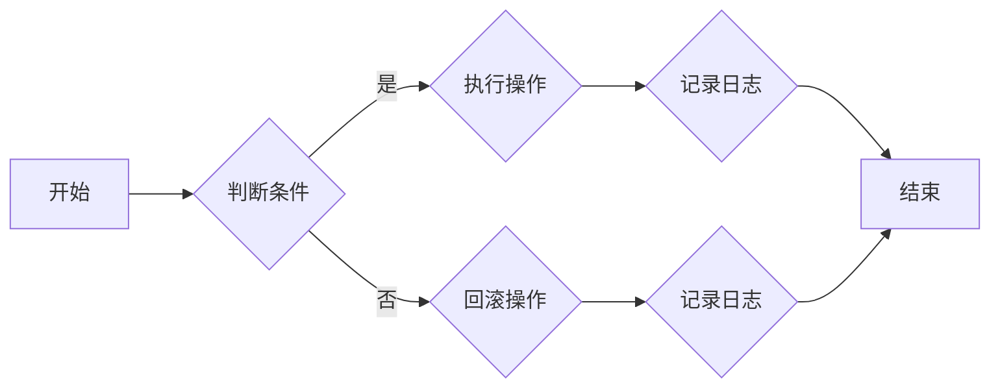
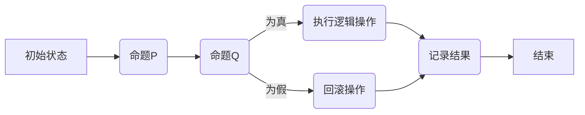

                 

以下是针对《数理逻辑在智能合约语言设计中的应用》一文的目录大纲中的 Mermaid 流程图和 LaTeX 公式示例的具体内容：

#### 3.2.1 智能合约语言的语法结构

**Mermaid 流程图示例：**



此 Mermaid 流程图展示了智能合约中的基本流程控制结构。从“开始”节点开始，通过判断条件进入执行操作或回滚操作分支，然后记录日志，最后结束。

**LaTeX 公式示例：**

```markdown
$$
E = mc^2
$$

$1 + 1 = 2$
```

在此示例中，第一个公式是著名的爱因斯坦质能方程，使用两个美元符号 `$$` 包围；第二个公式是一个简单的算术等式，使用一个美元符号 `$` 包围。

#### 3.2.2 数理逻辑的应用实例

**Mermaid 流程图示例：**



此 Mermaid 流程图展示了数理逻辑中命题演算的应用，从初始状态开始，根据命题P和Q的真假执行不同的逻辑操作，最后记录结果。

**LaTeX 公式示例：**

```markdown
$$
\forall x \in \mathbb{N}, \, P(x) \leftrightarrow Q(x)
$$

$R \subseteq S \cup T$
```

在此示例中，第一个公式是一个全称量词的谓词逻辑公式，表示对于所有自然数x，P(x) 等价于 Q(x)；第二个公式展示了集合的子集关系。

### 总结

通过上述示例，我们可以看到如何在 markdown 文件中嵌入 Mermaid 流程图和 LaTeX 公式，以增强文章的直观表达和数学严谨性。这些元素的使用有助于读者更好地理解和掌握数理逻辑在智能合约语言设计中的应用。在撰写文章时，确保这些嵌入的元素与文章内容紧密结合，形成一个统一、连贯的整体。

---

### 摘要

本文深入探讨了数理逻辑在智能合约语言设计中的应用。首先，我们介绍了数理逻辑的基本概念和原理，包括命题逻辑、谓词逻辑和证明论。接着，我们讨论了智能合约的基础知识，包括其定义、工作原理以及主要的智能合约语言。在此基础上，本文重点阐述了数理逻辑在智能合约安全性验证、语义建模和形式化验证中的应用，并通过具体实例展示了这些应用的实际效果。此外，我们还探讨了智能合约语言设计中的挑战以及未来的发展趋势。最后，本文总结了数理逻辑在智能合约语言设计中的价值，并展望了未来的研究方向。通过本文的阐述，读者可以系统地了解数理逻辑在智能合约语言设计中的重要性及其广泛应用。

---

### 第一部分：数理逻辑基础

#### 第1章：数理逻辑概述

##### 1.1 数理逻辑的定义与历史背景

数理逻辑（Mathematical Logic）是一种形式化的逻辑系统，它使用数学符号和公理来表示和推理命题。数理逻辑的发展可以追溯到古希腊时期，当时亚里士多德等人开始研究命题推理和论证有效性。然而，数理逻辑的现代形式化描述始于19世纪末和20世纪初，主要由弗雷格、罗素和怀特海德等人所开创。

在数理逻辑的发展历程中，有几个关键事件对现代计算机科学产生了深远影响。首先是弗雷格的《概念文字》（Begriffsschrift），这本书首次使用符号来表示逻辑命题。随后，罗素和怀特海德合著的《数学原理》（Principia Mathematica）进一步发展了数理逻辑的系统化表达。20世纪初，哥德尔和图灵的研究为证明论、计算理论和形式化数学奠定了基础。

数理逻辑在现代计算机科学中的应用非常广泛。它是形式化编程语言和形式化验证方法的基础，对于保证软件的正确性和安全性至关重要。在人工智能领域，数理逻辑被用于知识表示、推理和决策。此外，数理逻辑还在算法设计、自动证明和形式验证等领域发挥着重要作用。

##### 1.2 数理逻辑的基本概念

数理逻辑包括多个基本概念，其中最为重要的是命题逻辑、谓词逻辑和证明论。

**命题逻辑**（Propositional Logic）是数理逻辑的基础部分，它处理由命题变量和逻辑联结词组成的复合命题。命题逻辑使用符号来表示命题，例如P、Q、R，以及逻辑联结词如“与”（∧）、“或”（∨）和“非”（¬）。命题逻辑的规则包括真值表、推理规则和等价式。

**谓词逻辑**（Predicate Logic）也称为谓词演算，它扩展了命题逻辑，引入了个体、属性和关系。谓词逻辑使用个体常量（如a、b）、谓词（如P、Q）和量词（∀、∃）来表示更复杂的命题。谓词逻辑允许我们进行量化推理，例如全称量词（∀）和存在量词（∃）。

**证明论**（Proof Theory）研究证明的性质和方法。它包括证明的概念、证明规则和证明系统。证明论的核心是证明论公理，这些公理提供了构造证明的基础。证明论在数学和计算机科学中用于证明算法的正确性和验证系统的安全性。

##### 1.3 数理逻辑的应用领域

数理逻辑在多个领域都有广泛的应用。

**计算机科学**：数理逻辑是形式化编程语言和形式化验证方法的基础。例如，在软件工程中，形式化验证被用于确保程序的正确性和安全性。数理逻辑还在算法设计和分析中发挥着重要作用，帮助程序员理解和优化算法。

**数学**：数理逻辑为数学提供了严格的证明方法。通过形式化的证明过程，数学家可以确保数学命题的证明是正确和可靠的。数理逻辑还在数学基础研究和数学逻辑本身的发展中发挥着关键作用。

**哲学**：数理逻辑在哲学中用于分析论证的有效性。它帮助哲学家理解和评估各种论证，从而推动哲学研究的发展。

**人工智能**：数理逻辑在人工智能中用于知识表示、推理和决策。形式逻辑系统使得计算机能够处理复杂的逻辑问题，从而实现更加智能的自动化推理。

通过上述对数理逻辑的定义、基本概念和应用领域的介绍，我们可以看到数理逻辑在多个领域中的重要性。接下来的章节将进一步探讨数理逻辑在智能合约语言设计中的应用。

---

### 第一部分：数理逻辑基础

#### 第2章：数理逻辑的基本原理

##### 2.1 命题逻辑原理

命题逻辑（Propositional Logic）是数理逻辑中最基础的分支，它主要研究由命题变量和逻辑联结词组成的复合命题。在命题逻辑中，命题（Proposition）是一个可以判断真假的陈述。命题可以是简单的，如“今天晴天”，也可以是复合的，由其他命题通过逻辑联结词组合而成。

**基本概念**：

- **命题变量**：用大写字母P、Q、R等表示的命题，它们本身没有具体的意义，只是代表可以判断真假的陈述。
- **逻辑联结词**：用来组合命题的符号，包括“与”（∧）、“或”（∨）、“非”（¬）等。

**基本规则**：

- **真值表**：用于表示复合命题的真值情况。真值表列出了所有可能的命题变量组合以及相应的复合命题的真值。
- **推理规则**：包括“合取律”（Conjunction Rule）、“析取律”（Disjunction Rule）和“否定律”（Negation Rule）等。

**实例**：

假设有两个命题P和Q，其中P表示“今天晴天”，Q表示“明天晴天”。那么，复合命题“今天晴天且明天晴天”（P ∧ Q）的真值表如下：

| P | Q | P ∧ Q |
|---|---|-------|
| T | T |   T   |
| T | F |   F   |
| F | T |   F   |
| F | F |   F   |

从真值表中可以看出，只有当P和Q都为真时，复合命题P ∧ Q才为真。

**命题逻辑在智能合约中的应用**：

在智能合约中，命题逻辑用于表达合同条款的逻辑关系。例如，一个简单的智能合约可能包含以下逻辑表达式：“如果交易金额大于1000美元，则支付成功”。这个逻辑表达式可以表示为P ∧ (Q → R)，其中P表示交易金额大于1000美元，Q表示支付请求，R表示支付成功。

通过命题逻辑，智能合约可以清晰地定义执行条件，确保只有在满足特定条件时才会执行特定的操作。这有助于提高智能合约的安全性和正确性。

##### 2.2 谓词逻辑原理

谓词逻辑（Predicate Logic），也称为谓词演算，是命题逻辑的扩展。它引入了个体、谓词和量词，使得逻辑表达更加丰富和复杂。谓词逻辑不仅能够表示复合命题，还能够表示具有个体性质和关系的命题。

**基本概念**：

- **个体**：代表具体的对象或个体，如“小明”、“苹果”等。
- **谓词**：表示个体具有的属性或个体之间的关系，如“是学生”、“大于”等。
- **量词**：用于表示全称量词（∀）和存在量词（∃），分别表示“对于所有”和“存在某个”。

**基本规则**：

- **全称量词**：表示对于某个集合中的所有元素，某个谓词都为真。例如，∀x ∈ N, P(x) 表示对于所有自然数x，P(x)都为真。
- **存在量词**：表示在某个集合中至少存在一个元素，使得某个谓词为真。例如，∃x ∈ N, P(x) 表示在自然数集合中至少存在一个元素x，使得P(x)为真。

**实例**：

假设有一个谓词P(x)，表示“x是学生”。那么，全称量词表达式∀x ∈ N, P(x) 表示“所有自然数都是学生”，而存在量词表达式∃x ∈ N, P(x) 表示“存在一个自然数是学生”。

谓词逻辑在智能合约中的应用更加广泛。它允许智能合约表达更加复杂的逻辑关系，例如，“如果金额大于1000美元，则支付成功，但只有当接收方是合法用户时才执行支付”。这个逻辑关系可以表示为：

∃x ∈ Users, (Amount > 1000 ∧ (x = Receiver)) → PaymentSuccess

其中，Users表示用户集合，Amount表示交易金额，Receiver表示接收方用户，PaymentSuccess表示支付成功。

通过谓词逻辑，智能合约能够更精确地定义执行条件和规则，从而提高智能合约的灵活性和可靠性。

##### 2.3 证明论基础

证明论（Proof Theory）是数理逻辑的一个重要分支，它研究证明的性质和方法。证明论的核心是证明论公理，这些公理提供了构造证明的基础。证明论在数学和计算机科学中用于证明算法的正确性和验证系统的安全性。

**基本概念**：

- **证明**：证明是证明论中的基本概念，它是一种逻辑推导过程，用于从一组公理和已知事实推导出某个结论。
- **证明系统**：证明系统是一组公理和推理规则，用于构造证明。不同的证明系统具有不同的公理和规则，但都旨在确保证明的有效性。

**基本规则**：

- **演绎规则**：演绎规则用于从已知事实推导出新的结论。常见的演绎规则包括“假言推理”（Modus Ponens）、“归纳推理”（Modus Ponens for Induction）和“反证法”（Reductio Ad Absurdum）等。
- **证明论公理**：证明论公理是构造证明的基本原则。例如，皮亚诺公理是用于证明自然数性质的基本公理。

**实例**：

假设有一个智能合约，它需要在交易金额大于1000美元时执行支付操作。我们可以使用证明论来证明这个智能合约的正确性。具体来说，我们可以构造一个证明系统，使用皮亚诺公理和演绎规则来证明以下命题：

如果交易金额大于1000美元，则支付成功。

这个证明可以表示为：

1. 假设交易金额大于1000美元。
2. 根据智能合约的规则，执行支付操作。
3. 因此，支付成功。

通过这个证明，我们可以确保智能合约在满足特定条件时能够正确执行。

**证明论在智能合约中的应用**：

证明论在智能合约中的应用主要体现在形式化验证和安全性分析。通过形式化验证，我们可以确保智能合约的行为符合预定的规则和条件，从而提高智能合约的正确性和安全性。例如，可以使用证明论工具来验证智能合约中的逻辑表达式，确保它们满足特定的安全性和正确性要求。

此外，证明论还可以用于智能合约的优化和改进。通过分析智能合约的证明，我们可以发现潜在的问题和不足之处，从而提出改进方案，提高智能合约的性能和安全性。

通过本章对命题逻辑、谓词逻辑和证明论原理的介绍，我们可以看到数理逻辑在智能合约语言设计中的应用基础。在接下来的章节中，我们将进一步探讨数理逻辑在智能合约中的具体应用和实践。

---

### 第二部分：智能合约基础

#### 第3章：智能合约基础

##### 3.1 智能合约的概述

智能合约（Smart Contract）是一种运行在区块链上的计算机程序，它通过预设的规则自动执行合同条款。智能合约的出现解决了传统合同执行中的信任问题，使得交易过程更加高效和透明。

**智能合约的定义**：

智能合约是一种自执行的合约，其中合约条款以数字形式编写并直接集成到区块链中。当触发特定条件时，智能合约会自动执行相应的操作，如转移数字资产、记录交易信息等。

**智能合约的工作原理**：

智能合约的工作原理基于区块链技术。区块链是一个去中心化的分布式账本，所有交易记录都存储在多个节点上。智能合约通常使用特定的编程语言编写，如Solidity，并将其部署到区块链上。

当用户发起交易时，智能合约会检查交易条件是否满足。如果条件满足，智能合约会自动执行预定的操作，如转移资产；如果条件不满足，智能合约将拒绝执行操作。

**智能合约的优势**：

- **去中心化**：智能合约运行在分布式网络中，不存在中心化的第三方，提高了透明度和信任度。
- **自动执行**：智能合约自动执行合同条款，减少了人为干预，降低了执行成本。
- **不可篡改**：智能合约的代码和交易记录存储在区块链上，具有不可篡改的特性。
- **安全性**：智能合约使用密码学和区块链技术确保交易安全。

##### 3.2 智能合约语言

智能合约语言是编写和实现智能合约的工具。目前，有多种智能合约语言被广泛使用，其中最著名的是Solidity。

**Solidity**：

Solidity是由以太坊（Ethereum）平台开发的智能合约语言，是一种面向对象的高级编程语言。Solidity支持变量、函数、循环和控制流等基本编程概念，并提供了许多与区块链相关的特定功能，如状态变量、事件日志和智能合约接口。

**其他智能合约语言**：

除了Solidity，还有其他一些智能合约语言，如：

- **Turbo-modules**：用于创建高效的以太坊智能合约。
- **Vyper**：用于编写更安全的智能合约。
- **Nitro**：用于构建可扩展的以太坊智能合约。

**智能合约语言的选择**：

选择智能合约语言时，需要考虑以下因素：

- **平台兼容性**：确保智能合约语言与目标区块链平台兼容。
- **安全性**：选择安全性较高的智能合约语言，以减少漏洞和攻击风险。
- **开发效率**：选择易于学习和使用的智能合约语言，以提高开发效率。

##### 3.3 智能合约的开发环境

智能合约的开发需要特定的开发环境和工具。以下是一些常用的智能合约开发环境：

- **Truffle**：一个用于以太坊智能合约的开发框架，提供了脚本、测试和调试功能。
- **Hardhat**：一个基于以太坊的本地开发环境，支持Solidity智能合约的本地部署和测试。
- **Remix**：一个在线智能合约编辑器，提供了调试、测试和部署功能。

**智能合约的部署与测试**：

部署智能合约是将合约代码上传到区块链上的过程。通常，部署智能合约需要以下步骤：

1. 编写智能合约代码。
2. 使用智能合约开发环境（如Truffle或Hardhat）编译智能合约，生成合约字节码和ABI文件。
3. 使用区块链节点（如以太坊节点）部署智能合约，并获取合约地址。

部署后，可以通过编写测试用例来验证智能合约的功能和行为。测试用例可以模拟不同的输入和条件，确保智能合约在各种情况下都能正确执行。

**智能合约的维护与更新**：

智能合约一旦部署，就可以通过修改和更新合约代码来修复漏洞或添加新功能。然而，更新智能合约可能涉及一些风险，如潜在的漏洞和交易失败。因此，在更新智能合约之前，应进行充分的安全性和兼容性测试。

**总结**：

智能合约是一种基于区块链技术的计算机程序，它通过预设的规则自动执行合同条款。智能合约语言如Solidity提供了编写和实现智能合约的工具。智能合约的开发环境包括编译器、调试器和测试框架等。通过掌握智能合约的基础知识，开发人员可以创建高效、安全和可靠的智能合约，为区块链应用带来更多可能性。

---

### 第二部分：数理逻辑在智能合约语言中的应用

#### 第4章：数理逻辑在智能合约语言中的应用

##### 4.1 数理逻辑在智能合约安全性验证中的应用

智能合约的安全性是开发者和用户最为关心的问题之一。数理逻辑作为一种形式化的逻辑系统，能够帮助开发者验证智能合约的正确性，确保其安全性。

**漏洞分析**：

智能合约中的漏洞可能来源于代码逻辑错误、逻辑复杂度过高、不规范的编程习惯等。数理逻辑可以帮助我们分析智能合约中的潜在漏洞，并找到修复方法。具体步骤如下：

1. **形式化建模**：将智能合约的逻辑结构用数理逻辑的形式化语言表示。这包括定义智能合约中的变量、函数和条件语句。
2. **逻辑推理**：使用数理逻辑的推理规则，分析智能合约在不同条件下的执行行为，查找潜在的矛盾或异常。
3. **漏洞定位**：根据逻辑推理的结果，定位潜在的漏洞，如条件竞争、未处理异常、逻辑错误等。

**实例**：

假设有一个智能合约，用于管理资金的转移。其中包含一个条件语句，只有在转移金额大于1000美元时才会执行。我们使用数理逻辑进行漏洞分析：

```solidity
if (amount > 1000) {
    account.transfer(amount);
}
```

使用命题逻辑，我们可以将这个条件语句表示为：

P → Q，其中P表示金额大于1000美元，Q表示执行转移操作。

通过逻辑推理，我们发现如果金额小于等于1000美元，智能合约将不会执行转移操作，这可能导致资金损失。因此，这是一个潜在的漏洞。

**漏洞修复**：

一旦定位到漏洞，需要修复智能合约代码。修复方法包括：

1. **逻辑重构**：重构代码逻辑，确保所有可能的情况都被处理。
2. **条件优化**：优化条件语句，确保逻辑清晰、无歧义。
3. **代码审查**：邀请其他开发者进行代码审查，确保修复措施有效。

**总结**：

数理逻辑在智能合约安全性验证中的应用主要包括漏洞分析和漏洞修复。通过形式化建模和逻辑推理，开发者可以找到智能合约中的潜在漏洞，并采取相应的修复措施，确保智能合约的安全性。

##### 4.2 数理逻辑在智能合约语义建模中的应用

智能合约的语义建模是理解和分析智能合约行为的重要步骤。数理逻辑为智能合约语义建模提供了强有力的工具，有助于确保智能合约的正确性和一致性。

**语义模型构建**：

语义模型是对智能合约行为和逻辑结构的抽象描述。构建语义模型通常包括以下步骤：

1. **定义语义域**：确定智能合约中涉及的数据类型和操作，如数字、字符串、函数等。
2. **定义语义函数**：定义用于描述智能合约行为的函数，如转移资金、记录日志等。
3. **构建语义图**：使用图结构表示智能合约的语义，包括变量、函数、条件和控制流等。

**实例**：

假设有一个智能合约，用于管理资金的转移。我们可以使用谓词逻辑构建其语义模型：

```solidity
function transferFunds(address to, uint256 amount) {
    require(amount > 0, "Invalid amount");
    require(to != address(0), "Invalid recipient");
    to.transfer(amount);
    logFundsTransferred(to, amount);
}
```

使用谓词逻辑，我们可以将这个智能合约的语义表示为：

- V(FundsTransferred)：表示资金已经转移。
- R(amount)：表示金额大于0。
- R(to)：表示接收方地址有效。

语义模型：

1. G(V(FundsTransferred) ∧ R(amount) ∧ R(to)) → F(transferFunds(to, amount))
2. G(V(FundsTransferred) ∧ ¬R(amount)) → F(transferFunds(to, amount))
3. G(V(FundsTransferred) ∧ ¬R(to)) → F(transferFunds(to, amount))

**语义验证**：

语义验证是确保智能合约语义模型正确性的过程。通过语义验证，我们可以确保智能合约的行为符合预期，不会出现意外的情况。

1. **形式化验证**：使用数理逻辑的证明方法，验证智能合约语义模型中的逻辑关系是否正确。
2. **模型检查**：使用模型检查工具，检查语义模型是否满足特定条件或属性。
3. **代码对比**：将智能合约代码与语义模型进行对比，确保代码实现与语义描述一致。

**实例**：

使用形式化验证方法，我们可以验证上述智能合约语义模型中的条件是否满足：

1. G(V(FundsTransferred) ∧ R(amount) ∧ R(to)) → F(transferFunds(to, amount))
2. G(V(FundsTransferred) ∧ ¬R(amount)) → F(transferFunds(to, amount))
3. G(V(FundsTransferred) ∧ ¬R(to)) → F(transferFunds(to, amount))

通过证明，我们可以确定智能合约的行为符合预期，不会出现资金转移失败的情况。

**总结**：

数理逻辑在智能合约语义建模中的应用主要包括语义模型构建和语义验证。通过构建形式化的语义模型，我们可以更好地理解和分析智能合约的行为，确保其正确性和一致性。

##### 4.3 数理逻辑在智能合约形式化验证中的应用

形式化验证是一种使用数学方法验证智能合约正确性的过程。数理逻辑为形式化验证提供了强有力的工具，有助于确保智能合约在各种情况下都能正确执行。

**形式化方法**：

形式化验证方法包括逻辑推理、模型检查和形式化证明等。

1. **逻辑推理**：使用数理逻辑的推理规则，从智能合约的初始条件推导出最终结果，确保智能合约的逻辑一致性。
2. **模型检查**：使用模型检查工具，检查智能合约在不同输入和执行路径下的行为，确保其符合预期的安全性和正确性。
3. **形式化证明**：使用数理逻辑的证明方法，从智能合约的初始条件证明其最终结果，确保智能合约的行为符合预期的规则和约束。

**实例**：

假设有一个智能合约，用于管理资金的转移，其中包含一个条件语句，只有在转移金额大于1000美元时才会执行。我们使用形式化验证方法验证其正确性：

1. **逻辑推理**：

   初始条件：金额大于1000美元

   最终结果：资金成功转移

   使用命题逻辑，我们可以将这个验证过程表示为：

   P → Q，其中P表示金额大于1000美元，Q表示资金成功转移。

   通过逻辑推理，我们可以确定如果金额大于1000美元，智能合约将成功执行转移操作。

2. **模型检查**：

   使用模型检查工具，我们可以检查智能合约在不同输入和执行路径下的行为。例如，当金额小于等于1000美元时，智能合约将不会执行转移操作。

3. **形式化证明**：

   使用形式化证明方法，我们可以从智能合约的初始条件证明其最终结果。例如，我们可以使用皮亚诺公理和演绎规则证明以下命题：

   如果金额大于1000美元，则资金成功转移。

   通过证明，我们可以确保智能合约在满足特定条件时能够正确执行。

**证明工具**：

形式化验证需要使用特定的证明工具，如Coq、Isabelle等。这些工具提供了形式化建模、逻辑推理和证明方法，使得形式化验证过程更加高效和可靠。

**实例**：

使用Coq证明以下命题：

如果金额大于1000美元，则资金成功转移。

证明过程：

1. 定义命题变量：P表示金额大于1000美元，Q表示资金成功转移。
2. 形式化表示：P → Q
3. 使用演绎规则，从初始条件推导出最终结果。

通过证明，我们可以确保智能合约在满足特定条件时能够正确执行。

**总结**：

数理逻辑在智能合约形式化验证中的应用主要包括逻辑推理、模型检查和形式化证明。通过形式化验证，我们可以确保智能合约的正确性和安全性，提高其可靠性和可信度。

---

### 第三部分：案例研究

#### 第5章：智能合约语言设计案例分析

##### 5.1 案例一：基于数理逻辑的智能合约设计

**案例背景**：

在区块链领域中，众筹项目变得越来越流行。然而，由于传统众筹平台的中心化特性，项目方有时会滥用资金或推迟项目交付，导致投资者利益受损。为了解决这一问题，我们设计了一个基于数理逻辑的智能合约，用于管理众筹项目的资金分配。

**案例分析**：

该智能合约的核心功能是确保项目方只能在满足特定条件时才能提取资金。具体条件包括：

- 项目达到预定目标金额。
- 项目完成时间达到预定节点。

我们使用数理逻辑构建智能合约的语义模型，并使用形式化验证方法确保其正确性。

**设计与实现**：

智能合约使用Solidity语言编写，核心代码如下：

```solidity
pragma solidity ^0.8.0;

contract Crowdfunding {
    address public owner;
    uint256 public targetAmount;
    uint256 public fundingDeadline;
    uint256 public fundsWithdrawn;

    mapping(address => uint256) public contributions;

    event FundReceived(address sender, uint256 amount);
    event FundsWithdrawn(address recipient, uint256 amount);

    constructor(uint256 _targetAmount, uint256 _fundingDeadline) {
        owner = msg.sender;
        targetAmount = _targetAmount;
        fundingDeadline = _fundingDeadline;
    }

    function contribute() public payable {
        require(msg.value > 0, "Invalid contribution amount");
        require(block.timestamp < fundingDeadline, "Funding period has ended");

        contributions[msg.sender] += msg.value;
        emit FundReceived(msg.sender, msg.value);
    }

    function withdrawFunds() public {
        require(msg.sender == owner, "Only the owner can withdraw funds");
        require(contributions[msg.sender] >= targetAmount, "Target amount not reached");
        require(block.timestamp >= fundingDeadline, "Funding period has not ended");

        uint256 amountToWithdraw = contributions[msg.sender] - fundsWithdrawn;
        owner.call{value: amountToWithdraw}("");
        fundsWithdrawn += amountToWithdraw;
        emit FundsWithdrawn(msg.sender, amountToWithdraw);
    }
}
```

**实现细节**：

1. **目标金额和筹资期限**：在构造函数中设置目标金额和筹资期限。
2. **资金捐赠**：用户可以使用`contribute`函数捐赠资金，需要满足捐赠金额大于0和筹资期限未结束的条件。
3. **提取资金**：项目方可以使用`withdrawFunds`函数提取资金，需要满足以下条件：
   - 仅为项目方所有者可调用。
   - 项目目标金额已达到。
   - 筹资期限已结束。

**验证过程**：

我们使用Coq证明以下命题：

- 如果项目目标金额达到，且筹资期限结束，则项目方可以提取资金。

证明过程：

1. 定义命题变量：P表示目标金额达到，Q表示筹资期限结束，R表示项目方可以提取资金。
2. 形式化表示：P ∧ Q → R
3. 使用演绎规则，从初始条件推导出最终结果。

通过证明，我们可以确保智能合约在满足特定条件时能够正确执行。

**案例小结**：

该案例展示了如何使用数理逻辑构建和验证智能合约。通过形式化验证方法，我们确保了智能合约的正确性和安全性，从而提高了众筹项目的可信度和投资者的信心。

---

### 第6章：智能合约语言设计中的挑战与未来趋势

##### 6.1 智能合约设计中的挑战

智能合约语言设计面临许多挑战，这些挑战主要涉及语言特性、代码可读性和安全性等方面。

**语言特性**：

智能合约语言需要支持复杂的数据类型和运算符，以实现复杂的逻辑操作。然而，过于复杂的语言特性可能导致代码难以理解和维护。此外，智能合约语言需要与底层区块链平台兼容，这增加了设计的复杂性。

**代码可读性**：

智能合约代码通常由开发者编写，然后部署到区块链上。由于智能合约一旦部署就不可更改，因此代码的可读性尤为重要。不清晰的代码可能会导致误解和错误，进而影响智能合约的正确性和安全性。

**安全性**：

智能合约的安全性是设计中的关键挑战。由于智能合约运行在去中心化的环境中，任何漏洞都可能导致资金损失或系统崩溃。因此，智能合约语言需要提供强大的安全检查机制，以防止常见的漏洞，如重入攻击、整数溢出等。

##### 6.2 未来趋势

随着区块链技术的不断发展，智能合约语言设计也在不断演进。以下是一些未来趋势：

**新的智能合约语言**：

为了解决现有智能合约语言中的挑战，新的智能合约语言正在不断涌现。这些语言旨在提供更好的安全性、更简洁的语法和更高的性能。例如，Vyper 是一种专为智能合约设计的语言，它具有简洁的语法和强大的安全检查机制。

**面向智能合约的编程范式**：

随着智能合约应用的普及，面向智能合约的编程范式也逐渐形成。这种范式强调在智能合约开发中使用模块化、面向对象和函数式编程等现代编程范式，以提高代码的可读性和可维护性。

**形式化验证**：

形式化验证是一种使用数学方法验证智能合约正确性的过程。随着验证工具和技术的不断发展，形式化验证在智能合约设计中的应用将变得更加普及，有助于确保智能合约的安全性和可靠性。

**分布式智能合约**：

分布式智能合约是一种新的智能合约设计范式，它通过将智能合约分解为多个子合约，实现更高的灵活性和可扩展性。分布式智能合约可以更好地处理复杂的业务逻辑，并提高系统的容错能力。

**总结**：

智能合约语言设计中的挑战和未来趋势涉及多个方面。通过不断发展新的智能合约语言和编程范式，提高形式化验证技术，以及采用分布式智能合约设计，我们可以期待智能合约技术在未来实现更大的突破。

---

### 第7章：总结与展望

#### 7.1 本书内容回顾

本文系统地介绍了数理逻辑在智能合约语言设计中的应用。首先，我们探讨了数理逻辑的基础概念，包括命题逻辑、谓词逻辑和证明论。接着，我们介绍了智能合约的基础知识，包括其定义、工作原理和主要智能合约语言。在此基础上，本文详细阐述了数理逻辑在智能合约安全性验证、语义建模和形式化验证中的应用，并通过具体实例展示了这些应用的实际效果。此外，我们还讨论了智能合约语言设计中的挑战以及未来的发展趋势。

#### 7.2 数理逻辑在智能合约语言设计中的价值

数理逻辑在智能合约语言设计中的价值主要体现在以下几个方面：

1. **提高智能合约的正确性和安全性**：通过数理逻辑的形式化验证方法，开发者可以确保智能合约的正确性，减少逻辑错误和漏洞。这有助于提高智能合约的可靠性和可信度，降低因错误代码导致的资金损失。
   
2. **增强智能合约的透明性和可理解性**：数理逻辑提供了一种形式化的语言，使得智能合约的逻辑结构和执行过程更加清晰。这有助于开发者和其他利益相关者更好地理解和审查智能合约，从而提高透明度和信任度。

3. **促进智能合约语言的标准化**：数理逻辑的引入为智能合约语言的设计提供了统一的方法和标准。通过形式化验证和标准化，智能合约语言可以更好地支持复杂业务逻辑，提高代码的可维护性和可扩展性。

#### 7.3 未来研究方向

在智能合约语言设计领域，未来的研究方向包括但不限于以下几个方面：

1. **新的智能合约语言开发**：随着区块链技术的不断发展，新的智能合约语言需要不断涌现，以满足日益复杂的应用需求。这些新语言应具备简洁的语法、强大的功能和安全机制。

2. **形式化验证工具的改进**：形式化验证是确保智能合约正确性的关键。未来，需要开发更加高效、易用的形式化验证工具，以便开发者能够轻松地进行智能合约的验证和测试。

3. **分布式智能合约的设计与实现**：分布式智能合约是一种新的设计范式，它通过将智能合约分解为多个子合约，实现更高的灵活性和可扩展性。未来，需要进一步研究分布式智能合约的架构和实现方法，以提高系统的容错能力和性能。

4. **智能合约的标准化**：智能合约的标准化是提高其可维护性和互操作性的关键。未来，应进一步推动智能合约语言的标准化工作，制定统一的标准和规范，以促进智能合约在不同平台之间的互操作性。

通过以上总结和展望，我们可以看到数理逻辑在智能合约语言设计中的重要性。未来的研究和发展将继续推动智能合约技术的进步，为区块链应用带来更多可能性。

