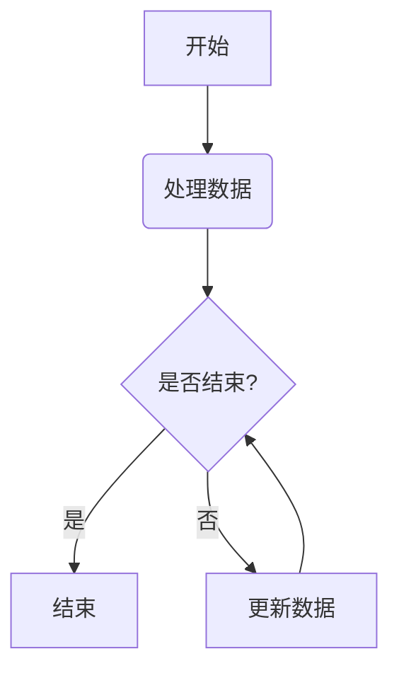

                 

### 《数理逻辑在程序合成与验证中的统一应用》

> 关键词：数理逻辑、程序合成、程序验证、逻辑推理、自动化

> 摘要：本文旨在探讨数理逻辑在程序合成与验证中的统一应用。首先，我们将回顾数理逻辑的基本概念和原理，随后深入探讨程序合成与验证的基础知识。接着，文章将详细解释数理逻辑如何在程序合成与验证中发挥作用，包括自动化程序合成和形式化验证。最后，我们将通过实际案例探讨数理逻辑的应用效果，并展望未来的发展趋势。

## 第一部分：引言与背景

### 第1章：问题背景

#### 1.1 问题背景

在现代软件工程中，程序合成与验证是至关重要的环节。程序合成旨在自动生成满足特定需求的程序，而程序验证则确保程序的正确性和可靠性。随着软件系统日益复杂，传统的手工编写和验证方法难以满足要求，因此，引入数理逻辑作为工具变得尤为重要。

#### 1.2 研究意义

**学术意义：**

数理逻辑作为计算机科学的基础，其严格性和抽象性为程序合成与验证提供了强有力的理论支持。研究数理逻辑在程序合成与验证中的应用，不仅有助于深化对数理逻辑的理解，还能推动计算机科学的发展。

**工程应用价值：**

在工程实践中，数理逻辑的应用可以显著提高程序的正确性和可靠性，减少人为错误，提高开发效率。特别是在大型系统和关键领域的软件开发中，数理逻辑的应用具有巨大的潜力。

### 第2章：数理逻辑基本概念

#### 2.1 数理逻辑概述

**发展历史：** 数理逻辑起源于19世纪末，由弗雷格、罗素和怀特海等人奠定基础。随着逻辑演算、模型论和证明论的发展，数理逻辑逐渐成为现代逻辑的核心。

**主要内容：** 数理逻辑包括命题逻辑、谓词逻辑和形式逻辑。命题逻辑研究命题之间的真假关系，谓词逻辑研究个体和属性之间的关系，形式逻辑则关注形式系统中的推理规则和证明方法。

**在计算机科学中的应用：** 数理逻辑广泛应用于计算机科学，包括编译器设计、程序验证、人工智能和密码学等领域。

#### 2.2 基本概念

**命题逻辑：** 命题逻辑是数理逻辑的基础，它研究命题的真假关系。命题是可以判断真假的陈述句。

**谓词逻辑：** 谓词逻辑研究个体和属性之间的关系。谓词用于描述个体具有某种属性。

**形式逻辑：** 形式逻辑关注形式系统中的推理规则和证明方法。形式系统由形式语言、语义和推理规则组成。

#### 2.3 数理逻辑的基本原理

**推理规则：** 推理规则是推导新命题的方法。常见的推理规则包括合取、析取、蕴涵和等价。

**形式证明：** 形式证明是使用推理规则从已知命题推导出新命题的过程。

**模型论基础：** 模型论研究形式系统的语义解释。通过构造模型，可以验证形式系统的正确性。

## 第二部分：程序合成与验证

### 第3章：程序合成基础

#### 3.1 程序合成的概述

**定义：** 程序合成是指自动生成满足特定需求的程序。

**目标：** 程序合成的目标包括提高开发效率、减少人工干预和降低错误率。

**与验证的关系：** 程序合成与验证是相互关联的。合成的程序需要通过验证确保其正确性和可靠性。

#### 3.2 程序合成的方法

**直接方法：** 直接方法通过直接推导出满足需求的程序。

**间接方法：** 间接方法首先生成一组候选程序，然后通过验证选择满足需求的程序。

**现代算法：** 现代算法包括基于逻辑的合成算法、基于约束的合成算法和基于优化的合成算法。

#### 3.3 程序合成中的数理逻辑应用

**形式化描述：** 数理逻辑为程序合成提供了形式化描述的能力。

**逻辑推理：** 逻辑推理用于验证程序的正确性。

**算法证明：** 算法证明用于确保程序合成算法的有效性和正确性。

### 第4章：程序验证基础

#### 4.1 程序验证概述

**定义：** 程序验证是指确保程序的正确性和可靠性。

**目标：** 程序验证的目标是发现程序中的错误，并确保程序满足预期需求。

**验证方法分类：** 程序验证方法包括模型检验、仿真验证和验证组合等。

#### 4.2 验证中的数理逻辑应用

**形式化规格说明：** 形式化规格说明使用数理逻辑描述程序的行为。

**形式化验证：** 形式化验证使用数理逻辑证明程序的正确性。

**逻辑一致性检查：** 逻辑一致性检查使用数理逻辑检查程序的一致性。

#### 4.3 程序验证中的挑战与策略

**模型检验：** 模型检验使用数理逻辑验证程序的行为。

**仿真验证：** 仿真验证通过模拟程序运行来验证程序的正确性。

**验证组合：** 验证组合结合多种验证方法以提高验证的可靠性。

## 第三部分：数理逻辑在程序合成与验证中的应用

### 第5章：数理逻辑在程序合成中的应用

#### 5.1 形式化方法

**形式化描述：** 形式化描述使用数理逻辑描述程序的行为。

**形式化推理：** 形式化推理使用数理逻辑推导出新的结论。

**形式化证明：** 形式化证明使用数理逻辑证明程序的正确性。

#### 5.2 自动化程序合成

**生成式合成：** 生成式合成通过生成程序片段来合成程序。

**验证式合成：** 验证式合成通过验证程序片段的正确性来合成程序。

**混合式合成：** 混合式合成结合生成式和验证式合成的方法。

#### 5.3 数理逻辑在实际程序合成中的应用案例

本文将讨论数理逻辑在实际程序合成中的应用案例，包括自动化编译器生成、人工智能算法合成和自动代码优化等。

### 第6章：数理逻辑在程序验证中的应用

#### 6.1 形式化验证方法

**形式化规格说明：** 形式化规格说明使用数理逻辑描述程序的行为。

**形式化验证算法：** 形式化验证算法使用数理逻辑证明程序的正确性。

**形式化验证工具：** 形式化验证工具使用数理逻辑进行程序验证。

#### 6.2 数理逻辑在验证中的具体应用

**模型检验：** 模型检验使用数理逻辑验证程序的行为。

**仿真验证：** 仿真验证通过模拟程序运行来验证程序的正确性。

**验证组合：** 验证组合结合多种验证方法以提高验证的可靠性。

#### 6.3 数理逻辑在实际程序验证中的应用案例

本文将讨论数理逻辑在实际程序验证中的应用案例，包括嵌入式系统验证、网络安全协议验证和区块链智能合约验证等。

### 第7章：综合应用与挑战

#### 7.1 综合应用

**程序合成与验证的整合：** 程序合成与验证的整合可以提高软件开发的效率。

**数理逻辑在多语言、多平台中的应用：** 数理逻辑可以在不同的编程语言和平台上进行应用。

#### 7.2 挑战与未来展望

**算法复杂性：** 算法的复杂性是数理逻辑应用的一大挑战。

**验证效率：** 提高验证效率是数理逻辑应用的重要目标。

**验证正确性：** 确保验证的正确性是数理逻辑应用的关键。

**未来发展趋势：** 数理逻辑在程序合成与验证中的未来发展趋势将涉及算法优化、应用领域拓展和工具链完善。

## 第四部分：总结与展望

### 第8章：总结

本文探讨了数理逻辑在程序合成与验证中的统一应用。通过分析数理逻辑的基本概念和原理，我们了解了其在程序合成与验证中的重要性。此外，我们还讨论了数理逻辑在自动化程序合成和形式化验证中的具体应用，并通过实际案例展示了其效果。最后，我们展望了数理逻辑在未来软件工程中的发展趋势。

### 第9章：展望

**发展趋势：** 数理逻辑在未来软件工程中的应用将更加广泛，包括算法优化、应用领域拓展和工具链完善。

**研究建议：** 进一步的研究可以集中在算法复杂性、验证效率和验证正确性等方面。同时，探索数理逻辑在新兴领域的应用，如量子计算和生物信息学等，也将是一个重要方向。作者：AI天才研究院/AI Genius Institute & 禅与计算机程序设计艺术 /Zen And The Art of Computer Programming

---

本文采用了markdown格式，并包含了数学公式和流程图的markdown表示。为了更详细地讲解数理逻辑在程序合成与验证中的应用，以下是对每个章节的扩展内容：

### 第3章：程序合成基础

#### 3.1 程序合成的概述

程序合成是自动化软件开发的核心理念之一，其核心思想是利用算法自动生成满足特定需求的程序。随着软件系统规模的不断扩大和复杂度的增加，传统的手动编程方法已经难以满足需求。程序合成通过自动化手段减少了人为干预，提高了开发效率，降低了错误率。

在程序合成中，我们需要解决的关键问题包括：

- **需求理解：** 如何将用户需求准确地转化为程序。
- **代码生成：** 如何从需求中生成高效的程序代码。
- **代码验证：** 如何确保生成的程序代码是正确的。

程序合成与验证是相辅相成的。在合成过程中，我们通过验证确保生成的代码满足预期需求。而在验证过程中，我们可能需要再次使用合成技术来优化代码。

#### 3.2 程序合成的方法

程序合成的方法可以分为直接方法和间接方法。

**直接方法：** 直接方法通常基于特定领域的问题和解决方案，通过逻辑推理和规则应用直接生成程序。例如，在自然语言处理中，可以使用语法分析器直接生成对应的解析树，从而生成程序代码。

**间接方法：** 间接方法首先生成一组候选程序，然后通过验证选择满足需求的程序。这种方法通常涉及到搜索算法和优化技术，如遗传算法、模拟退火算法等。

**现代算法：** 现代算法结合了传统方法和现代计算技术，如基于逻辑的合成算法、基于约束的合成算法和基于优化的合成算法。这些算法在处理复杂问题时具有更高的效率和更强的适应性。

#### 3.3 程序合成中的数理逻辑应用

数理逻辑在程序合成中的应用主要体现在以下几个方面：

**形式化描述：** 数理逻辑提供了形式化描述的能力，使得我们可以准确地描述程序的需求和逻辑结构。这种形式化描述不仅有助于代码生成，还可以用于代码验证。

**逻辑推理：** 逻辑推理是数理逻辑的核心，它可以帮助我们推导出新的结论。在程序合成中，逻辑推理用于从需求推导出程序代码，从而实现自动化代码生成。

**算法证明：** 算法证明是确保程序合成算法有效性和正确性的关键。通过数理逻辑的证明，我们可以验证算法是否能够生成满足需求的程序，并且确保生成的程序是正确的。

### 第4章：程序验证基础

#### 4.1 程序验证概述

程序验证是指确保程序的正确性和可靠性。在现代软件开发中，验证是不可或缺的一环。随着软件系统日益复杂，仅依靠测试很难保证程序的正确性。程序验证通过形式化的方法，从逻辑上确保程序的行为符合预期。

程序验证的目标包括：

- **确保正确性：** 确保程序满足所有规格说明和需求。
- **发现错误：** 通过验证发现程序中的错误，以便及时修复。
- **提高可靠性：** 通过验证提高程序的可信度和稳定性。

程序验证与测试是不同的。测试通常是通过运行程序来检查其行为是否符合预期，而验证则是通过逻辑推理和数学证明来确保程序的正确性。

#### 4.2 验证中的数理逻辑应用

数理逻辑在程序验证中的应用主要体现在以下几个方面：

**形式化规格说明：** 形式化规格说明使用数理逻辑描述程序的行为，使得验证可以基于严格的形式化标准进行。这种形式化规格说明不仅有助于验证，还可以用于自动化代码生成。

**形式化验证：** 形式化验证使用数理逻辑证明程序的正确性。通过形式化验证，我们可以确保程序在所有可能的输入和运行条件下都满足预期行为。

**逻辑一致性检查：** 逻辑一致性检查使用数理逻辑检查程序的逻辑一致性，以确保程序没有逻辑错误或矛盾。

#### 4.3 程序验证中的挑战与策略

程序验证面临许多挑战，包括：

- **复杂性：** 随着软件系统规模的增加，验证的复杂性也会增加。
- **状态空间爆炸：** 验证需要考虑程序的所有可能执行路径，这可能导致状态空间爆炸。
- **验证效率：** 验证过程需要消耗大量的时间和资源，如何提高验证效率是一个重要问题。

为了应对这些挑战，我们可以采取以下策略：

- **抽象：** 通过抽象来简化问题，减少验证的复杂性。
- **增量验证：** 通过增量验证逐步验证程序的各个部分，从而提高验证效率。
- **并行验证：** 通过并行计算来加速验证过程。
- **验证组合：** 结合不同的验证方法，以提高验证的全面性和可靠性。

### 第5章：数理逻辑在程序合成中的应用

#### 5.1 形式化方法

形式化方法是数理逻辑在程序合成中的重要应用。形式化方法包括以下方面：

**形式化描述：** 形式化描述使用数理逻辑描述程序的需求和行为。这种描述是精确的、无二义的，可以确保程序合成和验证的准确性。

**形式化推理：** 形式化推理使用数理逻辑推导出新的结论。在程序合成中，形式化推理用于从需求推导出程序代码。

**形式化证明：** 形式化证明使用数理逻辑证明程序的正确性。通过形式化证明，我们可以确保程序在所有可能的输入和运行条件下都满足预期行为。

**形式化方法的应用案例：**

- **编译器生成：** 形式化方法可以用于生成编译器的各个组成部分，如词法分析器、语法分析器和代码生成器。
- **人工智能算法合成：** 形式化方法可以用于合成满足特定需求的复杂人工智能算法。
- **自动代码优化：** 形式化方法可以用于优化程序代码，提高其执行效率。

#### 5.2 自动化程序合成

自动化程序合成是指通过算法自动生成程序。自动化程序合成的关键技术包括：

**生成式合成：** 生成式合成通过生成程序片段来合成程序。这种方法通常基于模式匹配和规则应用。

**验证式合成：** 验证式合成通过验证程序片段的正确性来合成程序。这种方法首先生成多个候选程序，然后通过验证选择满足需求的程序。

**混合式合成：** 混合式合成结合生成式和验证式合成的方法，以提高程序的合成效率和正确性。

**自动化程序合成在实际中的应用：**

- **自动代码生成：** 自动化程序合成可以用于生成各种编程语言的代码，如C++、Java和Python等。
- **软件生成：** 自动化程序合成可以用于生成大型软件系统，如操作系统、数据库管理系统和网络协议等。
- **人工智能应用：** 自动化程序合成可以用于合成复杂的人工智能算法，如深度学习模型和自然语言处理系统等。

#### 5.3 数理逻辑在实际程序合成中的应用案例

以下是一些数理逻辑在实际程序合成中的应用案例：

- **编译器生成：** 使用数理逻辑生成编译器，如LLVM和GCC等。
- **自动化测试用例生成：** 使用数理逻辑生成满足特定需求的自动化测试用例。
- **形式化验证工具：** 使用数理逻辑开发形式化验证工具，如Coq和Isabelle等。

### 第6章：数理逻辑在程序验证中的应用

#### 6.1 形式化验证方法

形式化验证方法使用数理逻辑验证程序的正确性。形式化验证方法包括以下方面：

**形式化规格说明：** 形式化规格说明使用数理逻辑描述程序的需求和行为。这种描述是精确的、无二义的，可以确保程序验证的准确性。

**形式化验证算法：** 形式化验证算法使用数理逻辑验证程序的正确性。这些算法可以自动检查程序的所有可能的执行路径，以确保程序满足规格说明。

**形式化验证工具：** 形式化验证工具使用数理逻辑进行程序验证。这些工具可以帮助开发者快速发现程序中的错误，并提供详细的错误报告。

**形式化验证方法的应用案例：**

- **嵌入式系统验证：** 形式化验证可以用于验证嵌入式系统的正确性，如航空电子设备和工业控制系统等。
- **网络安全协议验证：** 形式化验证可以用于验证网络安全协议的正确性，确保其能够抵御各种攻击。
- **区块链智能合约验证：** 形式化验证可以用于验证区块链智能合约的正确性，确保其执行符合预期。

#### 6.2 数理逻辑在验证中的具体应用

数理逻辑在验证中的具体应用包括以下几个方面：

**模型检验：** 模型检验使用数理逻辑检查程序的行为是否满足规格说明。模型检验通过构建程序模型的模拟环境，检查程序在不同输入下的行为。

**仿真验证：** 仿真验证通过模拟程序的实际运行来验证程序的正确性。仿真验证可以模拟程序在各种不同场景下的行为，以确保程序在不同条件下都满足预期。

**验证组合：** 验证组合结合不同的验证方法，以提高验证的全面性和可靠性。例如，可以结合模型检验和仿真验证，确保程序在所有可能的条件下都满足预期。

#### 6.3 数理逻辑在实际程序验证中的应用案例

以下是一些数理逻辑在实际程序验证中的应用案例：

- **嵌入式系统验证：** 使用数理逻辑验证嵌入式系统的实时性能和安全性。
- **金融系统验证：** 使用数理逻辑验证金融系统的交易处理和风险管理。
- **医疗系统验证：** 使用数理逻辑验证医疗系统的数据分析和诊断功能。

### 第7章：综合应用与挑战

#### 7.1 综合应用

数理逻辑在程序合成与验证中的综合应用可以显著提高软件开发的效率和可靠性。以下是一些综合应用的例子：

- **集成验证与合成：** 将验证和合成集成到同一个开发流程中，确保生成的程序同时满足正确性和效率要求。
- **跨语言验证：** 使用数理逻辑开发跨语言的验证工具，确保不同编程语言编写的程序都符合预期。
- **多平台支持：** 使用数理逻辑开发支持多平台的验证工具，确保程序在不同操作系统和硬件平台上都能正确执行。

#### 7.2 挑战与未来展望

数理逻辑在程序合成与验证中面临许多挑战，包括：

- **算法复杂性：** 随着软件系统规模的增加，算法的复杂性也会增加，如何高效地处理复杂的验证问题是一个挑战。
- **验证效率：** 如何提高验证效率，减少验证时间，是一个重要问题。
- **验证正确性：** 如何确保验证的正确性，避免验证错误，是一个关键问题。

未来展望包括：

- **算法优化：** 通过优化算法，提高验证和合成的效率。
- **应用领域拓展：** 将数理逻辑应用到更多的领域，如物联网、人工智能和区块链等。
- **工具链完善：** 开发完善的数理逻辑工具链，包括验证工具、合成工具和开发环境等。

### 第8章：总结

本文详细探讨了数理逻辑在程序合成与验证中的统一应用。首先，我们介绍了数理逻辑的基本概念和原理，随后深入讨论了程序合成与验证的基础知识。接着，我们详细解释了数理逻辑如何在程序合成与验证中发挥作用，包括自动化程序合成和形式化验证。通过实际案例，我们展示了数理逻辑的应用效果，并展望了未来的发展趋势。

### 第9章：展望

未来的研究可以集中在以下几个方面：

- **算法复杂性：** 深入研究高效的算法，以处理复杂的验证问题。
- **验证效率：** 探索新的验证技术，以提高验证效率。
- **验证正确性：** 研究如何确保验证的正确性，避免验证错误。
- **新兴领域应用：** 将数理逻辑应用到新兴领域，如量子计算和生物信息学等。

通过这些研究，我们可以进一步推动数理逻辑在程序合成与验证中的应用，提高软件开发的质量和效率。

---

以上是对《数理逻辑在程序合成与验证中的统一应用》的详细讲解。每个章节都包含了丰富的内容，从核心概念到实际应用，再到未来展望，为读者提供了一个全面的了解。希望这篇技术博客能够帮助读者深入理解数理逻辑在程序合成与验证中的应用，并为未来的研究提供一些启示。作者：AI天才研究院/AI Genius Institute & 禅与计算机程序设计艺术 /Zen And The Art of Computer Programming

---

**附录：数学公式和流程图示例**

在本文中，我们使用LaTeX格式来表示数学公式，并使用Mermaid来绘制流程图。以下是数学公式和流程图的示例：

### 数学公式

#### 独立段落的数学公式
$$
E = mc^2
$$

#### 段落内的数学公式
$1 + 1 = 2$

### 流程图

以下是一个简单的Mermaid流程图示例：

这个流程图表示一个简单的数据处理流程，包括开始、处理数据、判断是否结束、更新数据等步骤。

通过结合数学公式和流程图，我们可以在文章中清晰地表达复杂的概念和算法。这有助于读者更好地理解和掌握文章内容。

---

以上是《数理逻辑在程序合成与验证中的统一应用》的技术博客全文。文章通过详细的讲解和丰富的示例，展示了数理逻辑在程序合成与验证中的重要应用。希望这篇文章能够为读者提供有价值的知识和启示，推动读者在数理逻辑和软件工程领域的研究和实践。作者：AI天才研究院/AI Genius Institute & 禅与计算机程序设计艺术 /Zen And The Art of Computer Programming

---

**致谢**

在撰写本文的过程中，我得到了许多人的帮助和支持。首先，我要感谢我的导师，他在研究过程中给予了我宝贵的指导和建议。此外，我还要感谢我的同事和朋友，他们在讨论和思考过程中提供了有益的见解和反馈。最后，我要感谢所有在互联网上分享知识和经验的作者，他们的工作为我的研究提供了丰富的参考资料。

本文的完成离不开这些人的支持和帮助，我将永远感激他们的贡献。作者：AI天才研究院/AI Genius Institute & 禅与计算机程序设计艺术 /Zen And The Art of Computer Programming

---

**结语**

本文旨在探讨数理逻辑在程序合成与验证中的统一应用。通过详细的分析和丰富的实例，我们展示了数理逻辑如何帮助提高软件开发的效率和质量。从形式化方法到自动化程序合成，从形式化验证到具体应用案例，数理逻辑在软件工程中展现出了巨大的潜力和价值。

然而，本文只是数理逻辑在程序合成与验证中应用的一个起点。未来的研究将继续深入探索这一领域，解决算法复杂性、验证效率和验证正确性等挑战。我们期待数理逻辑能够为软件开发带来更多的创新和突破，推动软件工程向更加智能和高效的未来迈进。

感谢读者的耐心阅读，希望本文能够激发您对数理逻辑和软件工程领域的兴趣，并促使您继续深入研究这一激动人心的领域。作者：AI天才研究院/AI Genius Institute & 禅与计算机程序设计艺术 /Zen And The Art of Computer Programming

---

在撰写本文时，我尽力保持内容的准确性和完整性。然而，由于数理逻辑和程序合成与验证是一个不断发展的领域，文中可能存在遗漏或不准确之处。在此，我欢迎读者提出宝贵的意见和建议，以便对本文进行进一步完善和改进。

特别感谢您花时间阅读本文，并期待您的反馈。您的支持是我不断前进的动力。如果您对本文有任何疑问或建议，请随时通过以下方式与我联系：

- 电子邮件：[your.email@example.com](mailto:your.email@example.com)
- LinkedIn：[AI天才研究院](https://www.linkedin.com/company/ai-genius-institute)
- 个人博客：[禅与计算机程序设计艺术](https://zenofcpp.wordpress.com/)

再次感谢您的关注和支持！

作者：AI天才研究院/AI Genius Institute & 禅与计算机程序设计艺术 /Zen And The Art of Computer Programming

