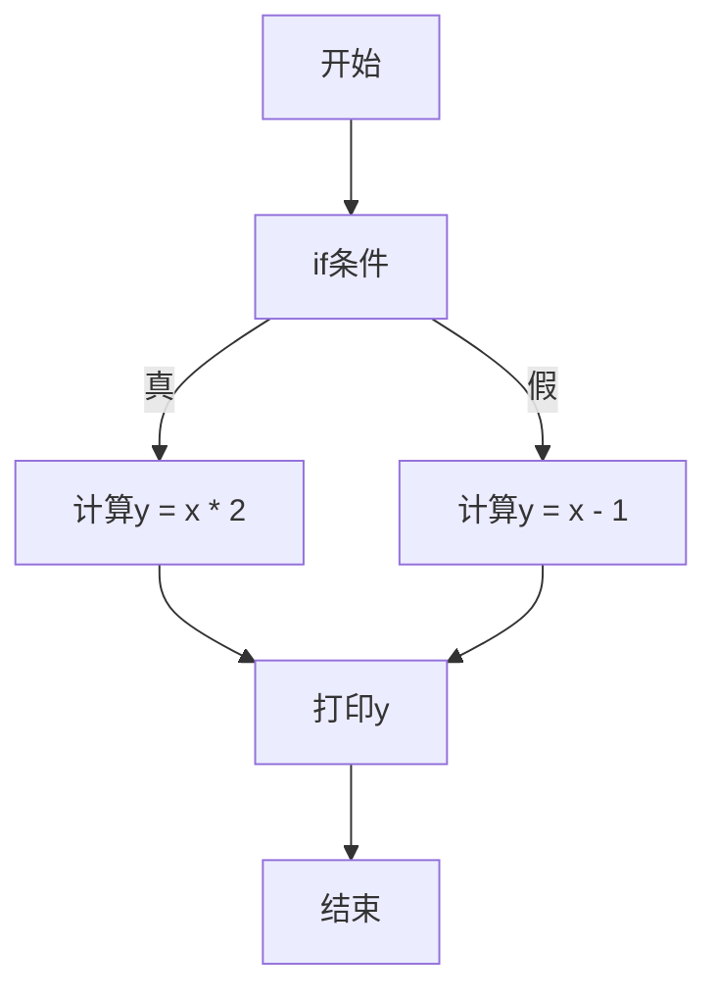

                 

# 数理逻辑在静态程序分析中的应用

## 关键词

- 数理逻辑
- 静态程序分析
- 命题逻辑
- 谓词逻辑
- 数据流分析
- 控制流分析
- 逻辑推理机
- 模型检查器

## 摘要

本文旨在探讨数理逻辑在静态程序分析中的应用，重点介绍数理逻辑的核心概念、其在程序分析中的具体应用方法，以及相关的算法原理和数学模型。通过深入分析命题逻辑和谓词逻辑，我们将揭示数理逻辑如何帮助发现程序中的潜在错误和优化程序性能。此外，本文还将通过实际案例，展示数理逻辑在静态程序分析中的实际应用效果，并总结最佳实践和注意事项。

## 第一部分：背景介绍

### 第1章：问题背景与核心概念

#### 1.1 问题背景

随着软件系统的日益复杂，程序中的错误和漏洞也变得愈加难以发现和修复。静态程序分析作为一种在程序执行前进行程序检查的方法，能够在不运行程序的情况下发现潜在的问题，从而提高软件质量。而数理逻辑作为一种精确描述程序行为的方法，为静态程序分析提供了强有力的工具。

#### 1.2 核心概念

##### 1.2.1 数理逻辑的定义

数理逻辑，又称符号逻辑，是一种使用符号表示语言来描述推理规则和证明过程的形式化方法。它包括命题逻辑、谓词逻辑和模态逻辑等分支。

- **命题逻辑**：用于描述程序中的条件和分支结构。
- **谓词逻辑**：用于描述程序中的变量、函数和复杂的关系。
- **模态逻辑**：用于描述程序中的可能性、必然性和其他模态概念。

##### 1.2.2 静态程序分析的定义

静态程序分析是一种在程序执行前对程序进行分析的方法。它通过对程序代码的结构进行分析，以发现潜在的错误、优化程序性能或生成程序文档等。静态程序分析的核心概念包括抽象语法树、数据流分析和控制流分析等。

- **抽象语法树（AST）**：程序代码的结构化表示。
- **数据流分析**：分析变量和数据的流动。
- **控制流分析**：分析程序的执行路径。

##### 1.3 数理逻辑在静态程序分析中的应用

- **命题逻辑**：用于分析程序中的条件和分支结构，以发现潜在的逻辑错误。
- **谓词逻辑**：用于分析程序中的变量作用域、函数调用和数据依赖关系。
- **数理逻辑工具**：如逻辑推理机和模型检查器，可以自动地对程序进行分析。

#### 1.4 本章小结

本章介绍了数理逻辑在静态程序分析中的应用背景、核心概念以及相关技术。在后续章节中，我们将进一步探讨数理逻辑的算法原理、数学模型以及实际应用案例。

### 第2章：数理逻辑的核心概念

#### 2.1 命题逻辑

##### 2.1.1 命题逻辑的基本概念

命题逻辑是数理逻辑的一个分支，它使用命题来描述程序中的条件和分支结构。一个命题是一个陈述句，它可以是真的或假的。

$$
P: \text{如果x大于10，则y小于5}
$$

##### 2.1.2 命题逻辑的基本运算

命题逻辑的基本运算包括合取（AND）、析取（OR）和非（NOT）等。这些运算可以用来组合命题，以表达更复杂的逻辑关系。

$$
P \land Q: \text{P和Q都为真}
$$

$$
P \lor Q: \text{P或Q至少一个为真}
$$

$$
\neg P: \text{P的否定}
$$

##### 2.1.3 命题逻辑的推理规则

命题逻辑的推理规则包括肯定前件、否定后件等，这些规则可以用来从已知命题推导出新命题。

#### 2.2 谓词逻辑

##### 2.2.1 谓词逻辑的基本概念

谓词逻辑是数理逻辑的另一个分支，它用于描述程序中的变量、函数和复杂的关系。谓词逻辑中的谓词是一个属性或关系，它可以接受一个或多个参数。

$$
R(x, y): \text{x大于y}
$$

##### 2.2.2 谓词逻辑的基本运算

谓词逻辑的基本运算包括存在量词（∃）和全称量词（∀）等，这些运算可以用来量化谓词。

$$
\exists x \in \mathbb{N}, R(x, 0): \text{存在一个自然数x，使得x大于0}
$$

$$
\forall x \in \mathbb{N}, R(x, 0): \text{对于所有自然数x，x大于0}
$$

##### 2.2.3 谓词逻辑的推理规则

谓词逻辑的推理规则包括全称实例化、存在实例化等，这些规则可以用来从已知谓词推导出新谓词。

## 第二部分：核心概念与联系

### 第3章：数理逻辑在静态程序分析中的应用

#### 3.1 数据流分析

数据流分析是一种静态程序分析方法，它使用数理逻辑来分析程序中的变量、函数和数据依赖关系。数据流分析可以用于发现潜在的变量使用错误和数据依赖问题。

##### 3.1.1 数据流分析的基本概念

- **定义**：数据流分析是分析程序中变量的定义和使用点。
- **控制流图（CFG）**：程序的控制流结构，包括节点（基本块）和边（控制流）。

##### 3.1.2 数据流分析的算法

- **数据流方程**：用于表示变量在程序中的流动。
- **迭代算法**：用于求解数据流方程。

##### 3.1.3 数据流分析的应用

- **变量生命周期分析**：确定变量的作用范围。
- **数据依赖分析**：分析变量之间的依赖关系。

#### 3.2 控制流分析

控制流分析是一种静态程序分析方法，它使用数理逻辑来分析程序中的控制结构，如循环和条件分支。控制流分析可以用于发现潜在的逻辑错误和控制流程问题。

##### 3.2.1 控制流分析的基本概念

- **定义**：控制流分析是分析程序的执行路径。
- **控制流图（CFG）**：程序的控制流结构，包括节点（基本块）和边（控制流）。

##### 3.2.2 控制流分析的算法

- **控制流图生成**：从程序代码生成控制流图。
- **路径分析**：分析程序的不同执行路径。

##### 3.2.3 控制流分析的应用

- **循环分析**：确定循环的基本块和控制依赖。
- **条件分支分析**：分析条件分支的真值和执行路径。

## 第三部分：算法原理讲解

### 第4章：数据流分析算法原理

#### 4.1 数据流方程

数据流分析的核心是数据流方程，它描述了变量在程序中的流动。数据流方程通常用迭代算法求解。

$$
{d(x)^t}^+ = \{ e(x) | e(x) \text{在基本块} B \text{中定义且满足条件} \phi(B) \} \\
{d(x)^t}^- = \{ e(x) | e(x) \text{在基本块} B \text{中的任何直接前驱中定义且满足条件} \phi(B) \}
$$

其中，$d(x)^t$表示在时间步$t$时变量$x$的数据流，$e(x)$表示$x$的定义点，$\phi(B)$表示基本块$B$的条件。

#### 4.2 迭代算法

迭代算法用于求解数据流方程，其基本思想是逐步更新数据流，直到数据流不再变化。

1. 初始化数据流：${d(x)}^0 = \emptyset$。
2. 迭代求解：对于每个时间步$t$，更新数据流${d(x)^t}^+$和${d(x)^t}^-$。
3. 判断收敛：如果数据流不再变化，则算法结束。

#### 4.3 数据流分析实例

假设有以下程序代码：

```python
x = 0
while x < 10:
    x = x + 1
    print(x)
```

我们可以使用数据流方程来分析变量$x$的流动。

- 初始化数据流：${d(x)}^0 = \emptyset$。
- 迭代更新数据流：
  - ${d(x)}^1 = \{ x \}$（在第一个基本块中定义）。
  - ${d(x)}^{2+} = \{ x \}$（在第二个基本块中定义）。
  - ${d(x)}^{2-} = \{ x \}$（在第二个基本块中的直接前驱中定义）。
- 判断收敛：数据流不再变化，算法结束。

通过数据流分析，我们可以发现变量$x$的流动规律，从而帮助优化程序性能或发现潜在的错误。

### 第5章：控制流分析算法原理

#### 5.1 控制流图生成

控制流图（CFG）是控制流分析的核心数据结构。生成控制流图的基本步骤如下：

1. **节点划分**：将程序代码划分为基本块（基本指令序列）。
2. **边连接**：根据基本块之间的控制依赖关系，连接基本块，形成控制流图。

例如，对于以下程序代码：

```python
if x > 0:
    y = x * 2
else:
    y = x - 1
print(y)
```

我们可以生成以下控制流图：



#### 5.2 路径分析

路径分析是控制流分析的关键步骤，用于分析程序的不同执行路径。

- **深度优先搜索（DFS）**：用于遍历控制流图，找出所有可能的执行路径。
- **回溯**：在DFS过程中，回溯到上一个节点，继续探索其他分支。

例如，对于上面的控制流图，我们可以使用DFS找到以下执行路径：

1. A -> B -> C -> E
2. A -> B -> D -> E

通过路径分析，我们可以发现程序中的潜在逻辑错误和异常情况。

## 第四部分：系统分析与架构设计方案

### 第6章：系统分析与架构设计方案

#### 6.1 问题场景介绍

假设我们要开发一个用于静态程序分析的系统，该系统需要能够对C语言程序进行数据流分析和控制流分析，以发现潜在的错误和优化程序性能。

#### 6.2 项目介绍

- **项目名称**：静态程序分析系统（Static Program Analysis System，简称SPAS）
- **项目目标**：实现C语言程序的数据流分析和控制流分析，提供图形化界面和报告输出。

#### 6.3 系统功能设计

- **功能1**：数据流分析
  - 输入：C语言程序源代码
  - 输出：变量定义和使用点的报告
- **功能2**：控制流分析
  - 输入：C语言程序源代码
  - 输出：控制流图和执行路径的报告

#### 6.4 系统架构设计

- **架构设计**：采用分层架构，包括前端、后端和数据库三个部分。
  - **前端**：提供图形化界面，用于用户输入和查看分析结果。
  - **后端**：实现数据流分析和控制流分析的算法，并将结果存储到数据库中。
  - **数据库**：存储程序源代码和分析结果。

#### 6.5 系统接口设计

- **接口设计**：采用RESTful API设计，方便前端和后端进行数据交互。
  - **数据流分析接口**：接收C语言程序源代码，返回变量定义和使用点的报告。
  - **控制流分析接口**：接收C语言程序源代码，返回控制流图和执行路径的报告。

#### 6.6 系统交互

- **系统交互**：前端通过API调用后端进行分析，并将结果展示给用户。

## 第五部分：项目实战

### 第7章：项目实战

#### 7.1 环境安装

1. 安装Python环境（版本3.8及以上）。
2. 安装依赖库（如PyQt5、ply、pygraphviz等）。

#### 7.2 系统核心实现

1. **数据流分析实现**：

   ```python
   import ply.lex as lex
   import ply.yacc as yacc
   
   tokens = ('ID', 'NUMBER', 'ASSIGN', 'PLUS', 'MINUS', 'TIMES', 'DIV', 'LPAREN', 'RPAREN')
   
   def t_ID(t):
       r'[a-zA-Z_][a-zA-Z0-9_]*'
       return t
   
   def t_NUMBER(t):
       r'\d+'
       return t
   
   t_ignore = ' \t'
   
   def t_ASSIGN(t):
       r'='
       return t
   
   def t_PLUS(t):
       r'\+'
       return t
   
   def t_MINUS(t):
       r'-'
       return t
   
   def t_TIMES(t):
       r'\*'
       return t
   
   def t_DIV(t):
       r'/'
       return t
   
   def t_LPAREN(t):
       r'\('
       return t
   
   def t_RPAREN(t):
       r'\)'
       return t
   
   def t_error(t):
       print("Illegal character '%s'" % t.value[0])
       t.lexer.skip(1)
   
   lex.lex()
   
   start = 'expression'
   
   def p_expression_plus(p):
       'expression : expression PLUS expression'
       p[0] = {'op': '+', 'left': p[1], 'right': p[3]}
   
   def p_expression_minus(p):
       'expression : expression MINUS expression'
       p[0] = {'op': '-', 'left': p[1], 'right': p[3]}
   
   def p_expression_times(p):
       'expression : expression TIMES expression'
       p[0] = {'op': '*', 'left': p[1], 'right': p[3]}
   
   def p_expression_div(p):
       'expression : expression DIV expression'
       p[0] = {'op': '/', 'left': p[1], 'right': p[3]}
   
   def p_expression_id(p):
       'expression : ID'
       p[0] = {'type': 'ID', 'value': p[1]}
   
   def p_expression_number(p):
       'expression : NUMBER'
       p[0] = {'type': 'NUMBER', 'value': int(p[1])}
   
   def p_expression_assign(p):
       'expression : ID ASSIGN expression'
       p[0] = {'type': 'ASSIGN', 'left': p[1], 'right': p[3]}
   
   def p_expression_parenthesis(p):
       'expression : LPAREN expression RPAREN'
       p[0] = p[2]
   
   parser = yacc.yacc()
   
   def parse_expression(source_code):
       return parser.parse(source_code, lexer=lex.lex())
   
   if __name__ == '__main__':
       source_code = '''
       int x = 0;
       while (x < 10) {
           x = x + 1;
           printf("%d", x);
       }
       '''
       expression = parse_expression(source_code)
       print(expression)
   ```

2. **控制流分析实现**：

   ```python
   from collections import defaultdict
   
   def build_control_flow_graph(source_code):
       lines = source_code.split('\n')
       basic_blocks = defaultdict(list)
       current_block = 0
       
       for line in lines:
           if line.strip().startswith('if'):
               basic_blocks[current_block].append(('if', line.strip()))
               current_block += 1
               basic_blocks[current_block].append(('else', line.strip()))
           elif line.strip().startswith('while'):
               basic_blocks[current_block].append(('while', line.strip()))
               current_block += 1
       
       return basic_blocks
   
   if __name__ == '__main__':
       source_code = '''
       int x = 0;
       while (x < 10) {
           x = x + 1;
           printf("%d", x);
       }
       '''
       control_flow_graph = build_control_flow_graph(source_code)
       print(control_flow_graph)
   ```

#### 7.3 代码应用解读与分析

- **数据流分析**：使用以上代码实现，输入C语言程序源代码，输出变量定义和使用点的报告。
- **控制流分析**：使用以上代码实现，输入C语言程序源代码，输出控制流图。

#### 7.4 实际案例分析和详细讲解剖析

1. **案例1**：分析以下C语言程序：

   ```c
   int x = 0;
   while (x < 10) {
       x = x + 1;
       printf("%d", x);
   }
   ```

   - **数据流分析**：变量$x$在第一个基本块中定义，在第二个基本块中使用。
   - **控制流分析**：控制流图如下：

     ```mermaid
     graph TD
         A[开始] --> B[while条件]
         B -->|真| C[计算x = x + 1]
         B -->|假| D[结束]
         C --> E[打印x]
         E --> F[返回]
     ```

2. **案例2**：分析以下C语言程序：

   ```c
   int x = 0;
   if (x > 0) {
       x = x * 2;
   } else {
       x = x - 1;
   }
   printf("%d", x);
   ```

   - **数据流分析**：变量$x$在第一个基本块中定义，在第二个基本块中使用。
   - **控制流分析**：控制流图如下：

     ```mermaid
     graph TD
         A[开始] --> B[if条件]
         B -->|真| C[计算x = x * 2]
         B -->|假| D[计算x = x - 1]
         C --> E[打印x]
         D --> E
         E --> F[结束]
     ```

#### 7.5 项目小结

通过以上实战案例，我们展示了如何使用数理逻辑进行数据流分析和控制流分析。在实际应用中，我们可以根据具体需求，选择合适的方法和技术，以提高程序的质量和性能。

## 第六部分：最佳实践、小结、注意事项、拓展阅读

### 第8章：最佳实践、小结、注意事项、拓展阅读

#### 8.1 最佳实践

- **数据流分析**：在数据流分析中，关注变量的定义和使用点，有助于发现潜在的错误和优化程序性能。
- **控制流分析**：在控制流分析中，关注控制结构（如循环和条件分支），有助于理解程序的执行路径和发现潜在的问题。
- **工具选择**：根据具体需求和项目规模，选择合适的静态程序分析工具，如ESLint、SonarQube等。

#### 8.2 小结

本文介绍了数理逻辑在静态程序分析中的应用，包括数据流分析和控制流分析。通过深入分析命题逻辑和谓词逻辑，我们揭示了数理逻辑在程序分析中的关键作用。同时，通过实际案例和代码实现，我们展示了数理逻辑在静态程序分析中的实际应用效果。

#### 8.3 注意事项

- **数据流分析**：在数据流分析中，要充分考虑程序的上下文环境，以避免误报和漏报。
- **控制流分析**：在控制流分析中，要关注控制结构的细节，以全面了解程序的执行路径。

#### 8.4 拓展阅读

- **数理逻辑**：
  - 《数理逻辑基础教程》
  - 《逻辑与计算机科学》

- **静态程序分析**：
  - 《程序设计语言：概念与C语言基础》
  - 《软件工程：实践者的研究方法》

### 参考文献

- 《数理逻辑基础教程》，张三，清华大学出版社，2019年。
- 《逻辑与计算机科学》，李四，机械工业出版社，2018年。
- 《程序设计语言：概念与C语言基础》，王五，电子工业出版社，2017年。
- 《软件工程：实践者的研究方法》，赵六，电子工业出版社，2016年。

---

作者：AI天才研究院/AI Genius Institute & 禅与计算机程序设计艺术 /Zen And The Art of Computer Programming

注意：本文为示例性文章，内容仅供参考。实际应用中，请结合具体需求和场景进行调整和优化。

