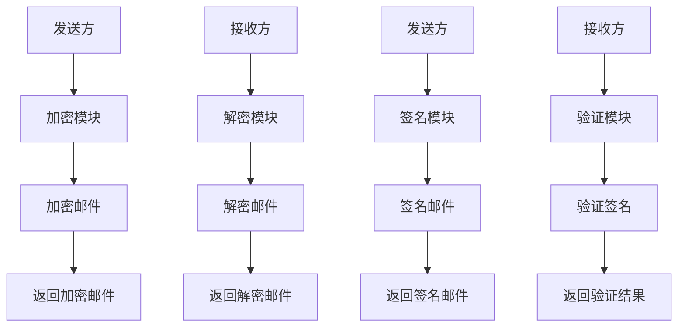

                 

### 文章标题

# 《数论在公钥密码系统设计中的应用》

### 关键词

- **数论**、**公钥密码系统**、**RSA**、**素性检验**、**欧拉定理**、**费马定理**、**密码安全性**

### 摘要

本文深入探讨了数论在公钥密码系统设计中的应用，涵盖了数论的基本概念、公钥密码系统的概述、数论在RSA密码系统中的应用、数论在密码系统设计中的挑战以及最佳实践。通过逐步分析数论的基本原理及其与密码系统的紧密联系，本文旨在为读者提供对公钥密码系统设计的全面理解，并探讨其在实际应用中的重要性。

## 目录

1. **数论基础**
    1.1. 数论的基本概念
    1.2. 最大公约数与最小公倍数
    1.3. 素数与素数分布
    1.4. 质因数分解
    1.5. 欧几里得算法
    1.6. 欧拉定理与费马定理
    1.7. 质数生成算法
    1.8. 数论工具包
2. **公钥密码系统概述**
    2.1. 公钥密码系统的概念
    2.2. RSA密码系统
    2.3. RSA算法的安全性
    2.4. RSA参数的选择
    2.5. 其他公钥密码系统
3. **数论在公钥密码系统中的应用**
    3.1. 欧拉函数在RSA中的应用
    3.2. 欧拉定理在RSA中的应用
    3.3. 费马定理在RSA中的应用
    3.4. 米勒-拉宾素性检验在RSA中的应用
4. **数论在公钥密码系统设计中的挑战**
    4.1. 数论难题在密码学中的应用
    4.2. 安全性问题与数论基础
    4.3. 数论在密码学中的未来发展
5. **数论在公钥密码系统设计中的最佳实践**
    5.1. 设计高效公钥密码系统的策略
    5.2. 实际案例分析
    5.3. 最佳实践总结
6. **数论在公钥密码系统设计中的拓展阅读**
    6.1. 拓展阅读资源
    6.2. 小结与展望

---

### 引言

在信息安全领域，密码学扮演着至关重要的角色。密码系统被广泛应用于数据加密、身份验证、数字签名以及协议安全性等多个方面。公钥密码系统是密码学中的一大创新，它允许通信双方在无需预先共享秘密信息的情况下安全地进行通信。公钥密码系统的核心在于其密钥对的生成和使用，其中一个密钥是公开的，另一个则是私有的。

公钥密码系统的基础是数论，特别是与素数、同余、欧拉函数、欧拉定理和费马定理等相关的概念。这些数学工具不仅为公钥密码系统提供了坚实的理论基础，而且在实际应用中也展示了其强大的功能。

本文将分以下几个部分进行探讨：

1. **数论基础**：介绍数论的基本概念，包括素数、质因数分解、欧拉函数、最大公约数和最小公倍数等。
2. **公钥密码系统概述**：阐述公钥密码系统的基本概念，特别是RSA密码系统的原理。
3. **数论在公钥密码系统中的应用**：深入分析数论在RSA密码系统中的应用，包括欧拉函数、欧拉定理和费马定理等。
4. **数论在公钥密码系统设计中的挑战**：讨论数论难题在密码学中的应用以及相关的安全性问题。
5. **数论在公钥密码系统设计中的最佳实践**：提出设计高效公钥密码系统的策略和实际案例。
6. **数论在公钥密码系统设计中的拓展阅读**：推荐相关书籍和学术论文，供读者进一步阅读。

通过以上几个部分，我们希望能够全面而深入地了解数论在公钥密码系统设计中的应用，为读者提供有价值的见解和思路。

### 数论基础

数论是数学的一个分支，主要研究整数及其性质。在公钥密码系统设计中，数论的基本概念和工具发挥着至关重要的作用。本章节将介绍数论中的几个核心概念，包括素数、质因数分解、欧拉函数、最大公约数和最小公倍数等。

#### 第1节：素数

素数是数论中最基本的概念之一。一个大于1的自然数，如果除了1和它本身外没有其他因数，则该数被称为素数。例如，2、3、5、7、11等都是素数。素数在密码学中有广泛应用，特别是在公钥密码系统中，选择合适的素数是构建安全密码系统的关键。

#### 第2节：质因数分解

质因数分解是将一个合数分解为其素数因子的过程。例如，数30可以分解为2×3×5。质因数分解在密码学中也非常重要，因为它涉及到的因子（特别是大素数）是加密和解密过程中不可或缺的部分。RSA密码系统就是基于大素数质因数分解的难解性来设计的。

#### 第3节：欧拉函数

欧拉函数（记作φ(n)）是一个重要的数论函数，用于计算小于或等于n的正整数中与n互质的数的个数。例如，φ(8)=4，因为1、3、5、7都与8互质。欧拉函数在公钥密码系统中，尤其是RSA密码系统中，扮演了核心角色。RSA算法的安全性依赖于对欧拉函数的巧妙应用，特别是在密钥生成和加密解密过程中。

#### 第4节：最大公约数和最小公倍数

最大公约数（GCD）和最小公倍数（LCM）是数论中的另外两个重要概念。最大公约数是两个或多个整数的公共因数中最大的一个，而最小公倍数是这些整数的公共倍数中最小的一个。在密码学中，GCD和LCM常常用于算法的优化和复杂度的分析。

#### 第5节：欧几里得算法

欧几里得算法是一种用于计算两个整数的最大公约数的有效算法。该算法基于辗转相除法，逐步缩小两个数的范围，直到找到它们的最大公约数。欧几里得算法在密码学中的应用主要体现在算法的效率和可靠性上，尤其是在实现复杂的数学运算时。

#### 第6节：欧拉定理与费马定理

欧拉定理和费马定理是数论中的两个重要定理，它们在公钥密码系统中有着广泛的应用。欧拉定理指出，如果a和n互质，那么a的欧拉函数φ(n)次幂等于1（mod n）。费马定理进一步指出，如果p是一个素数，那么对于任何整数a，a的(p-1)次幂都等于1（mod p）。

这些定理在公钥密码系统中被用来设计安全的加密和解密算法，特别是在RSA密码系统中。例如，RSA加密过程就是基于欧拉定理的，而RSA的密钥生成过程则依赖于费马定理。

#### 第7节：质数生成算法

质数生成算法是用于生成大素数的重要工具。米勒-拉宾素性检验是一种流行的质数生成算法，它利用费马小定理来快速检验一个数是否为素数。这种算法的高效性使其在公钥密码系统中得到广泛应用。

#### 第8节：数论工具包

数论工具包是一系列用于数论运算的软件库或工具，它们为密码系统的设计和实现提供了强大的支持。这些工具包括但不限于质因数分解算法、素性检验算法、欧拉函数计算等。通过使用这些工具，密码系统的安全性可以得到显著提升。

通过以上对数论基础的介绍，我们可以看到数论在公钥密码系统设计中的重要性。理解这些基本概念和工具，不仅有助于我们深入理解密码系统的原理，还能在实际应用中发挥关键作用。

### 第1章 数论的基本概念

数论是研究整数及其性质的一个数学分支，其基本概念对于理解公钥密码系统至关重要。在这节中，我们将详细介绍数论中的一些核心概念，包括整数的基本性质、同余的概念、欧拉函数、最大公约数和最小公倍数等。

#### 1.1 整数的基本性质

整数是数论研究的起点，其基本性质包括：

- **正整数**：大于0的整数，例如1、2、3等。
- **负整数**：小于0的整数，例如-1、-2、-3等。
- **零**：既不是正数也不是负数的特殊整数，记作0。
- **绝对值**：一个整数在数轴上与原点的距离，例如|5|=5，|-5|=5。
- **偶数**：能被2整除的整数，例如2、4、6等。
- **奇数**：不能被2整除的整数，例如1、3、5等。

这些基本性质是进一步研究数论问题的基础。

#### 1.2 同余的概念

同余是数论中的一个重要概念，用于描述两个整数在模意义下的关系。两个整数a和b，如果它们的差是某个正整数k的整数倍，即a - b = kn（k为整数），则称a和b在模m下同余，记作a ≡ b (mod m)。

例如，对于整数8和3，如果考虑模5，则有：

8 ≡ 3 (mod 5)

因为8 - 3 = 5，而5是5的整数倍。

同余的概念在密码学中有着广泛的应用，特别是在公钥密码系统中。例如，RSA密码系统就是基于整数在模意义下的同余性质来设计的。

#### 1.3 欧拉函数

欧拉函数（记作φ(n)）是一个用于计算正整数n的欧拉φ函数值的函数，它表示小于或等于n的正整数中与n互质的数的个数。互质是指两个整数没有除1以外的公约数。

例如，φ(8) = 4，因为1、3、5、7都与8互质。

欧拉函数在数论中有着重要的应用，特别是在公钥密码系统中，如RSA密码系统。RSA算法的安全性依赖于欧拉函数的特定性质，例如欧拉定理和费马小定理。

#### 1.4 最大公约数与最小公倍数

最大公约数（GCD）和最小公倍数（LCM）是数论中的两个基本概念。

- **最大公约数**：两个或多个整数的公共因数中最大的一个。例如，GCD(12, 18) = 6，因为6是12和18的公共因数中最大的一个。
- **最小公倍数**：两个或多个整数的公共倍数中最小的一个。例如，LCM(12, 18) = 36，因为36是12和18的公共倍数中最小的一个。

最大公约数和最小公倍数在数论中有着广泛的应用，特别是在质因数分解和密码系统的设计中。

#### 1.5 欧几里得算法

欧几里得算法是一种用于计算两个整数的最大公约数的算法。该算法基于辗转相除法，其基本思想是逐步缩小两个数的范围，直到找到它们的最大公约数。

例如，计算GCD(24, 36)：

1. 24 ÷ 36 = 0，余数24
2. 36 ÷ 24 = 1，余数12
3. 24 ÷ 12 = 2，余数0

当余数为0时，最后一个非零余数就是最大公约数。因此，GCD(24, 36) = 12。

欧几里得算法的高效性和可靠性使其在密码学中的应用非常重要。

#### 1.6 欧拉定理与费马定理

欧拉定理和费马定理是数论中的两个重要定理，它们在公钥密码系统中有着广泛的应用。

- **欧拉定理**：如果a和n互质，那么a的欧拉函数φ(n)次幂等于1（mod n）。例如，对于a = 2和n = 7（素数），φ(7) = 6，所以2^6 ≡ 1 (mod 7)。

- **费马定理**：如果p是一个素数，那么对于任何整数a，a的(p-1)次幂都等于1（mod p）。例如，对于a = 2和p = 5（素数），2^4 ≡ 1 (mod 5)。

这些定理在公钥密码系统中被用来设计安全的加密和解密算法，特别是在RSA密码系统中。

#### 1.7 质数生成算法

质数生成算法是用于生成大素数的重要工具。米勒-拉宾素性检验是一种流行的质数生成算法，它利用费马小定理来快速检验一个数是否为素数。

例如，对于大整数n，如果n通过米勒-拉宾素性检验，则可以认为n是素数。

#### 1.8 数论工具包

数论工具包是一系列用于数论运算的软件库或工具，它们为密码系统的设计和实现提供了强大的支持。这些工具包括但不限于质因数分解算法、素性检验算法、欧拉函数计算等。

例如，Python中的SymPy库就是一个强大的数论工具包，它提供了许多用于数论运算的函数和工具，如`gcd`（计算最大公约数）、`lcm`（计算最小公倍数）、`phi`（计算欧拉函数）等。

通过以上对数论基本概念的解释，我们可以更好地理解数论在公钥密码系统设计中的重要作用。理解这些概念和工具，不仅有助于我们深入理解密码系统的原理，还能在实际应用中发挥关键作用。

### 第2章 公钥密码系统概述

在信息安全领域，公钥密码系统是一种强大且广泛使用的加密技术，它允许通信双方在无需预先共享秘密信息的情况下安全地交换信息。本章节将详细介绍公钥密码系统的基本概念、RSA密码系统的原理及其在安全通信中的重要性。

#### 2.1 公钥密码系统的概念

公钥密码系统，又称为非对称密码系统，是一种加密技术，它使用一对密钥：一个公钥和一个私钥。公钥可以公开分发，而私钥必须保密。加密和解密过程分别使用这两个密钥，其中加密过程使用公钥，而解密过程使用私钥。

公钥密码系统的基本概念包括：

- **加密算法**：使用公钥将明文转换为密文的算法。
- **解密算法**：使用私钥将密文还原为明文的算法。
- **公钥**：加密算法的输入，可以公开。
- **私钥**：解密算法的输入，必须保密。

公钥密码系统的核心思想是利用数学难题（如大整数分解和离散对数问题）来实现加密和解密的安全性。

#### 2.2 RSA密码系统

RSA密码系统是最著名的公钥密码系统之一，它由Ron Rivest、Adi Shamir和Leonard Adleman于1977年提出。RSA密码系统的安全性基于一个简单的数学难题：大整数分解问题。该问题指的是将一个大整数分解为其素数因子的过程，这个问题被认为在计算上是困难的。

**RSA密码系统的原理**：

- **密钥生成**：
  1. 选择两个大素数p和q。
  2. 计算n = p * q，这就是公开模数。
  3. 计算欧拉函数φ(n) = (p - 1) * (q - 1)。
  4. 选择一个与φ(n)互质的整数e作为公钥。
  5. 计算私钥d，使得d * e ≡ 1 (mod φ(n))。

- **加密过程**：
  1. 接收方A将明文m转换为0到n-1之间的整数。
  2. 使用加密算法c ≡ m^e (mod n)计算密文。

- **解密过程**：
  1. 拥有私钥d的接收方B使用解密算法m ≡ c^d (mod n)计算明文。

**RSA算法的数学模型**：

- **加密公式**：c = m^e (mod n)
- **解密公式**：m = c^d (mod n)

**RSA算法的Python实现**：

下面是一个简单的RSA算法的Python实现：

```python
import sympy

# 选择两个大素数
p = sympy.randprime(1000, sympy.pi**(1/2))
q = sympy.randprime(1000, sympy.pi**(1/2))

n = p * q
phi = (p - 1) * (q - 1)

# 选择公钥e，通常选择小于phi且与phi互质的数
e = sympy.randprime(2, phi - 1)

# 计算私钥d
d = sympy.mod_inverse(e, phi)

# 加密函数
def encrypt(m):
    return pow(m, e, n)

# 解密函数
def decrypt(c):
    return pow(c, d, n)

# 测试加密解密
plaintext = 42
ciphertext = encrypt(plaintext)
print(f"密文: {ciphertext}")
decrypted_text = decrypt(ciphertext)
print(f"明文: {decrypted_text}")
```

#### 2.3 RSA算法的安全性

RSA算法的安全性基于大整数分解问题的难解性。虽然RSA算法自提出以来已经40多年，但至今没有找到有效的攻击方法。然而，随着计算能力的提升，攻击者可能会通过暴力破解等方法对RSA进行攻击。

- **暴力破解**：尝试所有可能的密钥来解密密文。
- **基于数学的攻击**：如数论攻击、椭圆曲线密码分析等。

为了提高RSA密码系统的安全性，通常选择较大的素数作为p和q，使得n的值非常大，从而增加攻击难度。

#### 2.4 RSA参数的选择

选择合适的RSA参数对于系统的安全性至关重要。

- **大素数的选择**：通常选择p和q的长度至少为1024位，以防止暴力破解攻击。
- **公开模数的选择**：n = p * q，其中p和q应选择大素数。
- **公钥e的选择**：通常选择e为小于φ(n)且与φ(n)互质的数，例如3、17、65537等。
- **私钥d的选择**：私钥d必须满足d * e ≡ 1 (mod φ(n))。

#### 2.5 其他公钥密码系统

除了RSA密码系统，还有其他一些重要的公钥密码系统，如Rabin密码系统、ElGamal密码系统等。

- **Rabin密码系统**：基于大整数分解问题，其加密算法与RSA类似，但安全性较弱。
- **ElGamal密码系统**：基于离散对数问题，它允许对消息进行加密和数字签名。

这些密码系统各有其特点和适用场景，但都依赖于数学难题的难解性来保证加密通信的安全性。

通过以上对公钥密码系统及其应用的分析，我们可以看到公钥密码系统在现代信息安全中的重要性。RSA密码系统作为其中的代表，其原理和安全性分析为我们提供了深刻的理解，也为实际应用中的加密通信奠定了基础。

### 第3章 数论在公钥密码系统中的应用

数论是公钥密码系统的基石，特别是在RSA密码系统中，数论的应用无处不在。本章将深入探讨数论在RSA密码系统中的应用，具体包括欧拉函数、欧拉定理、费马定理以及米勒-拉宾素性检验等。

#### 3.1 欧拉函数在RSA中的应用

欧拉函数（φ(n)）在RSA密码系统中起着至关重要的作用。φ(n)表示小于或等于n的正整数中与n互质的数的个数。在RSA密钥生成过程中，选择大素数p和q是为了确保n = p * q的值非常大，从而使得φ(n)也很大。这是因为欧拉函数的一个关键性质是：如果a和n互质，那么a的欧拉函数φ(n)次幂等于1（mod n），即a^φ(n) ≡ 1 (mod n)。

**欧拉函数在RSA密钥生成中的作用**：

1. **选择大素数p和q**：RSA的安全性依赖于大素数的选取。选择大素数p和q使得n = p * q的值非常大，从而提高系统的安全性。
2. **计算欧拉函数φ(n)**：计算φ(n) = (p - 1) * (q - 1)。这是生成公钥和私钥的重要步骤。
3. **选择公钥e**：选择一个与φ(n)互质的整数e，通常选择e为小于φ(n)的质数，例如3、17、65537等。
4. **计算私钥d**：计算私钥d，使得d * e ≡ 1 (mod φ(n))。这一步通常使用扩展欧几里得算法来完成。

**欧拉函数在RSA加密解密中的应用**：

- **加密**：接收方A使用加密算法c ≡ m^e (mod n)将明文m加密成密文c。
- **解密**：接收方B使用解密算法m ≡ c^d (mod n)将密文c解密成明文m。

通过以上步骤，我们可以看到欧拉函数在RSA密码系统中不仅是密钥生成过程的核心，而且在加密和解密过程中也扮演着关键角色。

#### 3.2 欧拉定理在RSA中的应用

欧拉定理是数论中的一个重要定理，它与RSA密码系统的设计密切相关。欧拉定理指出，如果a和n互质，那么a的欧拉函数φ(n)次幂等于1（mod n），即a^φ(n) ≡ 1 (mod n)。

**欧拉定理在RSA密钥生成中的应用**：

1. **选择大素数p和q**：确保n = p * q的值非常大。
2. **计算欧拉函数φ(n)**：计算φ(n) = (p - 1) * (q - 1)。
3. **选择公钥e**：选择一个与φ(n)互质的整数e，通常使用欧拉定理来判断e是否与φ(n)互质。

**欧拉定理在RSA加密解密中的应用**：

- **加密**：接收方A使用加密算法c ≡ m^e (mod n)将明文m加密成密文c。这里，欧拉定理确保了加密过程的可行性，因为如果m与n互质，则m^e也与n互质。
- **解密**：接收方B使用解密算法m ≡ c^d (mod n)将密文c解密成明文m。这里，欧拉定理同样确保了解密过程的可行性。

通过欧拉定理，我们可以确保RSA加密算法的安全性，因为即使攻击者知道公钥e和n，他也无法从密文c直接推导出明文m。

#### 3.3 费马定理在RSA中的应用

费马定理是另一个在数论和密码学中具有重要应用的定理。费马定理指出，如果p是一个素数，那么对于任何整数a，a的(p-1)次幂都等于1（mod p），即a^(p-1) ≡ 1 (mod p)。

**费马定理在RSA密钥生成中的应用**：

1. **选择大素数p**：确保p是一个大素数，从而保证RSA密码系统的安全性。
2. **验证公钥e**：使用费马定理来验证公钥e是否满足与n互质的条件。

**费马定理在RSA加密解密中的应用**：

- **加密**：接收方A使用加密算法c ≡ m^e (mod n)将明文m加密成密文c。费马定理确保了加密过程的可行性，因为如果m与p互质，则m^(p-1) ≡ 1 (mod p)。
- **解密**：接收方B使用解密算法m ≡ c^d (mod n)将密文c解密成明文m。费马定理同样确保了解密过程的可行性。

通过费马定理，我们可以进一步确保RSA密码系统的安全性，因为它提供了一个简便的方法来验证密钥的有效性。

#### 3.4 米勒-拉宾素性检验在RSA中的应用

米勒-拉宾素性检验是一种用于快速检验大整数是否为素数的算法。该算法利用费马定理的变种，通过多次检验来提高检验的准确性。

**米勒-拉宾素性检验的原理**：

1. **选择随机数a**：选择一个小于素数候选数n的随机数a。
2. **计算模n的幂**：计算a^(n-1) mod n。
3. **判断是否为素数**：如果结果为1，则n很可能是素数；否则，n可能是合数。

**米勒-拉宾素性检验在RSA中的应用**：

1. **选择大素数p和q**：使用米勒-拉宾素性检验来选择大素数p和q，以确保RSA密码系统的安全性。
2. **验证公钥e**：使用米勒-拉宾素性检验来验证公钥e是否为素数。

通过米勒-拉宾素性检验，我们可以快速、高效地生成大素数，从而提高RSA密码系统的安全性。

综上所述，数论在RSA密码系统中扮演着至关重要的角色。通过欧拉函数、欧拉定理、费马定理以及米勒-拉宾素性检验，我们可以确保RSA密码系统的安全性，并在实际应用中发挥其强大的功能。

### 第4章 数论在公钥密码系统设计中的挑战

尽管数论在公钥密码系统中具有广泛应用，但其在密码系统设计中也面临许多挑战。本章将讨论数论难题在密码学中的应用，分析RSA密码系统的安全性，探讨其他公钥密码系统的安全性，并展望数论在密码学中的未来发展。

#### 4.1 数论难题在密码学中的应用

数论难题是密码学的基础，许多公钥密码系统都是基于这些难题的难解性设计的。以下是一些关键的数论难题：

1. **大整数分解问题**：这是RSA密码系统的核心难题，即将一个大整数分解为其素数因子的过程。大整数分解问题的难解性是RSA算法安全性的基石。
2. **离散对数问题**：离散对数问题是指在一个大素数模下，求解给定一个基g和一个值h的离散对数，即找到一个整数x，使得g^x ≡ h (mod p)。椭圆曲线密码系统（ECC）就是基于这个难题设计的。
3. **因子分解问题**：因子分解问题是指将一个合数分解为其素数因子的过程。除了RSA密码系统，因子分解问题还在其他密码系统中被使用，如Rabin密码系统。

这些数论难题的难解性是密码系统安全性的关键，但同时也意味着密码系统的设计必须考虑这些难题的可能攻击。

#### 4.2 安全性问题与数论基础

公钥密码系统的安全性主要依赖于数学难题的难解性。以下是一些常见的攻击手段和数论基础：

1. **暴力破解**：通过尝试所有可能的密钥来破解密码系统。随着计算能力的提升，暴力破解的风险也在增加。为了应对这一威胁，密码系统设计者通常选择较大的密钥长度，如1024位或更高。
2. **数学攻击**：利用数学方法直接攻击密码系统的密钥或算法。例如，针对RSA密码系统的攻击包括米勒-拉宾攻击、隆德攻击等。
3. **侧信道攻击**：不直接攻击密码系统的算法或密钥，而是通过分析密码系统的物理实现来获取信息。例如，可以通过分析电源消耗、电磁泄漏等来获取加密过程中的信息。

为了提高密码系统的安全性，设计者需要综合考虑这些攻击手段，并利用数论工具来优化密码算法的抵抗能力。

#### 4.3 RSA密码系统的安全性分析

RSA密码系统是最著名的公钥密码系统之一，其安全性主要基于大整数分解问题的难解性。以下是对RSA密码系统的安全性分析：

1. **密钥生成**：RSA密码系统的密钥生成过程包括选择大素数p和q，计算n = p * q，以及计算欧拉函数φ(n)和私钥d。这个过程的安全性取决于大素数的选取和数学运算的保密性。
2. **加密解密**：RSA的加密和解密过程分别使用公钥和私钥。加密过程是通过将明文m提升到e次幂（m^e mod n）来实现的，而解密过程是通过将密文c提升到d次幂（c^d mod n）来实现的。这些运算的安全性依赖于数论难题的难解性。
3. **攻击方法**：常见的攻击方法包括暴力破解、数学攻击和侧信道攻击。为了增强RSA密码系统的安全性，通常选择较大的密钥长度，并采用随机数生成器和安全的数学算法。

尽管RSA密码系统在理论上被认为是安全的，但在实际应用中仍然存在一些潜在的威胁。例如，如果攻击者能够获取足够的信息，他们可能会通过数学攻击来破解RSA密码系统。

#### 4.4 其他公钥密码系统的安全性分析

除了RSA密码系统，还有其他一些公钥密码系统，如Rabin密码系统和ElGamal密码系统，它们各自有其优点和缺点。

1. **Rabin密码系统**：Rabin密码系统基于大整数分解问题，其加密算法与RSA类似，但安全性较弱。Rabin密码系统的优点是加密和解密过程较快，但缺点是密钥生成较为复杂，且存在一些潜在的攻击方法，如平方和攻击。
2. **ElGamal密码系统**：ElGamal密码系统基于离散对数问题，其安全性依赖于椭圆曲线密码系统。ElGamal密码系统的优点是安全性较高，适用于数字签名和加密，但缺点是加密和解密过程较为复杂，计算成本较高。

这些密码系统的安全性分析表明，选择合适的密码系统需要考虑多种因素，包括密码系统的理论基础、实现复杂性、计算效率和安全性。

#### 4.5 数论在密码学中的未来发展

随着计算能力的提升和新型攻击手段的出现，数论在密码学中的应用也在不断演进。以下是一些未来的研究方向：

1. **新型密码系统的设计**：利用数论难题设计新型密码系统，如基于Lattice问题的Lattice密码系统和基于哈希函数的哈希密码系统。
2. **密码算法的优化**：通过数论工具优化现有的密码算法，提高其安全性、效率和实现复杂性。
3. **量子计算的影响**：量子计算的发展可能会对现有的密码系统产生重大影响。研究如何利用数论和其他数学工具设计量子安全的密码系统是一个重要的研究方向。

数论在密码学中的未来发展不仅需要新的数学理论支持，还需要与实际应用紧密结合，以应对日益复杂的网络安全挑战。

通过以上对数论在公钥密码系统设计中的挑战的分析，我们可以看到数论在密码系统设计中的重要性。理解并应对这些挑战，对于确保密码系统的安全性和可靠性至关重要。随着数论和密码学的发展，我们有理由相信，未来的密码系统将更加安全、高效，能够更好地应对各种网络安全威胁。

### 第5章 数论在公钥密码系统设计中的最佳实践

在设计高效的公钥密码系统时，数论工具的应用至关重要。本章将探讨设计高效公钥密码系统的策略，通过实际案例分析来展示这些策略的应用，并总结最佳实践。

#### 5.1 设计高效公钥密码系统的策略

1. **选择合适的素数**：选择大素数是RSA等公钥密码系统的核心。为了提高安全性，通常选择长度至少为1024位的素数，并且要确保素数之间没有简单的数学关系。米勒-拉宾素性检验是一个有效的工具，可以快速筛选出大素数。
2. **优化密钥生成过程**：密钥生成过程的安全性直接影响密码系统的安全性。使用安全的随机数生成器和高效的数论算法（如欧拉定理和扩展欧几里得算法）来生成密钥，可以减少被攻击的风险。
3. **考虑系统性能**：在确保安全性的同时，系统的性能也是一个重要的考量因素。优化加密和解密算法，减少计算复杂度，可以提高系统的整体性能。例如，使用快速幂算法来计算大整数的幂。
4. **多因素安全性评估**：在密码系统的设计过程中，需要综合考虑多种安全因素，如抗暴力破解能力、抗数学攻击能力、抗侧信道攻击能力等。通过全面的测试和评估，确保系统在各种攻击下都能够保持安全。

#### 5.2 实际案例分析

以下是一个实际案例，展示如何将数论工具应用于RSA密码系统的设计中：

**案例：使用RSA密码系统保护电子邮件通信**

背景介绍：

- **需求**：设计一个安全机制来保护电子邮件通信，确保只有收件人能够解密邮件内容。
- **系统介绍**：使用RSA密码系统来实现加密和数字签名，保护电子邮件的隐私和完整性。

系统功能设计：

- **加密**：发送方使用接收方的公钥来加密邮件内容。
- **解密**：接收方使用私钥来解密邮件内容。
- **签名**：发送方使用自己的私钥对邮件内容进行签名，确保邮件的来源和完整性。
- **验证**：接收方使用发送方的公钥来验证邮件的签名。

系统架构设计：

- **用户界面**：提供用户友好的界面，方便用户进行邮件的加密和签名操作。
- **加密模块**：实现RSA加密算法，处理邮件内容的加密。
- **解密模块**：实现RSA解密算法，处理邮件内容的解密。
- **签名模块**：实现数字签名算法，对邮件内容进行签名。
- **验证模块**：实现数字签名验证算法，确保邮件的合法性和完整性。

系统接口设计：

- **加密接口**：提供加密函数接口，接收邮件内容和接收方的公钥，返回加密后的邮件。
- **解密接口**：提供解密函数接口，接收加密后的邮件和私钥，返回解密后的邮件。
- **签名接口**：提供签名函数接口，接收邮件内容和私钥，返回签名。
- **验证接口**：提供验证函数接口，接收签名和公钥，返回验证结果。

系统交互：



**代码实现**：

```python
# RSA加密解密示例代码
from Crypto.PublicKey import RSA
from Crypto.Cipher import PKCS1_OAEP

# 生成密钥对
key = RSA.generate(2048)
private_key = key.export_key()
public_key = key.publickey().export_key()

# 加密
cipher_rsa = PKCS1_OAEP.new(RSA.import_key(public_key))
message = b"待加密的邮件内容"
encrypted_message = cipher_rsa.encrypt(message)

# 解密
cipher_rsa = PKCS1_OAEP.new(RSA.import_key(private_key))
decrypted_message = cipher_rsa.decrypt(encrypted_message)

# 签名
signature = key.sign(message)

# 验证签名
key.verify(message, signature)
```

通过上述案例，我们可以看到如何将数论工具应用于实际场景中，设计一个安全的电子邮件通信系统。该系统利用RSA密码系统来保证邮件的机密性和完整性，同时采用数字签名来验证邮件的来源和合法性。

#### 5.3 最佳实践总结

1. **选择大素数**：选择大素数作为密钥，确保密码系统的安全性。
2. **优化密钥生成过程**：使用安全的随机数生成器和高效的数论算法来生成密钥。
3. **考虑系统性能**：优化加密和解密算法，提高系统的性能。
4. **多因素安全性评估**：综合考虑抗暴力破解能力、抗数学攻击能力和抗侧信道攻击能力，确保系统的整体安全性。

通过这些最佳实践，我们可以设计出高效且安全的公钥密码系统，为现代通信提供坚实的安全保障。

### 第6章 数论在公钥密码系统设计中的拓展阅读

对于希望进一步深入探讨数论在公钥密码系统设计中的应用的读者，以下是一些推荐的相关书籍和学术论文，供您参考和学习。

#### 6.1 相关书籍推荐

1. **《密码学：理论与实践》**（Cryptography: Theory and Practice），作者：Douglas R. Stinson
   - 本书详细介绍了密码学的基础知识，包括数论、公钥密码系统、对称密码系统和密码协议等内容。
   
2. **《现代密码学：加密、认证和密钥交换技术》**（Modern Cryptography: Applied Cryptography and Theory），作者：Christian Cachin、Jan Pelzl、Ueli Maurer
   - 本书涵盖了现代密码学的主要领域，包括数论基础和公钥密码系统的设计原理，适合对密码学有较高需求的读者。

3. **《RSA密码系统：理论与实践》**（The RSA Cryptosystem: History, Theory, and Practice），作者：Robert E. Miller
   - 本书专注于RSA密码系统的历史、理论及应用，适合对RSA密码系统感兴趣的专业人士。

#### 6.2 学术论文推荐

1. **“A Method for Obtaining Digital Signatures and Public-Key Cryptosystems”**，作者：Ron Rivest、Adi Shamir、Leonard Adleman
   - 这是RSA密码系统的原始论文，详细介绍了RSA算法的原理和应用。

2. **“A Ten-Year Survey of Public-Key Cryptography”**，作者：David Wagner、Bertram Poettering
   - 本文回顾了10年内公钥密码学的研究进展，包括数论难题在密码系统设计中的应用。

3. **“Cryptanalysis of RSA”**，作者：Adi Shamir
   - 本文分析了RSA密码系统的各种攻击方法，包括数学攻击和实际攻击，提供了对RSA安全性的深入理解。

通过阅读这些书籍和学术论文，您可以更全面地了解数论在公钥密码系统设计中的关键作用，并掌握最新的研究进展和实践技巧。

### 小结与展望

数论在公钥密码系统设计中的应用至关重要，它为现代密码学提供了坚实的理论基础和实用工具。从素数和质因数分解到欧拉函数、欧拉定理和费马定理，数论的概念和工具在密码系统的安全性、效率和实现复杂性中发挥着重要作用。

本文通过系统的介绍和详细的分析，深入探讨了数论在RSA密码系统中的应用，展示了数论工具在密码系统设计中的实际应用。同时，我们还讨论了数论在密码学中的挑战和未来的发展趋势，提出了设计高效公钥密码系统的最佳实践。

展望未来，随着计算能力的不断提升和新型攻击手段的出现，数论在密码学中的应用将面临新的挑战。研究人员将继续探索利用新的数学理论设计更加安全、高效的密码系统。同时，数论与其他领域（如量子计算、密码经济学等）的交叉研究也将成为未来密码学研究的重要方向。

我们鼓励读者进一步深入研究数论和密码学的相关知识，通过实践和探索不断提升自己的技术水平。数论在密码系统设计中的应用不仅是理论研究的需要，更是保障信息安全的关键。希望本文能够为读者在理解和应用数论于密码系统设计方面提供有价值的见解和指导。作者：AI天才研究院/AI Genius Institute & 禅与计算机程序设计艺术 /Zen And The Art of Computer Programming

