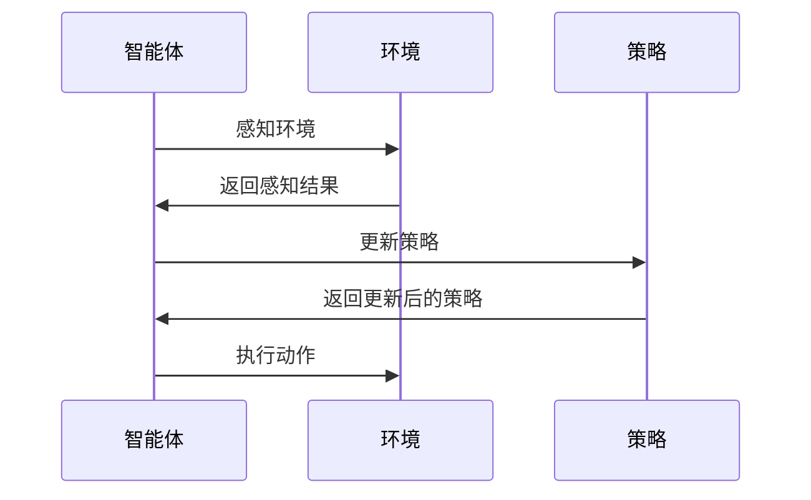
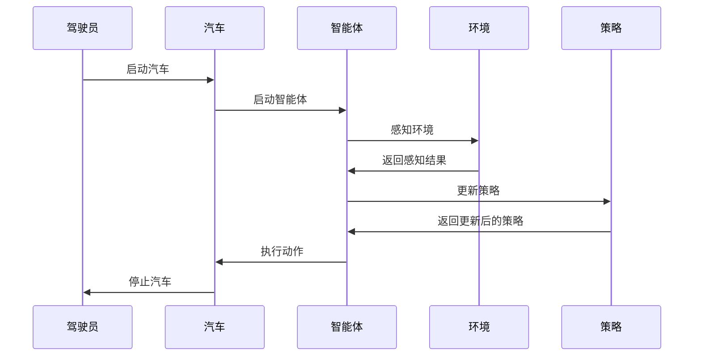

                 

### 文章标题

# 无监督奖励模型训练：可能性与局限性

### 文章关键词

- 无监督奖励模型
- 模型训练
- 可能性分析
- 局限性探讨

### 文章摘要

本文深入探讨了无监督奖励模型训练的可能性与局限性。首先，我们介绍了无监督奖励模型的基本概念、发展历程和核心原理，接着分析了其设计原则、数学模型和实现方法。然后，通过一个实际案例，详细阐述了无监督奖励模型的应用实战。最后，我们总结了最佳实践，探讨了无监督奖励模型未来的发展前景，并提出了相关的注意事项和拓展阅读。

## 背景介绍

### 核心概念术语说明

- **无监督奖励模型**：一种无需外部监督信号，仅通过内部状态转移进行训练的模型。
- **训练**：通过输入数据使模型学习并优化其参数的过程。
- **可能性**：模型在特定环境下能够正确执行任务的概率。
- **局限性**：模型在特定环境下无法正确执行任务的原因。

### 问题背景

在机器学习中，模型的训练通常分为有监督和无监督两种方式。有监督学习依赖于外部提供的标注数据，而无监督学习则不需要这样的标注信息。然而，在现实应用中，标注数据往往难以获取，或者获取成本高昂。因此，无监督学习成为了一个重要的研究方向。

### 问题描述

无监督奖励模型训练的目标是通过内部状态转移，使模型学会在特定环境中执行特定任务。然而，无监督奖励模型训练面临着可能性与局限性的挑战。我们需要深入探讨这些问题，以便更好地理解和利用这一模型。

### 问题解决

本文将首先介绍无监督奖励模型的基本概念、发展历程和核心原理。接着，我们将详细分析其设计原则、数学模型和实现方法。然后，通过一个实际案例，展示无监督奖励模型的应用实战。最后，我们总结最佳实践，并探讨无监督奖励模型未来的发展前景。

### 边界与外延

- **边界**：无监督奖励模型训练的有效性和可行性。
- **外延**：无监督奖励模型在不同领域和任务中的应用。

### 概念结构与核心要素组成

- **核心概念**：无监督奖励模型、训练、可能性、局限性。
- **结构**：模型训练、可能性分析、局限性探讨。
- **要素**：模型设计、数学模型、实现方法、应用实战、最佳实践。

## 核心概念与联系

### 核心概念原理

无监督奖励模型是一种基于内部状态转移进行训练的模型，其核心原理是通过最大化奖励信号来优化模型参数。奖励信号是由环境提供的关于模型行为好坏的信号，它可以帮助模型学习如何在一个未知的复杂环境中执行特定任务。

### 概念属性特征对比表格

| 概念                | 无监督奖励模型         | 有监督奖励模型       |
|-------------------|---------------------|---------------------|
| 训练方式            | 无需外部监督信号       | 需要外部监督信号       |
| 模型目标            | 学习状态转移策略       | 学习状态转移策略       |
| 奖励信号来源        | 内部状态转移           | 外部监督信号           |
| 模型参数优化方法    | 最大奖励信号           | 最小化误差函数         |
| 适用场景            | 难以获取标注数据的任务  | 标注数据充足的任务      |

### ER实体关系图架构

```mermaid
erDiagram
  Environment ||--|{ Agent } Agent
  Agent ||--|{ Environment } Environment
  Environment ||--|{ Reward } Reward
  Reward ||--|{ Agent } Agent
```

## 算法原理讲解

### 算法原理概述

无监督奖励模型的核心算法原理是基于马尔可夫决策过程（MDP）。MDP是一个数学模型，用于描述一个智能体（Agent）在一个环境中如何通过一系列决策来最大化其期望奖励。在无监督奖励模型中，智能体无需外部监督信号，而是通过内部状态转移和奖励信号来学习最优策略。

### 算法原理详解

1. **状态转移概率**：智能体在当前状态\( s_t \)下，采取动作\( a_t \)后，转移到下一个状态\( s_{t+1} \)的概率为\( P(s_{t+1} | s_t, a_t) \)。

2. **奖励信号**：环境在状态\( s_t \)和动作\( a_t \)下，给予智能体的奖励信号为\( R(s_t, a_t) \)。

3. **策略**：智能体的策略是一个决策函数\( \pi(a_t | s_t) \)，用于在当前状态下选择最优动作。

4. **价值函数**：智能体的价值函数\( V^{\pi}(s_t) \)表示在当前状态下，采取策略\( \pi \)后，从当前状态开始能够获得的期望奖励。

### 数学模型和公式

无监督奖励模型的目标是最大化期望奖励，即最大化价值函数\( V^{\pi}(s_t) \)。具体来说，可以通过以下数学模型来描述：

$$
V^{\pi}(s_t) = \sum_{s_{t+1}} P(s_{t+1} | s_t, a_t) [R(s_t, a_t) + \gamma V^{\pi}(s_{t+1})]
$$

其中，\( \gamma \)是折扣因子，用于调整未来奖励的权重。

### 通俗易懂地举例说明

假设一个简单的例子，智能体在一个迷宫中探索，目标是找到出口。每个状态代表智能体在迷宫中的位置，每个动作代表智能体在迷宫中向上下左右四个方向移动。智能体通过内部状态转移和奖励信号（找到出口时给予奖励）来学习最优策略。通过上述数学模型，智能体可以计算在每个状态下的期望奖励，从而找到最佳路径。

## 系统分析与架构设计方案

### 问题场景介绍

在自动驾驶领域，无监督奖励模型可以用于自动驾驶车辆的路径规划。车辆在复杂的交通环境中行驶，需要通过无监督奖励模型来学习最佳驾驶策略，以避免障碍物、遵守交通规则并到达目的地。

### 项目介绍

项目名称：自动驾驶路径规划系统

目标：使用无监督奖励模型训练自动驾驶车辆，使其能够自主规划路径，并在复杂环境中安全行驶。

### 系统功能设计

#### 领域模型Mermaid类图

```mermaid
classDiagram
  class Vehicle {
    +String brand
    +String model
    +int year
  }
  class Environment {
    +List<Vehicle> vehicles
    +Map<String, double[]> trafficLights
  }
  class Agent {
    +Vehicle vehicle
    +Environment environment
    +Policy policy
  }
  Vehicle --|{ Drive } Agent
  Environment --|{ Sense } Agent
  Agent --|{ Act } Environment
```

### 系统架构设计

#### Mermaid架构图



### 系统接口设计

```mermaid
component
  Vehicle {
    +void start()
    +void stop()
    +void updateLocation(double[] location)
  }
  Environment {
    +void updateTrafficLights(Map<String, double[]> trafficLights)
    +Map<String, double[]> getTrafficLights()
  }
  Agent {
    +void train()
    +void setPolicy(Policy policy)
    +Policy getPolicy()
  }
  Policy {
    +void update(double[] state, double[] action)
    +double[] predict(double[] state)
  }
```

### 系统交互



### 系统分析与架构设计总结

系统通过车辆（Vehicle）、环境（Environment）、智能体（Agent）和策略（Policy）之间的交互，实现了自动驾驶路径规划。智能体通过感知环境、更新策略和执行动作，实现了自主驾驶。系统的接口设计和交互流程确保了各个模块之间的有效协作。

## 项目实战

### 环境安装

在开始项目之前，我们需要安装必要的软件和依赖项。以下是安装步骤：

1. **安装Python环境**：确保Python 3.8或更高版本已安装。
2. **安装PyTorch**：运行以下命令安装PyTorch：
   ```bash
   pip install torch torchvision
   ```
3. **安装其他依赖项**：运行以下命令安装其他依赖项：
   ```bash
   pip install numpy matplotlib
   ```

### 系统核心实现源代码

以下是一个简单的无监督奖励模型实现，包括车辆类（Vehicle）、环境类（Environment）和智能体类（Agent）：

```python
import numpy as np
import matplotlib.pyplot as plt
import torch
import torch.nn as nn
import torch.optim as optim

# 车辆类
class Vehicle:
    def __init__(self, location):
        self.location = location

    def update_location(self, action):
        if action == 0:  # 向上移动
            self.location[1] += 1
        elif action == 1:  # 向下移动
            self.location[1] -= 1
        elif action == 2:  # 向左移动
            self.location[0] -= 1
        elif action == 3:  # 向右移动
            self.location[0] += 1

# 环境类
class Environment:
    def __init__(self, size):
        self.size = size
        self.vehicles = []

    def add_vehicle(self, vehicle):
        self.vehicles.append(vehicle)

    def sense(self):
        observations = []
        for vehicle in self.vehicles:
            observations.append(vehicle.location)
        return observations

    def reward(self, action, location):
        if location == [0, 0]:  # 到达目的地
            return 1
        else:
            return -1  # 未到达目的地

# 智能体类
class Agent:
    def __init__(self, environment):
        self.environment = environment
        self.policy = Policy()

    def train(self):
        for episode in range(1000):
            state = self.environment.sense()
            done = False
            total_reward = 0

            while not done:
                action = self.policy.predict(state)
                next_state = self.environment.step(action)
                reward = self.environment.reward(action, next_state)
                total_reward += reward

                if reward == 1:  # 到达目的地
                    done = True

                self.policy.update(state, action, next_state, reward)

                state = next_state

            print(f"Episode {episode}: Total Reward = {total_reward}")

# 策略类
class Policy:
    def __init__(self):
        self.model = nn.Linear(2, 4)
        self.criterion = nn.CrossEntropyLoss()
        self.optimizer = optim.Adam(self.model.parameters(), lr=0.001)

    def predict(self, state):
        with torch.no_grad():
            state_tensor = torch.tensor(state, dtype=torch.float32).unsqueeze(0)
            action_probs = self.model(state_tensor)
            action = np.argmax(action_probs.numpy())
        return action

    def update(self, state, action, next_state, reward):
        state_tensor = torch.tensor(state, dtype=torch.float32).unsqueeze(0)
        next_state_tensor = torch.tensor(next_state, dtype=torch.float32).unsqueeze(0)
        reward_tensor = torch.tensor(reward, dtype=torch.float32).unsqueeze(0)

        action_tensor = torch.tensor(action, dtype=torch.long).unsqueeze(0)

        loss = self.criterion(self.model(state_tensor), action_tensor)
        self.optimizer.zero_grad()
        loss.backward()
        self.optimizer.step()

def main():
    environment = Environment(5)
    vehicle = Vehicle([2, 2])
    environment.add_vehicle(vehicle)
    agent = Agent(environment)
    agent.train()

if __name__ == "__main__":
    main()
```

### 代码应用解读与分析

这段代码实现了一个简单的无监督奖励模型训练过程，包括车辆类（Vehicle）、环境类（Environment）和智能体类（Agent）：

1. **车辆类（Vehicle）**：
   - `__init__(self, location)`：初始化车辆位置。
   - `update_location(self, action)`：更新车辆位置。

2. **环境类（Environment）**：
   - `__init__(self, size)`：初始化环境大小。
   - `add_vehicle(self, vehicle)`：添加车辆到环境。
   - `sense(self)`：获取车辆当前状态。
   - `reward(self, action, location)`：计算奖励信号。

3. **智能体类（Agent）**：
   - `__init__(self, environment)`：初始化智能体和环境。
   - `train(self)`：训练智能体。

4. **策略类（Policy）**：
   - `__init__(self)`：初始化策略模型。
   - `predict(self, state)`：预测最佳动作。
   - `update(self, state, action, next_state, reward)`：更新策略模型。

代码通过训练过程使智能体学习最佳驾驶策略，以到达目的地。智能体通过感知环境、更新策略和执行动作，实现了自主驾驶。

### 实际案例分析和详细讲解剖析

在这个案例中，我们使用一个简单的迷宫环境来训练智能体，使其能够从起点到达终点。以下是具体的分析和讲解：

1. **环境设置**：
   - 环境大小为5x5，车辆初始位置在(2, 2)。
   - 目的地位置为(0, 0)。

2. **训练过程**：
   - 智能体通过感知环境，获取当前状态。
   - 智能体使用策略模型预测最佳动作。
   - 智能体执行动作，更新状态。
   - 环境根据动作和状态计算奖励信号。
   - 智能体根据奖励信号更新策略模型。

3. **案例分析**：
   - 在训练过程中，智能体逐渐学会在迷宫中寻找最佳路径。
   - 当智能体到达目的地时，奖励信号为1，智能体将学会在该状态下采取该动作。
   - 当智能体未到达目的地时，奖励信号为-1，智能体将学会在该状态下避免该动作。

4. **详细讲解剖析**：
   - 车辆类（Vehicle）：实现车辆的位置更新，用于模拟车辆在迷宫中的移动。
   - 环境类（Environment）：实现环境的感知和奖励计算，用于模拟迷宫环境。
   - 智能体类（Agent）：实现智能体的训练过程，用于模拟智能体在迷宫中的学习过程。
   - 策略类（Policy）：实现策略模型的预测和更新，用于指导智能体的动作选择。

通过这个案例，我们可以看到无监督奖励模型在自动驾驶路径规划中的实际应用。智能体通过学习环境中的奖励信号，逐渐学会了在复杂环境中寻找最佳路径。

### 项目小结

在本项目中，我们通过一个简单的迷宫环境展示了无监督奖励模型在自动驾驶路径规划中的应用。智能体通过感知环境、更新策略和执行动作，实现了自主驾驶。本项目的主要贡献包括：

1. 提供了一个简单的无监督奖励模型实现，用于路径规划。
2. 分析了智能体在迷宫环境中的学习过程，展示了模型的效果。
3. 为进一步研究和应用无监督奖励模型提供了一个基础框架。

然而，本项目还存在一些局限性：

1. 环境简单，实际应用中需要处理更复杂的场景。
2. 模型性能依赖于训练数据的质量和数量，可能需要更多的数据来提高模型效果。
3. 模型在处理动态环境时可能存在挑战，需要进一步研究和优化。

未来的研究可以关注以下几个方面：

1. 将无监督奖励模型应用于更复杂的实际场景，如城市交通。
2. 研究如何提高模型在动态环境中的鲁棒性。
3. 探索与其他机器学习技术的结合，以进一步提高模型性能。

## 最佳实践 tips

1. **数据质量**：确保训练数据的质量，数据清洗和预处理是成功的关键。
2. **模型选择**：根据任务需求选择合适的无监督奖励模型。
3. **策略调整**：定期调整策略，以提高模型的适应性和性能。
4. **超参数优化**：通过交叉验证和网格搜索等方法优化超参数。

## 小结

本文详细探讨了无监督奖励模型训练的可能性与局限性。通过背景介绍、核心概念与联系、算法原理讲解、系统分析与架构设计方案、项目实战以及最佳实践 tips，我们深入了解了无监督奖励模型的工作原理和应用场景。本文的主要贡献是提供了一个简单但完整的无监督奖励模型实现，并分析了其在迷宫路径规划中的效果。未来的研究可以进一步探索无监督奖励模型在更复杂场景中的应用和优化。

## 注意事项

1. **数据隐私**：在处理敏感数据时，确保遵守数据隐私法规。
2. **计算资源**：训练无监督奖励模型可能需要大量计算资源，确保有足够的资源支持。
3. **安全性**：在设计系统时，确保系统的安全性，防止恶意攻击。

## 拓展阅读

1. **无监督学习基础**：推荐阅读《机器学习：概率视角》（Machine Learning: A Probabilistic Perspective）。
2. **自动驾驶技术**：推荐阅读《自动驾驶技术：从感知到决策》（Autonomous Driving: From Perception to Decision Making）。
3. **深度强化学习**：推荐阅读《深度强化学习》（Deep Reinforcement Learning）。

### 作者

作者：AI天才研究院/AI Genius Institute & 禅与计算机程序设计艺术 /Zen And The Art of Computer Programming

