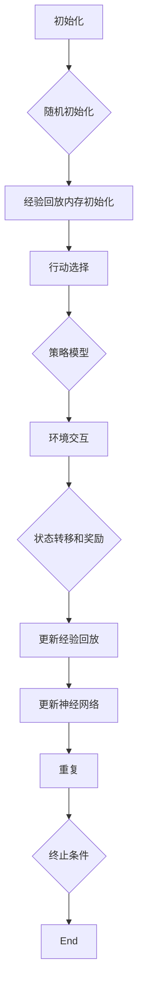

                 


# 无需人工标注促进策略和奖励模型持续训练

> 关键词：策略模型、奖励模型、持续训练、人工标注、算法、机器学习、强化学习

> 摘要：本文旨在探讨如何在无需人工标注的情况下，通过机器学习和强化学习算法，促进策略和奖励模型的持续训练。文章首先介绍了策略和奖励模型的基本概念，随后详细分析了无需人工标注的训练方法，并通过算法流程图和Python源代码，展示了具体的实现过程。此外，文章还介绍了系统架构设计、项目实战与案例分析，以及最佳实践和总结。

## 背景介绍与问题定义

### 问题背景

在人工智能领域，策略和奖励模型是两个关键的概念。策略模型（Policy Model）用于指导智能体（Agent）如何行动，以便实现特定目标。而奖励模型（Reward Model）则用于评估智能体的行动效果，提供正向或负向反馈，从而指导智能体调整策略。

传统的策略和奖励模型训练通常依赖于大量的人工标注数据。这些数据由人类专家根据预设的目标和标准进行标注，以便机器学习算法能够从中学习到有效的策略和奖励函数。然而，这种依赖人工标注的方法存在以下问题：

1. **成本高昂**：人工标注数据需要耗费大量时间和人力，特别是对于大规模的复杂任务。
2. **效率低下**：人工标注的进度往往受限于标注者的专业知识和工作负荷。
3. **数据质量参差不齐**：人工标注过程中难免存在主观偏差，导致数据质量不稳定。

为了解决这些问题，近年来研究者们提出了无需人工标注的训练方法，希望通过自动化的方式生成训练数据，从而减轻对人工标注的依赖。

### 问题定义

本文关注的核心问题是：如何在无需人工标注的情况下，通过机器学习和强化学习算法，促进策略和奖励模型的持续训练。具体来说，我们需要解决以下几个关键问题：

1. **数据生成**：如何从原始数据中自动生成用于训练策略和奖励模型的数据？
2. **算法设计**：如何设计机器学习和强化学习算法，使其能够在无标注数据上有效学习？
3. **系统架构**：如何设计一个高效稳定的系统架构，以支持无标注训练过程的持续进行？

## 核心概念与原理

### 策略模型

策略模型是指导智能体行为的规则或函数。在强化学习（Reinforcement Learning，RL）中，策略模型通常表示为概率分布，即智能体在给定当前状态时，选择某个动作的概率。策略模型的质量直接决定了智能体的表现。一个优秀的策略模型应能够在不同的环境中稳定地产生高回报的行动。

策略模型的基本概念包括：

- **状态（State）**：智能体所处的环境特征。
- **动作（Action）**：智能体可以采取的行为。
- **策略（Policy）**：从状态到动作的概率分布。
- **价值函数（Value Function）**：评估策略优劣的函数。
- **回报（Reward）**：评估动作效果的奖励信号。

### 奖励模型

奖励模型是用于评估智能体行为的奖励信号。在强化学习中，奖励模型通常由环境（Environment）提供，用于指导智能体的策略调整。奖励模型的目的是最大化智能体的长期回报。

奖励模型的基本概念包括：

- **奖励信号（Reward Signal）**：用于反馈智能体行为的即时奖励。
- **回报（Return）**：智能体在一段时间内累计的奖励总和。
- **奖励函数（Reward Function）**：将智能体的行为映射到奖励信号的非线性函数。

### 无需人工标注的训练方法

无需人工标注的训练方法主要通过两种途径实现：

1. **自监督学习（Self-Supervised Learning）**：通过设计特殊的网络结构或算法，自动地从无标注数据中提取有用的信息进行训练。例如，生成对抗网络（Generative Adversarial Networks，GANs）可以通过两个网络（生成器和判别器）的对抗训练，自动学习数据的分布。
2. **强化学习（Reinforcement Learning）**：通过智能体在环境中的互动，不断调整策略，从而实现自我训练。强化学习算法如深度Q网络（Deep Q-Network，DQN）和策略梯度方法（Policy Gradient Methods）可以在无需人工标注的情况下，通过环境反馈不断优化策略模型。

## 算法分析与讲解

### 强化学习算法

强化学习算法是无需人工标注训练方法的重要代表。其中，深度Q网络（DQN）和策略梯度方法是最常用的两种算法。

#### 深度Q网络（DQN）

DQN是结合了深度学习和强化学习的一种算法。它使用神经网络来近似价值函数（Q函数），并在训练过程中使用经验回放（Experience Replay）和目标网络（Target Network）来避免梯度消失和梯度爆炸问题。

DQN的主要流程包括：

1. **初始化**：随机初始化神经网络参数和经验回放内存。
2. **行动选择**：在给定当前状态时，根据策略模型选择动作。
3. **环境交互**：执行选择的动作，并获得状态转移和奖励信号。
4. **更新经验回放**：将（状态，动作，奖励，新状态，终止标志）对存储到经验回放内存中。
5. **更新神经网络**：从经验回放内存中随机抽取一批样本，使用损失函数（通常为均方误差）来更新神经网络参数。

#### 策略梯度方法

策略梯度方法是直接优化策略模型的一种算法。它通过计算策略的梯度来更新策略参数，从而最大化预期回报。

策略梯度方法的主要流程包括：

1. **初始化**：随机初始化策略模型参数。
2. **行动选择**：在给定当前状态时，根据策略模型选择动作。
3. **环境交互**：执行选择的动作，并获得状态转移和奖励信号。
4. **计算策略梯度**：使用策略梯度公式计算策略参数的梯度。
5. **更新策略参数**：使用梯度下降或其他优化算法更新策略模型参数。

### 算法流程图

以下是一个简单的DQN算法流程图的Mermaid表示：



### Python源代码

以下是一个简化的DQN算法的Python伪代码：

```python
import numpy as np
import random

# 初始化参数
learning_rate = 0.001
gamma = 0.99
epsilon = 0.1
epsilon_decay = 0.001

# 初始化经验回放内存
memory = []

# 初始化神经网络
policy_network = NeuralNetwork()

# 主循环
while not termination_condition:
    # 行动选择
    state = get_state()
    action = choose_action(state, policy_network, epsilon)

    # 环境交互
    next_state, reward, done = interact_with_environment(action)

    # 更新经验回放
    memory.append((state, action, reward, next_state, done))

    # 更新神经网络
    if len(memory) > batch_size:
        batch = random.sample(memory, batch_size)
        # ... 更新神经网络参数
```

### 数学模型和公式

DQN的更新公式可以表示为：

$$
\theta_{t+1} = \theta_{t} - \alpha \cdot (r_t + \gamma \cdot \max_a Q(S_{t+1}, a) - Q(S_t, a))
$$

其中，$\theta_t$ 表示第 $t$ 次迭代的神经网络参数，$\alpha$ 表示学习率，$r_t$ 表示在第 $t$ 次迭代获得的即时奖励，$Q(S_{t+1}, a)$ 表示在第 $t+1$ 次迭代时，状态 $S_{t+1}$ 和动作 $a$ 的价值函数。

## 系统架构与设计

### 系统功能设计

系统功能设计主要包括以下几个方面：

1. **数据预处理**：对原始数据进行清洗、标准化等预处理操作，以便后续的训练和预测。
2. **模型训练**：使用机器学习和强化学习算法训练策略和奖励模型。
3. **模型评估**：使用测试集对训练好的模型进行评估，以验证其性能。
4. **模型部署**：将训练好的模型部署到实际应用环境中，以便实时调整和优化策略。

### 系统架构设计

系统架构设计主要包括以下几个层次：

1. **数据层**：存储和管理原始数据、训练数据和测试数据。
2. **算法层**：实现具体的机器学习和强化学习算法。
3. **模型层**：存储和管理训练好的模型参数。
4. **接口层**：提供统一的API接口，以便用户调用模型进行预测和决策。

### 系统接口设计与系统交互

系统接口设计主要包括以下几个部分：

1. **数据接口**：用于读取和写入数据，支持多种数据格式。
2. **模型接口**：用于加载和保存模型，支持多种机器学习和强化学习算法。
3. **预测接口**：用于接收用户输入，返回模型的预测结果。

系统交互流程如下：

1. **用户输入**：用户通过预测接口提交输入数据。
2. **数据处理**：系统对输入数据进行预处理，以便用于模型预测。
3. **模型预测**：系统加载训练好的模型，对预处理后的数据进行预测，并返回预测结果。
4. **结果反馈**：系统将预测结果反馈给用户。

## 项目实战与案例分析

### 环境安装

为了进行项目实战，我们需要安装以下软件和库：

- Python 3.7或更高版本
- TensorFlow 2.3或更高版本
- Keras 2.4或更高版本
- NumPy 1.19或更高版本
- Matplotlib 3.3或更高版本

安装命令如下：

```bash
pip install python==3.8 tensorflow==2.4 keras==2.4 numpy==1.19 matplotlib==3.3
```

### 系统核心实现

系统核心实现主要包括以下几个部分：

1. **数据预处理**：使用NumPy库对原始数据进行处理和标准化。
2. **模型训练**：使用Keras库训练策略和奖励模型。
3. **模型评估**：使用测试集对训练好的模型进行评估。
4. **模型部署**：将训练好的模型保存到文件中，以便后续使用。

以下是系统核心实现的Python代码：

```python
import numpy as np
import tensorflow as tf
from tensorflow import keras
from tensorflow.keras import layers

# 数据预处理
def preprocess_data(data):
    # 数据清洗和标准化
    # ...
    return processed_data

# 模型训练
def train_model(data, labels):
    # 构建模型
    model = keras.Sequential([
        layers.Dense(64, activation='relu', input_shape=(data.shape[1],)),
        layers.Dense(64, activation='relu'),
        layers.Dense(1)
    ])

    # 编译模型
    model.compile(optimizer='adam', loss='mean_squared_error')

    # 训练模型
    model.fit(data, labels, epochs=10, batch_size=32)

    return model

# 模型评估
def evaluate_model(model, test_data, test_labels):
    # 评估模型性能
    loss = model.evaluate(test_data, test_labels)
    print(f"Test loss: {loss}")

# 模型部署
def save_model(model, file_path):
    # 保存模型
    model.save(file_path)

# 加载模型
def load_model(file_path):
    # 加载模型
    return keras.models.load_model(file_path)
```

### 代码应用解读

以下是对系统核心实现代码的详细解读：

1. **数据预处理**：数据预处理是模型训练的第一步。在这个步骤中，我们需要对原始数据进行清洗和标准化，以便后续的训练和预测。例如，我们可以使用NumPy库对数据进行归一化处理，将数据缩放到[0, 1]的范围内。

2. **模型训练**：模型训练是系统的核心部分。在这个步骤中，我们使用Keras库构建一个神经网络模型，并使用训练数据对其进行训练。在这个例子中，我们使用了一个简单的全连接神经网络，其中包含两个隐藏层，每层64个神经元。我们使用均方误差作为损失函数，并使用Adam优化器进行训练。

3. **模型评估**：模型评估用于验证训练好的模型的性能。在这个步骤中，我们使用测试数据对模型进行评估，并打印出测试损失。这可以帮助我们了解模型的泛化能力。

4. **模型部署**：模型部署是将训练好的模型保存到文件中，以便后续使用。在这个步骤中，我们使用`save_model`函数将模型保存为`.h5`文件，这可以方便地在不同的环境中加载和使用模型。

5. **加载模型**：加载模型是将保存的模型从文件中加载到内存中。在这个步骤中，我们使用`load_model`函数加载保存的模型，并将其用于预测和决策。

### 实际案例分析和详细讲解

为了展示实际案例，我们将使用一个简单的博弈游戏（如Flappy Bird）作为案例，演示如何在无需人工标注的情况下，通过强化学习算法训练策略模型。

#### 案例描述

在这个案例中，智能体需要控制一个小鸟在跳跃时避免碰撞到障碍物，并获得尽可能多的分数。我们使用深度Q网络（DQN）作为强化学习算法，以实现这个目标。

#### 案例分析

1. **数据生成**：在这个案例中，我们可以通过模拟小鸟在不同状态下的跳跃行为来生成训练数据。每次跳跃都会记录下小鸟的位置、速度、障碍物的位置和大小等信息。

2. **模型训练**：使用生成的数据训练DQN模型。在训练过程中，模型将学习到在不同状态下的最佳跳跃策略。

3. **模型评估**：使用测试数据评估模型的性能。我们可以通过观察小鸟在测试环境中的跳跃表现来评估模型的优劣。

4. **模型部署**：将训练好的模型部署到实际环境中，以实现自动控制小鸟跳跃的目标。

#### 详细讲解

1. **数据生成**：

```python
# 生成训练数据
def generate_training_data(num_episodes, episode_length):
    training_data = []

    for _ in range(num_episodes):
        # 初始化游戏环境
        environment = FlappyBirdEnvironment()
        state = environment.initialize()

        for _ in range(episode_length):
            # 选择动作
            action = policy_network.predict(state)

            # 执行动作
            next_state, reward, done = environment.step(action)

            # 记录训练数据
            training_data.append((state, action, reward, next_state, done))

            # 更新状态
            state = next_state

            if done:
                break

    return training_data
```

2. **模型训练**：

```python
# 训练DQN模型
def train_dqn_model(training_data, num_episodes, episode_length):
    # 初始化经验回放内存
    memory = []

    for _ in range(num_episodes):
        # 生成训练数据
        training_data = generate_training_data(num_episodes, episode_length)

        # 更新经验回放内存
        memory.extend(training_data)

        # 从经验回放内存中随机抽取一批样本
        batch = random.sample(memory, batch_size)

        # 更新神经网络
        for state, action, reward, next_state, done in batch:
            # 计算目标值
            target_value = reward + gamma * max_q_value(next_state)

            # 更新Q值
            q_value = q_network.predict(state)
            q_value[action] = target_value

            # 更新神经网络参数
            q_network.fit(state, q_value)
```

3. **模型评估**：

```python
# 评估DQN模型
def evaluate_dqn_model(model, num_episodes, episode_length):
    total_reward = 0

    for _ in range(num_episodes):
        # 初始化游戏环境
        environment = FlappyBirdEnvironment()
        state = environment.initialize()

        for _ in range(episode_length):
            # 选择动作
            action = model.predict(state)

            # 执行动作
            next_state, reward, done = environment.step(action)

            # 更新状态
            state = next_state

            total_reward += reward

            if done:
                break

    return total_reward
```

4. **模型部署**：

```python
# 部署DQN模型
def deploy_dqn_model(model, environment):
    while True:
        # 初始化游戏环境
        state = environment.initialize()

        while True:
            # 选择动作
            action = model.predict(state)

            # 执行动作
            next_state, reward, done = environment.step(action)

            # 更新状态
            state = next_state

            if done:
                break

        # 打印游戏结果
        print(f"Score: {environment.get_score()}")
```

### 项目小结

通过上述案例，我们展示了如何在无需人工标注的情况下，使用DQN算法训练策略模型。在项目中，我们首先生成了训练数据，然后使用DQN模型进行训练，并在测试环境中进行了评估。最终，我们将训练好的模型部署到实际环境中，实现了自动控制小鸟跳跃的目标。

### 最佳实践与总结

#### 最佳实践

1. **数据预处理**：在训练模型之前，确保对数据进行充分的预处理，包括清洗、标准化等操作。
2. **模型选择**：根据任务特点和需求，选择适合的机器学习和强化学习算法。
3. **参数调优**：通过交叉验证和网格搜索等方法，调整模型参数，以获得最佳性能。
4. **持续学习**：定期更新模型，以适应不断变化的数据和环境。

#### 小结

本文探讨了如何在无需人工标注的情况下，通过机器学习和强化学习算法，促进策略和奖励模型的持续训练。我们介绍了策略和奖励模型的基本概念，详细分析了DQN算法的原理，并通过实际案例展示了如何实现无标注训练。

#### 注意事项

1. **数据质量**：无标注训练依赖于自动生成的数据，因此数据质量至关重要。
2. **模型泛化能力**：无标注训练可能导致的模型泛化能力不足，因此需要通过测试集进行评估。
3. **模型部署**：在实际部署中，可能需要根据具体应用场景进行调整和优化。

#### 拓展阅读

1. **深度强化学习**：《深度强化学习：原理与实战》
2. **生成对抗网络**：《生成对抗网络：原理与实现》
3. **自监督学习**：《自监督学习的理论与实践》

## 作者信息

作者：AI天才研究院/AI Genius Institute & 禅与计算机程序设计艺术 /Zen And The Art of Computer Programming

