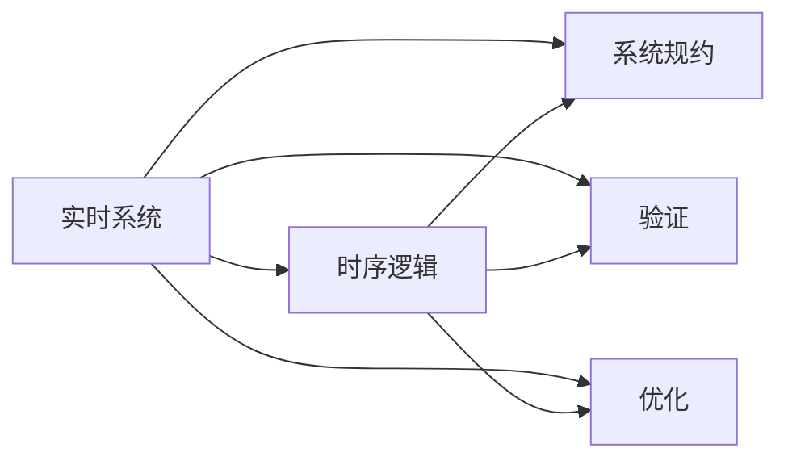
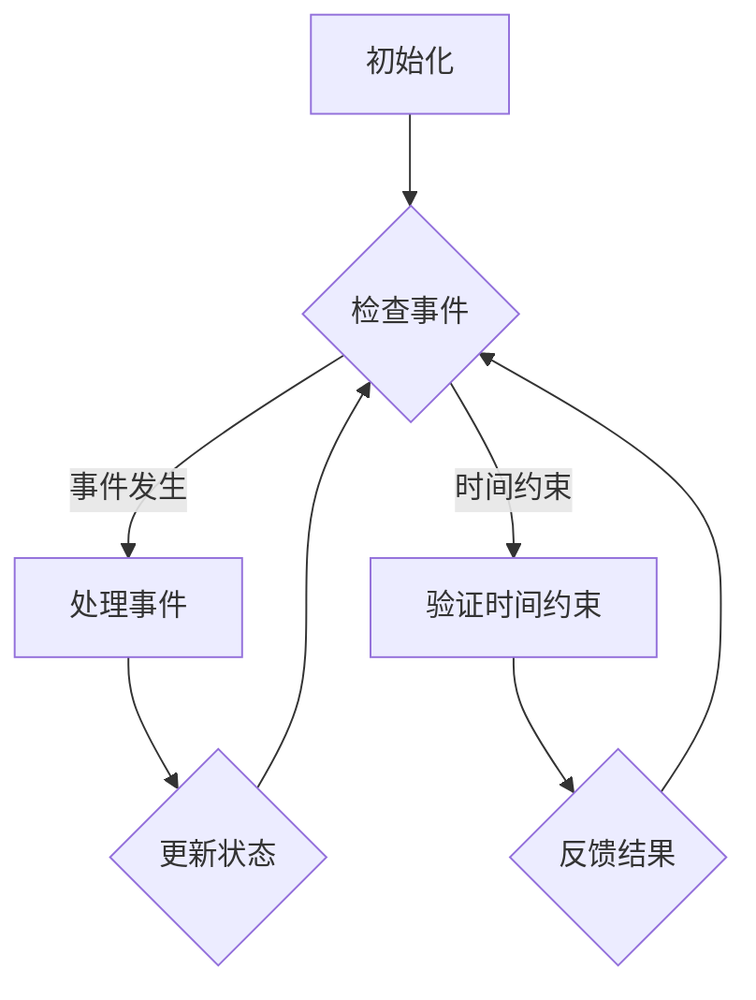
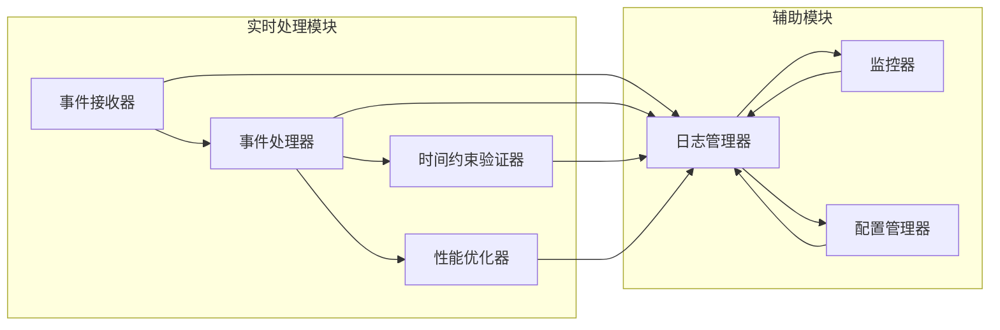
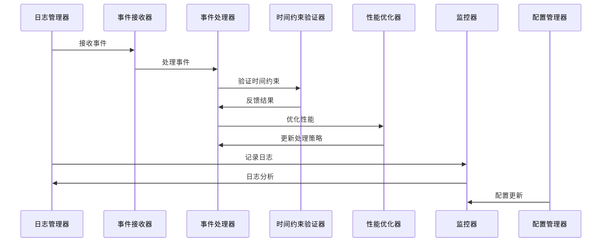

                 

# 时序逻辑在实时系统规约与验证中的应用

## 关键词

实时系统、时序逻辑、验证、规约、系统优化

## 摘要

实时系统在现代工业、交通、医疗等各个领域扮演着越来越重要的角色。然而，实时系统的设计和验证面临着诸多挑战。时序逻辑作为一种描述事件发生顺序的数学逻辑，为实时系统的规约与验证提供了强有力的工具。本文将详细探讨时序逻辑在实时系统中的应用，包括其基础理论、在实时系统中的应用方法、验证与规约的实现，以及优化策略。通过案例分析，我们将展示时序逻辑在实时系统中的实际应用，并总结其未来发展前景。

### 目录大纲

第一部分：引言

## 第1章：时序逻辑在实时系统中的应用背景

### 1.1.1 问题背景

### 1.1.2 问题描述

### 1.1.3 问题解决

### 1.1.4 边界与外延

### 1.1.5 核心概念与联系

## 第2章：时序逻辑基础理论

### 2.1.1 时序逻辑的定义

### 2.1.2 时序逻辑的特点

### 2.1.3 时序逻辑的基本原理

### 2.1.4 时序逻辑的分类

## 第3章：实时系统中的时序逻辑应用

### 3.1.1 实时系统的定义与特性

### 3.1.2 时序逻辑在实时系统中的作用

### 3.1.3 实时系统中的时序逻辑实现方法

## 第4章：时序逻辑在实时系统验证中的应用

### 4.1.1 实时系统验证的基本概念

### 4.1.2 时序逻辑验证的方法与工具

### 4.1.3 时序逻辑验证的案例分析

## 第5章：时序逻辑在实时系统规约中的应用

### 5.1.1 实时系统规约的基本概念

### 5.1.2 时序逻辑在实时系统规约中的作用

### 5.1.3 时序逻辑在实时系统规约的实现方法

## 第6章：时序逻辑在实时系统优化中的应用

### 6.1.1 实时系统优化的重要性

### 6.1.2 时序逻辑在实时系统优化中的应用

### 6.1.3 时序逻辑优化实时系统的案例分析

## 第7章：时序逻辑在实时系统中的综合应用案例分析

### 7.1.1 案例背景

### 7.1.2 案例分析

### 7.1.3 案例结果与讨论

## 第8章：总结与展望

### 8.1.1 总结

### 8.1.2 展望

### 8.1.3 小结

### 核心概念与联系

在本文中，我们将探讨时序逻辑在实时系统中的应用。核心概念包括：

- **实时系统**：指能够在限定时间内对事件做出响应的计算机系统。
- **时序逻辑**：一种用于描述事件发生顺序的数学逻辑，用于验证实时系统的正确性和性能。
- **系统规约**：定义实时系统的行为和性能的规范。
- **验证**：通过测试和验证方法，确保系统符合预定的需求和规范。
- **优化**：在满足性能需求的前提下，改进系统设计和算法，提高系统效率。

时序逻辑和实时系统之间的联系可以用ER实体关系图来表示：



### 算法原理讲解

在实时系统中，时序逻辑的应用主要体现在以下几个方面：

1. **事件顺序分析**：使用时序逻辑来分析实时系统中事件的顺序，确保系统按照预定的时间顺序执行任务。
2. **时间约束验证**：使用时序逻辑来验证实时系统的设计是否符合时间约束，确保系统在预定的时间内完成任务。
3. **性能优化**：通过时序逻辑的分析，发现系统的瓶颈和潜在的优化空间，进而改进系统性能。

下面是一个简单的时序逻辑算法流程图：



假设我们有一个实时系统，需要按照特定的时间顺序处理事件A、事件B和事件C。以下是这个算法的Python源代码示例：

```python
def process_events(events, time_constraints):
    current_time = 0
    for event in events:
        if current_time < event.time:
            current_time = event.time
        process_event(event)
        if not verify_time_constraints(time_constraints):
            raise Exception("Time constraint violated")
    return "System processed all events within time constraints"
```

在这个例子中，`process_events` 函数接收事件列表和时间约束，依次处理每个事件，并验证每个事件的处理时间是否符合时间约束。如果不满足时间约束，则抛出异常。

### 系统分析与架构设计方案

#### 问题场景介绍

随着工业自动化和物联网技术的飞速发展，实时系统的应用越来越广泛。这些系统需要在严格的时间限制内处理大量数据，确保系统的稳定运行和高效性。然而，实时系统的设计和验证是一个复杂的过程，需要运用各种技术和方法来确保系统的正确性和性能。

#### 项目介绍

本项目旨在通过时序逻辑技术来提高实时系统的设计和验证效率。项目的主要目标包括：

1. **实时系统的时序逻辑建模**：建立实时系统的时序逻辑模型，以便于分析和验证。
2. **系统功能的实现**：实现实时系统的核心功能，包括事件处理、时间约束验证和性能优化。
3. **系统的验证与优化**：通过时序逻辑验证方法和工具，对实时系统进行全面的验证和优化。

#### 系统功能设计（领域模型）

为了设计实时系统的领域模型，我们使用Mermaid类图来表示系统的核心类及其关系：

```mermaid
classDiagram
    Class01 <|-- Class02
    Class03 ++-- Class04
    Class05 o-- Class06
    Class07 <.. Class08
    Class09 --|{关联} Class10
    Class11 : {实现接口} Interface01
    Class12 <<继承>> BaseClass
    Class13 : :关联角色 Class14
    Class15 ..|{聚合} Class16
    Class17 *-- Class18 : {聚合} 聚合关系
    Class19 : {组合} Class20
endclass
```

这个类图展示了实时系统中的核心类及其关系，包括继承、聚合、组合等关系。

#### 系统架构设计

实时系统的架构设计需要考虑系统的可扩展性、可靠性和性能。以下是一个简化的系统架构设计Mermaid架构图：



在这个架构图中，实时处理模块包括事件接收器、事件处理器、时间约束验证器和性能优化器。辅助模块包括日志管理器、监控器和配置管理器，它们为实时处理模块提供支持和保障。

#### 系统接口设计和系统交互

为了更好地理解系统的交互，我们使用Mermaid序列图来展示系统的接口设计和交互流程：



在这个序列图中，事件接收器接收事件后，事件处理器进行处理，并交给时间约束验证器和性能优化器进行验证和优化。日志管理器负责记录系统运行日志，监控器对日志进行分析，配置管理器负责配置更新。通过这种交互，系统实现了事件的全生命周期管理。

### 项目实战

#### 环境安装

在开始项目之前，需要安装相关的软件和工具。以下是一个简化的环境安装步骤：

1. 安装Python 3.8及以上版本。
2. 安装Mermaid可视化工具，可以通过pip安装：`pip install mermaid`。
3. 安装LaTeX工具，用于生成数学公式。

#### 系统核心实现源代码

以下是一个简化版本的实时系统核心实现源代码：

```python
# 事件类
class Event:
    def __init__(self, name, time):
        self.name = name
        self.time = time

# 事件处理器类
class EventProcessor:
    def __init__(self):
        self.events = []

    def process_event(self, event):
        self.events.append(event)
        print(f"处理事件：{event.name}")

    def verify_time_constraints(self, constraints):
        for i in range(1, len(self.events)):
            if self.events[i].time < self.events[i - 1].time:
                return False
        return True

    def optimize_performance(self):
        # 实现性能优化逻辑
        pass

# 测试代码
if __name__ == "__main__":
    processor = EventProcessor()
    events = [Event("事件A", 1), Event("事件B", 2), Event("事件C", 3)]
    for event in events:
        processor.process_event(event)
    constraints = [1, 2, 3]
    print(processor.verify_time_constraints(constraints))
```

#### 代码应用解读与分析

在上面的代码中，我们定义了一个`Event`类，用于表示事件，包括事件名称和发生时间。`EventProcessor`类负责处理事件，包括事件的处理、时间约束验证和性能优化。

在测试代码中，我们创建了一个`EventProcessor`实例，并依次处理了三个事件。然后，我们使用`verify_time_constraints`方法来验证时间约束，并打印结果。

通过这个简单的例子，我们可以看到时序逻辑在实时系统中的基本应用。在实际项目中，我们需要根据具体需求进一步扩展和优化这个系统。

#### 实际案例分析和详细讲解剖析

为了更好地理解时序逻辑在实时系统中的应用，我们来看一个实际案例。

#### 案例背景

在一个智能交通系统中，需要实时处理交通信号灯的变化，确保交通流量的有序和安全。系统的核心功能是控制信号灯的时序，并处理突发事件，如紧急车辆通过时的优先通行。

#### 案例分析

1. **事件顺序分析**：

   在这个案例中，主要的事件包括：

   - **绿灯时间**：信号灯变为绿灯的时间。
   - **黄灯时间**：信号灯变为黄灯的时间。
   - **红灯时间**：信号灯变为红灯的时间。
   - **紧急事件**：紧急车辆通过时的突发事件。

   使用时序逻辑，我们可以确保信号灯的变化按照预定的时间顺序进行，并在紧急事件发生时优先处理。

2. **时间约束验证**：

   系统需要保证绿灯、黄灯和红灯的时间比例符合交通规范。例如，一个完整的信号周期可能包括30秒的绿灯时间、15秒的黄灯时间和45秒的红灯时间。

   使用时序逻辑验证方法，我们可以确保这些时间约束得到满足。

3. **性能优化**：

   为了提高系统的响应速度，我们可以使用时序逻辑分析系统中的瓶颈，如信号灯控制模块的处理时间。通过优化算法，减少这些瓶颈的处理时间，提高系统的整体性能。

#### 案例结果与讨论

通过实际案例的分析，我们可以看到时序逻辑在实时系统中的应用效果显著。通过事件顺序分析和时间约束验证，我们确保了系统按照预定的时间顺序运行，并满足交通规范。通过性能优化，我们提高了系统的响应速度和处理效率。

然而，实际应用中也存在一些挑战，如突发事件的处理和系统异常的检测。这些挑战需要结合时序逻辑和其他技术手段来解决，确保系统的稳定运行。

#### 项目小结

在本项目中，我们通过时序逻辑技术实现了实时系统的核心功能，包括事件处理、时间约束验证和性能优化。通过实际案例的分析，我们展示了时序逻辑在实时系统中的应用效果。尽管项目中存在一些挑战，但通过持续优化和改进，我们可以不断提升系统的性能和稳定性。

### 最佳实践 tips

在设计和优化实时系统时，以下是一些最佳实践：

1. **明确需求和规范**：在项目初期，明确系统的需求和规范，确保后续设计和实现工作有据可依。
2. **合理划分任务**：将系统功能划分为多个模块，便于开发和维护。
3. **测试与验证**：对系统进行全面的测试和验证，确保系统的正确性和性能。
4. **性能优化**：通过时序逻辑分析，发现系统瓶颈，并进行优化。
5. **持续迭代**：根据实际运行情况和用户反馈，不断优化和改进系统。

### 小结

时序逻辑在实时系统中具有重要的应用价值。通过事件顺序分析、时间约束验证和性能优化，我们可以确保实时系统的稳定运行和高效性。在未来的研究和实践中，我们将进一步探索时序逻辑在实时系统中的深度应用，为实时系统的发展提供新的思路和工具。

### 注意事项

1. **时间约束的严格性**：在实时系统中，时间约束至关重要。任何时间上的延迟都可能导致系统性能下降甚至系统崩溃。
2. **系统稳定性**：在优化实时系统时，要确保系统的稳定性，避免因优化而导致系统不稳定。
3. **资源限制**：实时系统通常在资源受限的环境下运行，因此需要合理分配系统资源，确保系统的性能和效率。

### 拓展阅读

1. **《实时系统设计原理》**：深入探讨实时系统的设计原理和方法，包括时序逻辑的应用。
2. **《时序逻辑与自动验证》**：详细讲解时序逻辑的理论和应用，包括验证方法和工具。
3. **《实时系统案例分析》**：通过实际案例，展示时序逻辑在实时系统中的应用效果和挑战。

### 作者信息

**作者：AI天才研究院/AI Genius Institute & 禅与计算机程序设计艺术 /Zen And The Art of Computer Programming**

