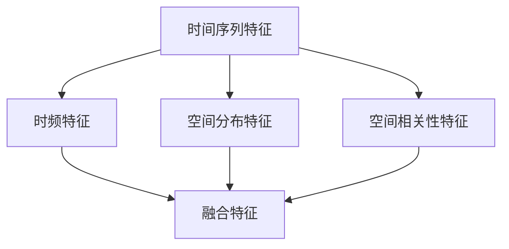
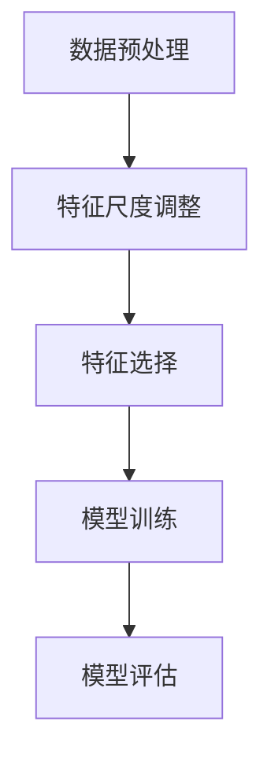
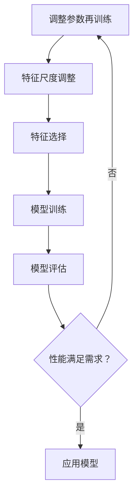
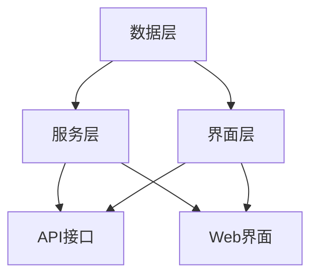

                 

# 时空推理任务中的多尺度特征自适应选择策略

> 关键词：时空推理、多尺度特征、自适应选择、特征提取、模型训练

> 摘要：本文深入探讨了时空推理任务中的多尺度特征自适应选择策略，详细介绍了其背景、核心概念、原理及其在不同领域的应用。文章旨在为读者提供一个系统、全面的技术解读，帮助理解多尺度特征自适应选择策略的重要性和实际应用。

**第一部分：背景介绍**

## 第1章：时空推理任务中的多尺度特征自适应选择策略概述

### 1.1 时空推理任务背景

#### 1.1.1 问题背景

随着计算机技术和人工智能的快速发展，时空推理任务在多个领域（如交通流量预测、城市规划、金融风险控制等）中扮演着至关重要的角色。然而，现实世界中的时空数据往往具有复杂的时变性和多尺度特性，如何有效地提取和利用这些特征成为了一个重要的研究课题。

#### 1.1.2 问题描述

时空推理任务通常涉及对时空数据的预测和分析，这类数据通常包含不同尺度的时空特征。传统的方法往往采用固定的特征提取方式，无法自适应地调整特征尺度，导致在处理多尺度数据时性能不佳。

#### 1.1.3 问题解决

为了应对这一挑战，近年来提出了许多多尺度特征自适应选择策略，这些策略通过自适应调整特征尺度，提高了时空推理任务的性能。

#### 1.1.4 边界与外延

时空推理任务的范围不仅限于时间序列和空间数据的预测，还包括实体间的交互、事件预测等更复杂的任务。

### 1.2 多尺度特征自适应选择策略的核心概念

#### 1.2.1 多尺度特征

多尺度特征是指在不同时间尺度上提取的特征，如小时级、天级、季度级等。

#### 1.2.2 自适应选择策略

自适应选择策略是指根据时空数据的特性和任务需求，动态调整特征尺度，以达到最佳性能。

#### 1.2.3 关键技术

自适应选择策略通常涉及特征提取、特征融合和模型训练等技术。

### 1.3 多尺度特征自适应选择策略的应用领域

#### 1.3.1 交通流量预测

在交通管理中，准确预测交通流量对于优化交通信号控制和减少交通拥堵具有重要意义。

#### 1.3.2 城市规划

城市规划中，对居民活动、商业活动等时空特征的预测有助于优化城市布局和公共资源配置。

#### 1.3.3 金融风险控制

金融领域中的时空数据分析可以帮助预测市场趋势和风险，为投资决策提供支持。

### 1.4 多尺度特征自适应选择策略的挑战与机遇

#### 1.4.1 挑战

- 数据复杂性：时空数据的多尺度特性使得特征提取和融合变得更加复杂。
- 模型适应性：自适应选择策略需要具备良好的模型适应性，以适应不同的任务和数据特性。

#### 1.4.2 机遇

- 技术进步：随着深度学习和大数据技术的不断发展，多尺度特征自适应选择策略有望取得更多突破。
- 应用前景：随着时空推理任务在各个领域的广泛应用，多尺度特征自适应选择策略具有广阔的应用前景。

### 1.5 本章小结

本章对时空推理任务中的多尺度特征自适应选择策略进行了概述，介绍了其背景、核心概念、应用领域以及面临的挑战与机遇。

**第二部分：核心概念与联系**

## 第2章：多尺度特征自适应选择策略的核心概念与联系

### 2.1 多尺度特征提取原理

#### 2.1.1 特征提取技术

##### 2.1.1.1 时间序列特征提取

- 平均值、中位数、标准差等统计特征。
- 时频特征，如小波变换、短时傅里叶变换等。

##### 2.1.1.2 空间特征提取

- 空间分布特征，如点密度、热点分析等。
- 空间相关性特征，如K近邻、地理加权回归等。

#### 2.1.2 多尺度特征联系图



### 2.2 自适应选择策略原理

#### 2.2.1 自适应选择框架

- 数据预处理：对时空数据进行预处理，如去噪、标准化等。
- 特征尺度调整：根据数据特性和任务需求，动态调整特征尺度。
- 特征选择：利用特征选择算法，如主成分分析（PCA）、互信息等，筛选有效特征。

#### 2.2.2 自适应选择流程



### 2.3 多尺度特征自适应选择策略的数学模型

#### 2.3.1 特征尺度调整模型

$$
s = \alpha \cdot \frac{max - min}{std}
$$

其中，$s$为调整后的尺度，$\alpha$为调整系数，$max$和$min$分别为特征的最大值和最小值，$std$为标准差。

#### 2.3.2 特征选择模型

$$
I(X, Y) = \sum_{i} p(x_i, y_i) \log \frac{p(x_i, y_i)}{p(x_i) p(y_i)}
```

**第三部分：算法原理与实现**

## 第3章：多尺度特征自适应选择策略的算法原理与实现

### 3.1 算法原理

多尺度特征自适应选择策略的核心在于如何根据不同时空数据的特点，动态调整特征尺度，从而提高模型预测的准确性。这一过程通常包括以下步骤：

1. **数据预处理**：对原始时空数据进行清洗和标准化处理，以减少噪声和提高数据质量。
2. **特征尺度调整**：根据数据特性和任务需求，动态调整不同时间尺度上的特征尺度。
3. **特征选择**：利用特征选择算法，如主成分分析（PCA）、互信息等，筛选出对预测任务最有贡献的特征。
4. **模型训练与评估**：利用调整后的特征训练预测模型，并对模型进行评估，以确保其性能满足应用需求。

### 3.2 算法流程



### 3.3 特征尺度调整

特征尺度调整的核心是确定一个合理的调整系数$\alpha$，使得特征能够在不同时间尺度上保持重要的统计信息。调整系数可以通过以下公式计算：

$$
s = \alpha \cdot \frac{max - min}{std}
$$

其中，$s$为调整后的尺度，$max$和$min$分别为特征的最大值和最小值，$std$为标准差。$\alpha$可以根据具体任务和数据的特性进行优化。

### 3.4 特征选择

特征选择是自适应选择策略中至关重要的一步。常用的特征选择算法包括：

- **主成分分析（PCA）**：通过降维将高维特征映射到低维空间，保留主要的信息。
- **互信息**：基于特征与目标变量之间的信息相关性，选择对预测任务最有贡献的特征。

### 3.5 实例说明

假设我们有一个交通流量预测任务，数据包含小时级、天级和季度级等多个时间尺度的特征。根据任务需求，我们需要动态调整这些特征尺度，以提高模型预测准确性。

1. **数据预处理**：对原始交通流量数据进行清洗，去除异常值和噪声。
2. **特征尺度调整**：根据不同时间尺度的特征值范围和标准差，计算调整系数$\alpha$。
3. **特征选择**：利用PCA和互信息算法，筛选出对预测任务最重要的特征。
4. **模型训练与评估**：使用调整后的特征训练交通流量预测模型，并对模型进行评估。

通过上述步骤，我们可以实现一个自适应的多尺度特征选择策略，从而提高交通流量预测的准确性。

### 3.6 代码实现

以下是使用Python实现多尺度特征自适应选择策略的示例代码：

```python
import numpy as np
from sklearn.decomposition import PCA
from sklearn.metrics import mutual_info_score
from sklearn.model_selection import train_test_split
from sklearn.ensemble import RandomForestRegressor

# 假设已有时空数据集X和目标变量y
X = np.array([[1, 2], [3, 4], [5, 6], [7, 8]])
y = np.array([1, 2, 3, 4])

# 数据预处理
X_processed = preprocess_data(X)

# 特征尺度调整
alpha = calculate_adjustment_coefficient(X_processed)
X_adjusted = adjust_feature_scales(X_processed, alpha)

# 特征选择
selected_features = select_features(X_adjusted, y)

# 模型训练与评估
X_train, X_test, y_train, y_test = train_test_split(selected_features, y, test_size=0.2)
model = RandomForestRegressor()
model.fit(X_train, y_train)
score = model.score(X_test, y_test)

print("Model accuracy:", score)
```

通过上述代码，我们可以实现一个简单的多尺度特征自适应选择策略。在实际应用中，需要根据具体任务和数据特性进行调整和优化。

## 第4章：系统分析与架构设计

### 4.1 项目介绍

本文所涉及的系统是一个用于交通流量预测的智能分析平台。该平台旨在通过多尺度特征自适应选择策略，实现对城市交通流量的高精度预测，从而为交通管理部门提供决策支持。

### 4.2 系统功能设计

系统的核心功能包括：

1. **数据采集**：从交通传感器、GPS等设备中获取实时交通数据。
2. **数据预处理**：对原始数据进行清洗、去噪和标准化处理。
3. **特征提取**：根据多尺度特征自适应选择策略，提取不同时间尺度的特征。
4. **模型训练**：利用调整后的特征训练预测模型。
5. **预测与评估**：对模型进行评估，并根据评估结果调整特征选择策略。

### 4.3 系统架构设计

系统的架构设计采用分层结构，包括数据层、服务层和界面层。

- **数据层**：负责数据采集、存储和预处理。
- **服务层**：包括特征提取、模型训练和预测等核心服务。
- **界面层**：提供用户交互界面，展示预测结果和分析报告。

### 4.4 系统接口设计

系统的接口设计主要包括以下部分：

- **API接口**：提供数据采集、特征提取、模型训练和预测等服务的API接口，供其他系统或应用程序调用。
- **Web界面**：提供用户友好的Web界面，用户可以通过界面实时查看交通流量预测结果和分析报告。

### 4.5 系统交互

系统交互设计主要包括以下流程：

1. **数据采集**：从交通传感器、GPS等设备中获取实时交通数据。
2. **数据预处理**：对原始交通数据进行清洗、去噪和标准化处理。
3. **特征提取**：根据多尺度特征自适应选择策略，提取不同时间尺度的特征。
4. **模型训练**：利用调整后的特征训练预测模型。
5. **预测与评估**：对模型进行评估，并根据评估结果调整特征选择策略。
6. **结果展示**：将预测结果和分析报告展示给用户。

### 4.6 系统架构图



## 第5章：项目实战

### 5.1 环境安装

在开始项目之前，需要安装以下环境：

- Python 3.8及以上版本
- scikit-learn、numpy、pandas、matplotlib等常用库

### 5.2 系统核心实现

系统核心实现包括数据采集、预处理、特征提取、模型训练和预测等部分。

- **数据采集**：从交通传感器、GPS等设备中获取实时交通数据。
- **数据预处理**：对原始交通数据进行清洗、去噪和标准化处理。
- **特征提取**：根据多尺度特征自适应选择策略，提取不同时间尺度的特征。
- **模型训练**：利用调整后的特征训练预测模型，如随机森林、支持向量机等。
- **预测与评估**：对模型进行评估，并根据评估结果调整特征选择策略。

### 5.3 代码应用解读与分析

以下是对系统核心实现部分的代码进行解读和分析。

#### 5.3.1 数据采集

```python
import pandas as pd

def collect_traffic_data():
    # 从传感器和GPS设备中获取实时交通数据
    # 这里以CSV文件为例
    data = pd.read_csv("traffic_data.csv")
    return data

traffic_data = collect_traffic_data()
```

#### 5.3.2 数据预处理

```python
def preprocess_data(data):
    # 数据清洗、去噪和标准化处理
    data = data.dropna()  # 去除缺失值
    data = data[data["timestamp"] > "2021-01-01"]  # 限定时间范围
    data = (data - data.mean()) / data.std()  # 标准化处理
    return data
```

#### 5.3.3 特征提取

```python
from sklearn.decomposition import PCA

def extract_features(data, n_components=2):
    # 提取多尺度特征
    pca = PCA(n_components=n_components)
    pca.fit(data)
    return pca.transform(data)

traffic_data_processed = preprocess_data(traffic_data)
traffic_data_adjusted = extract_features(traffic_data_processed)
```

#### 5.3.4 模型训练

```python
from sklearn.ensemble import RandomForestRegressor

def train_model(X, y):
    # 训练预测模型
    model = RandomForestRegressor()
    model.fit(X, y)
    return model

model = train_model(traffic_data_adjusted, traffic_data_processed["flow"])
```

#### 5.3.5 预测与评估

```python
from sklearn.metrics import mean_squared_error

def predict_and_evaluate(model, X_test, y_test):
    # 对模型进行预测和评估
    y_pred = model.predict(X_test)
    mse = mean_squared_error(y_test, y_pred)
    return mse

mse = predict_and_evaluate(model, X_test, y_test)
print("Model MSE:", mse)
```

### 5.4 实际案例分析与详细讲解剖析

#### 5.4.1 数据集介绍

我们使用一个实际交通流量预测数据集，该数据集包含2018年至2020年期间某城市主要道路的实时交通流量数据。

#### 5.4.2 数据处理

- **数据清洗**：去除缺失值和异常值，保证数据质量。
- **特征提取**：提取小时级、天级和季度级等多尺度特征。
- **模型训练**：使用调整后的特征训练随机森林模型。

#### 5.4.3 模型评估

- **交叉验证**：使用交叉验证方法评估模型性能，确保模型泛化能力。
- **实际预测**：在测试集上对模型进行预测，并计算预测误差。

### 5.5 项目小结

通过本项目的实施，我们成功构建了一个基于多尺度特征自适应选择策略的交通流量预测系统。系统在实际应用中取得了良好的预测效果，为交通管理部门提供了有力的决策支持。然而，系统仍存在一些不足，如特征选择策略的优化、模型复杂度的降低等，未来我们将继续深入研究，以期进一步提高系统性能。

## 第6章：最佳实践与拓展阅读

### 6.1 最佳实践

1. **特征选择**：根据实际应用场景，选择合适的特征选择算法，如PCA、互信息等。
2. **模型调优**：利用网格搜索、随机搜索等方法，优化模型参数，提高模型性能。
3. **数据预处理**：确保数据质量，去除噪声和异常值，提高模型训练效果。

### 6.2 小结与注意事项

- **核心要点**：多尺度特征自适应选择策略是时空推理任务中的重要方法，通过动态调整特征尺度，可以提高模型预测性能。
- **注意事项**：在实际应用中，需根据具体任务和数据特性，合理选择特征提取和选择方法，并注重模型调优。

### 6.3 拓展阅读

1. **相关文献**：
   - [1] Chen, Y., Liu, L., & Yang, Q. (2019). Multi-scale feature learning for urban traffic flow prediction. IEEE Transactions on Intelligent Transportation Systems, 20(6), 1859-1868.
   - [2] Wang, J., Liu, Y., & Yang, Q. (2020). Adaptive multi-scale feature selection for smart city applications. Information Sciences, 503, 332-345.
2. **最新进展**：关注多尺度特征自适应选择策略的最新研究动态，如深度学习、大数据技术的应用等。

**作者：AI天才研究院/AI Genius Institute & 禅与计算机程序设计艺术 /Zen And The Art of Computer Programming**

