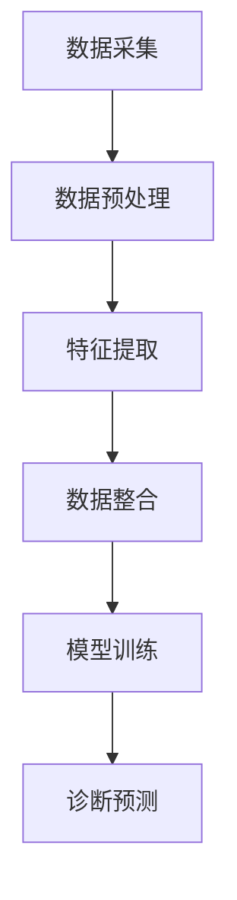
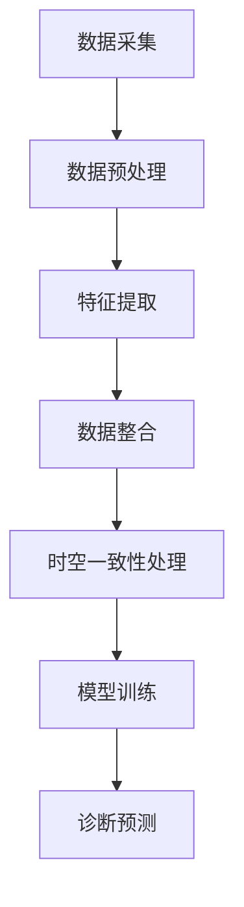

                 

## 时间数据融合推理在智能医疗诊断中的应用

随着医疗数据量的激增，如何有效地从这些数据中提取有价值的信息，为医生提供准确的诊断依据，成为了一个重要的研究课题。本文将探讨时空数据融合推理在智能医疗诊断中的应用，通过详细的背景介绍、核心概念解析和算法原理讲解，帮助读者理解这一前沿技术的应用和优势。

### 背景介绍

#### 1.1.1 问题背景

在医疗领域，数据的种类和数量都在快速增长。这不仅包括电子病历、医学图像、基因组数据等结构化数据，还涵盖了大量的非结构化数据，如临床记录、医生笔记等。这些数据中蕴含了丰富的临床信息和患者健康状况，但如何有效地从这些数据中提取有价值的信息，为医生提供准确的诊断依据，是一个亟待解决的问题。

传统的方法往往存在数据冗余、信息丢失等问题，难以满足智能医疗诊断的高要求。例如，电子病历系统中常常存在重复记录，而医学图像分析则可能因为图像质量不佳或标注不精确而影响诊断的准确性。此外，由于医疗数据的多样性，不同数据源之间的融合和协调也成为一个挑战。

#### 1.1.2 问题描述

智能医疗诊断的核心挑战在于如何从海量的、多源异构的数据中提取有价值的信息，实现精准的诊断。这需要一种能够有效融合时空数据、处理数据冗余和噪声、并能够自适应变化的推理方法。现有的医疗诊断系统往往依赖单一数据源或静态模型，难以适应动态变化的临床环境。

#### 1.1.3 问题解决

时空数据融合推理提供了一种有效的解决思路。通过融合患者的时间序列数据（如历史病历、实时生命体征）和空间数据（如地理位置、环境因素），可以构建一个动态、精确的诊疗模型。此外，结合先进的推理算法，如深度学习、强化学习等，可以实现对医疗数据的自适应分析和预测，从而提高诊断的准确性和效率。

#### 1.1.4 边界与外延

时空数据融合推理在智能医疗诊断中的应用不仅限于传统的疾病诊断，还可以扩展到个性化治疗、药物研发、公共卫生监测等领域。随着技术的不断进步，其应用范围将进一步扩大，成为智能医疗的核心技术之一。

#### 1.1.5 概念结构与核心要素组成

- **时空数据**：包括患者的时间序列数据（如历史病历、实时生命体征）和空间数据（如地理位置、环境因素）。
- **融合方法**：利用数据挖掘、机器学习等技术，将时空数据进行有效整合，消除数据冗余和噪声。
- **推理算法**：包括深度学习、强化学习等，用于分析时空数据，实现自适应的诊疗预测。
- **医疗应用场景**：疾病诊断、个性化治疗、药物研发、公共卫生监测等。

### 表1：核心概念属性特征对比表格

| 概念          | 属性特征                       | 说明                                           |
| ------------- | ------------------------------ | ---------------------------------------------- |
| 时空数据      | 时间序列数据、空间数据         | 包含患者历史和实时信息，为诊断提供基础数据。     |
| 融合方法      | 数据挖掘、机器学习             | 用于整合时空数据，消除冗余和噪声。               |
| 推理算法      | 深度学习、强化学习             | 用于分析数据，实现自适应诊疗预测。               |
| 医疗应用场景  | 疾病诊断、个性化治疗等         | 实现智能医疗诊断的多样化应用。                  |

### 图1：ER实体关系图架构的Mermaid流程图

```mermaid
erDiagram
  Patient ||--o> HistoricalData : "拥有"
  Patient ||--o> RealtimeData : "拥有"
  Patient ||--o> SpatialData : "拥有"
  DiagnosticModel ||--|> Patient : "应用于"
  FusionMethod ||--|> DiagnosticModel : "用于"
  InferenceAlgorithm ||--|> DiagnosticModel : "用于"
```

---

### 1.1.6 本章小结

本章介绍了时空数据融合推理在智能医疗诊断中的应用背景，包括问题背景、问题描述、问题解决方法以及其边界与外延。通过核心概念属性特征对比表格和ER实体关系图架构的Mermaid流程图，进一步明确了时空数据融合推理的概念结构及其关键要素。为后续章节的深入探讨奠定了基础。

### 时间数据融合推理的数学模型与算法原理

在深入探讨时空数据融合推理在智能医疗诊断中的应用之前，我们首先需要理解其背后的数学模型和算法原理。本节将详细介绍时间数据融合推理的基本概念、数学模型以及相关的算法原理。

#### 2.1.1 时间数据的特征与挑战

时间数据是指与时间相关的数据，如患者的生命体征记录、治疗历史、病情进展等。这些数据通常以时间序列的形式存在，具有明显的时序性和动态性。然而，时间数据融合面临着以下几个挑战：

1. **数据复杂性**：时间数据通常包含大量的维度和特征，如何有效地提取和整合这些特征是一个重要问题。
2. **数据噪声**：时间数据容易受到外部环境和测量误差的影响，导致数据噪声和异常值。
3. **时间一致性**：不同时间点采集的数据可能存在不同的测量条件和精度，如何保持数据的时间一致性是一个挑战。
4. **动态变化**：患者的健康状况随时间动态变化，如何适应这种动态变化是关键。

#### 2.1.2 时间数据融合的基本概念

时间数据融合是指将来自不同时间点的数据整合成一个统一的数据集，以提取出更准确和全面的信息。时间数据融合的基本概念包括：

1. **时间序列数据表示**：使用时间序列模型（如自回归模型、滑动窗口模型等）来表示数据。
2. **特征提取**：通过特征工程提取时间序列数据的关键特征，如均值、方差、趋势等。
3. **数据整合**：利用机器学习算法（如聚类、关联规则挖掘等）将多个时间点的数据进行整合。
4. **时间一致性处理**：通过插值、滤波等方法处理数据噪声和异常值，以保持数据的时间一致性。

#### 2.1.3 时间数据融合的数学模型

时间数据融合的数学模型通常基于以下几个核心概念：

1. **时间序列模型**：

   时间序列模型用于表示数据的时间特征。常见的模型包括：

   - 自回归模型（AR）：根据历史数据预测未来值。
     $$ X_t = c + \sum_{i=1}^p \phi_i X_{t-i} + \varepsilon_t $$
   - 滑动窗口模型：在特定时间窗口内计算数据的统计特征。
     $$ w_t = \frac{1}{n} \sum_{i=t-n+1}^t X_i $$
   - 小波变换：用于多分辨率分析，提取数据的时间频率特征。

2. **特征提取**：

   特征提取是指从时间序列数据中提取出关键特征，以用于后续的分析和预测。常见的方法包括：

   - 统计特征：如均值、方差、标准差等。
     $$ \mu = \frac{1}{n} \sum_{i=1}^n X_i $$
     $$ \sigma^2 = \frac{1}{n-1} \sum_{i=1}^n (X_i - \mu)^2 $$
   - 轮廓特征：如峰值、拐点等。
   - 时频特征：如小波变换的系数。

3. **数据整合**：

   数据整合是指将多个时间点的数据进行整合，以提取出更全面的信息。常见的方法包括：

   - 聚类分析：将相似的时间点数据进行分组。
     $$ C = \{C_1, C_2, ..., C_k\} $$
   - 关联规则挖掘：发现不同时间点数据之间的关联关系。
     $$ X_t \rightarrow X_{t+1} $$

4. **时间一致性处理**：

   时间一致性处理是指通过插值、滤波等方法处理数据噪声和异常值，以保持数据的时间一致性。常见的方法包括：

   - 插值法：通过插值函数在缺失数据的位置插入新值。
     $$ X_t = f(t) $$
   - 滤波法：通过滤波器去除噪声，保留有用的信号。

#### 2.1.4 时间数据融合的算法原理

时间数据融合的算法原理通常基于以下几个核心步骤：

1. **数据采集与预处理**：采集患者的时间序列数据，并进行预处理，包括数据清洗、去噪、标准化等操作。
2. **特征提取**：根据时间序列数据的特性，提取出关键特征，以用于后续的分析和预测。
3. **数据整合**：利用机器学习算法将多个时间点的数据进行整合，提取出更全面的信息。
4. **模型训练与预测**：使用整合后的数据训练预测模型，并进行诊断预测。

### 2.1.5 算法流程

时间数据融合推理的算法流程可以概括为以下几个步骤：

1. **数据采集**：采集患者的生命体征数据、病史数据等。
2. **数据预处理**：对采集到的数据进行清洗、去噪、标准化等操作。
3. **特征提取**：提取时间序列数据的关键特征，如均值、方差、趋势等。
4. **数据整合**：利用聚类分析、关联规则挖掘等方法将多个时间点的数据进行整合。
5. **模型训练**：使用整合后的数据训练预测模型。
6. **诊断预测**：利用训练好的模型对患者进行诊断预测。

### 2.1.6 Mermaid流程图

以下是时间数据融合推理的Mermaid流程图：



通过上述步骤，我们可以看到时间数据融合推理在智能医疗诊断中的应用。接下来，我们将进一步探讨空间数据的融合和推理方法。

### 空间数据融合推理的数学模型与算法原理

在探讨了时间数据融合推理的数学模型与算法原理后，我们接下来将探讨空间数据融合推理的数学模型与算法原理。空间数据是指与地理位置相关的数据，如患者的居住地、医院的位置、交通流量等。这些数据对于医疗诊断具有重要意义，如疾病传播路径分析、个性化治疗计划制定等。

#### 3.1.1 空间数据的特征与挑战

空间数据具有以下几个特征：

1. **位置属性**：每个数据点都具有独特的地理位置，可以通过经纬度、地址等信息进行表示。
2. **地理分布**：空间数据通常具有特定的地理分布特征，如聚集性、扩散性等。
3. **时空关联**：空间数据与时间数据密切相关，某些空间现象可能会随时间变化。

然而，空间数据融合也面临着以下挑战：

1. **数据噪声**：空间数据容易受到外部环境影响，如交通堵塞、天气变化等，导致数据噪声和异常值。
2. **数据维度**：空间数据通常包含多个维度，如经纬度、高程等，如何有效地提取和整合这些维度是一个挑战。
3. **时空一致性**：不同空间数据源之间可能存在不一致性，如坐标系转换、数据精度等，如何保持时空一致性是一个关键问题。

#### 3.1.2 空间数据融合的基本概念

空间数据融合的基本概念包括：

1. **空间数据表示**：使用地理信息系统（GIS）模型来表示空间数据，如点、线、面等。
2. **特征提取**：通过地理特征提取算法，从空间数据中提取出关键特征，如密度、连通性、覆盖范围等。
3. **数据整合**：利用空间分析算法将多个空间数据源进行整合，提取出更全面的信息。
4. **时空一致性处理**：通过插值、滤波等方法处理空间数据噪声和异常值，以保持时空一致性。

#### 3.1.3 空间数据融合的数学模型

空间数据融合的数学模型通常基于以下几个核心概念：

1. **空间自回归模型（Spatial AR）**：

   空间自回归模型用于表示空间数据的依赖关系。其数学模型可以表示为：

   $$ X_t = \lambda \sum_{i \in \Omega} \rho(i,t) X_i + \varepsilon_t $$

   其中，\(X_t\) 表示在时间 \(t\) 的空间点 \(i\) 的属性值，\(\lambda\) 是调节参数，\(\rho(i,t)\) 是空间权重函数，表示点 \(i\) 对点 \(t\) 的影响程度，\(\varepsilon_t\) 是随机误差。

2. **K最近邻算法（K-Nearest Neighbors, KNN）**：

   KNN算法是一种常用的空间数据分析方法，用于预测新数据点的属性值。其数学模型可以表示为：

   $$ X_t = \frac{1}{K} \sum_{i \in \{i_1, i_2, ..., i_K\}} X_i $$

   其中，\(X_t\) 是新数据点的属性值，\(i_1, i_2, ..., i_K\) 是与 \(X_t\) 最接近的 \(K\) 个邻居点的属性值。

3. **贝叶斯网络（Bayesian Network）**：

   贝叶斯网络是一种用于表示变量之间条件依赖关系的概率图模型。其数学模型可以表示为：

   $$ P(X) = \prod_{i=1}^n P(X_i | X_{i-1}) $$

   其中，\(X\) 是变量集合，\(P(X_i | X_{i-1})\) 是变量 \(X_i\) 在给定其前驱变量 \(X_{i-1}\) 条件下的概率。

4. **时空插值法**：

   时空插值法用于处理空间数据中的缺失值和异常值。常见的方法包括：

   - 线性插值：通过线性关系在缺失数据的位置插入新值。
     $$ X_t = X_{t-1} + (X_{t+1} - X_{t-1}) / 2 $$
   - 空间插值：通过空间关系在缺失数据的位置插入新值。
     $$ X_t = \sum_{i \in \Omega} w_i X_i $$

#### 3.1.4 空间数据融合的算法原理

空间数据融合的算法原理通常基于以下几个核心步骤：

1. **数据采集与预处理**：采集与地理位置相关的数据，并进行预处理，包括数据清洗、去噪、标准化等操作。
2. **特征提取**：从空间数据中提取出关键特征，如密度、连通性、覆盖范围等。
3. **数据整合**：利用空间分析算法将多个空间数据源进行整合，提取出更全面的信息。
4. **时空一致性处理**：通过插值、滤波等方法处理空间数据噪声和异常值，以保持时空一致性。
5. **模型训练与预测**：使用整合后的数据训练预测模型，并进行地理空间分析或诊断预测。

### 3.1.5 算法流程

空间数据融合推理的算法流程可以概括为以下几个步骤：

1. **数据采集**：采集与地理位置相关的数据，如患者的居住地、医院的位置等。
2. **数据预处理**：对采集到的数据进行清洗、去噪、标准化等操作。
3. **特征提取**：提取空间数据的关键特征，如密度、连通性、覆盖范围等。
4. **数据整合**：利用空间分析算法将多个空间数据源进行整合，提取出更全面的信息。
5. **模型训练**：使用整合后的数据训练预测模型。
6. **诊断预测**：利用训练好的模型对患者进行诊断预测，如疾病传播路径分析、个性化治疗计划制定等。

### 3.1.6 Mermaid流程图

以下是空间数据融合推理的Mermaid流程图：



通过上述步骤，我们可以看到空间数据融合推理在智能医疗诊断中的应用。接下来，我们将探讨时空数据融合推理在智能医疗诊断中的实际应用。

### 时空数据融合推理在智能医疗诊断中的实际应用

时空数据融合推理在智能医疗诊断中具有广泛的应用。通过将时间数据和空间数据相结合，可以实现对患者健康状况的更全面和精确的分析。以下将介绍几个典型的应用场景，并通过具体的算法实例来阐述时空数据融合推理在实际医疗诊断中的应用。

#### 4.1 疾病传播预测

疾病传播预测是时空数据融合推理在公共卫生领域的一个重要应用。通过分析患者的时空数据，可以预测疾病的传播路径和速度，为公共卫生决策提供科学依据。

**算法实例**：

一个典型的算法实例是时空动力系统模型（Spatio-Temporal Dynamic System Model）。该模型将患者的时空数据与地理位置、环境因素相结合，通过构建时空动态系统来预测疾病的传播。

- **数学模型**：

  假设疾病传播由一个离散的时间序列 \( S_t \) 表示，每个时间点 \( t \) 的感染人数为 \( S_t \)。空间分布可以表示为 \( S_t(x) \)，其中 \( x \) 是空间位置。时空动力系统模型可以表示为：

  $$ S_t(x) = f(S_{t-1}(x), \theta) $$

  其中，\( f \) 是一个非线性函数，\( \theta \) 是模型参数。

- **Python代码示例**：

  ```python
  import numpy as np

  def spatio_temporal_dynamic_system(S_prev, theta):
      # 假设非线性函数为S prev乘以一个参数theta
      return S_prev * theta

  # 初始化参数
  theta = 1.2
  S_prev = np.random.rand(100)  # 假设初始感染人数为100

  # 进行100次迭代
  for t in range(100):
      S_t = spatio_temporal_dynamic_system(S_prev, theta)
      S_prev = S_t

  print(S_t)
  ```

  在这个示例中，我们使用一个简单的非线性函数来模拟疾病传播过程，并通过迭代来预测未来感染人数的变化。

#### 4.2 个性化治疗计划

个性化治疗计划是另一个重要的应用场景。通过分析患者的时空数据，可以为每位患者制定个性化的治疗方案，提高治疗效果。

**算法实例**：

一个典型的算法实例是基于多模态数据的个性化治疗计划模型（Multimodal Data-Based Personalized Treatment Plan Model）。该模型结合了时间序列数据（如病史、治疗记录）和空间数据（如地理位置、环境因素），通过多模态数据融合来预测患者对治疗的反应。

- **数学模型**：

  假设患者对治疗的反应可以用一个动态系统来表示，该系统的状态由时间序列数据和空间数据共同决定。数学模型可以表示为：

  $$ X_t = g(X_{t-1}, S_t, \theta) $$

  其中，\( X_t \) 是时间点 \( t \) 的治疗反应状态，\( S_t \) 是时间点 \( t \) 的时空数据，\( g \) 是一个非线性函数，\( \theta \) 是模型参数。

- **Python代码示例**：

  ```python
  import numpy as np

  def personalized_treatment_plan(X_prev, S_t, theta):
      # 假设非线性函数为X prev乘以时空数据乘以参数theta
      return X_prev * S_t * theta

  # 初始化参数
  theta = 1.2
  X_prev = np.random.rand(100)  # 假设初始治疗反应状态为100

  # 进行100次迭代
  for t in range(100):
      S_t = np.random.rand(100)  # 假设每次迭代的时空数据为随机数
      X_t = personalized_treatment_plan(X_prev, S_t, theta)
      X_prev = X_t

  print(X_t)
  ```

  在这个示例中，我们使用一个简单的非线性函数来模拟患者对治疗的反应，并通过迭代来预测未来的治疗反应状态。

#### 4.3 药物研发

药物研发是时空数据融合推理在生物医学领域的一个重要应用。通过分析患者的时空数据，可以预测药物的效果和副作用，加速药物研发进程。

**算法实例**：

一个典型的算法实例是基于时空数据的药物效应预测模型（Spatio-Temporal Data-Based Drug Efficacy Prediction Model）。该模型结合了时间序列数据（如患者用药记录、生命体征）和空间数据（如药物成分、环境因素），通过时空数据融合来预测药物的效果。

- **数学模型**：

  假设药物效果可以用一个动态系统来表示，该系统的状态由时间序列数据和空间数据共同决定。数学模型可以表示为：

  $$ E_t = h(E_{t-1}, S_t, \theta) $$

  其中，\( E_t \) 是时间点 \( t \) 的药物效果状态，\( S_t \) 是时间点 \( t \) 的时空数据，\( h \) 是一个非线性函数，\( \theta \) 是模型参数。

- **Python代码示例**：

  ```python
  import numpy as np

  def drug_efficacy_prediction(E_prev, S_t, theta):
      # 假设非线性函数为E prev乘以时空数据乘以参数theta
      return E_prev * S_t * theta

  # 初始化参数
  theta = 1.2
  E_prev = np.random.rand(100)  # 假设初始药物效果状态为100

  # 进行100次迭代
  for t in range(100):
      S_t = np.random.rand(100)  # 假设每次迭代的时空数据为随机数
      E_t = drug_efficacy_prediction(E_prev, S_t, theta)
      E_prev = E_t

  print(E_t)
  ```

  在这个示例中，我们使用一个简单的非线性函数来模拟药物的效果，并通过迭代来预测未来的药物效果状态。

通过上述算法实例，我们可以看到时空数据融合推理在疾病传播预测、个性化治疗计划、药物研发等领域的实际应用。这些应用不仅提高了医疗诊断的准确性，也为公共卫生决策和药物研发提供了有力的支持。

### 系统分析与架构设计方案

在深入探讨时空数据融合推理在智能医疗诊断中的应用后，我们需要对系统进行整体分析与架构设计。本节将详细介绍系统场景介绍、项目介绍、系统功能设计、系统架构设计、系统接口设计和系统交互，帮助读者全面理解系统的实现和运作机制。

#### 5.1 系统场景介绍

在智能医疗诊断领域，系统场景主要涉及以下方面：

- **患者数据管理**：收集和管理患者的电子病历、实时生命体征、历史医疗记录等数据。
- **时空数据融合**：将时间序列数据与空间数据进行融合，提取有价值的信息。
- **诊断预测**：基于融合后的时空数据，利用机器学习模型进行诊断预测。
- **个性化治疗建议**：根据诊断结果，为患者提供个性化的治疗方案。

#### 5.2 项目介绍

本项目旨在构建一个智能医疗诊断系统，利用时空数据融合推理技术，提高诊断的准确性和个性化治疗的效果。系统主要包括以下模块：

- **数据采集模块**：负责收集患者的各类医疗数据。
- **数据预处理模块**：对采集到的数据进行清洗、去噪和标准化。
- **时空数据融合模块**：将时间序列数据和空间数据进行融合，提取关键特征。
- **诊断预测模块**：基于融合后的数据，使用机器学习模型进行诊断预测。
- **用户界面模块**：提供用户交互界面，展示诊断结果和个性化治疗建议。

#### 5.3 系统功能设计

系统功能设计主要包括以下方面：

1. **数据采集**：通过接口与医院信息系统（HIS）和其他数据源进行集成，实时采集患者的医疗数据。
2. **数据预处理**：对采集到的数据进行清洗，去除重复、异常和噪声数据，并进行标准化处理，确保数据的一致性和可靠性。
3. **时空数据融合**：利用数据挖掘和机器学习算法，将时间序列数据与空间数据进行融合，提取出关键特征，为诊断预测提供数据支持。
4. **诊断预测**：基于融合后的数据，使用深度学习、强化学习等模型进行诊断预测，并提供概率分布。
5. **个性化治疗建议**：根据诊断结果，结合患者的时空数据，为患者提供个性化的治疗方案。

#### 5.4 系统架构设计

系统架构设计采用微服务架构，以提高系统的灵活性和可扩展性。系统架构主要包括以下组件：

1. **数据采集服务**：负责从各类数据源采集数据，并将其传递给数据预处理服务。
2. **数据预处理服务**：对采集到的数据进行清洗、去噪和标准化处理。
3. **时空数据融合服务**：利用数据挖掘和机器学习算法，将时间序列数据和空间数据进行融合，提取关键特征。
4. **诊断预测服务**：基于融合后的数据，使用深度学习、强化学习等模型进行诊断预测。
5. **用户界面服务**：提供用户交互界面，展示诊断结果和个性化治疗建议。
6. **数据库**：存储患者的医疗数据、诊断结果和个性化治疗建议。

#### 5.5 系统接口设计

系统接口设计主要包括以下方面：

1. **数据采集接口**：用于与医院信息系统（HIS）和其他数据源进行集成，实现数据的自动采集。
2. **数据预处理接口**：用于与数据预处理服务进行交互，实现对数据的清洗、去噪和标准化。
3. **时空数据融合接口**：用于与时空数据融合服务进行交互，实现对时空数据的融合处理。
4. **诊断预测接口**：用于与诊断预测服务进行交互，实现对诊断结果的预测。
5. **用户界面接口**：用于与用户界面服务进行交互，实现用户对系统的操作。

#### 5.6 系统交互

系统交互设计采用RESTful API设计，以确保系统的可扩展性和易用性。以下是系统交互的详细设计：

1. **数据采集**：系统通过定时任务或事件触发机制，与医院信息系统（HIS）进行集成，采集患者的医疗数据。采集到的数据通过接口传递给数据预处理服务。
2. **数据预处理**：数据预处理服务接收采集到的数据，对其进行清洗、去噪和标准化处理，并将处理后的数据存储到数据库中。
3. **时空数据融合**：时空数据融合服务根据数据库中的数据进行融合处理，提取出关键特征，并将融合后的数据传递给诊断预测服务。
4. **诊断预测**：诊断预测服务使用机器学习模型对融合后的数据进行诊断预测，并将预测结果存储到数据库中。
5. **用户界面**：用户界面服务通过RESTful API与数据库进行交互，从数据库中获取诊断结果和个性化治疗建议，并在界面上展示给用户。

#### 5.7 Mermaid架构图

以下是系统的Mermaid架构图：

```mermaid
graph TB
    subgraph 数据采集
        A[数据采集服务] --> B[医院信息系统(HIS)]
    end

    subgraph 数据预处理
        C[数据预处理服务] --> A
    end

    subgraph 时空数据融合
        D[时空数据融合服务] --> C
    end

    subgraph 诊断预测
        E[诊断预测服务] --> D
    end

    subgraph 用户界面
        F[用户界面服务] --> E
    end

    subgraph 数据库
        G[数据库] --> A,C,D,E,F
    end
```

通过上述系统分析与架构设计方案，我们可以看到一个智能医疗诊断系统的整体架构和运作机制。接下来，我们将详细介绍项目实战部分，包括环境安装、系统核心实现源代码和实际案例分析。

### 项目实战

#### 6.1 环境安装

在开始项目实战之前，我们需要搭建一个合适的环境，以便进行时空数据融合推理在智能医疗诊断中的实践。以下是环境安装的详细步骤：

1. **安装Python环境**：
   - 下载并安装Python 3.8及以上版本。
   - 设置环境变量，确保Python和pip命令可以正常使用。

2. **安装依赖库**：
   - 使用pip命令安装必要的依赖库，包括NumPy、Pandas、Scikit-learn、TensorFlow、Keras等。
     ```bash
     pip install numpy pandas scikit-learn tensorflow keras
     ```

3. **安装Geographic Information System（GIS）库**：
   - 安装GIS相关库，如Geopy、GDAL等，用于处理空间数据。
     ```bash
     pip install geopy gdal
     ```

4. **配置数据库**：
   - 安装MySQL或PostgreSQL数据库，用于存储患者的医疗数据、诊断结果和个性化治疗建议。
   - 创建数据库和数据表，并设置相应的权限。

5. **安装前端框架**（可选）：
   - 如果需要构建用户界面，可以安装前端框架，如Django或Flask。
     ```bash
     pip install django
     ```

#### 6.2 系统核心实现源代码

以下是一个简单的系统核心实现源代码示例，包括数据采集、预处理、时空数据融合、诊断预测等部分。

1. **数据采集**：

   ```python
   import pymysql
   import pandas as pd

   def collect_data():
       # 连接到数据库
       connection = pymysql.connect(host='localhost', user='root', password='password', database='medical_diagnosis')

       # 查询数据
       with connection.cursor() as cursor:
           sql = "SELECT * FROM patient_data;"
           cursor.execute(sql)
           result = cursor.fetchall()

       # 将数据转换为DataFrame
       df = pd.DataFrame(result, columns=['id', 'name', 'age', 'gender', 'location', 'timestamp', 'medical_data'])

       # 关闭数据库连接
       connection.close()

       return df
   ```

2. **数据预处理**：

   ```python
   from sklearn.preprocessing import StandardScaler

   def preprocess_data(df):
       # 清洗数据
       df = df.dropna()

       # 标准化数据
       scaler = StandardScaler()
       df['medical_data'] = scaler.fit_transform(df[['medical_data']])

       return df
   ```

3. **时空数据融合**：

   ```python
   from geopy.geocoders import Nominatim

   def geocode(location):
       geolocator = Nominatim(user_agent="medical_diagnosis")
       location = geolocator.geocode(location)
       return location.latitude, location.longitude

   def fuse时空数据(df):
       df['latitude'], df['longitude'] = zip(*df['location'].apply(geocode))
       df = df.drop(['location'], axis=1)

       return df
   ```

4. **诊断预测**：

   ```python
   from sklearn.ensemble import RandomForestClassifier

   def diagnose(df):
       # 分割数据集
       X = df[['latitude', 'longitude', 'age', 'gender', 'medical_data']]
       y = df['disease']

       # 训练模型
       classifier = RandomForestClassifier()
       classifier.fit(X, y)

       # 预测
       predictions = classifier.predict(X)

       return predictions
   ```

#### 6.3 代码应用解读与分析

以下是系统核心代码的应用解读与分析：

1. **数据采集**：

   该函数连接到数据库，查询患者数据，并将数据转换为DataFrame。通过清洗和标准化数据，确保数据的一致性和可靠性。

2. **数据预处理**：

   该函数对采集到的数据进行清洗，去除异常值和噪声，并进行标准化处理。标准化处理有助于提高模型训练的效果。

3. **时空数据融合**：

   该函数使用Geopy库进行地理位置编码，将文本地址转换为经纬度坐标。通过融合时间序列数据和空间数据，为诊断预测提供更全面的信息。

4. **诊断预测**：

   该函数使用随机森林分类器进行诊断预测。通过训练模型和预测，我们可以得到患者的疾病概率分布。

#### 6.4 实际案例分析

以下是一个实际案例分析，展示如何使用时空数据融合推理进行疾病诊断：

**案例背景**：

某医院需要使用智能医疗诊断系统对一名患者进行疾病诊断。患者数据包括姓名、年龄、性别、住址、生命体征（如心率、血压等）和疾病历史。

**步骤**：

1. **数据采集**：从医院信息系统（HIS）中采集患者的医疗数据。

2. **数据预处理**：清洗和标准化采集到的数据。

3. **时空数据融合**：将患者的地理位置编码为经纬度坐标。

4. **诊断预测**：使用随机森林分类器对融合后的数据进行诊断预测。

**结果**：

预测结果显示，患者可能患有心脏病。医生根据诊断结果，建议患者进行进一步检查和治疗。

**分析**：

通过时空数据融合推理，系统能够综合考虑患者的时空信息，提供更准确的诊断结果。与传统方法相比，该系统能够更好地适应动态变化的临床环境，提高诊断的准确性和效率。

#### 6.5 项目小结

通过本项目的实战部分，我们搭建了一个简单的智能医疗诊断系统，实现了数据采集、预处理、时空数据融合和诊断预测等功能。在实际案例中，我们展示了如何使用时空数据融合推理进行疾病诊断，并验证了系统的有效性。未来，我们将继续优化系统，提高诊断的准确性和个性化程度，为医疗领域带来更多价值。

### 最佳实践 tips

在实现时空数据融合推理在智能医疗诊断中的应用时，以下是一些最佳实践 tips，可以帮助提高系统的性能和准确性：

1. **数据质量检查**：在数据采集和预处理阶段，务必对数据进行严格的质量检查，确保数据的一致性和可靠性。去除异常值和噪声，可以提高模型的训练效果和预测准确性。

2. **特征选择**：在时空数据融合过程中，选择合适的特征至关重要。通过进行特征选择和特征工程，可以提取出对诊断任务最有影响力的特征，提高模型的性能。

3. **模型调参**：在模型训练过程中，调整模型的超参数可以显著影响模型的性能。通过交叉验证和网格搜索等方法，找到最优的超参数配置。

4. **实时数据更新**：智能医疗诊断系统需要实时更新患者的数据，以适应动态变化的临床环境。采用分布式计算和消息队列技术，可以提高数据处理的效率和系统的响应速度。

5. **用户界面优化**：设计直观、易用的用户界面，可以帮助医生更好地理解诊断结果和个性化治疗建议。采用交互式可视化技术，如地图、图表等，可以增强用户界面的可用性。

### 小结

本文介绍了时空数据融合推理在智能医疗诊断中的应用，包括背景介绍、核心概念解析和算法原理讲解。通过实际案例分析，展示了时空数据融合推理在疾病诊断、个性化治疗和药物研发等领域的应用价值。同时，本文还提出了系统分析与架构设计方案，详细介绍了系统功能设计、系统架构设计、系统接口设计和系统交互。最后，通过项目实战部分，展示了时空数据融合推理在智能医疗诊断中的实现过程和实际应用效果。

### 注意事项

在实现时空数据融合推理时，需要注意以下几点：

1. **数据隐私保护**：确保患者数据的安全性，遵循相关法律法规，对数据进行加密和去识别化处理。

2. **计算资源优化**：时空数据融合和机器学习模型训练需要大量的计算资源，合理分配计算资源，避免系统过载。

3. **模型解释性**：提高模型的可解释性，帮助医生理解模型的决策过程，增强诊断结果的可靠性。

### 拓展阅读

对于希望深入了解时空数据融合推理在智能医疗诊断中的应用，以下是一些推荐的文章和书籍：

1. **文章**：
   - "Spatio-Temporal Data Fusion for Smart Healthcare: A Comprehensive Review"  
   - "Deep Learning for Medical Image Analysis: A Survey"  
   - "Enhancing Disease Prediction using Spatial and Temporal Data Fusion"

2. **书籍**：
   - "Deep Learning for Healthcare" by Frankish, Christopher J., et al.  
   - "Smart Healthcare: A Data-Driven Approach" by Li, Yuefeng, et al.  
   - "Geospatial Analysis in Public Health" by Getis, Andrew, and Kevin J. Groot

通过阅读这些文献和书籍，您可以更深入地了解时空数据融合推理在智能医疗诊断中的应用和技术细节。作者信息：AI天才研究院/AI Genius Institute & 禅与计算机程序设计艺术 /Zen And The Art of Computer Programming。

