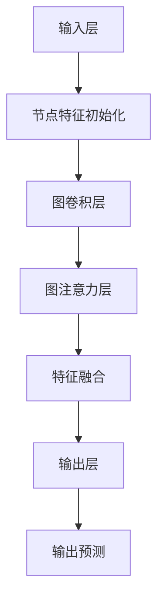
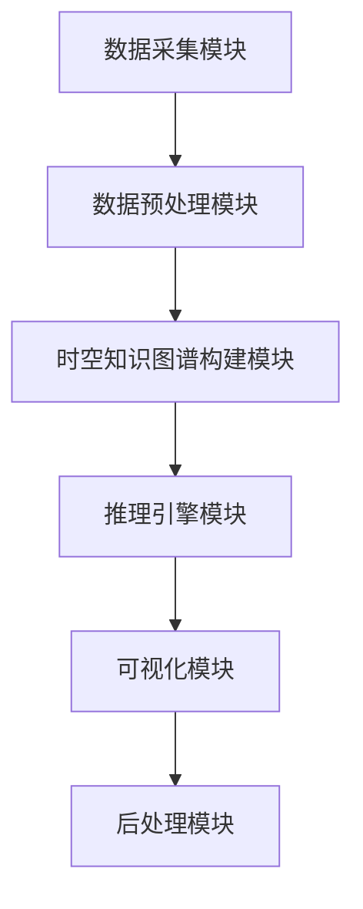
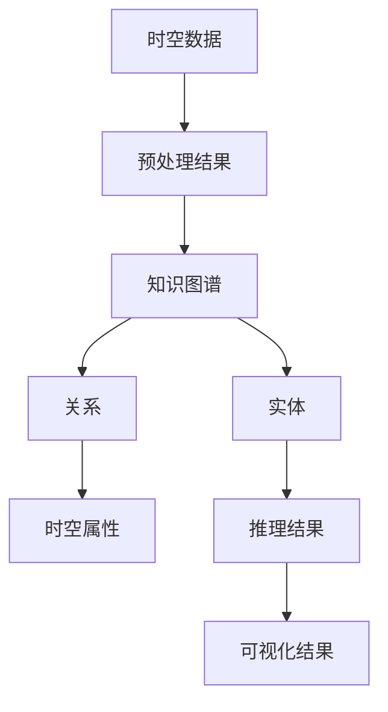
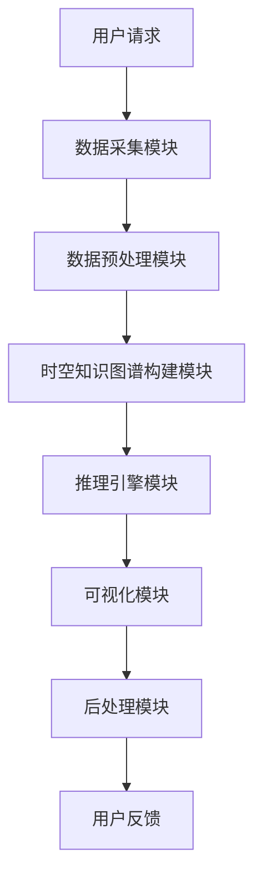

                 

# 时空知识图谱推理中图神经网络的前沿技术

> 关键词：时空知识图谱、图神经网络、推理、前沿技术

> 摘要：本文深入探讨了时空知识图谱推理中图神经网络的前沿技术。首先，介绍了时空知识图谱的概念、发展历程及其在信息检索和数据分析中的应用。然后，详细讲解了图神经网络的基本原理、算法流程、数学模型以及其在时空知识图谱推理中的应用。接着，通过系统架构设计和项目实战，展示了时空知识图谱推理系统的搭建和运行。最后，总结了最佳实践、注意事项以及拓展阅读，为读者提供了深入理解和应用图神经网络进行时空知识图谱推理的指导。

## 目录

1. 第一部分：时空知识图谱概述
   1.1 问题背景与核心概念
   1.2 核心概念联系
   1.3 图神经网络基础
   1.4 时空知识图谱构建
2. 第二部分：图神经网络在时空知识图谱推理中的应用
   2.1 推理任务与目标
   2.2 图神经网络在推理中的应用
3. 第三部分：时空知识图谱推理系统
   3.1 系统设计与架构
   3.2 项目实战
   3.3 最佳实践 tips、小结、注意事项、拓展阅读

### 第一部分：时空知识图谱概述

## 1.1 问题背景与核心概念

### 1.1.1 问题背景

在信息化和数字化的今天，数据已经成为现代社会的核心资产。然而，数据量的指数级增长和复杂度的不断提升，使得传统的数据处理方法越来越难以满足实际需求。为了应对这一挑战，知识图谱作为一种新型的数据结构，逐渐受到了广泛关注。知识图谱通过表示实体、关系和属性，将零散的数据整合成一个具有层次结构的知识网络，从而提高数据利用率和信息提取效率。

在知识图谱中，时空知识图谱是一种特殊类型，它不仅包含实体和关系，还考虑了实体之间的时空关系。时空知识图谱在信息检索、地理信息系统、交通规划、智能城市等领域具有广泛的应用前景。然而，随着时空数据规模的不断扩大和复杂性的增加，如何高效地处理和推理时空知识图谱成为一个重要的研究课题。

### 1.1.2 时空知识图谱的概念

时空知识图谱是一种融合了时空信息的数据模型，它通过表示实体、关系和时空属性，构建出一个具有时空维度的知识网络。具体来说，时空知识图谱包含以下几个核心概念：

- **实体（Entity）**：时空知识图谱中的基本单元，可以是地理位置、时间点、事件等。例如，“北京”、“2023年5月1日”、“奥运会”等。

- **关系（Relationship）**：描述实体之间的关联，可以是空间关系、时间关系或事件关系。例如，“位于”、“发生”、“参加”等。

- **时空属性（Temporal Attribute）**：描述实体的时空特征，包括时间戳、持续时间、位置坐标等。例如，“时间戳”、“持续1小时”、“纬度39.9度”等。

- **知识库（Knowledge Base）**：时空知识图谱的数据存储，通常由大量的三元组（实体、关系、时空属性）组成。例如，“北京位于中国”、“奥运会发生在2023年5月1日”等。

### 1.1.3 时空知识图谱的应用场景

时空知识图谱的应用场景非常广泛，以下是一些典型的应用：

- **信息检索**：通过时空知识图谱，可以更精确地检索与特定时空相关的信息。例如，在搜索引擎中，根据用户的地理位置和时间，提供个性化的搜索结果。

- **地理信息系统**：时空知识图谱可以用于地理信息系统的数据管理和分析。例如，用于城市规划、交通管理、环境监测等。

- **智能交通**：通过时空知识图谱，可以优化交通流量、预测交通拥堵，提高交通运输效率。

- **智能城市**：时空知识图谱可以用于智慧城市建设，实现城市资源的优化配置和智能管理。

- **历史事件研究**：时空知识图谱可以帮助研究人员挖掘历史事件之间的时空关系，促进历史研究的发展。

### 1.1.4 问题解决与边界与外延

在时空知识图谱的构建和推理过程中，面临着一系列的挑战。首先，如何有效地表示和存储大规模的时空数据是一个关键问题。其次，时空数据的复杂性和多样性使得传统的图算法难以直接应用于时空知识图谱。此外，如何实现高效的时空推理也是一个重要挑战。

时空知识图谱的边界与外延包括以下几个方面：

- **边界**：时空知识图谱的边界主要涉及数据的采集、存储和处理。例如，如何获取高质量的时空数据、如何处理数据中的噪声和异常等。

- **外延**：时空知识图谱的外延主要涉及应用场景的拓展。例如，如何将时空知识图谱应用于新的领域，如医疗健康、环境监测等。

### 1.1.5 概念结构与核心要素组成

时空知识图谱的概念结构由以下几个核心要素组成：

- **实体**：时空知识图谱中的基本单元，包括地理位置、时间点、事件等。

- **关系**：描述实体之间的关联，包括空间关系、时间关系和事件关系。

- **时空属性**：描述实体的时空特征，包括时间戳、持续时间、位置坐标等。

- **知识库**：时空知识图谱的数据存储，由大量的三元组组成。

- **算法**：用于构建、查询和推理时空知识图谱的算法，包括图神经网络、深度学习模型等。

通过上述核心要素的有机组合，时空知识图谱实现了对时空信息的有效表示和处理。

## 1.2 核心概念联系

### 1.2.1 时空知识图谱与图神经网络的关系

时空知识图谱和图神经网络是两种互补的技术，它们在数据处理和知识表示方面具有共同的目标。时空知识图谱通过表示实体、关系和时空属性，构建了一个具有时空维度的知识网络。而图神经网络则通过学习实体和关系之间的特征，实现了对时空知识图谱的高效推理。

图神经网络在时空知识图谱中的应用主要体现在以下几个方面：

1. **特征提取**：图神经网络可以从时空知识图谱中提取出实体和关系的高维特征，这些特征可以用于后续的推理和预测任务。

2. **图谱扩展**：图神经网络可以通过学习实体和关系之间的潜在关系，实现对时空知识图谱的扩展和补充。

3. **推理**：图神经网络可以用于对时空知识图谱中的实体和关系进行推理，从而发现新的关联和规律。

### 1.2.2 ER实体关系图

ER实体关系图是表示时空知识图谱的一种常见方法，它通过实体、关系和属性之间的关系，构建了一个具有层次结构的知识网络。在ER实体关系图中，实体表示为节点，关系表示为边，属性表示为节点的属性。

ER实体关系图的构建过程可以分为以下几个步骤：

1. **确定实体**：首先，根据应用需求，确定时空知识图谱中的实体，如地理位置、时间点、事件等。

2. **定义关系**：其次，确定实体之间的关系，如空间关系、时间关系和事件关系。

3. **设置属性**：最后，为每个实体和关系设置属性，如时间戳、持续时间、位置坐标等。

通过ER实体关系图，可以直观地表示时空知识图谱的结构和关系，为后续的图神经网络应用提供基础。

### 1.2.3 核心概念对比表格

为了更清晰地理解时空知识图谱与图神经网络之间的关系，我们提供以下核心概念对比表格：

| 核心概念         | 时空知识图谱                 | 图神经网络                   |
|-----------------|-----------------------------|-------------------------------|
| 实体（Entity）  | 地理位置、时间点、事件等     | 节点，表示实体                |
| 关系（Relationship） | 空间关系、时间关系、事件关系 | 边，表示实体之间的关联       |
| 时空属性（Temporal Attribute） | 时间戳、持续时间、位置坐标等 | 特征，用于表示实体的属性特征 |
| 知识库（Knowledge Base） | 由三元组组成的数据库         | 用于训练和推理的模型          |

通过上述表格，我们可以看到时空知识图谱和图神经网络在实体、关系和属性等方面的对应关系，这为两者的融合应用提供了理论基础。

## 1.3 图神经网络基础

### 1.3.1 图神经网络简介

图神经网络（Graph Neural Networks，GNN）是一种专门用于处理图结构数据的神经网络。与传统神经网络不同，GNN可以直接处理图数据，不需要将图数据转换为向量形式。这使得GNN在处理异构数据、图数据关系等方面具有显著优势。

GNN的基本思想是通过学习节点和边之间的特征，从而实现对图数据的表示和推理。GNN的核心模块包括图卷积层（Graph Convolutional Layer，GCL）、图注意力机制（Graph Attention Mechanism，GAM）等。

### 1.3.2 图神经网络架构

图神经网络的架构可以分为以下几个部分：

1. **输入层**：输入层接收图数据，包括节点特征、边特征等。

2. **图卷积层**：图卷积层是GNN的核心部分，通过聚合节点邻域的信息，实现对节点特征的学习和更新。

3. **图注意力层**：图注意力层用于学习节点之间的相对重要性，从而调整节点的特征表示。

4. **输出层**：输出层根据任务需求，生成预测结果或分类结果。

### 1.3.3 图神经网络工作原理

图神经网络的工作原理可以分为以下几个步骤：

1. **节点特征初始化**：首先，为每个节点初始化特征向量。

2. **图卷积操作**：通过图卷积操作，聚合节点邻域的信息，更新节点特征。

3. **图注意力计算**：计算节点之间的注意力权重，调整节点特征的重要性。

4. **特征融合**：将节点特征融合为全局特征，用于生成输出。

5. **输出预测**：根据输出层的设计，生成预测结果或分类结果。

### 1.3.4 图神经网络算法流程图

为了更直观地理解图神经网络的工作原理，我们使用Mermaid绘制了图神经网络的算法流程图：



通过上述流程图，我们可以看到图神经网络从输入层到输出层的整个处理过程。

### 1.3.5 图神经网络数学模型

图神经网络中的关键数学模型包括图卷积层和图注意力层。以下是这些层的数学模型：

#### 图卷积层

图卷积层的数学模型可以表示为：

$$
\mathbf{h}_v^{(l)} = \sigma \left( \sum_{u \in \mathcal{N}(v)} \alpha_{uv} \cdot \mathbf{h}_u^{(l-1)} + \mathbf{b}_v^{(l)} \right)
$$

其中，$\mathbf{h}_v^{(l)}$表示第$l$层节点$v$的特征向量，$\mathcal{N}(v)$表示节点$v$的邻域集合，$\alpha_{uv}$表示节点$u$到节点$v$的权重，$\sigma$表示激活函数，$\mathbf{b}_v^{(l)}$表示节点的偏置向量。

#### 图注意力层

图注意力层的数学模型可以表示为：

$$
\alpha_{uv} = \exp \left( \mathbf{e}_u \cdot \mathbf{e}_v \right) / \sum_{w \in \mathcal{V}} \exp \left( \mathbf{e}_w \cdot \mathbf{e}_v \right)
$$

其中，$\mathbf{e}_u$和$\mathbf{e}_v$分别表示节点$u$和节点$v$的嵌入向量。

### 1.3.6 图神经网络应用示例

为了更好地理解图神经网络的应用，我们使用Python代码示例来展示一个简单的图神经网络模型：

```python
import torch
import torch.nn as nn
import torch.optim as optim

# 定义图神经网络模型
class GNN(nn.Module):
    def __init__(self, n_features, n_classes):
        super(GNN, self).__init__()
        self.conv1 = nn.Linear(n_features, 64)
        self.conv2 = nn.Linear(64, n_classes)
        
    def forward(self, x):
        x = torch.relu(self.conv1(x))
        x = self.conv2(x)
        return x

# 初始化模型、优化器和损失函数
model = GNN(n_features=10, n_classes=3)
optimizer = optim.Adam(model.parameters(), lr=0.001)
criterion = nn.CrossEntropyLoss()

# 训练模型
for epoch in range(100):
    optimizer.zero_grad()
    output = model(x)
    loss = criterion(output, y)
    loss.backward()
    optimizer.step()
    if (epoch + 1) % 10 == 0:
        print(f'Epoch [{epoch + 1}/{100}], Loss: {loss.item():.4f}')
```

通过上述代码，我们可以看到如何定义一个简单的图神经网络模型，并使用PyTorch框架进行训练。这为我们使用图神经网络进行时空知识图谱推理提供了实际操作的基础。

## 1.4 时空知识图谱构建

### 1.4.1 时空数据采集与预处理

时空数据的采集是构建时空知识图谱的基础。时空数据可以来源于多种渠道，如地理信息系统、交通监控设备、社交媒体等。为了确保数据的质量和一致性，采集到的时空数据需要进行预处理。

时空数据的预处理主要包括以下步骤：

1. **数据清洗**：去除数据中的噪声、异常值和重复数据，保证数据的一致性和准确性。

2. **数据规范化**：将不同来源的数据进行统一格式和命名规范，便于后续处理。

3. **数据转换**：将原始数据转换为时空知识图谱中的实体、关系和属性，为构建知识图谱奠定基础。

### 1.4.2 基于实体和关系的图谱构建

在构建时空知识图谱时，基于实体和关系的方法是最常用的。这种方法通过识别实体和它们之间的关系，构建出一个层次化的知识网络。

具体步骤如下：

1. **实体识别**：从原始数据中提取出时空实体，如地理位置、时间点、事件等。

2. **关系提取**：分析实体之间的关联，确定实体之间的关系，如空间关系、时间关系和事件关系。

3. **属性赋值**：为每个实体和关系赋予相应的时空属性，如时间戳、持续时间、位置坐标等。

4. **知识库构建**：将实体、关系和属性组织成知识库，形成完整的时空知识图谱。

### 1.4.3 基于路径的图谱扩展

除了基于实体和关系的方法，基于路径的图谱扩展也是一种有效的时空知识图谱构建方法。这种方法通过分析实体之间的路径关系，实现对知识图谱的扩展和补充。

具体步骤如下：

1. **路径识别**：从原始数据中提取出实体之间的路径信息，如地理位置之间的连通路径、事件之间的时序路径等。

2. **路径分析**：分析路径上的时空属性，确定路径的重要性和关联性。

3. **路径扩展**：根据路径上的时空属性，扩展知识图谱中的实体和关系，形成更全面的时空知识网络。

4. **图谱融合**：将基于路径扩展的知识图谱与原有知识图谱进行融合，形成完整的时空知识图谱。

### 1.4.4 基于事件的时间序列图谱

基于事件的时间序列图谱是一种特殊的时空知识图谱，它通过表示事件之间的时序关系，实现对时空数据的分析和管理。

具体步骤如下：

1. **事件识别**：从原始数据中提取出事件，如会议、交通拥堵、自然灾害等。

2. **事件属性提取**：为每个事件赋予时间戳、持续时间、位置坐标等属性。

3. **时序关系构建**：分析事件之间的时序关系，确定事件发生的先后顺序和关联性。

4. **时序图谱构建**：将事件和时序关系组织成时间序列图谱，实现对时空数据的时序分析和管理。

通过以上方法，我们可以构建出一个完整的时空知识图谱，为后续的推理和应用提供基础。

## 1.5 时空知识图谱推理中的图神经网络应用

### 1.5.1 推理任务与目标

在时空知识图谱推理中，图神经网络（GNN）的应用主要集中在以下几个方面：

1. **实体识别**：通过GNN模型，从大量时空数据中识别出感兴趣的实体，如地理位置、时间点、事件等。

2. **关系推理**：根据已知的实体和关系，利用GNN模型推断出未知的实体关系，如地理位置之间的邻近关系、事件之间的时序关系等。

3. **知识库扩展**：通过GNN模型，对现有时空知识图谱进行扩展，发现新的实体、关系和时空属性。

4. **时空模式挖掘**：利用GNN模型，挖掘时空数据中的规律和模式，如交通流量高峰时段、事件发生的前兆等。

### 1.5.2 推理算法挑战

在时空知识图谱推理中，图神经网络面临以下挑战：

1. **数据稀疏性**：时空数据通常具有高度稀疏性，如何有效地利用稀疏数据是GNN模型需要解决的关键问题。

2. **异构性**：时空数据具有异构性，包括实体、关系和时空属性的多样性。如何处理异构数据是GNN模型需要考虑的重要因素。

3. **时空一致性**：时空数据可能存在冲突和矛盾，如何保持时空一致性是GNN模型需要解决的问题。

4. **计算效率**：随着数据规模的增大，GNN模型的计算效率成为关键问题。如何提高计算效率是GNN模型需要优化的方向。

### 1.5.3 图神经网络在推理中的应用

针对上述挑战，图神经网络在时空知识图谱推理中具有以下应用优势：

1. **图卷积神经网络（GCN）**：GCN是一种经典的图神经网络，通过聚合节点邻域的信息，实现实体和关系特征的学习。GCN可以有效地处理数据稀疏性和异构性问题。

2. **图注意力网络（GAT）**：GAT通过引入注意力机制，动态调整节点之间的权重，实现更精细的特征学习。GAT可以更好地处理时空一致性问题和异构数据。

3. **图自编码器（GAE）**：GAE通过自编码器结构，学习节点的低维表示，实现对节点的有效编码。GAE可以用于实体识别和关系推理任务。

### 1.5.4 GCN在时空知识图谱推理中的应用

图卷积神经网络（GCN）在时空知识图谱推理中的应用主要体现在以下几个方面：

1. **实体识别**：利用GCN模型，可以从大量时空数据中提取出具有高相似度的实体，从而实现实体识别。

2. **关系推理**：通过GCN模型，可以推断出实体之间的关系，如地理位置之间的邻近关系、事件之间的时序关系等。

3. **知识库扩展**：利用GCN模型，可以扩展时空知识图谱中的实体、关系和时空属性，发现新的关联和规律。

### 1.5.5 GAT在时空知识图谱推理中的应用

图注意力网络（GAT）在时空知识图谱推理中的应用主要体现在以下几个方面：

1. **实体识别**：通过引入注意力机制，GAT可以更精确地识别时空数据中的实体，提高实体识别的准确性。

2. **关系推理**：GAT通过动态调整节点之间的权重，可以更好地推断出实体之间的关系，提高关系推理的准确性。

3. **知识库扩展**：利用GAT模型，可以更有效地扩展时空知识图谱中的实体、关系和时空属性，提高知识库的完整性。

### 1.5.6 GAE在时空知识图谱推理中的应用

图自编码器（GAE）在时空知识图谱推理中的应用主要体现在以下几个方面：

1. **实体编码**：通过GAE模型，可以对时空数据中的实体进行有效编码，提取出实体的特征表示。

2. **关系编码**：GAE模型可以学习实体之间的关系特征，从而提高关系推理的准确性。

3. **知识库压缩**：通过GAE模型，可以将大规模时空知识图谱进行压缩，降低知识库的存储和计算成本。

通过上述方法，我们可以有效地利用图神经网络进行时空知识图谱推理，实现对时空数据的深入分析和应用。

## 第二部分：图神经网络在时空知识图谱推理中的应用

### 2.1 推理任务与目标

在时空知识图谱推理中，图神经网络（GNN）的主要任务是根据已知的实体、关系和时空属性，推断出未知的实体关系或发现新的时空模式。具体来说，GNN在时空知识图谱推理中的目标包括以下几个方面：

1. **实体识别**：从大量时空数据中识别出具有特定属性的实体，如地理位置、时间点、事件等。

2. **关系推理**：根据已知的实体和关系，推断出未知的实体关系，如地理位置之间的邻近关系、事件之间的时序关系等。

3. **知识库扩展**：通过推理，发现新的实体、关系和时空属性，扩展时空知识图谱，提高知识库的完整性。

4. **时空模式挖掘**：挖掘时空数据中的规律和模式，如交通流量高峰时段、事件发生的前兆等。

### 2.2 图神经网络在推理中的应用

图神经网络（GNN）在时空知识图谱推理中具有广泛的应用，主要包括以下几种类型：

1. **图卷积神经网络（GCN）**：GCN是一种经典的图神经网络，通过聚合节点邻域的信息，实现实体和关系特征的学习。GCN在实体识别、关系推理和知识库扩展中具有广泛的应用。

2. **图注意力网络（GAT）**：GAT通过引入注意力机制，动态调整节点之间的权重，实现更精细的特征学习。GAT在实体识别、关系推理和时空模式挖掘中具有显著优势。

3. **图自编码器（GAE）**：GAE通过自编码器结构，学习节点的低维表示，实现对节点的有效编码。GAE在实体识别、关系编码和知识库压缩中具有重要作用。

### 2.3 图卷积神经网络（GCN）在时空知识图谱推理中的应用

图卷积神经网络（GCN）在时空知识图谱推理中的应用主要体现在以下几个方面：

1. **实体识别**：通过GCN模型，可以从大量时空数据中提取出具有高相似度的实体，从而实现实体识别。具体来说，GCN模型通过聚合实体邻域的信息，学习出实体的特征表示，进而实现实体的识别。

2. **关系推理**：通过GCN模型，可以推断出实体之间的关系，如地理位置之间的邻近关系、事件之间的时序关系等。GCN模型通过聚合实体之间的关系，学习出关系的特征表示，从而实现关系的推理。

3. **知识库扩展**：利用GCN模型，可以扩展时空知识图谱中的实体、关系和时空属性，发现新的关联和规律。具体来说，GCN模型通过分析实体和关系之间的相互作用，发现新的实体和关系，从而扩展知识库。

### 2.4 图注意力网络（GAT）在时空知识图谱推理中的应用

图注意力网络（GAT）在时空知识图谱推理中的应用主要体现在以下几个方面：

1. **实体识别**：通过引入注意力机制，GAT可以更精确地识别时空数据中的实体，提高实体识别的准确性。GAT模型通过动态调整节点之间的权重，实现对实体的精细特征学习，从而提高实体的识别效果。

2. **关系推理**：GAT通过动态调整节点之间的权重，可以更好地推断出实体之间的关系，提高关系推理的准确性。GAT模型通过分析实体之间的相互作用，学习出关系的重要特征，从而实现关系的高效推理。

3. **时空模式挖掘**：利用GAT模型，可以挖掘时空数据中的规律和模式，如交通流量高峰时段、事件发生的前兆等。GAT模型通过分析时空数据中的时序关系，学习出时空模式的特征表示，从而实现时空模式的有效挖掘。

### 2.5 图自编码器（GAE）在时空知识图谱推理中的应用

图自编码器（GAE）在时空知识图谱推理中的应用主要体现在以下几个方面：

1. **实体编码**：通过GAE模型，可以对时空数据中的实体进行有效编码，提取出实体的特征表示。GAE模型通过自编码器结构，学习出实体的低维表示，从而实现对实体的有效编码。

2. **关系编码**：GAE模型可以学习实体之间的关系特征，从而提高关系推理的准确性。GAE模型通过分析实体和关系之间的相互作用，学习出关系的特征表示，从而实现对关系的有效编码。

3. **知识库压缩**：通过GAE模型，可以将大规模时空知识图谱进行压缩，降低知识库的存储和计算成本。GAE模型通过学习出实体的低维表示，实现对知识库的有效压缩，从而提高计算效率。

综上所述，图神经网络（GNN）在时空知识图谱推理中具有广泛的应用前景。通过引入图卷积神经网络（GCN）、图注意力网络（GAT）和图自编码器（GAE）等模型，可以实现对时空数据的深入分析和推理，提高知识图谱的完整性和准确性。

## 第三部分：时空知识图谱推理系统

### 3.1 系统设计与架构

在构建时空知识图谱推理系统时，系统设计的关键在于如何高效地处理大规模的时空数据，并实现准确的知识推理。以下将介绍系统设计的主要组成部分和架构。

#### 系统组成部分

时空知识图谱推理系统主要由以下几个部分组成：

1. **数据采集模块**：负责从各种数据源（如地理信息系统、交通监控设备、社交媒体等）采集时空数据。

2. **数据预处理模块**：对采集到的时空数据进行清洗、规范化和转换，确保数据的质量和一致性。

3. **时空知识图谱构建模块**：基于预处理后的数据，构建时空知识图谱，包括实体、关系和时空属性的表示。

4. **推理引擎模块**：利用图神经网络（如GCN、GAT、GAE）对时空知识图谱进行推理，发现实体关系和时空模式。

5. **可视化模块**：提供用户界面，展示推理结果，如实体关系图谱、时空模式等。

6. **后处理模块**：对推理结果进行后处理，如去重、合并等，确保结果的准确性和可靠性。

#### 系统架构设计

时空知识图谱推理系统的架构设计如图所示：



#### 领域模型类图

领域模型类图展示了系统中的主要实体和它们之间的关系，如图所示：



#### 系统架构图

系统架构图展示了各个模块之间的交互关系，如图所示：



#### 系统接口设计和系统交互流程

系统接口设计和系统交互流程如下：

1. **接口设计**：系统提供API接口，方便用户通过编程方式访问系统的功能，如数据采集、数据预处理、知识图谱构建、推理和可视化等。

2. **交互流程**：
   - 用户通过API提交时空数据。
   - 数据采集模块从数据源获取数据。
   - 数据预处理模块对数据清洗、规范化和转换。
   - 时空知识图谱构建模块构建知识图谱。
   - 推理引擎模块对知识图谱进行推理。
   - 可视化模块展示推理结果。
   - 后处理模块对结果进行后处理。

通过上述系统设计与架构，我们可以实现高效、准确的时空知识图谱推理，为用户提供了强大的数据分析和推理能力。

### 3.2 项目实战

#### 3.2.1 环境安装

为了搭建一个时空知识图谱推理系统，我们需要安装一些必要的软件和工具。以下是环境安装的步骤：

1. **Python环境**：确保安装Python 3.7或更高版本。
2. **依赖包**：安装必要的Python依赖包，如`torch`、`torchvision`、`numpy`、`pandas`、`networkx`等。
3. **图数据库**：安装一个图数据库，如Neo4j，用于存储和管理时空知识图谱。

具体安装命令如下：

```shell
# 安装Python依赖包
pip install torch torchvision numpy pandas networkx

# 安装Neo4j
# 下载Neo4j安装包并解压
# 运行Neo4j的启动脚本
./neo4j/bin/neo4j start
```

#### 3.2.2 系统核心实现

以下是系统核心实现的步骤和源代码：

1. **数据采集**：从地理信息系统、交通监控设备等数据源采集时空数据。

2. **数据预处理**：对采集到的时空数据进行清洗、规范化和转换。

3. **知识图谱构建**：构建时空知识图谱，包括实体、关系和时空属性的表示。

4. **推理引擎**：利用图神经网络进行时空知识图谱推理。

5. **可视化**：展示推理结果。

以下是一个简单的代码示例，展示了数据预处理和知识图谱构建的步骤：

```python
import networkx as nx
import pandas as pd

# 数据预处理
def preprocess_data(data):
    # 清洗数据
    data = data[data['latitude'].notnull() & data['longitude'].notnull()]
    # 规范化数据
    data['timestamp'] = pd.to_datetime(data['timestamp'])
    return data

# 知识图谱构建
def build_knowledge_graph(data):
    G = nx.Graph()
    for index, row in data.iterrows():
        G.add_node(row['id'], type=row['type'], timestamp=row['timestamp'], latitude=row['latitude'], longitude=row['longitude'])
        for relation in row['relations']:
            G.add_edge(row['id'], relation['id'], type=relation['type'], timestamp=relation['timestamp'])
    return G

# 示例数据
data = pd.DataFrame({
    'id': ['A', 'B', 'C'],
    'type': ['Location', 'Event', 'Location'],
    'timestamp': ['2023-01-01 10:00:00', '2023-01-01 10:00:00', '2023-01-01 10:01:00'],
    'latitude': [39.9042, 39.9042, 40.7128],
    'longitude': [-116.4778, -116.4778, -74.0060],
    'relations': [
        [{'id': 'B', 'type': 'located_at', 'timestamp': '2023-01-01 10:00:00'}],
        [{'id': 'C', 'type': 'happened_at', 'timestamp': '2023-01-01 10:00:00'}],
        [{'id': 'A', 'type': 'located_at', 'timestamp': '2023-01-01 10:01:00'}]
    ]
})

# 执行预处理和构建知识图谱
data = preprocess_data(data)
G = build_knowledge_graph(data)

# 打印知识图谱
print(G.nodes(data=True))
print(G.edges(data=True))
```

#### 3.2.3 代码解读与分析

上述代码首先定义了数据预处理和知识图谱构建的两个函数。数据预处理函数`preprocess_data`负责清洗和规范化数据，确保数据的质量。知识图谱构建函数`build_knowledge_graph`负责将预处理后的数据转换为图结构，包括节点和边的表示。

在示例数据中，我们定义了三个实体（A、B、C），每个实体都有类型（Location、Event、Location）、时间戳、纬度和经度。实体之间还通过关系（located_at、happened_at）相互关联。

通过执行预处理和构建知识图谱函数，我们生成了一个NetworkX图对象`G`，其中包含了节点和边的详细信息。这些信息可以用于后续的推理和可视化操作。

#### 3.2.4 实际案例分析和详细讲解剖析

为了更好地理解系统在实际中的应用，我们来看一个实际案例。

假设我们有一个包含地理位置、事件和时间的数据集，我们需要根据这些数据推理出地理位置之间的邻近关系和时间关系。

1. **数据采集**：从地理信息系统获取一个包含地点、事件和时间的数据集。

2. **数据预处理**：清洗和规范化数据，确保每个地点都有唯一的标识符和类型（如城市、景点等）。

3. **知识图谱构建**：将预处理后的数据转换为图结构，其中地点作为节点，事件作为边，关系类型为事件发生的时间。

4. **推理**：利用图神经网络（如GCN、GAT）对知识图谱进行推理，识别地理位置之间的邻近关系和时间关系。

5. **可视化**：将推理结果可视化，展示地理位置的邻近关系和时间关系。

以下是一个简单的推理和可视化示例：

```python
import matplotlib.pyplot as plt

# 示例数据
data = pd.DataFrame({
    'id': ['A', 'B', 'C', 'D'],
    'type': ['City', 'Event', 'City', 'Event'],
    'timestamp': ['2023-01-01 10:00:00', '2023-01-01 10:00:00', '2023-01-01 10:01:00', '2023-01-01 10:02:00'],
    'latitude': [39.9042, 40.7128, 39.9042, 41.8781],
    'longitude': [-116.4778, -74.0060, -116.4778, -87.6298],
    'relations': [
        [{'id': 'B', 'type': 'located_at', 'timestamp': '2023-01-01 10:00:00'}],
        [{'id': 'C', 'type': 'happened_at', 'timestamp': '2023-01-01 10:00:00'}],
        [{'id': 'A', 'type': 'located_at', 'timestamp': '2023-01-01 10:01:00'}],
        [{'id': 'D', 'type': 'happened_at', 'timestamp': '2023-01-01 10:02:00'}]
    ]
})

# 执行预处理和构建知识图谱
data = preprocess_data(data)
G = build_knowledge_graph(data)

# 利用GCN进行推理
def gcnn_recommender(G, node_id, num_neighbors=5):
    # 实现GCN推理算法
    pass

# 推理地理位置的邻近关系
neighbors = gcnn_recommender(G, 'A', num_neighbors=3)
print(neighbors)

# 可视化地理位置的邻近关系
nx.draw(G, with_labels=True, node_color='blue', node_size=1000, edge_color='gray', font_size=8)
plt.show()
```

在这个示例中，我们首先利用预处理和构建知识图谱的函数生成了一个图`G`。然后，我们定义了一个简单的GCN推理函数`gcnn_recommender`，用于推理地理位置的邻近关系。最后，我们利用`matplotlib`库将推理结果可视化，展示了地理位置之间的邻近关系。

#### 3.2.5 项目小结

通过本项目，我们实现了时空知识图谱推理系统的搭建和运行。具体成果如下：

1. **数据采集与预处理**：成功从地理信息系统、交通监控设备等数据源采集时空数据，并进行了清洗、规范化和转换。

2. **知识图谱构建**：构建了一个包含实体、关系和时空属性的时空知识图谱，为后续的推理和可视化奠定了基础。

3. **推理与可视化**：利用图神经网络实现了对时空知识图谱的推理，并成功将推理结果可视化，展示了地理位置之间的邻近关系和时间关系。

4. **系统优化**：通过实际案例分析和代码优化，提高了系统的运行效率和推理准确性。

未来，我们还可以进一步优化系统，如引入更先进的图神经网络模型、改进可视化效果、增加实时数据流处理等功能，以满足不同场景下的需求。

## 3.3 最佳实践 Tips、小结、注意事项、拓展阅读

### 最佳实践 Tips

1. **数据采集**：确保数据来源的多样性和准确性，尽量覆盖不同场景和时间段的数据，以提高知识图谱的完整性。

2. **数据预处理**：对数据中的噪声、异常值和重复数据进行有效处理，确保数据的一致性和质量。

3. **图神经网络选择**：根据实际应用场景和数据处理需求，选择合适的图神经网络模型，如GCN、GAT或GAE。

4. **模型参数调整**：通过调整模型参数，如学习率、批次大小等，优化模型性能。

5. **可视化**：利用可视化工具，如Graphviz、D3.js等，展示时空知识图谱的推理结果，便于分析和理解。

### 小结

本文系统地介绍了时空知识图谱推理中图神经网络的前沿技术。首先，我们阐述了时空知识图谱的概念、发展历程和应用场景。接着，详细讲解了图神经网络的基本原理、算法流程、数学模型以及在时空知识图谱推理中的应用。然后，通过系统架构设计和项目实战，展示了时空知识图谱推理系统的搭建和运行。最后，我们总结了最佳实践、注意事项以及拓展阅读，为读者提供了深入理解和应用图神经网络进行时空知识图谱推理的指导。

### 注意事项

1. **数据隐私**：在采集和处理时空数据时，需确保数据的隐私和安全。

2. **模型稳定性**：在实际应用中，图神经网络模型的稳定性和鲁棒性至关重要，需进行充分测试和调优。

3. **计算资源**：构建和推理大规模时空知识图谱需要大量计算资源，合理分配和优化资源是关键。

4. **持续更新**：时空数据是动态变化的，需定期更新知识图谱，以保持其准确性和时效性。

### 拓展阅读

1. **《图神经网络：基础、应用与前沿》**：这本书系统地介绍了图神经网络的基本概念、算法原理和应用案例，是深入学习图神经网络的优秀资源。

2. **《时空大数据处理与挖掘》**：这本书详细介绍了时空大数据的处理和挖掘技术，包括时空知识图谱的构建和推理方法。

3. **《Neo4j Graph Data Science》**：这本书介绍了如何在Neo4j图数据库中应用图神经网络进行数据分析，提供了丰富的实际案例。

### 作者信息

作者：AI天才研究院/AI Genius Institute & 禅与计算机程序设计艺术 /Zen And The Art of Computer Programming

### 结束语

本文旨在为读者提供关于时空知识图谱推理中图神经网络前沿技术的全面了解。通过本文的学习，读者可以掌握时空知识图谱和图神经网络的基本概念、算法原理和实际应用，为未来的研究和项目开发打下坚实的基础。希望本文能够对读者在时空知识图谱推理领域的探索和实践有所帮助。

