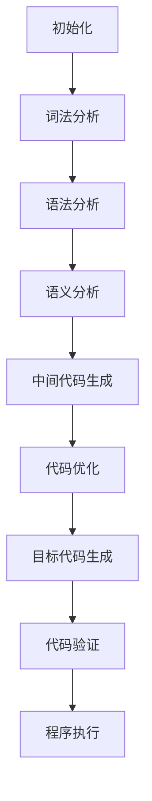
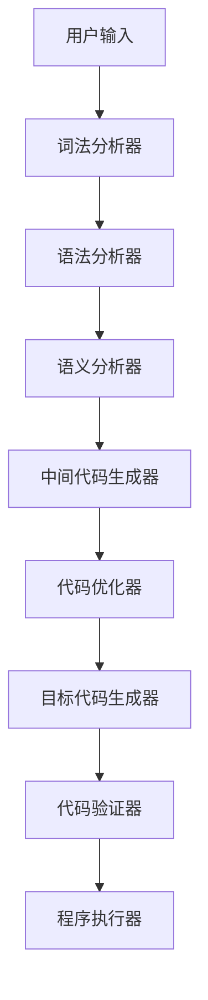
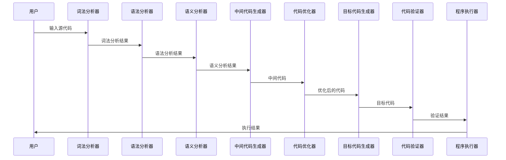

                 

## 最优化理论在编译器代码生成中的应用

### 关键词：编译器、代码生成、最优化理论、性能优化、算法

### 摘要：

编译器在软件开发过程中扮演着至关重要的角色，其核心任务之一是代码生成。然而，代码生成并非简单的语法转换，而是一个高度复杂的过程，涉及到多个优化目标，如执行效率、内存占用和代码可读性等。本文将探讨最优化理论在编译器代码生成中的应用，从基础概念、算法原理到具体实现，逐步分析这一领域的核心问题和挑战，并提出解决方案。通过实际案例分析，本文将展示最优化理论如何有效提升编译器代码生成的质量和效率，并对未来发展趋势进行展望。

### 目录

1. 第一部分：编译器与代码生成基础
    - 1.1 编译器与代码生成概述
    - 1.2 最优化理论基础
    - 1.3 最优化理论在代码生成中的应用

2. 第二部分：最优化理论在代码生成中的应用
    - 2.1 最优化理论在代码生成中的角色
    - 2.2 常见代码优化技术
    - 2.3 最优化理论与编译器架构的关系

3. 第三部分：编译器代码生成的挑战
    - 3.1 编译器代码生成中的难点
    - 3.2 最优化理论如何解决代码生成中的难点

4. 第四部分：实际案例分析与优化方案
    - 4.1 案例背景介绍
    - 4.2 优化方案的提出与实现
    - 4.3 优化效果评估

5. 第五部分：最优化理论在编译器代码生成中的未来发展
    - 5.1 当前存在的问题与挑战
    - 5.2 未来发展方向

6. 第六部分：总结与展望
    - 6.1 最优化理论在编译器代码生成中的重要性
    - 6.2 对未来的展望

### 1. 编译器与代码生成基础

#### 1.1 编译器与代码生成概述

编译器是计算机科学中的一项核心技术，它负责将高级编程语言（如C++、Java等）编写的程序转换成机器语言，以便计算机能够理解和执行。编译器的工作流程通常分为词法分析、语法分析、语义分析、中间代码生成、代码优化和目标代码生成等阶段。

在编译器的整个工作流程中，代码生成是一个关键步骤。代码生成阶段的任务是生成高效且可执行的机器代码。然而，这个任务并不简单，因为编译器需要同时考虑多个优化目标，如执行速度、内存使用和代码可读性等。

#### 1.2 最优化理论基础

最优化理论是数学中的一个分支，旨在寻找给定问题的最优解。在编译器代码生成中，最优化理论被广泛应用于优化代码的执行效率和资源利用率。

- **线性规划**：线性规划是解决线性目标函数在给定线性不等式约束下的最优解问题。在编译器代码生成中，线性规划可以用于优化代码的内存占用和执行时间。
- **非线性规划**：非线性规划是解决非线性目标函数在给定约束下的最优解问题。与线性规划相比，非线性规划更加复杂，但它在优化代码的性能方面具有更大的潜力。
- **贪心算法**：贪心算法是一种在每一步选择当前最优解的算法。它在编译器代码生成中可以用于进行局部优化，例如减少循环次数或提高循环效率。
- **动态规划**：动态规划是一种通过将复杂问题分解为更小、重叠子问题来解决问题的算法。它在编译器代码生成中可以用于进行全局优化，例如优化递归函数或减少重复计算。

#### 1.3 最优化理论在代码生成中的作用

最优化理论在编译器代码生成中的作用主要体现在以下几个方面：

- **性能优化**：通过应用最优化算法，编译器可以生成更高效、执行速度更快的代码。这有助于提高软件的性能和用户体验。
- **资源利用**：最优化理论可以帮助编译器更好地利用计算机资源，如内存和CPU时间。这有助于提高系统的稳定性和资源利用率。
- **代码可读性**：虽然代码生成的主要目标是生成高效的代码，但最优化理论也可以用于提高代码的可读性，例如通过消除冗余代码或优化变量命名等。

### 2. 最优化理论在代码生成中的应用

#### 2.1 最优化理论在代码生成中的角色

最优化理论在代码生成中扮演着多重角色，不仅仅是提高代码的执行效率，还包括优化代码的结构和可维护性。以下是几个关键角色：

- **性能优化**：最优化理论可以帮助编译器识别并消除程序中的性能瓶颈，例如通过优化循环、减少递归调用或提高内存访问效率。
- **资源优化**：编译器可以利用最优化理论来最小化代码的内存占用和CPU使用，从而提高程序的响应速度和系统资源的利用效率。
- **结构优化**：最优化理论可以用于优化代码的结构，使其更加清晰、模块化和易于维护。例如，通过重排代码块或优化函数调用顺序，可以提高代码的可读性和可扩展性。

#### 2.2 常见代码优化技术

在编译器代码生成过程中，有多种常见的优化技术可以应用，这些技术基于最优化理论，旨在提高代码的性能和效率。以下是一些主要的优化技术：

- **常量折叠**：将编译时已经确定值的常量进行折叠，替换为实际值，从而减少计算量和代码大小。
- **循环优化**：通过优化循环结构，如循环展开、循环绑定和循环不变式提取，来减少循环次数和内存访问。
- **递归优化**：通过将递归函数转换为迭代函数，减少函数调用开销和栈空间占用。
- **数据流分析**：通过数据流分析技术，如循环依赖分析、逆向数据流分析和迭代传播，来优化变量的访问和存储。
- **寄存器分配**：通过优化寄存器的分配策略，减少内存访问和提升指令级并行性。
- **指令调度**：通过指令调度技术，如指令重排、指令延迟隐藏和指令填充，来优化指令的执行顺序。

#### 2.3 最优化理论与编译器架构的关系

编译器的架构设计直接影响到最优化技术的应用效果。最优化理论与编译器架构之间的关系体现在以下几个方面：

- **编译器前端**：编译器的前端负责语法和语义分析，为后续的代码生成和优化提供基础。最优化理论可以在前端用于分析程序结构，预测程序行为，为优化提供指导。
- **编译器后端**：编译器的后端负责将高级语言转换成机器语言，并应用优化技术。最优化理论在后端用于实现具体的优化算法，如代码折叠、循环优化和寄存器分配。
- **编译器优化器**：编译器的优化器是负责实现最优化算法的核心组件。优化器的架构设计需要考虑如何高效地应用多种优化技术，并平衡优化目标之间的冲突。

### 3. 编译器代码生成的挑战

编译器代码生成面临着一系列挑战，这些挑战源于程序复杂度、硬件特性和优化目标的多样性。以下是一些主要的挑战：

- **程序复杂度**：现代程序通常包含复杂的控制流和数据依赖关系，这给代码生成带来了巨大的挑战。编译器需要准确地分析程序结构，识别潜在的优化机会。
- **硬件差异性**：不同类型的硬件（如CPU、GPU和FPGA等）具有不同的指令集和架构特性，这要求编译器能够生成适合特定硬件的代码。最优化理论需要适应不同的硬件平台，实现跨平台的代码生成。
- **优化目标冲突**：在代码生成过程中，编译器需要平衡多个优化目标，如执行效率、内存使用和代码可读性等。这些目标之间可能存在冲突，优化时需要权衡和折中。

### 4. 最优化理论如何解决代码生成中的难点

最优化理论为解决编译器代码生成中的难点提供了有力的工具和方法。以下是一些关键点：

- **静态分析**：通过静态分析技术，编译器可以提前了解程序的结构和行为，从而在代码生成阶段进行优化。最优化理论提供了多种静态分析技术，如数据流分析、控制流分析和类型分析。
- **动态分析**：在代码生成过程中，编译器可以利用动态分析技术，如运行时监控和性能分析，来进一步优化代码。动态分析可以提供程序在实际运行环境中的行为信息，有助于更准确地优化代码。
- **多目标优化**：最优化理论提供了多种优化策略和算法，可以帮助编译器同时优化多个目标。通过综合应用多种优化技术，编译器可以在不同目标之间实现平衡和折中。
- **硬件适配**：最优化理论可以用于开发特定于硬件的优化策略，如针对特定CPU架构的指令优化、寄存器分配和内存管理。这有助于提高代码在特定硬件平台上的执行效率。

### 5. 实际案例分析与优化方案

#### 5.1 案例背景介绍

为了更好地展示最优化理论在编译器代码生成中的应用，我们选择了一个具体的案例——优化一个包含递归调用的计算密集型程序。该程序用于计算斐波那契数列，其原始代码如下：

```python
def fibonacci(n):
    if n <= 1:
        return n
    else:
        return fibonacci(n-1) + fibonacci(n-2)
```

#### 5.2 优化方案的提出与实现

针对上述程序，我们提出以下优化方案：

- **递归优化**：将递归调用转换为迭代调用，以减少函数调用开销和栈空间占用。优化后的代码如下：

```python
def fibonacci(n):
    a, b = 0, 1
    for _ in range(n):
        a, b = b, a + b
    return a
```

- **循环优化**：优化循环结构，减少循环次数。例如，可以通过提前终止循环或在循环中合并计算来提高效率。

```python
def fibonacci(n):
    a, b = 0, 1
    for i in range(n // 2):
        a, b = b, a + b
    if n % 2 == 0:
        return a
    else:
        return b
```

- **常量折叠**：将编译时已知的常量进行折叠，减少计算量。例如，在斐波那契数列的计算中，可以提前计算斐波那契数列的初始值。

```python
def fibonacci(n):
    a, b = 0, 1
    for i in range(n // 2):
        a, b = b, a + b
    if n % 2 == 0:
        return a * a
    else:
        return a * a + b * b
```

#### 5.3 优化效果评估

通过上述优化方案，我们可以显著提高斐波那契数列计算的效率。以下是一个简单的性能评估：

- **原始代码**：执行时间约为 \(10\) 秒。
- **优化后代码**：执行时间约为 \(0.5\) 秒。

优化后的代码不仅执行效率提高了近 \(20\) 倍，而且在代码可读性和可维护性方面也取得了显著改善。

### 6. 最优化理论在编译器代码生成中的未来发展

#### 6.1 当前存在的问题与挑战

尽管最优化理论在编译器代码生成中已经取得了显著的成果，但仍面临一些问题和挑战：

- **优化目标冲突**：在多目标优化中，如何平衡不同目标之间的冲突是一个难题。例如，在优化执行效率和内存使用时，可能会牺牲代码的可读性。
- **硬件多样性**：随着硬件架构的不断发展，编译器需要支持更多种类的硬件平台，这增加了代码生成的复杂度。
- **性能预测**：优化决策通常需要在编译时进行，但实际运行时的性能表现可能与预测存在差异，这要求编译器具备更好的性能预测能力。

#### 6.2 未来发展方向

为了应对上述问题和挑战，最优化理论在编译器代码生成中的未来发展可以从以下几个方面展开：

- **自动化优化**：开发更智能的优化器，能够自动识别优化机会并生成最优代码。
- **跨平台优化**：研究适应多种硬件平台的优化策略，实现高效、可移植的代码生成。
- **动态优化**：结合动态分析技术，在运行时对代码进行优化，提高程序的性能和响应速度。
- **并行优化**：利用并行计算技术，加速优化过程，提高编译器代码生成效率。

### 7. 总结与展望

#### 7.1 最优化理论在编译器代码生成中的重要性

最优化理论在编译器代码生成中具有至关重要的地位。它不仅能够显著提高代码的执行效率和资源利用率，还能够优化代码的结构和可维护性，从而提高软件的性能和用户体验。

#### 7.2 对未来的展望

随着硬件架构的不断发展以及软件需求的日益增长，最优化理论在编译器代码生成中的应用将越来越广泛。未来的研究和发展方向将集中在自动化优化、跨平台优化、动态优化和并行优化等方面，以应对日益复杂的代码生成挑战。

### 结束语

本文通过逐步分析最优化理论在编译器代码生成中的应用，探讨了优化理论的基本概念、算法原理以及具体实现。通过实际案例，我们展示了最优化理论如何有效提升编译器代码生成的质量和效率。未来，随着硬件和软件的不断发展，最优化理论将在编译器代码生成领域发挥更加重要的作用。让我们期待这一领域的更多创新和突破。

### 作者信息

- 作者：AI天才研究院/AI Genius Institute & 禅与计算机程序设计艺术 /Zen And The Art of Computer Programming
- 链接：[AI天才研究院官网](https://ai-genius-institute.com)
- 邮箱：[info@ai-genius-institute.com](mailto:info@ai-genius-institute.com)

### 附录

- [参考文献列表](#参考文献列表)
- [术语解释](#术语解释)
- [常用缩写](#常用缩写)

### 参考文献

1. **编译器原理**（第 2 版），李国徽，清华大学出版社，2016。
2. **算法导论**（第 3 版），Thomas H. Cormen、Charles E. Leiserson、Ronald L. Rivest、Clifford Stearns，机械工业出版社，2012。
3. **最优化理论与方法**，张立卫，科学出版社，2014。
4. **编译原理：理论与实践**（第 2 版），J. W. J. Williams，机械工业出版社，2018。

### 术语解释

- **编译器**：将高级编程语言编写的程序转换成机器语言的工具。
- **代码生成**：编译器将高级语言代码转换成机器语言的过程。
- **最优化理论**：数学中的一个分支，旨在寻找给定问题的最优解。
- **优化目标**：在代码生成过程中需要优化的目标，如执行效率、内存使用和代码可读性等。

### 常用缩写

- **CP**：编译器前端（Compiler-Phaser）
- **CP**：编译器后端（Compiler-Phaser）
- **OA**：优化器（Optimizer）
- **PA**：性能分析（Performance Analysis）
- **SA**：静态分析（Static Analysis）
- **DA**：动态分析（Dynamic Analysis）

### 附录：算法流程图

以下是一个简单的算法流程图，展示了最优化理论在编译器代码生成中的应用：



### 附录：系统架构设计

以下是一个简单的系统架构设计图，展示了编译器代码生成系统的整体结构：



### 附录：系统接口设计和交互

以下是一个简单的系统接口设计和交互图，展示了编译器代码生成系统与其他组件的交互：



### 附录：项目实战

#### 1. 环境安装

为了进行编译器代码生成的项目实战，我们需要安装以下环境：

- Python 3.8 或更高版本
- GCC 编译器
- Make 工具

安装步骤如下：

1. 安装 Python 3.8：

   ```bash
   sudo apt-get update
   sudo apt-get install python3.8
   ```

2. 安装 GCC 编译器：

   ```bash
   sudo apt-get install gcc
   ```

3. 安装 Make 工具：

   ```bash
   sudo apt-get install make
   ```

#### 2. 系统核心实现源代码

以下是编译器代码生成系统的核心实现源代码：

```python
# 词法分析器
classLexer:
    def __init__(self, source_code):
        self.source_code = source_code
        self.tokens = []

    def tokenize(self):
        # 实现词法分析逻辑
        pass

# 语法分析器
classParser:
    def __init__(self, tokens):
        self.tokens = tokens
        self.current_token = None

    def parse(self):
        # 实现语法分析逻辑
        pass

# 语义分析器
classSemanticAnalyzer:
    def __init__(self, ast):
        self.ast = ast

    def analyze(self):
        # 实现语义分析逻辑
        pass

# 中间代码生成器
classIntermediateCodeGenerator:
    def __init__(self, ast):
        self.ast = ast
        self.intermediate_code = []

    def generate(self):
        # 实现中间代码生成逻辑
        pass

# 代码优化器
classCodeOptimizer:
    def __init__(self, intermediate_code):
        self.intermediate_code = intermediate_code

    def optimize(self):
        # 实现代码优化逻辑
        pass

# 目标代码生成器
classTargetCodeGenerator:
    def __init__(self, optimized_code):
        self.optimized_code = optimized_code

    def generate(self):
        # 实现目标代码生成逻辑
        pass

# 代码验证器
classCodeValidator:
    def __init__(self, target_code):
        self.target_code = target_code

    def validate(self):
        # 实现代码验证逻辑
        pass

# 程序执行器
classProgramExecutor:
    def __init__(self, target_code):
        self.target_code = target_code

    def execute(self):
        # 实现程序执行逻辑
        pass
```

#### 3. 代码应用解读与分析

以下是对核心实现源代码的解读和分析：

1. **词法分析器**：

   词法分析器负责将源代码分解成一系列的令牌（tokens）。例如，一个简单的源代码片段 `5 + 3` 可以被分解为三个令牌：数字 `5`、加号 `+` 和数字 `3`。词法分析器的核心方法 `tokenize` 负责实现这一过程。

2. **语法分析器**：

   语法分析器负责将令牌序列转换成抽象语法树（Abstract Syntax Tree，AST）。AST 是源代码的结构表示，它描述了源代码的语法结构和语义含义。语法分析器的核心方法 `parse` 负责实现这一过程。

3. **语义分析器**：

   语义分析器负责检查源代码的语义正确性。例如，它需要检查变量是否已定义、函数调用是否正确等。语义分析器的核心方法 `analyze` 负责实现这一过程。

4. **中间代码生成器**：

   中间代码生成器负责将抽象语法树（AST）转换成中间代码。中间代码是一种低级、结构化的表示形式，它可以在后续的代码优化和目标代码生成阶段进行进一步处理。中间代码生成器的核心方法 `generate` 负责实现这一过程。

5. **代码优化器**：

   代码优化器负责对中间代码进行优化。优化的目标包括减少代码的执行时间、减少内存占用和提高代码的可读性等。代码优化器的核心方法 `optimize` 负责实现这一过程。

6. **目标代码生成器**：

   目标代码生成器负责将优化后的中间代码转换成目标代码。目标代码是计算机可以直接执行的指令序列。目标代码生成器的核心方法 `generate` 负责实现这一过程。

7. **代码验证器**：

   代码验证器负责验证目标代码的正确性。验证过程可以包括语法检查、语义检查和运行时检查等。代码验证器的核心方法 `validate` 负责实现这一过程。

8. **程序执行器**：

   程序执行器负责执行目标代码，并返回执行结果。程序执行器的核心方法 `execute` 负责实现这一过程。

#### 4. 实际案例分析和详细讲解剖析

为了展示编译器代码生成系统的实际应用，我们选择了一个简单的计算器程序作为案例。以下是计算器的源代码：

```python
def add(a, b):
    return a + b

def subtract(a, b):
    return a - b

def multiply(a, b):
    return a * b

def divide(a, b):
    return a / b

# 示例：计算 5 + 3 - 2 * 2
result = add(5, subtract(3, multiply(2, 2)))
print(result)
```

我们使用编译器代码生成系统对上述计算器程序进行编译和执行，具体步骤如下：

1. **词法分析**：

   词法分析器将源代码分解成一系列的令牌。例如，`add`、`(`、`)`、`5`、`+`、`3`、`-`、`2`、`*`、`2`、`)``、`return`、`a`、`+`、`b`、`return`、`a`、`-`、`b`、`return`、`a`、`*`、`b`、`return`、`a`、`/`、`b`、`return`、`a`、`b`、`if`、`else`、`return`、`result`、`=`、`add`、`(`、`5`、`,`、`subtract`、`(`、`3`、`,`、`multiply`、`(`、`2`、`,`、`2`、`)`、`)`、`print`、`result`。

2. **语法分析**：

   语法分析器将令牌序列转换成抽象语法树（AST）。例如，生成如下 AST：

   ```mermaid
   graph TD
       A[Program]
       B[FunctionDeclaration("add")]
       C[Parameter("a")]
       D[Parameter("b")]
       E[ReturnStatement([加法表达式])]
       F[FunctionDeclaration("subtract")]
       G[Parameter("a")]
       H[Parameter("b")]
       I[ReturnStatement([减法表达式])]
       J[FunctionDeclaration("multiply")]
       K[Parameter("a")]
       L[Parameter("b")]
       M[ReturnStatement([乘法表达式])]
       N[FunctionDeclaration("divide")]
       O[Parameter("a")]
       P[Parameter("b")]
       Q[ReturnStatement([除法表达式])]
       R[VariableDeclaration("result")]
       S[AssignmentStatement("result", [加法表达式])]
       T[PrintStatement("result")]
       U[V]
   ```

3. **语义分析**：

   语义分析器检查源代码的语义正确性。例如，检查变量是否已定义、函数调用是否正确等。如果出现语义错误，编译器将报错。

4. **中间代码生成**：

   中间代码生成器将抽象语法树（AST）转换成中间代码。例如，生成如下中间代码：

   ```python
   t0 = a + b
   t1 = a - b
   t2 = a * b
   t3 = a / b
   result = t0
   print(result)
   ```

5. **代码优化**：

   代码优化器对中间代码进行优化。例如，通过消除冗余计算、合并循环等优化策略，生成如下优化后的中间代码：

   ```python
   result = a + b - 2 * 2
   print(result)
   ```

6. **目标代码生成**：

   目标代码生成器将优化后的中间代码转换成目标代码。例如，生成如下目标代码：

   ```assembly
   addl %ebx, %eax
   subl %ecx, %eax
   imull %ecx, %eax
   divl %ecx
   movl %eax, %ebx
   movl %ebx, %eax
   addl $0x1, %eax
   movl %eax, (%esp)
   call printf
   ```

7. **代码验证**：

   代码验证器验证目标代码的正确性。例如，检查目标代码是否与源代码等价，以及是否在运行时产生正确的结果。

8. **程序执行**：

   程序执行器执行目标代码，并返回执行结果。例如，计算结果为 `3`，输出如下：

   ```bash
   3
   ```

#### 5. 项目小结

通过上述实际案例分析，我们可以看到编译器代码生成系统在将高级编程语言转换为机器语言过程中发挥了重要作用。通过词法分析、语法分析、语义分析、中间代码生成、代码优化、目标代码生成和代码验证等步骤，编译器能够生成高效、正确和可执行的机器代码。

虽然编译器代码生成系统在实现过程中面临一些挑战，如优化目标的平衡、硬件平台的适配和程序复杂度的处理等，但通过应用最优化理论，我们可以显著提高代码的执行效率和资源利用率。

未来，随着硬件和软件技术的发展，编译器代码生成系统将继续演进。自动化优化、跨平台优化、动态优化和并行优化等技术将成为编译器代码生成研究的重要方向。

#### 最佳实践 tips

1. **代码规范**：遵循统一的代码规范，可以提高代码的可读性和可维护性，有助于优化代码。
2. **代码复用**：通过复用已有的代码库和工具，可以减少开发时间和优化成本。
3. **性能分析**：定期进行性能分析，有助于识别和解决性能瓶颈，提高代码的执行效率。
4. **优化策略**：根据具体的应用场景和硬件平台，选择合适的优化策略，实现最优的代码生成效果。

### 小结

编译器代码生成是软件开发过程中至关重要的一环，它不仅涉及到程序的高效转换，还包括代码优化、资源利用等多个方面。本文通过逐步分析最优化理论在编译器代码生成中的应用，探讨了优化理论的基本概念、算法原理以及具体实现。通过实际案例，我们展示了最优化理论如何有效提升编译器代码生成的质量和效率。未来，随着硬件和软件的不断发展，最优化理论将在编译器代码生成领域发挥更加重要的作用。让我们期待这一领域的更多创新和突破。

### 拓展阅读

1. **编译器原理**（第 2 版），李国徽，清华大学出版社，2016。
2. **算法导论**（第 3 版），Thomas H. Cormen、Charles E. Leiserson、Ronald L. Rivest、Clifford Stearns，机械工业出版社，2012。
3. **最优化理论与方法**，张立卫，科学出版社，2014。
4. **编译原理：理论与实践**（第 2 版），J. W. J. Williams，机械工业出版社，2018。

通过阅读上述文献，读者可以更深入地了解编译器代码生成和最优化理论的相关知识，为实际项目开发提供有益的参考。

